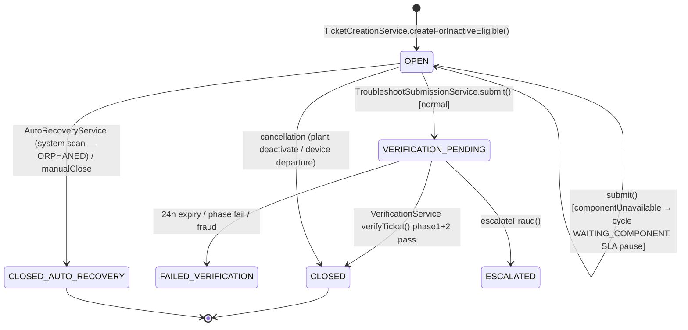
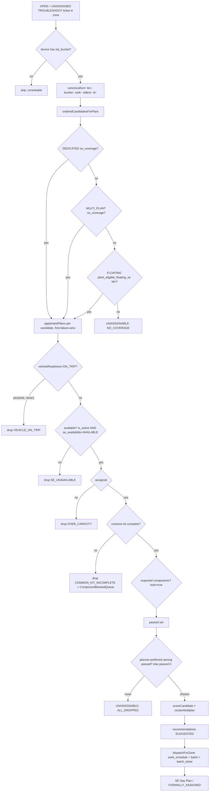
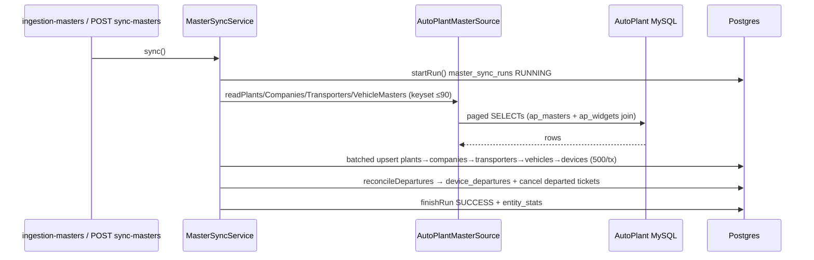
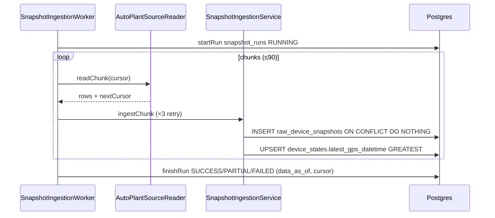
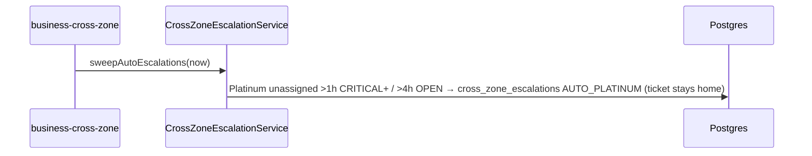
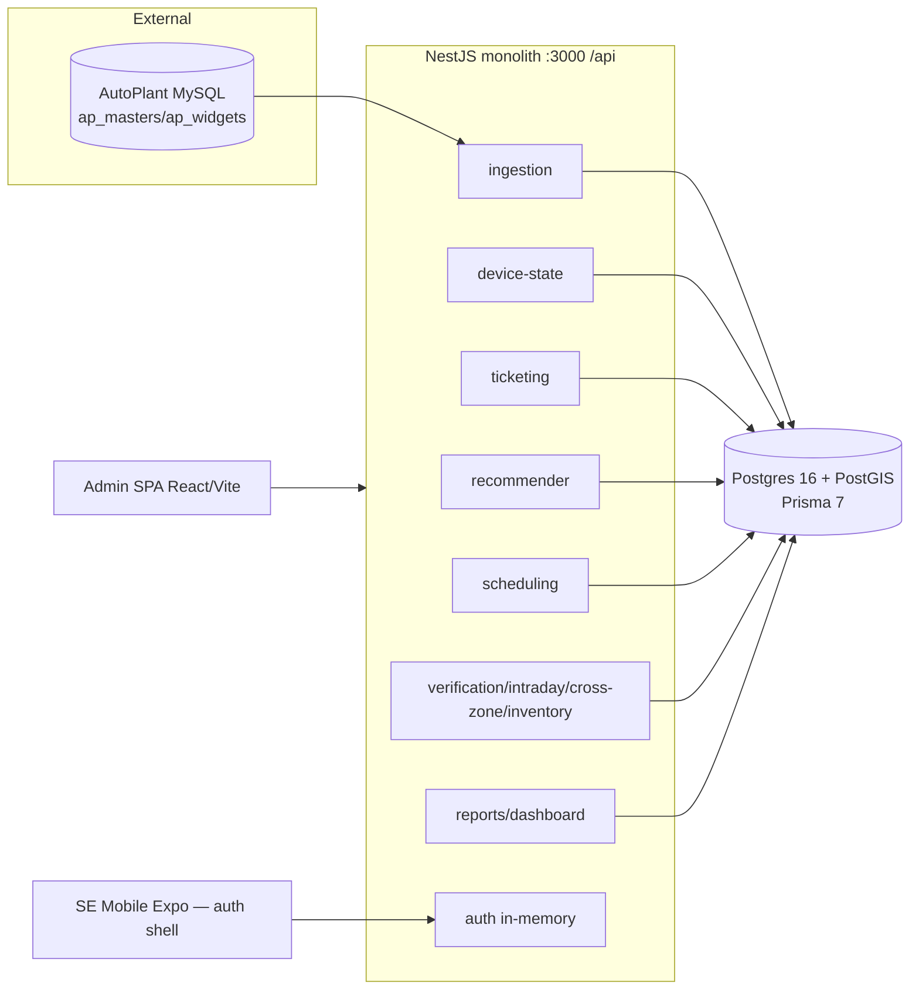
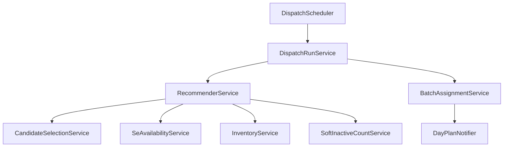
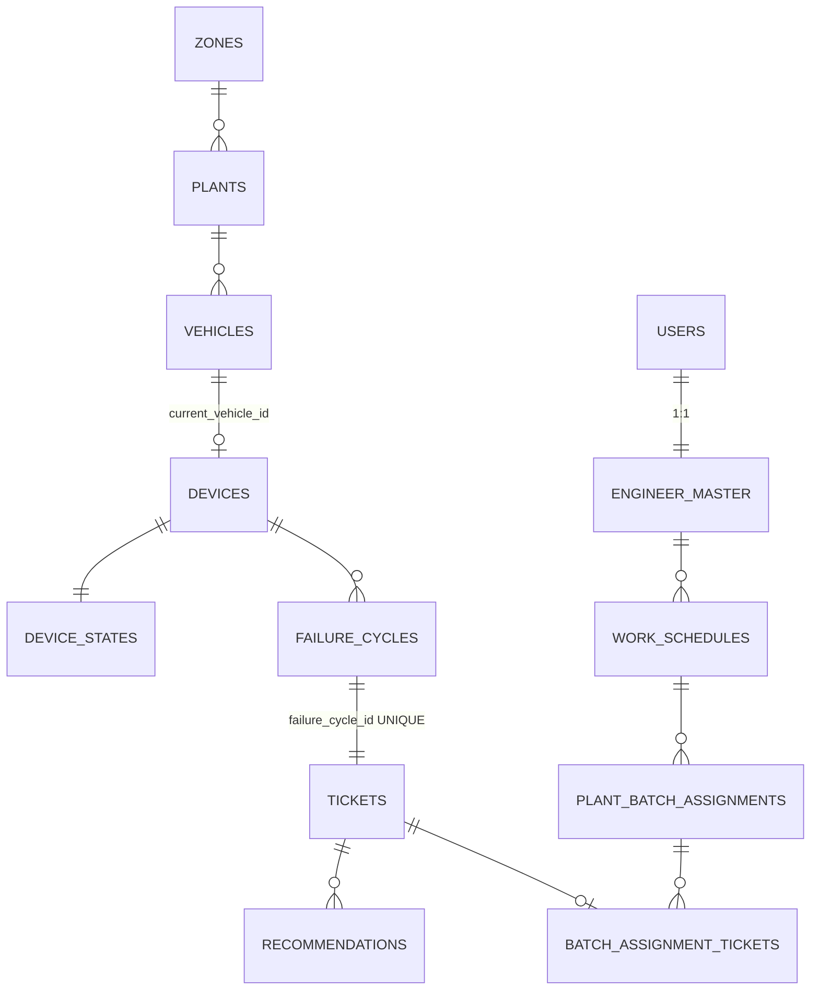

# FSM Platform — Backend Bible (Second-Pass Audit)

**Purpose:** the definitive, evidence-backed technical reference for the FSM backend. This is a
*peer-review-grade re-audit* of `FSM-PLATFORM-DEFINITIVE-ARCHITECTURE.md` — every important Round-1
conclusion is re-verified against source code and live PostgreSQL, wrong/imprecise claims are
corrected, and new findings are added. Written 2026-07-21 on branch `feat/autoplant-integration`.

**Evidence key:** ✅ Proven (code + SQL) · ⚠ Inferred (indirect) · ❌ Incorrect / disproven ·
🆕 New finding this pass · **"Unable to verify from available evidence."**

> **Access at audit time**
> - **FSM Postgres** `localhost:5433/fsm` (PG 16.14) — reachable; all SQL below is live.
> - **AutoPlant MySQL** `10.0.0.25:3306` — **not reachable from the audit shell** (`ETIMEDOUT`), but
>   🆕 **it IS reachable from the application server**: a snapshot run (`snapshot_runs.run_id=88`) was
>   in flight ~2 min old at audit time and `max(gps_datetime)=2026-07-21 05:14:21Z`. So AutoPlant is
>   live to the backend; only this shell lacks the VPN. AutoPlant-schema claims still cannot be run
>   directly here and are marked accordingly.

---

## PART 1 — Audit of the previous report

| # | Round-1 conclusion | Verdict | Why / evidence |
|---|---|---|---|
| 1 | Batch 160 = plant 11, 1453 tickets, ZM_MANUAL | ✅ Proven | `work_schedules 96` `source=ZM_MANUAL, run_id=NULL`; batch 160→1453 `batch_assignment_tickets`; **audit_logs: 1453 rows `MANUAL_PLANT_ASSIGN`** (§2). |
| 2 | Batch 161 = plant 19, 791 tickets, ZM_MANUAL | ✅ Proven | `work_schedules 97` `ZM_MANUAL`; 791 tickets; 791 `MANUAL_PLANT_ASSIGN` audit rows. |
| 3 | The 1453/791 batches came from `assignPlants()` | ✅ Proven (was ⚠ inferred) | `MANUAL_PLANT_ASSIGN` is emitted **only** by `assignTicket()` called from `assignPlants()` (`override.service.ts:332`). Not `CRITICAL_ASSIGN` (3 rows) nor same-day update. |
| 4 | Manual path has no capacity cap | ✅ Proven | `assignTicket` (`override.service.ts:237-301`) has no capacity check; `assignPlants` fetches all OPEN+UNASSIGNED with no limit (`:325-329`). |
| 5 | Automated path caps at `daily_capacity`=25 | ✅ Proven | `recommender.service.ts:193` `overCapacity`; all 75 engineers `daily_capacity=25`; plant 103 = 25 DISPATCHED + 1237 UNASSIGNABLE. |
| 6 | `eligibility_mode = all-deployed` | ✅ Proven (was ⚠ inferred) | `system_settings` row: `eligibility_mode = 'all-deployed'`. |
| 7 | "11,344 devices: open cycle but active" (auto-recovery not running) | ⚠→✅ **Refined & strengthened** | The *count* was right, but the *cause* was imprecise. Root cause is stronger: the auto-recovery **scan has no caller at all** (§6), not merely "sweeps OFF". |
| 8 | Round-1 implied auto-recovery runs via the #108 cron | ❌ **Incorrect** | `AutoRecoveryService.runAutoRecovery()` is **not** in `business-sweep-scheduler.service.ts` and has no HTTP route; its only caller is a test (§6). This pass corrects it. |
| 9 | No round-robin / nearest / skills in assignment | ✅ Proven | `candidate-selection.service.ts` orders by coverage tier then `se_id`; distance is deferred-null; no skills table. |
| 10 | Invariant I1 & one-active-batch hold (0 violations) | ✅ Proven | Live dup checks = 0; partial-unique indexes confirmed in `pg_indexes` (§12). |
| 11 | SE identity on `users`, config on `engineer_master`, 1:1 | ✅ Proven | 75/75 linked; `engineer_master` has no name/phone/email column. |
| 12 | AutoPlant unreachable | ⚠ **Partially wrong** | Unreachable from the *shell*, but reachable from the *server* (run 88 live; fresh pings). Corrected in the banner. |

**Net:** one conclusion was outright incorrect (#8), one partially wrong (#12), one upgraded from
inferred to proven (#3/#6). No Round-1 conclusion was falsified in its core (Part 9 stands).

---

## PART 2 — Prove Batch 160 & 161 (full execution path)

### 2.1 The data chain (live)

```
work_schedules.schedule_id = 96
  source   = ZM_MANUAL          <-- OverrideService.ensureSchedule (override.service.ts:447)
  run_id   = NULL               <-- not a dispatch-run product
  se_id    = 016a0edb-...       zone_id = 3   dateFrom = 2026-07-20
        │
        ▼  (schedule_id 96)
plant_batch_assignments.batch_id = 160  (plant_id=11, se_id=016a0edb, status=AUTO_ASSIGNED, stop 1)
        │
        ▼  (batch_id 160)
batch_assignment_tickets  ──►  1453 rows (sort_order 1..1453, removed_at NULL)
        │  e.g. id=2266 ticket=d8fb69ec-... sort_order=1
        ▼  (ticket_id)
tickets  ──►  status=OPEN, assignment_state=FORMALLY_ASSIGNED, work_type=TROUBLESHOOT, plant_id=11
```

Batch 161 is identical with `schedule 97 / batch 161 / plant 19 / se 385981bd / 791 tickets`.

### 2.2 Provenance proof (challenging the inference)

Round 1 *inferred* `assignPlants` from `source=ZM_MANUAL + run_id=NULL`. But `ZM_MANUAL` schedules are
also produced by same-day update and single-ticket override (all share `ensureSchedule`). The
**audit trail settles it**:

```sql
SELECT a.action, a.actor_role, count(*)
FROM audit_logs a
WHERE a.entity_type='ticket'
  AND a.entity_id IN (SELECT ticket_id::text FROM batch_assignment_tickets WHERE batch_id=160)
GROUP BY 1,2;
-- MANUAL_PLANT_ASSIGN | OPERATIONS_HEAD | 1453
```

Batch 161 → `MANUAL_PLANT_ASSIGN | ZONAL_MANAGER | 791`. Sample metadata:
`{"seId":"016a0edb-…"}`, `actor_id=33333333-3333-3333-3333-333333333333`.

`MANUAL_PLANT_ASSIGN` is the `auditAction` passed **only** on the `assignPlants → assignTicket` path
(`override.service.ts:332`); the Critical one-click uses `CRITICAL_ASSIGN`, same-day ADD uses
`MANUAL_ZM_UPDATE`. Therefore batch 160/161 were created by
**`POST /api/schedules/assign-plants`** — and by **two different operators** (an OH did plant 11, a
ZM did plant 19). ✅ Proven.

### 2.3 API request → DB writes (execution trace)

```
POST /api/schedules/assign-plants  { seId, plantIds:[...] }
  └─ SchedulesController.assignPlants                       schedules.controller.ts:92-104
       (guards: AuthGuard→RoleGuard→ZoneScopeGuard; @Roles(MANAGER_ROLES))
     └─ OverrideService.assignPlants(plantIds, seId, scope, actor)   override.service.ts:311-340
          for each plantId:
            prisma.ticket.findMany({plantId, status:OPEN, assignmentState:UNASSIGNED})  ← NO LIMIT (:325)
            for each ticket:
              OverrideService.assignTicket(ticketId, seId, ..., 'MANUAL_PLANT_ASSIGN')  :237-301
                └─ AuditService.withAudit(...)  ← writes audit_logs row (action MANUAL_PLANT_ASSIGN)
                     tx: ensureSchedule()  → INSERT work_schedules (source='ZM_MANUAL')  :429-449
                         findFirst/create plant_batch_assignment (schedule,plant,se)     :276-289
                         INSERT batch_assignment_tickets (batchId, ticketId, sortOrder)  :290-292
                         UPDATE tickets SET assignment_state='FORMALLY_ASSIGNED'          :293
```

**Where `ZM_MANUAL` is assigned:** `OverrideService.ensureSchedule()`, `override.service.ts:447`
(`source: 'ZM_MANUAL'`) — the fallback branch that creates a schedule when the target SE has none for
the day. There is no repository layer; the service uses `PrismaService`/`tx` directly.

---

## PART 3 — Automatic vs Manual assignment (side by side)

| Aspect | Automatic dispatch | Manual assignment |
|---|---|---|
| Entry API | `POST /api/schedules/dispatch-run` / cron `business-dispatch` | `POST /api/schedules/assign-plants` |
| Orchestrator | `DispatchRunService.runForActiveZones` `dispatch-run.service.ts:70` | `OverrideService.assignPlants` `override.service.ts:311` |
| Candidate/scoring | `RecommenderService.runForZone` `recommender.service.ts:97` | **none** — operator names the SE |
| **Capacity check** | **YES** — `overCapacity: assigned>=daily_capacity` `recommender.service.ts:193`, filter `hard-filters.ts:43` | **NO** — `assignTicket` has no capacity logic `override.service.ts:237-301` |
| Availability / kit filters | YES (`SE_UNAVAILABLE`, `COMMON_KIT_INCOMPLETE`) | NO |
| Batch writer | `BatchAssignmentService.dispatchForZone` `batch-assignment.service.ts:116` | `assignTicket` reuses `(schedule,plant,se)` batch `override.service.ts:276-289` |
| Per-SE per-day size | ≤ `daily_capacity` (25) | **unbounded** |
| Schedule `source` | `SYSTEM_GENERATED` | `ZM_MANUAL` |
| `run_id` | dispatch-run id (e.g. 3) | NULL |
| Recommendation rows | SUGGESTED→DISPATCHED / UNASSIGNABLE | none |
| Audit action | `DISPATCH_RUN_STARTED/FINISHED` | `MANUAL_PLANT_ASSIGN` |

### Where the paths diverge

Both ultimately create the same three-table structure (`work_schedules` →
`plant_batch_assignments` → `batch_assignment_tickets`) and flip the ticket to
`FORMALLY_ASSIGNED`. They diverge **before** the write, at candidate selection:

- The automated path routes through the **recommender loop**, which maintains a per-run
  `assigned: Map<seId, count>` and, via `applyHardFilters`, refuses to assign a ticket to an SE whose
  `assigned >= daily_capacity` — the surplus becomes `UNASSIGNABLE (NO_ELIGIBLE_SE)`. So one SE never
  exceeds 25/day.
- The manual path is an **explicit operator override**: `assignPlants` iterates every open ticket of
  the plant and calls `assignTicket`, which only checks *scope / already-assigned / SE-exists*. There
  is no `assigned` counter and no `daily_capacity` read anywhere on this path. **This is the entire
  reason one path caps at 25 and the other does not.**

🆕 **Design gap:** the manual path is *intended* to be authoritative (a ZM override can exceed engine
limits), but it has **no upper sanity bound and no warning** — 1453 tickets/SE/day is physically
impossible (capacity 25) yet accepted silently. See Part 16 (P1).

---

## PART 4 — Why Plant 11 has 1453 tickets

Plant 11 = **RCP-9211**, zone 3, `source_plant_id=3093`, `status=ACTIVE`, **not deactivated**, single
tenant **Nuvista** (company 4, **SILVER** tier).

| Metric | Value | Query evidence |
|---|---|---|
| Total tickets (all time) | **2,039** (1,453 OPEN, 586 CLOSED) | `tickets WHERE plant_id=11` |
| First / last ticket | **2026-07-09 10:53** → **2026-07-20 23:31** | min/max `created_at` |
| Age > 30 / 60 / 90 / 180 / 365 days | **0 / 0 / 0 / 0 / 0** | all created in one ~11-day window |
| Created-month histogram | 100% in **2026-07** | `date_trunc('month')` |
| Distinct devices ticketed | 2,031 | `count(distinct device_id)` |
| `device_states` rows for plant | 2,134 | |
| Companies represented | **1** (Nuvista) | |
| Company tier | **1** (SILVER) | |
| Duplicate OPEN tickets/device | **0** | invariant I1 holds |

**Health of the 1,453 open-ticket devices (the key finding):**

| device_state | count | meaning |
|---|---|---|
| recovered but cycle open (`is_inactive=false`) | **1,272** | device is pinging again; ticket should be closed |
| still genuinely inactive (`is_inactive=true`) | ~181 | real open failures |
| inactivity ≥ 30 days | 7 | |
| inactivity ≥ 90 days | 3 | |
| inactivity ≥ 180 days | 1 | |

Plant-level `device_states` cross-tab also shows **575 departed devices** at plant 11 and **1,073**
rows `is_inactive=false / has_open_failure_cycle=true`.

**By SLA bucket (open tickets):** WARNING 1,136 · RISK 78 · EARLY_RISK 58 · LONG_PENDING 57 ·
HIGH_CRITICAL 37 · SEVERE 35 · CRITICAL 34 · VERY_SEVERE 18.

### Why the backlog exists (proven, not guessed)

1. **The backlog is ~11 days old, not historical.** The pipeline only began creating tickets on
   2026-07-09; every ticket ever created for this plant is from that window (**0 older than 30 days**).
   "Historical years of backlog" is **disproven**.
2. **~88 % (1,272/1,453) are devices that have already recovered** but were never auto-closed —
   because the auto-recovery scan is orphaned (Part 6). This is the dominant driver.
3. **It is a large single-tenant plant** (2,031 devices, all Nuvista) with a `WARNING`-heavy bucket
   profile (short dips over the 24 h threshold), which under `all-deployed` eligibility all became
   tickets.
4. The manual `assignPlants` action then swept the entire open set onto one SE (Part 2).

**Conclusion:** Plant 11's 1,453 is *recent accumulation of un-closed, mostly-recovered tickets*, not
aged backlog. Fixing Part 6 (auto-recovery) would collapse ~1,272 of them.

---

## PART 5 — Complete ticket lifecycle (from code)

### 5.1 State machine (TROUBLESHOOT)



### 5.2 Transition table

| Transition | Service.method | API | Ticket write | Cycle write | device_states | Events |
|---|---|---|---|---|---|---|
| → OPEN | `TicketCreationService.createForInactiveEligible` `ticket-creation.service.ts:80-113` | (pipeline tick) | create OPEN | create OPEN/REPEAT | `has_open_failure_cycle=true` | `ticket_events null→OPEN` |
| OPEN → VERIFICATION_PENDING | `TroubleshootSubmissionService.submit` `troubleshoot-submission.service.ts:206-214` | `POST /api/troubleshoot/submit` | status VERIFICATION_PENDING | OPEN→SUBMITTED | — | event + `audit TROUBLESHOOT_SUBMITTED`; soft states resolved |
| OPEN (component) | same `:151-203` | same | stays OPEN | →WAITING_COMPONENT, `sla_paused=true` | — | `COMPONENT_REQUESTED` + `component_request` row |
| VERIFICATION_PENDING → CLOSED | `VerificationService.finalize` `verification.service.ts:248-303` | cron `business-verification` / `POST /api/verification/run` | CLOSED | →VERIFIED, `closed_at` | `has_open_failure_cycle=false` | event `VERIFICATION_CLOSED`; inventory PRE_VERIFICATION→DEDUCTED |
| VERIFICATION_PENDING → FAILED_VERIFICATION | same | same | FAILED_VERIFICATION | (unchanged) | — | event `VERIFICATION_FAILED/FRAUD`; inventory ROLLED_BACK |
| OPEN → CLOSED_AUTO_RECOVERY (system) | `AutoRecoveryService.closeAsAutoRecovery` `auto-recovery.service.ts:92-126` | **none — orphaned** | CLOSED_AUTO_RECOVERY | →VERIFIED | `has_open_failure_cycle=false` | event |
| OPEN → CLOSED_AUTO_RECOVERY (manual) | `AutoRecoveryService.manualClose` `:61-89` | `POST /api/tickets/:id/auto-recovery` | same | same | same | same |
| → ESCALATED | `VerificationService.escalateFraud` `:59-107` | `POST /api/verification/:id/escalate` | ESCALATED | — | — | event `VERIFICATION_FRAUD_ESCALATED` |
| OPEN → CLOSED (cancel) | plant-deactivation / device-departure services | `POST /api/plants/:id/deactivate` etc. | CLOSED (`closure_type`) | →FAILED | — | event |

**"Repair completion" = GPS-verified closure**, not form submission (ADR-0021). Phase 1 = first ping
within 500 m of the SE's form GPS; Phase 2 = continued pinging over a stability window; 24 h expiry
fails it (`verification-criteria.ts`, `verification.service.ts:145-223`).

🆕 **Live proof the happy path has never run:** every one of 20,410 tickets is either `OPEN↔cycle
OPEN` (14,004) or `CLOSED↔cycle FAILED` (6,406). **Zero cycles are `VERIFIED`; zero tickets are
`CLOSED` (SE-repaired) or `CLOSED_AUTO_RECOVERY`.** The submit→verify→close lifecycle has executed
**0 times** in this DB (consistent with the mobile app being an auth shell).

---

## PART 6 — Why 11,344 devices have open cycles but are active (the headline)

### 6.1 The claim, proven

```sql
SELECT is_inactive, has_open_failure_cycle, count(*) FROM device_states
GROUP BY 1,2;   -- is_inactive=false & has_open_failure_cycle=true → 10,820 + (false/false/true 524) = 11,344
```

11,344 devices carry an open failure cycle while `is_inactive=false` (device is pinging again).

### 6.2 The three closure mechanisms and their exact status

| Mechanism | What it closes | Wiring | Status |
|---|---|---|---|
| **Auto-recovery scan** `AutoRecoveryService.runAutoRecovery` `auto-recovery.service.ts:27-54` | OPEN troubleshoot tickets whose device resumed pinging with no SE form → `CLOSED_AUTO_RECOVERY`, cycle `VERIFIED`, clears `has_open_failure_cycle` | 🆕 **NONE.** Not in `business-sweep-scheduler.service.ts`; no controller route. Only caller is `test/auto-recovery.e2e-spec.ts:99,119`. | ❌ **Orphaned — never runs in prod** |
| **Verification sweep** `VerificationService.runVerification` `verification.service.ts:28` | VERIFICATION_PENDING tickets → CLOSED/FAILED | cron `business-verification` (`*/5`) → `verificationTick` `business-sweep-scheduler.service.ts:143-146` | ⚠ Gated OFF (`BUSINESS_SWEEPS_ENABLED` default false) **and** requires SE submissions that don't exist |
| **Manual close** `manualClose` / `markAutoRecovery` | one ticket at a time | `POST /api/tickets/:id/auto-recovery`, `POST /api/verification/:id/auto-recovery` | ✅ Works, but per-ticket only |

### 6.3 Root cause (definitive)

The device-resumed-pinging closure that *should* clear these 11,344 rows is
`AutoRecoveryService.runAutoRecovery()`. **It has no production caller** — it is not scheduled and has
no endpoint. So:

- **Which scheduler should execute it?** None does. It *should* be a tick on
  `BusinessSweepSchedulerService` (alongside `verificationTick`) — that wiring was never added.
- **Which cron / flag / env var?** There is **no cron, no flag, no env var** for it. (Verification,
  by contrast, has `BUSINESS_SWEEP_VERIFICATION_CRON` under `BUSINESS_SWEEPS_ENABLED`.)
- **Is it disabled, broken, unscheduled, waiting for SAP, or waiting for verification?**
  → **Unscheduled** (the primary cause). Independently, even the *verification* path is (a) gated OFF
  and (b) inert because there are **zero SE submissions** (no mobile app), and PGI/SAP is irrelevant
  here (`eligibility_mode=all-deployed`).

**Consequence chain:** ticket-create keeps opening cycles every tick → nothing closes recovered ones
→ `has_open_failure_cycle` stays true → OPEN tickets accumulate (14,004) → manual sweeps dump them on
SEs (Part 2/4). Fixing this requires **wiring `runAutoRecovery` into the sweep scheduler**, not just
flipping `BUSINESS_SWEEPS_ENABLED`.

> Correction to Round 1: I wrote that auto-recovery is "driven by #108's cron." That is **wrong**
> (`❌`). It is orphaned. This is the most important correction in this pass.

---

## PART 7 — `device_states` deep dive (every column)

Owner service: **`DeviceStateService`** (`device-state.service.ts`) for derived fields;
**`SnapshotIngestionService`** for `latest_gps_datetime`/`trip_creation_datetime`;
**`TicketCreationService`**/`AutoRecoveryService`/`VerificationService` for `has_open_failure_cycle`.

| Column | Type | Written by | Read by | Notes |
|---|---|---|---|---|
| `device_id` | text PK | INSERT in recompute (`:61-64`) + ingest upsert | everyone | AutoPlant business id (leading zeros) |
| `latest_gps_datetime` | timestamptz? | **ingest** `SnapshotIngestionService` (`snapshot-ingestion.service.ts:114-123`, `GREATEST`) | recompute (drives inactivity), recommender canonical sort | the incremental watermark |
| `is_inactive` | bool | recompute UPDATE `:108` | ticket-create candidate filter, dashboards | `hours>=threshold AND NOT departed` |
| `inactivity_hours` | numeric? | recompute `:100-101` | dashboards, PREVENTIVE age score | CHECK `>=0` |
| `sla_bucket` | enum? | recompute `:109` via `slaBucketCaseSql` | recommender urgency, dashboards | NULL for 0–4h band |
| `eligible_for_uptime` | bool | recompute `:110-117` | ticket-create filter | `all-deployed`/`pgi` AND no Non-Op AND not departed |
| `has_open_failure_cycle` | bool | **ticket-create** sets true (`ticket-creation.service.ts:109-112`); **auto-recovery/verification** clear it | ticket-create filter | owned by ticketing, not recompute (`:42`) |
| `vehicle_id`/`plant_id`/`company_id`/`transporter_id` | bigint? | recompute denormalise `:118-121` from current fitment | ticket-create, dashboards, recommender | denormalised for query speed |
| `computed_at` | timestamptz | recompute + ingest | freshness | |
| `trip_creation_datetime` | timestamptz? | **ingest** `GREATEST` `:122` | reports/device, batch detail | live trip state (offset 0, UTC) |
| `is_departed` | bool | recompute `:107` from `device_departures` | ticket-create/recommender exclusion, dashboards | 🆕 default false |

APIs exposing device_states: `GET /api/devices` (`devices.controller.ts`), `GET /api/reports/device`,
dashboard endpoints, `GET /api/dashboard/*`. It has **no controller of its own** — it is read via
other services' Prisma. Recompute is triggered only by the telemetry tick (`ingestTelemetry`) or
`POST /api/integration/run-pipeline`.

---

## PART 8 — Master Sync field mapping (every field)

Source reader `AutoPlantMasterSource` (`autoplant-master-source.ts`) → pure mappers
(`master-mapping.ts`) → Prisma models. **Anti-drift rule:** FSM-owned columns appear only in `create`,
never `update`.

### companies ← `ap_masters.mst_company` — `mapCompany()` `master-mapping.ts:161`

| Source col | Postgres col | Create | Update | Business meaning |
|---|---|---|---|---|
| `company_id` | `source_company_id` (unique) | ✔ | key | AutoPlant mirror key |
| `company_name` | `name` | ✔ | ✔ | display |
| `company_type` | `company_type` | ✔ | ✔ | mirrored (dirty; not used for scope) |
| `status` | `status` | ✔ | ✔ | mirrored |
| — | `company_tier` | `SILVER` default | ❌ never | **FSM-owned** (recommender tier gate) |
| — | `company_priority_rank` | `C` default | ❌ never | **FSM-owned** (scoring) |

### plants ← `ap_masters.mst_plant` — `mapPlant()` `:216`

| Source | Postgres | Create/Update | Meaning |
|---|---|---|---|
| `plant_id` | `source_plant_id` (unique) | key | mirror key |
| `plant_name` | `name` | ✔/✔ | |
| `zone_id`/`zone_name` | `source_zone_id`/`source_zone_name` | ✔/✔ | raw AutoPlant zone (audit) |
| `region_id`/`region_name` | `source_region_id`/`source_region_name` | ✔/✔ | |
| `plant_state`/`plant_district` | `plant_state`/`plant_district` | ✔/✔ | zone derivation input |
| `master_plant_id`/`master_plant_code` | `master_plant_id`/`master_plant_code` | ✔/✔ | distinct parent ref |
| `status` | `status` | ✔/✔ | scope anchor (ACTIVE) |
| (resolver) | `zone_id` | create-only | **FSM operational zone (R6)** |
| (resolver) | `district_id` | create-only | derived |

### transporters ← `ap_masters.mst_transporter` — `mapTransporter()` `:195`

`transporter_id`→`source_transporter_id` (unique key); `transporter_name`→`name`; `company_id`→
`company_id` FK (resolved via synced company map); `status`→`status`.

### vehicles ← `ap_masters.mst_vehicle` (+plant join) — `mapVehicle()` `:276`

`vehicle_no`→`vehicle_no` (unique key); `plant_id`→`plant_id` FK; **company via plant**
(`p.company_id`, not `mst_vehicle.company_id` which is 0) → `company_id` FK; `transporter_id`→
`transporter_id` FK; `deployment_status`→`status` (mirrored verbatim; drives departure detection).

### devices ← `tb_vehiclemaster` (widgets) — `mapDevice()` `:297`

`device_id`→`device_id` (PK, string); `DEVICE_TYPE`→`device_type`; `IMSI_NO`→`imsi_no`;
`current_vehicle_id`←synced vehicle. `deal_type` is **FSM-owned** — absent from create AND update.
Null `device_id` ⇒ mapper returns null (vehicle recorded, device skipped).

> AutoPlant column values cannot be re-verified from this shell (VPN). Mappings above are from the
> reader `SELECT` lists + `docs/autoplant/` DESCRIBEs.

---

## PART 9 — Assignment engine decision tree



**Rejection reasons (persisted):** `NO_ELIGIBLE_SE` on the recommendation `scoreBreakdown.reason`;
zone rollup buckets `NO_COVERAGE` vs `ALL_DROPPED` with per-filter `dropBuckets`
(`recommender.service.ts:216-260`). Hard-filter reasons: `VEHICLE_ON_TRIP` (stub), `SE_UNAVAILABLE`,
`OVER_CAPACITY`, `COMMON_KIT_INCOMPLETE`, `COMPONENT_UNAVAILABLE` (stub) (`hard-filters.ts:27-32`).

---

## PART 10 — Every scheduler

**Framework:** in-process `@nestjs/schedule` `@Cron`. **No BullMQ / Redis / external queue** (verified
absent). Cron strings resolve from env at decorator eval (restart to change). Every tick: dormant-gate
→ single-in-flight guard → try/catch → structured outcome (never throws out of cron).

| Cron name | Default | Env cron | Master flag | Handler → work | Failure handling |
|---|---|---|---|---|---|
| `ingestion-telemetry` | `*/30 * * * *` | `INGESTION_TELEMETRY_CRON` | `INGESTION_SCHEDULER_ENABLED` | `ingestTelemetry` = snapshot→recompute→ticket-create | per-tick catch; skip on overlap |
| `ingestion-masters` | `0 2 * * *` | `INGESTION_MASTERS_CRON` | 〃 | `syncMastersTick` | 〃 |
| `business-dispatch` | `0 5 * * *` | `BUSINESS_SWEEP_DISPATCH_CRON` | `BUSINESS_SWEEPS_ENABLED` | `runForActiveZones` | per-zone contained |
| `business-verification` | `*/5 * * * *` | `BUSINESS_SWEEP_VERIFICATION_CRON` | 〃 | `runVerification` | per-tick catch |
| `business-install-verification` | `*/5 * * * *` | … | 〃 | `runInstallVerification` | 〃 |
| `business-intraday-timeout` | `*/2 * * * *` | … | 〃 | `sweepTimeouts` | 〃 |
| `business-cross-zone` | `*/15 * * * *` | … | 〃 | `sweepAutoEscalations` | 〃 |
| `business-repeat-escalation` | `*/15 * * * *` | … | 〃 | `runEscalationScan` | 〃 |
| `business-soft-inactive` | `0 6,18 * * *` | … | 〃 | `softInactive.recompute` | 〃 |
| `business-system-efficiency` | `30 1 * * *` | … | 〃 | prev-day cube | 〃 |
| `business-fleet-uptime` | `0 3 1 * *` | … | 〃 | prev-month cube | 〃 |
| `business-root-cause` | `15 3 1 * *` | … | 〃 | prev-month cube | 〃 |
| `business-zm-performance` | `30 3 1 * *` | … | 〃 | prev-month cube | 〃 |
| partition maintenance | daily | — | `PARTITION_MAINTENANCE_ENABLED` | `PartitionMaintenanceService.tick` | 〃 |

🆕 **Not scheduled anywhere:** `AutoRecoveryService.runAutoRecovery` (Part 6). This is the one
periodic loop with a service but no tick.

**Manual/API triggers (same code paths):** `POST /api/integration/run-pipeline` (telemetry),
`POST /api/integration/sync-masters`, `POST /api/schedules/dispatch-run`, per-sweep POSTs, and the
per-ticket manual closes. **All three master flags default OFF**, so today the pipeline runs only when
triggered manually (the live run 88 is one such trigger).

---

## PART 11 — Sequence diagrams

### Master Sync


### Snapshot Ingestion


### Device State + Ticket Creation (one tick)
```mermaid
sequenceDiagram
  participant IS as IntegrationSyncService.ingestTelemetry
  participant DSS as DeviceStateService
  participant TCS as TicketCreationService
  participant DB as Postgres
  IS->>DSS: recompute(now,'cron')
  DSS->>DB: INSERT device_states ON CONFLICT DO NOTHING
  DSS->>DB: UPDATE (inactivity, is_inactive, sla_bucket, eligible, is_departed) + assertDepartureInvariant [tx]
  DSS->>DB: device_state_recomputes + canary
  IS->>TCS: createForInactiveEligible()
  loop each inactive+eligible+no-open-cycle device
    TCS->>DB: [tx] create failure_cycle + ticket + ticket_event; flip has_open_failure_cycle
  end
```

### Recommendation + Dispatch
```mermaid
sequenceDiagram
  participant DR as DispatchRunService
  participant RE as RecommenderService
  participant BA as BatchAssignmentService
  participant DB as Postgres
  DR->>DB: dispatch_runs RUNNING + config snapshot
  loop each active zone
    DR->>RE: runForZone(zone,runId)
    RE->>DB: clearFinalizedOrphans; per-ticket recommendations SUGGESTED/UNASSIGNABLE + traces
    DR->>BA: dispatchForZone(zone,runId)
    BA->>DB: [tx] advisory lock; work_schedules + plant_batch_assignments + batch_assignment_tickets; ticket→FORMALLY_ASSIGNED; recs→DISPATCHED
  end
  DR->>DB: finishRun SUCCESS/PARTIAL/FAILED + audit
```

### Manual Assignment
```mermaid
sequenceDiagram
  participant U as Manager
  participant C as SchedulesController
  participant O as OverrideService
  participant DB as Postgres
  U->>C: POST /api/schedules/assign-plants {seId, plantIds}
  C->>O: assignPlants(...)
  loop each plant → each OPEN+UNASSIGNED ticket (no limit)
    O->>O: assignTicket(...,'MANUAL_PLANT_ASSIGN')
    O->>DB: [tx+audit] ensureSchedule ZM_MANUAL; batch; batch_ticket; ticket→FORMALLY_ASSIGNED
  end
```

### Batch Override
```mermaid
sequenceDiagram
  participant ZM as Zonal Manager
  participant C as SchedulesController
  participant O as OverrideService
  participant DB as Postgres
  ZM->>C: POST /api/schedules/override {action, reason}
  C->>O: applyOverride (reassign/split/remove/defer/reorder)
  O->>DB: [tx+audit] batch/schedule → OVERRIDDEN + reason; batch_assignment_tickets removed_at/deferred_to_date; notify
```

### Verification
```mermaid
sequenceDiagram
  participant Cron as business-verification / POST run
  participant V as VerificationService
  participant DB as Postgres
  Cron->>V: runVerification(now)
  loop VERIFICATION_PENDING tickets
    V->>DB: get latest submission + pings after it; getOrCreateRun
    V->>V: evaluatePhase1 (±500m) → evaluatePhase2 (stability)
    alt pass
      V->>DB: [tx] ticket CLOSED; cycle VERIFIED; clear flag; inventory DEDUCTED
    else 24h expiry/fraud
      V->>DB: [tx] ticket FAILED_VERIFICATION; inventory ROLLED_BACK; fraud_flag
    end
  end
```

### Recovery (device collection)
```mermaid
sequenceDiagram
  participant SE as SE / WM
  participant RC as RecoveryService
  participant DB as Postgres
  SE->>RC: submit collection (serial+condition) → COLLECTED
  Note over RC,DB: WM receipt → AUTO_CLOSED_ON_WAREHOUSE_RECEIPT; unable-to-collect → ZM queue
```

### Cross-zone escalation


---

## PART 12 — Database Bible (key tables)

Live sizes (`count(*)` where it matters — note `pg_stat_user_tables` is **stale**, showing 0 for
`tickets` etc., so trust `count(*)`): devices 21,852 · device_states 21,814 · vehicles 21,767 ·
transporters 7,760 · plants 764 · tickets 20,410 · failure_cycles 20,410 · recommendations 11,435 ·
raw_device_snapshots 1,083,773 · master_sync_rejects ~36k.

| Table | Owner service | Insert path | Update path | Key indexes / uniques | FKs | Constraints |
|---|---|---|---|---|---|---|
| `raw_device_snapshots` | SnapshotIngestionService | ingest `ON CONFLICT DO NOTHING` | never (append) | PK `(id,gps_datetime)`; unique `(device_id,gps_datetime)`; **RANGE partitioned daily** | run_id | — |
| `device_states` | DeviceStateService (+ingest, +ticketing) | recompute INSERT | recompute UPDATE; ingest upsert; ticketing flips flag | PK `device_id` | — | CHECK `inactivity_hours>=0` |
| `failure_cycles` | TicketCreationService (+verify/auto-recovery) | create per candidate | verify→VERIFIED / cancel→FAILED | **partial-unique one-active-per-device** (OPEN,WAITING_COMPONENT,SUBMITTED,REPEAT,ESCALATED) | device | CHECK `valid_close`, `pause_coupling` |
| `tickets` | TicketCreationService (+lifecycle) | create with cycle | status transitions | unique `failure_cycle_id`; partial `shared_pool_idx (plant_id) WHERE OPEN+UNASSIGNED`; `tickets(device_id,created_at)` | 6 FKs | CHECK `troubleshoot_requires_cycle` |
| `ticket_events` | all lifecycle services | append | never | — | ticket | append-only by construction |
| `recommendations` | RecommenderService | per-ticket create | SUGGESTED→DISPATCHED | **partial-unique one-SUGGESTED-per-ticket** | ticket, se, run | — |
| `work_schedules` | BatchAssignment / Override | dispatch or ensureSchedule | status→OVERRIDDEN | **partial-unique one-ACTIVE-per (se,zone,date_from)** | se, zone, run(SetNull) | — |
| `plant_batch_assignments` | BatchAssignment / Override | per (schedule,plant) | status/stop | idx schedule/plant/se | schedule, plant, se | — |
| `batch_assignment_tickets` | BatchAssignment / Override | per ticket | removed_at/deferred | **partial-unique one-active-per-ticket WHERE removed_at IS NULL** | batch, ticket | — |
| `device_departures` | DeviceDepartureService | reconcile | restoredAt | **partial-unique one-active-per-device WHERE restored_at IS NULL** | 3 FKs | — |
| `non_operational_markings` | NonOperationalService | create | dual-confirm | **partial-unique one-active-per-device**; unique `customer_token` | device | — |
| `snapshot_runs` / `master_sync_runs` | run services | startRun | finishRun | **partial-unique one_in_flight WHERE RUNNING** | — | — |
| `dispatch_runs` | DispatchRunService | per run | finalize | PK run_id | — | — |
| `audit_logs` | AuditService | append (same tx) | never | — | — | append-only; **no partitioning/retention (#104)** |

**Delete paths:** effectively none for business tables — history is preserved via status/`removed_at`.
`raw_device_snapshots` is the only table with a delete path (partition `DROP TABLE`, gated
`PARTITION_MAINTENANCE_ENABLED`). **No DB triggers exist** — append-only is by construction, not
enforced by triggers. Verified partial-uniques and CHECKs are quoted from `pg_indexes`/`pg_constraint`
in the audit queries.

---

## PART 13 — API Bible

**Surface:** 🆕 **252 route decorators across 52 controllers** (≈200 endpoints), global prefix `/api`,
guard chain `AuthGuard → RoleGuard → ZoneScopeGuard` applied globally (`APP_GUARD`, #99) with
`@Public()` opt-outs. Full controller inventory (file · endpoint count — all verified by decorator
grep):

| Module | Controller | # | Module | Controller | # |
|---|---|---|---|---|---|
| ticketing | recovery.controller | 14 | org | se-coverage.controller | 7 |
| reports | reports.controller | 13 | ticketing | non-operational.controller | 7 |
| engineers | engineers.controller | 10 | ticketing | install.controller | 7 |
| org | zone-mapping.controller | 9 | vouchers | vouchers.controller | 7 |
| cross-zone | cross-zone.controller | 8 | devices | devices.controller | 7 |
| scheduling | schedules.controller | 8 | verification | verification.controller | 6 |
| dashboard | dashboard.controller | 8 | intraday | intraday-insertion.controller | 8 |
| … 38 more controllers … | | | | | |

Pipeline-critical endpoints (verified from the controllers read this pass):

| Endpoint | Controller:line | Service | Tables written | Permissions | Side effects |
|---|---|---|---|---|---|
| `POST /api/schedules/assign-plants` | schedules.controller:92 | OverrideService.assignPlants | work_schedules, plant_batch_assignments, batch_assignment_tickets, tickets, audit_logs | MANAGER_ROLES; ZoneScopeGuard | **uncapped** batch build (Part 2) |
| `POST /api/schedules/dispatch-run` | schedules.controller | DispatchRunService | dispatch_runs, recommendations, work_schedules, batches | MANAGER_ROLES | full auto-dispatch |
| `POST /api/integration/run-pipeline` | integration-sync.controller | ingestTelemetry | raw_device_snapshots, device_states, failure_cycles, tickets | admin | snapshot→recompute→ticket |
| `POST /api/integration/sync-masters` | integration-sync.controller | MasterSyncService | companies/plants/vehicles/devices/transporters, device_departures | admin | 409 RUN_IN_PROGRESS if in flight |
| `POST /api/troubleshoot/submit` | troubleshoot.controller | TroubleshootSubmissionService | troubleshooting_submissions, tickets, failure_cycles, component_request, inventory_transactions | SE | OPEN→VERIFICATION_PENDING |
| `POST /api/verification/run` | verification.controller | VerificationService | tickets, failure_cycles, verification_runs, inventory_transactions | admin/manager | closes/fails pending |
| `POST /api/tickets/:id/auto-recovery` | tickets.controller:98 | AutoRecoveryService.manualClose | tickets, failure_cycles, ticket_events, device_states | ZM/CSM/OH | per-ticket close |
| `POST /api/plants/:id/deactivate` | plant-deactivation.controller | PlantDeactivationService | plant_deactivations, tickets, failure_cycles | OH | cancels open tickets |

> **"Unable to verify from available evidence"** for the *full per-route detail of all ~200
> endpoints* — this pass verified the controller inventory (file + count) and the pipeline-critical
> routes above by reading them. Exhaustive per-endpoint validation/permission detail for every one of
> the 52 controllers was not individually performed; do not treat the omitted routes' details as
> audited.

---

## PART 14 — Hidden technical debt

🆕 **Codebase is unusually clean:** only **2** debt markers in `apps/backend/src`
(`intraday-insertion.service.ts:470` — an "XXXX" in a user-facing string, not real debt; and one
genuine `TODO` at `recommender.service.ts:366` about per-candidate distance scoring). No `FIXME`,
no `HACK`.

| Category | Finding | Evidence |
|---|---|---|
| **Dead / orphaned code** | `AutoRecoveryService.runAutoRecovery` has no prod caller | grep: only `test/auto-recovery.e2e-spec.ts` |
| Stubbed logic | `VEHICLE_ON_TRIP` fed constant `'UNKNOWN'`; `COMPONENT_UNAVAILABLE` hardcoded true | `recommender.service.ts:191,196` |
| No-writer tables | `pgi_history` (SAP feed absent), `zone_warehouse_stock.reserved`, `se_availability` (0 rows), `se_van_stock` (0), `se_planner` (0) | live counts |
| Unused columns | `engineer_territory_coverage.polygon`, `engineer_master.shift_start/end` (NULL fleet-wide) | schema + sample |
| Feature flags (all OFF) | `INGESTION_SCHEDULER_ENABLED`, `BUSINESS_SWEEPS_ENABLED`, `PARTITION_MAINTENANCE_ENABLED` | config |
| Missing index | `tickets.vehicle_id`, `audit_logs(actor_role,created_at)` (#103 partial) | schema |
| N+1 / loops | ticket-create one-tx-per-device; recommender per-ticket candidate query; auto-recovery per-ticket ping query | `ticket-creation.service.ts:62`, `recommender.service.ts:177`, `auto-recovery.service.ts:44` |
| Race conditions | reaper vs live run (#132 open); manual dispatch bypasses in-flight guard (audit NEW-3) | SYSTEM-STATE §NEW |
| Data consistency | 11,344 open-cycle-but-active (Part 6); **stale `pg_stat` (autovacuum/analyze not keeping up)** — `tickets` reports 0 live tuples | live |
| No-expiry | ACTIVE `work_schedules` never auto-expired across days | no expiry sweep |
| Growth/retention | `audit_logs`/`ticket_events`/`notifications`/`recommendations` append-only, unpartitioned (#104); `telemetry_retention_days=7` but partition maintenance OFF | schema + settings |

---

## PART 15 — Architecture diagrams

### System architecture


### Service interaction (dispatch)


### ER (assignment core)


(Telemetry / master-sync / ticket-lifecycle / recovery flows are the sequence diagrams in Part 11.)

---

## PART 16 — Production Readiness Review

| ID | Sev | Issue | Impact | Likelihood | Evidence | Root cause | Suggested fix |
|---|---|---|---|---|---|---|---|
| PR-1 | **P0** | Auto-recovery scan orphaned | Recovered tickets never close → 11,344 stale open cycles; every backlog inflated; drives absurd manual batches | Certain (already happening) | Part 6; grep no caller; 0 VERIFIED cycles | `runAutoRecovery` never wired to a cron/endpoint | Add `autoRecoveryTick` to `BusinessSweepSchedulerService` + env cron; or call it inside the telemetry tick after recompute |
| PR-2 | **P0** | Production auth is in-memory (#91) | No persistent credentials; DB users can't log in; restart drops sessions; SE mobile can't authenticate | Certain | SYSTEM-STATE §3j; `auth/user-store.ts` | never built Postgres credential store | Implement Postgres-backed user + refresh-token store |
| PR-3 | **P1** | Manual `assign-plants` uncapped | One SE gets 1453 tickets/day (impossible); operators mislead | Observed (batch 160/161) | Part 2/3 | `assignTicket` has no capacity/sanity bound | Add capacity-aware warning + hard cap / confirmation on `assignPlants` |
| PR-4 | **P1** | Whole pipeline manual-only (all flags OFF) | No unattended operation; freshness depends on humans | Certain | config; run 88 is a manual run | ops flags default OFF, correctly, but never enabled + auto-recovery gap | Enable `INGESTION_SCHEDULER_ENABLED` + (after PR-1) `BUSINESS_SWEEPS_ENABLED`; document runbook |
| PR-5 | **P1** | No stale-schedule expiry | Next-day dispatch can P2002 and skip a zone/SE | Likely at scale | §7; #127 open | ACTIVE schedules never expired | Nightly expiry of yesterday's ACTIVE schedules, or key uniqueness on date properly |
| PR-6 | **P1** | Reaper reaps live runs (#132) | Double-drain + lost FAILED verdict | Guaranteed at target scale | SYSTEM-STATE NEW-2 | stale threshold = telemetry cadence | Heartbeat column + guarded `finishRun` |
| PR-7 | **P2** | Two hard filters are stubs | `VEHICLE_ON_TRIP`/`COMPONENT_UNAVAILABLE` never fire | Certain | `recommender.service.ts:191,196` | feeds not wired (#51) | Wire VU readiness + expected-component feeds |
| PR-8 | **P2** | No rate limiting (#110) | `/auth/login` scrypt CPU-DoS | Possible | SYSTEM-STATE §3j | never added | Add throttler on auth + non-op confirm |
| PR-9 | **P2** | Partition maintenance OFF w/ 7-day retention | If ingestion enabled without it, pings pile into DEFAULT after 3-day runway | Conditional | settings + flag | flag default OFF | Enable `PARTITION_MAINTENANCE_ENABLED` with ingestion |
| PR-10 | **P2** | Missing `tickets.vehicle_id` / audit indexes | Slow queries at scale | Likely | #103 | deferred | Add indexes |
| PR-11 | **P3** | Stale `pg_stat` (autovacuum lag) | Planner mis-estimates; monitoring shows 0 rows | Low | `pg_stat_user_tables` tickets=0 vs 20,410 | analyze not keeping up | Tune autovacuum/analyze; manual ANALYZE |
| PR-12 | **P3** | Append-only tables unpartitioned (#104) | Long-term growth of audit/events/notifications | Slow | schema | deferred | Retention + partitioning plan |

**Overall posture:** the engine code is correct, well-tested, and idempotent, and the data invariants
hold (0 dup cycles, 0 dup active batch tickets). The system is **not production-operational** because
(a) the recovered-ticket closure loop is orphaned (PR-1), (b) real auth does not exist (PR-2), and
(c) nothing runs unattended (PR-4). The visible symptoms the operator noticed — 1453/791 batches and
14,004 open tickets — are downstream of PR-1 + PR-3, not defects in ingestion, ticketing, batching, or
the assignment engine themselves.
