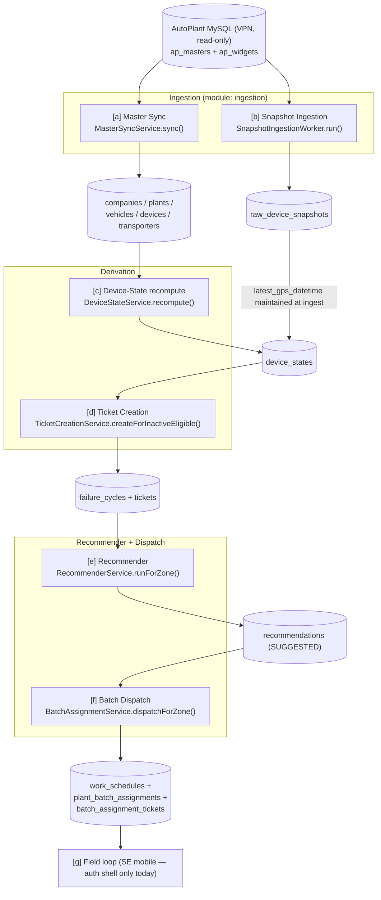
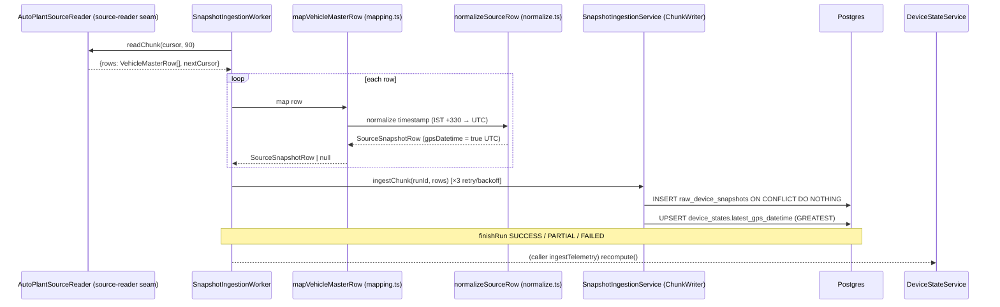
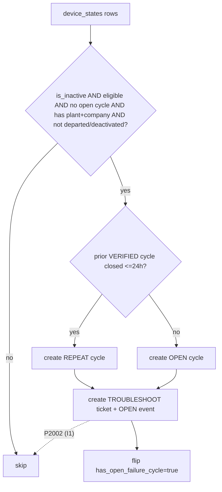
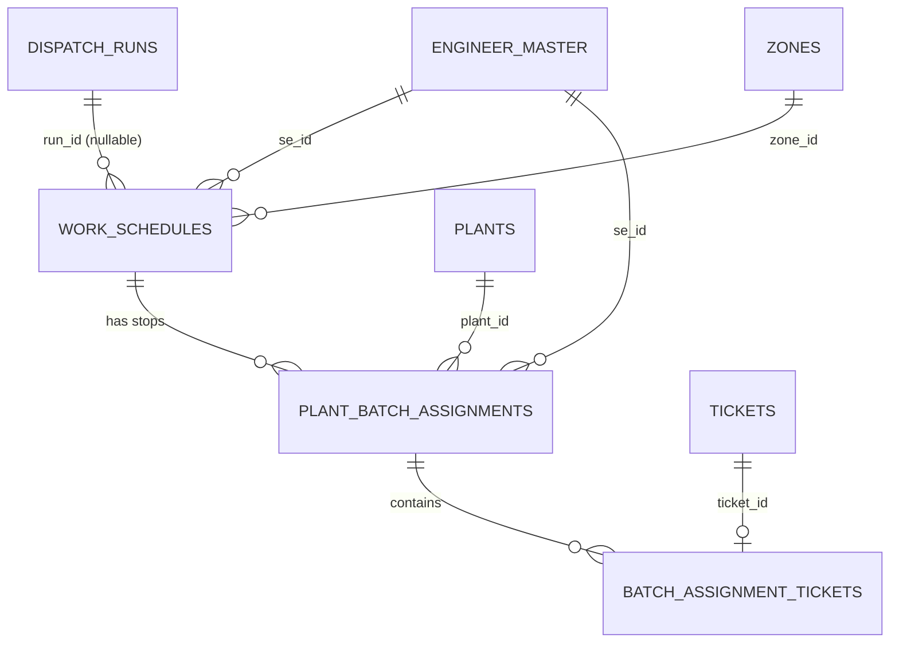
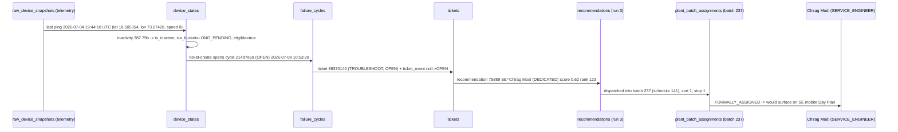
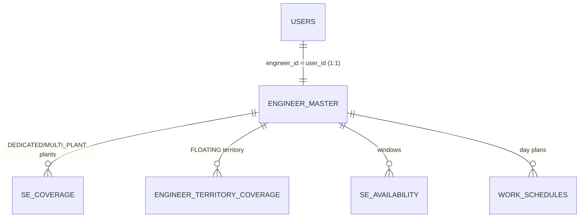

# FSM Platform — Definitive Architecture & Production Walkthrough

**Audience:** a new backend engineer responsible for production.
**Method:** every claim is backed by source code (`file:line`), a live SQL result from the FSM
Postgres DB, or is explicitly marked unverifiable. Written 2026-07-21 on branch
`feat/autoplant-integration`.

> **Evidence access at time of writing**
> - **FSM Postgres** — `postgresql://fsm@localhost:5433/fsm` — **reachable** (PostgreSQL 16.14). All
>   FSM-side numbers below are live query results.
> - **AutoPlant MySQL** — `10.0.0.25:3306` (`ap_masters` / `ap_widgets`) — **UNREACHABLE from this
>   host** (`ETIMEDOUT`; the VPN tunnel is down). Every AutoPlant-side claim is therefore traced
>   through code and marked **[UNVERIFIED — AutoPlant unreachable]**. It cannot be confirmed against
>   live source data right now.

---

## PART 1 — System Architecture (the production pipeline)

### 1.1 End-to-end funnel



### 1.2 Stage-by-stage table

| # | Stage | Service / class | Runs via | Reads | Writes |
|---|---|---|---|---|---|
| a | Master Sync | `MasterSyncService.sync()` `ingestion/autoplant/master-sync.service.ts:122` | Cron `ingestion-masters` `0 2 * * *` **or** `POST /api/integration/sync-masters` | AutoPlant `ap_masters` (`mst_company/mst_plant/mst_transporter/mst_vehicle`) + `ap_widgets.tb_vehiclemaster` | `companies`, `plants`, `vehicles`, `devices`, `transporters`, `zone_mappings`, `device_departures`, `master_sync_runs`, `master_sync_rejects` |
| b | Snapshot Ingestion | `SnapshotIngestionWorker.run()` `ingestion/snapshot-ingestion.worker.ts:50` | Cron `ingestion-telemetry` `*/30 * * * *` **or** `POST /api/integration/run-pipeline` | AutoPlant `ap_widgets.tb_vehiclemaster` (keyset pages ≤90 rows) | `raw_device_snapshots`, `snapshot_runs`, `snapshot_run_chunks`, and incrementally `device_states.latest_gps_datetime` |
| c | Device-State recompute | `DeviceStateService.recompute()` `device-state/device-state.service.ts:54` | Called right after (b) inside `ingestTelemetry()` | `device_states`, `devices`, `vehicles`, `pgi_history`/`non_operational_markings`/`device_departures`, `system_settings` | `device_states` (all derived fields), `device_state_recomputes` |
| d | Ticket Creation | `TicketCreationService.createForInactiveEligible()` `ticketing/ticket-creation.service.ts:27` | Called right after (c) inside `ingestTelemetry()` | `device_states`, `company_master`, `failure_cycles`, `plant_deactivations`, `device_departures` | `failure_cycles`, `tickets`, `ticket_events`, flips `device_states.has_open_failure_cycle` |
| e | Recommender | `RecommenderService.runForZone()` `recommender/recommender.service.ts:97` | `DispatchRunService` (cron `business-dispatch` `0 5 * * *` or `POST /api/schedules/dispatch-run`) | `tickets`, `se_coverage`, `plant_eligible_floating_se` (MV), `engineer_master`, `se_availability`, `se_van_stock`, `priority_rule_config` | `recommendations` (SUGGESTED / UNASSIGNABLE), `dispatch_decision_traces` |
| f | Batch Dispatch | `BatchAssignmentService.dispatchForZone()` `scheduling/batch-assignment.service.ts:51` | Same `DispatchRunService` run, immediately after (e) per zone | `recommendations` (SUGGESTED) | `work_schedules`, `plant_batch_assignments`, `batch_assignment_tickets`, flips ticket→`FORMALLY_ASSIGNED`, consumes recs→`DISPATCHED` |
| g | Field loop | mobile app + `ticketing`/`verification`/`intraday`/`cross-zone` | SE mobile (auth shell only) + business sweeps | — | soft states, submissions, verification runs, … |

**Orchestration:** the "telemetry tick" chains (b)→(c)→(d) in one call —
`IntegrationSyncService.ingestTelemetry()` `ingestion/autoplant/integration-sync.service.ts:71-96`:
`snapshotWorker.run()` → `deviceState.recompute()` → `ticketCreation.createForInactiveEligible()`.
The recommender + dispatch (e)+(f) is a **separate** daily run
(`DispatchRunService.runForActiveZones()` `scheduling/dispatch-run.service.ts:70`).

### 1.3 Runtime facts

- **Backend:** single NestJS process, global prefix `/api` (`main.ts`). Postgres 16 + PostGIS via
  Prisma 7.
- **Scheduling:** in-process `@nestjs/schedule` only. **No Redis / BullMQ / S3 / queue.** (Confirmed
  by `SYSTEM-STATE-2026-07.md §1.3`.)
- **All three master switches default OFF:** `INGESTION_SCHEDULER_ENABLED`,
  `BUSINESS_SWEEPS_ENABLED`, `PARTITION_MAINTENANCE_ENABLED`. So **nothing runs unattended today** —
  the pipeline is driven by manual HTTP triggers, which execute the identical code paths.

---

## PART 2 — Master Sync

**Entry:** `MasterSyncService.sync()` — `ingestion/autoplant/master-sync.service.ts:122-338`.
**Pure mapping layer:** `master-mapping.ts`. **Production source reader:** `autoplant-master-source.ts`.

### 2.1 Where the data comes from

| FSM table | AutoPlant source table (schema) | Key columns read | Reader method |
|---|---|---|---|
| `plants` | `ap_masters.mst_plant` | `plant_id, company_id, plant_name, zone_id, zone_name, region_id, region_name, plant_state, plant_district, master_plant_id, master_plant_code, status` | `readPlants()` `autoplant-master-source.ts:211` |
| `companies` | `ap_masters.mst_company` | `company_id, company_name, company_type, status` | `readCompanies()` `:191` |
| `transporters` | `ap_masters.mst_transporter` | `transporter_id, company_id, transporter_name, status` | `readTransporters()` `:201` |
| `vehicles` + `devices` | `ap_masters.mst_vehicle` **LEFT JOIN** `ap_widgets.tb_vehiclemaster` | `v.vehicle_no, v.device_id, v.plant_id, p.company_id, v.transporter_id, v.deployment_status, w.DEVICE_TYPE, w.IMSI_NO` | `readVehicleMasters()` `:227` |

Two cross-schema facts the production schema forced (`autoplant-master-source.ts:227-269`):
1. `mst_vehicle.company_id` is unreliable (`0` in prod) → a vehicle's company is resolved via its
   **plant** using a `GROUP BY plant_id` subquery (`MIN(company_id)`), not a raw join (the
   composite PK `(plant_id, plant_code)` would otherwise fan each vehicle out).
2. Device identity (`DEVICE_TYPE`, `IMSI_NO`) is not in `ap_masters` at all — it lives on
   `ap_widgets.tb_vehiclemaster`, joined on `vehicle_no` (verified unique, 60,601/60,601).

### 2.2 Sync algorithm — order and derivation

FK dependency order (`master-sync.service.ts:164-325`): **plants → companies → transporters →
vehicles → devices → departure reconciliation.**

- **Plant-first, company-derived.** Scope is anchored on `mst_plant.status` (baseline `ACTIVE`,
  `master-sync.service.ts:125`). Companies are created **only when an in-scope plant references
  them** (`neededCompanyIds`, `:169,205-207`). There is **no company allow-list** and
  `mst_company.company_type` is never consulted (real customers are typed `'NA'`).
- **Zone resolution (R6)** via injected `PlantZoneResolver` (production =
  `MappingTableZoneResolver`): precedence `plant_zone_overrides` → `zone_mappings` MAPPED →
  **UNZONED** holding zone. A plant that can't be placed is deferred (`skip 'ZONE_UNRESOLVED'`,
  `:177-180`), never force-zoned.

### 2.3 How each entity is synced

Every entity uses an idempotent **upsert keyed on the AutoPlant source id** (`UpsertPlan`,
`master-mapping.ts:18-23`). Writes are batched into 500-row `$transaction`s (`UPSERT_BATCH_SIZE`,
`master-sync.service.ts:70`). Reads are keyset-paginated at ≤90 rows/query (DBA <100 cap,
`autoplant-source-reader`/`autoplant-master-source.ts:94`).

- **Companies** — `mapCompany()` `master-mapping.ts:161`.
- **Plants** — `mapPlant()` `:216`.
- **Transporters** — `mapTransporter()` `:195`.
- **Vehicles** — `mapVehicle()` `:276`.
- **Devices** — `mapDevice()` `:297`; skipped when the vehicle has no fitted `device_id` (returns
  `null`).

### 2.4 Updates and anti-drift (Risk R4)

The **update set structurally excludes every FSM-owned column.** In each `map*` function the `update`
object mirrors only AutoPlant-authoritative attributes; FSM-owned columns
(`companyTier`/`companyPriorityRank`/`opsOverride`, operational `zoneId`/`districtId`, `dealType`)
appear **only in `create`**, never in `update` (`master-mapping.ts:191, 272-273, 319`). So a re-sync
can never clobber an Ops-Head decision. FSM edits (e.g. zone pins) re-apply via
`ZoneMappingService.reapply`, never by re-sync.

### 2.5 Deleted / departed records (Issue 128)

There is no hard delete. The master **read is widened to every `deployment_status`** so a device
leaving the deployed fleet can be **observed**, while the **create scope is pinned to the operational
fleet** (`OPERATIONAL_DEPLOYMENT_STATUSES = ['DEPLOYED','ACTIVE']`, `master-mapping.ts:144`;
`isOperationalStatus`, `:150`). A never-known non-operational row is counted and dropped, never
inserted (`master-sync.service.ts:273-276, 309-312`). Departures/restores are then reconciled from
the same read into the FSM-owned `device_departures` side table
(`reconcileDepartures()`, `:353-385`) with an absence-diff blast limiter (`maxAbsenceRatio`). A
lifecycle failure is logged/counted, never rethrown — the mirror sync stays committed.

### 2.6 Primary-key mapping (AutoPlant ↔ FSM)

| Entity | AutoPlant PK | FSM natural key (unique) | FSM surrogate PK |
|---|---|---|---|
| Company | `mst_company.company_id` | `companies.source_company_id` | `company_id` (bigint) |
| Plant | `mst_plant.plant_id` (dedup of composite `(plant_id, plant_code)`) | `plants.source_plant_id` | `plant_id` (bigint) |
| Transporter | `mst_transporter.transporter_id` | `transporters.source_transporter_id` | `transporter_id` (bigint) |
| Vehicle | `mst_vehicle.vehicle_no` | `vehicles.vehicle_no` | `vehicle_id` (bigint) |
| Device | `tb_vehiclemaster.device_id` (string, leading zeros preserved) | `devices.device_id` (string) | `devices.device_id` is the PK |

**Observability:** every run writes `master_sync_runs` (single-in-flight; `entity_stats` JSON) +
itemised `master_sync_rejects` (capped 5,000/run, best-effort).

> **[UNVERIFIED — AutoPlant unreachable]** the exact live source row counts/columns cannot be
> confirmed right now. The column lists above come from the code's `SELECT` lists and the recorded
> DESCRIBEs in `docs/autoplant/`, not a live query.

---

## PART 3 — Snapshot Ingestion (one telemetry snapshot, end to end)



### 3.1 Transformations, step by step

1. **Reader** (`source-reader.ts` / `autoplant-source-reader.ts`) keyset-paginates
   `ap_widgets.tb_vehiclemaster` (≤90 rows), schema-qualified. Datetimes arrive as raw wall-clock
   strings (`dateStrings:true`).
2. **DTO shape:** `VehicleMasterRow` (`mapping.ts:42-54`) — `device_id, latest_gps_datetime,
   latitude, longitude, speed, IGNITION_STATUS, DEVICE_TYPE, TRIP_CREATION_DATETIME, gpssignal`.
3. **Mapper** `mapVehicleMasterRow()` (`mapping.ts:133`): drops rows with no trackable ping (null
   `device_id` or null `latest_gps_datetime`, `:134`), parses `gpssignal` JSON into
   `mains_status`/`mains_voltage` (`parseGpssignal`, `:84`), and produces a `SourceSnapshotRow`.
4. **Write** `SnapshotIngestionService.ingestChunk()`:
   - `INSERT INTO raw_device_snapshots … ON CONFLICT (device_id, gps_datetime) DO NOTHING` →
     idempotent.
   - Incrementally maintains `device_states.latest_gps_datetime` in one set-based
     `INSERT … SELECT unnest(...) JOIN devices ON CONFLICT DO UPDATE … GREATEST(...)`
     (`snapshot-ingestion.service.ts:114-123`) so the recompute never has to fold the whole
     telemetry table.

### 3.2 Timestamp normalization

`normalizeGpsTimestamp()` (`normalize.ts:24-33`): the source wall-clock is read *as if* UTC, then the
source offset is subtracted. `latest_gps_datetime` is a MySQL **DATETIME** written in IST →
`AUTOPLANT_UTC_OFFSET_MIN = 330` (`mapping.ts:15`). `TRIP_CREATION_DATETIME` is a MySQL **TIMESTAMP**
returned already in the UTC session zone → offset **0** (`TRIP_CREATION_UTC_OFFSET_MIN`, `:31`;
`parseTripCreation`, `:106`). Applying +330 to the trip stamp would shift every value 5.5h — the
trap is pinned by tests.

### 3.3 GPS normalization

Only the timestamp is transformed; `lat`/`lon`/`speed` are preserved verbatim
(`normalizeSourceRow`, `normalize.ts:36-42`). A `latest_gps_datetime` more than 24h ahead of `now`
is treated as bogus and the row is dropped (`DEFAULT_MAX_SKEW_MINUTES`, `mapping.ts:34, 166-168`).

### 3.4 Ignition logic

Ignition is **carried but not derived** into state. The mapper passes `IGNITION_STATUS` through to
`raw_device_snapshots.ignition_status` (`mapping.ts:146`). It is **not** part of the
inactive/eligibility computation — inactivity is time-since-last-ping only (§3.6). In this DB
`ignition_status` is largely NULL (the traced device shows `null`; see Part 11).

### 3.5 Stale-run detection

`snapshot_runs` has a partial-unique `one_in_flight WHERE status='RUNNING'`. A run stuck RUNNING past
`INGESTION_STALE_RUN_MIN` is reaped by `reapStaleRuns()` (`stale-run.ts`). A mid-scan **read** throw
(VPN drop) is caught (`worker:102-104`) and the run finalized PARTIAL/FAILED so it can never hang
RUNNING (the "run 456" fix). Two cursors are deliberately asymmetric (`worker:120-134`): `data_as_of`
= conservative display watermark; resume `cursor` = optimistic re-read floor.

### 3.6 Inactive detection & SLA buckets — see Part 3 continued in device-state (§Part-C below)

Inactivity, `is_inactive`, `sla_bucket`, and `eligible_for_uptime` are **not** computed in ingestion.
They are derived in the next stage, `DeviceStateService.recompute()`.

### 3.7 Device-State recompute (the "Device State" box)

`DeviceStateService.recompute()` — `device-state/device-state.service.ts:54-137`. Two set-based
statements, **no telemetry scan**:

1. `INSERT INTO device_states … ON CONFLICT DO NOTHING` — one row per device (`:61-64`).
2. One `UPDATE` inside a transaction (`:95-129`) deriving:
   - `inactivity_hours = GREATEST(0, now − latest_gps_datetime)/3600` (`:99-101`).
   - `is_inactive = NOT departed AND hours >= inactivity_threshold_hours` (default 24, `:108`).
   - `sla_bucket` via `slaBucketCaseSql('dr.hours')` — the SQL CASE is generated from the **same
     `SLA_BANDS`** the TS classifier uses, so SQL and TS cannot drift (`sla-bucket.ts`, `:69,109`).
   - `eligible_for_uptime` per `eligibility_mode` (`:82-117`): `all-deployed` =
     `v.status IN ('ACTIVE','DEPLOYED')`; `pgi` = an `EXISTS` on `pgi_history` within
     `DEFAULT_PGI_WINDOW_DAYS`. **Both** additionally require no CONFIRMED/ACTIVE Non-Op marking and
     no active departure.
   - denormalised `vehicle_id/plant_id/company_id/transporter_id` off current fitment.

It runs on the telemetry tick **because bucket aging is a function of wall-clock time** — a silent
device must keep aging WARNING→…→SEVERE with no new pings.

A **recompute invariant** (`assertDepartureInvariant`, `:127`) runs in the same transaction —
rollback-and-throw on corruption (the #130 L2 guard for the run-65 stale-code incident). A **semantic
canary** (`:144-188`) warns on eligible-count swings > threshold.

> **Live evidence — SLA bucket distribution (`device_states`, 2026-07-21):**
> WARNING 11,240 · (null/ACTIVE band) 6,293 · LONG_PENDING 2,073 · RISK 671 · EARLY_RISK 476 ·
> CRITICAL 307 · SEVERE 294 · VERY_SEVERE 247 · HIGH_CRITICAL 213.

---

## PART 4 — Ticket Creation

**Service:** `TicketCreationService.createForInactiveEligible()` —
`ticketing/ticket-creation.service.ts:27-122`. **Repository:** direct `PrismaService` (no separate
repo class).

### 4.1 Conditions a device must satisfy (the candidate query, `:33-51`)

```
device_states WHERE
    is_inactive = true
AND eligible_for_uptime = true
AND has_open_failure_cycle = false
AND NOT EXISTS active device_departure          (Issue 128; re-reads the ledger, not the flag)
AND plant_id IS NOT NULL AND plant_id NOT IN (deactivated plants)   (Issue 119)
AND company_id IS NOT NULL
```

### 4.2 What gets written (per candidate, one `$transaction`, `:80-113`)

1. `failure_cycles` — state `OPEN`, or `REPEAT` if a prior **VERIFIED** cycle closed within 24h
   (ADR-0021; `REPEAT_WINDOW_MS`, `:10-11, 68-77`).
2. `tickets` — `work_type='TROUBLESHOOT'`, `status='OPEN'`, `failure_cycle_id` set, `company_tier`
   denormalised.
3. `ticket_events` — the opening `null → OPEN` transition.
4. Flip `device_states.has_open_failure_cycle = true`.

### 4.3 Duplicate prevention / reuse / closed-ticket handling

- **Primary filter:** `has_open_failure_cycle = false` excludes any device that already has an open
  episode.
- **Durable backstop (invariant I1):** partial-unique `failure_cycles_one_active_per_device WHERE
  state IN (OPEN, WAITING_COMPONENT, SUBMITTED, REPEAT, ESCALATED)`. A race that slips past the
  filter hits P2002 → the device is **silently skipped** (`isUniqueViolation`, `:7-8, 115-118`).
- **Reuse:** there is no "reuse an existing ticket" — one open cycle per device *is* the reuse
  guarantee. A CLOSED cycle does not block a new one; a VERIFIED closure ≤24h makes the new one a
  REPEAT (chained via `previous_failure_cycle_id`).
- **Closed tickets** are simply not candidates (they have no open cycle).

### 4.4 Gate

Candidates require `eligible_for_uptime = true`. Under `eligibility_mode='pgi'` over an empty
`pgi_history` (no SAP feed — blocker B7), **0 tickets are created**. The current DB has 15k+ eligible
devices and 14,004 OPEN tickets, which is only possible under `all-deployed` — consistent with the
recorded decision (`SYSTEM-STATE §3j`) that `all-deployed` is the active mode.



---

## PART 5 — Morning Batch Scheduler

There are **two** schedulers. The "morning batch" is the **dispatch** scheduler.

### 5.1 The dispatch scheduler

- **Class:** `DispatchSchedulerService` — `scheduling/dispatch-scheduler.service.ts:37-68`.
- **Time:** `DEFAULT_DISPATCH_CRON = '0 5 * * *'` (05:00 daily), overridable via
  `BUSINESS_SWEEP_DISPATCH_CRON` (`:10, 50`).
- **Trigger mechanism:** in-process `@nestjs/schedule` `@Cron(...)` — **not** BullMQ, **not**
  external. Manual equivalent: `POST /api/schedules/dispatch-run` → the **identical** code path.
- **Master switch:** `BUSINESS_SWEEPS_ENABLED === 'true'` (default **OFF**; `:19-24, 52`).
- **Guards:** `inFlight` single-in-flight (`:53-57`); never throws out of cron context (`:61-63`).

### 5.2 The tick, line by line (`dispatchTick`, `:50-67`)

```ts
@Cron(readDispatchSchedulerConfig().dispatchCron, { name: 'business-dispatch' })
async dispatchTick(now = new Date()) {
  if (!this.config.enabled) return { ran:false, reason:'DISABLED' };   // master switch (default OFF)
  if (this.inFlight)        return { ran:false, reason:'RUN_IN_PROGRESS' };  // overlap guard
  this.inFlight = true;
  try   { await this.dispatchRun.runForActiveZones(now); return { ran:true }; }
  catch (e) { /* log */ return { ran:false, reason:'ERROR' }; }        // never throws out of cron
  finally { this.inFlight = false; }
}
```

`runForActiveZones()` (`dispatch-run.service.ts:70-166`): open a `dispatch_runs` ledger row with a
**config snapshot frozen at run start** (`captureConfigSnapshot`, `:204-223`), then **for every active
zone** (a zone with ≥1 plant): `recommender.runForZone(zone)` → `dispatch.dispatchForZone(zone)`,
each zone's failure contained and recorded on `dispatch_run_zones` (`:101-123`). Day Plan covers a
single date (`dateFrom === dateTo === utcDayStart(now)`).

### 5.3 The ingestion scheduler (separate)

`IntegrationSchedulerService` — `ingestion/autoplant/integration-scheduler.service.ts:51-103`:
`ingestion-telemetry` (`*/30 * * * *`, calls `ingestTelemetry` = snapshot→recompute→ticket-create)
and `ingestion-masters` (`0 2 * * *`). Master switch `INGESTION_SCHEDULER_ENABLED` (default OFF).
**Cron expressions are read from env once at decorator evaluation** (`:70, 87`) — flag/cron changes
need a restart; the enabled/configured gate is re-checked every tick.

---

## PART 6 — Assignment Algorithm

**Entry:** `RecommenderService.runForZone()` — `recommender/recommender.service.ts:97-392`.

### 6.1 Candidate SE selection — strict precedence (ADR-0001)

`CandidateSelectionService.orderedCandidatesForPlant()`
(`recommender/candidate-selection.service.ts:23-41`): **DEDICATED → MULTI_PLANT** (both from
`se_coverage`) **→ FLOATING** (from the `plant_eligible_floating_se` materialized view). Within a
tier, ordered by `se_id` for determinism. There is **no round-robin and no nearest-neighbour** today
(distance scoring is deferred-null).

### 6.2 Hard filters (`recommender/hard-filters.ts:40-60`, first-failure-wins)

| Filter | Drop condition | Real or stub |
|---|---|---|
| `VEHICLE_ON_TRIP` | `vehicleReadiness === 'ON_TRIP'` | **Stub** — fed constant `'UNKNOWN'` (`recommender.service.ts:191`); can never fire |
| `SE_UNAVAILABLE` | not (`engineer_master.is_active` AND `se_availability` window = AVAILABLE) | **Real** (`:188, 192`) |
| `OVER_CAPACITY` | `assignedThisRun(se) >= engineer_master.daily_capacity` | **Real** (`:193`) |
| `COMMON_KIT_INCOMPLETE` | `se_van_stock` fails `common_kit_definition` mins | **Real** (`:194`) |
| `COMPONENT_UNAVAILABLE` | expected components OOS | **Stub** — `expectedComponentsAvailable:true` hardcoded (`:196`); open #51 |

**Activity-ping staleness is deliberately NOT a filter** (`hard-filters.ts:9-13`).

### 6.3 The per-ticket loop (`:174-378`)

For each ticket (in canonical order): order candidate SEs for the plant → compute readiness → apply
hard filters → `chosen = plannerPreferred ?? passed[0] ?? null`. Planner (`se_planner`) is a **soft
bias** among *eligible* candidates, never a constraint (`:198-204`, ADR-0022). `null` → an
`UNASSIGNABLE` recommendation with reason `NO_ELIGIBLE_SE` (never silently dropped).

### 6.4 Capacity, coverage, zone, plant, skills

- **Daily capacity:** `engineer_master.daily_capacity`, credited per successful assignment this run
  (`assigned` map, `:152, 193, 322`). **This is the only per-day workload limit in the automated
  path.**
- **Coverage / plant:** via `se_coverage` + the floating MV (§6.1).
- **Zone:** ticket selection is `plant.zoneId === zone` (`:109`); dispatch is per-zone advisory-locked.
- **Skills:** **not modelled.** There is no skills table or skill filter.
- **Availability:** `se_availability` (only AVAILABLE is eligible) + `engineer_master.is_active`.

### 6.5 Canonical sort (ADR-0017, `recommender/canonical-sort.ts:47-62`)

`Company Tier desc → Device Bucket desc → Company Priority Rank asc → Oldest-Inactive asc → Device
ID asc`. `processing_rank` is persisted on each recommendation.

### 6.6 Scoring (`recommender/scoring.ts:74-114`)

`baseScore = wRank·rankScore + wUrgency·dispatchUrgency − wRepeat·penalty + wRepeatBonus·penalty +
wAge·ageScore + wDistance·distanceScore`, then `× clusterMultiplier` (default 1.25 on additional
same-plant tickets). `rankScore`: A=1.0, B=0.9, C=0.8… Weights come from `priority_rule_config`
(default set `v1`); PREVENTIVE mode uses `<set>_preventive` or code defaults (`recommender.service.ts:495-520`).
DEFICIT vs PREVENTIVE is chosen by `SoftInactiveCountService.modeForZone` (`:101`).

**Output:** one `recommendations` row per ticket (SUGGESTED with `scoreBreakdown`, or UNASSIGNABLE),
plus bounded `dispatch_decision_traces` when a run id is supplied.

---

## PART 7 — Batch Creation (the core question)

**Code:** `BatchAssignmentService.dispatchForZone()` — `scheduling/batch-assignment.service.ts:51-187`.
Manual equivalent: `OverrideService.assignTicket()` / `assignPlants()` (`scheduling/override.service.ts`).

- **What is a batch?** A **Plant-wise Batch Assignment** — one plant's tickets handed to one SE as a
  single stop within that SE's Day Plan (`schema.prisma:513-536`). It is the unit an SE drives to.
- **Why it exists:** an SE visits a *plant* (a physical site) and services all its down devices in one
  trip; the batch groups those tickets into one stop with a `stop_sequence`.
- **Tables:** `plant_batch_assignments` (the batch) + `batch_assignment_tickets` (its tickets), under
  a parent `work_schedules` (the SE's Day Plan).
- **How `batch_id` is generated:** `@id @default(autoincrement())` bigint (`schema.prisma:517`) — a
  plain Postgres sequence. Not derived from plant or date.
- **Why one plant → one batch:** the dispatcher groups recs **SE → plant → tickets**
  (`batch-assignment.service.ts:82-91`) and creates exactly one `plantBatchAssignment` per
  `(schedule, plant)` (`:116`). The manual path reuses the same `(schedule, plant, se)` batch
  (`override.service.ts:276-289`).

### 7.1 The eight structural questions

| Question | Answer | Evidence |
|---|---|---|
| Can one engineer have multiple batches? | **Yes** — one per plant they're assigned in a day (one Day Plan, N plant stops). | `:97-136` loop creates a batch per plant under one schedule; live: SE `23c56050…` has **13 batches**. |
| Can one batch contain multiple plants? | **No.** A batch is exactly one plant. | `plantBatchAssignment` keyed by a single `plantId` (`schema.prisma:519`). |
| Can one ticket belong to multiple batches? | **No** (one *active*). | Partial-unique `batch_assignment_tickets_one_active_per_ticket WHERE removed_at IS NULL`; a ZM move sets `removed_at` and re-adds. Live duplicate check = **0**. |
| Can a batch survive multiple days? | **Not by design.** A Day Plan is single-date (`dateFrom===dateTo`, `dispatch-run.service.ts:74,106`); a new run creates new schedules/batches. Old ACTIVE schedules are **not auto-expired** (see audit). | `work_schedules` partial-unique one-ACTIVE-per-`(se, zone, day)`. |
| How are old batches closed? | Status transitions (`AUTO_ASSIGNED`→`OVERRIDDEN`) via override; **there is no automatic close/expiry of yesterday's ACTIVE schedules** — a real audit gap. | no expiry sweep found; see Part 13. |

---

## PART 8 — Batch Assignment Tables

### 8.1 ER diagram



### 8.2 `work_schedules` (`schema.prisma:486-511`)

| Column | Type | Meaning |
|---|---|---|
| `schedule_id` | bigint PK | Day Plan id |
| `se_id` | uuid | the SE (FK `engineer_master`) |
| `zone_id` | bigint | zone (deliberately in the ACTIVE unique key to allow cross-zone plans) |
| `date_from` / `date_to` | date | coverage window (daily ⇒ equal) |
| `status` | enum | `ACTIVE` / `OVERRIDDEN` / … |
| `source` | enum | `SYSTEM_GENERATED` (auto dispatch) or `ZM_MANUAL` (override/assign) |
| `dispatched_at` | timestamptz | when dispatched |
| `run_id` | bigint? | dispatch-run ledger link; **null for pre-ledger and `ZM_MANUAL`** |

Partial-unique: `work_schedules_one_active_per_se_zone_day (se_id, zone_id, date_from) WHERE ACTIVE`.

### 8.3 `plant_batch_assignments` (`schema.prisma:516-536`)

| Column | Type | Meaning |
|---|---|---|
| `batch_id` | bigint PK | the batch |
| `schedule_id` | bigint FK | parent Day Plan |
| `plant_id` | bigint FK | the single plant this batch serves |
| `se_id` | uuid FK | the SE |
| `status` | enum | `AUTO_ASSIGNED` / `OVERRIDDEN` |
| `stop_sequence` | int | order of this plant stop in the Day Plan |
| `override_reason` | text? | mandatory reason when a ZM reassigns/splits |

Indexes on `schedule_id`, `plant_id`, `se_id`.

### 8.4 `batch_assignment_tickets` (`schema.prisma:542-557`)

| Column | Type | Meaning |
|---|---|---|
| `id` | bigint PK | row id |
| `batch_id` | bigint FK | parent batch |
| `ticket_id` | uuid FK | the ticket |
| `sort_order` | int | within-stop order |
| `deferred_to_date` | date? | ZM defer without deleting history |
| `removed_at` / `removed_by` | timestamptz?/uuid? | ZM removal without deleting history |

Partial-unique (raw SQL): `batch_assignment_tickets_one_active_per_ticket (ticket_id) WHERE
removed_at IS NULL`.

---

## PART 9 — Investigation: why Batch 160 has 1453 tickets and Batch 161 has 791

**Verdict: NOT a bug in the batching engine, and NOT skipped batching. It is two operator-initiated
manual "assign all of this plant's tickets to one SE" actions (`ZM_MANUAL`), which by design have no
capacity cap. The 25-ticket batches come from the automated dispatch, which caps each SE at
`daily_capacity = 25`. The two paths coexisted on the same day.**

### 9.1 The live data (proof)

Top batches by ticket count (`plant_batch_assignments` ⋈ `batch_assignment_tickets`, 2026-07-21):

| batch_id | plant_id | plant name | zone | schedule_id | schedule.source | run_id | tickets |
|---|---|---|---|---|---|---|---|
| **160** | 11 | RCP-9211 | 3 | 96 | **ZM_MANUAL** | **null** | **1453** |
| **161** | 19 | SATNA PLANT LINE 2 | 3 | 97 | **ZM_MANUAL** | **null** | **791** |
| 237 | 316 | PIRANGUT | 4 | 141 | SYSTEM_GENERATED | 3 | 25 |
| … 30 batches total | … | … | … | 98–152 | SYSTEM_GENERATED | 3 | **25** |

Batch-size distribution: `1453×1, 791×1, 25×30, 24×1, 21×3, …` — a hard cluster at **25**, plus two
outliers.

**Batch size = the plant's OPEN-ticket count for the two outliers:**

| plant | open tickets | batch tickets |
|---|---|---|
| 11 (RCP-9211) | 1453 | 1453 (batch 160) |
| 19 (SATNA L2) | 791 | 791 (batch 161) |
| 103 (NCP-9117) | 1262 | **25** (batch 162) + **1237 UNASSIGNABLE** |
| 100 (CCP-9115) | 1171 | **25** + **1146 UNASSIGNABLE** |
| 24 (KESORAM) | 922 | **25** + **897 UNASSIGNABLE** |

Plants 103/100/24 have *more* open tickets than plant 19, yet were capped at 25 — because they went
through the **automated** path, which produced 25 SUGGESTED and the rest `UNASSIGNABLE`
(reason `NO_ELIGIBLE_SE`, i.e. the single covering SE hit capacity). Recommendations totals: **1,045
DISPATCHED, 10,390 UNASSIGNABLE** (all run 3).

**Engineer capacity:** all **75** engineers have `daily_capacity = 25`.

**Timeline:** schedules 96/97 (ZM_MANUAL) created `01:35`; schedules 98–152 (SYSTEM_GENERATED, run 3)
created `01:37`. The manual assignment ran *before* the automated dispatch on the same day.

### 9.2 The code that produced each

**Automated (25-cap):** `RecommenderService` credits `assigned[se]` per assignment and drops the SE as
`OVER_CAPACITY` once `assigned[se] >= daily_capacity` (`recommender.service.ts:152, 193`;
`hard-filters.ts:43`). Every remaining ticket for that plant becomes `UNASSIGNABLE`. So no
SYSTEM_GENERATED batch can exceed 25.

**Manual (uncapped):** `OverrideService.assignPlants()` (`override.service.ts:311-340`) fetches
**every** `OPEN + UNASSIGNED` ticket for the plant with **no limit** (`:325-329`) and calls
`assignTicket()` per ticket. `assignTicket()` (`:237-301`) checks only scope, already-assigned, and
SE-exists — **there is no capacity check anywhere** — then reuses the one `(schedule, plant, se)`
batch and appends the ticket. All 1453 land in one batch. The schedule it creates is
`source: 'ZM_MANUAL'` with `run_id` null (`ensureSchedule`, `:429-449`).

This endpoint is `POST /api/schedules/assign-plants` (`schedules.controller.ts:92-104`), the "Assign
SE" multi-plant flow on the Device Detail page (Issue 122b). A manager selected plants 11 and 19,
picked an SE, and confirmed.

### 9.3 Answers to the explicit questions

- **Is this expected?** The *mechanism* is expected (manual override is authoritative and bypasses
  engine limits). Assigning 1453 tickets to one SE for one day is operationally impossible
  (capacity 25) — so the *outcome* is an operator mistake, not an engine defect.
- **Is it a bug?** Not in batching. It **is** a missing guardrail: the manual assign-plants tool has
  no sanity cap and no warning (Part 13, ❌).
- **Historical backlog?** Partly — plant 11 has 1453 *open* tickets because auto-recovery/verification
  sweeps are OFF, so cycles never close (see §Part-13). The manual action then swept the whole backlog
  onto one SE.
- **Batching skipped / ticket-splitting disabled?** No. Splitting is a ZM override action, never
  automatic; the manual path deliberately does not split.
- **Intentional?** The code path is intentional; this particular 1453/791 assignment is an operator
  action, reversible via override.

---

## PART 10 — SQL Verification (live results, 2026-07-21)

**Core counts:** tickets 20,410 · failure_cycles 20,410 · plant_batch_assignments 78 ·
batch_assignment_tickets 3,289 · work_schedules 50 · device_states 21,814 · recommendations 11,435 ·
plants 764 · engineer_master 75.

**Tickets by status:** OPEN **14,004** · CLOSED **6,406**.
**By assignment_state:** UNASSIGNED **17,121** · FORMALLY_ASSIGNED **3,289** (= batch_tickets ✓).

**Engineer workloads (tickets in active batches):** `016a0edb…` 1453 (1 batch) · `385981bd…` 791 (1) ·
then everyone else exactly **25** (some across up to 13 batches, e.g. `23c56050…`).

**Data-integrity checks (all clean):**
- Duplicate active batch-ticket rows: **0** (partial-unique holds).
- Devices with >1 active failure cycle: **0** (invariant I1 holds).
- `engineer_master` ↔ `users` linkage: 75 engineers, 75 linked (1:1).

**Plant workloads (top open):** 11=1453, 103=1262, 100=1171, 24=922, 19=791, 121=478, 18=467,
15=451, 14=426, 33=396.

**device_states eligibility cross-tab** (headline anomaly):

| is_inactive | eligible | has_open_cycle | count |
|---|---|---|---|
| false | true | **true** | **10,820** |
| false | false | false | 5,539 |
| true | true | true | 2,505 |
| false | true | false | 1,797 |
| … | | | |

→ **11,344 devices carry an open failure cycle while no longer inactive** (device resumed pinging but
the cycle was never auto-closed). This is the direct consequence of `BUSINESS_SWEEPS_ENABLED=OFF`
(no auto-recovery/verification). See Part 13.

**Ledgers:** `dispatch_runs` PK is `run_id` (columns `trigger, actor_*, started_at, finished_at,
status, zones, schedules, batches, tickets_dispatched, recommended, unassignable, config_snapshot,
build_version, build_fingerprint`). `snapshot_runs`/`master_sync_runs` likewise keyed `run_id`.

---

## PART 11 — Trace One Real Ticket (end to end)

**Ticket `89370140-7c28-4a0b-8f5d-8386e0ba64e5`** (plant 316 PIRANGUT, company 19, SILVER tier).



**Evidence chain (all live rows):**

1. **Telemetry** — `raw_device_snapshots` for `0359688090257394`: last ping `2026-07-04 19:44:10Z`,
   `lat 18.505354, lon 73.67428, speed 0.00, ignition_status NULL`. No pings after → the device went
   silent. **[Source origin AutoPlant — UNVERIFIED against live MySQL now; the FSM snapshot rows are
   what was ingested.]**
2. **Device state** — `is_inactive=true, inactivity_hours=387.79, sla_bucket=LONG_PENDING,
   eligible_for_uptime=true, has_open_failure_cycle=true, latest_gps_datetime=2026-07-04 19:44:10Z`.
3. **Failure cycle** — `214d7e59…` state `OPEN`, `opened_at 2026-07-09 10:53:29`, `repeat_failure
   false`.
4. **Ticket** — `TROUBLESHOOT / OPEN`, `failure_cycle_id 214d7e59…`; `ticket_events` = single
   `null→OPEN` at the same instant.
5. **Recommendation** — `75889`, `SE b6ed176c…`, `status DISPATCHED`, `processing_rank 123`,
   `company_tier SILVER`, `device_bucket LONG_PENDING`, `run_id 3`, `score 0.62`, coverage `DEDICATED`.
6. **Batch** — `batch_assignment_tickets` → batch `237` (schedule `141`, stop_sequence 1),
   `sort_order 1`, `removed_at null`; batch status `AUTO_ASSIGNED`.
7. **Engineer** — `b6ed176c…` = **Chirag Modi**, `SERVICE_ENGINEER`, `DEDICATED`, `daily_capacity
   25`, phone/email on `users`.
8. **Mobile assignment / completion** — the ticket is `FORMALLY_ASSIGNED` and would appear on Chirag
   Modi's Day Plan **[UNVERIFIED — the SE mobile app is an auth shell only; no field submission /
   completion exists for this ticket].**

**Services involved:** SnapshotIngestionWorker → SnapshotIngestionService → DeviceStateService →
TicketCreationService → RecommenderService → BatchAssignmentService (via DispatchRunService).

---

## PART 12 — Service Engineer model



- **Identity & contact** live on **`users`** (name, phone, email, role) — the RBAC actor registry.
- **`engineer_master`** is the **SE profile / configuration only** (`schema.prisma:106-144`):
  `coverage_type`, `zone_id`, `daily_capacity`, `shift_start/end`, `preferred_notification_channel`,
  `last_activity_at`, `is_active`, `address`. It holds **no name/phone/email** — those are on `users`.
- **Linkage:** `engineer_master.engineer_id` **is** `users.user_id` (1:1;
  `@relation(fields:[engineerId], references:[userId])`, `:122`). Live: 75 engineers, all 75 linked.
- **Coverage:** `se_coverage` (DEDICATED/MULTI_PLANT plant rows; CHECK excludes FLOATING) +
  `engineer_territory_coverage` (FLOATING territory) + the `plant_eligible_floating_se` MV.
- **Authentication / mobile login:** JWT `{user_id, role, zone_id}` issued by the `auth` module. **But
  the user + refresh-token stores are IN-MEMORY** (`SYSTEM-STATE §3j`, `auth/user-store.ts`), so
  **DB-seeded users cannot log in** and every restart drops sessions (open issue #91). The mobile app
  is an auth shell only. So: engineer identity is in `users`, but production credential storage does
  not exist yet.

---

## PART 13 — Production Audit

### ✔ Working correctly (verified)

- **Idempotency everywhere:** snapshot `ON CONFLICT DO NOTHING`, master upserts keyed on source id,
  dispatch consumes SUGGESTED→DISPATCHED and is per-zone advisory-locked. Re-runs are safe.
- **Invariant I1** (one active cycle/device) — live check: **0** violations.
- **One-active-batch-per-ticket** — live check: **0** duplicates.
- **Anti-drift** — FSM-owned columns structurally excluded from every master `update` set.
- **Set-based hot paths** — device-state recompute + latest-ping maintenance avoid folding the
  telemetry table; `tickets(device_id, created_at)` index landed (device list 86s→0.4s).
- **Timezone correctness** — the DATETIME(+330) vs TIMESTAMP(0) split is handled and test-pinned.
- **Ledgers + build fingerprints** on every run (dispatch/snapshot/master + recompute canary).

### ⚠ Suspicious / risky logic

- **Uncapped manual assignment (root of Part 9).** `assignPlants`/`assignTicket` have no capacity
  sanity check → 1453 tickets on one SE. `override.service.ts:311-340, 237-301`.
- **Cron expressions frozen at decorator eval** — flag/cron flips need a full restart
  (`integration-scheduler.service.ts:70,87`); easy to trip over in ops.
- **`VEHICLE_ON_TRIP` and `COMPONENT_UNAVAILABLE` hard filters are stubs** — one fed a constant,
  one hardcoded true; they can never fire, so those two eligibility dimensions are unenforced
  (`recommender.service.ts:191,196`; #51).
- **Reaper vs still-alive runs (audit NEW-2, #132, OPEN)** — default stale threshold (30 min) equals
  the telemetry cadence, zero margin; a long run can be reaped while draining. HITL-gated, unfixed.

### ❌ Possible bugs / gaps

- **No auto-close of stale ACTIVE schedules/batches.** Yesterday's `ACTIVE` Day Plans are not expired;
  the one-ACTIVE-per-(se,zone,day) unique means a new day's dispatch for the same SE can P2002 and
  skip the whole zone (the #126/#127 wedge family — #126 fixed, #127 open).
- **11,344 devices have an open failure cycle but are no longer inactive** (live) — because
  `BUSINESS_SWEEPS_ENABLED=OFF`, auto-recovery/verification never runs, so cycles/tickets never close.
  14,004 tickets sit OPEN; this inflates every backlog and is exactly what the manual sweep in Part 9
  dumped onto one SE. **This is the single biggest data-health issue.**
- **In-memory auth (#91)** — no persistent credentials; DB users can't log in; restart drops all
  sessions. Production auth does not exist.
- **No rate limiting (#110)** — `/auth/login` scrypt is a CPU-DoS vector.

### ❌ Dead / inert code & data

- `pgi_history` has **no production writer** (SAP feed absent) — the `pgi` eligibility mode yields 0
  eligible; only `all-deployed` is usable today.
- `engineer_territory_coverage.polygon` reserved/unused in v1; `regions`/`districts` seed-only;
  `zone_warehouse_stock.reserved` has no writer.
- FLOATING coverage path exists but the current fleet is 75 DEDICATED engineers (no FLOATING data).

### ❌ Missing validation / edge cases

- `assignPlants` accepts unbounded plant sets and unbounded ticket counts with no confirmation.
- The recommender's per-candidate loop is O(candidates); a mass outage flipping thousands inactive at
  once is a one-transaction-per-device storm in ticket creation (`#106` family, `ticket-creation.service.ts:62`).
- Departed/deactivated exclusions are defended in ticket-create and recommender, but a ticket raced in
  between a departure and the next sync relies on the sweep to catch it.

### ❌ Performance

- `tickets` still lacks an index on `vehicle_id` and `audit_logs(actor_role, created_at)` (#103 partial).
- `raw_device_snapshots` partitioning is gated OFF (`PARTITION_MAINTENANCE_ENABLED`) — after the 3-day
  create-ahead runway, pings pile into the DEFAULT partition if ingestion is enabled without it.
- CSM escalation queue is unvirtualised/uncapped (renders ~18k rows) — noted in the session log.

### ❌ Data inconsistencies (live)

- OPEN tickets (14,004) ≫ inactive+eligible devices with cycles — driven by the un-closed-cycle
  backlog above.
- Two batches (160/161) with 1453/791 tickets vs a design expectation of ≤25 — Part 9.

---

## Appendix — how to reproduce the SQL

Queries were run through Node (`pg`) against `DATABASE_URL` (no `psql` on this host). AutoPlant MySQL
(`mysql2`) returned `ETIMEDOUT` — VPN down — so no AutoPlant-side query in this document is live.
Key queries: batch sizes (`plant_batch_assignments ⋈ batch_assignment_tickets`), schedule
source/run_id, recommendations by plant/status, `engineer_master.daily_capacity`, the device_states
eligibility cross-tab, and the single-ticket trace for `89370140-…`.
