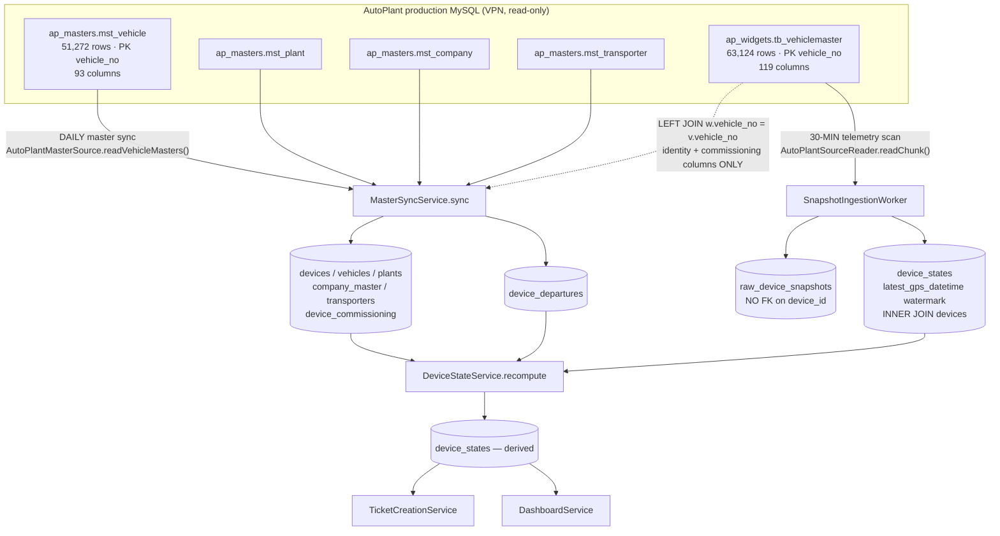
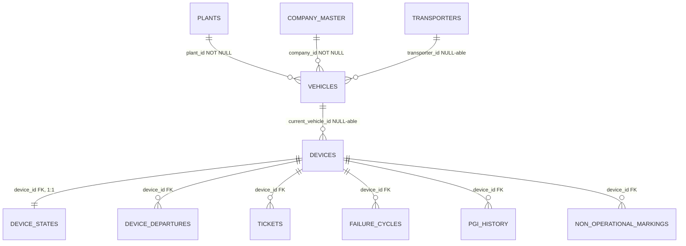

# AutoPlant → FSM Device Source Architecture — Feasibility Analysis

**Investigation date:** 2026-08-12 · **Branch:** `feat/autoplant-integration` · **Type:** READ-ONLY architecture
investigation. **No application code, schema, migration, test, or database object was modified.** Live reads were
executed against AutoPlant production MySQL (read-only account, over VPN) and the FSM PostgreSQL database
(`SELECT`-only).

**Evidence tags:** **[VC]** verified from code · **[VD]** verified from live data · **[VT]** verified from test ·
**[INF]** inferred · **UNKNOWN** — could not be settled by this investigation.

---

## Table of contents

| § | Section |
|---|---|
| 1 | [Executive Summary](#1-executive-summary) |
| 2 | [Current Architecture](#2-current-architecture) |
| 3 | [Current `mst_vehicle` Flow](#3-current-mst_vehicle-flow) |
| 4 | [Current `tb_vehiclemaster` Flow](#4-current-tb_vehiclemaster-flow) |
| 5 | [The 11,852 Orphan Devices](#5-the-11852-orphan-devices) |
| 6 | [FSM Device Data Model](#6-fsm-device-data-model) |
| 7 | [Downstream Impact Analysis](#7-downstream-impact-analysis) |
| 8 | [Hidden Architectural Assumptions](#8-hidden-architectural-assumptions) |
| 9 | [Feasible Architecture Options](#9-feasible-architecture-options) |
| 10 | [Before/After Behaviour Analysis](#10-beforeafter-behaviour-analysis) |
| 11 | [Regression Risk](#11-regression-risk) |
| 12 | [Testing Strategy](#12-testing-strategy) |
| 13 | [Safety Gate](#13-safety-gate) |
| 14 | [Final Verdict](#14-final-verdict) |
| 15 | [Required Next Steps](#15-required-next-steps) |

---

## 1. Executive Summary

**What was asked.** Whether FSM's ingestion can safely be re-anchored so that the broader device population visible
in `ap_widgets.tb_vehiclemaster` (63,124 devices) is accounted for, rather than only the population visible in
`ap_masters.mst_vehicle` (51,272) — up to and including replacing `mst_vehicle` with `tb_vehiclemaster` as the
device-list source.

**What the investigation found.**

1. **The two tables are not two views of one population — they carry different authority.** `mst_vehicle` is the
   fitment/vehicle master and is the only source that carries a **usable company linkage** (via
   `mst_plant.company_id`). `tb_vehiclemaster` is a telemetry latest-state table that also carries a *denormalised
   copy* of plant/transporter/deployment. Its deployment-status column **disagrees with the master on 519 rows,
   in one direction only** (widgets says operational where masters says not) **[VD]**. Re-anchoring on widgets
   therefore silently moves **+519 devices into the operational fleet** before a single orphan is considered.

2. **The 11,852 orphans are a closed, dead, structurally-identifiable population.** All 11,852 have an `RR_`/`RR-`
   prefixed `vehicle_no` (**zero exceptions**). **Not one has reported in the last 90 days**; the newest ping across
   the entire set is `2025-12-17`, roughly eight months stale, and 2,922 have never reported at all. 4,139 sit on
   plants FSM has already **deactivated**; 2,211 sit on plants that are **INACTIVE at source**. 646 carry an
   "operational" widgets status — and every one of those is stale or never-reported too **[VD]**.

3. **Introducing them as normal FSM devices would not be a marginal change — it would restate the fleet.**
   Measured against the live FSM database: `operationalDevices` +77.0%, `inactiveOperational` **+326.6%**,
   `neverReported` +366.2%, and **Fleet Health % would fall from 81.3% to 50.4%** — with `healthyOperational`
   unchanged at 11,854, because every added device is broken by construction **[VD]**.

4. **It would also disable a live safety mechanism.** Any orphan given a fitment on a synced plant becomes an
   `ABSENT_FROM_READ` candidate on the very next master sync, because it is by definition not in the `mst_vehicle`
   read. That drives the absence ratio to **26.2%**, past the 10% blast limiter, which **aborts the entire absence
   pass fleet-wide** — legitimate departures stop being detected, silently **[VC + VD]**.

5. **The Company → Plant hierarchy is NOT the blocker (follow-up measurement, §5.7).**
   `tb_vehiclemaster.plant_id` agrees with `mst_vehicle.plant_id` on **51,278 of 51,280** rows (2 divergent rows,
   both same-company, both mid-re-map). For the orphans it resolves **11,849 of 11,852** to a plant and,
   deterministically (**no** `mst_plant` plant_id carries more than one `company_id`), to a company — **all 14 of
   which already exist in FSM**. Attribution works. What it exposes instead: **4,139** of those devices land on
   plants FSM has **deactivated**, **4,674** on **UNZONED** plants, and **2,211** on plants **INACTIVE at source**
   whose inclusion would require widening `MasterSyncScope.plantStatuses` for the entire fleet **[VD]**.

6. **A real, separate finding surfaced.** The "AutoPlant Catalog" KPI claims to be *"the unfiltered source catalog…
   Nothing [excluded]"* (`apps/admin/src/lib/kpiCatalog.ts:53-70`). It is not: it is
   `stats.devices.observed` — the distinct fitted `device_id`s of the **`mst_vehicle`** read, currently **51,174**
   against an actual AutoPlant device catalog of **63,124**. The card under-reports the source catalog by ~11,950
   devices and its own catalog entry is the thing that makes the claim **[VC + VD]**.

**Verdict (§14): POSSIBLE BUT REQUIRES ISOLATION.** Replacing `mst_vehicle` with `tb_vehiclemaster` is **NOT
FEASIBLE** without an architectural breaking change. Making the broader population *visible* — as a discovery
ledger and a corrected catalog counter, with **no `devices` rows created** — is feasible and can be proven safe,
because nothing downstream reads a table that does not yet exist. Any option that creates `devices` rows requires
a new source-class discriminator plus an exclusion predicate added to **at least three read paths that currently
have no plant-based containment**, and cannot be declared safe on present evidence.

---

## 2. Current Architecture

### 2.1 The two independent pipelines

FSM reads AutoPlant through **two pipelines with different cadences, different anchors, and different write
targets** **[VC]**. Conflating them is the single most common source of confusion about this system.



**The load-bearing asymmetry:** the master sync **defines which devices exist**; the telemetry scan **only updates
devices that already exist**. `SnapshotIngestionService.upsertDeviceStates` joins `devices` (`INNER JOIN devices d
ON d.device_id = u.device_id`, `snapshot-ingestion.service.ts:144`), so a ping for an unknown device is journaled
into `raw_device_snapshots` and then dropped, counted as `unknownDevices` **[VC]**.

That drop is measurable today: the journal holds **33,671 distinct `device_id`s that have no `devices` row**, across
488,647 rows **[VD]**. The orphan telemetry is *already being read and stored* — it simply never becomes state.

### 2.2 Stage-by-stage trace (master sync)

| # | Stage | File · function | Input | Output | Filtering / validation | DB write |
|---|---|---|---|---|---|---|
| 0 | Run start | `master-sync-run.service.ts` · `startRun()` | — | `runId` | advisory lock + partial-unique one-RUNNING | `master_sync_runs` |
| 1 | Plants | `master-sync.service.ts:212-237` · `sync()` → `readPlants()` | `mst_plant` keyset pages ≤90, `status IN ('ACTIVE')` | `plantPlans` | `plantInScope()` (status) then `PlantZoneResolver.resolve()`; skips `OUT_OF_SCOPE_STATUS`, `ZONE_UNRESOLVED`; in-memory dedup on composite PK | `plants` upsert on `sourcePlantId`; `zoneId`/`districtId` INSERT-ONLY |
| 2 | Companies | `:244-263` | `mst_company` | `companyPlans` | **derived** — only companies an in-scope plant references; `company_type` never consulted; skip `NO_INSCOPE_PLANT` | `company_master` upsert; `companyTier`/`companyPriorityRank` INSERT-ONLY |
| 3 | Transporters | `:267-290` | `mst_transporter` | plans | best-effort company FK | `transporters` upsert |
| 4 | **Vehicles** | `:299-327` · `readVehicleMasters()` | the 3-way join (§3.1) | `vehiclePlans` | `PLANT_NOT_SYNCED` / `COMPANY_NOT_SYNCED`; **insert-scope pin**: `!isOperationalStatus(status) && !existingVehicles.has(no)` → `NOT_DEPLOYED_NEVER_KNOWN` | `vehicles` upsert on `vehicleNo`; `status` mirrored verbatim |
| 5 | **Devices** | `:336-372` | same rows | `devicePlans` | requires `vehicleIdByNo.get(vehicle_no)`; `NO_FITTED_DEVICE` when `device_id` blank; same insert-scope pin. **`stats.devices.observed` = distinct non-blank `device_id` over the whole read** | `devices` upsert on `deviceId`; `dealType` excluded from create AND update |
| 6 | Commissioning | `:457-519` · `appendCommissioning()` | mirrored device set only | facts | append-only, `createMany({skipDuplicates})`, batched 1000 | `device_commissioning` |
| 7 | **Departures** | `:534-575` · `reconcileDepartures()` | `observed` map + `syncedPlantIds` | reconcile result | `SOURCE_STATUS` unconditional; `ABSENT_FROM_READ` scoped to synced plants **and** capped at `DEFAULT_MAX_ABSENCE_RATIO = 0.1` | `device_departures`, ticket cancellations |
| 8 | MV refresh | `:406-423` | — | — | best-effort | `plant_eligible_floating_se` |

### 2.3 Stage-by-stage trace (telemetry)

| # | Stage | File · function | Filtering | DB write |
|---|---|---|---|---|
| 1 | Read | `autoplant-source-reader.ts:87-134` · `readChunk()` | `WHERE latest_gps_datetime IS NOT NULL AND device_id IS NOT NULL AND TRIM(device_id) <> ''`, keyset `device_id > ?`, `LIMIT 90`. **No `mst_vehicle` predicate — the whole widgets table is scanned** | — |
| 2 | Normalize | `normalize.ts` / `mapping.ts` | offset 0 (UTC); skew guard drops `> now+60min` / `< 2000-01-01`, counted | — |
| 3 | Journal | `snapshot-ingestion.service.ts:73-76` | `createMany({skipDuplicates})` | `raw_device_snapshots` — **no FK on `device_id`** |
| 4 | Watermark | `:135-151` | `JOIN devices d` — unknown ids skipped, counted `unknownDevices` | `device_states.latest_gps_datetime / trip_creation_datetime / first_reported_at` |
| 5 | Gate | `integration-sync.service.ts` · `runPostIngestStages()` | `status === 'SUCCESS'` else `skipDerivation` (#230) | — |
| 6 | Derive | `device-state.service.ts:156-200` · `recompute()` | one set-based UPDATE in a transaction + `assertDepartureInvariant` | `device_states` derived columns |
| 7 | Auto-recovery → ticket creation | `auto-recovery.service.ts`, `ticket-creation.service.ts` | see §7 | `tickets`, `failure_cycles` |

---

## 3. Current `mst_vehicle` Flow

### 3.1 Every query against it **[VC]**

There is exactly **one** production read of `mst_vehicle` that produces rows, plus one count:

`AutoPlantMasterSource.readVehicleMasters()` (`autoplant-master-source.ts:227-283`), keyset-paged at ≤90:

```sql
SELECT v.vehicle_no, v.device_id, v.plant_id,
       p.company_id,                          -- from the plant, NOT from mst_vehicle
       v.transporter_id, v.deployment_status,
       w.DEVICE_TYPE, w.IMSI_NO,
       w.FIRST_INSTALLED_DATE_TIME, w.FIRST_INSTALLED_BY, w.INSTALLATION_REMARK
FROM `ap_masters`.`mst_vehicle` v
LEFT JOIN (SELECT plant_id, MIN(company_id) AS company_id
           FROM `ap_masters`.`mst_plant` GROUP BY plant_id) p ON p.plant_id = v.plant_id
LEFT JOIN `ap_widgets`.`tb_vehiclemaster` w ON w.vehicle_no = v.vehicle_no
[WHERE v.vehicle_no > ?]
ORDER BY v.vehicle_no LIMIT 90
```

`AutoPlantMasterSource.countVehicleMasters()` (`:183-189`):
```sql
SELECT COUNT(*) FROM `ap_masters`.`mst_vehicle` WHERE deployment_status IN ('DEPLOYED','ACTIVE')
```
`AutoPlantMysqlClient.ping()` (`autoplant-mysql.client.ts:202`) also counts it.

### 3.2 Fields consumed, and where each one lands **[VC]**

| Source field | Consumer | FSM destination | Notes |
|---|---|---|---|
| `v.vehicle_no` | `mapVehicle` (`master-mapping.ts:306-325`) | `vehicles.vehicle_no` (`@unique`) | **the upsert key**; also the join key to widgets |
| `v.device_id` | `mapDevice` (`:405-429`) | `devices.device_id` (PK) | `cleanStr` folds `''`/`NA`/`NULL`; blank ⇒ `NO_FITTED_DEVICE` skip |
| `v.plant_id` | `mapVehicle` | `vehicles.plant_id` (**NOT NULL**) → denormalised to `device_states.plant_id` | must resolve to a synced plant or `PLANT_NOT_SYNCED` |
| `p.company_id` (**mst_plant**) | `mapVehicle` | `vehicles.company_id` (**NOT NULL**) → `device_states.company_id` | **`mst_vehicle.company_id` is never read** — it is 0/unreliable in production (`autoplant-master-source.ts:228`) |
| `v.transporter_id` | `mapVehicle` | `vehicles.transporter_id` | `toBigIntOrNull` folds `0` → null |
| `v.deployment_status` | `mapVehicle`, `isOperationalStatus`, `reconcileDepartures` | `vehicles.status` (verbatim mirror) | drives the insert-scope pin, departures, and `all-deployed` eligibility |

### 3.3 Is `mst_vehicle` authoritative? — proven, not assumed

| Question | Answer | Evidence |
|---|---|---|
| Authoritative **fitment**? | **Yes.** `devices.device_id` and `devices.current_vehicle_id` are produced only from this read. | `master-sync.service.ts:348-372`; `mapDevice` is the sole writer of the device row **[VC]** |
| Authoritative **vehicle master**? | **Yes, structurally.** `vehicles` is keyed on `vehicle_no` sourced here; there is no second writer. | `master-sync.service.ts:299-327` **[VC]** |
| Authoritative **deployment source**? | **Yes today — and demonstrably the *safer* of the two.** Widgets' `vehicle_deployment_status` disagrees on 519 matched rows, and every disagreement is widgets claiming operational where masters does not. | §4.3 **[VD]** |
| Authoritative **company**? | **No — and it never was.** Company comes from `mst_plant.company_id` through a `MIN() GROUP BY plant_id` subquery. | `autoplant-master-source.ts:263-277` **[VC]** |
| Merely one source among several? | **No.** It is the *only* source of device existence. Widgets contributes five static columns to the same row and nothing else. | `readVehicleMasters` select list **[VC]** |

**Conclusion:** `mst_vehicle` is the authoritative fitment and vehicle master. It is *not* the authoritative company
source, and that matters for §9 — because `tb_vehiclemaster` has **no company column at all** that FSM could
substitute.

---

## 4. Current `tb_vehiclemaster` Flow

### 4.1 What the table actually is **[VD]**

| Property | Value |
|---|---|
| Rows | **63,124** |
| Distinct `device_id` (non-blank) | **63,124** — device_id is effectively unique |
| Distinct `vehicle_no` | 63,124 — `vehicle_no` is the declared **PK** |
| Columns | **119** (vs 93 on `mst_vehicle`) |
| Indexed | `vehicle_no` PRI; `device_id` MUL; `plant_id` MUL; `transporter_code` MUL |

It is a **latest-state table**: exactly one row per device, mutated forward by the fleet. It is **mixed-grain** —
telemetry *and* device identity *and* a denormalised copy of the org hierarchy *and* commissioning history:

| Group | Columns |
|---|---|
| Telemetry | `latest_gps_datetime`, `latitude`, `longitude`, `speed`, `IGNITION_STATUS`, `gpssignal`, `SIGNAL_RECEIVED_TIME`, `DISTANCE`, `BATTERY_STATUS`, `MAIN_STATUS`, `PACKET_STATUS`, `current_location` |
| Trip state | `TRIP_CREATION_DATETIME`, `active_trip_id` |
| Device identity | `device_id`, `DEVICE_TYPE`, `IMSI_NO`, `VENDOR`, `VENDOR_NAME`, `HW_VERSION`, `SW_VERSION`, `SIM_VENDOR`, `VIEW_DEVICE_ID` |
| **Org (denormalised)** | `plant_id`, `plant_code`, `plant_name`, `transporter_id`, `transporter_code`, `transporter_name`, `billing_plant_id`, `BILLING_PLANT_CODE`, `hierarchy_path` |
| **Status (denormalised)** | **`vehicle_deployment_status`**, `VEHICLE_STATUS`, `vehicle_power_status`, `MAINTENANCE`, `VEHICLE_DATA_SOURCE` |
| Commissioning | `FIRST_INSTALLED_DATE_TIME`, `FIRST_INSTALLED_BY`, `FIRST_INSTALLED_COMPANY_ID`, `INSTALLATION_REMARK`, `INSTALLATION_SUBREMARK`, `LATEST_INSTALLATION_DATE_TIME`, `LATEST_INSTALLED_BY`, `LATEST_INSTALLATION_COMPANYID`, `DEVICE_REMOVED_DATE_TIME`, `DEVICE_REMOVED_BY`, `device_installation_date` |
| Vehicle attributes | `VEHICLE_MAKE`, `VEHICLE_MODEL_NO`, `CHASSIS_NO`, `ENGINE_NO`, `NO_OF_WHEELS`, `FUEL_TYPE`, dimensions, weights, `DRIVER_ID`, `DRIVERNAME`, `INSURANCE_EXPIRY_DATE` |

**There is no `company_id` column.** The nearest candidates — `FIRST_INSTALLED_COMPANY_ID`,
`LATEST_INSTALLATION_COMPANYID`, `reruncompanyid` — are *installation-event* attributions, not the vehicle's owning
company, and none has been validated against `mst_plant.company_id`. **UNKNOWN** whether any is usable; it was out of
scope to prove and must not be assumed.

`DEVICE_REMOVED_DATE_TIME` is **NULL on all 63,124 rows** — the column is unused fleet-wide, so "the fitment record
was deleted" cannot be evidenced from it **[VD]**.

### 4.2 What FSM reads from it today **[VC]**

Two disjoint column sets, on two different cadences:

| Path | Columns read | Cadence | Row scope |
|---|---|---|---|
| Telemetry scan (`AutoPlantSourceReader`) | `device_id, latest_gps_datetime, latitude, longitude, speed, IGNITION_STATUS, DEVICE_TYPE, TRIP_CREATION_DATETIME, gpssignal` | 30 min | **the whole table** where `latest_gps_datetime IS NOT NULL` |
| Master enrichment (`readVehicleMasters` LEFT JOIN) | `DEVICE_TYPE, IMSI_NO, FIRST_INSTALLED_DATE_TIME, FIRST_INSTALLED_BY, INSTALLATION_REMARK` | daily | only rows whose `vehicle_no` matched a `mst_vehicle` row |

`vehicle_deployment_status`, `plant_id`, `plant_name`, `transporter_*` on this table are **never read by FSM** —
verified by the two select lists above.

### 4.3 The deployment-status disagreement — the decisive measurement **[VD]**

Over the 51,263 rows present in **both** tables:

| widgets `vehicle_deployment_status` | masters `deployment_status` | rows |
|---|---|---|
| UNDEPLOYED | UNDEPLOYED | 34,968 |
| ACTIVE | DEPLOYED | 8,441 |
| DEPLOYED | DEPLOYED | 7,031 |
| **ACTIVE** | **UNDEPLOYED** | **489** |
| MAINTENANCE | MAINTENANCE | 259 |
| ACTIVE | ACTIVE | 38 |
| **ACTIVE** | **MAINTENANCE** | **26** |
| DEPLOYED/UNDEPLOYED | DEPLOYED/UNDEPLOYED | 4 |
| **DEPLOYED** | **MAINTENANCE** | **3** |
| DEPLOYED | ACTIVE | 2 |
| **DEPLOYED** | **UNDEPLOYED** | **1** |

Evaluated through FSM's own allow-list `OPERATIONAL_DEPLOYMENT_STATUSES = ['DEPLOYED','ACTIVE']`
(`master-mapping.ts:174`):

```
rows where the two columns disagree on "is operational"           = 519
  ... widgets says operational, masters says NOT                  = 519   (100%)
  ... masters says operational, widgets says NOT                  =   0
operational fleet per masters   = 15,513
operational fleet per widgets   = 16,678   ( = 15,513 + 519 + 646 orphans )
```

**This is the finding that decides the source-anchor question.** The disagreement is not noise and not symmetric:
adopting widgets' status column adds 519 devices to the operational fleet — devices the authoritative master says
are UNDEPLOYED or in MAINTENANCE — *before any orphan is introduced at all.*

---

## 5. The 11,852 Orphan Devices

### 5.1 Set arithmetic **[VD]**

| Measure | Value |
|---|---|
| Distinct `device_id` in `tb_vehiclemaster` | 63,124 |
| Distinct `device_id` in `mst_vehicle` | 51,272 |
| In widgets, **absent** from masters | **11,852** |
| In masters, absent from widgets | **0** |
| Same count when joined on `vehicle_no` instead of `device_id` | 11,852 — identical |
| Orphan rows whose `device_id` exists in `mst_vehicle` under a different `vehicle_no` | **0** |

The containment is strictly one-way, and the identity is clean: **no duplicate-device or duplicate-vehicle risk
exists on either key**.

> Measurement note: `mst_vehicle` returned 51,272 rows at 09:4x and 51,263 rows ~30 min later. The source
> hard-deletes rows without a tombstone (a known behaviour, issue #220), so all figures here are as-of stamps, not
> constants.

### 5.2 Identity family — completely homogeneous **[VD]**

| `vehicle_no` prefix | orphans |
|---|---|
| `RR_` | 11,850 |
| `RR-` | 2 |
| anything else | **0** |

But `RR_` is **not itself the discriminator**: **9,074 `RR_` rows *are* present in `mst_vehicle`** and are mirrored
normally (FSM already holds 2,398 `RR_` devices). The orphan set is the *subset of the `RR_` family that the
authoritative vehicle master does not carry.*

`device_id` shapes within the set: mostly `RR_D<n>` mirroring `RR_V<n>`, and for the SIM-tracking rows
`device_id == vehicle_no` verbatim.

### 5.3 Activity — the single most important characteristic **[VD]**

| Bucket | Orphans | Matched population (for contrast) |
|---|---|---|
| Never reported | **2,922** | 3,451 |
| Reported ≤ 24 h | **0** | 21,357 |
| Reported ≤ 48 h | **0** | — |
| Reported ≤ 7 d | **0** | 23,348 |
| Reported ≤ 30 d | **0** | 25,744 |
| Reported ≤ 90 d | **0** | — |
| Reported ≤ 365 d | 4,172 | — |
| Older than 1 y | 4,758 | 1,981 |
| **Newest ping in the entire set** | **2025-12-17 16:53:49** | — |
| Oldest ping | 2024-11-25 18:29:10 | — |

**Not one of the 11,852 has produced a GPS fix in the last 90 days**, against an investigation date of 2026-08-12.
Applying FSM's own 24-hour threshold: **8,930 would be `is_inactive`, 2,922 would be `NEVER_REPORTED`, and 0 would be
healthy.**

### 5.4 Organisational placement **[VD]**

| Dimension | Result |
|---|---|
| Orphans with a non-blank `plant_id` | 11,852 (100%) |
| `plant_id` resolves to an `mst_plant` row | 11,849 |
| …of which the plant is `ACTIVE` at source | **9,638** across **84** plants |
| …plant is `INACTIVE` at source | **2,211** across **3** plants |
| …no `mst_plant` row at all | 3 across 1 plant id |
| Orphans whose plant FSM **already has** | 9,638 |
| …of those, plant is **deactivated in FSM** | **4,139** |
| Transporter resolves in `mst_transporter` | 11,852 (100%) |
| Company | **not directly available** — would have to be derived through the plant, exactly as today |

Plant concentration is extreme: ~8,760 of 11,852 sit in eight Star-Cement-group plants (`NGU` 2,128;
`STARCEMENT - LUMS` 1,425; `SCL_SIDHEEGRAM` 1,301; `SCNEL GHY CEMENT` 1,271; `STARCEMENT - SGU` 1,037;
`SCL_RANAVAV` 912; `SCL GGU CEMENT` 393; `GGU` 296).

### 5.5 Lifecycle and hardware evidence **[VD]**

| Signal | Orphans | Matched |
|---|---|---|
| `FIRST_INSTALLED_DATE_TIME` present | 11,852 (100%) | 51,255 |
| `LATEST_INSTALLATION_DATE_TIME` present | 11,825 | — |
| `DEVICE_REMOVED_DATE_TIME` present | **0** | **0** (column unused fleet-wide) |
| `INSTALLATION_REMARK` = `Re-Mapping` | 4,108 | — |
| `INSTALLATION_REMARK` = `New Installation` | 104 | — |
| `INSTALLATION_REMARK` null | 7,640 | — |
| `VEHICLE_DATA_SOURCE` | `CURRENT` on all 11,852 | — |
| `VEHICLE_STATUS` | `true` on all 11,852 | — |
| Fitment created in 2025 / 2024 | 11,629 / 223 | — |

Device-type mix — **note that a large share is not AutoPlant hardware at all**:

| `DEVICE_TYPE` | `VENDOR` | n |
|---|---|---|
| *(blank)* | *(blank)* | 7,091 |
| `#NVT` | — / `AUTOPLANT` / `AUTOPLANT SYSTEM INDIA PVT LTD` | 3,490 |
| `V5` | — / `AUTOPLANT` | 313 |
| `NVT180` | — / `AUTOPLANT SYSTEM INDIA PVT LTD` | 231 |
| **`VENDOR_GPS`** | **`WHEELSEYE`** / — | 230 |
| **`TELENITY_SIM_TRACKING`** | *(blank)* | 136 |
| null | *(blank)* | 1 |

`TELENITY_SIM_TRACKING` and `VENDOR_GPS`/`WHEELSEYE` denote third-party or SIM-based tracking, not AutoPlant
field-serviceable hardware. FSM's entire service model (dispatch an SE to repair a fitted AutoPlant device) does not
apply to them.

### 5.6 Answering the Phase-4 questions directly

| Question | Answer |
|---|---|
| How many have recent GPS activity? | **Zero** within 90 days |
| ≤24 h / ≤48 h / ≤7 d / ≤30 d | 0 / 0 / 0 / 0 |
| How many are stale? | 8,930 stale + 2,922 never-reported = all 11,852 |
| Do they have vehicle numbers? Unique? | Yes; 11,852 distinct — `vehicle_no` is the PK |
| Vehicle numbers also in `mst_vehicle`? | **None** (that is the definition of the set) |
| Plant information? | Yes, 100%; 11,849 resolve to a real plant |
| Company information? | **No direct column**; derivable only through the plant |
| Deployment information? | Yes — `vehicle_deployment_status`: 11,206 UNDEPLOYED, 646 ACTIVE |
| Concentrated in particular companies/plants? | **Yes, extremely** — ~74% in eight Star-Cement plants |
| Specific device prefixes/vendors? | **Yes — 100% `RR_`/`RR-`**; vendor mix includes non-AutoPlant trackers |
| Historical devices? | Consistent with it: fitments 2024–2025, all activity ceased by 2025-12-17 |
| Likely legitimate *active* devices? | **No.** Zero activity in 90+ days, by measurement |
| Duplicates? | **No.** Zero `device_id` or `vehicle_no` collisions with the mirrored set |
| Telemetry-only records? | Partly — 2,922 have no telemetry at all, so "telemetry-only" is not a complete description |
| Retired/old devices? | Strongly indicated, but **UNKNOWN** without an AutoPlant owner confirming the `RR_` family's meaning |
| Fitment record deleted? | **Not evidenced** — `DEVICE_REMOVED_DATE_TIME` is null on every row in the table |

**Honest characterisation:** a closed, homogeneous, wholly-inactive identity family (`RR_*`) that AutoPlant's
telemetry table still marks `CURRENT` but that the authoritative vehicle master does not carry. Whether that means
*retired*, *superseded by a re-map*, or *never promoted into the master* is **UNKNOWN from FSM's side and must be
answered by AutoPlant's data owner** (§15).

### 5.7 `tb_vehiclemaster.plant_id` — the hierarchy IS resolvable (follow-up measurement, 2026-08-12)

A follow-up probe tested whether widgets' own `plant_id` can supply the Company → Plant hierarchy the orphans
appear to lack. **It can, and this supersedes the "no company source" framing used in §9 Option 1.**

| Measure | Result |
|---|---|
| Orphans with a numeric, non-zero `plant_id` | **11,852 / 11,852 (100%)** — 0 blank, 0 zero, 0 non-numeric |
| Resolve to an `mst_plant` row | **11,849 (99.97%)** |
| Do not resolve | **3** (all `plant_id = 3025`, no `mst_plant` row) |
| Distinct orphan plant_ids | 88 |
| `mst_plant` plant_ids carrying **>1** `company_id` | **0** — plant → company is **deterministic** |
| Composite-PK fan-out | only 4 of 27,420 plant_ids have >1 row (64/66/100/102); none multi-company |
| Orphans resolving a company that exists in `mst_company` | **11,849** (0 dangling) |
| Companies involved | **14, all already present in FSM** — 0 new companies required |

**Column-level trust is not table-level trust.** Measured over the 51,280 devices present in both tables:

| widgets column | disagreement with the master | verdict |
|---|---|---|
| **`plant_id`** | **2 / 51,280 (0.004%)** — both HCCB, both same company, both mid-`Re-Mapping` | **reliable** |
| `plant_name` | 12,812 / 63,118 (20.3%) | stale denormalised label |
| `vehicle_deployment_status` | 519 / 51,263 (1.01%, all one-directional) | **unreliable** |

**What `plant_id` means, determined from data:** the **current vehicle fitment / operating plant assignment**, kept
in lockstep with `mst_vehicle.plant_id`. Ruled out: *current GPS location* (disagreement uncorrelated with
`active_trip_id` — 0.00% off-trip vs 0.02% on-trip, which is the same 2 rows); *installation location* (separate
`FIRST_INSTALLED_*` / `LATEST_INSTALLATION_*` columns; the 2 divergences are rows caught between a re-map and the
master catching up); *billing plant* (`billing_plant_id` differs on 20,230 / 63,131 rows — a distinct concept).

**Why this does not change the verdict.** Attribution was never the binding constraint. What the resolvable
hierarchy exposes instead:

| Consequence | Devices |
|---|---|
| Orphans whose plant FSM already has | 9,638 |
| …but the FSM plant is **DEACTIVATED** (contradicts an explicit OH decision) | **4,139** |
| …and the FSM plant is **UNZONED** (counted by some surfaces, inner-joined away by others) | **4,674** |
| Orphans whose plant FSM lacks | 2,214 — only 4 plants: `3625 NGU`, `3626 NGU STO`, `3633 GSR` (all UTCL, **all INACTIVE at source**) + `3025` |
| **Plant-scope widening required** to attribute those | `MasterSyncScope.plantStatuses` would have to move beyond `['ACTIVE']` — a change that alters plant scope for the **entire fleet**, blast radius unmeasured |

A clean hierarchy makes these devices *easier to insert correctly*, which raises the stakes rather than lowering
them: the only remaining barrier to a wrong outcome is the isolation design, not a missing foreign key.

---

## 6. FSM Device Data Model

### 6.1 What makes a device a valid FSM device **[VC]**



| Table | Column | Nullable | FK target |
|---|---|---|---|
| `devices` | `device_id` (PK, text) | NO | — |
| `devices` | `current_vehicle_id` | **YES** | `vehicles.vehicle_id` |
| `devices` | `device_type`, `imsi_no`, `deal_type`, `sim_id` | YES | — |
| `device_states` | `device_id` (PK) | NO | `devices.device_id` |
| `device_states` | `plant_id`, `company_id`, `vehicle_id`, `transporter_id` | **YES** | *(no FK — denormalised copies)* |
| `device_states` | `is_inactive`, `eligible_for_uptime`, `has_open_failure_cycle`, `is_departed`, `computed_at` | NO (defaults) | — |
| `vehicles` | `plant_id` | **NO** | `plants.plant_id` |
| `vehicles` | `company_id` | **NO** | `company_master.company_id` |
| `vehicles` | `vehicle_no` | NO (`@unique`) | — |
| `raw_device_snapshots` | `device_id` | NO | **no FK** |

### 6.2 The Phase-5 question, answered against the actual schema

> Can FSM technically represent a device that has `device_id` + GPS telemetry but no `mst_vehicle` row, no fitment,
> no plant, no company, no deployment status?

**Yes — the schema permits it, and today's data is 100% conformant to the stricter shape without enforcing it.**

| Requirement | Enforced? | Evidence |
|---|---|---|
| Device must have a vehicle | **No** — `devices.current_vehicle_id` is nullable | `information_schema` **[VD]** |
| `device_states` must have a plant/company | **No** — both nullable, no FK | ″ |
| Telemetry must belong to a known device | **No** — `raw_device_snapshots` has no `device_id` FK | ″ |
| A **vehicle** must have a plant and a company | **YES — both NOT NULL** | ″ |

Current data: `devices_without_state = 0`, `devices_without_vehicle = 0`, `states_without_plant = 0`,
`states_without_company = 0` **[VD]**. So the "every device has a full fitment" invariant is **true in data and
untrue in schema** — it is a *convention held up by the master sync*, not a constraint.

**The consequence for feasibility:** a device row can be created without a vehicle. A **vehicle** row cannot be
created without a plant and a company. Any option that wants orphans to appear with plant/company attribution must
therefore synthesise `vehicles` rows — which is precisely what makes them indistinguishable from real fleet.

---

## 7. Downstream Impact Analysis

### 7.1 The containment map — which read paths would see a new `device_states` row

This is the crux of the whole analysis. Containment is **not uniform**, and the difference is the join style.

| Consumer | File · line | Join to `plants` | Sees a row with `plant_id = NULL`? | Sees a row with a real plant? |
|---|---|---|---|---|
| `/dashboard/zone-overview` | `dashboard.service.ts:428` | **INNER** | ❌ no | ✅ **yes** |
| `/dashboard/fleet-summary` | `:493` | **INNER** | ❌ no | ✅ yes |
| `/dashboard/fleet-composition` | `:529,535` | **INNER** | ❌ no | ✅ yes |
| `/dashboard/fleet-directory` | `:623,637` | **INNER** | ❌ no | ✅ yes |
| `/dashboard/company-plant-overview` | `:691,705` | **INNER** | ❌ no | ✅ yes |
| `/dashboard/activity-trend` (live bucket) | `:986` | **INNER** | ❌ no | ✅ yes |
| Ops-explorer reconciliation (all identities) | `reconciliation.service.ts:97-100` | **INNER** | ❌ no | ✅ yes |
| Soft-inactive count / operating mode | `soft-inactive-count.service.ts:79` | **INNER** | ❌ no | ✅ yes |
| Ticket creation | `ticket-creation.service.ts:49-50` | `plantId not null` + `companyId not null` | ❌ no | ⚠️ **only if `eligible_for_uptime`** |
| Lifecycle drift (health + identity) | `health.service.ts:337` | **INNER JOIN vehicles** | ❌ no (if no vehicle) | ✅ yes |
| **`GET /api/devices` (Device Detail page)** | `device.service.ts:213-215` | **LEFT** | ✅ **YES** | ✅ yes |
| **`GET /api/exports/entity-mapping` (CSV)** | `entity-mapping-export.service.ts:122-125` | **LEFT**, no filter at all | ✅ **YES** | ✅ yes |
| **Fleet-uptime cube writer** | `fleet-uptime-aggregation.service.ts:67-73` | **LEFT**, every `device_states` row | ✅ **YES** (as a row) | ✅ yes |

**Three read paths have no plant-based containment.** Any option that creates `device_states` rows leaks into the
Device Detail list, the OH entity-mapping export, and the monthly downtime cube — regardless of whether a plant is
attached.

### 7.2 Per-system impact

#### Device State

**CURRENT:** 27,185 `device_states` rows; derivation is a pure function of `latest_gps_datetime` (or
`MIN(device_commissioning.installed_at)`), the departure ledger, and the eligibility mode. It does **not** depend on
plant or company **[VC — `device-state.service.ts:156-197`]**.

**POTENTIAL NEW:** every introduced device gets a row from step 1 (`INSERT … SELECT d.device_id FROM devices`) the
moment it exists. With 8,930 stale + 2,922 never-reported: `is_inactive = true` for **all 11,852**, `sla_bucket`
non-null for all, `is_departed = false` (no departure row exists yet).
`eligible_for_uptime = COALESCE(v.status IN ('ACTIVE','DEPLOYED'), false)` → **false without a vehicle, true if a
vehicle with an operational status is synthesised**.

**RISK:** 🔴 High if a vehicle is synthesised; 🟡 contained if not.
**EVIDENCE:** `device-state.service.ts:143-151, 176-197` **[VC]**; activity buckets §5.3 **[VD]**.

#### Dashboard

**CURRENT (live, non-deactivated plants):**
`operational 15,386 · reporting 14,588 · inactive 2,734 · healthy 11,854 · neverReported 798 · Fleet Health 81.3% ·
Inactive 18.7%` **[VD]**

**POTENTIAL NEW — if all 11,852 became normal operational devices with plant attribution:**

| KPI | Before | After | Δ |
|---|---|---|---|
| `operationalDevices` | 15,386 | 27,238 | **+77.0%** |
| `reportingOperational` | 14,588 | 23,518 | +61.2% |
| `inactiveOperational` | 2,734 | 11,664 | **+326.6%** |
| `healthyOperational` | 11,854 | 11,854 | 0% |
| `neverReported` | 798 | 3,720 | **+366.2%** |
| **Fleet Health %** | **81.3%** | **50.4%** | **−30.9 pts** |
| **Inactive %** | **18.7%** | **49.6%** | **+30.9 pts** |
| Companies / Plants counts | 45 / 931 | +0 companies, +up to 4 plants | small but non-zero |

Also changed: SLA-bucket distribution (all 8,930 stale devices land in `SEVERE`/`VERY_SEVERE`/`LONG_PENDING` given
8+ months of silence), Critical Devices, Inactive > 24 Hr, zone rows, company/plant rows, Fleet Directory.

**RISK:** 🔴 **Critical — this is a restatement of the fleet, not a widening of it.**
**EVIDENCE:** live simulation over `device_states ⋈ plants` minus deactivations **[VD]**.

#### Tickets

**CURRENT:** 27,871 tickets; 14,332 open TROUBLESHOOT. Gate =
`isInactive ∧ eligibleForUptime ∧ ¬hasOpenFailureCycle ∧ ¬activeDeparture ∧ plantId≠null ∧ companyId≠null ∧ company exists`
**[VC — `ticket-creation.service.ts:34-52`]**.

**POTENTIAL NEW:** with no vehicle → `eligible_for_uptime = false` → **no tickets**. With a synthesised operational
vehicle on a live plant → **all 11,852 qualify on the first post-ingest pass** (every one is inactive; none has an
open cycle). Ticket volume would roughly **double**, and every one of those tickets would be a dispatchable
instruction to visit a device that has been dead for 8+ months.

**RISK:** 🔴 Critical if fitment is synthesised; ✅ none if `eligible_for_uptime` stays false.
**EVIDENCE:** gate above **[VC]**; §5.3 activity **[VD]**.

#### Engineers / Batches / Dispatch / Recommendations

**CURRENT:** the recommender's pool is `TROUBLESHOOT / OPEN / UNASSIGNED` tickets with a live plant and a
non-departed device (`recommender.service.ts:126`) **[VC]**. Batches and day plans are built only from
recommendations.

**POTENTIAL NEW:** these systems have **no independent device gate** — they inherit whatever ticket creation
produced. No tickets ⇒ no recommendations ⇒ no batches ⇒ no assignments. Tickets ⇒ all of it.

**RISK:** 🔴 Critical if tickets are created (11,852 phantom dispatch targets, concentrated in 8 plants — the SE
capacity in those zones would be consumed by dead hardware); ✅ none otherwise.
**EVIDENCE:** the chain is strictly ticket-driven **[VC]**.

#### Fleet Uptime

**CURRENT:** cube = 45,149 rows over 24,840 devices × 2 months; `eligible = eligible_for_uptime AND
latest_gps_datetime IS NOT NULL`; the report reads `WHERE eligible = true` **[VC + VD]**.

**POTENTIAL NEW:** the writer reads **every** `device_states` row via LEFT JOIN, so it writes a cube row per new
device per month (+~23,700 rows over the current two months) **even when `eligible = false`**. The **percentage** is
unaffected while `eligible_for_uptime` is false. If eligibility is granted, the 8,930 stale devices each carry a
failure cycle spanning the whole window ⇒ near-0% uptime contributions.

**RISK:** 🟡 storage/latency only while ineligible; 🔴 if eligible.
**EVIDENCE:** `fleet-uptime-aggregation.service.ts:67-73` **[VC]**.

#### Company / Plant / Zone

**CURRENT:** 45 companies, 931 plants, zone distribution West 431 / UNZONED 197 / North 184 / South 74 / East 45
**[VD]**.

**POTENTIAL NEW:** the orphans span **88 distinct source plants — 84 FSM already has, 3 INACTIVE at source, 1 with
no plant row**. To attribute them, at most 4 new plants would be needed. Company counts would likely not move (their
plants' companies already exist). **But 4,139 orphans sit on plants FSM has deliberately deactivated** — surfacing
them would contradict an explicit OH decision.

**RISK:** 🟠 Medium — small count changes, but a direct conflict with plant-deactivation semantics.
**EVIDENCE:** §5.4 **[VD]**.

#### Reports

**CURRENT:** root-cause / ZM-scorecard / system-efficiency cubes are all driven by tickets, cycles, submissions and
audit logs — none reads `device_states` directly except fleet-uptime.

**POTENTIAL NEW:** unchanged while no tickets are created. If tickets are created, every cube shifts and **historical
months would be restated on the next recompute** (the cube writers are delete+insert / upsert per period).

**RISK:** 🔴 Critical if tickets are created — including retroactive restatement.
**EVIDENCE:** `reports/*-aggregation.service.ts` rebuild semantics **[VC]**.

#### Exports

**CURRENT:** `GET /api/exports/entity-mapping` streams **every `device_states` row** with LEFT JOINs and no
plant/deactivation filter **[VC — `entity-mapping-export.service.ts:122-131`]**.

**POTENTIAL NEW:** +11,852 CSV rows immediately, with blank zone/company cells for unattributed ones.

**RISK:** 🟠 Medium — the OH's authoritative device→org export silently changes size and gains rows that are not on
any dashboard.

#### APIs

**CURRENT:** `GET /api/devices` returns `{rows, total}`; `total` counts the same LEFT-joined population.

**POTENTIAL NEW:** `total` jumps from 27,185 toward 39,037; the Device Detail page's "Showing 1–100 of 17,415"
caption and every page of the list change. No response *shape* changes; the **counts** do.

**RISK:** 🟠 Medium — contract preserved, values not.

#### Frontend

**CURRENT:** the Device Detail page, Fleet Directory, and all dashboard tables render server-supplied counts.

**POTENTIAL NEW:** Device Detail gains ~11.9k rows; the `NEVER_REPORTED` filter gains 2,922; dashboards change only
if plant attribution is given. The admin does no client-side device filtering that would contain this **[VC]**.

**RISK:** 🟠 Medium.

#### The absence guard — a systemic effect, not a KPI effect

**CURRENT:** `DeviceDepartureService.reconcile` treats a device as an absence candidate when it is **not** in the
`observed` map (built from the `mst_vehicle` read) **and** its plant is in `syncedPlantIds`. Guard:
`absent / inScopeDevices > 0.10` ⇒ **the whole absence pass is abandoned** **[VC — `device-departure.service.ts:150-194`]**.

**POTENTIAL NEW:** orphans are *by definition* absent from the `mst_vehicle` read. Give 9,638 of them a fitment on
an already-synced plant and:

```
in-scope devices today        27,185
orphans added with fitment     9,638
new in-scope total            36,823
absence ratio            9,638/36,823 = 26.2%   >  10%
⇒ ABSENCE_GUARD_TRIPPED on every subsequent sync
```

**RISK:** 🔴 **Critical and silent.** The guard failing "safe" means genuine departures stop being recorded — the
exact regression class of #218, where the lifecycle pass ran dead for 27 consecutive green syncs. Current
`missing_from_source` is 2,689 and `drift` is 49; both would freeze.
**EVIDENCE:** simulation against live counts **[VD]**.

---

## 8. Hidden Architectural Assumptions

Searched across `apps/backend/src`, `apps/admin/src`, `packages/shared`, `prisma/`, migrations, seeds and
`apps/backend/test`.

| # | Assumption | Where it lives | Enforced? | Breaks if orphans are added? |
|---|---|---|---|---|
| A1 | **Device existence originates from the master sync** | `mapDevice` is the only writer of `devices`; `SnapshotIngestionService` explicitly defers unknown ids | convention **[VC]** | **Yes** — a second creation path would be the first ever |
| A2 | **Every device has a current vehicle** | true in data (0 exceptions), nullable in schema | data-only **[VD]** | Yes, if created without fitment |
| A3 | **Every `device_states` row has a plant and a company** | true in data (0 exceptions); dashboards rely on it via INNER JOIN | data-only **[VD]** | Yes — and the reliance is *implicit*, expressed as a join style rather than a predicate |
| A4 | **`device_states` ⊆ mirrored operational fleet** | `FLEET_COUNT_COLUMNS` doc: *"Every device FSM mirrors for this entity"* (`dashboard.service.ts`) | convention **[VC]** | Yes — "mirrored" would stop meaning "mirrored from the vehicle master" |
| A5 | **The absence of a device from the `mst_vehicle` read means it departed** | `device-departure.service.ts:169-176` | code **[VC]** | **Yes — catastrophically** (§7, absence guard) |
| A6 | **`vehicles.status` is the deployment truth** | `eligibility.ts` `all-deployed` mode; lifecycle drift identity | code **[VC]** | Yes if widgets' column is adopted (519-row disagreement) |
| A7 | **AutoPlant Catalog = the unfiltered source catalog** | `apps/admin/src/lib/kpiCatalog.ts:53-70`; `stats.devices.observed` | **already false** — 51,174 vs 63,124 **[VC + VD]** | Already broken today; would change value if the counter is corrected |
| A8 | **`countVehicleMasters()` counts what a sync would create** | `autoplant-master-source.ts:178-189`, reused verbatim by the health reconciliation | code **[VC]** | Yes — a second source would need its own counterpart or the identity becomes meaningless |
| A9 | **A device is FSM-serviceable AutoPlant hardware** | implicit across dispatch, van stock, common-kit filters | convention | Yes — 366 orphans are `WHEELSEYE`/`TELENITY_SIM_TRACKING` |
| A10 | **`plant_deactivations` removes a plant's devices from every count** | `EXCLUDE_DEACTIVATED_PLANTS`, applied by every count aggregate | code **[VC]** | Contradicted — 4,139 orphans sit on FSM-deactivated plants |
| A11 | **Reconciliation identities are stated over `device_states ⋈ plants`** | `reconciliation.service.ts:97-100` | code **[VC]** | Silently — orphans without a plant would be invisible to the checker that exists to catch exactly this |
| A12 | **`raw_device_snapshots` may legitimately contain unmastered ids** | `snapshot-ingestion.service.ts:154-159`, no FK | code **[VC]** | **No** — this is the one place the wider population is already tolerated by design |
| A13 | **The catalog KPI is not zone-attributable** | `dashboard.service.ts` nulls `catalogDevices` for a ZM | code **[VC]** | No |
| A14 | **`stats.devices.observed` is derived from `vehicleMasters`** | `master-sync.service.ts:336-341` | code **[VC]** | Yes — the counter's definition is tied to the read it loops over |

**A12 is the important one.** The architecture already has exactly one place where the broader AutoPlant population
is a first-class, deliberate citizen: the telemetry journal. That is the seam any safe option should build on.

---

## 9. Feasible Architecture Options

### Option 0 — Do nothing (the baseline)

Behaviour unchanged. The 11,852 remain invisible except as `unknownDevices` warnings and journal rows. The catalog
KPI remains misleading (A7).

---

### Option 1 — Replace `mst_vehicle` with `tb_vehiclemaster` as the source anchor

*(the option named in the brief)*

| Dimension | Assessment |
|---|---|
| 1. Code changes | Rewrite `AutoPlantMasterSource.readVehicleMasters()`; re-point `countVehicleMasters()`; re-derive company (no source column exists); revisit `mapVehicle`/`mapDevice`; rework `reconcileDepartures` inputs |
| 2. Schema changes | None strictly required |
| 3. Migration | None strictly required |
| 4. Modules affected | ingestion/autoplant, device-departure, device-state, ticketing, dashboard, reports, exports, ops-explorer, admin |
| 5. New modules | Company-resolution strategy for widgets rows |
| 6. API impact | Every count-bearing endpoint changes value |
| 7. Frontend impact | Every dashboard number changes |
| 8. KPI impact | **operational +519 from the status swap alone**, +11,852 from the population; Fleet Health 81.3% → 50.4% |
| 9. Ticket impact | Up to +11,852 tickets on dead devices |
| 10. Batch impact | Phantom batches in 8 concentrated plants |
| 11. Engineer impact | SE capacity consumed by dead hardware |
| 12. Dispatch impact | Day plans polluted |
| 13. Fleet uptime | Denominator and numerator both restated; cube ~2× |
| 14. Data-integrity risk | Company attribution has **no company column on widgets** and `mst_vehicle.company_id` is unusable — so a widgets-anchored read must still traverse `mst_plant`. **Superseded in part: for the orphan population specifically this traversal was measured and is deterministic — see §5.7.** The residual risk is the 519-row status swap and the plant-scope widening, not attribution |
| 15. Backward compatibility | None |
| 16. Rollback | Requires reverting device/vehicle rows and a full recompute; departures opened in the interim are ledger rows that are never deleted |
| 17. Testing | Every KPI test, reconciliation identity and lifecycle test must be rewritten — i.e. the regression suite would be *changed to match*, which is the opposite of protection |
| 18. Operational risk | **Absence guard trips permanently (26.2%)**, disabling departure detection fleet-wide |

**Verdict: NOT FEASIBLE.** It fails the brief's own constraints on at least six independent counts (KPI meaning,
company/plant totals, active/inactive, false tickets, dispatch, and a disabled safety mechanism). Note this verdict
does **not** rest on company attribution — §5.7 proves attribution works. It rests on the 519-row status swap, the
absence guard, the dead-device population, and the plant-scope widening.

---

### Option 2 — Add `tb_vehiclemaster` as a *second discovery source* that creates devices

Union the two reads; create `devices` (and synthesised `vehicles`) for widgets-only rows.

Same downstream profile as Option 1 for everything except the 519-row status swap (avoidable by keeping masters'
status where a masters row exists). Still: absence guard trips, tickets are created, Fleet Health collapses,
deactivated-plant semantics are contradicted.

**Verdict: POSSIBLE BUT HIGH RISK — not recommended.** Every harmful effect of Option 1 except the status swap.

---

### Option 3 — Source-catalog **discovery ledger** (no `devices` rows) ✅

Record what the source catalog contains and what FSM does *not* mirror, in a **new FSM-owned table with no
relations**, written best-effort by the master sync (or a separate read), and exposed read-only to OH.

Shape follows two precedents already in the codebase: `master_sync_rejects` (itemised, FK-free, capped, best-effort)
and `device_commissioning` (append-only fact over a mutating source).

| Dimension | Assessment |
|---|---|
| 1. Code changes | One new read + one new writer + one read endpoint. `MasterSyncService` gains a step **after** `finishRun`, in the same inert posture as `appendCommissioning` |
| 2. Schema changes | One new table (e.g. `source_device_catalog`) — no FKs, no changes to any existing table |
| 3. Migration | Additive `CREATE TABLE` only |
| 4. Modules affected | ingestion/autoplant only (+ one admin page if surfaced) |
| 5. New modules | none |
| 6. API impact | Additive endpoint only |
| 7. Frontend impact | Additive page/panel only |
| 8. KPI impact | **None** — no existing KPI reads the new table |
| 9–13. Tickets / batches / engineers / dispatch / uptime | **None** — none of them can see a table that no query joins |
| 14. Data-integrity risk | **None** — no `devices`, `vehicles`, `device_states` or `raw_device_snapshots` row is created or altered |
| 15. Backward compatibility | Total |
| 16. Rollback | `DROP TABLE` + revert one commit |
| 17. Testing | New-surface tests only; existing suite must stay **byte-for-byte green and unmodified** — which is itself the proof |
| 18. Operational risk | One extra bounded source read per sync (paged ≤90, DBA cap respected) |

**Verdict: SAFE.** This is the only option that answers "can FSM account for the broader population" without
touching the operational model.

---

### Option 4 — Correct the **AutoPlant Catalog counter** (KPI truthfulness)

Make the card mean what its own catalog entry claims. Two sub-variants:

* **4a — additive:** keep `devices.observed` unchanged, add a second counter (e.g. `devices.sourceCatalog`) and
  surface it as a distinct figure. **No existing KPI changes value.** Safe.
* **4b — corrective:** redefine `devices.observed` to the widgets catalog. The card moves **51,174 → 63,124**. This
  *is* a KPI meaning change and needs an explicit operator decision — but it corrects a currently-false claim.

| Dimension | 4a | 4b |
|---|---|---|
| KPI impact | none (new figure) | **AutoPlant Catalog +11,950** |
| Other KPIs | none | none (`catalogDevices` feeds no other computation) |
| Tickets/batches/dispatch/uptime | none | none |
| Rollback | trivial | trivial |
| Risk | 🟢 | 🟠 requires operator sign-off + a `kpiCatalog.ts` doc update |

**Verdict: 4a SAFE; 4b SAFE-BUT-OPERATOR-GATED.**

---

### Option 5 — Classified device population (`source_class` discriminator + exclusion everywhere)

Create `devices` rows for orphans, tag them (`source_class = 'TELEMETRY_ONLY'` or similar), and exclude that class
from every operational predicate.

| Dimension | Assessment |
|---|---|
| 1. Code changes | A new column on `devices`/`device_states`; an exclusion predicate added to **every** read path |
| 2–3. Schema/migration | New column + backfill + index |
| 4. Modules affected | ingestion, device-state, ticketing, recommender, dashboard, reports, exports, ops-explorer, devices, device-departure |
| 8. KPI impact | **Zero only if the exclusion is added everywhere and never missed** |
| 14. Data-integrity risk | **The three uncontained read paths (§7.1) must each gain the predicate**: `device.service.ts`, `entity-mapping-export.service.ts`, `fleet-uptime-aggregation.service.ts` |
| 16. Rollback | Requires deleting device rows that other tables may already reference |
| 17. Testing | Must prove exclusion at ~13 call sites, plus the absence-guard interaction |
| 18. Operational risk | **The absence guard still trips** unless orphan devices are also excluded from `reconcile`'s `devices` scan — a further change to a safety-critical service |

**Verdict: POSSIBLE BUT REQUIRES ISOLATION — and the isolation is broad.** Its safety rests on a *negative* claim
("no read path was missed") across a codebase whose own history (#218, #223, #228) is a catalogue of one-directional
guards that failed toward "fine". It should not be attempted without Option 3 first establishing what the population
actually is.

---

## 10. Before/After Behaviour Analysis

> *Can we guarantee the existing 51,272 `mst_vehicle`-backed devices (27,185 currently mirrored) behave exactly as
> they do today?*

| Aspect | Option 1 (replace) | Option 2 (2nd source) | **Option 3 (ledger)** | Option 4a | Option 4b | Option 5 (classified) |
|---|---|---|---|---|---|---|
| Device identity | ✅ unchanged (no key collisions, §5.1) | ✅ | ✅ | ✅ | ✅ | ✅ |
| Company | ⚠️ resolvable via `mst_plant` (§5.7), but only through the master FSM already reads | ⚠️ unchanged if masters wins | ✅ | ✅ | ✅ | ✅ |
| Plant | ✅ **validated — widgets `plant_id` matches masters on 51,278/51,280 (§5.7)** | ✅ | ✅ | ✅ | ✅ | ✅ |
| Deployment status | ❌ **+519 devices flip to operational** | ✅ if masters wins | ✅ | ✅ | ✅ | ✅ |
| Active/Inactive | ❌ fleet restated | ❌ fleet restated | ✅ | ✅ | ✅ | ⚠️ only if every read path excludes |
| NDD (never-reported) | ❌ +2,922 | ❌ +2,922 | ✅ | ✅ | ✅ | ⚠️ ″ |
| Warehouse | ❌ absence guard trips ⇒ departures freeze | ❌ ″ | ✅ | ✅ | ✅ | ❌ **guard still trips unless `reconcile` is also changed** |
| SLA buckets | ❌ restated | ❌ restated | ✅ | ✅ | ✅ | ⚠️ |
| Tickets | ❌ up to +11,852 | ❌ ″ | ✅ | ✅ | ✅ | ⚠️ |
| Batches / assignments / dispatch | ❌ polluted | ❌ ″ | ✅ | ✅ | ✅ | ⚠️ |
| Recommendations | ❌ | ❌ | ✅ | ✅ | ✅ | ⚠️ |
| Dashboard KPIs | ❌ Fleet Health −30.9 pts | ❌ ″ | ✅ | ✅ | ⚠️ catalog card only | ⚠️ |
| Reports (incl. retroactive restatement) | ❌ | ❌ | ✅ | ✅ | ✅ | ⚠️ |
| Exports | ❌ +11,852 rows | ❌ ″ | ✅ | ✅ | ✅ | ❌ **unless the export gains the predicate** |
| Reconciliation identities | ❌ meaning changes | ❌ | ✅ | ✅ | ✅ | ⚠️ invisible to the checker (A11) |

**Why exact equivalence cannot be guaranteed for Options 1/2/5, stated precisely:**

0. *(Not a reason: missing hierarchy. §5.7 proves plant and company resolve deterministically for 11,849 of the
   11,852. The reasons below are the real ones.)*
1. `eligible_for_uptime` is computed from `vehicles.status`, and `vehicles.plant_id`/`company_id` are `NOT NULL` —
   so attributing an orphan requires a `vehicles` row, and any `vehicles` row with an operational status makes the
   device ticket-eligible. There is no schema position that is "attributed but inert".
2. The dashboard's containment is an **INNER JOIN**, not a predicate. It contains rows with a null plant — which is
   also the state in which the devices are invisible, i.e. containment and usefulness are mutually exclusive.
3. The absence guard reads `devices ⋈ vehicles ⋈ syncedPlantIds` and cannot distinguish "absent because it left the
   fleet" from "absent because it was never in this source". At 26.2% it trips.
4. Three read paths (`/api/devices`, entity-mapping export, uptime cube writer) LEFT-join and would include the new
   rows regardless of attribution.

---

## 11. Regression Risk

| Risk | Severity | Applies to | Detectability today |
|---|---|---|---|
| Absence guard trips ⇒ departures silently stop | 🔴 Critical | 1, 2, 5 | `lifecycle.quietRuns` + `drift` on `/api/integration/health` — **but only if someone looks**; this is the #218 failure shape |
| Fleet Health/Inactive restated by ~31 points | 🔴 Critical | 1, 2 | Recompute canary (5% eligible swing) would fire — a `logger.warn` to stdout, with no alerting (§Part 15 of the codebase analysis) |
| Up to 11,852 phantom tickets → phantom dispatch | 🔴 Critical | 1, 2, 5 (if eligibility leaks) | None automatic; would surface as SE complaints |
| +519 devices become operational from the status swap | 🔴 Critical | 1 | Reconciliation identity `lifecycleConsistency` would move (`drift` currently 49) |
| Devices on FSM-deactivated plants resurface | 🟠 High | 1, 2, 5 | None — no test asserts the deactivation exclusion holds against a second source |
| Uptime cube ~2× row growth | 🟠 High | 1, 2, 5 | None |
| Entity-mapping export gains uncontained rows | 🟠 High | 1, 2, 5 | None |
| `/api/devices` total changes | 🟠 Medium | 1, 2, 5 | Admin spec snapshots may catch it |
| Catalog KPI value change | 🟡 Low | 4b | Deliberate, operator-gated |
| Extra source read load (~700 paged queries/day) | 🟡 Low | 3, 4 | Query timing in the run ledger |

**Existing conditions that raise the stakes** (present before any change, from the live DB):
`open TROUBLESHOOT tickets = 14,332` (includes the 3,439 un-remediated phantom cycles from run 153);
`lifecycle drift = 49`; `missing_from_source = 2,689`; one `master_sync_runs` row is stuck `RUNNING` (run 121).
**A change of this class should not be layered on top of an un-drained backlog and an in-flight run.**

---

## 12. Testing Strategy

### 12.1 What can be protected automatically

| Area | Test | Feasible? |
|---|---|---|
| Existing devices unchanged | Golden-master over `FLEET_COUNT_COLUMNS` per zone/company/plant before vs after, asserted equal | ✅ — `dashboard-kpi-reconciliation.e2e-spec.ts` already asserts whole-DB identities and is the right host |
| Device state unchanged | Snapshot `device_states` (`is_inactive`, `sla_bucket`, `eligible_for_uptime`, `is_departed`) for the 27,185 mirrored ids, assert byte-equal | ✅ |
| No unexpected tickets | Run the full post-ingest chain over a fixture containing orphan-shaped rows; assert `createForInactiveEligible` returns `{created: 0}` | ✅ — extends `integration-sync-tickets.e2e-spec.ts` |
| No unexpected batches/assignments | Assert `recommendations`/`plant_batch_assignments` row counts unchanged after a dispatch run | ✅ |
| API responses | Pin `GET /api/devices` `total` and `GET /api/dashboard/fleet-summary` payload | ✅ |
| UI | Admin specs already stub fetch; add count assertions | ✅ |
| Reconciliation identities | Assert all identities `PASS` (or unchanged) after the change | ✅ |
| **Absence-guard interaction** | Simulate a sync where N devices are absent from the read; assert `guardTripped === false` and `departed`/`restored` unchanged | ✅ — **mandatory for Options 2/5** |
| **Export containment** | Assert `GET /api/exports/entity-mapping` row count equals `COUNT(device_states)` of the *operational* population | ⚠️ new test; today the export has no such invariant |
| **Uptime cube containment** | Assert cube row count == expected device count | ⚠️ new test |

### 12.2 What cannot be fully protected

* **Option 5's "no read path was missed" claim.** A test can prove the paths you thought of. The codebase's own
  history (#218 DI erasure, #223 tautological identity, #228's "every guard is one-directional") is the argument
  against trusting an enumerated-exclusion design. A structural containment (a separate table nothing joins) is
  provable in a way an enumerated exclusion is not.
* **Live-data equivalence.** The e2e suite runs against a truncated-and-reseeded database
  (`test/global-setup.ts`), so "27,185 devices behave identically" can only be asserted at fixture scale. A
  production-shaped before/after comparison would need a database snapshot restore — **UNKNOWN** whether that is
  available in this environment.

### 12.3 The strongest available proof for Option 3

**The existing 365-file suite must remain green with zero test-file modifications.** If a change requires editing an
existing assertion, it has by definition changed existing behaviour. That is a stronger guarantee than any new test.

---

## 13. Safety Gate

| # | Question | Answer | Evidence |
|---|---|---|---|
| 1 | Can this change be made without breaking existing functionality? | **PARTIALLY** — YES for Options 3/4a; NO for Option 1; PARTIALLY for 2/5 | Option 1 trips the absence guard (26.2% > 10%) and restates the fleet **[VD]** |
| 2 | Without subtly changing existing KPI definitions? | **PARTIALLY** — YES for 3/4a; NO for 1/2; 4b changes one KPI *deliberately* | The `operationalDevices` definition is `is_departed = false`, and `is_departed` is derived from a source whose status column disagrees on 519 rows **[VD]** |
| 3 | Can existing device behaviour remain identical? | **YES for 3/4a** (no row touched); **NO for 1/2**; **UNKNOWN for 5** | §10 |
| 4 | Can it avoid introducing false operational devices? | **YES for 3/4a/4b.** **NO for 1** — 646 orphans carry an operational widgets status yet have not pinged in ≥8 months, plus 519 status flips | §4.3, §5.3 **[VD]** |
| 5 | Can it avoid changing company/plant/zone totals? | **YES for 3/4** ; **NO for 1/2** (up to +4 plants, and 4,139 devices resurface on FSM-deactivated plants) | §5.4 **[VD]** |
| 6 | Can it avoid generating false tickets? | **YES for 3/4** ; **NO for 1/2**; **PARTIALLY for 5** (depends on `eligible_for_uptime` never being granted) | `ticket-creation.service.ts:34-52` **[VC]** |
| 7 | Can it avoid changing batches and dispatch? | **YES for 3/4** ; **NO for 1/2** | dispatch is strictly ticket-driven **[VC]** |
| 8 | Can it preserve existing API contracts? | **YES** for all options *structurally*; **NO for 1/2/5** in *values* (`total`, all counts) | §7 |
| 9 | Can it be rolled back cleanly? | **YES for 3/4** (`DROP TABLE` / revert); **NO for 1/2** — `device_departures` rows are never deleted by design, so an interim mass-departure is permanent history | `device-departure.service.ts` docstring **[VC]** |
| 10 | Can we prove safety with automated tests? | **YES for 3/4a** — the proof is the unmodified suite staying green. **NO for 1**. **PARTIALLY for 5** — enumerated exclusions cannot be proven exhaustive | §12 |

---

## 14. Final Verdict

## 🟠 POSSIBLE BUT REQUIRES ISOLATION

**Scoped precisely:**

| Sub-question | Verdict |
|---|---|
| Can `tb_vehiclemaster` **replace** `mst_vehicle` as the device source? | ❌ **NOT FEASIBLE WITHOUT AN ARCHITECTURAL BREAKING CHANGE** |
| Can the 11,852 become **normal FSM devices**? | ❌ **NOT SAFE** — would restate the fleet and disable departure detection |
| Can FSM **account for** the broader population without harming existing behaviour? | ✅ **YES — via a non-device discovery ledger (Option 3), optionally with an additive catalog counter (Option 4a)** |
| Can the population be represented as **classified, isolated devices** (Option 5)? | ⚠️ **INSUFFICIENT EVIDENCE** — technically possible, but its safety rests on an exhaustiveness claim across ≥13 read paths and a further change to a safety-critical service. Do not attempt before Option 3 has characterised the population and AutoPlant has confirmed what `RR_*` means |

**The reasoning in one paragraph.** `mst_vehicle` and `tb_vehiclemaster` are not two views of one fleet: one is the
authoritative fitment master, the other a telemetry latest-state table that also carries denormalised copies which
**disagree with the master in one direction on 519 rows**. The 11,852 devices only the telemetry table knows about
are not a hidden active fleet — **not one has reported in 90 days**, a third have never reported at all, 4,139 sit on
plants FSM has already retired, and 366 are not AutoPlant hardware. Bringing them in as devices would move Fleet
Health from 81.3% to 50.4%, multiply the inactive count by 4.3, create up to 11,852 dispatchable tickets for dead
hardware, and push the departure absence ratio to 26.2% — tripping a 10% blast limiter that then abandons departure
detection fleet-wide, silently, in exactly the shape of the #218 incident this codebase already survived. What *can*
be done safely is to make the gap **visible without making it operational**: a discovery ledger with no relations
that no existing query joins, plus an additive counter so the "AutoPlant Catalog" card stops claiming to be an
unfiltered source catalog when it is a `mst_vehicle` catalog.

---

## 15. Required Next Steps

### Before any implementation decision

| # | Step | Owner | Why it blocks |
|---|---|---|---|
| 1 | **Ask AutoPlant's data owner what the `RR_*` identity family is** and why 11,852 of them are absent from `mst_vehicle` while `VEHICLE_DATA_SOURCE='CURRENT'` | Operations / AutoPlant DBA | Every option's *meaning* depends on this. `retired`, `superseded by re-map`, and `never promoted` imply three different correct answers |
| 2 | ~~Confirm whether the installation-company columns carry a usable owning company~~ — **ANSWERED, no longer blocking.** §5.7 shows `plant_id → mst_plant → company_id` resolves deterministically for 11,849/11,852. Remaining ask: confirm the **plant-scope widening** implied by the 3 INACTIVE plants (2,211 devices) is acceptable | AutoPlant DBA / Operations | Widening `plantStatuses` beyond `['ACTIVE']` changes plant scope for the entire fleet |
| 3 | **Operator decision on the catalog KPI**: is "AutoPlant Catalog" meant to be the source device catalog (63,124) or the vehicle-master catalog (51,174)? | Operations Head | The card and its own `kpiCatalog` entry currently disagree with the data |
| 4 | **Confirm the 4,139 orphans on FSM-deactivated plants are intended to stay invisible** | Operations Head | Surfacing them would contradict an explicit OH decision |
| 5 | Re-measure everything in §5 against production **on the day of any decision** | Engineering | `mst_vehicle` lost 9 rows during this investigation alone (#220 hard-deletes) |

### Operational hygiene that should precede any change to this pipeline

| # | Step | Why |
|---|---|---|
| 6 | Resolve `master_sync_runs` run **121**, stuck `RUNNING` since 2026-08-11 07:14 | A stuck run blocks the single-in-flight guard and makes before/after measurement unreliable |
| 7 | Decide and execute the **3,439 phantom-cycle remediation** (run 153, issue #230) | 14,332 open TROUBLESHOOT tickets is not a clean baseline to measure a fleet-population change against |
| 8 | Run the **#218c lifecycle catch-up** (`drift 49`, `missing_from_source 2,689`) | Departure truth must be current before anything is allowed to touch the absence guard |

### If Option 3 (+4a) is approved

| # | Step |
|---|---|
| 9 | Design the ledger table with **no FKs and no relations**, following `master_sync_rejects`' posture (capped, best-effort, written after `finishRun`) |
| 10 | Write the read as a **bounded, keyset-paged ≤90-row** query, consistent with the DBA cap |
| 11 | Add the writer in the **inert position** — after every mirror write, outside any transaction, inside try/catch, exactly like `appendCommissioning` |
| 12 | Add an **absence-guard regression test** that pins `guardTripped === false` for the current fleet shape, so any future option that would trip it fails a test rather than a production sync |
| 13 | Prove safety by running the **existing 365-file suite unmodified**; any required test edit is a signal to stop |

### Explicitly out of scope until 1–5 are answered

Creating `devices` rows, creating `vehicles` rows, changing `readVehicleMasters`, changing `isOperationalStatus`,
changing `stats.devices.observed`'s existing meaning, or adding any predicate to a dashboard query.

---

## Provenance

| | |
|---|---|
| **Branch** | `feat/autoplant-integration` |
| **Investigation date** | 2026-08-12 (§5.7 added the same day from a follow-up `plant_id` probe) |
| **AutoPlant reads** | Read-only account over VPN; all queries `SELECT`-only, aggregate-first, every row-listing `LIMIT ≤ 90` (DBA cap honoured). Tables read: `ap_widgets.tb_vehiclemaster`, `ap_masters.mst_vehicle`, `mst_plant`, `mst_transporter`, `information_schema` |
| **FSM reads** | `SELECT`-only against the configured `DATABASE_URL` |
| **Modifications made** | **None.** No source file, migration, test, schema object or row was created, altered or deleted in either database |
| **Code read in full** | `autoplant-master-source.ts`, `master-sync.service.ts`, `master-mapping.ts`, `autoplant-source-reader.ts`, `snapshot-ingestion.service.ts`, `device-state.service.ts`, `eligibility.ts`, `device-departure.service.ts`, `ticket-creation.service.ts`, `fleet-uptime-aggregation.service.ts`, `reconciliation.service.ts`, plus targeted reads of `dashboard.service.ts`, `device.service.ts`, `entity-mapping-export.service.ts`, `health.service.ts`, `schema.prisma`, `kpiCatalog.ts` |
| **Unverified claims** | The meaning of the `RR_*` family; whether any widgets column carries a usable owning company; whether a production-shaped before/after test harness exists |
