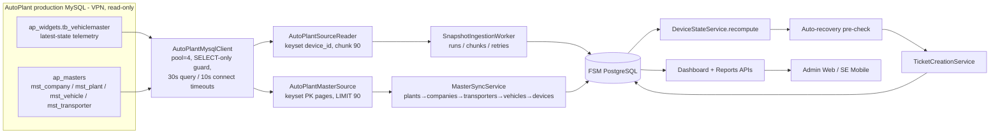
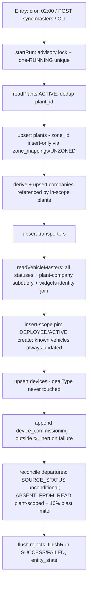
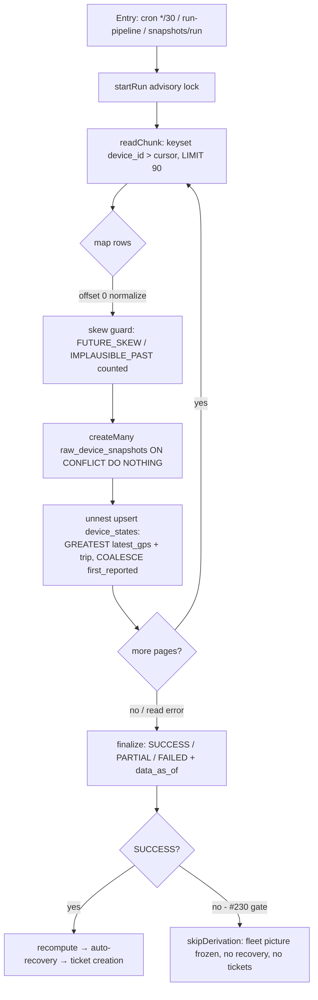
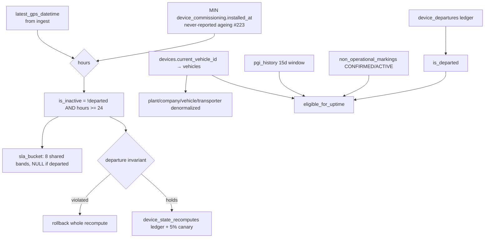
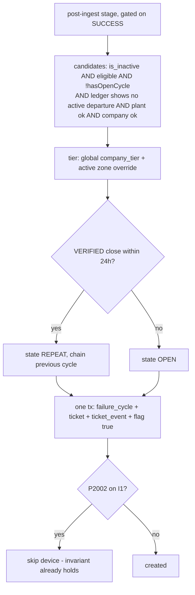
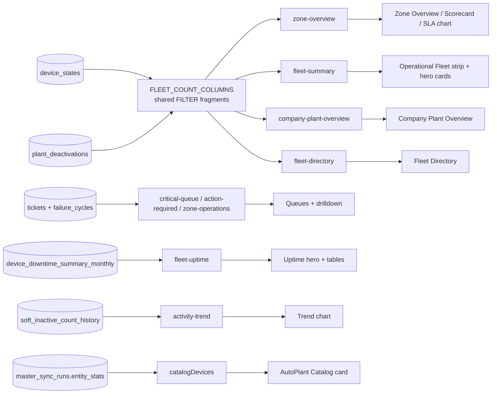

# AutoPlant → FSM Deep Data Lineage & Correctness Audit

**Audit date:** 2026-08-12 · **Branch:** `feat/autoplant-integration` (41 modified + ~10 untracked files — the #229/#230 work is uncommitted working-tree state) · **Method:** static code-first trace (source, Prisma schema, migrations, tests, `.scratch` issue tracker, docs) — no runtime database access. Every claim is tagged **[VERIFIED FROM CODE]**, **[VERIFIED FROM TEST]**, **[VERIFIED FROM DOC]**, **[INFERRED]**, or **UNKNOWN — requires runtime/database verification**.

---

## 1. Executive Summary

**What FSM takes from AutoPlant.** Exactly **two schemas** (`ap_widgets`, `ap_masters`) and **five tables** out of ~70 documented: `tb_vehiclemaster` (telemetry + device identity + commissioning columns), `mst_vehicle`, `mst_plant`, `mst_company`, `mst_transporter`. Every read goes through one `mysql2` pool (4 connections, masters as default schema, every query schema-qualified) behind a code-level SELECT-only guard, 30 s/10 s timeouts, and keyset pagination at ≤ 90 rows/query for the DBA's < 100-row cap. AutoPlant's `mst_zone`/`mst_region` and all trip/violation/alert tables are deliberately untouched.

**How it flows.** Two pipelines: a **daily master sync** (plants → derived companies → transporters → vehicles → devices → append-only commissioning facts → observed/inferred departures), upserting mirrors keyed on source ids with a structurally enforced anti-drift rule protecting FSM-owned columns (tier, zone, dealType); and a **30-minute telemetry scan** — a full keyset walk of `tb_vehiclemaster` by immutable `device_id`, no watermark dependency — journaling pings into partitioned `raw_device_snapshots` (idempotent, 7-day retention design) and maintaining `device_states.latest_gps_datetime` via commutative GREATEST upserts. A post-ingest recompute derives `inactivity_hours` → `is_inactive` (24 h threshold; never-reported devices age from their install date) → 8-band `sla_bucket` → eligibility, then an auto-recovery pre-check (200/pass cap) and ticket creation run — **all gated on the snapshot run finishing SUCCESS** (#230). Ticketing is idempotent by DB invariant (one active failure cycle per device, one ticket per cycle), and its departure gate re-reads the ledger, not the derived flag (the run-65 lesson).

**How it reaches dashboards.** Every fleet number on every dashboard reads `device_states` through **one shared SQL fragment family** (`FLEET_COUNT_COLUMNS` + operational/inactive/healthy/never-reported predicates + a deactivated-plants exclusion), with runtime-enforced partition identities; report heroes read monthly/daily cubes. This document traces every KPI to its exact query (§18–§21) and provides direct MySQL verification queries for each (§23, §25).

**Verdict (§44):** structurally correct; the risk is operational: **(1)** 3,439 phantom failure cycles from partial run 153 remain open and un-remediated — decide before the next dispatch run; **(2)** the manual `run-pipeline` trigger bypasses the scheduler gate (#231) — it is how both recent incidents fired; **(3)** the freshness banner still advances on partial reads; **(4)** the 629-round-trip telemetry read has no retry; **(5)** the departure catch-up (#218c, 5,134-device drift) has never run, and must precede enabling 7-day telemetry retention. Findings F1–F21 in §38; recommendations in §39. The codebase's own issue tracker anticipated most of this audit's findings — the genuinely new items are the dead resume-cursor seam, the zero-window 100%-uptime edge, the critical-queue deactivation gap, the plant-dedup nondeterminism, and several doc/comment contradictions.

## 2. Scope and Methodology

This audit traces the full path **AutoPlant production MySQL → mysql2 client → source readers → ingestion services → transformation/normalization → FSM PostgreSQL → derived device state → ticket creation → dashboard APIs → dashboard KPIs/tables → UI**, at file/class/method/query/column granularity.

Method: complete reads of `apps/backend/src/ingestion/**` (including `autoplant/`), `apps/backend/src/device-state/**`, `apps/backend/src/ticketing/**`, `apps/backend/src/me-tickets/**`, `apps/backend/src/reports/**`, `apps/backend/src/dashboard/**`, `apps/backend/prisma/schema.prisma` + migrations, the admin web frontend pages, mobile KPI modules, the e2e/unit test suite, `docs/autoplant/**`, `docs/SYSTEM-STATE-2026-07.md`, and the `.scratch/fsm-platform-v1` issue tracker. No application logic was modified; the only artifact produced is this document.

Limits: no live connection to AutoPlant MySQL or the FSM PostgreSQL database was used. Row counts quoted are those recorded in code comments, docs, or issue files (each dated where possible). Anything requiring a live database is explicitly tagged UNKNOWN and listed in Appendix (§47).

## 3. Repository Areas Inspected

| Area | Files | Depth |
|---|---|---|
| AutoPlant integration | `apps/backend/src/ingestion/autoplant/` — all 19 files (client, source readers, master sync, mappings, scheduler, controllers, health, preflight, CLIs, zone resolvers) | Full read |
| Ingestion core | `apps/backend/src/ingestion/` — worker, snapshot services, normalize, partition planner/maintenance, stale-run | Full read |
| Data model | `apps/backend/prisma/schema.prisma` (2,591 lines) + migrations (spine `20260620124718`, I1-widening `20260621011500`, partitioning `20260619153000`/`20260706130000`, device-id `20260702130000`, departures `20260717130000`, commissioning `20260809120000`, closure type `20260810120000`, build stamps `20260720130000`) | Full read of schema; targeted migration reads |
| Derived state | `apps/backend/src/device-state/`, `src/device-departure/`, `src/plant-deactivation/` (partial), `src/soft-state/` (skim) | Full read of device-state.service.ts |
| Ticketing | `apps/backend/src/ticketing/` — all 26 files; `src/me-tickets/` — all 8 files | Full read of creation/recovery/install/escalation/submission services |
| Reports & dashboard | `apps/backend/src/dashboard/`, `src/reports/` (all aggregation services), `src/ops-explorer/` (reconciliation + dataset registry), `src/devices/` | Full read |
| Admin frontend | `apps/admin/src` — dashboard variants (OpsHead/Central/Zm/Warehouse), ZoneOverviewTable, ScorecardTable, CompanyPlantTable, ZoneDrilldownSection, ReportsPage, RootCauseAnalyticsPage, SystemEfficiencyPage, ZmScorecardPage, FleetDirectoryPage, DeviceDetailPage, API clients, `lib/slaBucket.ts`, `lib/kpiCatalog.ts` | Full read of listed pages |
| Mobile | `apps/mobile/src/home/homeKpi.ts`, `plantSummary.ts`, `WorkHistoryChart.tsx` | Full read |
| Docs | `docs/SYSTEM-STATE-2026-07.md`, `docs/autoplant/` + `docs/autoplant_databaseData.md`, `docs/kpi-definitions.md`, `docs/architecture/` (engineering reviews, autoplant-production-integration), ADRs referenced in code | Full/targeted reads |
| Issue tracker | `.scratch/fsm-platform-v1/INDEX.md` + issue files #128, #130, #218–#231 | Full reads of incident issues |
| Tests | `apps/backend/test/` (365 files) — listed; ~20 ingestion/ticketing/dashboard specs read for locked behavior | Targeted |

## 4. AutoPlant Production Connection Architecture

### 4.1 Client

`apps/backend/src/ingestion/autoplant/autoplant-mysql.client.ts` — a lazily-created `mysql2/promise` **pool** wrapped in `AutoPlantMysqlClient` **[VERIFIED FROM CODE]**:

- **Two databases, one host**: `ap_widgets` (live telemetry — `tb_vehiclemaster`) and `ap_masters` (master data — `mst_company/mst_plant/mst_vehicle/mst_transporter`). Config interface `AutoPlantMysqlConfig { host, port, user, password, dbWidgets, dbMasters, ssl }` (`autoplant-mysql.client.ts:17-28`).
- **Env vars** (read in `readAutoPlantMysqlConfig`, lines 38-54): `AUTOPLANT_MYSQL_HOST`, `AUTOPLANT_MYSQL_USER`, `AUTOPLANT_MYSQL_PASSWORD`, `AUTOPLANT_MYSQL_DB_WIDGETS` (legacy fallback `AUTOPLANT_MYSQL_DATABASE`), `AUTOPLANT_MYSQL_DB_MASTERS`, `AUTOPLANT_MYSQL_PORT` (default 3306), `AUTOPLANT_MYSQL_SSL` (`'true'` → `ssl: {}`). Any of host/user/password/dbWidgets/dbMasters missing → config is `null` → app boots without AutoPlant and the ingestion worker uses an in-memory reader (dev/test/CI posture).
- **Pool options** (`buildPoolOptions`, lines 80-110): `connectionLimit: 4`, `waitForConnections: true`, `dateStrings: true` (DATETIME columns returned as raw wall-clock strings so **the timezone decision stays with the FSM normalizer, not the MySQL driver**), `connectTimeout` = `AUTOPLANT_CONNECT_TIMEOUT_MS` (default 10 000 ms).
- **Default schema = `ap_masters`** (`database: cfg.dbMasters`, line 102). MySQL validates the default DB at connect time. Every read of `ap_widgets` must be schema-qualified; an unqualified `FROM tb_vehiclemaster` resolves to `ap_masters.tb_vehiclemaster` and fails `ER_NO_SUCH_TABLE` — **this exact failure broke snapshot runs 64–70 on 2026-07-14/15** (comment at lines 93-101, which also corrects an earlier false belief that the account had no grant on `ap_widgets`).
- **Read-only guard** (lines 56, 179-188): `query()` rejects any statement whose first token is not in `['SELECT','SHOW','DESCRIBE','DESC','EXPLAIN']` — *"this seam must never mutate the production source, regardless of what the account is granted."*
- **Per-statement timeout** (`withQueryTimeout`, lines 117-131): `Promise.race` against `AUTOPLANT_QUERY_TIMEOUT_MS` (default 30 000 ms) so a packet-blackholing VPN surfaces as a bounded rejection instead of pinning a run `RUNNING` (Issue 97 / review A4).
- **Lifecycle**: pool created lazily on first query; `onModuleDestroy` ends it. `isConfigured()` distinguishes "not configured" (dev) from "configured but unreachable" (VPN down) for the health surface.
- **Ping** (lines 197-204): `SELECT COUNT(*) AS n FROM \`<dbMasters>\`.mst_vehicle` — masters-scoped connectivity probe; `autoplant-ping.ts` probes widgets separately.

### 4.2 Production-safety posture

- Reads are **read-only by code-level guard** (defense in depth over the read-only account grant) **[VERIFIED FROM CODE]**.
- The DBA cap of **< 100 rows per query** is honored by keyset pagination at `pageSize` ≤ 99 (default 90) in the master source and by `LIMIT chunkSize` in the telemetry reader (§9) **[VERIFIED FROM CODE]**.
- Small pool (4 connections), bounded connect + statement timeouts, lazy creation. No unbounded `SELECT *` exists on the AutoPlant seam **[VERIFIED FROM CODE]**.

## 5. Complete AutoPlant Database/Schema Inventory

| Schema | Purpose | How selected | Access mode |
|---|---|---|---|
| `ap_masters` | Master data: `mst_company`, `mst_plant`, `mst_vehicle`, `mst_transporter` | Connection **default** schema; all reads still explicitly schema-qualified (`` `ap_masters`.`mst_*` ``) as defense in depth | Read-only, keyset-paged ≤ 90 rows/query |
| `ap_widgets` | Live telemetry latest-state: `tb_vehiclemaster` | **Never** the default; always backtick-qualified (`` `ap_widgets`.tb_vehiclemaster ``) — the run-64–70 lesson | Read-only, keyset-paged `LIMIT chunkSize` |

Both names come from env (`AUTOPLANT_MYSQL_DB_MASTERS` / `AUTOPLANT_MYSQL_DB_WIDGETS`) and are never hard-coded **[VERIFIED FROM CODE]**. No other AutoPlant schema is referenced anywhere in `apps/backend/src` (grep for schema-qualification call sites) — _cross-check pending in §6_.

## 6. Complete AutoPlant Table Inventory

**Exactly five source tables are queried by production code** (all through `AutoPlantMysqlClient.query()`, so all read-only-guarded and timeout-bounded) **[VERIFIED FROM CODE]**:

| # | Schema.table | Role | Reader | Cadence | Pagination | Filter |
|---|---|---|---|---|---|---|
| 1 | `ap_widgets.tb_vehiclemaster` | Live telemetry latest-state (one row per device) + device identity + commissioning columns | `AutoPlantSourceReader.readChunk` (telemetry); joined by `AutoPlantMasterSource.readVehicleMasters` (identity enrichment); `autoplant-ping.ts` (3-row sample) | 30 min (telemetry, when scheduler on) + daily (as join target) | Keyset `device_id > ?` / rides the vehicle pager | `latest_gps_datetime IS NOT NULL AND device_id` non-blank |
| 2 | `ap_masters.mst_vehicle` | Vehicle master + fitment (`device_id`, `plant_id`, `transporter_id`, `deployment_status`) | `AutoPlantMasterSource.readVehicleMasters` + `countVehicleMasters`; `ping()` counts it | Daily 02:00 (default) / manual | Keyset `vehicle_no > ?`, LIMIT 90 | none (all statuses since Issue 128 — departures must be *observed*) |
| 3 | `ap_masters.mst_plant` | Plant master + org columns (`zone_name`, `region`, `plant_state`, `master_plant_*`) | `readPlants` + `countPlants` + the company-resolution subquery in the vehicle read | Daily / manual | Keyset `plant_id > ?`, LIMIT 90 | `status IN ('ACTIVE')` |
| 4 | `ap_masters.mst_company` | Company master | `readCompanies` | Daily / manual | Keyset `company_id > ?`, LIMIT 90 | none |
| 5 | `ap_masters.mst_transporter` | Transporter master | `readTransporters` | Daily / manual | Keyset `transporter_id > ?`, LIMIT 90 | none |

**Documented but NOT queried** (source: `docs/autoplant_databaseData.md` — raw `SHOW TABLES` capture) **[VERIFIED FROM DOC + code grep]**:

- `ap_widgets`: **54 tables documented, 1 queried.** Never touched: `tb_tripmaster`, `tb_triplegwise`, `tb_trip_detention`, `tb_alert`, `tb_deviation`, `tb_daily_summary`, `tb_vehicle_distance`, `tb_csr_history`, `tb_etamaster`, `tb_legmaster`, `tb_farthestidlingpoint`, `tb_tollmismatch`, `tb_staging_trip_event`, `tb_vehiclemaster_logs`, `tb_vehiclemaster_og`, `tb_violationconfigmaster`, `tripreportdata`, `violationdata`, `violationreportdata`, `violationtypemaster`, plus `_aud`/`_bkp`/`_archival` variants and infra tables (`hibernate_sequence`, `revinfo`, `qrtz_*`-adjacent, etc.). The only trip signal FSM consumes is the denormalized `TRIP_CREATION_DATETIME` column on `tb_vehiclemaster`.
- `ap_masters`: **16 tables documented, 4 queried.** Notably NOT queried: **`mst_zone` and `mst_region`** — FSM deliberately does not read AutoPlant's zone/region masters; it mirrors `mst_plant.zone_id/zone_name/region_id/region_name` as `source_*` columns and derives its own operational zones through the `zone_mappings` crosswalk (§10.7). Also unqueried: `mst_driverphone`, `mst_secondaryclient*`, `mst_telenitytoken`, `mst_transporter_log`, `mst_vehicle_log(+_archival)`.
- `mst_vehicle`'s own lowercase commissioning columns (`first_installed_dt` etc.) are documented but deliberately not read — widgets' `FIRST_INSTALLED_*` is the anchor (99.99% populated vs 51,137/51,142) **[VERIFIED FROM CODE comment; measurement INFERRED]**.

The Ops Explorer's `dataset-registry.ts` tags many columns `system: 'AUTOPLANT_MYSQL'`, but that is **lineage metadata only** — all Explorer queries run against FSM Postgres **[VERIFIED FROM CODE]**.

## 7. AutoPlant Table → FSM Dependency Matrix

| AutoPlant table | FSM destination(s) | Write op | Key | Downstream consumers |
|---|---|---|---|---|
| `ap_widgets.tb_vehiclemaster` (telemetry columns) | `raw_device_snapshots` (journal) → `device_states.latest_gps_datetime / trip_creation_datetime / first_reported_at(+offset)` | `createMany skipDuplicates` + set-based upsert (§11.5) | `(device_id, gps_datetime)` unique; `device_states.device_id` PK | Recompute → inactivity/SLA → ticket creation → every fleet KPI; verification & auto-recovery evidence reads |
| `ap_widgets.tb_vehiclemaster` (identity/commissioning columns, via master path) | `devices.device_type / imsi_no`; `device_commissioning` (append-only) | upsert / `createMany skipDuplicates` | `devices.device_id`; `(device_id, vehicle_id, installed_at)` NULLS NOT DISTINCT | Device list columns; never-reported ageing (#223); commissioning reports |
| `ap_masters.mst_vehicle` | `vehicles` (mirror incl. `status` = `deployment_status` verbatim); `devices.current_vehicle_id`; `device_departures` (via reconcile) | upsert on `vehicle_no` / `device_id`; departure ledger createMany | `vehicle_no` unique | `all-deployed` eligibility mode; departure gates; fitment denormalization on `device_states` |
| `ap_masters.mst_plant` | `plants` (mirror + `source_*` org columns; FSM `zone_id` insert-only) | upsert on `sourcePlantId` | `sourcePlantId` unique | Every zone/plant grouping on every dashboard; company resolution for vehicles |
| `ap_masters.mst_company` | `company_master` (mirror; `company_tier`/`ops_override` FSM-owned) | upsert on `sourceCompanyId`, only when an in-scope plant references it | `sourceCompanyId` unique | Ticket tier snapshot; company groupings |
| `ap_masters.mst_transporter` | `transporters` | upsert on `sourceTransporterId` | `sourceTransporterId` unique | `device_states.transporter_id` denormalization; directory |

## 8. Column-Level Data Lineage

Every AutoPlant column read by FSM, end to end. Format: `source column → reader → transform → FSM column → derived → dashboard`. All **[VERIFIED FROM CODE]** unless noted.

### 8.1 Telemetry path (`ap_widgets.tb_vehiclemaster`, 30-min scan)

```text
device_id  →  AutoPlantSourceReader.readChunk (SQL filters NULL/blank)  →  preserved verbatim (string)
  → raw_device_snapshots.device_id  → device_states.device_id (via JOIN devices — unmastered ids journalled but state deferred, counted unknownDevices)
  → every per-device KPI

latest_gps_datetime (naive DATETIME, **UTC** — #222)  →  dateStrings:true (no driver conversion)
  → normalizeGpsTimestamp(wallClock, AUTOPLANT_UTC_OFFSET_MIN = 0)  [was 330; wrong from day one — §30]
  → skew guard: reject FUTURE_SKEW (> now+60min) / IMPLAUSIBLE_PAST (< 2000-01-01), counted per chunk
  → raw_device_snapshots.gps_datetime
  → device_states.latest_gps_datetime  (GREATEST — replay/out-of-order safe)
  → recompute: inactivity_hours = (now − latest_gps)/3600  → is_inactive (≥ 24h) → sla_bucket (8 bands)
  → dashboard: INACTIVE_OPERATIONAL / HEALTHY_OPERATIONAL / NEVER_REPORTED / byBucket / Last Activity
  → ticket creation candidate filter; auto-recovery evidence; fleet-uptime windows

  parallel write-once branch: chunk-min of gpsDatetimeUtc (pinned TRUE_SOURCE_UTC_OFFSET_MIN = 0)
  → device_states.first_reported_at (+ first_reported_offset_min)  [COALESCE, never LEAST — §11.5]
  → commissioning "commissioned = first_reported_at >= installed_at" reports

latitude, longitude, speed  →  mapped onto the snapshot DTO  →  raw_device_snapshots.latitude/longitude/speed
  → read by verification / snapshot-query surfaces (no dashboard KPI aggregates them)

IGNITION_STATUS  →  snapshot DTO  →  raw_device_snapshots.ignition_status  (journal only)

DEVICE_TYPE  →  snapshot DTO → raw_device_snapshots.device_type (journal); authoritative mirror rides the
  master path onto devices.device_type

TRIP_CREATION_DATETIME (TIMESTAMP, server-converted, session UTC; offset constant 0)
  →  parseTripCreation (non-throwing; malformed → null, ping kept)
  →  device_states.trip_creation_datetime (GREATEST; NOT stored in raw_device_snapshots)
  →  device list "Trip Creation Date Time" column

gpssignal (JSON)  →  parseGpssignal: ONLY power.mainstatus (→ mains_status; "ON"/"OFF"/int coerced) and
  power.mainvoltage (→ mains_voltage; finite or null); malformed JSON → nulls, row kept
  →  raw_device_snapshots.mains_status / mains_voltage  (journal; no KPI consumer today)
```

Fields on the snapshot DTO with no home in `tb_vehiclemaster` are hard-nulled: `gpsValidity, gpsMode, creg, cgreg, csq, ipAddress, portNo, simSubscriberName, unitNo` (`mapping.ts:226-235`).

### 8.2 Master path (`ap_masters`, daily)

```text
mst_company.company_id      → BigInt → company_master.source_company_id (upsert key; only companies referenced
                              by an in-scope plant — mst_company.company_type is never consulted)
mst_company.company_name    → cleanStr → company_master.name
mst_company.company_type    → cleanStr → company_master.company_type (mirror only)
mst_company.status          → cleanStr → company_master.status
   [company_tier / company_priority_rank: FSM-owned; insert defaults SILVER / 'C'; never in the update set]
   → ticket tier snapshot → Platinum escalation eligibility; tier grouping on Company/Plant Overview

mst_plant.plant_id          → BigInt → plants.source_plant_id (upsert key; composite-PK dedup first)
mst_plant.company_id        → plants.company_id  AND  (via MIN() subquery) the vehicle's company
mst_plant.plant_name        → plants.name
mst_plant.zone_id/zone_name/region_id/region_name → plants.source_zone_* / source_region_* (mirror only)
mst_plant.zone_name         → normalizeZoneKey → zone_mappings lookup → plants.zone_id (FSM zone; INSERT-ONLY;
                              unmatched → UNZONED + PENDING discovery row)  → every zone grouping
mst_plant.plant_state       → plants.plant_state (also feeds the R6 state→zone proposal; junk: 'india', 'NA', blank)
mst_plant.plant_district    → case-insensitive districts.name match → plants.district_id (else null)
mst_plant.master_plant_id/master_plant_code → plants.master_plant_* (distinct parent reference, ≠ plant's own id)
mst_plant.status            → plants.status (read scope is ACTIVE-only, so mirror ≈ 'ACTIVE')

mst_vehicle.vehicle_no      → trim → vehicles.vehicle_no (upsert key)
mst_vehicle.device_id       → cleanStr → devices.device_id (PK, string) + devices.current_vehicle_id;
                              null/blank → NO_FITTED_DEVICE skip
mst_vehicle.plant_id        → vehicles.plant_id → device_states.plant_id (denormalized at recompute)
p.company_id (plant subquery, NOT mst_vehicle.company_id — 0/unreliable in production)
                            → vehicles.company_id → device_states.company_id
mst_vehicle.transporter_id  → toBigIntOrNull (0 → null) → vehicles.transporter_id → device_states.transporter_id
mst_vehicle.deployment_status → cleanStr → vehicles.status (verbatim mirror)
                            → isOperationalStatus allowlist ['DEPLOYED','ACTIVE'] → insert-scope pin,
                              SOURCE_STATUS departures, all-deployed eligibility, countVehicleMasters

mst_transporter.transporter_id / company_id / transporter_name / status → transporters.* (mirror)

w.DEVICE_TYPE (widgets)     → cleanStr → devices.device_type ('' on ~11.9k rows → null)
w.IMSI_NO (widgets)         → cleanStr → devices.imsi_no (NULL on ~9.9k rows)
w.FIRST_INSTALLED_DATE_TIME → TRUE-UTC normalize → device_commissioning.installed_at (append-only fact;
                              source REWRITES this in place — the reason the table exists)
w.FIRST_INSTALLED_BY        → device_commissioning.installed_by (login string; ~13% 'NA')
w.INSTALLATION_REMARK       → device_commissioning.installation_remark
   → MIN(installed_at) ages never-reported devices into is_inactive (#223) → tickets → dashboards
```

## 9. Exact AutoPlant SQL Queries

### 9.1 Telemetry scan — `AutoPlantSourceReader.readChunk()` (`autoplant-source-reader.ts:87-134`) **[VERIFIED FROM CODE]**

Effective SQL (dynamic parts: `${from}` = `` `ap_widgets`.tb_vehiclemaster ``; the `AND device_id > ?` predicate appears only when continuing from a cursor; `LIMIT` is the worker's chunk size):

```sql
SELECT device_id, latest_gps_datetime, latitude, longitude, speed, IGNITION_STATUS, DEVICE_TYPE,
       TRIP_CREATION_DATETIME, gpssignal
FROM `ap_widgets`.tb_vehiclemaster
WHERE latest_gps_datetime IS NOT NULL
  AND device_id IS NOT NULL AND TRIM(device_id) <> ''
  [AND device_id > ?]           -- keyset continuation, param = last scanned device_id
ORDER BY device_id
LIMIT <chunkSize>
```

Design properties (file docstring, lines 5-37):

- `tb_vehiclemaster` is a **latest-state table** (exactly one row per immutable `device_id`) that the fleet mutates forward. One deterministic scan engine — **no cold/incremental split, no `latest_gps_datetime` predicate, no cross-run resume cursor**.
- **Termination**: `device_id` is immutable and finite → keyset walks a strictly increasing key space once, ⌈N/chunk⌉ queries.
- **No lost / re-harvested updates**: scan membership and order ride the immutable key, never the mutating telemetry timestamp — a device that re-pings mid-scan can neither sort ahead of the cursor to be re-read nor fall below a watermark to be skipped. Every device visited exactly once per run; `ON CONFLICT DO NOTHING` on `(device_id, gps_datetime)` makes unchanged re-reads free.
- `snapshot_runs.data_as_of` (max ingested `gps_datetime`) is a freshness banner only — it never gates the scan.
- Requires the production index `idx_device_id` on `tb_vehiclemaster.device_id`; `device_id` verified effectively unique on production, so the plain `> ?` keyset never skips a row at a page boundary.
- Rows failing the skew guard (§11) are **counted per chunk** (`SourceChunk.rejected` + WARN log) — `FUTURE_SKEW` is the signature of a device writing a non-UTC wall clock (#222 P6).
- The cursor advances from the **last DB row scanned**, not the mapped/filtered set, so dropped rows never cause a re-read loop. A short page ⇒ source exhausted.
- `TRIP_CREATION_DATETIME` deliberately rides this 30-min scan (not the daily master sync — which would leave ~18.4% of the DEPLOYED fleet stale per day) and lands on `device_states`, not `raw_device_snapshots` (lines 39-44).

### 9.2 Master reads — `AutoPlantMasterSource` (`autoplant-master-source.ts`) **[VERIFIED FROM CODE]**

All reads go through one keyset pager (`pageAll`, lines 123-153): `SELECT <cols> FROM <qualified table> [WHERE <filters> AND key > ?] ORDER BY <key> LIMIT <pageSize>` with `pageSize = clamp(1..99, default 90)` — the DBA "< 100 rows/query" cap. Effective SQL per entity:

**Companies** (`readCompanies`, lines 191-199 — no filter, keyed on numeric `company_id`):

```sql
SELECT company_id, company_name, company_type, status
FROM `ap_masters`.`mst_company`
[WHERE company_id > ?]
ORDER BY company_id LIMIT 90
```

**Transporters** (`readTransporters`, lines 201-209 — keyed on string `transporter_id`):

```sql
SELECT transporter_id, company_id, transporter_name, status
FROM `ap_masters`.`mst_transporter`
[WHERE transporter_id > ?]
ORDER BY transporter_id LIMIT 90
```

**Plants** (`readPlants`, lines 211-225 — default SQL filter `status IN ('ACTIVE')`):

```sql
SELECT plant_id, company_id, plant_name, zone_id, zone_name, region_id, region_name,
       plant_state, plant_district, master_plant_id, master_plant_code, status
FROM `ap_masters`.`mst_plant`
WHERE status IN ('ACTIVE') [AND plant_id > ?]
ORDER BY plant_id LIMIT 90
```

then **in-memory dedup to one row per `plant_id`** — `mst_plant`'s PK is **composite `(plant_id, plant_code)`**, so a `plant_id` repeats once per plant_code; FSM keys plants on `plant_id` alone (`dedupBy`, lines 69-79, 221-224).

**Vehicle masters** (`readVehicleMasters`, lines 227-283 — the central three-way read; default reads **every** `deployment_status` per Issue 128 so departures are *observed*, not inferred):

```sql
SELECT v.vehicle_no AS vehicle_no, v.device_id AS device_id, v.plant_id AS plant_id,
       p.company_id AS company_id, v.transporter_id AS transporter_id,
       v.deployment_status AS deployment_status,
       w.DEVICE_TYPE AS device_type, w.IMSI_NO AS imsi_no,
       w.FIRST_INSTALLED_DATE_TIME AS first_installed_date_time,
       w.FIRST_INSTALLED_BY AS first_installed_by,
       w.INSTALLATION_REMARK AS installation_remark
FROM `ap_masters`.`mst_vehicle` v
LEFT JOIN (SELECT plant_id, MIN(company_id) AS company_id
           FROM `ap_masters`.`mst_plant` GROUP BY plant_id) p
       ON p.plant_id = v.plant_id
LEFT JOIN `ap_widgets`.`tb_vehiclemaster` w ON w.vehicle_no = v.vehicle_no
[WHERE v.vehicle_no > ?]
ORDER BY v.vehicle_no LIMIT 90
```

Why each part exists (file comments, lines 227-261):

- `p.company_id` subquery: **`mst_vehicle.company_id` is unreliable (0 in production)** — a vehicle's authoritative company is its plant's company. The GROUP-BY-plant_id subquery (not a raw join) prevents the composite plant PK fanning each vehicle out per plant_code (~2× inflation, nondeterministic company).
- `w.*` join: **device identity (`DEVICE_TYPE`, `IMSI_NO`) does not exist in `ap_masters` at all** — it lives on `ap_widgets.tb_vehiclemaster`. A previous version hardcoded `NULL AS device_type`, which left `devices.device_type` NULL fleet-wide (0 of 20,935 populated on 2026-07-17). Join is safe: `tb_vehiclemaster.vehicle_no` is PK, verified unique (60,601/60,601 distinct); join coverage verified 100% for the 15,674 DEPLOYED vehicles (2026-07-17).
- The three commissioning columns are read from **widgets** (99.99% populated) rather than `mst_vehicle`'s lowercase equivalents (51,137/51,142) — and feed the **append-only** `device_commissioning` fact, because `tb_vehiclemaster` *rewrites them in place*, destroying the previous fitment record at source.
- When `widgetsSchema` is set, a widgets outage **fails the run** rather than degrading: `mapDevice` mirrors these columns, so a run silently substituting NULLs would wipe `device_type`/`imsi_no` fleet-wide; a failed run writes nothing and is visible in the ledger.

**Reconciliation counts** (`countPlants` / `countVehicleMasters`, lines 156-189 — single-row aggregates, one physical query each):

```sql
SELECT COUNT(DISTINCT plant_id) AS c FROM `ap_masters`.`mst_plant` WHERE status IN ('ACTIVE');
SELECT COUNT(*) AS c FROM `ap_masters`.`mst_vehicle` WHERE deployment_status IN (<OPERATIONAL_DEPLOYMENT_STATUSES>);
```

`countVehicleMasters` deliberately counts the **create scope** (operational statuses, ~21k) and not the read scope (~48.5k all-status since Issue 128), else health would report ~27k of permanent phantom drift.

**Ping**: `SELECT COUNT(*) AS n FROM \`ap_masters\`.mst_vehicle` (`autoplant-mysql.client.ts:202`).

**CLI/health-only queries** **[VERIFIED FROM CODE]**: `autoplant-ping.ts` — `SELECT COUNT(*) AS n FROM \`<masters>\`.mst_plant` and a 3-row widgets sample: `SELECT vehicle_no, device_id, DEVICE_TYPE, IMSI_NO, TRIP_CREATION_DATETIME, latest_gps_datetime FROM \`<widgets>\`.tb_vehiclemaster WHERE gpssignal IS NOT NULL LIMIT 3` (a widgets failure is a hard failure since 2026-07-17 — both pipelines depend on it). `health.service.ts` reconciliation reuses `countPlants`/`countVehicleMasters` verbatim so the health count can never diverge definitionally from what a sync would upsert. `autoplant-departure-dryrun.ts` reuses `readPlants`/`readVehicleMasters` with no widgets schema (no enrichment join).

## 10. Master Sync — Complete Trace

### 10.1 Entry points **[VERIFIED FROM CODE]**

1. **HTTP**: `POST /api/integration/sync-masters` and `POST /api/integration/run-pipeline` (`integration-sync.controller.ts:37-50`), role `OPERATIONS_HEAD`; `assertConfigured()` → 503 when AutoPlant env unset. `run-pipeline` takes `?chunkSize=` clamped 1–99. **Neither is gated by `INGESTION_SCHEDULER_ENABLED`** (#231).
2. **Cron**: `IntegrationSchedulerService.mastersTick` — `@Cron(mastersCron, { name: 'ingestion-masters' })`, default `'0 2 * * *'`; master switch `INGESTION_SCHEDULER_ENABLED === 'true'` re-checked per tick (currently `"false"` in the dev env — the HTTP endpoints are how the pipeline runs today). Cron strings resolve **once at decorator evaluation**; env changes need a restart.
3. **CLI**: `npm run autoplant:sync` / `autoplant:sync pipeline` (`autoplant-sync.ts`). The CLI constructs `MasterSyncService` without `PlantEligibleFloatingSeService`, so the MV-refresh step logs SKIPPED by design.

### 10.2 Stage order **[VERIFIED FROM CODE — `master-sync.service.ts:159-399`]**

**plants → companies → transporters → vehicles → devices → commissioning facts → departures → rejects flush + finishRun → floating-SE MV refresh.** FK order is plants-first because scope is anchored on `mst_plant.status='ACTIVE'`: companies are **derived** — upserted only when an in-scope plant's `company_id` names them.

### 10.3 Upsert semantics and the anti-drift invariant **[VERIFIED FROM CODE + TEST]**

| Entity | Prisma call | Unique key | Update set excludes (FSM-owned, never clobbered) |
|---|---|---|---|
| plants | `plant.upsert` | `sourcePlantId` | `zoneId`, `districtId` (insert-only) |
| companies | `company.upsert` | `sourceCompanyId` | `companyTier`, `companyPriorityRank` (insert defaults SILVER/'C') |
| transporters | `transporter.upsert` | `sourceTransporterId` | — |
| vehicles | `vehicle.upsert` | `vehicleNo` | — (status mirrored verbatim) |
| devices | `device.upsert` | `deviceId` | `dealType` (absent from create AND update) |
| commissioning | `deviceCommissioning.createMany({skipDuplicates})` | `(device_id, vehicle_id, installed_at)` NULLS NOT DISTINCT | append-only, no update path |

The anti-drift invariant is structural (`master-mapping.ts:12-16`): every `update` object is built without the FSM-owned columns, so a re-sync can never clobber operator decisions. Asserted by `test/autoplant-master-mapping.spec.ts` and `test/master-sync-service.e2e-spec.ts`.

**Transactions**: upserts commit in `$transaction` batches of `UPSERT_BATCH_SIZE = 500` — the sync is **not** one atomic transaction; a mid-run failure leaves earlier batches committed (safe: idempotent upserts, next run converges). `COMMISSIONING_BATCH_SIZE = 1000` sized against Postgres's 65,535 bind-parameter cap. Inserted-vs-updated classification is done in memory against a preloaded full key set per entity.

### 10.4 Mapping/key transforms **[VERIFIED FROM CODE — `master-mapping.ts`]**

`NULLISH = {'', 'NA', 'NULL', 'null'}`; `cleanStr` trims and nulls sentinels. `toBigIntOrNull` additionally folds **`0` → null** (production writes 0 for "no id"). Keys: `sourceCompanyId = BigInt(trim(company_id))`, `sourcePlantId = BigInt(trim(plant_id))`, vehicles on trimmed `vehicle_no`, devices on `cleanStr(device_id)`.

### 10.5 Scope, validation, rejected rows **[VERIFIED FROM CODE + TEST]**

- Read scope: plants `status IN ('ACTIVE')`; vehicles all statuses (Issue 128 — departures must be observed).
- Insert-scope pin: `OPERATIONAL_DEPLOYMENT_STATUSES = ['DEPLOYED','ACTIVE']`, case/whitespace-insensitive allowlist, null/blank/unknown ⇒ false. Measured source vocabulary: UNDEPLOYED 32,892 · DEPLOYED 15,652 · MAINTENANCE 157 · ACTIVE 40 · 'DEPLOYED/UNDEPLOYED' 4 **[INFERRED — comment-recorded measurement]**.
- Skip reasons → `master_sync_rejects` (cap 5,000/run, best-effort — "accounting must never fail the sync"): `OUT_OF_SCOPE_STATUS`, `ZONE_UNRESOLVED` (plants); `NO_INSCOPE_PLANT` (companies); `PLANT_NOT_SYNCED`, `COMPANY_NOT_SYNCED`, `NOT_DEPLOYED_NEVER_KNOWN` (vehicles); `NO_FITTED_DEVICE`, `VEHICLE_NOT_SYNCED`, `NOT_DEPLOYED_NEVER_KNOWN` (devices). Per-reason counters land in `master_sync_runs.entity_stats`.
- An already-known vehicle is upserted **regardless of status** — that status mirror update is what the departure pass keys on.
- `stats.devices.observed` = distinct fitted device_ids across the widened read — this is the dashboard's "AutoPlant Catalog" number.

### 10.6 Reconciliation/departures when a row disappears **[VERIFIED FROM CODE + TEST]**

`reconcileDepartures` → `DeviceDepartureService.reconcile`, from the **same all-status read** the mirror was built from. Two paths, unequal trust:

- **`SOURCE_STATUS`** (observed non-operational status): depart unconditionally.
- **`ABSENT_FROM_READ`** (device_id absent entirely): inferred, double-guarded — (a) only for devices whose plant is in `syncedPlantIds`; (b) **blast limiter** `DEFAULT_MAX_ABSENCE_RATIO = 0.1`: if > 10% of the in-scope fleet would be marked absent, the entire absence pass is abandoned (`ABSENCE_GUARD_TRIPPED`) while SOURCE_STATUS departures still apply.

A departure, in one `$transaction`: `device_departures` row created; all non-terminal tickets for the device → `CLOSED` with `closureType: 'DEVICE_UNDEPLOYED_CLOSE'`; `ticket_events` rows; parent failure cycles → **FAILED** (not VERIFIED — so a re-created ticket isn't mis-flagged REPEAT); `hasOpenFailureCycle` cleared; per-device `audit_logs` rows. Restores stamp `restoredAt/restoredByRunId/restoredStatus`; **nothing is ever deleted**. Idempotent via partial unique `device_departures_one_active_per_device (device_id) WHERE restored_at IS NULL`. Known gap: departure force-closes tickets but does **not** detach batch rows (auto-recovery does) — hence the stand-down CSV export (1,461 live-batch rows measured).

**No plants/companies/vehicles row is deactivated on disappearance** — the mirror simply stops being refreshed; health's `missingFromSource` counts the frozen mirrors.

Historic: this whole pass ran **dead for 27 consecutive syncs** (#218 — `import type` + union type erased the DI param to `Object`; `@Optional()` silently resolved `undefined`). Fixed with value imports + explicit `@Inject` tokens; guarded by `test/master-sync-di-wiring.e2e-spec.ts`, which boots the real `AppModule`.

### 10.7 Zone resolution **[VERIFIED FROM CODE]**

Production resolver is `MappingTableZoneResolver` (not the hardcoded state map). Precedence: (1) `plant_zone_overrides` by `sourcePlantId`; (2) `zone_mappings` value map on `normalizeZoneKey(mst_plant.zone_name)` where status `MAPPED`; (3) **UNZONED holding zone** + upsert a PENDING discovery row (`seenCount++`; never touches an admin's MAPPED/IGNORED decision). `normalizeZoneKey`: trim/lowercase, `''`/`na`/`null` → `__blank__`, strip `\b(india|zone)\b`. Because `plants.zone_id` is insert-only, zone edits take effect via `ZoneMappingService.reapply`, not re-sync. Measured history: 83% UNZONED at first sync → 23% after 47 overrides **[VERIFIED FROM DOC]**.

### 10.8 Ledger **[VERIFIED FROM CODE + TEST]**

`master_sync_runs` row per run (`RUNNING → SUCCESS/FAILED`, `entity_stats` JSON, error, build stamp). Single-in-flight = `pg_try_advisory_xact_lock(hashtext('master_sync_run'))` + partial unique `WHERE status='RUNNING'`; either fires as 409 `RUN_IN_PROGRESS`. Stale-run reaper flips RUNNING rows older than `INGESTION_STALE_RUN_MIN` (default 30) to FAILED (`'orphaned (process restart)'`) before each start. Failure handling: any read/upsert throw → `flushRejects()` (partial accounting kept) → `finishRun FAILED` → rethrow. A widgets outage **fails the whole masters run by design** (silent NULL substitution would wipe `device_type`/`imsi_no` fleet-wide). Commissioning append and departure reconcile failures are logged and swallowed — the committed mirror stands.

## 11. Snapshot Ingestion — Complete Trace

### 11.1 Run creation & serialization **[VERIFIED FROM CODE + TEST]**

`SnapshotRunService.startRun()`: reap stale RUNNING (>30 min) → `pg_try_advisory_xact_lock(hashtext('snapshot_run'))` in a `$transaction` → create `snapshot_runs` RUNNING with build stamp; P2002 on the partial-unique backstop → 409.

### 11.2 The scan

`SnapshotIngestionWorker.run()` drives `AutoPlantSourceReader.readChunk` (§9.1) from `cursor = null` — **every run is a full keyset scan; there is no cross-run resume**. Chunk size 90 in production (clamped ≤ 99 everywhere: `snapshots.controller.ts:53`, `integration-sync.controller.ts:48`, `autoplant-sync.ts:28`).

**Finding — dead resume seam**: `snapshot_runs.cursor` is persisted every run and `SnapshotRunService.lastResumeCursor()` exists ("the AutoPlantSourceReader resumes from this across runs"), but **no production code calls it** — its only consumers are a test-local reader in `snapshot-partial-cursor.e2e-spec.ts`. The stateless-scan design supersedes it; the doc-comment is stale **[VERIFIED FROM CODE — grep]**.

### 11.3 Chunk ledger, retry, finalization **[VERIFIED FROM CODE + TEST]**

Per non-empty chunk: `snapshot_run_chunks` row PENDING → `processChunk` with `maxAttempts = 3`, exponential backoff (base 200 ms) → SUCCESS + retryCount, or FAILED + error (siblings continue). A **source-read throw mid-scan** is caught (`readError` — the fix for a run that previously hung RUNNING forever) and the run still finalizes: read error ⇒ PARTIAL if any chunk landed else FAILED; otherwise all/none/mixed ⇒ SUCCESS/FAILED/PARTIAL. **Reads have no retry** (writes get 3) — the run-153 abort exploited exactly this (§30.3).

### 11.4 Normalization **[VERIFIED FROM CODE + TEST]**

- **Timezone (#222)**: `AUTOPLANT_UTC_OFFSET_MIN = 0` — *"This constant was `330` and it was wrong from the day it was written"*: the source column is UTC, so FSM stored every ping 5.5 h early for the platform's first month. Conversion (`normalize.ts:44-53`): parse the naive wall-clock, `Date.UTC(...) − offset×60000`; unparseable → **throw** (a bad `gps_datetime` is not recoverable → run PARTIAL/FAILED, not a row skip). Three separate zero constants: the env-overridable row offset, `TRIP_CREATION_UTC_OFFSET_MIN = 0` (TIMESTAMP, server-converted), and pinned `TRUE_SOURCE_UTC_OFFSET_MIN = 0` for write-once `first_reported_at` (a mis-set env can never freeze a wrong value into the irreversible column).
- **Skew guard (two-directional since #222)**: future `> now + 60 min` → `FUTURE_SKEW` (the IST-writer signature — tightened from 24 h so the ~5 IST-writing devices are rejected-and-counted rather than reading permanently fresh); past `< 2000-01-01` → `IMPLAUSIBLE_PAST` (sentinel floor only — deliberately not a staleness guard: *"a device silent for a year is the finding this platform exists to produce"*). Rejections counted per chunk + WARN.
- **gpssignal**: only `power.mainstatus` and `power.mainvoltage` extracted; malformed JSON → nulls, row kept (§8.1).

### 11.5 Write path **[VERIFIED FROM CODE + TEST]**

`SnapshotIngestionService.ingestChunk`: (1) journal `rawDeviceSnapshot.createMany({skipDuplicates: true})` (= `ON CONFLICT DO NOTHING` on `(device_id, gps_datetime)`); (2) the R4-A incremental `device_states` maintenance — one set-based statement:

```sql
INSERT INTO device_states (device_id, latest_gps_datetime, trip_creation_datetime,
                           first_reported_at, first_reported_offset_min, computed_at)
SELECT u.device_id, u.latest_gps, u.trip_created, u.first_reported, u.first_offset, ${now}
  FROM unnest(${deviceIds}::text[], ${timestamps}::timestamptz[], ${tripCreations}::timestamptz[],
              ${firstReports}::timestamptz[], ${offsets}::smallint[]) AS u(...)
  JOIN devices d ON d.device_id = u.device_id
ON CONFLICT (device_id) DO UPDATE
  SET latest_gps_datetime   = GREATEST(device_states.latest_gps_datetime, EXCLUDED.latest_gps_datetime),
      trip_creation_datetime = GREATEST(device_states.trip_creation_datetime, EXCLUDED.trip_creation_datetime),
      first_reported_at      = COALESCE(device_states.first_reported_at, EXCLUDED.first_reported_at),
      first_reported_offset_min = COALESCE(device_states.first_reported_offset_min, EXCLUDED.first_reported_offset_min),
      computed_at            = EXCLUDED.computed_at
```

Properties: per-device chunk-max dedup before binding; `GREATEST` makes replay/out-of-order commutative (and ignores NULLs, preserving a stored trip stamp); `first_reported_at` is **COALESCE, deliberately not LEAST** (post-#222, correct values are 5.5 h later than poisoned ones — LEAST would pin every device to its pre-fix value forever); the `JOIN devices` defers state rows for unmastered devices (journalled, counted `unknownDevices`, WARN). The journal write and the state upsert are **two statements, no shared transaction** — a crash between them self-heals via GREATEST on the next chunk **[INFERRED consequence]**.

### 11.6 Watermarks **[VERIFIED FROM CODE]**

`snapshot_runs.data_as_of` = max ingested `gpsDatetime` across succeeded chunks; **null on FAILED** ("the banner never advances on bad data") — but it **does advance on PARTIAL** (open item, #230 residual: the banner "actively reassures during exactly the failure this issue describes"). It is a freshness display only and never gates the scan. It also gates install-verification expiry (#148) and verification windows.

## 12. Raw Snapshot Storage

**[VERIFIED FROM CODE]** `raw_device_snapshots`: one row per ping. PK `(id, gps_datetime)` (partition key must be in the PK); unique `(device_id, gps_datetime)`; index `(device_id, gps_datetime DESC)`; FK `run_id → snapshot_runs`. `PARTITION BY RANGE (gps_datetime)` — initially only a DEFAULT partition; migration `20260706130000` converted to **per-UTC-day** children `raw_device_snapshots_yYYYYmMMdDD`, drained the default via `INSERT … ON CONFLICT DO NOTHING`, recreated an empty DEFAULT as clock-skew safety net. (Schema comment still says "monthly" — stale; the DDL is daily.)

`PartitionMaintenanceService`: cron `'10 0 * * *'`, gated `PARTITION_MAINTENANCE_ENABLED` (default OFF, currently off); create-ahead 3 days; **retention = `system_settings.telemetry_retention_days`, default 7** — dropped as whole partitions (`DROP TABLE`, O(1)/day); names re-validated against `^raw_device_snapshots_y\d{4}m\d{2}d\d{2}$` before any DDL; DEFAULT never dropped.

**Consequence [INFERRED]**: once maintenance is enabled, any consumer expecting history beyond ~7 days (e.g. auto-recovery evidence for an old cycle's `openedAt`) sees truncated evidence; `first_reported_at` / `latest_gps_datetime` on `device_states` become the only durable per-device telemetry residue. Issue #229 records the explicit ordering constraint: drain the recovery backlog **before** flipping partition maintenance on, else qualifying tickets become unclosable.

## 13. FSM PostgreSQL Data Model

Full inventory of tables in the AutoPlant→dashboard flow (model → `@@map` name, purpose, keys). All **[VERIFIED FROM CODE — schema.prisma + migrations]**.

| Table | Purpose | PK / uniques / notable indexes | Writers → Readers |
|---|---|---|---|
| `company_master` | Company mirror + FSM tier | PK `company_id`; U `source_company_id`; idx `(company_tier, company_priority_rank)` | master sync → ticket creation, dashboards |
| `plants` | Plant mirror + FSM zone | PK `plant_id`; U `source_plant_id`; idx `zone_id`; FK zones, districts | master sync (zone insert-only) → every dashboard grouping |
| `vehicles` | Vehicle mirror (status verbatim) | PK `vehicle_id`; U `vehicle_no`; idx plant/company/transporter | master sync → recompute, eligibility, departures |
| `transporters` | Transporter mirror | PK; U `source_transporter_id` | master sync → denormalization, directory |
| `devices` | Device identity (string PK — IMEIs with leading zeros) | PK `device_id`; idx `current_vehicle_id`, `deal_type` | master sync (+ OH `setDealType`) → ingest JOIN, recompute |
| `device_states` | **The hot derived table** — one row/device | PK `device_id`; idx `(is_inactive, sla_bucket)`, `plant_id`, `company_id`, `eligible_for_uptime`, `is_departed`; CHECK `inactivity_hours >= 0` | ingest + recompute (+ flag writers §14.4) → dashboards, ticket creation, reports |
| `raw_device_snapshots` | Telemetry journal (partitioned daily, 7-day retention) | PK `(id, gps_datetime)`; U `(device_id, gps_datetime)` | ingest → verification, auto-recovery, snapshot-query |
| `snapshot_runs` / `snapshot_run_chunks` | Ingestion ledger + freshness watermark | run PK; partial-U one RUNNING; chunk U `(run_id, chunk_no)` | worker → health, dashboards (`lastSnapshotAt`), verification watermark |
| `master_sync_runs` / `master_sync_rejects` | Master sync ledger + itemized skip accounting | run PK; partial-U one RUNNING; rejects idx `(runId, entity, reason)`, no FKs by design | master sync → health, catalog KPI |
| `device_departures` | Deployment-lifecycle ledger (source of truth for departure) | partial-U one active/device (`restored_at IS NULL`); run-provenance FKs SET NULL | departure reconcile → recompute mirror, ticket-creation gate |
| `device_commissioning` | Append-only fitment fact (source rewrites in place) | U `(device_id, vehicle_id, installed_at)` **NULLS NOT DISTINCT** (PG≥15; Prisma cannot express — migrate-drift trap); no FKs | master sync append → never-reported ageing (#223), commissioning reports |
| `non_operational_markings` | Dual-confirmation Non-Op lifecycle | partial-U I13 one CONFIRMED/ACTIVE per device | non-op service → eligibility gate |
| `pgi_history` | SAP PGI feed (external integration deferred; seeded manually) | idx `(device_id, pgi_date DESC)` | seed → `pgi` eligibility mode |
| `failure_cycles` | Inactivity episode (SLA anchor) | partial-U **I1** one active/device; CHECKs valid_close, pause_coupling | ticketing writers → reports, cubes |
| `tickets` | Unified work item | U `ticket_no`, U `failure_cycle_id` (**I2**); CHECK troubleshoot-requires-cycle; idx `(device_id, created_at DESC)` (the 80 s page-load fix); partial idx open-unassigned-by-plant | ticketing → queues, dashboards, cubes |
| `ticket_events` | Append-only transition ledger (convention-only — no DB trigger yet) | idx by ticket | services INSERT → work history, efficiency cube |
| `company_tier_overrides` | Scoped expiring tier override (stacking; newest wins) | idx `(companyId, zoneId, status, expiresAt)` | CSM/ZM → ticket tier snapshot |
| `plant_deactivations` | FSM-owned deactivation side-table (sync can never resurrect) | partial-U one active/plant | admin → `EXCLUDE_DEACTIVATED_PLANTS` on dashboards, ticket-creation exclusion |
| `device_state_recomputes` | Recompute ledger + canary baseline (#130 L5) | idx `(computed_at DESC)` | recompute → health panel |
| `soft_inactive_count_history` | Twice-daily per-zone workload snapshot | — | soft-inactive sweep → activity trend, OH trend report |
| `device_downtime_summary_monthly` | Fleet-uptime cube (per device-month) | — | uptime aggregation → fleet-uptime report, ZM scorecard SLA |
| `root_cause_summary_monthly` / `zm_performance_summary_monthly` / `system_efficiency_summary_daily` | Report cubes (delete+insert per period) | — | aggregation sweeps → report pages |
| `runtime_lock` | Build-identity lock (#130 L1/L4 — stale builds refuse to boot) | id=1 | boot guard → health |
| supporting | `zones`, `zone_mappings`, `plant_zone_overrides`, `districts`, `work_schedules`, `plant_batch_assignments`, `batch_assignment_tickets`, `soft_states`, `troubleshooting_submissions`, `verification_runs` (partial-U one active), `audit_logs`, `component_request`, `recommendations`, `dispatch_runs`, `cross_zone_escalations`, `intraday_insertions`, `system_settings`, `users` | | |

## 14. Device State Derivation

`device_states` has 16 columns. Ownership map (each verified to a single authoritative writer unless noted):

| Column | Class | Writer | Formula |
|---|---|---|---|
| `device_id` | copied (PK) | both writers' INSERT | — |
| `latest_gps_datetime` | DERIVED-INCREMENTAL | ingest only | `GREATEST(existing, chunk-max)` |
| `trip_creation_datetime` | COPIED (newest wins) | ingest only | `GREATEST` |
| `first_reported_at` / `first_reported_offset_min` | DERIVED, WRITE-ONCE | ingest only | `COALESCE(existing, chunk-min TRUE-UTC)` |
| `inactivity_hours` | DERIVED | recompute only | dual-source clamped age (below) |
| `is_inactive` | DERIVED | recompute only | `NOT departed AND hours IS NOT NULL AND hours >= threshold` |
| `sla_bucket` | DERIVED (stored cache) | recompute only | shared-band CASE; NULL if departed or 0–4 h |
| `is_departed` | DERIVED (mirror of ledger) | recompute only | `EXISTS(device_departures WHERE restored_at IS NULL)` |
| `eligible_for_uptime` | DERIVED | recompute **+ NonOperationalService** (immediate clear; convergent) | mode-dependent AND NOT departed AND no active Non-Op |
| `has_open_failure_cycle` | DERIVED-EVENT flag | **six ticketing writers** (§14.4); recompute deliberately never touches it | set in creation tx; cleared in each closure tx |
| `vehicle_id`/`plant_id`/`company_id`/`transporter_id` | COPIED/DENORMALIZED | recompute only | from `devices.current_vehicle_id → vehicles` |
| `computed_at` | metadata | ingest + recompute (shared by design) | now of the writing pass |

### 14.1 The recompute **[VERIFIED FROM CODE + TEST — `device-state.service.ts:156-197`]**

One set-based UPDATE in a `$transaction`:

```sql
WITH install AS (
  SELECT device_id, MIN(installed_at) AS installed_at
    FROM device_commissioning WHERE installed_at IS NOT NULL GROUP BY device_id),
derived AS (
  SELECT ds.device_id,
    CASE WHEN ds.latest_gps_datetime IS NOT NULL
           THEN GREATEST(0, EXTRACT(EPOCH FROM (${now}::timestamptz - ds.latest_gps_datetime)) / 3600.0)
         WHEN ic.installed_at IS NOT NULL
           THEN GREATEST(0, EXTRACT(EPOCH FROM (${now}::timestamptz - ic.installed_at)) / 3600.0)
         ELSE NULL END AS hours,
    ${departedExists} AS departed
  FROM device_states ds LEFT JOIN install ic ON ic.device_id = ds.device_id)
UPDATE device_states ds SET
  inactivity_hours = dr.hours,
  is_departed      = dr.departed,
  is_inactive      = (NOT dr.departed AND dr.hours IS NOT NULL AND dr.hours >= ${threshold}),
  sla_bucket       = CASE WHEN dr.departed THEN NULL ELSE ${bucketCase} END,
  eligible_for_uptime = <mode-dependent> AND NOT dr.departed AND NOT EXISTS(active non-op marking),
  vehicle_id/plant_id/company_id/transporter_id = <from current fitment>,
  computed_at = ${now}
FROM derived dr JOIN devices d ... LEFT JOIN vehicles v ON v.vehicle_id = d.current_vehicle_id ...
```

- Threshold: `system_settings.inactivity_threshold_hours`, default 24.
- **#223 dual-source age**: never-reported devices age from `MIN(device_commissioning.installed_at)` — MIN, not MAX, because MAX would restart the clock on every re-map and let a never-working device look freshly commissioned indefinitely. A device with neither ping nor install date keeps `hours = NULL` — permanently unrepresentable (the 6 source orphans of #227, deliberate).
- **SLA bands** (shared `SLA_BANDS`, `packages/shared`): 168 h LONG_PENDING · 120 VERY_SEVERE · 72 SEVERE · 48 HIGH_CRITICAL · 24 CRITICAL · 12 RISK · 8 EARLY_RISK · 4 WARNING · 0–4 NULL (ACTIVE). `slaBucketCaseSql` generates the SQL CASE from the same array as the TS classifier — parity asserted boundary-by-boundary in `device-state-recompute.e2e-spec.ts`.
- **Eligibility**: mode `pgi` (default) = PGI within 15 days; mode `all-deployed` (Issue 112 interim, current dev posture) = vehicle status ∈ ('ACTIVE','DEPLOYED'). Both minus departed and active Non-Op.
- **In-transaction invariant** (`departure-invariant.ts`): any device with an active departure showing `is_departed=false OR is_inactive OR eligible_for_uptime OR sla_bucket IS NOT NULL` → **throw → rollback of the whole recompute** ("rollback-and-throw, not log-and-alert" — the run-65 corruption shape).
- **#230 `skipDerivation`**: on a non-SUCCESS ingest only the row-guarantee INSERT runs; derivation, and therefore ageing, is frozen (locked by test with a non-vacuity proof — the same clock without the guard ages the device).

### 14.2 Ledger + canary **[VERIFIED FROM CODE]**

After commit: one `device_state_recomputes` row (eligible/inactive/departed/total counts, trigger ∈ {api, cron, autoplant-sync, test}, build stamp). Canary: relative eligible-count swing beyond `recompute_canary_threshold_pct` (default 5%) → **loud WARN, never blocks** (legitimate mass events swing hard). The hard-fail layer is the in-transaction departure invariant.

### 14.3 Never-reported — derived at read time, deliberately not stored

`never_reported` is **not a column**: the dashboard derives it as `is_departed = false AND latest_gps_datetime IS NULL`, because a stored boolean written by two writers at different cadences "would be wrong for up to one recompute interval — on exactly the transition that matters most" (`dashboard.service.ts:66-82`).

### 14.4 Multi-writer analysis

- Telemetry columns: single writer (ingest); commutative GREATEST/COALESCE; runs serialized by the one-RUNNING partial unique.
- Derivations + denormalizations: single writer (recompute); one transaction; invariant-asserted.
- `eligible_for_uptime`: two writers, **convergent** (Non-Op sets false immediately; next recompute re-derives false). Race window: a recompute concurrent with Non-Op confirmation could momentarily flip it back; self-heals next tick **[INFERRED — no lock coordinates them]**.
- `has_open_failure_cycle`: six writers — set by `TicketCreationService` (in the cycle+ticket tx); cleared by `VerificationService`, `AutoRecoveryService`, `DeviceDepartureService`, `PlantDeactivationService`, `NonOperationalService` (each inside the tx that also closes the ticket/cycle, so flag and cycle move together). Cross-service races are backstopped by DB invariant I1 (duplicate insert → P2002 → skip). The clears are blind `updateMany` writes with no version check — correctness rests on I1 plus same-tx cycle updates **[VERIFIED FROM CODE]**.
- `computed_at` has mixed semantics (advanced by ingest even when derivation was skipped) — dashboards read `MAX(computed_at)` as "data as of", which can overstate derivation freshness by up to one interval **[INFERRED]**.

## 15. Ticket Creation

### 15.1 Entry point — a post-ingestion pipeline stage, not a cron **[VERIFIED FROM CODE]**

`TicketCreationService.createForInactiveEligible()` has exactly two production callers, both in `apps/backend/src/ingestion/autoplant/integration-sync.service.ts`:

1. `ingestTelemetry()` (line 94) — driven by `@Cron(readIngestionSchedulerConfig().telemetryCron, { name: 'ingestion-telemetry' })` in `integration-scheduler.service.ts:70` (default `*/30 * * * *`), master-gated by `INGESTION_SCHEDULER_ENABLED === 'true'` re-checked per tick (`integration-scheduler.service.ts:28,64-68`).
2. `runPipeline()` (line 219) — the Operations-Head manual `POST /integration/run-pipeline`, which per issue #231 has **no flag gate** (only OH role auth).

Pipeline order (`integration-sync.service.ts:53-57` doc, 133-168 impl):

```text
master-sync → snapshot ingest → device-state recompute → auto-recovery pre-check → ticket creation
```

Both callers converge on `runPostIngestStages(label, snapshotStatus, trigger)` (lines 133-168), which enforces the **#230 incomplete-ingest gate**:

```ts
const ingestComplete = snapshotStatus === 'SUCCESS';
const deviceState = await this.deviceState.recompute(new Date(), trigger, { skipDerivation: !ingestComplete });
if (!ingestComplete) { /* return zeros — no recovery, no tickets */ }
const recovered = await this.runAutoRecoveryStage(label);
const tickets = await this.ticketCreation.createForInactiveEligible();
```

A `PARTIAL`/`FAILED` snapshot run skips device-state derivation, auto-recovery, and ticket creation entirely. **[VERIFIED FROM TEST]** — `test/integration-sync-tickets.e2e-spec.ts:101-150` asserts exact stage sequences (`toEqual`, not `toContain`) for both entry points in both success and partial/failure cases.

### 15.2 Candidate selection — verbatim **[VERIFIED FROM CODE]**

`apps/backend/src/ticketing/ticket-creation.service.ts:31-52`:

```ts
const deactivatedPlantIds = (
  await this.prisma.plantDeactivation.findMany({ where: { reactivatedAt: null }, select: { plantId: true } })
).map((r) => r.plantId);
const candidates = await this.prisma.deviceState.findMany({
  where: {
    isInactive: true,
    eligibleForUptime: true,
    hasOpenFailureCycle: false,
    device: { departures: { none: { restoredAt: null } } },
    plantId: deactivatedPlantIds.length > 0 ? { not: null, notIn: deactivatedPlantIds } : { not: null },
    companyId: { not: null },
  },
});
```

### 15.3 Eligibility conditions, one by one

| # | Condition | Source table.column | Meaning | Classification | Staleness / recheck |
|---|---|---|---|---|---|
| 1 | `isInactive: true` | `device_states.is_inactive` | Silent ≥ threshold (setting `inactivity_threshold_hours`, default 24 — `device-state.service.ts:11,90-92`) | **DERIVED** by recompute from `latest_gps_datetime`, or for never-reported devices from `MIN(device_commissioning.installed_at)` (#223, `device-state.service.ts:158-179`) | Not rechecked at write; freshness is positional (creation runs immediately after recompute in the same pass) + the #230 gate. Historic failure: run 153 aged 24,422 unread devices past the threshold → 3,439 phantom cycles (§30). |
| 2 | `eligibleForUptime: true` | `device_states.eligible_for_uptime` | Per `eligibility_mode` setting: `pgi` = PGI within 15 days (`pgi_history.pgi_date`, `DEFAULT_PGI_WINDOW_DAYS = 15`); `all-deployed` = vehicle mirror status ∈ ('ACTIVE','DEPLOYED'). Both modes excluded by CONFIRMED/ACTIVE `non_operational_markings` (`device-state.service.ts:181-188`) | **DERIVED** | Dev DB measured `eligibility_mode='all-deployed'` → 15,696 eligible (issue #229 §3.3, 2026-08-10). `pgi_history` is seeded manually for now (`schema.prisma:2366-2368`) — external feed deferred. |
| 3 | `hasOpenFailureCycle: false` | `device_states.has_open_failure_cycle` | No active episode | **DERIVED fast-path flag** owned exclusively by ticketing writers (recompute "deliberately" leaves it untouched — `device-state.service.ts:42`) | Treated as unreliable by design: DB invariant I1 backstops; race → P2002 → silent skip. |
| 4 | `departures: { none: { restoredAt: null } }` | `device_departures` ledger | Departed device never ticketed | **SOURCE-OF-TRUTH re-read** — deliberately *not* the derived `is_departed` flag | The one filter that rechecks underlying truth. Comment (`ticket-creation.service.ts:39-46`): the 2026-07-19 **run-65 incident** — a stale-code recompute cleared `is_departed` fleet-wide while the ledger still held active departures — is exactly why. |
| 5 | `plantId not null / notIn deactivated` | `device_states.plant_id` + `plant_deactivations.reactivated_at IS NULL` | No ticket without current fitment; none into a deactivated plant (Issue 119); reactivation lifts the exclusion next run | plant_id DERIVED; deactivation list fresh per run | — |
| 6 | `companyId: { not: null }` | `device_states.company_id` | FK-valid company required | DERIVED | Plus per-candidate defense: missing company row ⇒ `continue` (line 78). |

### 15.4 Company-tier resolution **[VERIFIED FROM CODE]**

Lines 55-81: batch company (`companyId → companyTier`) and plant (`plantId → zoneId`) lookups, then `resolveActiveOverrides(prisma, zoneIds, now)` (`../org/effective-tier`). Effective tier = `overrides.get(tierOverrideKey(companyId, zoneId))?.tier ?? globalTier` (Issue 157) — snapshotted onto `tickets.company_tier` at creation (feeds Platinum cross-zone auto-escalation); deliberately not recomputed later.

### 15.5 Repeat-failure detection (ADR-0021) **[VERIFIED FROM CODE]**

`REPEAT_WINDOW_MS = 24h` (lines 11-12); per candidate (lines 83-94):

```ts
const priorVerified = await this.prisma.failureCycle.findFirst({
  where: { deviceId: ds.deviceId, state: 'VERIFIED', closedAt: { gte: new Date(now.getTime() - REPEAT_WINDOW_MS) } },
  orderBy: { closedAt: 'desc' }, select: { cycleId: true },
});
const isRepeat = priorVerified !== null;
```

Re-failure within 24h of a VERIFIED closure opens the new cycle as `state: 'REPEAT'`, `repeatFailure: true`, `previousFailureCycleId` chained. Since auto-recovery closes cycles VERIFIED (§16), a flapping auto-recovered device re-opens REPEAT and can cascade into `RepeatEscalationService` (3 REPEAT in 7 days → ESCALATED; cron `business-repeat-escalation`) — the reason for the healthy-device filter in the recovery sweep. Note: this lookback runs *outside* the write transaction (read-then-write; benign under the single-orchestrator pipeline) **[INFERRED]**.

### 15.6 The write — one transaction per device **[VERIFIED FROM CODE]**

Lines 96-135, `$transaction`: (1) `failureCycle.create` (OPEN or REPEAT), (2) `ticket.create` (`workType: 'TROUBLESHOOT'`, `status: 'OPEN'`, cycle FK, denormalized device/vehicle/plant/company/tier, `repeatFailure`, `lastStateChangedAt`), (3) `ticketEvent.create` (`null → 'OPEN'`, no actor — system), (4) `deviceState.update({ hasOpenFailureCycle: true })`. *"All three writes commit in one transaction so a device never ends up with a cycle but no ticket."* P2002 → skip device; any other error rethrows and aborts the run mid-loop (already-committed devices stay committed; filters make the next pass idempotent) **[INFERRED from loop structure]**.

### 15.7 Tickets for devices never seen in telemetry — yes, by design **[VERIFIED FROM CODE]**

`device-state.service.ts:104-129` (#223) ages never-reported devices from `MIN(device_commissioning.installed_at)` — *"a tracker that is fitted and has never reported is a fault, not a pipeline state"* (operator decision P1, 2026-08-07). A device with neither a ping nor an install date keeps `inactivity_hours = NULL` and can never become inactive (the 6 source-orphans of #227 — "still unrepresentable, deliberately").

## 16. Failure Cycle Lifecycle

### 16.1 Model **[VERIFIED FROM CODE — `schema.prisma:2158-2189, 1604-1614`]**

`failure_cycles`: `cycle_id` UUID PK; `device_id`; `state` ∈ {OPEN, WAITING_COMPONENT, SUBMITTED, VERIFIED, FAILED, REPEAT, ESCALATED}; `opened_at`; `closed_at`; `previous_failure_cycle_id` (self-FK "RepeatChain"); `repeat_failure`; SLA pause columns (`sla_paused`, `sla_pause_reason` ∈ {WAITING_COMPONENT, VEHICLE_UNAVAILABLE}, `sla_paused_at`, `sla_pause_source`, `sla_accumulated_pause_seconds`); `version`. Schema doc: *"Immutable inactivity-episode record; parent of exactly one Troubleshoot Ticket; the SLA primary-clock anchor (schema D6)."*

### 16.2 Invariant I1 — DB-enforced partial unique **[VERIFIED FROM CODE — migrations]**

Created in `20260620124718_add_device_ticket_spine/migration.sql:237-241`, widened in `20260621011500_i1_active_cycle_covers_repeat_escalated`:

```sql
CREATE UNIQUE INDEX "failure_cycles_one_active_per_device"
  ON "failure_cycles" ("device_id")
  WHERE "state" IN ('OPEN', 'WAITING_COMPONENT', 'SUBMITTED', 'REPEAT', 'ESCALATED');
```

VERIFIED and FAILED are excluded — genuine closures must allow a fresh episode. Raw SQL because Prisma cannot express partial uniques (`schema.prisma:2158-2160`). Companion CHECKs (spine migration :248-261): `device_states_inactivity_hours_nonneg`; `tickets_troubleshoot_requires_cycle` (`work_type <> 'TROUBLESHOOT' OR failure_cycle_id IS NOT NULL`); `failure_cycles_valid_close` (`closed_at >= opened_at`); `failure_cycles_pause_coupling` (`sla_paused = (sla_pause_reason IS NOT NULL)`).

### 16.3 State writers **[VERIFIED FROM CODE]**

- **OPEN / REPEAT**: only `TicketCreationService`.
- **SUBMITTED**: `TroubleshootSubmissionService.submit` — SE form: Ticket OPEN → VERIFICATION_PENDING, Cycle OPEN → SUBMITTED, SE soft states resolved, audit + lifecycle event, one transaction. Form idempotency: unique `(se_id, client_submission_id)` — DUPLICATE returns the existing record.
- **VERIFIED + closedAt**: auto-recovery (`auto-recovery.service.ts:259-262`) and GPS verification (Issue 18, `verification.service.ts`).
- **ESCALATED**: `RepeatEscalationService.escalate` — cycle + ticket → ESCALATED + event, one tx; does **not** close (device still down, `has_open_failure_cycle` stays set; I1 covers ESCALATED). Idempotent by scan-set construction.

### 16.4 Ticket model summary **[VERIFIED FROM CODE — `schema.prisma:2243-2342`, enums :1681-1762]**

`ticket_id` UUID canonical; `ticket_no` BIGINT autoincrement unique — display only (`TCK-` + zero-pad-5, `ticket-no.ts:13-15`), never an FK. `work_type` ∈ {TROUBLESHOOT, INSTALL, RECOVERY}. `status` is a 17-value union defined complete up-front (OPEN … CLOSED_AUTO_RECOVERY … FAILED_RECOVERY) so later work types never `ALTER TYPE`. Invariant I2: `failure_cycle_id @unique` + the TROUBLESHOOT CHECK. Assignment: `assignment_state` (UNASSIGNED | FORMALLY_ASSIGNED), `assigned_se_id` (INSTALL/RECOVERY direct; TROUBLESHOOT assignment travels `batch_assignment_tickets → plant_batch_assignments → work_schedules`), `deferred_until` (ZM deferral #146, shared predicate `notDeferredOn` in `deferral.ts:22-26`). No SLA columns on Ticket: `sla_bucket` lives on `device_states`; the primary SLA clock anchors on `failure_cycles`; the secondary clock is derived from `opened_at`, not stored. `closure_type` enum includes `AUTO_RECOVERY_CLOSE` (added by migration `20260810120000` per #229 §7.3). `ticket_events` is the append-only transition ledger — *append-only by convention only* ("until the DB trigger is added", `schema.prisma:2347-2348`).

### 16.5 Auto-recovery **[VERIFIED FROM CODE + TEST]**

**Criteria** (`recovery-criteria.ts`, CONTEXT.md:117): ≥ 3 pings, ≥ 15 min span, ≥ 1 h stability. `DEFAULT_MIN_PINGS = 3`, `DEFAULT_MIN_SPAN_MINUTES = 15`, `DEFAULT_MIN_STABILITY_MINUTES = 60` (lines 28-30); predicate (lines 63-74):

```ts
if (evidence.pingCount < minPings) return false;
return evidence.spanMinutes >= Math.max(minSpanMinutes, minStabilityMinutes);
```

Until 2026-08-10 the ≥1h clause was unimplemented (deferred to verification, which never adopted it); #229 closed the divergence — measured effect on the live backlog: zero (all 11,042 qualifying tickets also spanned ≥ 60 min). "Stability" = span ≥ 1h, explicitly not a flap detector; liveness is the caller's job via `is_inactive`. `test/recovery-criteria.spec.ts` locks the 60/59-minute boundary, the inverted historical 16-minute case, and that overriding `minSpanMinutes` alone cannot relax the 1h clause.

**Sweep** (`AutoRecoveryService.runAutoRecovery`, `auto-recovery.service.ts:113-125`):

```ts
const candidates = await this.prisma.ticket.findMany({
  where: {
    workType: 'TROUBLESHOOT',
    status: 'OPEN',
    device: { state: { isInactive: false } },        // healthy-at-last-recompute (#229 D3)
    ...(zoneId !== undefined ? { plant: { zoneId: BigInt(zoneId) } } : {}),
  },
  include: { failureCycle: true, plant: { select: { zoneId: true } } },
  orderBy: { failureCycle: { openedAt: 'asc' } },    // oldest first: capped pass = deterministic prefix
});
```

Per ticket: read all `raw_device_snapshots` with `gpsDatetime > cycle.openedAt`, summarise, apply `meetsRecoveryEvidence`, close or plan (dry-run). Key semantics: the "no SE form" precondition is structural (`status: 'OPEN'` excludes submitted tickets); the healthy-device filter is meaningful only at its pipeline position, immediately after recompute; creation (`is_inactive = true`) and recovery (`is_inactive = false`) are exact complements per pass. Per-pass cap `DEFAULT_AUTO_RECOVERY_MAX_PER_PASS = 200` (env `AUTO_RECOVERY_MAX_PER_PASS`; `'unlimited'` removes) — because the qualifying backlog was ~11,042 tickets and an uncapped first pass would close all of them "in one transaction storm the moment telemetry is enabled." Result type distinguishes `capped` from drained (#228 R3).

**Closure** (`closeAsAutoRecovery`, lines 233-310) — seven writes, one transaction, every one asserted by `test/auto-recovery.e2e-spec.ts:207-241`:

1. `ticket.update` → `CLOSED_AUTO_RECOVERY`, `closureType: 'AUTO_RECOVERY_CLOSE'`, `closureReason`, `closedAt`, `lastStateChangedAt`;
2. `failureCycle.update` → `VERIFIED`, `closedAt`;
3. `ticketEvent.create` (reasonCode `AUTO_RECOVERY` / `MANUAL_AUTO_RECOVERY`);
4. `deviceState.updateMany` → `hasOpenFailureCycle: false`;
5. `softState.updateMany` → resolved by SYSTEM/`AUTO_RECOVERY`;
6. `batchAssignmentTicket.updateMany` → `removedAt: now` (detaches from SE day plans — `MeTicketsQueryService` builds plans from `removedAt: null` with **no ticket-status filter**);
7. `auditLog.create` (`AUTO_RECOVERY_CLOSED`, ping evidence in metadata).

Four of these writes were missing pre-#229; the docstring records what each omission broke. Manual path: `POST /tickets/:id/auto-recovery-close` (ZM zone-clamped → NOT_FOUND; non-OPEN → 409).

**Wiring history**: the sweep is wired as a pipeline pre-check (both entry points, `runAutoRecoveryStage`, `integration-sync.service.ts:179-189`) — after **eleven months with no production caller** ("built, tested and unreachable"), during which the 11,042-ticket backlog accumulated. It first ran 2026-08-10 (200 tickets closed at 07:40:37 UTC) via the **ungated** manual pipeline trigger (#231). **Concurrency gap**: no advisory lock or `version` check on the sweep's ticket update — a racing ZM manual close double-writes the terminal status and emits two event rows (#229 §1.4; low impact).

## 17. Dashboard Architecture

**[VERIFIED FROM CODE]** Routing: `DashboardHome.tsx` — `WAREHOUSE_MANAGER` → `WarehouseDashboard`; else `ManagerDashboard` selects `OpsHeadDashboard` (OH), `CentralDashboard` (CSM), `ZmDashboard` (ZM or acting-as-ZM). `ManagerDashboard` loads in parallel: action-required, zone-overview, company-plant-overview, critical-queue, fleet-summary, fleet-uptime (zone + plant groupings), zone-engineers.

Every fleet count flows through **one shared SQL fragment family** in `dashboard.service.ts`:

```sql
-- dashboard.service.ts:8, 50-91
EXCLUDE_DEACTIVATED_PLANTS:  AND p.plant_id NOT IN (SELECT plant_id FROM plant_deactivations WHERE reactivated_at IS NULL)
REPORTING_OPERATIONAL:       ds.is_departed = false AND ds.latest_gps_datetime IS NOT NULL
INACTIVE_OPERATIONAL:        REPORTING_OPERATIONAL AND ds.is_inactive = true AND ds.sla_bucket IS NOT NULL
HEALTHY_OPERATIONAL:         REPORTING_OPERATIONAL AND NOT (is_inactive AND sla_bucket IS NOT NULL)
NEVER_REPORTED_OPERATIONAL:  ds.is_departed = false AND ds.latest_gps_datetime IS NULL

FLEET_COUNT_COLUMNS:
  COUNT(*)                                            AS "mirroredDevices",
  COUNT(*) FILTER (WHERE is_departed = false)         AS "operationalDevices",
  COUNT(*) FILTER (WHERE is_departed = true)          AS "warehouseDevices",
  COUNT(*) FILTER (WHERE REPORTING_OPERATIONAL)       AS "reportingOperational",
  COUNT(*) FILTER (WHERE INACTIVE_OPERATIONAL)        AS "inactiveOperational",
  COUNT(*) FILTER (WHERE HEALTHY_OPERATIONAL)         AS "healthyOperational",
  COUNT(*) FILTER (WHERE NEVER_REPORTED_OPERATIONAL)  AS "neverReported"
```

Rates: `inactivePct = inactive/reporting`, `fleetHealthPct = healthy/reporting`, 1 dp, null ("—") when `reporting = 0` — denominator is `reportingOperational`, NOT `operationalDevices` (operator decision P3, #223). Enforced identities (live, in the ops-explorer reconciliation panel, which **imports** these fragments rather than respelling them): `mirrored = operational + warehouse`; `operational = healthy + inactive + neverReported`; `reporting = healthy + inactive`; `Σ byBucket = inactiveOperational`.

## 18. Dashboard KPI-by-KPI Data Lineage

All **[VERIFIED FROM CODE]**; frontend file → endpoint → backend query → tables.

### 18.1 Hero cards (OpsHead / ZM / Central)

| KPI | Frontend | Endpoint | Lineage |
|---|---|---|---|
| **Fleet Uptime** (hero) | `OpsHeadDashboard.tsx:64-71` (+ ZM/CSM) | `GET /api/reports/fleet-uptime?groupBy=zone` | `device_downtime_summary_monthly`: `(1 − Σdowntime_seconds/Σwindow_seconds)×100`, eligible rows only (§18.6); "—" until `eligibleDeviceCount > 0` |
| **Inactive Operational Devices** | derived client-side | zone-overview | `Σ zone.inactiveOperational` — same server aggregate as the scorecard column (same number by construction) |
| **Critical Devices** | `OpsHeadDashboard.tsx:80-92` | zone-overview `byBucket` | `Σ byBucket['CRITICAL']` — strictly the 24–48 h band, not critical-plus (Issue 122 operator decision) |
| **Operational Fleet** | `OpsHeadDashboard.tsx:93-101` | `GET /api/dashboard/fleet-summary` | `COUNT FILTER (is_departed = false)` |
| **AutoPlant Catalog** (OH only) | `OpsHeadDashboard.tsx:102-117` | fleet-summary `catalogDevices` | `SELECT (entity_stats->'devices'->>'observed')::int FROM master_sync_runs WHERE status='SUCCESS' ORDER BY finished_at DESC LIMIT 1` — a SOURCE metric (distinct fitted device_ids in the whole AutoPlant read); null for ZM |
| **Companies / Plants** | CompanyPlantCard | fleet-summary | `COUNT(DISTINCT ds.company_id)` / `COUNT(DISTINCT ds.plant_id)` |
| **Zones Covered** (CSM) | `CentralDashboard.tsx:36` | zone-overview | `zones.length` |
| **Escalations** (CSM) | `CentralDashboard.tsx:23-25` | critical-queue + action-required | Σ tickets in critical groups; hint = Σ available action-card counts |

### 18.2 Operational Fleet strip (7 cards)

`GET /api/dashboard/fleet-summary` → `dashboard.service.ts:484-514`:

```sql
SELECT COUNT(DISTINCT ds.company_id)::int AS "companies", COUNT(DISTINCT ds.plant_id)::int AS "plants",
       ${FLEET_COUNT_COLUMNS}
FROM device_states ds JOIN plants p ON p.plant_id = ds.plant_id
WHERE true [AND p.zone_id = ${zoneId}] ${EXCLUDE_DEACTIVATED_PLANTS}
```

Cards: Operational, Healthy, Inactive, **Never Reported** (#223 third state, tone critical), Warehouse, Fleet Health %, Inactive %. Freshness stamp = latest `snapshot_runs.finished_at WHERE status='SUCCESS'`.

### 18.3 SLA Bucket Distribution chart

zone-overview's bucket query: `SELECT z.zone_id, z.name, ds.sla_bucket, COUNT(*) FROM device_states ds JOIN plants p JOIN zones z WHERE INACTIVE_OPERATIONAL [zone] EXCLUDE_DEACTIVATED GROUP BY zone, bucket`. Chart labels derive from the shared `SLA_BANDS` array, so they cannot drift from the classifier.

### 18.4 Action Required panel (ZM)

Nine cards; **seven are stubs** (`available:false, count:0`). Live: `waiting_component_overdue` = `COUNT failure_cycles WHERE state='WAITING_COMPONENT' AND sla_paused AND sla_paused_at < now−7d` (via ticket→plant→zone); `recovery_stalled` = `COUNT tickets WHERE work_type='RECOVERY' AND status NOT IN ('CLOSED','FAILED_RECOVERY') AND last_state_changed_at < now−14d`.

### 18.5 Critical Work Queue (ZM) / Escalation Queue (CSM)

`GET /api/dashboard/critical-queue` (`dashboard.service.ts:813-876`): open TROUBLESHOOT tickets whose device sits in a critical-plus bucket, joined to state/plant/zone/company, grouped by company:plant, ordered by tier. **No `EXCLUDE_DEACTIVATED_PLANTS` on this query** (inconsistency — every count aggregate applies it); `suggestedSes` always empty (Issue 10 pending).

### 18.6 Fleet Uptime report (hero + per-zone/plant tables)

Cube writer `FleetUptimeAggregationService.computeMonth`: per device-month, `downtimeSeconds` = Σ failure-cycle overlap with the month window (clamped to now); `windowSeconds` = window length; `eligible = eligible_for_uptime AND latest_gps_datetime IS NOT NULL` (**#223 — never-reported excluded at the aggregation read-site, deliberately not by clearing the flag, which also gates ticketing**); closures split `CLOSED_AUTO_RECOVERY` vs `CLOSED` by `closed_at` in month. Reader `reports.service.ts:583-617`: per group `SUM(downtime)/SUM(window)` over `eligible = true`. **`uptimePct` returns 100% on a zero window** — hero guards with `eligibleDeviceCount > 0` but per-zone/plant rows do not (finding, §38).

### 18.7 Fleet Activity Trend

`GET /api/dashboard/activity-trend?range=…`: (1) tickets created per bucket (`date_trunc` over `tickets.created_at`, TROUBLESHOOT/INSTALL); (2) inactive stock = last `soft_inactive_count_history` snapshot per zone per bucket, **current bucket replaced by live** `COUNT FILTER (is_inactive AND eligible_for_uptime)`. Note: the trend's "inactive" = **eligible-inactive**, a different population from the strip's `INACTIVE_OPERATIONAL` — intentional (matches Soft Inactive Count) but two different "inactive" numbers sit on adjacent widgets.

### 18.8 Fleet Directory (`/reports/fleet`)

`GET /api/dashboard/fleet-directory`: companies/plants grouped `FLEET_COUNT_COLUMNS` + `MAX(computed_at)` (Last Snapshot) + `MAX(latest_gps_datetime)` (Last Activity), ordered by operational DESC. Docstring records the pre-fix defect: bare `COUNT(*)` summed mirrored 23,238 vs KPI 17,415.

### 18.9 Device list (`/reports/device`)

`GET /api/devices` (`device.service.ts:202-293`): from `device_states` LEFT JOIN vehicles/plants/zones/company; status filter (#223): INACTIVE → `is_inactive`; ACTIVE → `is_inactive = false AND latest_gps_datetime IS NOT NULL`; NEVER_REPORTED → `latest_gps_datetime IS NULL`; bucket/zone (UNZONED = `zone_id IS NULL`)/company/plant whitelisted. Two post-LIMIT LATERALs: latest live ticket; its batch assignment → SE name. **No deactivated-plant exclusion and LEFT-joined zones** — a deliberately different population from the dashboard strip (includes UNZONED and deactivated-plant devices).

### 18.10 Reports landing, Root Cause, System Efficiency, ZM Scorecard, CSM share

- `/reports` strip: uptime family from fleet-uptime; Total Inactive = Σ zone `inactiveOperational`; Critical+ = Σ critical-plus buckets. Trend chart = client-side fan-out of 6 single-month uptime calls. Soft-inactive trend **OH-only** (403-gated panel otherwise).
- Work-type mix: `SELECT work_type, COUNT(*) FROM tickets … GROUP BY work_type` (trailing 30 d default). Verification outcomes: `GROUP BY COALESCE(vr.outcome,'PENDING')` + `fraud_flag` filter count.
- Root cause: `root_cause_summary_monthly` zero-filled over the 10-category taxonomy; ZM's zone overrides requested zone; cube = delete+insert per month from `troubleshooting_submissions × tickets × plants × devices`. FE always current month (no picker).
- System efficiency: ~30 additive columns of `system_efficiency_summary_daily` (11 INSERT…SELECTs: cycles opened/resolved, first-time-fix = `VERIFIED AND NOT repeat AND pause=0`, SLA-compliant = duration ≤ 48 h, auto vs manual assignment from `recommendations`/`audit_logs` taxonomies, stage times, warehouse fulfilment, recovery closure, auto-escalations). FE today-only. "SE active load vs capacity" panel = explicit placeholder.
- ZM scorecard (OH-only): `zm_performance_summary_monthly`; `overrideRatePct = overrides/autoAssigned`; `zoneSlaCompliancePct` = time-weighted zone fleet uptime. Actor-role ZONAL_MANAGER only (acted-as excluded).
- CSM backup share (OH-only): `audit_logs` groupBy `(actingZone, actedAsRole)`; share = CSM-acted / total.

### 18.11 Mobile KPIs

- Home 4-tile strip (`homeKpi.ts:35-45`): over `GET /api/me/tickets` rows with `assigned: true` only — started (`workState='IN_WORK'`), completed (`status='CLOSED'` — **`CLOSED_AUTO_RECOVERY` removed 2026-08-10, #229 D6**: a self-healed device credits no SE effort), verified (CLOSED TROUBLESHOOT), failed (FAILED_VERIFICATION/FAILED_ACTIVATION/ESCALATED).
- Plant summary (`plantSummary.ts:44-52`): inactive = all rows; urgent = critical-plus bucket; inWork; done = CLOSED.
- Assigned-vs-Completed chart: `GET /api/me/work-history?days=N` (§16-adjacent; assigned = distinct non-removed batch tickets on schedules covering IST day D; completed = subset with a `ticket_events` `toState='CLOSED'` row inside IST day D; `completed ⊆ assigned` by construction; event ledger, not `tickets.status`).

### 18.12 UI-orphaned endpoints and placeholder KPIs **[VERIFIED FROM CODE + grep]**

Endpoints built with **no admin page consuming them**: `GET /api/dashboard/fleet-composition` (the catalog→mirrored→operational funnel, incl. `notMirrored` and `onDeactivatedPlants`); `GET /api/reports/commissioning/cohort` + `/installers`; `GET /api/dashboard/operating-mode` (DEFICIT/PREVENTIVE — FE card/table components exist but are unmounted, wiring explicitly deferred). Rendered placeholders with no backend: Zone Scorecard "% Successful Troubleshoot" (hardcoded "NA"); Zone Overview "Trend" (`trendPctVsPrevDay` always null — Issue 40); System Efficiency SE-load panel; 7 of 9 Action Required cards; CriticalQueue `suggestedSes`.

## 19. Zone Overview Table — Complete Trace

`ZoneOverviewTable.tsx` ← `GET /api/dashboard/zone-overview` ← `DashboardService.zoneOverview` (`dashboard.service.ts:421-472`):

```sql
SELECT z.zone_id::text AS "zoneId", z.name AS "zoneName", ${FLEET_COUNT_COLUMNS}
FROM device_states ds
JOIN plants p ON p.plant_id = ds.plant_id
JOIN zones z ON z.zone_id = p.zone_id
WHERE true [AND p.zone_id = ${zoneId}] ${EXCLUDE_DEACTIVATED_PLANTS}
GROUP BY z.zone_id, z.name ORDER BY z.zone_id
```

plus the per-bucket query (§18.3) and ZM names (`zones.zonal_manager_user_id → users.name`). Row set driven by the counts query so a 100%-healthy zone renders `0 / N` instead of vanishing. Columns: Zone · Operational · Inactive Operational (deep link `/reports/device?zoneId&status=INACTIVE`) · Healthy · Never Reported · Warehouse · Inactive % · Fleet Health % · 8 bucket columns · Trend ("—" always). Upstream lineage of every number: `device_states` (recompute ≤ 30 min behind ingest when the scheduler is on) ← `raw_device_snapshots` ← `ap_widgets.tb_vehiclemaster`; grouping via `plants.zone_id` ← `zone_mappings` crosswalk ← `mst_plant.zone_name`.

The CSM/OH **Zone Performance Scorecard** consumes the same rows, adding: Inactive > 24 Hr = `criticalPlusCount(byBucket)` (CRITICAL+HIGH_CRITICAL+SEVERE+VERY_SEVERE+LONG_PENDING); Assigned SEs (client-side count from the SE directory endpoint); Fleet Uptime per zone (from the uptime report keyed by zoneId); % Successful Troubleshoot (hardcoded NA).

## 20. Company Plant Overview — Complete Trace

`CompanyPlantTable.tsx` ← `GET /api/dashboard/company-plant-overview` ← `dashboard.service.ts:661-731`:

```sql
SELECT c.company_id::text, c.name, c.company_tier::text, z.zone_id::text,
       p.plant_id::text, p.name, ${FLEET_COUNT_COLUMNS}
FROM device_states ds
JOIN plants p ON p.plant_id = ds.plant_id
JOIN zones z  ON z.zone_id = p.zone_id
JOIN company_master c ON c.company_id = ds.company_id
WHERE true ${companyId/plantId/zoneId filters} ${EXCLUDE_DEACTIVATED_PLANTS}
GROUP BY c.company_id, c.name, c.company_tier, z.zone_id, p.plant_id, p.name
ORDER BY c.company_tier, c.name, p.name
```

plus the same-scoped per-bucket query. A ZM's clamp is additive, so a cross-zone request is unsatisfiable. **The inner `JOIN zones` drops rows on UNZONED plants** — the ZoneDrilldownSection explicitly refuses UNZONED for this reason ("this filter and the zone dashboards currently count different device populations"). Company rows are client-side sums of plant rows with rates re-derived over `reportingOperational` (matching backend `withRates`). Per-plant columns: Operational · Inactive · Healthy · Warehouse · Inactive % · Health % · 8 bucket columns (each non-zero count deep-links the device list) · Uptime % (from `apiFleetUptime({groupBy:'plant'})`, "—" until the monthly cube is computed). Plant expand → open device tickets via `GET /api/tickets?plantId=…` (which "has no zone filter and caps at 500 rows"). CSV/Excel/PDF export client-side.

## 21. Every Other Dashboard Table/Widget

Covered in §18: fleet directory (18.8), device list + per-device drill-down (18.9 — downtime trend from `device_downtime_summary_monthly`, cycle history with `slaBucketReached` classified in TS from the shared bands), zone drill-down band (zone-operations SQL: open/assigned/unassigned tickets, live/overridden batches, engineers engaged via LATERAL to `batch_assignment_tickets`; note the drill-down's ACTIVE-scope "Fleet Health %" divides healthy/**operational** client-side, not healthy/reporting — a denominator variance), reports landing (18.10), warehouse dashboard (frontend verified: Open Requests / Tickets Blocked / Low-Stock SKUs / Fulfillment SLA from inventory endpoints; backend SQL UNKNOWN — outside the read set), ops-explorer reconciliation panel + 11-dataset registry (§17, §26), mobile (18.11).

## 22. AutoPlant → FSM Verification Strategy

Layered verification, each layer independently checkable:

1. **Source ↔ mirror counts** (already built into the app): `GET /api/integration/health` reconciliation — source `COUNT(DISTINCT plant_id) WHERE status IN ('ACTIVE')` and `COUNT(*) mst_vehicle WHERE deployment_status IN ('DEPLOYED','ACTIVE')` vs Postgres `plant.count()` / `vehicle.count()`, drift tolerance `INGESTION_RECON_MAX_DRIFT` (default 0). The count reuses the sync's own filter fragments, so it cannot diverge definitionally from what the sync would upsert.
2. **Row-level master spot-checks**: pick N `vehicle_no` values, compare `mst_vehicle` (+ plant subquery company) against `vehicles`/`devices` (§23 Q26–Q28).
3. **Telemetry ingestion**: compare an `ap_widgets` row's `latest_gps_datetime` (UTC wall-clock) against `raw_device_snapshots.gps_datetime` (timestamptz, offset 0) and `device_states.latest_gps_datetime` (§23 Q16).
4. **Derivation replay**: recompute `inactivity_hours`/`is_inactive`/`sla_bucket` by hand from `latest_gps_datetime` (or `MIN(installed_at)`) and compare with `device_states` (§24).
5. **Ticket invariants**: I1/I2/CHECK queries (§24) plus "inactive-eligible-unticketed" and "ticketed-but-healthy" candidate scans.
6. **KPI identities**: the four partition identities of §17 (also enforced live by the reconciliation panel and `dashboard-kpi-reconciliation.e2e-spec.ts`).
7. **Dashboard ↔ source**: the §25 matrix, KPI by KPI, with the legitimate-difference column.

Timing rule for any comparison: capture both sides inside one telemetry interval (30 min) and note `snapshot_runs.data_as_of` — the #222 investigation's first failure was comparing against an Excel snapshot read 25 minutes earlier.

## 23. AutoPlant Verification Query Book

All queries are **READ ONLY** (SELECT-only — they pass the client's own guard), aggregate-first, and respect the DBA cap: single-row aggregates return 1 row; every row-listing query carries `LIMIT ≤ 90`. Run them on the read-only account over the VPN. Substitute the schema names if your env differs from `ap_masters`/`ap_widgets`. **Safe-to-run notes**: COUNT/GROUP BY queries scan but return few rows — the same class of query the app itself issues (`countPlants`/`countVehicleMasters`); the production DBA cap is a *rows-returned* cap per the docs, which these respect. Anything marked ⚠ touches the widest table (`tb_vehiclemaster`, ~60k rows) with a full scan — run off-peak.

```sql
-- Q1  Total companies
SELECT COUNT(*) AS total FROM ap_masters.mst_company;

-- Q2  Companies by status ("active" vocabulary is source-defined; FSM applies no company status filter)
SELECT status, COUNT(*) AS n FROM ap_masters.mst_company GROUP BY status LIMIT 90;

-- Q3  Total distinct plants (matches FSM's dedup on plant_id over the composite PK)
SELECT COUNT(DISTINCT plant_id) AS total FROM ap_masters.mst_plant;

-- Q4  ACTIVE distinct plants  ← compare with FSM plants.count() and /integration/health reconciliation
SELECT COUNT(DISTINCT plant_id) AS active_plants FROM ap_masters.mst_plant WHERE status = 'ACTIVE';

-- Q5  Plants by zone_name (the raw value zone_mappings normalizes; expect junk: '', 'NA', 'india')
SELECT zone_name, COUNT(DISTINCT plant_id) AS n
FROM ap_masters.mst_plant WHERE status='ACTIVE' GROUP BY zone_name ORDER BY n DESC LIMIT 90;

-- Q6  Plants by state
SELECT plant_state, COUNT(DISTINCT plant_id) AS n
FROM ap_masters.mst_plant WHERE status='ACTIVE' GROUP BY plant_state ORDER BY n DESC LIMIT 90;

-- Q7  Plants by region
SELECT region_name, COUNT(DISTINCT plant_id) AS n
FROM ap_masters.mst_plant WHERE status='ACTIVE' GROUP BY region_name ORDER BY n DESC LIMIT 90;

-- Q8  Operational vehicles (FSM's CREATE scope)  ← compare with FSM vehicles.count() / "Mirrored Devices" family
SELECT COUNT(*) AS operational FROM ap_masters.mst_vehicle WHERE deployment_status IN ('DEPLOYED','ACTIVE');

-- Q9  All deployment statuses (the Issue-128 read scope; expect UNDEPLOYED≈33k, DEPLOYED≈15.7k, MAINTENANCE, ACTIVE, junk)
SELECT deployment_status, COUNT(*) AS n FROM ap_masters.mst_vehicle GROUP BY deployment_status LIMIT 90;

-- Q10 Operational vehicles by plant (top 90)
SELECT plant_id, COUNT(*) AS n FROM ap_masters.mst_vehicle
WHERE deployment_status IN ('DEPLOYED','ACTIVE') GROUP BY plant_id ORDER BY n DESC LIMIT 90;

-- Q11 Operational vehicles by company — MUST go through the plant (mst_vehicle.company_id is 0/unreliable)
SELECT p.company_id, COUNT(*) AS n
FROM ap_masters.mst_vehicle v
JOIN (SELECT plant_id, MIN(company_id) AS company_id FROM ap_masters.mst_plant GROUP BY plant_id) p
  ON p.plant_id = v.plant_id
WHERE v.deployment_status IN ('DEPLOYED','ACTIVE') GROUP BY p.company_id ORDER BY n DESC LIMIT 90;

-- Q12 Operational vehicles by transporter (0 = null sentinel in FSM)
SELECT transporter_id, COUNT(*) AS n FROM ap_masters.mst_vehicle
WHERE deployment_status IN ('DEPLOYED','ACTIVE') GROUP BY transporter_id ORDER BY n DESC LIMIT 90;

-- Q13 Fitted devices in the operational fleet (≈ FSM devices mirror; NULL/blank device_id excluded like mapDevice)
SELECT COUNT(DISTINCT device_id) AS fitted_devices FROM ap_masters.mst_vehicle
WHERE deployment_status IN ('DEPLOYED','ACTIVE')
  AND device_id IS NOT NULL AND TRIM(device_id) <> '' AND device_id NOT IN ('NA','NULL','null');

-- Q13b Catalog devices — distinct fitted device_ids over ALL statuses ("AutoPlant Catalog" card ≈ devices.observed)
SELECT COUNT(DISTINCT device_id) AS catalog_devices FROM ap_masters.mst_vehicle
WHERE device_id IS NOT NULL AND TRIM(device_id) <> '' AND device_id NOT IN ('NA','NULL','null');

-- Q14 ⚠ Devices by DEVICE_TYPE (mirrors devices.device_type; expect '' ≈ 11.9k → NULL in FSM)
SELECT DEVICE_TYPE, COUNT(*) AS n FROM ap_widgets.tb_vehiclemaster GROUP BY DEVICE_TYPE ORDER BY n DESC LIMIT 90;

-- Q15 Devices by plant: use Q10 (fitment lives in mst_vehicle; tb_vehiclemaster has no reliable plant column read by FSM)

-- Q16 ⚠ Devices with recent telemetry — REMEMBER: latest_gps_datetime is UTC (#222)
SELECT COUNT(*) AS pinged_last_6h FROM ap_widgets.tb_vehiclemaster
WHERE latest_gps_datetime IS NOT NULL AND latest_gps_datetime >= UTC_TIMESTAMP() - INTERVAL 6 HOUR;

-- Q17 ⚠ Stale telemetry (> 24 h = the FSM inactivity threshold), whole table
SELECT COUNT(*) AS stale_24h FROM ap_widgets.tb_vehiclemaster
WHERE latest_gps_datetime IS NOT NULL AND latest_gps_datetime < UTC_TIMESTAMP() - INTERVAL 24 HOUR;

-- Q18 ⚠ Source-side "inactive operational" approximation (join scope to the operational fleet)
SELECT COUNT(*) AS inactive_operational_source
FROM ap_masters.mst_vehicle v JOIN ap_widgets.tb_vehiclemaster w ON w.vehicle_no = v.vehicle_no
WHERE v.deployment_status IN ('DEPLOYED','ACTIVE')
  AND w.latest_gps_datetime IS NOT NULL
  AND w.latest_gps_datetime < UTC_TIMESTAMP() - INTERVAL 24 HOUR;

-- Q19 Departed-per-source = non-operational statuses (the SOURCE_STATUS departure trigger)
SELECT COUNT(*) AS non_operational FROM ap_masters.mst_vehicle
WHERE deployment_status NOT IN ('DEPLOYED','ACTIVE') OR deployment_status IS NULL;

-- Q20 ⚠ Ignition status distribution
SELECT IGNITION_STATUS, COUNT(*) AS n FROM ap_widgets.tb_vehiclemaster GROUP BY IGNITION_STATUS LIMIT 90;

-- Q21 ⚠ GPS validity: rows with/without coordinates
SELECT (latitude IS NULL OR longitude IS NULL) AS missing_gps, COUNT(*) AS n
FROM ap_widgets.tb_vehiclemaster GROUP BY missing_gps;

-- Q22 ⚠ Never-reported fitted operational devices (the #223 population; expect ≈ 900)
SELECT COUNT(*) AS never_reported
FROM ap_masters.mst_vehicle v JOIN ap_widgets.tb_vehiclemaster w ON w.vehicle_no = v.vehicle_no
WHERE v.deployment_status IN ('DEPLOYED','ACTIVE')
  AND v.device_id IS NOT NULL AND TRIM(v.device_id) <> ''
  AND w.latest_gps_datetime IS NULL;

-- Q23 Operational vehicles with no plant (would be PLANT_NOT_SYNCED skips or NULL plant_id on the mirror)
SELECT COUNT(*) AS no_plant FROM ap_masters.mst_vehicle
WHERE deployment_status IN ('DEPLOYED','ACTIVE') AND (plant_id IS NULL OR plant_id = 0);

-- Q24 Operational vehicles whose plant has no company (→ NULL company in FSM; ineligible for tickets)
SELECT COUNT(*) AS no_company
FROM ap_masters.mst_vehicle v
LEFT JOIN (SELECT plant_id, MIN(company_id) AS company_id FROM ap_masters.mst_plant GROUP BY plant_id) p
  ON p.plant_id = v.plant_id
WHERE v.deployment_status IN ('DEPLOYED','ACTIVE') AND (p.company_id IS NULL OR p.company_id = 0);

-- Q25 ⚠ Commissioning coverage (FIRST_INSTALLED_DATE_TIME population — the device_commissioning source)
SELECT (FIRST_INSTALLED_DATE_TIME IS NULL) AS missing_install, COUNT(*) AS n
FROM ap_widgets.tb_vehiclemaster GROUP BY missing_install;

-- Q26 Vehicle/device mapping spot-check (bounded row list — replace the vehicle numbers)
SELECT v.vehicle_no, v.device_id, v.plant_id, v.transporter_id, v.deployment_status
FROM ap_masters.mst_vehicle v WHERE v.vehicle_no IN ('<VNO1>','<VNO2>','<VNO3>') LIMIT 90;

-- Q27 Transporter mapping totals
SELECT COUNT(*) AS transporters FROM ap_masters.mst_transporter;

-- Q28 Company/plant mapping: distinct companies referenced by ACTIVE plants (FSM's derived company scope)
SELECT COUNT(DISTINCT company_id) AS companies_with_active_plants
FROM ap_masters.mst_plant WHERE status='ACTIVE' AND company_id IS NOT NULL AND company_id <> 0;

-- Q29 ⚠ Ticket candidates at source: operational + fitted + silent > 24 h (upper bound for FSM's candidate set)
SELECT COUNT(*) AS candidates
FROM ap_masters.mst_vehicle v JOIN ap_widgets.tb_vehiclemaster w ON w.vehicle_no = v.vehicle_no
WHERE v.deployment_status IN ('DEPLOYED','ACTIVE')
  AND v.device_id IS NOT NULL AND TRIM(v.device_id) <> ''
  AND (w.latest_gps_datetime IS NULL OR w.latest_gps_datetime < UTC_TIMESTAMP() - INTERVAL 24 HOUR);

-- Q30 ⚠ Duplicate device_id check (the keyset scan assumes effective uniqueness)
SELECT device_id, COUNT(*) AS n FROM ap_widgets.tb_vehiclemaster
WHERE device_id IS NOT NULL AND TRIM(device_id) <> ''
GROUP BY device_id HAVING COUNT(*) > 1 LIMIT 90;

-- Q31 ⚠ IST-writer detector (#222 FUTURE_SKEW signature: rows "in the future" under UTC reading)
SELECT COUNT(*) AS future_rows FROM ap_widgets.tb_vehiclemaster
WHERE latest_gps_datetime > UTC_TIMESTAMP() + INTERVAL 60 MINUTE;
```

## 24. FSM PostgreSQL Verification Query Book

Read-only; run against the FSM database.

```sql
-- P1  Mirror counts (compare with Q4/Q8/Q27/Q13b)
SELECT (SELECT COUNT(*) FROM plants)                    AS plants,
       (SELECT COUNT(*) FROM company_master)            AS companies,
       (SELECT COUNT(*) FROM transporters)              AS transporters,
       (SELECT COUNT(*) FROM vehicles)                  AS vehicles,
       (SELECT COUNT(*) FROM devices)                   AS devices,
       (SELECT COUNT(*) FROM device_states)             AS device_states;

-- P2  The dashboard partition identities (must all be zero)
SELECT COUNT(*) FILTER (WHERE is_departed = false) + COUNT(*) FILTER (WHERE is_departed = true) - COUNT(*) AS mirrored_id,
       COUNT(*) FILTER (WHERE is_departed = false)
       - COUNT(*) FILTER (WHERE is_departed = false AND latest_gps_datetime IS NOT NULL AND NOT (is_inactive AND sla_bucket IS NOT NULL))
       - COUNT(*) FILTER (WHERE is_departed = false AND latest_gps_datetime IS NOT NULL AND is_inactive AND sla_bucket IS NOT NULL)
       - COUNT(*) FILTER (WHERE is_departed = false AND latest_gps_datetime IS NULL) AS operational_id
FROM device_states;

-- P3  Derivation replay: stored vs recomputed inactivity (allow ~recompute-interval drift)
SELECT ds.device_id, ds.inactivity_hours,
       EXTRACT(EPOCH FROM (now() - ds.latest_gps_datetime))/3600.0 AS replay_hours
FROM device_states ds
WHERE ds.latest_gps_datetime IS NOT NULL
  AND ABS(ds.inactivity_hours - EXTRACT(EPOCH FROM (now() - ds.latest_gps_datetime))/3600.0) > 1.0
LIMIT 50;

-- P4  is_inactive consistency with threshold (expect 0 rows; threshold from system_settings, default 24)
SELECT COUNT(*) FROM device_states
WHERE latest_gps_datetime IS NOT NULL AND is_departed = false
  AND is_inactive <> (inactivity_hours >= 24);

-- P5  Departure invariant (run-65 shape; expect 0)
SELECT COUNT(*) FROM device_states ds
JOIN device_departures dd ON dd.device_id = ds.device_id AND dd.restored_at IS NULL
WHERE ds.is_departed = false OR ds.is_inactive = true OR ds.eligible_for_uptime = true OR ds.sla_bucket IS NOT NULL;

-- P6  Invariant I1 live check (belt over the DB partial unique; expect 0)
SELECT device_id, COUNT(*) FROM failure_cycles
WHERE state IN ('OPEN','WAITING_COMPONENT','SUBMITTED','REPEAT','ESCALATED')
GROUP BY device_id HAVING COUNT(*) > 1 LIMIT 50;

-- P7  Flag ↔ cycle consistency (expect 0 both ways)
SELECT COUNT(*) FILTER (WHERE ds.has_open_failure_cycle AND fc.cycle_id IS NULL)      AS flag_no_cycle,
       COUNT(*) FILTER (WHERE NOT ds.has_open_failure_cycle AND fc.cycle_id IS NOT NULL) AS cycle_no_flag
FROM device_states ds
LEFT JOIN failure_cycles fc ON fc.device_id = ds.device_id
  AND fc.state IN ('OPEN','WAITING_COMPONENT','SUBMITTED','REPEAT','ESCALATED');

-- P8  Ticket-candidate audit: inactive+eligible+no-cycle+not-departed+valid-refs but NO open ticket (expect ≈ 0 after a pass)
SELECT COUNT(*) FROM device_states ds
WHERE ds.is_inactive AND ds.eligible_for_uptime AND NOT ds.has_open_failure_cycle
  AND ds.plant_id IS NOT NULL AND ds.company_id IS NOT NULL
  AND NOT EXISTS (SELECT 1 FROM device_departures dd WHERE dd.device_id = ds.device_id AND dd.restored_at IS NULL)
  AND ds.plant_id NOT IN (SELECT plant_id FROM plant_deactivations WHERE reactivated_at IS NULL);

-- P9  Phantom-cycle remediation check (#230): open cycles opened by run-153-era creation on devices now healthy
SELECT COUNT(*) FROM tickets t
JOIN device_states ds ON ds.device_id = t.device_id
WHERE t.work_type='TROUBLESHOOT' AND t.status='OPEN' AND ds.is_inactive = false;

-- P10 Ingestion journal vs state watermark (expect 0: state never behind the journal max)
SELECT COUNT(*) FROM device_states ds
WHERE ds.latest_gps_datetime < (SELECT MAX(r.gps_datetime) FROM raw_device_snapshots r WHERE r.device_id = ds.device_id);

-- P11 Freshness: last runs
SELECT 'snapshot' AS kind, status, started_at, finished_at, data_as_of FROM snapshot_runs ORDER BY started_at DESC LIMIT 5;
SELECT 'master' AS kind, status, started_at, finished_at, entity_stats->'devices'->>'observed' AS catalog
FROM master_sync_runs ORDER BY started_at DESC LIMIT 5;

-- P12 KPI replays (fleet-summary equivalents; compare against /api/dashboard/fleet-summary)
SELECT COUNT(*)                                                                       AS mirrored,
       COUNT(*) FILTER (WHERE ds.is_departed = false)                                 AS operational,
       COUNT(*) FILTER (WHERE ds.is_departed = false AND ds.latest_gps_datetime IS NOT NULL
                          AND ds.is_inactive AND ds.sla_bucket IS NOT NULL)           AS inactive_operational,
       COUNT(*) FILTER (WHERE ds.is_departed = false AND ds.latest_gps_datetime IS NULL) AS never_reported
FROM device_states ds JOIN plants p ON p.plant_id = ds.plant_id
WHERE p.plant_id NOT IN (SELECT plant_id FROM plant_deactivations WHERE reactivated_at IS NULL);

-- P13 Commissioning duplication guard (NULLS NOT DISTINCT drift trap; expect 0)
SELECT device_id, vehicle_id, installed_at, COUNT(*) FROM device_commissioning
GROUP BY device_id, vehicle_id, installed_at HAVING COUNT(*) > 1 LIMIT 50;
```

(Note: P9's literal is a heuristic — refine with `failure_cycles.opened_at` around the run-153 timestamp for the exact cohort.)

## 25. KPI Reconciliation Matrix

| FSM KPI | FSM source | AutoPlant source | AutoPlant query | Expected relationship | Allowed difference | Reason |
|---|---|---|---|---|---|---|
| AutoPlant Catalog | `master_sync_runs.entity_stats->devices->observed` (last SUCCESS) | `mst_vehicle.device_id` (all statuses) | Q13b | equal at last-sync instant | source churn since last sync | daily cadence |
| Mirrored Devices | `COUNT device_states` (live plants) | operational fitted devices, cumulatively | Q13 | FSM ≥ Q13 | once-known non-operational devices stay mirrored (insert-scope pin keeps never-known out); deactivated-plant exclusion cuts the dashboard number | Issue 128 asymmetry |
| Operational Devices | `FILTER is_departed=false` | `mst_vehicle.deployment_status ∈ ('DEPLOYED','ACTIVE')` + fitted | Q8∩Q13 | ≈ equal | sync lag ≤ 1 day; absence-guard-deferred departures; hard-deleted source rows (#220) | daily sync + guarded inference |
| Warehouse Devices | `FILTER is_departed=true` | non-operational statuses of known devices | Q19 (scoped to FSM-known) | ≈ equal | same as above; ABSENT_FROM_READ needs plant coverage | ledger vs live status |
| Inactive Operational | `INACTIVE_OPERATIONAL` | silent > 24 h in operational fleet | Q18 | ≈ equal within one telemetry interval | 30-min ingest lag; recompute lag; eligibility/non-op exclusions don't apply here (both sides raw-silence) | cadence |
| Never Reported | `NEVER_REPORTED_OPERATIONAL` | Q22 | Q22 | ≈ equal | devices whose only pings predate FSM's first scan; #226-class data loss | history unavailable at source snapshot |
| Healthy Operational | complement | Q16-family | reporting − Q18 | ≈ equal | as above | — |
| Fleet Health % / Inactive % | rates over `reportingOperational` | derived | Q16/Q18 over (Q8∩Q13 − Q22) | ≈ equal | rounding 1 dp; denominator decision P3 | #223 |
| Companies / Plants (cards) | `COUNT DISTINCT ds.company_id / plant_id` | Q28 / Q4 | Q28, Q4 | FSM ≤ source | only companies/plants that own mirrored devices count on the card; UNZONED/deactivated exclusions | derived-company rule |
| SLA buckets (8 columns) | `sla_bucket` | age bands over Q17-style intervals | Q17 variants per band | ≈ equal | threshold boundary rows move between reads | continuous aging |
| Critical Devices | `byBucket['CRITICAL']` | 24–48 h silent band | Q17 minus 48 h variant | ≈ equal | same | Issue 122: strictly one band |
| Fleet Uptime % | `device_downtime_summary_monthly` | not directly derivable | — | n/a | — | downtime = FSM failure-cycle overlap, an FSM-native concept; verify against FSM cycles instead (§24) |
| Open TROUBLESHOOT tickets | `tickets` | upper bound Q29 | Q29 | FSM ≤ Q29 | eligibility, non-op, deactivated plants, departure gate, auto-recovery backlog (historic 8× dilution, #229) | FSM filters are strictly narrower |
| Trip Creation column | `device_states.trip_creation_datetime` | `tb_vehiclemaster.TRIP_CREATION_DATETIME` | spot-check via Q26-style row read | equal within 30 min | GREATEST keeps newest | newest-wins mirror |
| Soft Inactive Count | `is_inactive AND eligible_for_uptime` per zone | no direct equivalent | — | ⊂ Q18 population | eligibility excludes non-PGI/non-deployed | eligibility is FSM-native |
| Commissioning cohort | `device_commissioning` + `first_reported_at` | `FIRST_INSTALLED_*` (Q25) | Q25 | FSM rows ≥ distinct current source values | source rewrites in place; FSM appends per re-map | append-only fact vs mutable source |

## 26. Multi-Table Consistency Analysis

Per relationship: authoritative source / FK / disagreement behavior / staleness & duplication risks / history. All **[VERIFIED FROM CODE]** unless noted.

### 26.1 Vehicle → company (`mst_vehicle.company_id` vs `mst_plant.company_id`)

Authoritative: **the plant's company** — `mst_vehicle.company_id` is 0/unreliable in production and is never read. The `MIN(company_id) GROUP BY plant_id` subquery makes resolution deterministic even though `mst_plant`'s composite PK repeats `plant_id` per `plant_code`. Explicit in code with rationale. Residual: if a plant's rows genuinely carry different `company_id`s per plant_code, `MIN` silently picks one — **UNKNOWN whether that case exists in production**.

### 26.2 Plant identity (`mst_plant` composite PK)

FSM keys on `plant_id` alone; dedup keeps the **first row per plant_id in arrival order** — within a `plant_id`, MySQL's ordering of tied rows is not guaranteed, so *which* plant_code's name/org columns win is **not deterministic** across runs **[INFERRED — no secondary sort key]**. Low impact (columns typically agree) but it is an unpinned assumption.

### 26.3 Device ↔ vehicle (fitment)

Authoritative: `mst_vehicle.device_id` (current fitment) → `devices.current_vehicle_id`, denormalized to `device_states.vehicle_id/plant_id/company_id/transporter_id` at recompute. A re-fitment appears next master sync; the denormalized copies lag until the next recompute. History preserved only via `device_commissioning` (append-only) — the mirror itself is current-state-only. The ops-explorer reconciliation panel checks the `vehicles.status` ↔ `is_departed` consistency precisely because they are "kept in step only by DeviceStateService.recompute".

### 26.4 Device ↔ telemetry

Telemetry for an unmastered device is journalled but gets no `device_states` row (INNER JOIN devices) until master sync mirrors it — a device can have pings but be invisible to every dashboard until the next daily sync + recompute. Duplicates impossible on the journal (`(device_id, gps_datetime)` unique). Out-of-order/replay commutative via GREATEST.

### 26.5 Departure ↔ device state ↔ tickets

Authority ruling (binding, #130): `device_departures` ledger = truth for safety gates → `vehicles.status` = verbatim mirror → `device_states.is_departed` = derived cache, *"never a safety gate by itself."* Ticket creation obeys it (re-reads the ledger); recompute enforces it in-transaction (rollback on contradiction); the dashboard trusts the cache (acceptable: display only). Departure closes tickets/cycles in the same transaction as the ledger write — transactionally consistent. Absence-inferred departures are double-guarded (plant coverage + 10% blast limiter). Source hard-deletes (#220: 1,153 rows gone with no tombstone) make `ABSENT_FROM_READ` the only detection path for those devices.

### 26.6 Ticket ↔ failure cycle

I1 (one active cycle/device, partial unique), I2 (one ticket/cycle, unique FK), CHECK troubleshoot-requires-cycle — DB-enforced. Duplicate FSM records from duplicate source rows: not possible for these (they are FSM-native).

### 26.7 Zone consistency

AutoPlant `mst_zone`/`mst_region` are deliberately ignored; FSM zones come from the `zone_mappings` crosswalk over `mst_plant.zone_name` + per-plant overrides, with UNZONED as the holding state. `plants.zone_id` is insert-only, so a source `zone_name` change never re-zones a plant — an admin decision (reapply) does. Consequence: zone dashboards and the Company/Plant Overview (inner-join zones) exclude UNZONED populations differently than the device list (LEFT join) — a known, documented population mismatch.

### 26.8 Missing source rows

Never deletes anything: plants/companies/vehicles mirrors freeze (health counts `missingFromSource`); devices get departure inference at worst. Historical information: departures, commissioning, tickets, events, rejects, runs are all append-only or ledgered. The mutable mirrors (`vehicles.status`, `devices.device_type`) are current-state-only by design.

## 27. Source-of-Truth Matrix

| FSM value | Classification |
|---|---|
| `raw_device_snapshots.*` | LEDGER (ingestion journal; 7-day retention once maintenance is on) |
| `device_states.latest_gps_datetime` | DERIVED-INCREMENTAL (max over journal; becomes the only durable record post-retention) |
| `device_states.trip_creation_datetime` | COPIED (newest-wins mirror of AutoPlant) |
| `device_states.first_reported_at` | DERIVED, WRITE-ONCE (irreversible; self-describing offset column) |
| `device_states.inactivity_hours / is_inactive / sla_bucket` | DERIVED (pure function of watermark/install + clock + threshold) |
| `device_states.is_departed` | CACHED (mirror of the departure ledger — never a safety gate) |
| `device_states.eligible_for_uptime` | DERIVED (dual-duty: uptime denominator + ticket gate) |
| `device_states.has_open_failure_cycle` | CACHED/DERIVED-EVENT (truth = `failure_cycles.state`; I1 backstops) |
| `device_states.plant_id/company_id/vehicle_id/transporter_id` | COPIED/DENORMALIZED (truth = devices→vehicles chain) |
| `devices.device_type / imsi_no` | COPIED (mirror of widgets) |
| `devices.deal_type` | SOURCE_OF_TRUTH (FSM/OH-owned) |
| `vehicles.status` | COPIED (verbatim `deployment_status` mirror) |
| `plants.zone_id` | SOURCE_OF_TRUTH (FSM operational decision; insert-only from sync) |
| `plants.source_zone_* / plant_state / master_plant_*` | COPIED |
| `company_master.company_tier / priority_rank / ops_override` | SOURCE_OF_TRUTH (FSM/CRM) |
| `device_departures` | SOURCE_OF_TRUTH ledger (FSM-observed lifecycle) |
| `device_commissioning` | LEDGER (append-only fact over a mutable source) |
| `pgi_history` | COPIED (external SAP feed; currently seeded manually) |
| `tickets / failure_cycles / ticket_events` | SOURCE_OF_TRUTH (FSM business state; events = AUDIT, convention-only append) |
| `master_sync_runs / rejects / snapshot_runs / chunks / device_state_recomputes` | AUDIT/LEDGER |
| Report cubes (`device_downtime_summary_monthly`, etc.) | CACHED (rebuildable delete+insert / idempotent upsert) |
| `system_settings` | SOURCE_OF_TRUTH (operator configuration) |

## 28. Synchronization/Staleness Analysis

End-to-end propagation of an AutoPlant change (with the scheduler flags ON; **today `INGESTION_SCHEDULER_ENABLED` is `"false"` — every window below is unbounded until an operator triggers the pipeline manually**):

```text
AutoPlant telemetry change (device pings)
  → ≤ 30 min: telemetry cron scans tb_vehiclemaster (full keyset scan, ~⌈N/90⌉ queries)
  → same run: raw_device_snapshots + device_states.latest_gps_datetime (GREATEST)
  → same run, seconds later: recompute derives is_inactive/sla_bucket/eligibility (gated on run SUCCESS, #230)
  → same run: auto-recovery pre-check (cap 200/pass) then ticket creation
  → next dashboard query: live (all counts read device_states directly)
  Total: ≤ ~35 min from ping to dashboard, when scheduled.

AutoPlant master change (fitment / status / new plant)
  → ≤ 24 h: masters cron 02:00 (or manual)
  → same run: mirrors upserted; departures observed; commissioning appended
  → ≤ 30 min more: next recompute refreshes the denormalized plant/company/vehicle on device_states
  → dashboards: after that recompute. Ticket creation joins mostly denormalized copies →
    a fitment change can be up to (sync lag + one recompute) stale at write; the departure gate is exempt (ledger re-read).

Report cubes: fleet-uptime / root-cause / ZM / efficiency — business-sweep crons (monthly/daily cadence)
  + OH manual recompute; the dashboard hero can lag the live tables by up to a cube period.
Soft-inactive trend: twice daily (06/18 UTC-hour split); the activity-trend chart splices a live current bucket.
```

Legitimate dashboard-vs-AutoPlant differences at any instant: telemetry ≤ 30 min behind; masters ≤ 1 day behind; eligibility/non-op/deactivation exclusions (FSM-native); dedup/dedup-scope rules (never-known non-operational vehicles never mirrored); the auto-recovery backlog (historically 8× queue dilution); `data_as_of` on PARTIAL runs overstating freshness (open #230 residual).

## 29. Partial Run / Failure Analysis

| Failure | Behavior | Can it fabricate business outcomes? |
|---|---|---|
| MySQL connect failure (VPN down) | 10 s connect timeout; run FAILED; health shows configured-but-unreachable | No — nothing written |
| Query hang | 30 s client-side race → typed error; connection reclaimed | No |
| Source read throws mid-scan | Worker catches (`readError`); run finalizes PARTIAL/FAILED, never stuck RUNNING | **Historically yes** (run 153 → 3,439 phantom cycles); now gated: non-SUCCESS skips derivation/recovery/creation (#230) **[VERIFIED FROM TEST]**. Residual: `data_as_of` still advances on PARTIAL; read has no retry (writes get 3) |
| One chunk's Postgres write fails | 3 attempts + backoff → chunk FAILED, siblings continue, run PARTIAL | No (gate) |
| Process death mid-run | Stale-run reaper flips RUNNING→FAILED after 30 min; advisory lock + partial unique prevent overlap meanwhile | No |
| Crash between journal write and state upsert | Journal rows without watermark advance; next chunk/GREATEST self-heals | No **[INFERRED]** |
| Masters read/upsert throws | Rejects flushed, run FAILED, rethrow; earlier 500-row batches stay committed (idempotent) | No — but a *partial mirror* + departure pass could theoretically infer absence; guarded by `syncedPlantIds` scoping + the 10% blast limiter |
| Widgets outage during masters | Whole run fails **by design** (silent NULLs would wipe device identity fleet-wide) | No |
| Commissioning / departure-reconcile / MV-refresh failure | Logged + swallowed; mirror stands; next sync re-derives | No |
| Duplicate data arrives | Journal ON CONFLICT DO NOTHING; state GREATEST; upserts idempotent; ticket I1 | No |
| AutoPlant deletes a record | Mirror freezes; device departure only via guarded absence inference | Delayed truth, not fabrication |
| Deployment status flips | SOURCE_STATUS departure: tickets closed `DEVICE_UNDEPLOYED_CLOSE`, cycles FAILED, same tx | Correct by design |
| Stale telemetry arrives (replay/out-of-order) | GREATEST ignores regressions; skew guard drops future/pre-2000 rows, counted | No |
| Scheduler tick errors | `SchedulerTickOutcome` — a tick never throws out of cron context | No |
| **Manual trigger while "gated"** | `run-pipeline` bypasses the scheduler flag entirely (#231) | **Yes — this is how both run-153 and the first 200 auto-recovery closures fired.** Open |

False-outcome inventory: false inactives — closed by #230 gate + #222 offset fix; false departures — closed by #130 layers + blast limiter; false tickets — the 3,439 phantom cycles from run 153 **still open in the DB** (remediation undecided as of the issue file); false dashboard counts — the never-reported misclassification (#223) closed; `data_as_of` on PARTIAL still misleading.

## 30. Known Incident Analysis

### 30.1 Snapshot runs 64–70 — schema-qualification failure (2026-07-14/15) **[VERIFIED FROM CODE]**

**What happened:** every telemetry read failed `ER_NO_SUCH_TABLE`. **Root cause:** the pool's default schema is `ap_masters`; an unqualified `FROM tb_vehiclemaster` resolved to `ap_masters.tb_vehiclemaster`, which does not exist. **Fix:** every `ap_widgets` read is now backtick-qualified with the configured widgets schema (`autoplant-source-reader.ts:78-81`; `autoplant-mysql.client.ts:89-101`). A 2026-07-17 comment correction also fixed the false belief that the account lacked the `ap_widgets` grant. **Residual risk:** an unqualified read added in future would repeat it; the pattern is defended by convention + comments, not by a test that greps for qualification **[INFERRED]** (F19). **Additional detail [VERIFIED FROM DOC]:** runs 64–70 died in ~15–60 ms with zero chunks (not a network timeout); the trigger was changing the pool default `ap_widgets` → `ap_masters` to fix the run-45 `ping()` issue while the reader still read unqualified. The adjacent run-45 ECONNREFUSED (14 Jul) was environmental (nothing accepting TCP on the source host) — a VPN/server outage, not a code defect.

### 30.2 Run 65 — fleet-wide `is_departed` clearing (2026-07-19) **[VERIFIED FROM CODE]**

A stale-code recompute cleared `is_departed` fleet-wide while the `device_departures` ledger still held the active departures. **Full root cause [VERIFIED FROM DOC — issue #130]:** *"a process holding pre-#128 code connected to the post-#128 database, recomputed `device_states` without the departure exclusion, cleared `is_departed` fleet-wide, and the `isDeparted: false` gate in ticket creation opened for departed devices."* Silent because: no build-identity check at connect; the dangerous write trusted the denormalized flag; runs were unattributed to builds. **Fix — four layers (#130, commits `294d5ea`/`2e94b4f`/`300709f`/`dde958c`):** L1/L4 `runtime_lock` version lock + migration-skew boot refusal (stale builds refuse to boot); L3 build stamps on all run ledgers + the `device_state_recomputes` ledger; L2 the defensive ledger re-read at ticket creation (`ticket-creation.service.ts:39-46`) plus the in-transaction departure invariant (rollback-and-throw) in recompute; L5 the eligible-count canary. Binding data-model ruling: ledger = truth for safety gates → `vehicles.status` = mirror → `is_departed` = derived cache, *"never a safety gate by itself."* **Regression:** `test/run-65-simulation.e2e-spec.ts` — one scenario, all four layers asserted.

### 30.3 Run 153 — partial ingest manufactured 3,439 phantom failure cycles (2026-08-10) **[VERIFIED FROM CODE + issue #230]**

A partial snapshot run left 24,422 devices unread; recompute aged them past the inactivity threshold and ticket creation opened 3,439 phantom cycles (99.6% on unread devices). **Fix:** the `ingestComplete` gate — only `snapshotStatus === 'SUCCESS'` allows derivation/recovery/creation (`integration-sync.service.ts:143-161`, `skipDerivation` in `device-state.service.ts:76-89`) **[VERIFIED FROM TEST — integration-sync-tickets.e2e-spec]**. **Open:** remediation of the 3,439 existing phantom cycles; PARTIAL runs still record the read error nowhere (issue #230, `ready-for-human`).

### 30.4 Auto-recovery sweep unwired for eleven months (#229) **[VERIFIED FROM CODE + issue]**

The mechanism was "built, tested and unreachable" — no production caller — while ~11,042 closable tickets accumulated. Now wired as a pipeline pre-check with a 200/pass cap; first live pass closed 200 tickets on 2026-08-10 via the ungated manual trigger (#231). Open items: re-measure after first real ingest (last dry-run: 9,888 would-close against device_states frozen 2026-08-07); decisions D1 (drain strategy), D5, D7; and the sibling `VerificationService.finalize` `closed_at` omission for SE-repaired closures.

### 30.5 Manual pipeline trigger ungated (#231, `needs-triage`) **[VERIFIED FROM issue + code]**

`POST /integration/run-pipeline` bypasses `INGESTION_SCHEDULER_ENABLED` — every "gated by the flag" claim "is true of the cron and false of the system." An operator pressed it same-day as the auto-recovery deploy; only the 200-per-pass cap bounded the event. Proposed fixes (stage acknowledgment body, audit row, one honest switch) not yet built.

### 30.6 Fleet-uptime `se_repaired_closures` mis-attribution **[VERIFIED FROM issue #229 §3.2]**

All 7,419 historical CLOSED tickets are departure/plant-deactivation closures (zero SE submissions, zero verification runs in the DB), counted as SE repairs because the aggregation filters on `status` without `closure_type`. Unfixed.

### 30.7 #222 — every stored GPS timestamp 5.5 h early (2026-07-07 → 2026-08-09) **[VERIFIED FROM CODE + DOC]**

**What happened:** `AUTOPLANT_UTC_OFFSET_MIN` was `330` from the day it was written — but `latest_gps_datetime` is **UTC**, not naive IST. FSM stored every ping 5.5 h in the past for the platform's first month. **Measured impact:** 434 devices falsely inactive (16.2% of the inactive queue, each with an open TROUBLESHOOT ticket); 434 of 665 CRITICAL-band devices fabricated (65%). **Why safeguards failed:** the skew guard was one-directional (future only); `autoplant-mapping.spec.ts` **asserted `toBe(330)` — a test pinning the wrong constant**; the 2026-07-17 "verification" used a fleet-wide `MAX()` probe, decided by the 4–5 devices that genuinely write IST. The investigation itself failed twice (an Excel-snapshot timing artifact produced a "not a timezone bug" conclusion). Established by two measurements: 95 runs' percentile band flat at 5.52–5.65 h; `FIRST_INSTALLED_DATE_TIME` agreeing to 0 minutes with a same-row TIMESTAMP column across 17,985 devices. **Fix (commit `73f4e5c`):** constant → 0; pinned test replaced with a contract test against a literal; **two-directional skew guard in the same release** (future tolerance 24 h → 1 h). **Regression tests:** `autoplant-mapping.spec.ts` (#222 block), `snapshot-first-reported-dualwrite.e2e-spec.ts`. **Residual:** 1.65 M pre-fix snapshot rows are **not rewritten**; `soft_inactive_count_history` carries a step discontinuity; two ACs remain data-gated on a real VPN run.

### 30.8 #218 — deployment-lifecycle pass dead under Nest DI for 27 syncs (found 2026-08-07) **[VERIFIED FROM DOC + CODE]**

`import type` + a union-typed constructor param erased `DeviceDepartureService` to `Object` in `design:paramtypes`; `@Optional()` silently resolved `undefined`; `if (!this.departures) return;` — runs 81–113 recorded `{inserted: 0, updated: 0}` for 27 consecutive *green* syncs. **Measured drift:** 4,028 missed departures + 1,130 missed restores = 5,134 contradicting devices; 1,050 silent >24 h devices unable to raise tickets because `is_departed` gated creation. **Fix:** value imports + explicit `@Inject()` tokens (**both** required — union types erase regardless of import style, proven by building the intermediate variant); detection-first health surface (`lifecycleHealth`: drift / missingFromSource / quietRuns). **Regression:** `master-sync-di-wiring.e2e-spec.ts` boots the **real AppModule** — "the assertion whose absence hid the defect." **Residual:** the 218c catch-up window is operator-gated and had not run as of the docs read — dev DB still shows `drift 5134 · quietRuns 27`. Same defect class as #217 (`f813b39`); the lint (#221) and boot-time DI smoke test (#228 R4) remain unbuilt.

### 30.9 #223 — 913 never-reported devices counted "healthy" (fixed 2026-08-09, `adea1cf`) **[VERIFIED FROM CODE + DOC]**

`healthyOperational` was the negation of inactive, so `latest_gps_datetime IS NULL` fell into healthy by construction — 913 devices, all eligible, zero cycles, scoring 100% Fleet Uptime; 892 confirmed at source as fitted-deployed-never-reported; **602 fitted over a year ago**. The class root cause: the NULL was guarded at the state layer but never followed to consumers — and `docs/kpi-definitions.md` hardened the two-state identity *on purpose* ("the sentence that made a third state unrepresentable"). **Fix:** the three-state model (§14.3, §17), install-date ageing, read-time derivation, all six read surfaces; the Fleet-Uptime exclusion applied at the aggregation, not by clearing `eligible_for_uptime` (which would have silently cancelled ticketing). Shipped together with #222 because they cancel in opposite directions (Fleet Health 82.96% → 84.84% correct). **Regression:** `dashboard-kpi-reconciliation.e2e-spec.ts` (14 whole-DB identities — the pre-#223 reconciliation identity had been a *tautology*, green for a month over the 913). Sub-findings: #226 (FSM stored NULL over real telemetry for 15 of the 913 — a data-loss defect, radius unmeasured), #227 (6 FSM devices absent from `tb_vehiclemaster` entirely — deliberately unrepresentable).

### 30.10 Adjacent data-quality findings **[VERIFIED FROM DOC]**

- **#219**: AutoPlant holds 1,251 more NUVISTA vehicles than the operator's ground-truth Excel.
- **#220**: `mst_vehicle` **hard-deletes rows with no tombstone** — 1,153 of 6,767 departed devices absent entirely; absence inference is the only detection path.
- **device_type NULL fleet-wide** (fixed 2026-07-17): the vehicle read hardcoded `NULL AS device_type` — 0 of 20,935 devices had a type while `mapDevice` dutifully mirrored the NULL back every sync. Fixed by the cross-schema widgets join (§9.2).
- **`tb_vehiclemaster` rewrites fitment in place**: 10,565 devices have had `first_installed_dt` moved, 1,757 by >1 year — the structural reason `device_commissioning` exists.
- **Zone starvation**: 83% of first-sync plants UNZONED (source `zone_name` mostly empty/junk: `'india'`, `'NA'`, blank) → reduced to 23% via 47 overrides.
- **Dev-environment timezone**: dev DB session `TimeZone=Asia/Calcutta` contradicting ADR-0025 UTC; container clock drift ~5.5 h (validation-audit finding; distinct from #222).

### 30.11 The cross-cutting pattern — #228 "every guard is one-directional, and each fails toward 'fine'" **[VERIFIED FROM DOC]**

Five specimens (the #218 `@Optional()` early-return, the #223 tautological reconciliation identity, the #222 future-only skew guard, the skew-guard+`GREATEST(0,…)` clamp making IST-writers permanently fresh, the #229 never-wired sweep) share one property: *"non-execution is observationally identical to execution with nothing to do."* Remedies R1–R4 proposed; **R2 (per-run distributional fingerprints — the guard that would have caught #222 on day 1) and R4 (boot-time DI smoke test) remain unbuilt**. Status: needs-triage.

## 31. Performance Analysis

### 31.1 AutoPlant MySQL side **[VERIFIED FROM CODE; production plans UNKNOWN]**

- **Telemetry scan**: ⌈N/90⌉ keyset pages — at ~56.6k rows that is **~629 sequential round trips per 30-min tick**, each requiring the VPN to be healthy (run 153 died at page 30 in a region running 10–30× slower than the tail; reads have no retry). The scan needs `idx_device_id`; comment-claimed present. `TRIM(device_id) <> ''` in the WHERE is not sargable but rides the keyset range, so cost is per-page filtering, acceptable.
- **Master read**: companies/transporters/plants read effectively whole tables paged at 90 (plants filtered ACTIVE ≈ 1k pages→~12 queries; vehicles ~48.5k rows ≈ 540 pages, each carrying the plant subquery + widgets LEFT JOIN). The plant subquery (`GROUP BY plant_id` over ~27k×codes rows) executes per page — MySQL may or may not materialize it; **repeated-subquery cost is the main scaling risk on the source [INFERRED]**.
- **No server-side timeout/row cap** — all bounding is client-side; a wedged server-side query holds a source connection until MySQL kills it.
- Growth: cost is linear in table size; at 500k vehicles the telemetry tick becomes ~5.6k round trips — the 30-min budget will be threatened well before 1M devices (§33 Scalability).

### 31.2 PostgreSQL side **[VERIFIED FROM CODE]**

- Hot path writes are set-based: journal `createMany` + one `unnest` upsert per chunk; recompute is **one whole-fleet UPDATE** with two hash-joinable CTEs — O(fleet) per tick, fine at 27k, still fine at 500k rows for a single UPDATE, though the transaction gets large (lock time on `device_states`) **[INFERRED]**.
- Dashboards read single grouped aggregates over `device_states` (≤ 30k rows today) with supporting indexes (`(is_inactive, sla_bucket)`, `plant_id`, `company_id`, …) — no N+1. The device list uses post-LIMIT LATERALs (bounded by page size). Known past regressions were index-shaped and are fixed (`tickets (device_id, created_at DESC)` — the ~80 s page; fleet-directory bare COUNT(*)).
- Partitioned journal keeps retention O(1)/day (DROP TABLE).
- Memory: master sync loads whole entity key-sets and the full read into memory (~48.5k vehicle rows) — bounded by fleet size by design; at 500k this becomes hundreds of MB and needs streaming **[INFERRED]**.
- Report cubes are delete+insert per period — cheap, idempotent.
- The `/reports` uptime trend does a **client-side fan-out of 6 sequential month calls** — harmless but wasteful.

### 31.3 Application

Chunk retry 3× exponential; scheduler ticks never overlap (advisory locks + partial uniques + 409 conversion); auto-recovery capped 200/pass. Single Node process, in-process cron — no queue, no worker pool; the 30-min tick and the 02:00 masters run can coincide; run guards serialize them per pipeline but master-sync and snapshot runs guard separately **[VERIFIED FROM CODE]**.

## 32. Security / Production Safety Analysis

- **Can FSM damage AutoPlant?** Defense in depth says no: (1) documented least-privilege read-only account (grant itself UNKNOWN from code); (2) code-level SELECT/SHOW/DESCRIBE/EXPLAIN prefix allowlist on the only seam; (3) ≤ 99-row LIMIT on every query; (4) 4-connection pool + 10 s/30 s timeouts; (5) no dynamic table interpolation outside config-supplied schema names (backtick-quoted). Load impact is the real exposure: ~629 sequential SELECTs per tick + the daily master read — small pages, but continuous.
- **Credential handling**: env-only, never committed (`.env.example` placeholders); no AutoPlant var is boot-validated — a typo yields the silently-unconfigured mock state, surfaced only by 503/health **[VERIFIED FROM CODE]**.
- **SSL**: `AUTOPLANT_MYSQL_SSL='true'` → `ssl: {}` (driver defaults; no CA pinning) — verification semantics **[INFERRED]**; over the VPN this is secondary.
- **Write-path authorization**: integration endpoints are OH-role-gated; ZM surfaces zone-clamped (out-of-zone reads as NOT_FOUND so existence never leaks). The genuine gap is #231: the manual pipeline trigger is a role-gated but **flag-ungated** write path with no confirmation body and no audit row.
- **Test isolation**: `setup-env.ts` allowlist deletes every `AUTOPLANT_*`/`INGESTION_*`/`PARTITION_*` var, so no e2e run can ever touch production MySQL **[VERIFIED FROM CODE + TEST]**.

## 33. Architecture Correctness Review

**Overall: the architecture is correct in its load-bearing decisions, and unusually well self-documented about its own failures.** Assessment per the brief's questions:

- **Data source selection — correct.** `tb_vehiclemaster` (latest-state) + the four `mst_*` masters are the right authoritative sources for a fleet-health platform. The decisions *not* to trust `mst_vehicle.company_id` (0 in production), *not* to read `mst_zone`/`mst_region` (FSM owns operational zoning), and *not* to read trip/violation tables (out of scope) are each justified in code with measurements. The one structural weakness: `tb_vehiclemaster` is **latest-state only** — FSM's 30-min sampling of it means pings between scans are invisible (acceptable for inactivity detection at a 24 h threshold; wrong if anyone later wants ping-level history).
- **Schema usage — correct**, with the run-64–70 lesson institutionalized: default schema = masters, every read schema-qualified. Weakness: qualification is convention + comments, not lint/test-enforced.
- **Column usage — appropriate.** Suspicious columns are handled as such: `deployment_status` junk vocabulary (allowlist), `company_id = 0` (sentinel fold), `''/NA/NULL` strings (cleanStr), IST-writing devices (skew guard), in-place fitment rewrites (append-only fact table).
- **Synchronization — sufficient at the current threshold.** Daily masters vs a 24 h inactivity threshold and 30-min telemetry vs 4 h finest SLA band both leave ample margin. The real synchronization problem is not cadence but **posture**: the scheduler is off, so the "cadences" are today whatever an operator manually triggers.
- **Data modeling — sound.** Mirror + FSM-owned columns with a structurally enforced anti-drift rule; ledgers for everything lifecycle-shaped; derived hot table with explicit ownership; partitioned journal. See §34.
- **Derived state — correct** post-#222/#223, with the dual-source age rule and the read-time never-reported derivation being genuinely good design. See §14.
- **Ticket creation — safe and idempotent** (DB invariants, not convention). See §36.
- **Dashboard — correct tables, one shared predicate family**, with a handful of deliberate-but-undocumented population variances (§37).
- **Consistency — explicitly ruled**: ledger → mirror → cache authority ordering, enforced in-transaction. §26.
- **History — adequate**: ledgers preserve lifecycle history; the 7-day telemetry retention is the one deliberate loss (with a known ordering constraint against the recovery backlog).
- **Failure handling — the weak axis historically** (the #228 pattern: guards failing toward "fine"), now substantially hardened (#230 gate, two-directional skew, DI wiring test, invariant rollback) but with named unbuilt remedies (R2 distributional fingerprints, R4 DI smoke test, `data_as_of` on PARTIAL).
- **Production safety — strong** (§32) except #231.
- **Scalability — fine to ~100k vehicles** with the current shapes; at 500k+ the sequential 90-row scan (~5.6k round trips/tick), the in-memory master read, and the whole-fleet single-UPDATE recompute all need re-architecture (parallel scans or a source-side export feed; streaming sync; batched recompute). At 1M devices the current seam is the wrong integration mode — a push/CDC feed becomes necessary. **[INFERRED projections]**
- **Observability — above average**: run/chunk/reject/recompute ledgers, build stamps, canary, reconciliation identities, lifecycle-drift health. Named gaps: PARTIAL runs don't record the read error; `data_as_of` advances on partial reads; no CI (#107) and a non-deterministic local test DB (#156) weaken the "green" signal.

## 34. Data Model Correctness Review

Sound. Specific judgments: string `device_id` PK (correct — leading-zero IMEIs); `(id, gps_datetime)` PK with `(device_id, gps_datetime)` unique on the partitioned journal (correct partitioning-compatible identity); partial-unique invariants (I1, one-active departure, one-RUNNING run, I13 non-op) express exactly the business rules Prisma can't — at the cost of raw-SQL migrations and the documented `migrate dev` drift trap on `NULLS NOT DISTINCT` (guarded by an e2e asserting `pg_index.indnullsnotdistinct`). Denormalization onto `device_states` is justified by the read patterns and policed by the reconciliation panel. Two model-level debts: `ticket_events` append-only is convention-only (no trigger), and `tickets.version`/`failure_cycles.version` exist but no examined writer uses them.

## 35. Ingestion Correctness Review

Correct by design on the properties that matter: **termination** (immutable-key keyset), **no lost/re-harvested updates** (scan order never rides the mutating timestamp), **idempotent replay** (journal ON CONFLICT, GREATEST/COALESCE state maintenance), **bounded failure** (chunk ledger, read-error finalization, stale-run reaper, #230 gate), **normalization honesty** (offset constants separated and pinned; skew rejections counted, not swallowed). Residual defects, none disputed by the code itself: the dead cross-run resume seam (`snapshot_runs.cursor` written, never read — stale doc-comment); no read retry; `data_as_of` advancing on PARTIAL; the stale "default schema = ap_widgets" comment in `autoplant-master-source.ts:13-14` (executable truth: masters).

## 36. Ticketing Correctness Review

**Verdict: sound at the invariant level; the risks are operational, not structural.** **[Assessment based on §15–16 evidence]**

- **Idempotency is DB-enforced, not convention**: I1 (partial unique active cycle per device), I2 (`failure_cycle_id @unique`), the TROUBLESHOOT-requires-cycle CHECK, and P2002-→-skip make duplicate TROUBLESHOOT tickets structurally impossible while a cycle is active. Whole-pipeline replays are no-ops (`integration-sync.service.ts:58-61`). Single-in-flight run guards + `RUN_IN_PROGRESS` 409 protect the orchestrator.
- **The departure filter is the model citizen**: it re-reads the ledger (source of truth) rather than the derived flag, a direct lesson from run 65. By contrast `is_inactive`/`eligible_for_uptime` are trusted derived values whose freshness is positional (same-pass recompute) — acceptable only because the #230 gate now refuses to derive from partial reads.
- **Sequential duplicates are intended** (new cycle after VERIFIED close) and are what the REPEAT/ESCALATED machinery classifies; the auto-recovery↔creation flap loop is closed by the D3 healthy-device filter (creation and recovery are exact complements per pass).
- **Gaps**: (a) auto-recovery sweep has no per-ticket optimistic locking — racing manual close double-writes terminal status (#229 §1.4); (b) `version` columns exist on `tickets`/`failure_cycles` but no ticketing write examined uses them **[INFERRED]**; (c) `ticket_events` append-only is unenforced at the DB; (d) the repeat-window lookback sits outside the creation transaction; (e) `VerificationService.finalize` omits `closed_at` for SE-repaired closures (recorded in #229, unfixed); (f) the manual pipeline trigger is ungated (#231).

## 37. Dashboard Correctness Review

**Fundamentally correct**: one shared predicate family (`FLEET_COUNT_COLUMNS` + friends), imported — not respelled — by the live reconciliation panel; identities enforced by test and at runtime; the #223 three-state model consistently applied to the strip, zone overview, device list, and fleet-uptime denominator. The defects are **population variances between adjacent widgets**, each real but none currently wrong-by-accident:

1. `criticalQueue` omits `EXCLUDE_DEACTIVATED_PLANTS` (every count aggregate applies it) — a ticket on a deactivated plant would appear in the queue while absent from the counts.
2. Device list: LEFT-joined zones, no deactivation exclusion — includes UNZONED/deactivated-plant devices; its totals legitimately differ from the strip.
3. Company/Plant Overview inner-joins zones — **drops UNZONED plants** (thousands of devices under the current zone-starvation posture); the drill-down UI acknowledges this.
4. Activity-trend/Soft-Inactive "inactive" = `is_inactive AND eligible_for_uptime` vs the strip's `INACTIVE_OPERATIONAL` — two different "inactive" numbers on adjacent widgets, intentional per docstrings but unlabeled in the UI.
5. Zone drill-down ACTIVE-scope Fleet Health % divides healthy/**operational** client-side instead of healthy/reporting.
6. `uptimePct` returns **100% on a zero eligible window** — the hero guards it; per-zone/plant rows do not (a new plant with no eligible time reads "100% uptime").
7. `ReportsPage` duplicates the critical-plus bucket list instead of importing it (currently identical).
8. `docs/kpi-definitions.md` §2 SQL block and §5 live table are pre-#223 stale while the prose was amended — the doc disagrees with itself.
9. Placeholder KPIs render as real widgets ("% Successful Troubleshoot" = NA, Trend = "—", 7 stub action cards) — honest in rendering, but a reader of the page cannot tell "no data yet" from "not built."

## 38. Risks / Bugs / Gaps

Consolidated findings, most severe first. (No new critical defect was found by this audit beyond what the repo has already self-filed; the value below is consolidation + several previously unfiled items, marked ●NEW.)

| # | Sev | Finding | Evidence | Impact / failure scenario | Fix | Test? |
|---|---|---|---|---|---|---|
| F1 | **CRITICAL (open operational debt)** | 3,439 phantom failure cycles from run 153 remain open; remediation undecided | issue #230; `failure_cycles` | SEs dispatched to ~3,400 working devices on the next dispatch run | Decide + execute remediation (targeted auto-recovery pass or bulk close with distinct closure reason) before dispatch | Gate tested; remediation none |
| F2 | **HIGH** | `POST /integration/run-pipeline` is role-gated but flag-ungated; no confirmation, no audit row | #231; `integration-sync.controller.ts` | Operator presses it believing "inert"; already fired run-153 + 200 closures | One honest switch or per-stage acknowledgment + audit row | Partial (via #230 tests) |
| F3 | **HIGH** | `snapshot_runs.data_as_of` advances on PARTIAL runs; read error recorded nowhere | #230 residuals; worker | Freshness banner reassures during the exact failure class it exists to expose | Persist `read_error`/coverage on the run row; don't advance the banner on PARTIAL | No |
| F4 | HIGH | Telemetry read has no retry; 629 sequential VPN round trips/scan | worker (writes 3×, reads 0×); #230 root cause | One transient page failure aborts the read → whole tick's derivation skipped (post-gate: safe but lost cadence) | Bounded read retry with backoff; consider larger chunk if DBA cap is rows-returned-only | No |
| F5 | HIGH | #218c lifecycle catch-up never executed: dev DB still `drift 5134 / quietRuns 27`; 1,050 silent devices can't raise tickets | SYSTEM-STATE; health | Departure truth frozen since July for the drifted cohort | Run the operator-gated catch-up (preflight exists) | Health tested |
| F6 | HIGH | #229 drain sequencing: enabling `PARTITION_MAINTENANCE_ENABLED` before draining the recovery backlog destroys the ping evidence (7-day retention) → tickets unclosable | #229 §3.6 | Permanent unclosable backlog | Honor the documented order: catch-up → ingest → re-measure → staged drain → cubes → then partitions | N/A (ordering constraint) |
| F7 | MEDIUM | Fleet-uptime `se_repaired_closures` counts departure/deactivation closures as SE repairs (7,419 mis-attributed; status filter without `closure_type`) | #229 §3.2 | SE-productivity reporting fiction | Split by `closure_type` in the aggregation | No |
| F8 | MEDIUM | `VerificationService.finalize` omits `closed_at` for SE-repaired CLOSED | #229 §1.3 (branch has verification.service.ts modified — re-verify) | SE-repair closures invisible to `closed_at`-keyed report windows | Stamp `closed_at`; backfill | No |
| F9 | MEDIUM | Auto-recovery sweep has no per-ticket lock/version; racing ZM manual close double-writes terminal status + duplicate event | #229 §1.4 | Duplicate `ticket_events` rows; benign state, dirty ledger | Optimistic `version` check or `WHERE status='OPEN'` guard on the update | No |
| F10 | MEDIUM | #228 remedies R2 (per-run distributional fingerprint — the #222 day-1 catch) and R4 (boot DI smoke test) unbuilt | #228 | The next one-directional guard fails toward "fine" again | Build R2 on `snapshot_runs`; R4 in boot | No |
| F11 | MEDIUM ●NEW | Dead resume seam: `snapshot_runs.cursor` written each run, `lastResumeCursor()` documented as consumed, but no production caller | grep-verified | Misleads maintainers into believing partial runs resume; they do not (by design) | Delete the seam or fix the comment | Test-only consumer |
| F12 | MEDIUM ●NEW | `uptimePct` = 100% on zero eligible window for per-zone/plant rows | `reports.service.ts:702-706` | A plant with no eligible device-time reports perfect uptime | Return null on zero window; FE renders "—" | Hero-only guard |
| F13 | MEDIUM ●NEW | `criticalQueue` missing `EXCLUDE_DEACTIVATED_PLANTS` | `dashboard.service.ts:832-846` | Deactivated-plant tickets appear in the queue while absent from every count | Add the fragment | No |
| F14 | LOW ●NEW | Stale comment: `autoplant-master-source.ts:13-14` claims default schema = ap_widgets (truth: masters) | vs `buildPoolOptions` | Maintainer confusion in the exact area that caused runs 64–70 | Fix comment | — |
| F15 | LOW ●NEW | Plant dedup keeps first row per `plant_id` with no secondary sort — which plant_code's attributes win is order-dependent | `autoplant-master-source.ts:221-224` | Nondeterministic plant name/org columns across syncs if codes disagree | Add a tiebreak (e.g. MIN(plant_code)) | No |
| F16 | LOW | `ticket_events` append-only unenforced (no DB trigger); `version` columns unused | schema comments | A buggy service could UPDATE history silently | Add the trigger | No |
| F17 | LOW | No AutoPlant env boot validation — typo ⇒ silent mock mode | `boot-config.ts` | Prod boots "healthy" with ingestion silently unconfigured (health does surface it) | Add a prod-profile validation | No |
| F18 | LOW ●NEW | `computed_at` mixed semantics (ingest advances it without derivation) feeds "data as of" surfaces | §14.4 | Freshness overstated ≤ 1 interval | Separate `derived_at` if it matters | No |
| F19 | LOW | Schema-qualification is convention-only (no lint/test greps for unqualified widgets reads) | §30.1 | Regression class of runs 64–70 | Add a source-level lint/spec | No |
| F20 | INFO | Doc drift: kpi-definitions.md internally inconsistent post-#223; SYSTEM-STATE §2.1 stale on #91; "gated by INGESTION_SCHEDULER_ENABLED" phrasing repo-wide half-true; row-count vocabulary ("mirror") unglossaried | docs agent §5 | Audit friction | Doc pass | — |
| F21 | INFO | The #229/#230 implementation + this branch's migrations are **uncommitted working-tree state** (41 modified + ~10 untracked files) | git status | The repo's own recurring committed-vs-applied divergence class (#144/#190) | Commit | — |

## 39. Recommended Improvements

Priority-ordered, smallest-risk-first within tiers:

1. **Decide and execute the run-153 phantom-cycle remediation (F1) before the next dispatch run** — the auto-recovery sweep with the healthy-device filter is the natural instrument (they are its exact predicate), executed staged under the existing cap, with a distinct closure reason if attribution matters.
2. **Gate or instrument `run-pipeline` (F2)**: an explicit `{ confirmStages: [...] }` body + an audit row is a one-day change that ends the "inert" failure class.
3. **Honesty of the freshness banner (F3)**: persist `read_error` and read-coverage on `snapshot_runs`; freeze `data_as_of` on PARTIAL.
4. **Read retry (F4)** and, if the DBA cap permits, revisit chunk size — 629 round trips per tick is the single largest operational fragility.
5. **Run the 218c catch-up (F5)** honoring the #229 ordering constraint (F6).
6. **Build #228 R2** — a per-run distribution fingerprint (p05/p50/p95 lag) on `snapshot_runs` with an alert on band shift; this is the guard that catches the next #222-class systematic error on day 1.
7. Correctness nits: F7 (closure_type split), F8 (`closed_at`), F12 (null on zero window), F13 (deactivation fragment), F9 (sweep guard), F15 (dedup tiebreak).
8. Hygiene: F11/F14 comment/seam cleanup, F16 trigger, F17 boot validation, F19 qualification lint, doc pass (F20), **commit the branch (F21)**.

## 40. Testing Strategy

How to verify the system layer by layer (complementing the existing 365-file suite):

1. **Source contract tests (manual, VPN)**: run Query Book §23 Q1–Q31; record alongside `snapshot_runs.data_as_of`. Assert: Q30 = 0 rows (keyset-uniqueness assumption), Q31 ≈ the known ~5 IST writers (skew-guard load), Q9 vocabulary unchanged (allowlist assumption).
2. **Ingestion verification**: pick 5 devices from a fresh scan; compare `tb_vehiclemaster.latest_gps_datetime` (UTC wall clock) with `raw_device_snapshots.gps_datetime` and `device_states.latest_gps_datetime` — must be equal instants (offset 0). §24 P10 must be 0.
3. **Master verification**: §23 Q4/Q8/Q27 vs §24 P1; the app's own `/api/integration/health` reconciliation should agree (drift ≤ `INGESTION_RECON_MAX_DRIFT`). Row-level: Q26 vs `vehicles`/`devices` for the same vehicle_nos.
4. **State verification**: §24 P3–P5 (derivation replay, threshold consistency, departure invariant) — all zero-row.
5. **Ticket verification**: §24 P6–P9 — I1 live, flag↔cycle consistency, unticketed-candidate scan (≈0 after a pass), healthy-but-open backlog (the auto-recovery measure).
6. **Dashboard verification**: §24 P12 vs `GET /api/dashboard/fleet-summary` per zone; the four §17 identities; §25 matrix row by row with the allowed-difference column as tolerance.
7. **Regression posture**: keep the incident→spec map (§30 + docs agent's table) as the contract; note the two standing weaknesses in the "green" signal itself — no CI (#107) and the non-deterministic shared test DB (#156): treat pre-#156 local full-suite claims as unverified.
8. **Timing discipline**: every cross-system comparison inside one 30-min telemetry interval, stamped with `data_as_of` — the #222 investigation's Excel-lag artifact is the cautionary case.

## 41. Single Device Forensic Trace

No live database was available to this audit, so this trace uses a **masked representative device** (`DEV-XXXX01`, fitted on vehicle `VNO-XXXX01`) and shows the exact columns, transformations, and queries a real device follows. Every step is the verified production code path; the concrete values are illustrative and marked ⟨⟩. To reproduce with a real device, substitute its `device_id` and run the §23/§24 queries at each step.

```text
1  ap_masters.mst_vehicle row: vehicle_no='VNO-XXXX01', device_id='DEV-XXXX01', plant_id=⟨4561⟩,
   transporter_id=⟨T-88⟩, deployment_status='DEPLOYED'
     └─ read by readVehicleMasters page containing 'VNO-XXXX01' (keyset v.vehicle_no > ?, LIMIT 90)
        + plant subquery → company_id=⟨301⟩ (MIN over mst_plant rows for plant 4561)
        + widgets join → DEVICE_TYPE=⟨'AP03TC'⟩, IMSI_NO=⟨…⟩, FIRST_INSTALLED_DATE_TIME=⟨'2026-05-02 08:11:00'⟩ (UTC)
2  Master sync upserts:
     vehicles(vehicle_no='VNO-XXXX01'): plant_id, company_id, transporter_id, status='DEPLOYED'
     devices(device_id='DEV-XXXX01'): device_type, imsi_no, current_vehicle_id → VNO-XXXX01's vehicle_id
     device_commissioning: (DEV-XXXX01, ⟨vehicle_id⟩, 2026-05-02T08:11Z) appended once (skipDuplicates)
3  Telemetry tick: readChunk page covering 'DEV-XXXX01' returns
     latest_gps_datetime='2026-08-11 09:30:12' (UTC wall clock), lat/lon/speed, IGNITION_STATUS,
     TRIP_CREATION_DATETIME, gpssignal='{"power":{"mainstatus":"ON","mainvoltage":24.1}}'
     → normalizeGpsTimestamp(offset 0) → 2026-08-11T09:30:12Z; skew guard passes
     → raw_device_snapshots (DEV-XXXX01, 2026-08-11T09:30:12Z, …, mains_status=1, mains_voltage=24.1)
     → device_states upsert: latest_gps_datetime=GREATEST(prev, 09:30:12Z);
       first_reported_at COALESCE-frozen at the device's first-ever ingested ping; computed_at=now
4  Recompute (same pipeline run, gated on SUCCESS):
     hours = (now − 09:30:12Z)/3600 → ⟨30.4⟩;  departed = EXISTS(open departure) → false
     is_inactive = true (30.4 ≥ 24);  sla_bucket = 'CRITICAL' (24–48 band)
     eligible_for_uptime = true (all-deployed mode: vehicle status DEPLOYED; no active non-op)
     plant_id/company_id/transporter_id denormalized from the fitment chain
5  Auto-recovery pre-check: device is_inactive=true → NOT a recovery candidate (complement rule)
6  Ticket creation: candidate (inactive ∧ eligible ∧ no open cycle ∧ ledger shows no departure ∧
     plant not deactivated ∧ company present)
     → repeat lookback: no VERIFIED close within 24 h → state OPEN
     → one tx: failure_cycles(cycle_id=⟨uuid⟩, OPEN, opened_at=now) + tickets(TCK-⟨00042⟩, TROUBLESHOOT,
       OPEN, company_tier=⟨SILVER or active override⟩) + ticket_events(null→OPEN) + has_open_failure_cycle=true
7  Dashboard: the device now counts in operationalDevices, reportingOperational, inactiveOperational,
     byBucket['CRITICAL'] for its zone row; in the Critical Work Queue (open TROUBLESHOOT, critical-plus
     bucket); in the plant row of Company/Plant Overview; deep links land on it in /reports/device.
8  If the device resumes pinging before any SE submission: next pass recompute flips is_inactive=false →
     auto-recovery examines it: pings since opened_at ≥3, span ≥60 min → seven-write closure
     (CLOSED_AUTO_RECOVERY / cycle VERIFIED / flag cleared / plan detached / audited).
9  If AutoPlant later shows deployment_status='UNDEPLOYED': SOURCE_STATUS departure → device_departures
     row, open ticket CLOSED (DEVICE_UNDEPLOYED_CLOSE), cycle FAILED, flag cleared; next recompute sets
     is_departed=true, buckets NULL → device moves to warehouseDevices on every dashboard.
```

Runtime reproduction of steps 1–4 for a real device: §23 Q26 (source row) → §24 P10/P3 (journal/state agreement, derivation replay).

## 42. Single Plant Forensic Trace

Masked representative plant `⟨plant_id 4561⟩` ("PLANT-X", company ⟨301⟩) — the plant id whose `master_plant_id` example (4561 → 4460) appears in the source docs:

```text
1  ap_masters.mst_plant rows (one per plant_code) : plant_id=4561, company_id=301, plant_name='PLANT-X',
   zone_name=⟨'East Zone'⟩, region_*, plant_state=⟨'ODISHA'⟩, master_plant_id=4460, status='ACTIVE'
     └─ readPlants (status IN ('ACTIVE')) → dedup to one row per plant_id (first in arrival order)
2  Zone resolution: normalizeZoneKey('East Zone') → 'east' → zone_mappings MAPPED → plants.zone_id=⟨EAST⟩
     (else UNZONED + PENDING discovery row; plant_zone_overrides would take precedence)
3  Master sync: plants upsert on source_plant_id=4561 (zone_id INSERT-ONLY); company 301 upserted BECAUSE
     this in-scope plant references it (companies are derived); vehicles/devices of the plant follow
4  Recompute denormalizes plant_id=4561 + company_id=301 onto every fitted device's device_states row
5  Dashboards:
     Zone Overview: the plant's devices roll into the EAST row via JOIN plants → zones
       (if UNZONED: visible in zone dashboards' UNZONED row where LEFT-joined, but DROPPED from
        Company/Plant Overview, which inner-joins zones)
     Company/Plant Overview: row (company 301 · EAST · plant 4561) with FLEET_COUNT_COLUMNS + 8 bucket
       columns + Uptime % from device_downtime_summary_monthly keyed by plant
     Fleet Directory plants tab: same aggregate + MAX(computed_at)/MAX(latest_gps_datetime)
     Ticket metrics: zone-operations (open/assigned/unassigned/liveBatches) join tickets→plants;
       critical-queue groups by company:plant
6  Plant deactivation (FSM decision): plant_deactivations row → excluded from every count aggregate
     (EXCLUDE_DEACTIVATED_PLANTS), from ticket creation (candidate filter), open tickets cancelled;
     master sync can never resurrect it (side-table, not in the update set); reactivation lifts all of it.
```

## 43. Mermaid Architecture/Data-Lineage Diagrams

### System architecture



### Master sync



### Snapshot ingestion



### Device state derivation



### Ticket creation



### Dashboard data flow



## 44. Final Verdict

**The pipeline is architecturally sound and, at the invariant level, correct.** The load-bearing decisions — latest-state keyset scan with no watermark dependency, two-schema qualification discipline, mirror-plus-FSM-owned-columns with structural anti-drift, ledger-over-cache authority ordering, DB-enforced ticketing invariants, one shared dashboard predicate family with runtime-enforced identities — are all right, and each carries its justification and usually its failure history in the code.

The platform's real risk profile is **operational, not structural**, and is concentrated in five open items: the un-remediated 3,439 phantom cycles (F1), the ungated manual trigger (F2), the misleading freshness banner on partial reads (F3), the fragile 629-round-trip read with no retry (F4), and the never-executed lifecycle catch-up (F5) with its ordering constraint against partition retention (F6). None of these is unknown to the repo — the issue tracker is ahead of this audit on all five — but all five predate the next dispatch run in consequence.

Dashboard numbers are trustworthy to their definitions; the definitions themselves have a small set of deliberate population variances (§37) that should be labeled rather than fixed silently. Scale is comfortable at today's ~27k mirrored / ~56k catalog devices and remains viable to ~100k; beyond that the polling seam itself is the wrong integration mode.

## 45. Appendix — Files Inspected

Backend — ingestion/autoplant (all): `autoplant-mysql.client.ts`, `autoplant-source-reader.ts`, `autoplant-master-source.ts`, `master-sync.service.ts`, `master-sync-run.service.ts`, `master-mapping.ts`, `mapping.ts`, `integration-sync.service.ts`, `integration-sync.controller.ts`, `integration-scheduler.service.ts`, `integration-health.controller.ts`, `health.service.ts`, `autoplant-ping.ts`, `autoplant-sync.ts`, `autoplant-departure-dryrun.ts`, `autoplant-window-preflight.ts`, `mapping-table-zone-resolver.ts`, `state-map-zone-resolver.ts`, `state-zone-map.ts`. Ingestion core: `snapshot-ingestion.service.ts`, `snapshot-ingestion.worker.ts`, `snapshot-run.service.ts`, `snapshot-query.service.ts`, `snapshots.controller.ts`, `source-reader.ts`, `normalize.ts`, `stale-run.ts`, `partition-planner.ts`, `partition-maintenance.service.ts`, `ingestion.module.ts`. State/lifecycle: `device-state/device-state.service.ts`, `device-state/eligibility.ts`, `device-state/sla-bucket.ts`, `device-state/departure-invariant.ts`, `device-state/recompute-canary.ts`, `device-departure/device-departure.service.ts`, `device-departure/stand-down-export.ts`, `plant-deactivation/*` (partial). Ticketing (all 26 files; principal reads): `ticket-creation.service.ts`, `auto-recovery.service.ts`, `recovery-criteria.ts`, `install-lifecycle.service.ts`, `install.service.ts`, `repeat-escalation.service.ts`, `troubleshoot-submission.service.ts`, `ticket-query.service.ts`, `tickets.controller.ts`, `autorecovery-dryrun.ts`, `deferral.ts`, `ticket-no.ts`, `non-operational.service.ts` (partial), `verification/verification.service.ts` (partial). ME: `me-work-history.service.ts`, `me-tickets-query.service.ts`. Dashboard/reports: `dashboard.service.ts`, `dashboard.controller.ts`, `operating-mode.controller.ts`, `reports.service.ts`, `reports.controller.ts`, `fleet-uptime-aggregation.service.ts`, `root-cause-aggregation.service.ts`, `soft-inactive-count.service.ts`, `system-efficiency-aggregation.service.ts`, `zm-performance-aggregation.service.ts`, `commissioning-aggregation.service.ts`, `installer-classification.ts`, `devices/device.service.ts`, `devices/device-detail.service.ts` (partial), `ops-explorer/reconciliation.service.ts`, `ops-explorer/dataset-registry.ts` (structure). Schema: `prisma/schema.prisma` (full) + migrations `20260619153000`, `20260620124718`, `20260621011500`, `20260702130000`, `20260703120000`, `20260706130000`, `20260714120000/130000`, `20260717120000/130000`, `20260720130000`, `20260809120000`, `20260810120000`. Frontend: `DashboardHome/ManagerDashboard/OpsHeadDashboard/CentralDashboard/ZmDashboard/WarehouseDashboard.tsx`, `ZoneOverviewTable`, `ScorecardTable`, `CompanyPlantTable`, `OperationalFleetSection`, `ActivityTrendSection`, `ActionRequiredPanel`, `CriticalQueue`, `ZoneDrilldownSection`, `FleetDirectoryPage`, `DeviceDetailPage`, `ReportsPage`, `RootCauseAnalyticsPage`, `SystemEfficiencyPage`, `ZmScorecardPage`, `CsmApprovalSharePage`, `ZoneOperatingModeCard/Table`, `lib/slaBucket.ts`, `lib/kpiCatalog.ts`, `api/dashboard.ts`, `api/reports.ts`. Mobile: `home/homeKpi.ts`, `home/plantSummary.ts`, `home/WorkHistoryChart.tsx`. Docs: `SYSTEM-STATE-2026-07.md`, `autoplant_databaseData.md`, `docs/autoplant/*`, `kpi-definitions.md`, `architecture/backend-engineering-review-2026-07-05.md`, `architecture/autoplant-production-integration.md`, `architecture/backend-code-analysis-2026-08-11.md`. Issues: INDEX.md; #126, #128, #130, #153, #156, #217–#231. Tests read: `integration-sync-tickets`, `auto-recovery`, `recovery-criteria`, `device-state-recompute`, `telemetry-tick`, `integration-scheduler`, `fleet-uptime-report`, `me-work-history`, `setup-env(+allowlist)`, `run-65-simulation` (referenced), `master-sync-di-wiring` (referenced), `autoplant-mapping` (referenced), plus the full `test/` listing (365 files).

## 46. Appendix — Queries

All AutoPlant SQL executed by production code is reproduced verbatim in §9 (telemetry scan, four master reads, two reconciliation counts, ping) and §9's CLI note. All FSM derivation/aggregation SQL is reproduced in §11.5 (ingest upsert), §14.1 (recompute), §17–§20 (dashboard fragments and grouped queries), §18.6 (uptime cube read). Verification query books: §23 (AutoPlant, Q1–Q31) and §24 (Postgres, P1–P13).

## 47. Appendix — Unknowns / Items Requiring Runtime Verification

1. Production MySQL index reality (`idx_device_id` on `tb_vehiclemaster`; PK/uniqueness claims) — comment-recorded measurements only. Verify: `SHOW INDEX FROM ap_widgets.tb_vehiclemaster` (read-only).
2. The read-only account's actual grants and whether the DBA "<100 rows/query" cap is server-enforced or policy-only.
3. All row counts quoted (56.5k source devices, 27,032 mirrored, 11,042/9,888/471 recovery cohorts, 5,134 drift, etc.) are as-of their recorded dates; re-measure before acting.
4. Whether the run-153 phantom-cycle remediation (F1) has been decided/executed after 2026-08-12.
5. `mst_plant` rows with conflicting per-plant_code attributes (F15's precondition) — needs a source GROUP BY probe.
6. Exact SSL verification semantics of mysql2 with `ssl: {}` against this server.
7. Whether `VerificationService.finalize` still omits `closed_at` on this branch (file is modified in the working tree — re-read before filing F8's fix).
8. Current values of `INGESTION_SCHEDULER_ENABLED` / `BUSINESS_SWEEPS_ENABLED` / `PARTITION_MAINTENANCE_ENABLED` / `eligibility_mode` in the deployed environment (docs record dev values as of 2026-08-09/10).
9. Whether `dashboard-kpi-reconciliation.e2e-spec.ts` asserts the three-way (post-#223) identity — file exists; content not read.
10. Warehouse-dashboard backend SQL (inventory/component-request modules) — outside this audit's read set.
11. The exact behavior of the run-153 abort's root cause (leading hypothesis: per-connection timeout in a slow table region) — needs a supervised VPN re-run with timing instrumentation.
