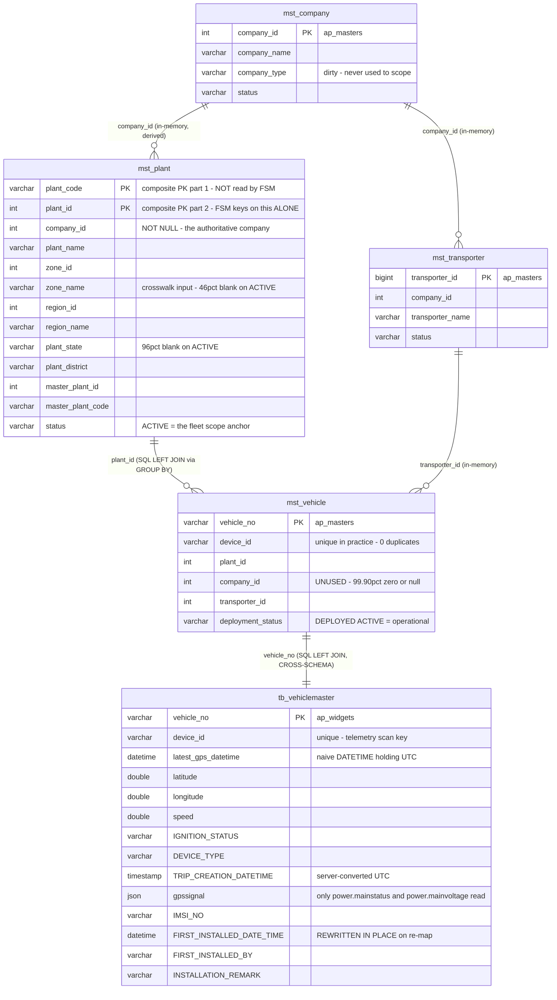
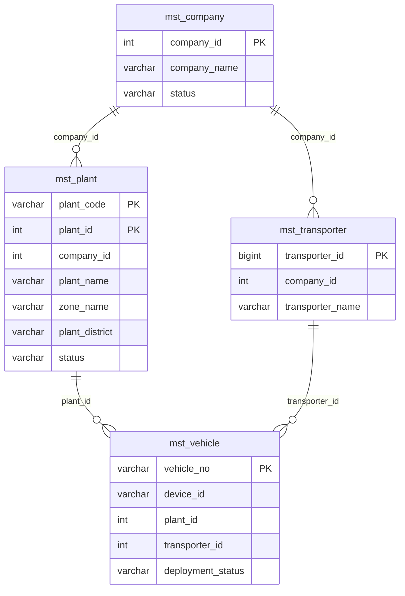
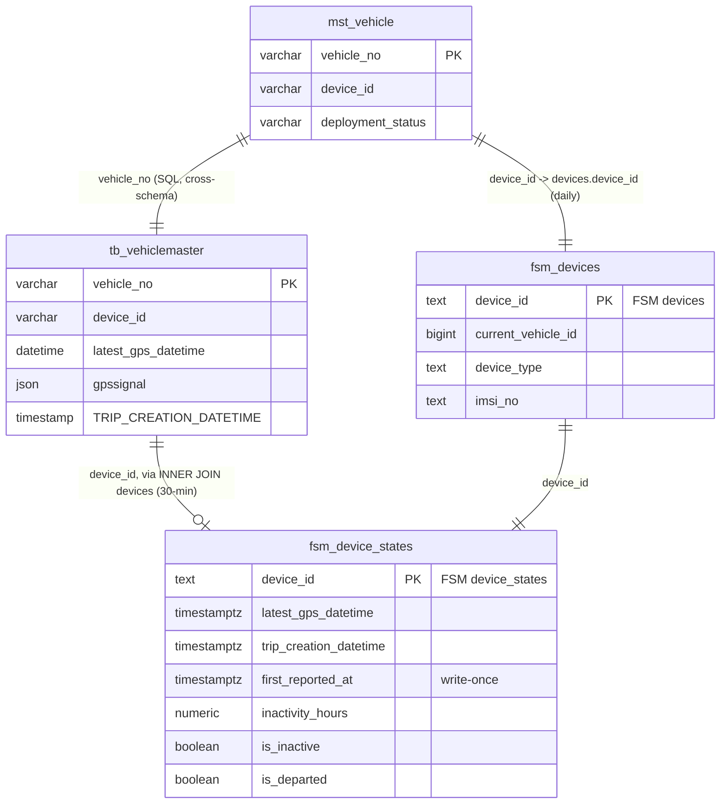
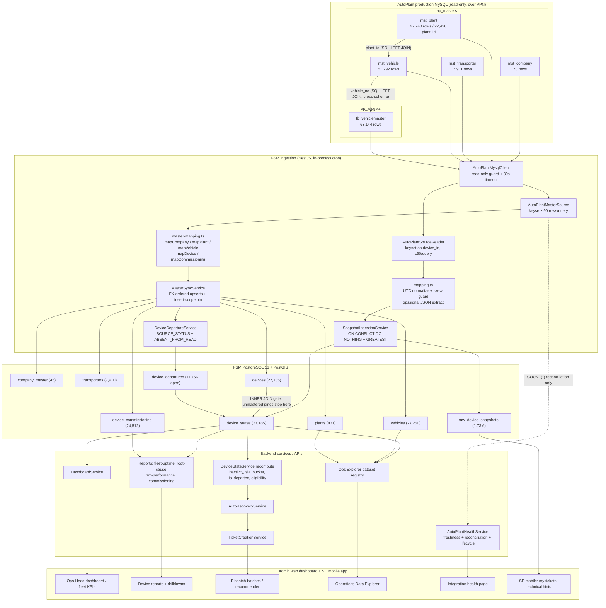

# AutoPlant → FSM Database Table & Relationship Map

**Method:** independent discovery. Every "FSM uses this" claim below is anchored to a file and line in
this repository; every "the data looks like this" claim is anchored to a read-only query executed
against the live AutoPlant production MySQL (`10.0.0.25:3306`, account `bi_enroute_readonly`,
MySQL 8.0.43) and the live FSM Postgres (`localhost:5433/fsm`) on **2026-08-12**. Nothing here is
taken from prior documentation, and nothing was written to either database.

**Verification legend (used throughout):**

| Mark | Meaning |
|---|---|
| ✅ **VERIFIED** | FSM code explicitly uses the relationship **and** live data supports it |
| 🟢 **CODE VERIFIED** | FSM explicitly uses it; live-data verification not required or not applicable |
| 🟡 **DATA VERIFIED** | The relationship exists in live data, but FSM does **not** use it as a join |
| 🔵 **INFERRED** | Likely relationship, not proven |
| ❌ **NOT VERIFIED** | Insufficient evidence — stated as such, never filled with an assumption |

> **Live-counts caveat.** AutoPlant is a production system that changes while it is being read.
> Counts taken minutes apart differ by a handful of rows (e.g. `mst_vehicle` read 51,290 → 51,292
> during this session). Every ratio below that matters was re-measured inside a **single atomic
> query** so the numerator and denominator come from the same instant. Row counts are therefore
> accurate to ±~10 rows, and the conclusions do not depend on that margin.

---

## 1. Executive Summary

FSM reads **five AutoPlant tables**, out of **97** that exist in the two schemas it can reach
(43 in `ap_masters`, 54 in `ap_widgets`).

| # | Schema | Table | Role in FSM |
|---|---|---|---|
| 1 | `ap_widgets` | `tb_vehiclemaster` | GPS telemetry (every 30 min) **+** device identity & fitment (daily) |
| 2 | `ap_masters` | `mst_vehicle` | Vehicle ↔ device fitment, plant, transporter, deployment status |
| 3 | `ap_masters` | `mst_plant` | Site master — the **scope anchor** for the entire sync |
| 4 | `ap_masters` | `mst_company` | Customer account names/type/status |
| 5 | `ap_masters` | `mst_transporter` | Transporter names/status |

**Only two SQL joins are ever executed against AutoPlant.** Everything else is joined in FSM
application memory or, later, inside FSM Postgres:

1. `mst_vehicle` → `mst_plant` on `plant_id` (to obtain the authoritative `company_id`)
2. `mst_vehicle` → `tb_vehiclemaster` on `vehicle_no` (**cross-schema**, for device identity and
   fitment dates)

**Two independent pipelines** carry the data:

- **Master sync** — daily 02:00 cron. `ap_masters` (+ the static columns of `tb_vehiclemaster`) →
  FSM `plants`, `company_master`, `transporters`, `vehicles`, `devices`, `device_commissioning`,
  `device_departures`.
- **Telemetry snapshot** — 30-minute cron. `ap_widgets.tb_vehiclemaster` only → FSM
  `raw_device_snapshots` + `device_states`.

The **single most load-bearing identifier in the whole integration is `device_id`**, and it is a
**string**, not a number — production carries leading-zero IMEIs (`0869925073271551`) and
alphanumeric vendor ids. It is the only key that links the telemetry pipeline to the master pipeline,
and the two pipelines never join it in SQL; they meet inside FSM Postgres.

**The five relationships that matter, and how well they hold up (measured live, 2026-08-12):**

| Relationship | Live evidence | Status |
|---|---|---|
| `mst_vehicle.vehicle_no` = `tb_vehiclemaster.vehicle_no` | 51,291 vehicles → 51,291 join rows, **zero fan-out, 100% coverage** | ✅ |
| `mst_vehicle.device_id` ≡ `tb_vehiclemaster.device_id` (same vehicle) | **51,291 / 51,291 agree; 0 disagree** | ✅ |
| `mst_vehicle.plant_id` → `mst_plant.plant_id` | 51,280 / 51,290 match a plant; **15,566 / 15,566 operational vehicles match an ACTIVE plant** | ✅ |
| `mst_plant.company_id` → `mst_company.company_id` | 42 distinct companies on ACTIVE plants, **0 orphans** | ✅ |
| `mst_vehicle.transporter_id` → `mst_transporter.transporter_id` | **0 orphans, 0 nulls** across 51,290 vehicles | ✅ |

**Four data-quality findings supported by evidence** (details in §10):

1. `mst_plant` has a **composite primary key `(plant_code, plant_id)`**, and FSM keys plants on
   `plant_id` alone. On ACTIVE plants that collapses **1,233 source rows into 908 FSM plants** — and
   for 4 `plant_id`s it collapses **320 differently-named physical sites into 4 FSM plants**.
2. `mst_vehicle.company_id` is unusable: **51,239 of 51,290 rows (99.90%) are `0` or NULL**. FSM
   correctly ignores it and derives company via the plant.
3. The telemetry reader scans **all 63,144** `tb_vehiclemaster` rows while the master mirror only
   holds the operational fleet, so **33,671 distinct `device_id`s have journalled telemetry in FSM
   with no `devices` row** — recorded, but invisible to every dashboard.
4. **Exactly 5 devices** write a non-UTC (IST) wall clock into `latest_gps_datetime`, landing up to
   5h29m in the future. This is the population the ±60-minute skew guard exists to reject.

---

## 2. AutoPlant Tables Used by FSM

### 2.1 `ap_widgets.tb_vehiclemaster`

| Property | Value |
|---|---|
| **Database / schema** | `ap_widgets` |
| **Live row count** | 63,144 (`SELECT COUNT(*)`, 2026-08-12) |
| **Primary key** | `vehicle_no` (verified: `information_schema.STATISTICS`, `PRIMARY`, unique) |
| **Grain** | One row per vehicle — **latest-state**, rewritten in place by the fleet |
| **Purpose in FSM** | (a) the *only* source of GPS telemetry; (b) the *only* source of device hardware identity and fitment dates |

**Access site A — telemetry scan (every 30 min).**

- File: `apps/backend/src/ingestion/autoplant/autoplant-source-reader.ts`
- Class/method: `AutoPlantSourceReader.readChunk` (line 87)
- Query (lines 94–97):

```sql
SELECT device_id, latest_gps_datetime, latitude, longitude, speed, IGNITION_STATUS,
       DEVICE_TYPE, TRIP_CREATION_DATETIME, gpssignal
  FROM `ap_widgets`.tb_vehiclemaster
 WHERE latest_gps_datetime IS NOT NULL
   AND device_id IS NOT NULL
   AND TRIM(device_id) <> ''
   AND device_id > ?          -- keyset continuation, omitted on the first page
 ORDER BY device_id
 LIMIT 90
```

- **Trigger:** `@Cron('*/30 * * * *')` — `IntegrationSchedulerService.telemetryTick`
  (`integration-scheduler.service.ts:23,70`), gated on `INGESTION_SCHEDULER_ENABLED === 'true'`.
- **Pagination:** keyset on the immutable `device_id`, 90 rows/query (DBA `< 100 rows/query` cap).
  **No `latest_gps_datetime` predicate** — deliberately, so a device that re-pings mid-scan can
  neither be re-read nor skipped.
- **What happens to the data:** each row → `mapVehicleMasterRow` (`mapping.ts:207`) → appended to
  `raw_device_snapshots` and folded into `device_states` (`snapshot-ingestion.service.ts:135`).

**Access site B — device-identity / fitment enrichment (daily).**

- File: `apps/backend/src/ingestion/autoplant/autoplant-master-source.ts`
- Method: `AutoPlantMasterSource.readVehicleMasters` (line 227) — joined into the `mst_vehicle` read.
- Columns taken: `DEVICE_TYPE`, `IMSI_NO`, `FIRST_INSTALLED_DATE_TIME`, `FIRST_INSTALLED_BY`,
  `INSTALLATION_REMARK`.
- `TRIP_CREATION_DATETIME` is **deliberately not** read here — it is live trip state and rides the
  30-minute path instead (documented at `autoplant-master-source.ts:252-255`).

**Access site C — connectivity probe (manual).**
`autoplant-ping.ts:58-61` — `SELECT vehicle_no, device_id, DEVICE_TYPE, IMSI_NO, TRIP_CREATION_DATETIME, latest_gps_datetime … WHERE gpssignal IS NOT NULL LIMIT 3`.

---

### 2.2 `ap_masters.mst_vehicle`

| Property | Value |
|---|---|
| **Live row count** | 51,292 |
| **Primary key** | `vehicle_no` (verified unique) |
| **Grain** | One row per vehicle registration |
| **Purpose in FSM** | The fitment anchor: which device is on which vehicle, at which plant, under which transporter, in what deployment state |

**Access site A — the main master read (daily).**

- `AutoPlantMasterSource.readVehicleMasters` (`autoplant-master-source.ts:227-283`)
- Emitted SQL (one page; repeated with `v.vehicle_no > ?` until short):

```sql
SELECT v.vehicle_no AS vehicle_no, v.device_id AS device_id, v.plant_id AS plant_id,
       p.company_id AS company_id, v.transporter_id AS transporter_id,
       v.deployment_status AS deployment_status,
       w.DEVICE_TYPE AS device_type, w.IMSI_NO AS imsi_no,
       w.FIRST_INSTALLED_DATE_TIME AS first_installed_date_time,
       w.FIRST_INSTALLED_BY        AS first_installed_by,
       w.INSTALLATION_REMARK       AS installation_remark
  FROM `ap_masters`.`mst_vehicle` v
  LEFT JOIN (SELECT plant_id, MIN(company_id) AS company_id
               FROM `ap_masters`.`mst_plant` GROUP BY plant_id) p
    ON p.plant_id = v.plant_id
  LEFT JOIN `ap_widgets`.`tb_vehiclemaster` w
    ON w.vehicle_no = v.vehicle_no
 WHERE v.vehicle_no > ?
 ORDER BY v.vehicle_no
 LIMIT 90
```

- **Read scope:** *every* `deployment_status` (`ingestion.module.ts:121`, `deploymentStatuses: []`).
  This is intentional so a device **leaving** the fleet is observed, not inferred.
- **Create scope (separate, and narrower):** `isOperationalStatus` — `['DEPLOYED','ACTIVE']`
  (`master-mapping.ts:174`). A never-before-seen non-operational vehicle is counted and dropped.
- **Trigger:** `@Cron('0 2 * * *')` — `IntegrationSchedulerService.mastersTick`.

**Access site B — reconciliation count.**
`countVehicleMasters` (`autoplant-master-source.ts:183`):
`SELECT COUNT(*) FROM ap_masters.mst_vehicle WHERE deployment_status IN ('DEPLOYED','ACTIVE')`.

**Access site C — health ping.**
`AutoPlantMysqlClient.ping` (`autoplant-mysql.client.ts:202`):
`SELECT COUNT(*) AS n FROM \`ap_masters\`.mst_vehicle`.

---

### 2.3 `ap_masters.mst_plant`

| Property | Value |
|---|---|
| **Live row count** | 27,748 (**27,420 distinct `plant_id`**) |
| **Primary key** | **COMPOSITE: `(plant_code, plant_id)`** — verified via `information_schema.STATISTICS` (`PRIMARY` seq 1 = `plant_code`, seq 2 = `plant_id`) |
| **Grain** | One row per (plant_code, plant_id) — **not** one row per plant_id |
| **Purpose in FSM** | The scope anchor. FSM's fleet is *defined* as "vehicles at ACTIVE plants". Also supplies the raw zone/region/state geography and the authoritative `company_id`. |

**Access site A — plant read (daily).**
`AutoPlantMasterSource.readPlants` (`autoplant-master-source.ts:211`):

```sql
SELECT plant_id, company_id, plant_name, zone_id, zone_name, region_id, region_name,
       plant_state, plant_district, master_plant_id, master_plant_code, status
  FROM `ap_masters`.`mst_plant`
 WHERE (status IN ('ACTIVE')) AND plant_id > ?
 ORDER BY plant_id
 LIMIT 90
```

followed by an in-memory `dedupBy(rows, plant_id)` — **keep the first row per `plant_id`**
(line 224). This is where the composite-PK collapse happens (§10.1).

**Access site B — the company-resolution subquery** inside `readVehicleMasters` (see §2.2). A
`GROUP BY plant_id` subquery rather than a raw join, precisely so the composite PK cannot fan each
vehicle out once per `plant_code`.

**Access site C — reconciliation count.** `countPlants` (line 170):
`SELECT COUNT(DISTINCT plant_id) FROM ap_masters.mst_plant WHERE status IN ('ACTIVE')`.

**Access site D — ping.** `autoplant-ping.ts:43`.

---

### 2.4 `ap_masters.mst_company`

| Property | Value |
|---|---|
| **Live row count** | 70 |
| **Primary key** | `company_id` (`int`, verified) |
| **Purpose in FSM** | Customer account name / type / status. **Companies are derived, not scoped** — a company is created in FSM only when an in-scope plant names it. |

`AutoPlantMasterSource.readCompanies` (`autoplant-master-source.ts:191`):

```sql
SELECT company_id, company_name, company_type, status
  FROM `ap_masters`.`mst_company`
 WHERE company_id > ?
 ORDER BY company_id LIMIT 90
```

No `WHERE` filter on status or type. The filtering happens in `MasterSyncService`
(`master-sync.service.ts:244-249`): any company not referenced by an in-scope plant is skipped with
reason `NO_INSCOPE_PLANT`. `company_type` is read and mirrored but **never used to gate the sync** —
documented at `master-mapping.ts:134-141` (real customers are typed `'NA'`).

---

### 2.5 `ap_masters.mst_transporter`

| Property | Value |
|---|---|
| **Live row count** | 7,911 |
| **Primary key** | `transporter_id` (`bigint`, verified) |
| **Purpose in FSM** | Transporter name/status, shown on device and ticket detail |

`AutoPlantMasterSource.readTransporters` (`autoplant-master-source.ts:201`):

```sql
SELECT transporter_id, company_id, transporter_name, status
  FROM `ap_masters`.`mst_transporter`
 WHERE transporter_id > ?
 ORDER BY transporter_id LIMIT 90
```

Note: `mst_transporter` also carries a `plant_id` column. **FSM does not read it.**

---

## 3. Important Columns

Only columns FSM actually reads are listed. Types are from `information_schema.COLUMNS` on the live
production server.

### 3.1 `ap_widgets.tb_vehiclemaster`

| Column | Type | Nullable | Key | Meaning | FSM reads? | Where used |
|---|---|---|---|---|---|---|
| `vehicle_no` | `varchar(255)` | NO | **PRI** | Vehicle registration | ✔ | Join key to `mst_vehicle` (`autoplant-master-source.ts:278`) |
| `device_id` | `varchar(255)` | YES | `idx_device_id` (non-unique) | GPS unit business id. **Leading-zero IMEIs are real** | ✔ | Telemetry scan key + FSM `devices.device_id` |
| `latest_gps_datetime` | `datetime` | YES | in `idx_vehiclemaster_deviceid_gpsdatetime` | Last GPS fix. **Naive DATETIME containing UTC** | ✔ | `device_states.latest_gps_datetime`, every inactivity figure |
| `latitude` | `double` | YES | — | Last known latitude | ✔ | `raw_device_snapshots.lat` |
| `longitude` | `double` | YES | — | Last known longitude | ✔ | `raw_device_snapshots.lon` |
| `speed` | `double` | YES | — | Last reported speed | ✔ | `raw_device_snapshots.speed` |
| `IGNITION_STATUS` | `varchar(50)` | YES | — | Ignition on/off | ✔ | `raw_device_snapshots.ignition_status` |
| `DEVICE_TYPE` | `varchar(50)` | YES | — | Hardware model (NVT3 / V5 / VT200L …) | ✔ | `devices.device_type` (daily) + `raw_device_snapshots.device_type` (30-min) |
| `TRIP_CREATION_DATETIME` | `timestamp` | YES | — | Current trip's creation time. **TIMESTAMP → server-converted, arrives UTC** | ✔ | `device_states.trip_creation_datetime` |
| `gpssignal` | `json` | YES | — | Full device telemetry blob (18 top-level keys) | ✔ (2 paths only) | `$.power.mainstatus` → `mains_status`; `$.power.mainvoltage` → `mains_voltage` |
| `IMSI_NO` | `varchar(255)` | YES | — | Fitted SIM subscriber identity | ✔ | `devices.imsi_no` |
| `FIRST_INSTALLED_DATE_TIME` | `datetime` | YES | — | When this device was first fitted to THIS vehicle. **Rewritten in place on a re-map** | ✔ | `device_commissioning.installed_at` |
| `FIRST_INSTALLED_BY` | `varchar(100)` | YES | — | Installer **login string**, not a person | ✔ | `device_commissioning.installed_by` |
| `INSTALLATION_REMARK` | `varchar(255)` | YES | — | 'New Installation' vs 'Re-Mapping' | ✔ | `device_commissioning.installation_remark` |
| `device_installation_date` | `timestamp` | YES | — | A true-UTC install stamp | ✘ | Not read by FSM. Used historically as the *calibration reference* proving `FIRST_INSTALLED_DATE_TIME` is UTC |
| `plant_id` | `varchar(255)` | YES | `idx_plantid` | Plant reference **on the widgets side** | ✘ | **Not read.** Plant always comes from `mst_vehicle` |

**Live column profile (63,142-row sample, single atomic query):**

| Measure | Count | % |
|---|---:|---:|
| Rows | 63,142 | 100% |
| Distinct `vehicle_no` | 63,142 | 100% (PK) |
| `device_id` NULL/blank/`'NULL'` | **0** | 0% |
| Distinct `device_id` | 63,142 | **100% — effectively unique** |
| `latest_gps_datetime` IS NULL (never pinged) | 6,377 | 10.1% |
| `gpssignal` IS NULL | 12,085 | 19.1% |
| `TRIP_CREATION_DATETIME` IS NULL | 8,738 | 13.8% |
| `IMSI_NO` IS NULL | 10,605 | 16.8% |
| `DEVICE_TYPE` NULL or `''` | 12,085 | 19.1% |
| `FIRST_INSTALLED_DATE_TIME` IS NULL | **7** | 0.01% |
| `INSTALLATION_REMARK` NULL or `''` | 19,893 | 31.5% |

`gpssignal` power fields: of 51,059 non-null blobs, **51,059 (100%)** have both
`$.power.mainstatus` and `$.power.mainvoltage` keys present (values may be JSON `null`, which FSM
coerces to SQL NULL — `mapping.ts:125-145`).

`DEVICE_TYPE` vocabulary (top values): `NVT3` 23,487 · *(blank)* 12,084 · `#NVT` 11,769 · `V5` 9,489 ·
`NVT180` 2,669 · `VENDOR_GPS` 1,599 · `VT200L` 1,238 · `GV30CIN` 447 · `TELENITY_SIM_TRACKING` 280 ·
plus a long tail (`EC08`, `FMB125`, `GV30CEU`, …).

### 3.2 `ap_masters.mst_vehicle`

| Column | Type | Nullable | Key | Meaning | FSM reads? | Where used |
|---|---|---|---|---|---|---|
| `vehicle_no` | `varchar(255)` | NO | **PRI** | Registration | ✔ | `vehicles.vehicle_no` (FSM natural key); keyset cursor |
| `device_id` | `varchar(255)` | YES | `IDXo10vkcv…` (non-unique) | Fitted GPS unit | ✔ | `devices.device_id`, `devices.current_vehicle_id` |
| `plant_id` | `int` | YES (default `0`) | — | Site the vehicle belongs to | ✔ | Join → `mst_plant`; `vehicles.plant_id` |
| `company_id` | `int` | YES (default `0`) | — | Owning company — **unreliable** | ✘ **not used** | Replaced by `mst_plant.company_id` |
| `transporter_id` | `int` | YES | — | Operating transporter | ✔ | `vehicles.transporter_id` |
| `deployment_status` | `varchar(50)` | YES | — | DEPLOYED / UNDEPLOYED / MAINTENANCE / ACTIVE | ✔ | `vehicles.status`; drives the whole departure lifecycle |
| `first_installed_dt` | `datetime` | YES | — | Masters-side install date | ✘ | Not read — widgets is the anchor (99.99% vs partial coverage) |

**Live column profile (51,290-row atomic read):**

| Measure | Count | Note |
|---|---:|---|
| Rows | 51,290 | |
| Distinct `vehicle_no` | 51,290 | PK holds |
| `device_id` NULL or blank | **0** | today every vehicle carries a device |
| Distinct `device_id` | **51,290** | **1 : 1 with vehicle — no duplicates** |
| `plant_id` NULL or `0` | **5** | |
| **`company_id` NULL or `0`** | **51,239** | **99.90% — unusable, as the code states** |
| `transporter_id` NULL or `0` | **0** | |

`deployment_status` distribution (live):

| Value | Rows | FSM treatment |
|---|---:|---|
| `UNDEPLOYED` | 35,434 | non-operational → departure |
| `DEPLOYED` | 15,524 | **operational** |
| `MAINTENANCE` | 288 | non-operational → departure |
| `ACTIVE` | 40 | **operational** |
| `DEPLOYED/UNDEPLOYED` | 4 | dirty composite → treated non-operational (allow-list posture) |

Operational total = **15,566**. This is exactly what `countVehicleMasters()` returns to the
reconciliation surface.

### 3.3 `ap_masters.mst_plant`

| Column | Type | Nullable | Key | Meaning | FSM reads? | Where used |
|---|---|---|---|---|---|---|
| `plant_id` | `int` | NO | **PRI (seq 2)** | Site id | ✔ | `plants.source_plant_id`; join key from `mst_vehicle` |
| `plant_code` | `varchar(255)` | NO | **PRI (seq 1)** | Site code | ✘ **not read** | The cause of §10.1 |
| `company_id` | `int` | **NO** | — | Owning company. **NOT NULL — this is why scope anchors here** | ✔ | Company derivation; `vehicles.company_id` |
| `plant_name` | `varchar(100)` | NO | — | Site name | ✔ | `plants.name` |
| `zone_id` | `int` | NO | — | AutoPlant's own zone id | ✔ (mirrored) | `plants.source_zone_id` |
| `zone_name` | `varchar(100)` | NO | — | AutoPlant's zone label — **the crosswalk input** | ✔ | `plants.source_zone_name`; `MappingTableZoneResolver` |
| `region_id` | `int` | NO | — | Region id | ✔ (mirrored) | `plants.source_region_id` |
| `region_name` | `varchar(100)` | NO | — | Region label | ✔ (mirrored) | `plants.source_region_name` |
| `plant_state` | `varchar(25)` | YES | — | Indian state | ✔ (mirrored) | `plants.plant_state` |
| `plant_district` | `varchar(40)` | YES | — | District | ✔ | `plants.plant_district`; resolves `plants.district_id` |
| `master_plant_id` | `int` | YES | — | Parent/grouping plant reference | ✔ (mirrored) | `plants.master_plant_id` |
| `master_plant_code` | `varchar(100)` | YES | — | Parent plant code | ✔ (mirrored) | `plants.master_plant_code` |
| `status` | `varchar(8)` | NO | — | ACTIVE / INACTIVE | ✔ | **The scope filter** + `plants.status` |

**Live profile:** 27,748 rows / 27,420 distinct `plant_id`. `status` has exactly two values:
`INACTIVE` 26,515 · `ACTIVE` 1,233 (→ **908 distinct `plant_id`**).

`zone_name` on ACTIVE rows — the input to FSM's zone crosswalk:

| `zone_name` | Rows | Distinct plant_id | FSM normalized key → outcome |
|---|---:|---:|---|
| `NA` | 357 | 96 | `__blank__` → **UNZONED** (PENDING) |
| `West Zone` | 227 | 227 | `west` → MAPPED to FSM zone *West* |
| *(blank)* | 207 | 147 | `__blank__` → **UNZONED** |
| `North` | 177 | 177 | `north` → MAPPED |
| `WEST` | 177 | 177 | `west` → MAPPED (same key as "West Zone") |
| `South` | 56 | 56 | `south` → MAPPED |
| `East` | 24 | 24 | `east` → MAPPED |
| `null` | 5 | 5 | `__blank__` → **UNZONED** |
| `Central` | 2 | 2 | `central` → PENDING → UNZONED |
| `sdf` | 1 | 1 | `sdf` → IGNORED → UNZONED |

**569 of 1,233 ACTIVE rows (46.1%) carry no usable zone label.** `plant_state` is blank/NULL/`'NA'`
on **1,190 of 1,233 (96.5%)**.

### 3.4 `ap_masters.mst_company`

| Column | Type | Nullable | Key | FSM reads? | FSM destination |
|---|---|---|---|---|---|
| `company_id` | `int` | NO | **PRI** | ✔ | `company_master.source_company_id` |
| `company_name` | `varchar(60)` | NO | — | ✔ | `company_master.name` |
| `company_type` | `varchar(15)` | NO | — | ✔ (mirrored, never used to gate) | `company_master.company_type` |
| `status` | `varchar(10)` | NO | — | ✔ | `company_master.status` |

### 3.5 `ap_masters.mst_transporter`

| Column | Type | Nullable | Key | FSM reads? | FSM destination |
|---|---|---|---|---|---|
| `transporter_id` | `bigint` | NO | **PRI** | ✔ | `transporters.source_transporter_id` |
| `company_id` | `int` | NO | in `uk_transporter_code_id_company` | ✔ | `transporters.company_id` (best-effort FK) |
| `transporter_name` | `varchar(60)` | NO | — | ✔ | `transporters.name` |
| `status` | `varchar(10)` | NO | — | ✔ | `transporters.status` |
| `plant_id` | `int` | NO | — | ✘ | not read |

---

## 4. Verified Relationships and Joins

### 4.0 A structural fact discovered first

```sql
SELECT … FROM information_schema.KEY_COLUMN_USAGE
 WHERE REFERENCED_TABLE_NAME IS NOT NULL AND TABLE_NAME IN (…the five…);
-- → zero rows
```

**AutoPlant declares no foreign keys at all on any of the five tables FSM reads.** Every
relationship below is application-level. This is why each one had to be verified against data
rather than read off the schema.

---

### J1 — Vehicle → Plant (SQL, executed on AutoPlant) ✅ VERIFIED

```
ap_masters.mst_vehicle.plant_id
        ↓
LEFT JOIN (SELECT plant_id, MIN(company_id) AS company_id
             FROM ap_masters.mst_plant GROUP BY plant_id) p
  ON p.plant_id = v.plant_id
        ↓
ap_masters.mst_plant.plant_id  (→ yields mst_plant.company_id)
```

| Field | Value |
|---|---|
| Source | `ap_masters` · `mst_vehicle` · `plant_id` (`int`, nullable, default 0) |
| Target | `ap_masters` · `mst_plant` · `plant_id` (`int`, NOT NULL, PK seq 2) |
| Type | `LEFT JOIN` onto a `GROUP BY plant_id` derived table |
| Purpose | Obtain the vehicle's **authoritative** `company_id` (the vehicle's own is 0) |
| Code | `autoplant-master-source.ts:275-277` |
| Cardinality | many vehicles → one plant_id (**M:1**) |

**Live verification:**

| Check | Result |
|---|---|
| Vehicles matching *any* `mst_plant.plant_id` | **51,280 / 51,290** (10 orphans) |
| Vehicles matching an **ACTIVE** plant | 51,024 / 51,290 → **266 skipped** |
| **Operational** vehicles matching an ACTIVE plant | **15,566 / 15,566 = 100%** |
| `plant_id`s with more than one distinct `company_id` | **0** → `MIN(company_id)` is deterministic in practice |

**Cross-check against the running system:** FSM master-sync run 119 (2026-08-11, SUCCESS) recorded
`vehicles.skippedByReason.PLANT_NOT_SYNCED = 266` — **exactly** the number this independent live
query produced. The join behaves in production precisely as the code describes.

---

### J2 — Vehicle → Telemetry/Identity (SQL, **cross-schema**) ✅ VERIFIED

```
ap_masters.mst_vehicle.vehicle_no
        ↓
LEFT JOIN ap_widgets.tb_vehiclemaster w ON w.vehicle_no = v.vehicle_no
        ↓
ap_widgets.tb_vehiclemaster.vehicle_no  (PK)
```

| Field | Value |
|---|---|
| Source | `ap_masters` · `mst_vehicle` · `vehicle_no` (`varchar(255)`, PK) |
| Target | `ap_widgets` · `tb_vehiclemaster` · `vehicle_no` (`varchar(255)`, PK) |
| Type | `LEFT JOIN`, **spans two databases on one MySQL host** |
| Purpose | `DEVICE_TYPE`, `IMSI_NO`, `FIRST_INSTALLED_*`, `INSTALLATION_REMARK` have no home in `ap_masters` |
| Code | `autoplant-master-source.ts:278` |
| Cardinality | **1 : 1** (PK on both sides) |

**Live verification (single atomic query, so numerator and denominator share an instant):**

```
mst_vehicle rows        = 51,291
join rows produced      = 51,291      → zero fan-out, 100% coverage
tb_vehiclemaster rows   = 63,143      → 11,852 widgets rows have NO mst_vehicle counterpart
```

Operational subset: **15,565 / 15,565 = 100%** matched.

---

### J3 — Plant → Company (in-memory, FSM application) ✅ VERIFIED

```
ap_masters.mst_plant.company_id
        ↓
matched in MasterSyncService against the mst_company read
        ↓
ap_masters.mst_company.company_id
```

| Field | Value |
|---|---|
| Type | Set-membership lookup in application memory — **not SQL** |
| Code | `master-sync.service.ts:223-224` (collect), `:244-249` (filter), `:268` (resolve) |
| Purpose | Companies are **derived**: created only when an in-scope plant references them |
| Cardinality | many plants → one company (**M:1**) |

**Live verification:**

| Check | Result |
|---|---|
| Distinct `company_id` on ACTIVE plants | **42** |
| Of those, orphaned (no `mst_company` row) | **0** |
| `mst_company` total rows | 70 → **28 companies are inert** (skipped `NO_INSCOPE_PLANT`) |
| FSM `company_master` rows today | 45 (≥ 42, because FSM never deletes a once-synced company) |

---

### J4 — Transporter → Company (in-memory) ✅ VERIFIED

```
ap_masters.mst_transporter.company_id  →  ap_masters.mst_company.company_id
```

Code: `master-sync.service.ts:268` — `companyIdBySource.get(...) ?? null` (best-effort; an
unresolvable company simply leaves `transporters.company_id` NULL).
**Live:** 7,911 transporters, **0 company orphans**.

---

### J5 — Vehicle → Transporter (in-memory) ✅ VERIFIED

```
ap_masters.mst_vehicle.transporter_id  →  ap_masters.mst_transporter.transporter_id
```

Code: `master-sync.service.ts:318`.
**Live:** **0 orphans**, **0 null/zero `transporter_id`** across 51,290 vehicles, 7,911 distinct
transporter ids (PK unique).

---

### J6 — The device identity bridge between the two pipelines ✅ VERIFIED

This is the relationship that makes the whole platform work, and it is **never expressed as a SQL
join against AutoPlant**. The two pipelines write independently into FSM Postgres and meet on
`device_id`:

```
ap_masters.mst_vehicle.device_id          ap_widgets.tb_vehiclemaster.device_id
        │ (daily master sync)                        │ (30-min telemetry scan)
        ▼                                            ▼
   fsm.devices.device_id  ◄────── INNER JOIN ──────  unnest(chunk device_ids)
        │                    snapshot-ingestion.service.ts:144
        ▼
   fsm.device_states.device_id
```

Code: `snapshot-ingestion.service.ts:144` — `JOIN devices d ON d.device_id = u.device_id`.
A ping for a device the master sync has not mirrored is journalled into `raw_device_snapshots`
but **cannot** create a `device_states` row (FK protection), and is counted as `unknownDevices`.

**Live verification that the bridge is sound at source:**

```sql
SELECT COUNT(*) AS joined,
       SUM(v.device_id <=> w.device_id)      AS agrees,
       SUM(NOT (v.device_id <=> w.device_id)) AS differs
  FROM ap_masters.mst_vehicle v
  JOIN ap_widgets.tb_vehiclemaster w ON w.vehicle_no = v.vehicle_no;
-- joined = 51,291 · agrees = 51,291 · differs = 0
```

**Zero disagreement.** The same result holds when restricted to the operational fleet
(15,565 / 15,565). `device_id` is also unique on both sides: 0 duplicate `device_id` groups in
`tb_vehiclemaster`, 0 in `mst_vehicle`.

---

### Relationships present in the data that FSM does **not** join

| Relationship | Status | Evidence |
|---|---|---|
| `mst_plant.zone_id` → `mst_zone.zone_id` | 🔵 **INFERRED** (partially contradicted) | `mst_zone` has 265 rows; **491 of 1,233 ACTIVE plant rows carry a `zone_id` with no `mst_zone` row**. FSM never reads `mst_zone`. |
| `mst_plant.region_id` → `mst_region.region_id` | 🔵 **INFERRED** | `mst_region` has 2,584 rows. FSM never reads it — it takes `region_id`/`region_name` denormalized off `mst_plant`. Not measured further; **NOT VERIFIED**. |
| `mst_plant.master_plant_id` → `mst_plant.plant_id` (self-reference) | 🟡 **DATA VERIFIED** | All 1,233 ACTIVE rows resolve to some `plant_id`; **27,730 of 27,748 rows (99.94%) have `master_plant_id = plant_id`**, i.e. it is self-identity for all but **18 rows**. FSM mirrors the column but never joins on it. |
| `tb_vehiclemaster.plant_id` → `mst_plant.plant_id` | ❌ **NOT VERIFIED** | Column exists (`varchar(255)`, indexed) but FSM never reads it, and its type differs from `mst_plant.plant_id` (`int`). No claim made. |

---

## 5. AutoPlant Data Hierarchy

Discovered from the actual read paths and confirmed against live data. Two entry points exist because
FSM runs two pipelines.

### Path A — the master hierarchy (daily)

```
ap_masters.mst_company
        │  company_id
        │  (referenced by, NOT NULL)
        ▼
ap_masters.mst_plant                    ← THE SCOPE ANCHOR (status = 'ACTIVE')
        │  plant_id                        composite PK (plant_code, plant_id)
        │  ↑ carries zone_id / zone_name / region_id / region_name /
        │    plant_state / plant_district — geography is DENORMALIZED here,
        │    so FSM never needs mst_zone or mst_region
        ▼
ap_masters.mst_vehicle
        │  vehicle_no  ──────────────────► ap_widgets.tb_vehiclemaster.vehicle_no
        │  device_id                            (cross-schema, 1:1)
        │  transporter_id ─────────────────► ap_masters.mst_transporter.transporter_id
        ▼                                            │ company_id
   device identity                                   ▼
                                          ap_masters.mst_company.company_id
```

### Path B — the telemetry hierarchy (every 30 min)

```
ap_widgets.tb_vehiclemaster            ← scanned WHOLE, no joins, ordered by device_id
        │  device_id (the only key used)
        ▼
   GPS fix + power state + trip state
```

### The two paths reconnect only inside FSM

```
mst_vehicle.device_id ──► fsm.devices.device_id ◄── tb_vehiclemaster.device_id
                                    ▲
                        (INNER JOIN at ingest — the gate)
```

**Which source is authoritative for what** — determined from the implementation, not assumed:

| Fact | Authoritative source | Why (from code) |
|---|---|---|
| Vehicle ↔ plant ↔ transporter ↔ deployment status | `ap_masters.mst_vehicle` | It is the only place `deployment_status` lives |
| Company of a vehicle | `ap_masters.mst_plant.company_id` | `mst_vehicle.company_id` is 0 on 99.90% of rows — `autoplant-master-source.ts:228` |
| Fleet scope (what counts as "our fleet") | `ap_masters.mst_plant.status = 'ACTIVE'` | `master-mapping.ts:134-146`; `ingestion.module.ts:96` |
| Device hardware model + SIM | `ap_widgets.tb_vehiclemaster` | Columns do not exist in `ap_masters` — `autoplant-master-source.ts:239-241` |
| Fitment date / installer / remark | `ap_widgets.tb_vehiclemaster` | 99.99% populated (7 nulls in 63,142) vs partial masters coverage — `autoplant-master-source.ts:247-250` |
| GPS position, last-seen, power, trip | `ap_widgets.tb_vehiclemaster` | Only source of telemetry |
| Operational **zone** of a plant | **FSM, not AutoPlant** | `MappingTableZoneResolver` — AutoPlant owns the raw label, FSM owns the mapping |

---

## 6. Master Data Flow

**Orchestrator:** `MasterSyncService.sync()` — `master-sync.service.ts:159`.
**Trigger:** `@Cron('0 2 * * *')` → `IntegrationSyncService.syncMastersTick()` → `syncMasters()`.
**Manual trigger:** `POST /api/integration/sync/masters` (`integration-sync.controller.ts`).
**Ledger:** one `master_sync_runs` row per run, with per-entity `entity_stats` JSON and itemised
`master_sync_rejects`.

### Execution order (FK dependency order — this is the code's own numbering)

```
1. readPlants()        → filter status ∈ {ACTIVE} → PlantZoneResolver → upsert plants
2. readCompanies()     → keep only those an in-scope plant named → upsert company_master
3. readTransporters()  → resolve company FK → upsert transporters
4. readVehicleMasters()→ resolve plant+company+transporter → INSERT-SCOPE PIN → upsert vehicles
5. (same read)         → mapDevice → upsert devices
6. (same read)         → mapCommissioning → createMany(skipDuplicates) device_commissioning
7. (same read)         → DeviceDepartureService.reconcile → device_departures + ticket cancellation
8. PlantEligibleFloatingSeService.refresh() (materialized view)
```

Note steps 4–7 all consume **one** read of `mst_vehicle` (⋈ `mst_plant`, ⋈ `tb_vehiclemaster`).
Re-reading would cost a second 570-page scan and risk the passes disagreeing.

### Column-level mapping

**`mst_company` → `company_master`** (`master-mapping.ts:191`)

| AutoPlant column | FSM column | Purpose |
|---|---|---|
| `mst_company.company_id` | `company_master.source_company_id` (UNIQUE) | Idempotency key |
| `mst_company.company_name` | `company_master.name` | Display, grouping, reports |
| `mst_company.company_type` | `company_master.company_type` | Mirrored only; never gates sync |
| `mst_company.status` | `company_master.status` | Source status mirror |
| *(FSM-owned, insert-only)* | `company_tier` = `SILVER`, `company_priority_rank` = `C` | Recommender sort keys — **excluded from `update`** (anti-drift) |

**`mst_transporter` → `transporters`** (`master-mapping.ts:225`)

| AutoPlant column | FSM column |
|---|---|
| `transporter_id` | `transporters.source_transporter_id` (UNIQUE) |
| `transporter_name` | `transporters.name` |
| `company_id` (→ resolved FSM company) | `transporters.company_id` |
| `status` | `transporters.status` |

**`mst_plant` → `plants`** (`master-mapping.ts:246`)

| AutoPlant column | FSM column | Purpose |
|---|---|---|
| `plant_id` | `plants.source_plant_id` (UNIQUE) | Idempotency key |
| `plant_name` | `plants.name` | Display; dispatch clustering unit |
| `zone_id` | `plants.source_zone_id` | Audit trail of the raw value |
| `zone_name` | `plants.source_zone_name` | **Input to the FSM zone crosswalk** |
| `region_id` / `region_name` | `plants.source_region_id` / `source_region_name` | Audit / reporting |
| `plant_state` | `plants.plant_state` | Geography |
| `plant_district` | `plants.plant_district` → resolves `plants.district_id` | Floating-SE territory |
| `master_plant_id` / `master_plant_code` | `plants.master_plant_id` / `master_plant_code` | Parent grouping |
| `status` | `plants.status` | Source status mirror |
| *(FSM-owned, insert-only)* | `plants.zone_id` | Operational ZM zone — **excluded from `update`** |

**`mst_vehicle` (⋈ `mst_plant`) → `vehicles`** (`master-mapping.ts:306`)

| AutoPlant column | FSM column |
|---|---|
| `mst_vehicle.vehicle_no` | `vehicles.vehicle_no` (UNIQUE natural key) |
| `mst_vehicle.plant_id` → FSM plant | `vehicles.plant_id` |
| **`mst_plant.company_id`** (via J1) → FSM company | `vehicles.company_id` |
| `mst_vehicle.transporter_id` → FSM transporter | `vehicles.transporter_id` |
| `mst_vehicle.deployment_status` | `vehicles.status` (verbatim) |

**`mst_vehicle` ⋈ `tb_vehiclemaster` → `devices`** (`master-mapping.ts:405`)

| AutoPlant column | FSM column |
|---|---|
| `mst_vehicle.device_id` | `devices.device_id` (PK, **string**) |
| *(resolved vehicle)* | `devices.current_vehicle_id` |
| `tb_vehiclemaster.DEVICE_TYPE` | `devices.device_type` |
| `tb_vehiclemaster.IMSI_NO` | `devices.imsi_no` |
| *(FSM-owned)* | `devices.deal_type` — **absent from create AND update** |

**`tb_vehiclemaster` → `device_commissioning`** (append-only, `master-mapping.ts:384`)

| AutoPlant column | FSM column | Purpose |
|---|---|---|
| `FIRST_INSTALLED_DATE_TIME` | `device_commissioning.installed_at` (UTC, offset 0) | Fitment instant |
| `FIRST_INSTALLED_BY` | `installed_by` | Attribution evidence (a login, not a person) |
| `INSTALLATION_REMARK` | `installation_remark` | 'New Installation' vs 'Re-Mapping' cohort split |
| *(resolved)* | `vehicle_id`, `plant_id`, `company_id`, `first_reported_at`, `run_id` | Context frozen at observation time |

This table exists because **AutoPlant rewrites `FIRST_INSTALLED_DATE_TIME` in place on a re-map**,
destroying the previous fitment record at source. The FSM unique index is
`(device_id, vehicle_id, installed_at) NULLS NOT DISTINCT` — a re-map changes `vehicle_id`, which is
a new identity, so it appends. Live: **24,512 commissioning facts** held today.

**`mst_vehicle.deployment_status` → `device_departures`** (`device-departure.service.ts:131`)

Two detection paths, deliberately unequal in trust:

| Path | Trigger | Trust | Guard |
|---|---|---|---|
| `SOURCE_STATUS` | The read **observed** a non-operational status | Trustworthy | Applied unconditionally |
| `ABSENT_FROM_READ` | The device's `device_id` is not in the read at all | **Inferred** | Only inside `syncedPlantIds` scope, **and** aborted wholesale if > 10% of the in-scope fleet would depart |

Opening a departure also cancels that device's open tickets (`CLOSED` /
`DEVICE_UNDEPLOYED_CLOSE`), terminates the parent Failure Cycle, and writes one audit row per
device. Restores run the same observation backwards.

### Live end-to-end reconciliation of the master path

| Entity | AutoPlant (live, in FSM's own scope) | FSM Postgres (live) | Reading |
|---|---:|---:|---|
| Plants | 908 distinct ACTIVE `plant_id` | 931 `plants` | FSM keeps 23 plants that have since left ACTIVE — never deleted |
| Companies | 42 referenced by ACTIVE plants | 45 `company_master` | Same reason |
| Transporters | 7,911 | 7,910 | 1 added at source since the last sync |
| Vehicles (operational) | 15,566 | 18,047 `DEPLOYED` + 40 `ACTIVE` = 18,087 | FSM retains departed vehicles; see below |
| Vehicles (all in FSM) | — | 27,250 | of which **11,756 have an open departure** → 15,494 operational-equivalent ≈ 15,566 source ✔ |
| Devices | 51,174 observed in the last SUCCESS run | 27,185 `devices` | FSM mirrors only the operational fleet + previously-known devices |

Master-sync run 119 (last SUCCESS, 2026-08-11) recorded:
`plants {updated: 908}` · `vehicles {inserted: 164, updated: 24,223, skipped: 26,787}` ·
`devices {inserted: 149, updated: 24,234, observed: 51,174}` ·
`departures {inserted: 415, updated: 192}`.
The `908` and the `PLANT_NOT_SYNCED: 266` both match this investigation's independent live queries
exactly.

> ⚠ **Current operational state, observed while investigating (not a code finding):**
> `master_sync_runs` run **121 has been `RUNNING` with `finished_at = NULL` since 2026-08-11 07:14Z**,
> and run 120 before it `FAILED`. The last SUCCESS is run 119. A stuck `RUNNING` row will make the
> single-in-flight guard reject subsequent syncs with `RUN_IN_PROGRESS`. Worth an operator check.

---

## 7. Telemetry Data Flow

**Source table:** `ap_widgets.tb_vehiclemaster` — and **nothing else**.
**Trigger:** `@Cron('*/30 * * * *')` → `IntegrationSyncService.ingestTelemetry()`.
**Reader:** `AutoPlantSourceReader.readChunk` — keyset on `device_id`, `LIMIT 90`, **no timestamp
predicate**, no cross-run resume cursor.

```
ap_widgets.tb_vehiclemaster
   │  SELECT 9 columns · WHERE latest_gps_datetime IS NOT NULL
   │                     AND device_id IS NOT NULL AND TRIM(device_id) <> ''
   │  ORDER BY device_id · LIMIT 90 · keyset device_id > ?
   ▼
AutoPlantSourceReader.readChunk          (autoplant-source-reader.ts:87)
   ▼
mapVehicleMasterRow                      (mapping.ts:207)
   ├─ device_id            → preserved VERBATIM as a String (leading zeros survive)
   ├─ latest_gps_datetime  → normalizeGpsTimestamp(offset = 0)   ← the source is UTC
   ├─ gpssignal            → JSON.$.power.mainstatus  → mains_status  (ON/OFF/1/0 → 1/0/null)
   │                       → JSON.$.power.mainvoltage → mains_voltage
   ├─ TRIP_CREATION_DATETIME → parseTripCreation(offset = 0)  ← TIMESTAMP, server already converted
   └─ VALIDATION (two-directional skew guard, both arms counted, neither silent)
        · gps > now + 60 min          → REJECT 'FUTURE_SKEW'
        · gps < 2000-01-01            → REJECT 'IMPLAUSIBLE_PAST'
        · device_id blank             → SKIP (vehicle with no fitted device)
        · latest_gps_datetime NULL    → SKIP (never pinged)
   ▼
SnapshotIngestionService.ingestChunk     (snapshot-ingestion.service.ts:44)
   ├─► raw_device_snapshots   createMany(skipDuplicates)  →  INSERT … ON CONFLICT DO NOTHING
   │                          UNIQUE (device_id, gps_datetime) makes replays free
   └─► device_states          INSERT … SELECT unnest(...) JOIN devices … ON CONFLICT DO UPDATE
                              latest_gps_datetime    = GREATEST(old, new)   ← never regresses
                              trip_creation_datetime = GREATEST(old, new)
                              first_reported_at      = COALESCE(old, new)  ← WRITE-ONCE
   ▼
DeviceStateService.recompute             (device-state.service.ts)
   inactivity_hours = GREATEST(0, (now − latest_gps_datetime)/3600)
   is_inactive, sla_bucket, is_departed, eligible_for_uptime
   + denormalised vehicle_id / plant_id / company_id / transporter_id
   ▼
AutoRecoveryService  →  TicketCreationService  →  Failure Cycles + Tickets
```

### Column-level telemetry mapping

| `tb_vehiclemaster` column | Transform | `raw_device_snapshots` | `device_states` |
|---|---|---|---|
| `device_id` | trim, keep as String | `device_id` | `device_id` (PK) |
| `latest_gps_datetime` | UTC normalize (offset **0**) + skew guard | `gps_datetime` | `latest_gps_datetime` (GREATEST), `first_reported_at` (COALESCE, write-once) |
| `latitude` / `longitude` | pass-through | `lat` / `lon` | — |
| `speed` | pass-through | `speed` | — |
| `IGNITION_STATUS` | trim / blank→null | `ignition_status` | — |
| `DEVICE_TYPE` | trim / blank→null | `device_type` | — |
| `TRIP_CREATION_DATETIME` | parse, already-UTC, non-throwing | — | `trip_creation_datetime` (GREATEST) |
| `gpssignal.$.power.mainstatus` | `"1"/"0"/"ON"/"OFF"` → `1/0/null` | `mains_status` | — |
| `gpssignal.$.power.mainvoltage` | numeric coercion | `mains_voltage` | — |
| *(no source)* | — | `gps_validity`, `gps_mode`, `creg`, `cgreg`, `csq`, `ip_address`, `port_no`, `sim_subscriber_name`, `unit_no` — **all NULL**, no home in `ap_widgets` | — |

### The timezone contract — measured, not assumed ✅ VERIFIED

Two columns arrive as UTC **for different reasons**, and FSM keeps two separate constants
(`AUTOPLANT_UTC_OFFSET_MIN = 0`, `TRIP_CREATION_UTC_OFFSET_MIN = 0`) so the distinction is not lost:

- `latest_gps_datetime` is a naive `DATETIME` — nothing converts it; AutoPlant *writes* UTC into it.
- `TRIP_CREATION_DATETIME` is a `TIMESTAMP` — the **server** converts it, and the server is UTC.

Server settings confirmed live: `@@system_time_zone = UTC`, `@@session.time_zone = SYSTEM`,
`NOW() = UTC_TIMESTAMP()`.

Independent live confirmation that the naive column really is UTC:

| Measure (56,767 pinged rows) | Value |
|---|---:|
| Devices whose last ping is within **1 hour** when read as UTC | **19,020** |
| Devices within 24 hours | 21,433 |
| Devices in the 5h–6h staleness band | 501 |
| Rows earlier than 2000-01-01 (sentinel garbage) | **0** |

If the column were IST, those 19,020 devices would be 5h30m *in the future* — impossible. **The
column is UTC.**

### The five IST writers ✅ VERIFIED

```sql
SELECT SUM(latest_gps_datetime > UTC_TIMESTAMP() + INTERVAL 60 MINUTE) AS future_skew_gt_1h,
       SUM(latest_gps_datetime > UTC_TIMESTAMP())                      AS ahead_of_now,
       MAX(latest_gps_datetime)                                        AS max_ts
  FROM ap_widgets.tb_vehiclemaster WHERE latest_gps_datetime IS NOT NULL;
-- future_skew_gt_1h = 5 · ahead_of_now = 5 · max_ts = 2026-08-12 14:32:12  (server UTC now = 09:03)
```

Exactly **five** devices sit ahead of UTC now, the furthest by **5h29m** — the IST signature. All
five are rejected by the 60-minute guard and counted as `FUTURE_SKEW`. Without the guard, FSM's
`GREATEST(0, …)` clamp would make them read as **permanently fresh** and they could never raise a
ticket, however long they actually stayed dark.

---

## 8. Device / Vehicle / Plant / Company Data Lineage

Each row: **AutoPlant table → AutoPlant column → FSM processing → FSM table/column → downstream use.**

### Device identity

| AutoPlant | Column | FSM processing | FSM destination | Downstream |
|---|---|---|---|---|
| `mst_vehicle` | `device_id` | `cleanStr`, kept as String | `devices.device_id` (PK) | Every ticket, every KPI, mobile SE app |
| `tb_vehiclemaster` | `DEVICE_TYPE` | `cleanStr` (`''`/`NA`→null) | `devices.device_type` | Technical Hints, Ops Explorer, device detail |
| `tb_vehiclemaster` | `IMSI_NO` | `cleanStr` | `devices.imsi_no` | SIM diagnostics, Ops Explorer search |
| `tb_vehiclemaster` | `DEVICE_TYPE` (30-min path) | pass-through | `raw_device_snapshots.device_type` | Per-ping history |
| *(none — FSM-owned)* | — | Ops Head tagging | `devices.deal_type` | Commercial reporting |

### Vehicle identity & fitment

| AutoPlant | Column | FSM processing | FSM destination | Downstream |
|---|---|---|---|---|
| `mst_vehicle` | `vehicle_no` | trim | `vehicles.vehicle_no` (UNIQUE) | Ticket detail, SE app, dispatch |
| `mst_vehicle` | `device_id` → resolved vehicle | map lookup | `devices.current_vehicle_id` | Device→plant→zone chain |
| `mst_vehicle` | `deployment_status` | verbatim mirror | `vehicles.status` | Uptime eligibility; departure detection |

### Plant

| AutoPlant | Column | FSM processing | FSM destination | Downstream |
|---|---|---|---|---|
| `mst_plant` | `plant_id` | `BigInt` | `plants.source_plant_id` | Idempotency; dry-run scope |
| `mst_plant` | `plant_name` | trim | `plants.name` | Dashboards, dispatch batches |
| `mst_plant` | `zone_name` | `normalizeZoneKey` → 3-tier resolver | `plants.zone_id` (FSM zone) **+** `plants.source_zone_name` (raw) | **ZM row-level authority**, zone reports |
| `mst_plant` | `plant_district` | case-insensitive name match | `plants.district_id` | Floating-SE territory coverage MV |
| `mst_plant` | `status` | `cleanStr` | `plants.status` | Ops Explorer; scope audit |

**Zone resolution precedence** (`mapping-table-zone-resolver.ts:62`), all FSM-owned:
1. `plant_zone_overrides` by `source_plant_id` (admin pin)
2. `zone_mappings` on the normalized key, `MAPPED` only
3. otherwise → **UNZONED** holding zone, and the raw value is auto-discovered as a `PENDING`
   `zone_mappings` row (the admin work queue)

Live FSM state: **West 431 · UNZONED 197 · North 184 · South 74 · East 45** plants.
The pending queue's top row is `__blank__` with **seen_count 18,858** — the direct consequence of
the 46% blank `zone_name` at source.

### Company

| AutoPlant | Column | FSM processing | FSM destination | Downstream |
|---|---|---|---|---|
| `mst_plant` | `company_id` | J1 join, derived-company rule | `vehicles.company_id`, `company_master.source_company_id` | Company dashboards, tier/priority sort |
| `mst_company` | `company_name` | trim | `company_master.name` | Everywhere a customer is named |
| `mst_company` | `company_type`, `status` | `cleanStr` | `company_master.company_type`, `.status` | Ops Explorer only |

### GPS / activity

| AutoPlant | Column | FSM processing | FSM destination | Downstream |
|---|---|---|---|---|
| `tb_vehiclemaster` | `latest_gps_datetime` | UTC normalize + skew guard + `GREATEST` | `device_states.latest_gps_datetime` | `inactivity_hours` → `sla_bucket` → tickets → Fleet Uptime |
| `tb_vehiclemaster` | `latest_gps_datetime` (first ever) | `COALESCE`, write-once | `device_states.first_reported_at` | Commissioning survival analysis; never-reported cohort |
| `tb_vehiclemaster` | `latitude`/`longitude` | pass-through | `raw_device_snapshots.lat`/`lon` | Device detail map, technical hints |
| `tb_vehiclemaster` | `TRIP_CREATION_DATETIME` | `GREATEST` | `device_states.trip_creation_datetime` | Live trip state |
| `tb_vehiclemaster` | `gpssignal.power.*` | JSON extract + coercion | `raw_device_snapshots.mains_status`/`mains_voltage` | Technical Hints (power diagnosis) |

### Installation / fitment

| AutoPlant | Column | FSM processing | FSM destination | Downstream |
|---|---|---|---|---|
| `tb_vehiclemaster` | `FIRST_INSTALLED_DATE_TIME` | `parseInstalledAt` (UTC 0, ≥2000 floor) | `device_commissioning.installed_at` | Commissioning aggregation report |
| `tb_vehiclemaster` | `FIRST_INSTALLED_BY` | `cleanStr` | `device_commissioning.installed_by` | Installer classification |
| `tb_vehiclemaster` | `INSTALLATION_REMARK` | `cleanStr` | `device_commissioning.installation_remark` | New-install vs re-map cohort split |

### Deployment / departure

| AutoPlant | Column | FSM processing | FSM destination | Downstream |
|---|---|---|---|---|
| `mst_vehicle` | `deployment_status` | `isOperationalStatus` allow-list | `device_departures.observed_status` + `.reason = SOURCE_STATUS` | `device_states.is_departed`; ticket cancellation; every fleet denominator |
| *(absence of the row)* | — | membership diff, guard-railed at 10% | `device_departures.reason = ABSENT_FROM_READ`, status `MISSING_FROM_SOURCE` | Same |

---

## 9. FSM Feature → AutoPlant Source Mapping

| FSM feature | API / service | FSM Postgres tables | AutoPlant source tables | AutoPlant columns | Joins involved |
|---|---|---|---|---|---|
| **Ops-Head fleet dashboard** (total / healthy / inactive / never-reported / warehoused) | `DashboardService` | `device_states`, `devices`, `vehicles`, `plants`, `company_master`, `device_departures` | `tb_vehiclemaster`, `mst_vehicle`, `mst_plant`, `mst_company` | `latest_gps_datetime`, `device_id`, `deployment_status`, `plant_id`, `company_id`, `status` | J1, J2, J3, J6 |
| **Device inactivity → Failure Cycle → Ticket** | `DeviceStateService` → `TicketCreationService` | `device_states`, `failure_cycles`, `tickets` | `tb_vehiclemaster` | `latest_gps_datetime` | J6 |
| **Auto-recovery pre-check** | `AutoRecoveryService` | `device_states`, `tickets` | `tb_vehiclemaster` | `latest_gps_datetime` | J6 |
| **Uptime eligibility** | `eligibility.ts` | `device_states`, `vehicles` | `mst_vehicle` | `deployment_status` | J1 |
| **Device deployment lifecycle (departures/restores)** | `DeviceDepartureService` | `device_departures`, `device_states`, `tickets`, `audit_logs` | `mst_vehicle`, `mst_plant` | `deployment_status`, `device_id`, `plant_id`, `status` | J1 |
| **Zone assignment & ZM row-level authority** | `MappingTableZoneResolver`, `ZoneMappingService` | `plants`, `zones`, `zone_mappings`, `plant_zone_overrides` | `mst_plant` | `zone_name`, `plant_district`, `plant_id` | — (single table) |
| **Dispatch batches / recommender** | `DispatchRun*`, `Recommendation` | `plants`, `vehicles`, `company_master`, `work_schedules` | `mst_plant`, `mst_company` | `plant_name`, `plant_district`, `company_id`, `company_name` | J1, J3 |
| **Commissioning report / installer classification** | `CommissioningAggregationService`, `installer-classification.ts` | `device_commissioning` | `tb_vehiclemaster` (⋈ `mst_vehicle`) | `FIRST_INSTALLED_DATE_TIME`, `FIRST_INSTALLED_BY`, `INSTALLATION_REMARK` | J2 |
| **Technical Hints (SE mobile)** | `technical-hints.ts` | `raw_device_snapshots`, `device_states` | `tb_vehiclemaster` | `gpssignal.power.*`, `IGNITION_STATUS`, `speed`, `lat`/`lon` | J6 |
| **Operations Data Explorer** (`/ops-explorer`) | `dataset-registry.ts` + `dataset-query.service.ts` | `devices`, `device_states`, `vehicles`, `plants`, `zones`, `company_master`, `transporters` | all four `mst_*` + `tb_vehiclemaster` | every mirrored column, each carrying declared lineage | all |
| **Integration health / reconciliation** | `AutoPlantHealthService.reconciliationHealth` | `plants`, `vehicles`, `master_sync_runs`, `snapshot_runs` | `mst_plant`, `mst_vehicle` | `COUNT(DISTINCT plant_id)` under ACTIVE; `COUNT(*)` under operational statuses | — (counts only) |
| **Lifecycle self-consistency check** | `AutoPlantHealthService.lifecycleHealth` | `device_states`, `vehicles`, `device_departures`, `master_sync_runs` | *(none — pure Postgres, deliberately survives a VPN outage)* | — | — |
| **Device detail / reports (SLA, root cause, ZM performance, fleet uptime)** | `reports/*.service.ts` | `device_states`, `tickets`, `plants`, `zones`, `company_master` | indirect (via the mirror) | — | — |
| **SE mobile app (my tickets, work history)** | `me-tickets/*` | `tickets`, `device_states`, `raw_device_snapshots`, `vehicles`, `transporters` | indirect | — | — |

---

## 10. Data Quality Findings

Only findings backed by a query executed in this session are listed.

### 10.1 `mst_plant`'s composite PK collapses distinct physical sites into one FSM plant ⚠ HIGH

**Evidence:**

```sql
SELECT COUNT(*) plant_rows, COUNT(DISTINCT plant_id) distinct_plant_id FROM ap_masters.mst_plant;
-- 27,748 rows · 27,420 distinct plant_id

SELECT COUNT(*) active_rows, COUNT(DISTINCT plant_id) FROM ap_masters.mst_plant WHERE status='ACTIVE';
-- 1,233 rows · 908 distinct plant_id     → 1.36× fan-out

SELECT plant_id, COUNT(*) codes, COUNT(DISTINCT plant_name) names
  FROM ap_masters.mst_plant WHERE status='ACTIVE'
 GROUP BY plant_id HAVING COUNT(*)>1 ORDER BY codes DESC;
-- plant_id 3040 → 101 codes / 92 distinct names
-- plant_id 3529 →  99 codes / 99 distinct names
-- plant_id 3078 →  66 codes / 66 distinct names
-- plant_id 3530 →  63 codes / 63 distinct names
```

FSM keys plants on `plant_id` alone (`plants.source_plant_id`) and `readPlants` applies
`dedupBy(rows, plant_id)` — **first row wins** (`autoplant-master-source.ts:224`). Consequence:
**329 ACTIVE source rows representing ~320 differently-named physical sites collapse into 4 FSM
plants.** Sample from `plant_id = 3040`: `BANDERDEWA CPW-1-SCL-LUMS`, `HARMUTI CRS-SCL-LUMS`,
`BYRNIHAT CPW-SCL-LUMS`, `JORHAT CPW-SCL-LUMS`, … all become one FSM plant whose name is whichever
`plant_code` sorted first.

**Impact:** dispatch batches, plant-level KPIs and SE travel planning treat these as one site.
**Mitigating:** all rows for these `plant_id`s share one `company_id`, and their `zone_name` values
are all `NA`/blank (both → UNZONED), so **company attribution and zone assignment are unaffected**.
The damage is confined to site identity and naming.

### 10.2 `mst_vehicle.company_id` is unusable — 99.90% zero/NULL ✅ (FSM already handles this)

```sql
SELECT COUNT(*) veh_rows, SUM(company_id IS NULL OR company_id=0) company_missing
  FROM ap_masters.mst_vehicle;
-- 51,290 · 51,239   → 99.90%
```

FSM never reads it; company is derived through `mst_plant` (J1). Verified correct: 0 `plant_id`s
carry conflicting `company_id`s, so `MIN(company_id)` is deterministic.

### 10.3 Telemetry is journalled for 33,671 devices FSM cannot attribute ⚠ MEDIUM

The telemetry reader scans **all** of `tb_vehiclemaster` while the master mirror holds only the
operational fleet.

| Measure | Value |
|---|---:|
| `tb_vehiclemaster` rows | 63,143 |
| …with no `mst_vehicle` counterpart | **11,852** |
| …of those, carrying real telemetry | **8,930** |
| Distinct `device_id`s in FSM `raw_device_snapshots` | 58,827 |
| …with **no** `devices` row | **33,671 (57.2%)** |

Those pings are stored (partitioned, retention-managed) but the `JOIN devices` at
`snapshot-ingestion.service.ts:144` stops them reaching `device_states`, so they appear on no
dashboard, raise no ticket, and count toward no KPI. This is **by design** (the FK protects the
mirror) but it means `raw_device_snapshots` and every FSM-facing surface describe different
populations — a real trap for anyone querying the journal directly.

### 10.4 Five devices write IST into a UTC column ⚠ LOW count, HIGH consequence

Measured above (§7): exactly **5** rows sit ahead of UTC now, max **+5h29m**. Rejected by the
60-minute `FUTURE_SKEW` guard. Without it, `GREATEST(0, now − latest_gps_datetime)` clamps their
negative inactivity to 0 and they read as permanently healthy. The rejections are counted per chunk
and logged (`autoplant-source-reader.ts:105-125`), so they are visible rather than silent.

### 10.5 Zone labelling is largely absent at source ⚠ HIGH (operational)

- **569 of 1,233 (46.1%)** ACTIVE plant rows have `zone_name` ∈ {`NA`, `''`, `null`}.
- **1,190 of 1,233 (96.5%)** have a blank/NULL/`'NA'` `plant_state`.
- Only 10 distinct `zone_name` values exist, and they include a synonym pair (`West Zone` / `WEST`,
  both → key `west`) and one junk value (`sdf`).

Consequence in FSM today: **197 plants in the UNZONED holding zone**, and the `__blank__` pending
mapping row has been seen **18,858** times. Zonal-Manager authority cannot be applied to those
plants until the queue is worked.

### 10.6 Relationships that are clean — no issue found

| Check | Result |
|---|---|
| Duplicate `device_id` in `tb_vehiclemaster` | **0** |
| Duplicate `device_id` in `mst_vehicle` | **0** |
| Multiple devices per vehicle | **0** (`device_id` 1:1 with `vehicle_no` in both tables) |
| Multiple vehicles per device | **0** |
| `device_id` disagreement between the two schemas | **0 / 51,291** |
| Vehicles with no transporter | **0** |
| Transporters with an orphan `company_id` | **0** |
| ACTIVE plants with an orphan `company_id` | **0** |
| Operational vehicles with no ACTIVE plant | **0 / 15,566** |
| `latest_gps_datetime` sentinel/zero dates | **0** |
| `plant_id`s with conflicting `company_id` | **0** |

### 10.7 Historical / stale-record risks (structural, evidence-based)

- `tb_vehiclemaster` is **latest-state**: it holds no history. `FIRST_INSTALLED_DATE_TIME` is
  **rewritten in place** on a re-map, destroying the previous fitment at source. FSM's append-only
  `device_commissioning` (24,512 rows) is the only record of superseded fitments.
- FSM **never deletes** mirrored rows. 931 FSM plants vs 908 currently-ACTIVE source plant_ids;
  27,250 FSM vehicles vs 15,566 currently-operational. The `device_departures` ledger (11,756 open)
  is what makes that difference interpretable rather than stale.
- 10 vehicles reference a `plant_id` that exists in **no** `mst_plant` row — true orphans at source.

---

## 11. Relationship Verification Status

| # | Parent | Parent column | Child | Child column | Cardinality | Used by FSM | Where | Status |
|---|---|---|---|---|---|---|---|---|
| J1 | `ap_masters.mst_plant` | `plant_id` | `ap_masters.mst_vehicle` | `plant_id` | 1 : N | **Yes — SQL LEFT JOIN** (via `GROUP BY plant_id` subquery) | `autoplant-master-source.ts:275-277` | ✅ VERIFIED |
| J2 | `ap_masters.mst_vehicle` | `vehicle_no` | `ap_widgets.tb_vehiclemaster` | `vehicle_no` | 1 : 1 | **Yes — SQL LEFT JOIN, cross-schema** | `autoplant-master-source.ts:278` | ✅ VERIFIED |
| J3 | `ap_masters.mst_company` | `company_id` | `ap_masters.mst_plant` | `company_id` | 1 : N | Yes — in-memory | `master-sync.service.ts:223,246,268` | ✅ VERIFIED |
| J4 | `ap_masters.mst_company` | `company_id` | `ap_masters.mst_transporter` | `company_id` | 1 : N | Yes — in-memory | `master-sync.service.ts:268` | ✅ VERIFIED |
| J5 | `ap_masters.mst_transporter` | `transporter_id` | `ap_masters.mst_vehicle` | `transporter_id` | 1 : N | Yes — in-memory | `master-sync.service.ts:318` | ✅ VERIFIED |
| J6 | `ap_masters.mst_vehicle` | `device_id` | `ap_widgets.tb_vehiclemaster` | `device_id` | 1 : 1 | **Never joined in SQL** — the two pipelines meet on `fsm.devices.device_id` | `snapshot-ingestion.service.ts:144` | ✅ VERIFIED (data: 51,291/51,291 agree) |
| R1 | `ap_masters.mst_plant` | `plant_id` | `ap_masters.mst_plant` | `master_plant_id` | self-ref | No | — | 🟡 DATA VERIFIED (27,730/27,748 are self-identity; 18 genuinely differ) |
| R2 | `ap_masters.mst_zone` | `zone_id` | `ap_masters.mst_plant` | `zone_id` | 1 : N | No | — | 🔵 INFERRED — **491 of 1,233 ACTIVE plant rows have no matching `mst_zone` row** |
| R3 | `ap_masters.mst_region` | `region_id` | `ap_masters.mst_plant` | `region_id` | 1 : N | No | — | ❌ NOT VERIFIED |
| R4 | `ap_masters.mst_plant` | `plant_id` | `ap_widgets.tb_vehiclemaster` | `plant_id` | ? | No | — | ❌ NOT VERIFIED (type mismatch: `int` vs `varchar(255)`) |
| R5 | `ap_masters.mst_plant` | `plant_id` | `ap_masters.mst_transporter` | `plant_id` | ? | No | — | ❌ NOT VERIFIED |

**Declared foreign keys backing any of the above in AutoPlant: none.** All are application-level.

---

## 12. Mermaid ER Diagram

### 12.1 Overview — the five tables FSM reads



### 12.2 Sub-diagram — org hierarchy (`ap_masters` only)



### 12.3 Sub-diagram — the device/telemetry bridge



---

## 13. Mermaid Data-Flow Diagram



---

## 14. Manager-Friendly Explanation

**Which AutoPlant tables does FSM actually use?**
Five, out of 97 that exist in the two AutoPlant databases we can reach. Four are master (reference)
tables — `mst_company`, `mst_plant`, `mst_transporter`, `mst_vehicle` — and one is the live vehicle
table, `tb_vehiclemaster`.

**Why each one?**

- **`mst_plant`** decides *what our fleet is*. FSM's rule is "our fleet = the vehicles at AutoPlant's
  ACTIVE plants". Change that table's `status` column and FSM's entire scope changes. It also carries
  the plant's geography and its owning company.
- **`mst_vehicle`** tells us which GPS device is fitted to which vehicle, at which plant, under which
  transporter, and — critically — whether that vehicle is currently **deployed**. This is what lets
  us tell a broken device from one sitting in a warehouse.
- **`mst_company`** and **`mst_transporter`** supply the customer and transporter names we show
  everywhere.
- **`tb_vehiclemaster`** is the live one. It tells us when each device last reported a GPS fix — the
  single number the whole platform is built on — plus the device's hardware model, its SIM, and when
  it was installed.

**How are they connected, and by which columns?**

Three connections do the work:

1. A vehicle is connected to its plant by **`plant_id`**.
2. A plant is connected to its company by **`company_id`**. (We deliberately ignore the company
   column on the vehicle itself — it is empty on 99.9% of rows, so we always go via the plant.)
3. The master record and the live GPS record for the same vehicle are connected by
   **`vehicle_no`** — the registration number. This is the only place we reach across the two
   AutoPlant databases in a single query.

And one more that never appears in a query but matters most: the **`device_id`**. The master sync
writes it, the telemetry sync writes it, and they meet inside our own database. We checked all
51,291 vehicles: the two sources give **exactly the same device_id every single time**.

**What do we take from each table, and where does it go?**

| From | We take | It becomes |
|---|---|---|
| `mst_plant` | plant name, state, district, zone label, status, company | FSM `plants` — and the zone label feeds the mapping that gives Zonal Managers their territory |
| `mst_company` | name, type, status | FSM `company_master` |
| `mst_transporter` | name, status | FSM `transporters` |
| `mst_vehicle` | registration, fitted device, plant, transporter, **deployment status** | FSM `vehicles` and `devices`; deployment status drives departures |
| `tb_vehiclemaster` | last GPS time, position, power state, trip state, device model, SIM, install date/installer/remark | FSM `device_states` (live), `raw_device_snapshots` (history), `devices`, `device_commissioning` |

**Which tables are most important?**
`tb_vehiclemaster` and `mst_vehicle`. Lose `tb_vehiclemaster` and the platform is blind — no
inactivity, no tickets, no uptime. Lose `mst_vehicle` and we still see pings but cannot say whose
device it is, where it is, or whether anyone should be sent to fix it.

**Which joins are critical?**
The `vehicle_no` link between the two databases (it is the only way we learn a device's hardware
model and installation history) and the `plant_id` link to `mst_plant` (it is the only reliable way
we learn which customer owns a vehicle). Both are currently at **100% coverage** on the operational
fleet.

**Are there data-quality issues?**
Four worth naming:

1. **AutoPlant's plant table has two-part keys and we only use half of them.** For four large
   customers this means roughly **320 separate physical sites are being treated as 4 sites** in FSM.
   Company and zone are unaffected, but plant names and per-plant planning for those customers are
   wrong. This is the one finding I would put in front of the AutoPlant DB team.
2. **Nearly half of AutoPlant's active plants have no zone label** (46%), and almost none have a
   state (96.5%). That is why **197 plants sit in our "UNZONED" holding area** and cannot yet be put
   under a Zonal Manager. This is an AutoPlant data-entry gap, not an FSM bug.
3. **We store GPS pings for about 34,000 devices we have no master record for.** They are recorded
   but invisible to every report. That is intentional protection, but anyone reading the raw ping
   table directly will get a very different number from the dashboard.
4. **Five devices are set to the wrong timezone** and report times 5.5 hours in the future. Our guard
   catches and counts them. Without it they would appear permanently healthy and could never raise a
   ticket.

Nothing else came back dirty. No duplicate devices, no device on two vehicles, no vehicle with two
devices, no orphaned transporters or companies, no missing timestamps.

**What is confirmed versus uncertain?**
All six relationships FSM actually relies on are confirmed by both the code and live data — the
strongest evidence class. Three further relationships that *look* plausible from column names
(`mst_plant` → `mst_zone`, `mst_plant` → `mst_region`, `tb_vehiclemaster.plant_id`) are **not used
by FSM**, and when tested, the zone one **fails on 40% of active plants**. That is precisely why FSM
does not depend on them, and why they are marked NOT VERIFIED here rather than drawn on the diagram.

---

## 15. Unknown / Unverified Relationships

Stated explicitly rather than filled in.

| Item | Status | Reason |
|---|---|---|
| `mst_plant.region_id` → `mst_region.region_id` | ❌ **NOT VERIFIED** | FSM never joins it; not measured in this session |
| `tb_vehiclemaster.plant_id` → `mst_plant.plant_id` | ❌ **NOT VERIFIED** | Types differ (`varchar(255)` vs `int`); FSM never reads it |
| `mst_transporter.plant_id` → `mst_plant.plant_id` | ❌ **NOT VERIFIED** | FSM never reads the column |
| `mst_plant.zone_id` → `mst_zone.zone_id` | 🔵 **INFERRED, partly contradicted** | 491 of 1,233 ACTIVE rows have no matching `mst_zone` row |
| Business meaning of the 18 rows where `master_plant_id ≠ plant_id` | ❌ **NOT VERIFIED** | Column is mirrored, never interpreted by FSM |
| Full semantics of the `gpssignal` JSON (18 top-level keys) | ❌ **NOT VERIFIED** | FSM reads exactly two paths (`power.mainstatus`, `power.mainvoltage`); the rest is untouched |
| Whether `mst_vehicle.device_id` is ever NULL in normal operation | ❌ **NOT VERIFIED today** | FSM code handles NULL (`mapDevice` returns null), but **0 NULLs exist right now**. The departure `ABSENT_FROM_READ` path assumes rows can vanish; that behaviour was not observable in this session. |
| Retention/archival policy of `tb_vehiclemaster` at source | ❌ **NOT VERIFIED** | Out of scope for a read-only inspection |
| Whether the 10 vehicles with an unmatched `plant_id` are deliberate | ❌ **NOT VERIFIED** | Orphans confirmed to exist; cause unknown |

---

## 16. Appendix — Exact SQL / Code References

### 16.1 Every SQL statement FSM issues against AutoPlant

| # | Statement (as emitted) | Code |
|---|---|---|
| S1 | ``SELECT device_id, latest_gps_datetime, latitude, longitude, speed, IGNITION_STATUS, DEVICE_TYPE, TRIP_CREATION_DATETIME, gpssignal FROM `ap_widgets`.tb_vehiclemaster WHERE latest_gps_datetime IS NOT NULL AND device_id IS NOT NULL AND TRIM(device_id) <> '' AND device_id > ? ORDER BY device_id LIMIT 90`` | `autoplant-source-reader.ts:94-97` |
| S2 | ``SELECT company_id, company_name, company_type, status FROM `ap_masters`.`mst_company` WHERE company_id > ? ORDER BY company_id LIMIT 90`` | `autoplant-master-source.ts:191-199` |
| S3 | ``SELECT transporter_id, company_id, transporter_name, status FROM `ap_masters`.`mst_transporter` WHERE transporter_id > ? ORDER BY transporter_id LIMIT 90`` | `autoplant-master-source.ts:201-209` |
| S4 | ``SELECT plant_id, company_id, plant_name, zone_id, zone_name, region_id, region_name, plant_state, plant_district, master_plant_id, master_plant_code, status FROM `ap_masters`.`mst_plant` WHERE (status IN (?)) AND plant_id > ? ORDER BY plant_id LIMIT 90`` | `autoplant-master-source.ts:211-225` |
| S5 | ``SELECT v.vehicle_no, v.device_id, v.plant_id, p.company_id, v.transporter_id, v.deployment_status, w.DEVICE_TYPE, w.IMSI_NO, w.FIRST_INSTALLED_DATE_TIME, w.FIRST_INSTALLED_BY, w.INSTALLATION_REMARK FROM `ap_masters`.`mst_vehicle` v LEFT JOIN (SELECT plant_id, MIN(company_id) AS company_id FROM `ap_masters`.`mst_plant` GROUP BY plant_id) p ON p.plant_id = v.plant_id LEFT JOIN `ap_widgets`.`tb_vehiclemaster` w ON w.vehicle_no = v.vehicle_no WHERE v.vehicle_no > ? ORDER BY v.vehicle_no LIMIT 90`` | `autoplant-master-source.ts:262-282` |
| S6 | ``SELECT COUNT(DISTINCT plant_id) AS c FROM `ap_masters`.`mst_plant` WHERE status IN (?)`` | `autoplant-master-source.ts:170-176` |
| S7 | ``SELECT COUNT(*) AS c FROM `ap_masters`.`mst_vehicle` WHERE deployment_status IN (?, ?)`` | `autoplant-master-source.ts:183-189` |
| S8 | ``SELECT COUNT(*) AS n FROM `ap_masters`.mst_vehicle`` (health ping) | `autoplant-mysql.client.ts:202` |
| S9 | ``SELECT COUNT(*) AS n FROM `ap_masters`.mst_plant`` (CLI ping) | `autoplant-ping.ts:43` |
| S10 | ``SELECT vehicle_no, device_id, DEVICE_TYPE, IMSI_NO, TRIP_CREATION_DATETIME, latest_gps_datetime FROM `ap_widgets`.tb_vehiclemaster WHERE gpssignal IS NOT NULL LIMIT 3`` (CLI ping) | `autoplant-ping.ts:58-61` |

**No other SQL reaches AutoPlant.** `AutoPlantMysqlClient.query` rejects anything not beginning with
`SELECT`/`SHOW`/`DESCRIBE`/`DESC`/`EXPLAIN` (`autoplant-mysql.client.ts:183-186`), and every read
is wrapped in a 30-second fail-fast timeout.

### 16.2 Code index

| Concern | File | Key lines |
|---|---|---|
| Connection, read-only guard, timeouts, two-schema config | `apps/backend/src/ingestion/autoplant/autoplant-mysql.client.ts` | 38-54, 80-110, 179-188, 197-204 |
| Telemetry reader (keyset scan, skew tallies) | `apps/backend/src/ingestion/autoplant/autoplant-source-reader.ts` | 42-44, 87-134 |
| Telemetry row mapping, UTC constants, skew guard | `apps/backend/src/ingestion/autoplant/mapping.ts` | 45, 58, 74, 95, 148-162, 207-254 |
| Master reads, pagination, both SQL joins | `apps/backend/src/ingestion/autoplant/autoplant-master-source.ts` | 118-153, 170-189, 191-283 |
| Master column mapping, anti-drift, operational allow-list | `apps/backend/src/ingestion/autoplant/master-mapping.ts` | 155-182, 191-325, 361-429 |
| Sync orchestration, FK order, insert-scope pin, commissioning, departures | `apps/backend/src/ingestion/autoplant/master-sync.service.ts` | 159-399, 457-519, 534-575 |
| Departure detection + guard rail | `apps/backend/src/device-departure/device-departure.service.ts` | 52, 131-231, 245-337 |
| Telemetry write + `device_states` upsert | `apps/backend/src/ingestion/snapshot-ingestion.service.ts` | 44-81, 89-161 |
| Zone crosswalk (3-tier resolution) | `apps/backend/src/ingestion/autoplant/mapping-table-zone-resolver.ts` | 33-37, 62-106 |
| Pipeline orchestration + incomplete-ingest gate | `apps/backend/src/ingestion/autoplant/integration-sync.service.ts` | 82-237 |
| Cron cadence + dormancy gate | `apps/backend/src/ingestion/autoplant/integration-scheduler.service.ts` | 21-32, 70-102 |
| DI wiring (which source binds when) | `apps/backend/src/ingestion/ingestion.module.ts` | 96-169 |
| Health, reconciliation counts, lifecycle drift | `apps/backend/src/ingestion/autoplant/health.service.ts` | 273-312, 332-373 |
| Per-column lineage shipped to the UI | `apps/backend/src/ops-explorer/dataset-registry.ts` | 131-560 |
| FSM destination schema | `apps/backend/prisma/schema.prisma` | `Company`, `Plant`, `Transporter`, `Vehicle`, `Device`, `DeviceState`, `RawDeviceSnapshot`, `DeviceCommissioning`, `DeviceDeparture` |
| CLI tools (read-only) | `autoplant-ping.ts`, `autoplant-departure-dryrun.ts`, `autoplant-window-preflight.ts`, `autoplant-sync.ts` | — |

### 16.3 Verification queries run in this session (read-only)

```sql
-- Environment
SELECT @@system_time_zone, @@session.time_zone, NOW(), UTC_TIMESTAMP(), VERSION();

-- Table & column metadata
SELECT TABLE_SCHEMA, TABLE_NAME, TABLE_ROWS, ENGINE FROM information_schema.TABLES
 WHERE TABLE_SCHEMA IN ('ap_masters','ap_widgets');
SELECT TABLE_NAME, COLUMN_NAME, COLUMN_TYPE, IS_NULLABLE, COLUMN_KEY, COLUMN_DEFAULT
  FROM information_schema.COLUMNS WHERE TABLE_SCHEMA IN ('ap_masters','ap_widgets');
SELECT TABLE_NAME, INDEX_NAME, SEQ_IN_INDEX, COLUMN_NAME, NON_UNIQUE
  FROM information_schema.STATISTICS WHERE TABLE_SCHEMA IN ('ap_masters','ap_widgets');
SELECT * FROM information_schema.KEY_COLUMN_USAGE
 WHERE REFERENCED_TABLE_NAME IS NOT NULL AND TABLE_SCHEMA IN ('ap_masters','ap_widgets');  -- 0 rows

-- Exact atomic row counts
SELECT (SELECT COUNT(*) FROM ap_masters.mst_company)  c,
       (SELECT COUNT(*) FROM ap_masters.mst_transporter) t,
       (SELECT COUNT(*) FROM ap_masters.mst_plant)    p,
       (SELECT COUNT(*) FROM ap_masters.mst_vehicle)  v,
       (SELECT COUNT(*) FROM ap_widgets.tb_vehiclemaster) w,
       (SELECT COUNT(*) FROM ap_masters.mst_vehicle WHERE deployment_status IN ('DEPLOYED','ACTIVE')) op_v,
       (SELECT COUNT(DISTINCT plant_id) FROM ap_masters.mst_plant WHERE status='ACTIVE') active_pid;

-- §10.1 composite-PK collapse
SELECT COUNT(*), COUNT(DISTINCT plant_id) FROM ap_masters.mst_plant;
SELECT COUNT(*), COUNT(DISTINCT plant_id) FROM ap_masters.mst_plant WHERE status='ACTIVE';
SELECT plant_id, COUNT(*) codes, COUNT(DISTINCT plant_name) names
  FROM ap_masters.mst_plant WHERE status='ACTIVE' GROUP BY plant_id HAVING COUNT(*)>1;
SELECT COUNT(*) FROM (SELECT plant_id FROM ap_masters.mst_plant
                       GROUP BY plant_id HAVING COUNT(DISTINCT company_id)>1) x;   -- 0

-- §10.2 unusable company_id
SELECT COUNT(*), SUM(company_id IS NULL OR company_id=0),
       SUM(plant_id IS NULL OR plant_id=0), SUM(transporter_id IS NULL OR transporter_id=0),
       COUNT(DISTINCT device_id), SUM(device_id IS NULL) FROM ap_masters.mst_vehicle;

-- J1 coverage
SELECT COUNT(*), SUM(p.plant_id IS NOT NULL), SUM(pa.plant_id IS NOT NULL)
  FROM ap_masters.mst_vehicle v
  LEFT JOIN (SELECT DISTINCT plant_id FROM ap_masters.mst_plant) p  ON p.plant_id=v.plant_id
  LEFT JOIN (SELECT DISTINCT plant_id FROM ap_masters.mst_plant WHERE status='ACTIVE') pa
         ON pa.plant_id=v.plant_id;

-- J2 coverage + fan-out (atomic)
SELECT (SELECT COUNT(*) FROM ap_masters.mst_vehicle) veh_rows,
       (SELECT COUNT(*) FROM ap_masters.mst_vehicle v
          JOIN ap_widgets.tb_vehiclemaster w ON w.vehicle_no=v.vehicle_no) join_rows,
       (SELECT COUNT(*) FROM ap_widgets.tb_vehiclemaster) wm_rows;

-- J6 device identity agreement
SELECT COUNT(*) joined, SUM(v.device_id <=> w.device_id) agrees,
       SUM(NOT (v.device_id <=> w.device_id)) differs
  FROM ap_masters.mst_vehicle v JOIN ap_widgets.tb_vehiclemaster w ON w.vehicle_no=v.vehicle_no;

-- J3/J4/J5 orphans
SELECT COUNT(*) FROM (SELECT DISTINCT p.company_id FROM ap_masters.mst_plant p
  WHERE p.status='ACTIVE' AND NOT EXISTS (SELECT 1 FROM ap_masters.mst_company c
                                           WHERE c.company_id=p.company_id)) x;   -- 0
SELECT COUNT(*) FROM ap_masters.mst_transporter t
 WHERE NOT EXISTS (SELECT 1 FROM ap_masters.mst_company c WHERE c.company_id=t.company_id);  -- 0
SELECT COUNT(*) FROM ap_masters.mst_vehicle v
 WHERE v.transporter_id IS NOT NULL AND v.transporter_id<>0
   AND NOT EXISTS (SELECT 1 FROM ap_masters.mst_transporter t
                    WHERE t.transporter_id=v.transporter_id);                      -- 0

-- Duplicate device ids
SELECT COUNT(*) FROM (SELECT device_id FROM ap_widgets.tb_vehiclemaster
  WHERE device_id IS NOT NULL AND TRIM(device_id)<>'' GROUP BY device_id HAVING COUNT(*)>1) x;  -- 0
SELECT COUNT(*) FROM (SELECT device_id FROM ap_masters.mst_vehicle
  WHERE device_id IS NOT NULL AND TRIM(device_id)<>'' GROUP BY device_id HAVING COUNT(*)>1) y;  -- 0

-- §7 timezone + skew guard evidence
SELECT COUNT(*) pinged,
       SUM(latest_gps_datetime > UTC_TIMESTAMP() + INTERVAL 60 MINUTE) future_skew_gt_1h,
       SUM(latest_gps_datetime > UTC_TIMESTAMP())                     ahead_of_utc_now,
       SUM(latest_gps_datetime < '2000-01-01')                        implausible_past,
       MIN(latest_gps_datetime), MAX(latest_gps_datetime)
  FROM ap_widgets.tb_vehiclemaster WHERE latest_gps_datetime IS NOT NULL;
SELECT SUM(TIMESTAMPDIFF(MINUTE,latest_gps_datetime,UTC_TIMESTAMP()) BETWEEN 0 AND 60)   within_1h,
       SUM(TIMESTAMPDIFF(MINUTE,latest_gps_datetime,UTC_TIMESTAMP()) BETWEEN 0 AND 1440) within_24h
  FROM ap_widgets.tb_vehiclemaster WHERE latest_gps_datetime IS NOT NULL;

-- §10.3 unattributable telemetry
SELECT COUNT(*), SUM(v.vehicle_no IS NULL),
       SUM(v.vehicle_no IS NULL AND w.latest_gps_datetime IS NOT NULL)
  FROM ap_widgets.tb_vehiclemaster w
  LEFT JOIN ap_masters.mst_vehicle v ON v.vehicle_no=w.vehicle_no;

-- §10.5 zone labelling
SELECT IFNULL(NULLIF(zone_name,''),'(blank)') zone_name, COUNT(*), COUNT(DISTINCT plant_id)
  FROM ap_masters.mst_plant WHERE status='ACTIVE' GROUP BY 1 ORDER BY 2 DESC;

-- R1 master_plant_id self-reference
SELECT COUNT(*), SUM(master_plant_id=plant_id), SUM(master_plant_id<>plant_id),
       SUM(master_plant_id IS NULL) FROM ap_masters.mst_plant;

-- R2 mst_zone linkage
SELECT (SELECT COUNT(*) FROM ap_masters.mst_zone) zone_rows,
       (SELECT COUNT(*) FROM ap_masters.mst_plant p WHERE p.status='ACTIVE'
          AND NOT EXISTS (SELECT 1 FROM ap_masters.mst_zone z WHERE z.zone_id=p.zone_id)) orphans;
```

FSM Postgres (read-only) — mirror counts, run ledger, zone distribution, orphan telemetry:

```sql
SELECT (SELECT COUNT(*) FROM plants) plants, (SELECT COUNT(*) FROM company_master) companies,
       (SELECT COUNT(*) FROM transporters) transporters, (SELECT COUNT(*) FROM vehicles) vehicles,
       (SELECT COUNT(*) FROM devices) devices, (SELECT COUNT(*) FROM device_states) device_states,
       (SELECT COUNT(*) FROM device_commissioning) commissioning,
       (SELECT COUNT(*) FROM device_departures WHERE restored_at IS NULL) open_departures,
       (SELECT COUNT(*) FROM raw_device_snapshots) raw_snapshots;

SELECT run_id, status, started_at, finished_at, entity_stats
  FROM master_sync_runs ORDER BY run_id DESC LIMIT 3;

SELECT z.name, COUNT(*) FROM plants p JOIN zones z ON z.zone_id=p.zone_id GROUP BY 1 ORDER BY 2 DESC;

SELECT source_value_key, source_value_raw, status, fsm_zone_id, seen_count
  FROM zone_mappings ORDER BY seen_count DESC;

SELECT COUNT(DISTINCT r.device_id) snapshot_device_ids,
       COUNT(DISTINCT r.device_id) FILTER (WHERE d.device_id IS NULL) orphan_device_ids
  FROM raw_device_snapshots r LEFT JOIN devices d ON d.device_id=r.device_id;
```

---

# Mermaid — Copy/Paste Version

### Diagram 1 — AutoPlant ER (overview)


### Diagram 2 — Org hierarchy sub-diagram


### Diagram 3 — Device / telemetry bridge sub-diagram


### Diagram 4 — End-to-end data flow


---

*Compiled 2026-08-12 from the FSM repository at `feat/autoplant-integration`, the live AutoPlant
production MySQL (read-only), and the live FSM Postgres. No code, schema, migration, test, or
database row was modified.*
