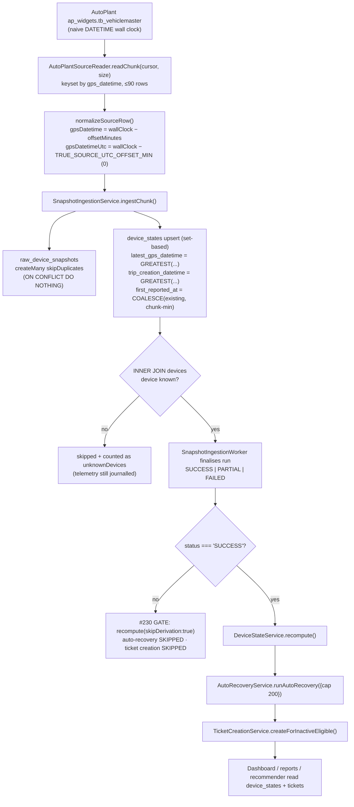
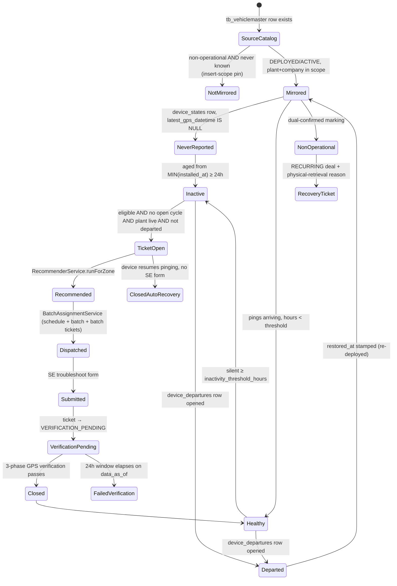
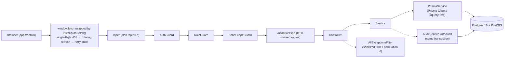
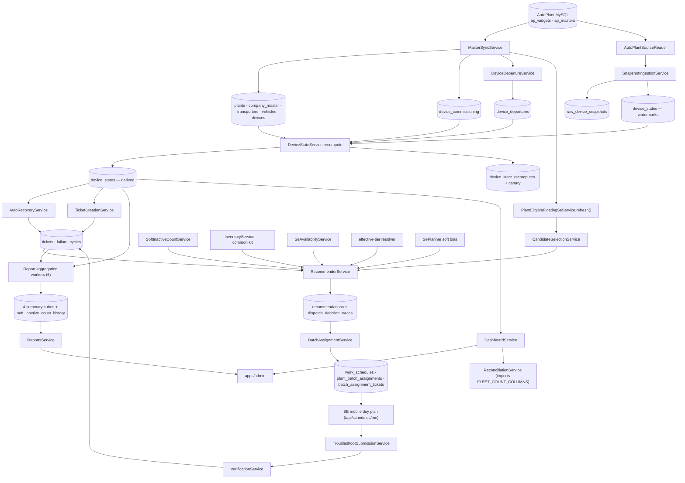

# FSM Platform — Complete Code-Level Feature & Architecture Analysis

> **Scope**: `apps/backend/` (NestJS) + `apps/admin/` (React/Vite), read-only inspection of the actual
> implementation on branch `feat/autoplant-integration`, analysis date **2026-08-12**.
>
> **Method**: every conclusion below was traced through the code (controller → service → Prisma/SQL →
> table). Where a link could not be verified from source, it is marked
> **`CONNECTION NOT VERIFIED`**, **`UNVERIFIED — CODE PATH NOT FOUND`**, **`PARTIAL`**, **`MOCK DATA`**
> or **`UNUSED/UNREFERENCED`**.
>
> **No source code, database, migration or test was modified in producing this document.**

---

## Table of contents

| Part | Section |
|---|---|
| 1 | [Project structure](#part-1--project-structure) |
| 2 | [Backend module-by-module analysis](#part-2--backend-complete-analysis) |
| 3 | [Backend API inventory](#part-3--backend-api-inventory) |
| 4 | [Database & data flow](#part-4--database--data-flow) |
| 5 | [Ingestion analysis](#part-5--ingestion-analysis) |
| 6 | [Device lifecycle](#part-6--device-lifecycle) |
| 7 | [Admin frontend analysis](#part-7--admin-frontend-complete-analysis) |
| 8 | [Frontend → backend connection map](#part-8--frontend--backend-connection-map) |
| 9 | [KPI / metric catalog](#part-9--kpi--metric-catalog) |
| 10 | [Business workflows](#part-10--business-workflows) |
| 11 | [Schedulers / jobs / workers](#part-11--schedulers--jobs--workers) |
| 12 | [Authorization](#part-12--authorization) |
| 13 | [Real data vs mock data](#part-13--real-data-vs-mock-data) |
| 14 | [Exports / reporting](#part-14--exports--reporting) |
| 15 | [Audit / observability](#part-15--audit--observability) |
| 16 | [Test coverage](#part-16--test-coverage) |
| 17 | [Architectural dependency map](#part-17--architectural-dependency-map) |
| 18 | [Implementation status](#part-18--implementation-status) |
| 19 | [Potential issues](#part-19--potential-issues) |
| 20 | [What the application currently does](#part-20--what-the-application-currently-does) |
| 21 | [Final summary](#part-21--final-summary) |

---

# PART 1 — PROJECT STRUCTURE

## 1.1 Monorepo layout

pnpm workspace (`pnpm-workspace.yaml`: `apps/*`, `packages/*`) driven by Turborepo (`turbo.json`).
Package manager pinned to `pnpm@11.7.0`, Node ≥ 20 (`package.json`).

```
fsm-platform/
├── apps/
│   ├── backend/     NestJS modular monolith  (~38,600 LOC hand-written TS, 362 .ts incl. generated)
│   ├── admin/       React 18 + Vite + TS     (~26,660 LOC, Tailwind v4, Radix, Recharts)
│   └── mobile/      React Native + Expo      (~13,456 LOC — SE field app)
├── packages/
│   └── shared/      @fsm/shared — wire contracts + SLA bands shared by all three apps (989 LOC)
├── docs/            PRD, workflow, LLD, ADRs, UI reference images, runbooks, progress reports
├── .scratch/
│   └── fsm-platform-v1/   Local markdown issue tracker (INDEX.md = build order + session log)
├── .github/workflows/ci.yml   CI: typecheck + migrate-from-zero + drift gate + 3 test suites
├── audit/, backups/, data/, patches/
├── CONTEXT.md       134 KB — the domain canon (authority #1 per CLAUDE.md)
└── CLAUDE.md        Agent operating rules
```

### Responsibility of each top-level directory

| Path | Responsibility |
|---|---|
| `apps/backend/src/` | All server code — 40 feature folders, each a Nest module or a controller/service cluster |
| `apps/backend/prisma/` | `schema.prisma` (2,591 lines, ~70 models/enums) + **77 migrations** + `migration_lock.toml` |
| `apps/backend/src/generated/prisma/` | Prisma 7.8 generated client (**gitignored** — CI regenerates; 72 model files) |
| `apps/backend/test/` | **363 test files** — 310 `*.e2e-spec.ts`, 47 `*.spec.ts`, plus fixtures/env/global-setup |
| `apps/backend/scripts/` | `run-tests.mjs`, `reset-test-db.cjs`, `stamp-build-info.mjs`, `check-schema-drift.mjs` |
| `apps/admin/src/api/` | 40 typed fetch clients — the only place the admin talks HTTP |
| `apps/admin/src/pages/` | 71 page/section components across 19 route folders |
| `apps/admin/src/components/` | Design system: `ui/`, `data/`, `charts/`, `domain/`, `overlay/`, `shell/`, `dashboard/` |
| `apps/admin/test/` | 94 vitest + Testing-Library specs |
| `apps/mobile/src/` | SE app: auth, tickets, troubleshoot/install/recovery forms, vouchers, stock, notifications |
| `packages/shared/src/index.ts` | `ROLES`, `SLA_BANDS`, `SlaBucket`, every mobile wire DTO, root-cause taxonomy |

### Explicitly **absent** infrastructure (verified by grep)

- **No Redis, no BullMQ, no message queue.** All scheduling is in-process `@nestjs/schedule` `@Cron`.
- **No S3 / object storage.** Photos are stored as `bytea` in Postgres (`media_objects.bytes`).
- **No rate limiter / throttler** anywhere in `apps/backend/src` (`grep -rn "throttl|Throttler|rateLimit"` → 0 hits).
- **No materialized-view dashboard rollup** — `DashboardService` states the LLD's `mv_zone_dashboard_rollup` + Redis cache are deferred. The one MV that *does* exist is `plant_eligible_floating_se` (migration `20260621160000`).

## 1.2 Backend module inventory (file counts, non-generated)

| Folder | Files | Role |
|---|---|---|
| `org/` | 32 | Reference data + admin config (zones, plants, companies, users, tiers, SLA, weights, coverage, territory, zone-mapping) |
| `ticketing/` | 26 | Ticket spine: creation, troubleshoot, install, recovery, non-op, auto-recovery, vehicle-unavailability, repeat escalation |
| `scheduling/` | 23 | Dispatch runs, batch assignment, overrides, intraday updates, bulk unassign, schedule closure, business sweeps |
| `ingestion/` (+`autoplant/`) | 30 | Telemetry snapshot pipeline + AutoPlant master sync + partitions + integration health |
| `reports/` | 11 | Fleet uptime, root cause, ZM scorecard, system efficiency, soft-inactive, commissioning |
| `ops-explorer/` | 10 | OH-only read-only data explorer + KPI reconciliation (feature-flagged) |
| `auth/` | 10 | JWT access tokens, Postgres credential + refresh-token stores |
| `engineers/` | 9 | SE admin CRUD, availability, leave requests, coverage |
| `me-tickets/` | 8 | SE day plan, ticket detail, forms, work history |
| `inventory/` | 7 | Van stock, common kit, warehouse stock, shadow-use |
| `vouchers/`, `recommender/`, `notifications/`, `device-state/`, `build-info/` | 6 each | — |
| `verification/`, `soft-state/`, `component-request/` | 5 each | — |
| `shared-pool/`, `media/`, `intraday/`, `devices/`, `dashboard/`, `cross-zone/`, `audit/` | 4 each | — |
| `settings/`, `roles/`, `plant-deactivation/`, `planner/`, `me/`, `exports/`, `device-departure/`, `common/guards/` | 3 each | — |
| `prisma/`, `health/` | 2 each | — |
| `zones/`, `config/`, `common/filters/` | 1 each | — |

---

# PART 2 — BACKEND COMPLETE ANALYSIS

Bootstrap chain (`src/main.ts`):

```
validateBootConfig()                      # src/config/boot-config.ts — refuses to start on weak JWT secret / bad DB URL
  → new PrismaService().onModuleInit()    # #130 preflight: L4 migration-skew → L1 runtime_lock version guard
  → NestFactory.create(AppModule, {bodyParser:false})
  → app.enableShutdownHooks()             # SIGTERM runs onModuleDestroy (Prisma $disconnect, MySQL pool end)
  → configureApp(app)                     # src/app.config.ts — /api prefix, URI versioning ['1', VERSION_NEUTRAL], CORS, 1 MB JSON cap
  → app.listen(PORT ?? 3000)
```

**Global providers** (`src/app.module.ts:197-217`) — every route inherits them:

| Provider | Class | Effect |
|---|---|---|
| `APP_FILTER` | `AllExceptionsFilter` | Sanitized 500s + correlation id; `HttpException` `{code}` contracts preserved |
| `APP_GUARD` #1 | `AuthGuard` | **Authenticated by default**; `@Public()` opts out |
| `APP_GUARD` #2 | `RoleGuard` | `@Roles(...)` allow-list |
| `APP_GUARD` #3 | `ZoneScopeGuard` | ZM clamped on `:zoneId` param / `zone_id` query |
| `APP_PIPE` | `ValidationPipe({whitelist, forbidNonWhitelisted, transform})` | DTO-classed routes only (interface-typed bodies untouched) |

**Route versioning caveat** (`app.config.ts:27-30`): `defaultVersion: ['1', VERSION_NEUTRAL]` registers
**every route at both `/api/v1/...` and `/api/...`**. The admin client and all backend e2e specs use the
unversioned form. Status: **Implemented, intentionally dual-mounted** (migration window).

---

## 2.1 `prisma/` — PrismaService

**Purpose**: single DB connection + the structural build guard.
**Files**: `prisma/prisma.service.ts`, `prisma/prisma.module.ts`.
**Key behaviour**: `onModuleInit` runs the `build-info` guard chain (L4 migration-skew → L1 runtime lock)
before any query, so **every entrypoint** (HTTP server, seed, CLI scripts) is covered.
**Status**: ✅ Implemented.

## 2.2 `build-info/` — stale-build & migration-skew guard (#130)

**Purpose**: make it impossible for a stale build to write to a newer database — the direct response to the
2026-07-19 "run-65" incident where a stale-code recompute corrupted `device_states` fleet-wide.

**Files**: `build-info.ts`, `runtime-lock.ts` (158 L), `migration-skew.ts`, `run-stamp.ts`, `boot-guard.ts`,
`runtime-lock-reset.ts`.

**Mechanism**:
- `runtime_lock` table stores `(version, fingerprint, boot_at, pid, hostname, db)`.
- A process whose `build.version` < the DB high-water mark **refuses to boot** with one fatal line
  (`runtime-lock.ts` `refuseMessage`), pointing at `npm run runtime-lock:reset` for authorized rollback.
- `warnOnly` mode for read-only tools (`autoplant:ping`, dry-runs).
- `buildStampFields()` (`run-stamp.ts`) stamps `build_version` + `build_fingerprint` onto
  `snapshot_runs`, `master_sync_runs`, `dispatch_runs`, `device_state_recomputes`.

**Consumers**: `PrismaService`, `DeviceStateService`, `SnapshotRunService`, `MasterSyncRunService`,
`DispatchRunService`, `AutoPlantHealthService`.
**Frontend**: `/build-health` page (OH only) via `GET /api/integration/health`.
**Status**: ✅ Implemented.

## 2.3 `auth/` — authentication

**Purpose**: issue/verify JWT access tokens; persist rotating refresh tokens.

**Files**: `auth.controller.ts`, `auth.service.ts`, `token.service.ts`, `prisma-user-store.ts`,
`prisma-refresh-token-store.ts`, `password-hasher.ts`, `credential-seed.ts`, `auth-fixture-seed.ts`,
`acting-context.ts`.

**Controllers** — `@Controller('auth')` + `@Public()` (whole controller):

| Method | Route | Purpose |
|---|---|---|
| POST | `/api/auth/login` | email+password → `{accessToken, refreshToken, session}` |
| POST | `/api/auth/refresh` | rotating refresh; reuse detection via `rotated_from` |
| POST | `/api/auth/logout` | revokes refresh token **and deletes the user's `device_tokens` row** (push token cleared) |

**Database**: `users` (account registry — never holds secrets), `user_credentials` (scrypt hash + salt +
per-row `password_algo`/`password_params`), `refresh_tokens` (SHA-256 hash only, `device_id`,
`revoked_reason`, `rotated_from`), `device_tokens`.

**Business logic**:
- Credentials deliberately split from `users` so a widened `SELECT` in `GET /api/org/users` or the OH
  export can never leak password material (schema doc, `schema.prisma:155-176`).
- One-active-device policy: `refresh_tokens.device_id` exists from day one; max-devices is a
  count-at-login query, **not** a migration.
- **Only the token hash is stored** — a DB read can never yield a usable token.

**Status**: ✅ Implemented (Postgres-backed; the in-memory stores referenced in `INDEX.md` row 3 are gone —
`auth.module.ts` provides only `PrismaUserStore` / `PrismaRefreshTokenStore`).
**Gap**: 🔴 **no rate limiting / brute-force protection** on `/auth/login` or `/auth/refresh` (verified by grep).

## 2.4 `common/` — guards, filters, decorators, helpers

| File | Responsibility |
|---|---|
| `guards/auth.guard.ts` | Bearer verify → `request.user` = `AccessTokenClaims` |
| `guards/role.guard.ts` | `@Roles` allow-list; **no `@Roles` ⇒ unrestricted by role** |
| `guards/zone-scope.guard.ts` | ZM clamp; reads only `params.zoneId` and `query.zone_id` |
| `filters/all-exceptions.filter.ts` | Global sanitized error envelope |
| `decorators/` | `@Public`, `@Roles`, `@CurrentUser`, `@CurrentActor` |
| `ist-day.ts` | `istDate(now)` — the IST business-day boundary used by dispatch/planner/work-history |
| `request-actor.ts` | `RequestActor` (actor id + role + acted-as + acting zone) |
| `transition-or-conflict.ts` | Optimistic-concurrency helper (version-guarded state transitions) |

⚠ **`ZoneScopeGuard` only inspects `zoneId` (param) and `zone_id` (query).** Endpoints that accept
`?zoneId=` as a **query** string (e.g. `/api/dashboard/company-plant-overview`, `/activity-trend`,
`/zone-operations`, `/api/devices`) are **not** covered by it — each of those services re-applies the ZM
clamp itself (documented at `dashboard.service.ts:669-672`). This is correct today but is a
**convention, not a structural guarantee**.

## 2.5 `settings/` — system settings registry

**Files**: `settings.service.ts` (134 L), `settings.controller.ts`.
**Endpoints**: `GET /api/settings`, `PUT /api/settings/:key` — **OPERATIONS_HEAD only**.

**Seeded defaults** (`SETTINGS_DEFAULTS`, seeded idempotently in `onModuleInit`, never overwriting):

| Key | Default | Consumed by |
|---|---|---|
| `inactivity_threshold_hours` | 24 | `DeviceStateService.recompute` |
| `viewed_soft_state_timeout_minutes` | 90 | `SoftStateService` |
| `onsite_stale_warning_hours` | 2 | soft-state stale warnings |
| `troubleshoot_started_stale_warning_hours` | 2 | soft-state stale warnings |
| `plant_cluster_multiplier` | 1.25 | `RecommenderService.plantClusterMultiplier()` |
| `telemetry_retention_days` | 7 | `PartitionMaintenanceService` |
| `eligibility_mode` | `'pgi'` | `DeviceStateService` (`pgi` \| `all-deployed`) |
| `recompute_canary_threshold_pct` | 5 | `DeviceStateService.recordRecomputeAndCanary` |
| `dispatch_cron` | (bootstrapped from env) | `DispatchScheduleService` — **delegated**, see below |

`SPECIALISED_SETTING_WRITERS` blocks generic writes to `dispatch_cron`, returning
`{result:'DELEGATED', endpoint:'PUT /api/schedules/dispatch-schedule'}` — because storing the value is only
half the job (the live cron job must be re-registered).

**Frontend usage**: 🔴 **UNUSED/UNREFERENCED by `apps/admin`.** `grep -rn "/settings"` in `apps/admin/src`
returns only route/nav/help-text hits. The `SettingsPage` tabs are Zones/Plants/Users/Companies/SE
Coverage/SLA Rules/Scoring Weights/Common Kit/Dispatch Schedule/Access — all backed by `/api/org/*` and
`/api/schedules/dispatch-schedule`. **No UI edits the `system_settings` registry.**
**Status**: 🟡 Implemented backend, **no frontend consumer** (8 of 9 operational knobs are DB/API-only).

## 2.6 `audit/` — audit trail

**Files**: `audit.service.ts` (77 L), `audit-trail.service.ts`, `audit-trail.controller.ts`.
**Endpoint**: `GET /api/audit-trail/tickets/:ticketId` — manager roles.
**Core API**: `AuditService.withAudit(entry, fn)` runs the mutation **and** the `audit_logs` insert in
**one transaction** (ADR-0025). `auditActor(actor)` is the single flattening point for
`{actorId, actorRole, actedAsRole, actingZone}`.
**Database**: `audit_logs` — `@@index([entityType, entityId])`, `@@index([actedAsRole, actingZone, createdAt])`.
**Consumers**: settings, org services, override engine, bulk-unassign, non-op, recovery, install,
device-departure, plant-deactivation, auto-recovery, verification, vouchers, tier overrides.
**Frontend usage**: 🔴 `grep "/audit-trail"` in `apps/admin/src` → **0 hits**. **UNUSED by admin.**
**Status**: 🟡 Backend implemented and heavily written to; read endpoint has no consumer.

## 2.7 `org/` — organisation & configuration (32 files)

**Purpose**: all Operations-Head-owned reference data plus the FSM-owned translation layers that keep
AutoPlant from clobbering operational decisions.

| Service | Table(s) | Notes |
|---|---|---|
| `zones.service.ts` | `zones` | Case-insensitive unique name (migration `20260707120000`) |
| `plants.service.ts` | `plants` | Reads `source_*` mirror columns |
| `companies.service.ts` | `company_master` | `company_tier` + `company_priority_rank` are **FSM-owned**, never in the sync update set |
| `users.service.ts` | `users` | OH-only CRUD; never touches `user_credentials` |
| `tiers.service.ts` | `tiers` | Canonical tier list + `rank` as data (Platinum=1) |
| `tier-overrides.service.ts` + `effective-tier.ts` | `company_tier_overrides` | Scoped, expiring CSM/ZM tier override; **stacking allowed**, newest-wins by `(created_at DESC, id DESC)`; resolver predicates on `expiresAt`, *never* the swept `status` flag |
| `tier-override-expiry.service.ts` | same | Hourly sweep flips `ACTIVE→EXPIRED` (truthfulness only, not correctness) |
| `sla-rules.service.ts` | `sla_rule_config` | Scope + key → submit/verify/escalate minutes |
| `scoring-weights.service.ts` | `priority_rule_config` | Versioned weight sets (`weight_set_ref`, `active`) |
| `common-kit.service.ts` | `common_kit_definition` | Recommender hard-filter input |
| `se-coverage.service.ts` | `se_coverage` | DEDICATED / MULTI_PLANT |
| `se-territory.service.ts` | `engineer_territory_coverage` | FLOATING (state/region/district; polygon column reserved) |
| `geography.service.ts` | `regions`, `districts` | State/region/district selectors |
| `plant-eligible-floating-se.service.ts` | MV `plant_eligible_floating_se` | `refresh()` called post-master-sync (best-effort) |
| `plant-eligibility-refresh-scheduler.service.ts` | same | `@Cron` periodic MV backstop |
| `zone-mapping.service.ts` | `zone_mappings`, `plant_zone_overrides` | The **R6 translation layer** — see §5 |
| `org-seed.ts` | many | Seed reference data |

**Anti-drift guarantee** (structural, `master-mapping.ts` + `master-sync.service.ts:118`): the pure mapping
layer **excludes every FSM-owned column from its `update` set**, so a re-sync can never clobber
`ops_override`, tier, priority rank, the operational `zone_id`, or `deal_type`.

**Status**: ✅ Implemented.

## 2.8 `ingestion/` — see [Part 5](#part-5--ingestion-analysis) for the full pipeline

Module wiring (`ingestion.module.ts`) is worth stating up front because it decides what runs at all:

- `SOURCE_READER` → real `AutoPlantSourceReader` **only when `readAutoPlantMysqlConfig()` returns non-null**
  (i.e. both `AUTOPLANT_MYSQL_DB_WIDGETS` and `..._DB_MASTERS` set); otherwise `InMemorySourceReader([])`
  — an **empty** reader, so dev/test/CI ingest nothing.
- `MASTER_SYNC_SOURCE` → real `AutoPlantMasterSource` or `EMPTY_MASTER_SOURCE` (four no-op reads).
- `IntegrationSchedulerService` is **provided via `useFactory` with an explicit `inject:` array**
  (this is why it never suffered the `#218` erasure defect).
- `ScheduleModule.forRoot()` is registered **here only** — its explorer discovers every `@Cron` in the app.

## 2.9 `device-state/` — the derived fleet state

**Files**: `device-state.service.ts` (260 L), `sla-bucket.ts`, `eligibility.ts`, `departure-invariant.ts`,
`recompute-canary.ts`.

`DeviceStateService.recompute(now, trigger, {skipDerivation})` — two set-based statements, no telemetry scan:

1. `INSERT INTO device_states (device_id, computed_at) SELECT … FROM devices ON CONFLICT DO NOTHING`
2. One `UPDATE … FROM derived dr` computing, **inside a transaction that also runs
   `assertDepartureInvariant(tx)`**:

```sql
WITH install AS (SELECT device_id, MIN(installed_at) AS installed_at
                   FROM device_commissioning WHERE installed_at IS NOT NULL GROUP BY device_id),
derived AS (SELECT ds.device_id,
   CASE WHEN ds.latest_gps_datetime IS NOT NULL
          THEN GREATEST(0, EXTRACT(EPOCH FROM (now - ds.latest_gps_datetime))/3600.0)
        WHEN ic.installed_at IS NOT NULL
          THEN GREATEST(0, EXTRACT(EPOCH FROM (now - ic.installed_at))/3600.0)
        ELSE NULL END AS hours,
   EXISTS (SELECT 1 FROM device_departures dd
            WHERE dd.device_id = ds.device_id AND dd.restored_at IS NULL) AS departed
   FROM device_states ds LEFT JOIN install ic ON ic.device_id = ds.device_id)
UPDATE device_states ds SET
  inactivity_hours    = dr.hours,
  is_departed         = dr.departed,
  is_inactive         = (NOT dr.departed AND dr.hours IS NOT NULL AND dr.hours >= <threshold>),
  sla_bucket          = CASE WHEN dr.departed THEN NULL ELSE <slaBucketCaseSql('dr.hours')> END,
  eligible_for_uptime = (NOT dr.departed AND <eligibilityBase> AND NOT EXISTS (
                           SELECT 1 FROM non_operational_markings n
                            WHERE n.device_id = ds.device_id AND n.state::text IN ('CONFIRMED','ACTIVE'))),
  vehicle_id = v.vehicle_id, plant_id = v.plant_id, company_id = v.company_id,
  transporter_id = v.transporter_id, computed_at = now
FROM derived dr JOIN devices d ON d.device_id = dr.device_id
LEFT JOIN vehicles v ON v.vehicle_id = d.current_vehicle_id
WHERE ds.device_id = dr.device_id
```

Three decisions worth naming:

- **`skipDerivation`** (#230): when the telemetry read did **not** finalise `SUCCESS`, step 2 is skipped
  entirely. `computed_at` deliberately lags — "stale-but-true rather than fresh-and-fabricated". The
  incident it prevents is stated in the code: on 2026-08-10 run 153 aborted after 2,610 of 27,032 devices,
  the derivation aged the unseen 24,422 into `is_inactive`, and **3,439 Failure Cycles** were opened.
- **Never-reported devices are aged from install date** (#223): `MIN(device_commissioning.installed_at)`,
  not MAX (because `tb_vehiclemaster` rewrites fitment in place — 10,565 devices have had
  `first_installed_dt` moved). The 24 h grace window falls out of the existing `hours >= threshold` test.
- **`eligibility_mode`** (`eligibility.ts`): `'pgi'` = active PGI ≤ 15 days (`pgi_history`), the canonical
  gate; `'all-deployed'` = interim proxy on `vehicles.status IN ('ACTIVE','DEPLOYED')` while the SAP PGI
  feed is unbuilt. Non-Op exclusion applies in **both** modes. Junk values fall back to `pgi` (never widens).

`slaBucketCaseSql(hoursCol)` (`sla-bucket.ts:41`) **projects the SQL CASE from the same `SLA_BANDS` array**
(`@fsm/shared`) the TS classifier loops over, so SQL and TS bucket boundaries cannot drift. Bucket names are
regex-validated (`/^[A-Z_]+$/`) before interpolation.

`recordRecomputeAndCanary` appends a `device_state_recomputes` row (`eligible/inactive/departed/total` +
build stamp + trigger `api|cron|autoplant-sync|test`) and **warns loudly** when the eligible-count swing
between consecutive rows exceeds `recompute_canary_threshold_pct` (default 5%).

**Status**: ✅ Implemented.

## 2.10 `device-departure/` — device deployment lifecycle (#128)

**Files**: `device-departure.service.ts` (370 L), `stand-down-export.ts`.

**Problem solved**: master sync previously read `deployment_status IN ('DEPLOYED')` only, so a vehicle that
*left* the deployed fleet was never written again — its mirror froze at `'DEPLOYED'` forever. Measured
2026-07-17: **all 20,856 FSM vehicles read DEPLOYED against 15,652 actually deployed**, and **739 of 1,738
devices on live dispatch batches (42.5%) were UNDEPLOYED at source**.

**Two detection paths, deliberately unequal in trust**:

| Reason | Trust | Handling |
|---|---|---|
| `SOURCE_STATUS` | Observed | Applied unconditionally |
| `ABSENT_FROM_READ` | Inferred | Only meaningful **inside `syncedPlantIds`**; aborted entirely if the pass would mark > `DEFAULT_MAX_ABSENCE_RATIO` (**0.1**) of the in-scope fleet |

Restores run the same observation backwards: a device seen operational again stamps `restored_at` and
resumes automatically. Rows are **never deleted** — the history *is* the audit trail.
A departure cancels the device's open tickets (`TERMINAL_TICKET_STATUSES` exported so `stand-down-export.ts`
selects the identical set rather than respelling the predicate).

**Status**: ✅ Implemented. UI parity was split to `#129`.

## 2.11 `ticketing/` (26 files) — the ticket spine

### `ticket-creation.service.ts`

`createForInactiveEligible(now)` — the raw-telemetry→open-ticket step.

Candidate predicate (`prisma.deviceState.findMany`):
```
isInactive: true, eligibleForUptime: true, hasOpenFailureCycle: false,
device: { departures: { none: { restoredAt: null } } },       // ← re-reads the LEDGER, not is_departed
plantId: { not: null, notIn: <active plant_deactivations> },
companyId: { not: null }
```
The departure filter deliberately re-reads `device_departures` rather than trusting the derived
`is_departed` flag — that flag is exactly what the run-65 incident cleared fleet-wide.

Per candidate, in **one transaction**: create `failure_cycles` (state `OPEN` or `REPEAT`) → create `tickets`
(`work_type=TROUBLESHOOT`, `status=OPEN`, `company_tier` = **effective tier**, i.e. zone-scoped override or
global) → append `ticket_events(null → OPEN)` → set `device_states.has_open_failure_cycle = true`.
A `P2002` unique violation (invariant **I1**: one active cycle per device) silently skips that device.

**Repeat detection** (ADR-0021): a prior `VERIFIED` cycle closed within **24 h** ⇒ `repeatFailure = true`,
`previousFailureCycleId` chained. "Repair completion" is **GPS-verified closure**, not form submission.

### `auto-recovery.service.ts`

`runAutoRecovery({maxClosures, zoneId, dryRun, thresholds})` — the *auto-recovery pre-check*.

- **Called from `IntegrationSyncService`, not from a `@Cron`** — position in the pipeline is load-bearing
  (see §5.4). Code notes it had **no production caller for eleven months**, which is why 11,042 closable
  tickets accumulated.
- Scan: `workType=TROUBLESHOOT, status=OPEN, device.state.isInactive = false` (i.e. **currently healthy**),
  ordered `failureCycle.openedAt ASC` so a capped pass is a deterministic prefix.
- Evidence (`recovery-criteria.ts`): **≥3 pings, ≥15 min span, ≥60 min stability** — the binding clause is
  `spanMinutes >= max(minSpan, minStability)`.
- Default per-pass cap **200** (`DEFAULT_AUTO_RECOVERY_MAX_PER_PASS`); `AUTO_RECOVERY_MAX_PER_PASS=unlimited`
  removes it. Defaulted-not-opt-in deliberately, so enabling telemetry is not an unbounded transaction storm.
- `closeAsAutoRecovery` writes **seven things in one transaction**: ticket (`CLOSED_AUTO_RECOVERY` +
  `closure_type=AUTO_RECOVERY_CLOSE` + `closed_at` + `closure_reason`), cycle → `VERIFIED`, `ticket_events`,
  `device_states.has_open_failure_cycle=false`, **soft-state resolution**, **batch detachment**
  (`batch_assignment_tickets.removed_at`), and an `audit_logs` row.

### Other `ticketing/` services

| Service | Lifecycle owned | Key rules |
|---|---|---|
| `troubleshoot-submission.service.ts` (336 L) | SE form submit | Idempotent on `(se_id, client_submission_id)`; `OPEN→VERIFICATION_PENDING`, cycle `OPEN→SUBMITTED`; resolves the SE's soft states; **business 409** returns the winning SE + records SHADOW_USE inventory |
| `install.service.ts` (405 L) | INSTALL create | Single + CSV bulk (`INSTALL_CSV_MAX_ROWS`, default **1000**); per-row error codes; `install_batch_id` shared across a CSV |
| `install-lifecycle.service.ts` (360 L) | `REQUESTED→SCHEDULED→ON_SITE→FITTED→ACTIVATED→CLOSED\|FAILED_ACTIVATION` | `INSTALL_ACTIVATION_WINDOW_MS` = 24 h; auto-verification sweep watches for first valid ping |
| `recovery.service.ts` (430 L) | `REQUESTED→SCHEDULED→ON_SITE→COLLECTED→RECEIVED_AT_WAREHOUSE→CLOSED` | `STALL_DAYS`=14; manual closure types; `UnableToCollectReason` routes to ZM decision queue |
| `non-operational.service.ts` (514 L) | Dual confirmation | 90-day default window (365 for `VEHICLE_SCRAPPED`/`VEHICLE_SOLD`); one-time customer token (TTL 30 d); OH override-confirm after **7 days**; CONFIRMED auto-closes in-flight tickets and auto-creates a RECOVERY ticket for RECURRING devices with a physical-retrieval reason |
| `vehicle-unavailability.service.ts` (224 L) | Dual SLA clocks | Filing pauses the primary SLA (`VEHICLE_UNAVAILABLE`); the **secondary (never-pausing) clock is manager-only** |
| `repeat-escalation.service.ts` (74 L) | Chronic devices | **3 repeat episodes in 7 days** ⇒ cycle+ticket → `ESCALATED`; escalation does *not* close the episode |
| `ticket-query.service.ts` | Manager reads | `limit = min(limit ?? 100, 500)` — **hard cap 500 rows** |
| `ticket-no.ts` | Display label | `TCK-` + `ticket_no` (global monotonic sequence), never a FK |
| `deferral.ts` | `notDeferredOn(day)` | `deferred_until IS NULL OR deferred_until <= day` |

**Status**: ✅ Implemented across the board.

## 2.12 `recommender/` — SE selection & scoring

**Files**: `recommender.service.ts` (612 L), `candidate-selection.service.ts`, `hard-filters.ts`,
`scoring.ts`, `canonical-sort.ts`.

Per zone, `runForZone(zoneId, {now, runId})`:

1. **Mode** ← `SoftInactiveCountService.modeForZone` → `DEFICIT | PREVENTIVE`.
2. **Tier overrides** ← one batched `resolveActiveOverrides(prisma, [zoneId], now)`.
3. **Ticket pool**: `TROUBLESHOOT / OPEN / UNASSIGNED`, `notDeferredOn(istDate(now))`, plant in zone and
   not deactivated, device with no active departure.
4. **Canonical sort** (`canonicalSort`) by `(companyTier, deviceBucket, companyPriorityRank, …)`.
5. In **PREVENTIVE** mode only, append the **Install backlog** (`installSort`: tier → rank → oldest target
   date). Installs are deliberately *not* departure-filtered — "not currently deployed" is an install's
   normal starting state.
6. **Precedence + hard filters** per ticket: `orderedCandidatesForPlant(plantId)` returns Dedicated →
   Multi-Plant → Floating; `applyHardFilters` drops on the **first** failing reason:
   `VEHICLE_ON_TRIP → SE_UNAVAILABLE → OVER_CAPACITY → COMMON_KIT_INCOMPLETE → COMPONENT_UNAVAILABLE`.
   **SE activity-ping staleness is explicitly NOT a hard filter** (CONTEXT §3/§16).
7. **SE Planner soft bias** (ADR-0022): among passed candidates prefer the planner-named SE, else `passed[0]`.
8. **Scoring** (`scoring.ts`):
   ```
   baseScore = w_rank·rankScore(letter)            // A=1.0, B=0.9, … clamped [0,1]
             + w_urgency·dispatchUrgency           // bucket index / 7  → 0..1
             − w_repeat_penalty·repeat
             + w_repeat_bonus·repeat               // PREVENTIVE only
             + w_device_age·min(1, hours/168)      // PREVENTIVE only
             + w_distance·(1/(1+km))               // distance is deferred-null today
   score = baseScore × clusterMultiplier           // 1 for the plant's seed ticket, else 1.25 (setting)
   ```
9. **Persist**: one `recommendations` row per ticket (`SUGGESTED` or `UNASSIGNABLE` with
   `reason:'NO_ELIGIBLE_SE'`), plus a bounded `dispatch_decision_traces` row when `runId` is supplied
   (per-filter drop **counts**, chosen SE's precedence context, top-5 runners-up).
10. **Capacity**: `committedDayLoad(day)` seeds the counter from the SE's **already-committed** day plan
    across *every* zone and prior run today (live schedules include `OVERRIDDEN` — #153).
11. `clearFinalizedOrphans(zoneId)` deletes `SUGGESTED` recs owned by a finalized/null run before
    re-suggesting (#126 zone-wedge fix); a `P2002` against a still-`RUNNING` run's rec **skips** rather than throws.

**Known in-code TODO** (`recommender.service.ts:404-408`): when distance scoring lands, `scoreCandidate`
**must** receive per-candidate features — otherwise runner-up scores become misleadingly equal to the winner's.

**Status**: ✅ Implemented; distance-from-previous-stop scoring is 🔴 **deferred** (`scoreDegenerate: true`).

## 2.13 `scheduling/` (23 files) — dispatch & day plans

| Service | Responsibility |
|---|---|
| `dispatch-run.service.ts` (344 L) | `runForActiveZones(now, opts)` → per-zone loop; creates the `dispatch_runs` ledger row `RUNNING`, captures `config_snapshot` **at run start**, finalises `SUCCESS/PARTIAL/FAILED`; returns a discriminated union `{result:'RAN'} \| {result:'CONFLICT', inFlight}` |
| `batch-assignment.service.ts` (281 L) | Turns `SUGGESTED` recs into a dispatched Day Plan: one `ACTIVE` `work_schedules` row per SE, one `AUTO_ASSIGNED` `plant_batch_assignments` per plant, `batch_assignment_tickets` rows. **No approval gate** (ADR-0007/0019 superseded). #127: re-uses an SE's existing schedule and **appends** run-stamped batches |
| `dispatch-zone-lock.ts` | Per-zone Postgres advisory lock |
| `override.service.ts` (568 L) | ZM override engine — remove / defer / reorder / swap / split / reassign; each flips batch+schedule to `OVERRIDDEN` with a mandatory reason, re-points the day plan, audits in-transaction, fires a push |
| `same-day-update.service.ts` (142 L) | ZM manual same-day add/remove/reorder, tagged `MANUAL_ZM_UPDATE`; the Intra-day Queue is a **view over `audit_logs`** (no new model) |
| `bulk-unassign.service.ts` (474 L) | OH mid-day rebalance; **HMAC-signed preview token** (10-min TTL) so an execute can only act on a preview the server produced; history read from `BULK_UNASSIGN_ZONE` audit rows |
| `dispatch-schedule.service.ts` (159 L) | `system_settings.dispatch_cron` is the source of truth; `setCron` **validates → persists → re-registers the live job** (`setTime`), so a change takes effect without a restart and an invalid expression never lands |
| `schedule-closure-scheduler.service.ts` (173 L) | Daily 04:00 UTC: closes yesterday's schedules `COMPLETED`/`PARTIAL` under the dispatch advisory lock (#147) |
| `dispatch-scheduler.service.ts` | The daily `@Cron` tick (Asia/Kolkata) |
| `business-sweep-scheduler.service.ts` (206 L) | 11 business `@Cron`s — see [Part 11](#part-11--schedulers--jobs--workers) |
| `day-plan-query.service.ts`, `zm-schedule-query.service.ts`, `dispatch-transparency-query.service.ts` | Read sides |
| `schedule-status.ts` | `liveScheduleFilter()` = `status IN (ACTIVE, OVERRIDDEN)` |
| `day-plan-notifier.ts`, `soft-state-conflict.ts` | Notification + ON_SITE-conflict seams |

**Status**: ✅ Implemented.

## 2.14 `dashboard/`, `reports/`, `ops-explorer/`

Covered in depth in [Part 9](#part-9--kpi--metric-catalog) and [Part 14](#part-14--exports--reporting).
Summary:

- `dashboard/dashboard.service.ts` (1,085 L) — **one exported SQL fragment `FLEET_COUNT_COLUMNS`** from
  which every fleet count on every surface is derived. Also `zoneOperations`, `criticalQueue`,
  `actionRequired`, `activityTrend`, `fleetComposition`, `fleetDirectory`.
- `dashboard/operating-mode.controller.ts` — `GET /api/dashboard/operating-mode` (Issue 136 read seam).
- `reports/` — 5 aggregation workers writing pre-computed cubes + `reports.service.ts` (833 L) reading them.
- `ops-explorer/` — 11 datasets, generic query engine, lineage layer, KPI reconciliation panel;
  **double-gated** (OH role **and** `OPS_EXPLORER_ENABLED`; disabled ⇒ **404**, not 403).

## 2.15 Remaining modules (condensed)

| Module | Purpose | Status |
|---|---|---|
| `devices/` | Device master + Device Detail list (`device.service.ts` 391 L, `device-detail.service.ts` 194 L): paged list with search/sort/status/bucket/zone/company/plant filters, per-device failure-cycle history, lifetime downtime trend, OH-only `deal_type` tagging | ✅ |
| `verification/` (353 L) | Three-phase GPS verification: Phase 1 = first ping within ±500 m of the SE's form GPS (skipped when `presence_source=NONE`), Phase 2 = continued pinging; 24 h window; **reads `snapshot_runs.data_as_of`** so a stale telemetry feed cannot fail a submission (#148 — now fixed, contrary to `INDEX.md`) | ✅ |
| `intraday/` (545 L) | System CRITICAL/HIGH_CRITICAL insertions + SE acceptance: 10-min `ACCEPTANCE_TIMEOUT_MIN`, `MAX_RETRIES`=3, reroute chain in `retry_chain`, then `ESCALATION_REQUIRED` | ✅ |
| `cross-zone/` (380 L) | Platinum auto-escalation (**60 min** CRITICAL+ unassigned / **240 min** OPEN unassigned) + ZM manual flag; CSM/OH approve/deny/defer; ZM re-escalate to OH | ✅ |
| `shared-pool/` | SE self-serve pool of open unassigned tickets at covered plants (partial index `WHERE status='OPEN' AND assignment_state='UNASSIGNED'`) | ✅ |
| `inventory/` | Van stock, common-kit completeness, component-blocked queue, zone warehouse stock (WM manual set/adjust), shadow-use reconciliation | ✅ (auto replenishment 🔴 future) |
| `component-request/` | `REQUESTED→APPROVED\|REJECTED→SHIPPED→RECEIVED`; raised automatically when a troubleshoot form sets `component_unavailable`; pauses the primary SLA | ✅ |
| `engineers/` | SE directory CRUD, coverage, activity status, availability windows, leave-request approval | ✅ |
| `planner/` | ZM plant-visit intent grid (`se_planner`), consumed as a **soft bias** only | ✅ |
| `vouchers/` | Expense vouchers `DRAFT→SUBMITTED→ZM_REVIEW→APPROVED\|REJECTED\|NEEDS_CLARIFICATION→PAID`; OH monthly Finance export + multi-select Mark PAID | ✅ |
| `media/` (51 L) | Photo upload/serve; **Postgres `bytea`** behind an opaque `media_id`; slot-bearing contract (`MediaKind` × `MediaSlot`) shipped from day one | ✅ (pilot storage) |
| `notifications/` | In-app always fires; `NotificationChannelGateway` is the **external seam** — default `LoggingChannelGateway` returns `UNAVAILABLE` | 🟡 **Seam only** |
| `soft-state/` | `VIEWED` (timeout) / `ON_SITE` / `TROUBLESHOOT_STARTED` (explicit resolution only); SE activity ping | ✅ |
| `roles/` | `role_unavailability` + the strict ZM→CSM→OH backup cascade; CSM approval-share report | ✅ |
| `plant-deactivation/` | OH marks a plant retired; devices leave eligibility/ticketing/dashboards/dispatch; fully reversible | ✅ |
| `exports/` | OH entity-mapping CSV, **keyset-paged (2,000/page) and streamed** | ✅ |
| `me/`, `me-tickets/` | SE session profile, day plan, ticket detail, forms, work history (`#175`) | ✅ |
| `health/` | `GET /api/health` (liveness, no deps) + `/health/ready` (DB reachable) | ✅ |

---

# PART 3 — BACKEND API INVENTORY

Global prefix `/api`; every route also mounted at `/api/v1` (`app.config.ts`).
**Auth column**: `Bearer` = authenticated (global `AuthGuard`); `Public` = `@Public()`.
**FE** column: `admin` = consumed by `apps/admin`, `mobile` = consumed by `apps/mobile`,
`—` = **UNUSED/UNREFERENCED by either client** (based on repository grep of `apps/admin/src` and
`apps/mobile/src`).

## 3.1 Auth, session, health

| Method | Route | Controller → Service | Roles | Tables | FE |
|---|---|---|---|---|---|
| POST | `/auth/login` | `AuthController` → `AuthService`, `TokenService`, `PrismaUserStore` | Public | `users`, `user_credentials`, `refresh_tokens` | admin, mobile |
| POST | `/auth/refresh` | ″ → `PrismaRefreshTokenStore` | Public | `refresh_tokens` | admin, mobile |
| POST | `/auth/logout` | ″ → + `DeviceTokenService` | Public | `refresh_tokens`, `device_tokens` | admin, mobile |
| GET | `/me` | `MeController` → `MeProfileService` | Bearer (any) | `users`, `engineer_master`, `zones` | admin, mobile |
| GET | `/health` | `HealthController` | Public | — | — (ops probe) |
| GET | `/health/ready` | ″ → `HealthService` | Public | (DB ping) | — (ops probe) |

## 3.2 Dashboard (`DashboardController`, `OperatingModeController`)

All `@Roles('ZONAL_MANAGER','CENTRAL_SERVICE_MANAGER','OPERATIONS_HEAD')`; ZM zone-clamped **in the service**.

| Method | Route | Service method | Tables | FE |
|---|---|---|---|---|
| GET | `/dashboard/zone-overview` | `zoneOverview` | `device_states`, `plants`, `zones`, `users`, `plant_deactivations` | admin |
| GET | `/dashboard/fleet-summary` | `fleetSummary` | + `master_sync_runs`, `snapshot_runs` | admin |
| GET | `/dashboard/fleet-directory` | `fleetDirectory` | + `company_master` | admin |
| GET | `/dashboard/company-plant-overview?companyId&plantId&zoneId` | `companyPlantOverview` | `device_states`, `plants`, `zones`, `company_master` | admin |
| GET | `/dashboard/zone-operations?zoneId&status` | `zoneOperations` | `tickets`, `device_states`, `plants`, `zones`, `batch_assignment_tickets`, `plant_batch_assignments` | admin |
| GET | `/dashboard/critical-queue` | `criticalQueue` | `tickets`, `device_states`, `plants`, `zones`, `company_master` | admin |
| GET | `/dashboard/action-required` | `actionRequired` | `failure_cycles`, `tickets`, `plants`, `zones` | admin |
| GET | `/dashboard/fleet-composition` | `fleetComposition` | as fleet-summary | **—** |
| GET | `/dashboard/activity-trend?range&zoneId` | `activityTrend` | `tickets`, `soft_inactive_count_history`, `device_states` | admin |
| GET | `/dashboard/operating-mode?zoneId` | `SoftInactiveCountService.operatingModes` | `zones`, `plants`, `device_states` | admin |

## 3.3 Tickets, devices, verification, soft state

| Method | Route | Controller → Service | Roles | Tables | FE |
|---|---|---|---|---|---|
| GET | `/tickets?status&workType&companyId&plantId&plant&q&assignmentState&bucket&limit&offset` | `TicketsController` → `TicketQueryService.list` (**cap 500**) | ZM/CSM/OH | `tickets`, `device_states`, `plants`, `zones`, `company_master` | admin |
| GET | `/tickets/:id` | ″ `getById` | ZM/CSM/OH | + `ticket_events`, `failure_cycles` | admin |
| GET | `/tickets/:id/forms` | ″ `formsForTicket` | ZM/CSM/OH | `troubleshooting_submissions` | admin |
| POST | `/tickets/:id/auto-recovery-close` | ″ → `AutoRecoveryService.manualClose` | ZM/CSM/OH | `tickets`, `failure_cycles`, `ticket_events`, `audit_logs`, `soft_states`, `batch_assignment_tickets` | admin |
| POST | `/tickets/:id/troubleshoot` | `TroubleshootController` → `TroubleshootSubmissionService` | SE | `troubleshooting_submissions`, `tickets`, `failure_cycles`, `soft_states`, `inventory_transactions`, `component_request` | mobile |
| POST | `/tickets/:id/soft-state` | `SoftStateController` | SE | `soft_states` | mobile |
| POST | `/me/activity-ping` | ″ | SE | `engineer_master.last_activity_at` | mobile |
| GET | `/devices?search&limit&offset&sort&status&bucket&zoneId&companyId&plantId&criticalPlus` | `DevicesController` → `DeviceService.listDevices` | ZM/CSM/OH | `device_states`, `devices`, `vehicles`, `plants`, `zones`, `company_master`, `tickets`, `plant_batch_assignments` | admin |
| GET | `/devices/filter-options` | ″ `filterOptions` | ZM/CSM/OH | `zones`, `company_master` | admin |
| GET | `/devices/:deviceId` | ″ `getDevice` | ZM/CSM/OH | `devices`, `device_states` | admin (non-op page) |
| GET | `/devices/:deviceId/cycles` | `DeviceDetailService.deviceCycles` | ZM/CSM/OH | `failure_cycles`, `troubleshooting_submissions`, `verification_runs`, `component_request`, `tickets` | admin |
| GET | `/devices/:deviceId/downtime-trend` | ″ `downtimeTrend` | ZM/CSM/OH | `device_downtime_summary_monthly`, `root_cause_summary_monthly` | admin |
| PATCH | `/devices/:deviceId/deal-type` | ″ `setDealType` | **OH** | `devices`, `audit_logs` | admin |
| GET | `/verification/review` | `VerificationController` → `VerificationQueryService` | ZM/CSM/OH | `verification_runs`, `tickets` | admin |
| POST | `/verification/:ticketId/escalate` | ″ | ZM/CSM/OH | `tickets`, `ticket_events`, `audit_logs` | admin |
| POST | `/verification/:ticketId/mark-auto-recovery` | ″ | ZM/CSM/OH | as auto-recovery close | admin |
| GET | `/verification/fraud-flags` | ″ | ZM/CSM/OH | `verification_runs` | **—** |
| GET | `/tickets/:id/verification` | ″ | SE + managers | `verification_runs` | admin, mobile |

## 3.4 Scheduling / dispatch / batches

| Method | Route | Service | Roles | FE |
|---|---|---|---|---|
| GET | `/schedules` | `ZmScheduleQueryService` | ZM/CSM/OH | admin |
| GET | `/schedules/engineers` | ″ | ZM/CSM/OH | admin |
| GET | `/schedules/:engineerId` | ″ | ZM/CSM/OH | admin |
| GET | `/schedules/me` | `DayPlanQueryService` | **SE** | mobile |
| POST | `/schedules/assign` | `OverrideService` | ZM/CSM/OH | admin |
| POST | `/schedules/assign-plants` | ″ `assignPlants` | ZM/CSM/OH | admin |
| GET/PUT | `/schedules/dispatch-schedule` | `DispatchScheduleService` | **OH** | admin |
| POST | `/schedules/dispatch-run` | `DispatchRunService.runForActiveZones` | OH/CSM | admin |
| GET | `/schedules/dispatch-run/in-flight` | ″ | OH/CSM | admin |
| POST | `/schedules/bulk-unassign` | `BulkUnassignService` (preview + execute) | **OH** | admin |
| GET | `/schedules/bulk-unassign/history` | ″ | **OH** | admin |
| GET | `/batches/:batchId` | `DispatchTransparencyQueryService` | ZM/CSM/OH | admin |
| POST | `/batches/:id/override` | `OverrideService` | ZM/CSM/OH | admin |
| GET | `/dispatch-runs?limit` | `DispatchTransparencyQueryService` | ZM/CSM/OH | admin |
| GET | `/dispatch-runs/:runId` | ″ | ZM/CSM/OH | admin |
| GET | `/dispatch-runs/:runId/zones/:zoneId` | ″ | ZM/CSM/OH | admin |
| GET | `/dispatch-runs/:runId/tickets/:ticketId/trace` | ″ | ZM/CSM/OH | admin |
| GET | `/intraday-updates` | `SameDayUpdateService` | ZM/CSM/OH | admin |
| POST | `/intraday-updates/add` / `/remove` / `/reorder` | ″ | ZM/CSM/OH | admin |
| GET | `/planner`, `/planner/plants` | `SePlannerService` | ZM/CSM/OH | admin |
| POST | `/planner`, DELETE `/planner/:id` | ″ | ZM/CSM/OH | admin |

## 3.5 Intraday insertions, cross-zone, shared pool

| Method | Route | Roles | FE |
|---|---|---|---|
| GET | `/intraday-insertions` | ZM/CSM/OH | **—** |
| POST | `/intraday-insertions/fire` | ZM/CSM/OH | **—** |
| POST | `/intraday-insertions/sweep-timeouts` | OH/CSM | **—** |
| POST | `/intraday-insertions/:id/accept` \| `/decline` | **SE** | mobile |
| GET | `/intraday-insertions/:id/available-ses` | ZM/CSM/OH | **—** |
| POST | `/intraday-insertions/:id/manual-assign` | ZM/CSM/OH | **—** |
| GET | `/me/intraday-insertions` | SE | mobile |
| GET | `/cross-zone` | all managers | admin |
| POST | `/cross-zone/sweep` | CSM/OH | admin |
| POST | `/cross-zone/flag` | ZM/CSM | admin |
| POST | `/cross-zone/:id/approve` \| `/deny` \| `/defer` | CSM/OH | admin |
| POST | `/cross-zone/:id/re-escalate` | **ZM** | **—** |
| GET | `/me/shared-pool` | SE | mobile |

## 3.6 Install / recovery / non-operational / vehicle unavailability

| Method | Route | Roles | FE |
|---|---|---|---|
| POST | `/install` , `/install/upload` | ZM/CSM/OH | admin |
| POST | `/install/:ticketId/schedule` | ZM/CSM/OH | **—** |
| POST | `/install/:ticketId/on-site` \| `/fitted` | **SE** | mobile |
| GET | `/install/:ticketId` | managers + WM + SE | mobile |
| POST | `/recovery/:id/schedule` \| `/reschedule` \| `/escalate` \| `/close-failed` \| `/manual-close` | managers | admin |
| POST | `/recovery/:id/on-site` \| `/collected` \| `/unable-to-collect` | **SE** | mobile |
| POST | `/recovery/:id/receipt` | **WM** | admin |
| GET | `/recovery/awaiting-receipt` | WM + managers | admin |
| GET | `/recovery/zm-queue` | managers | admin |
| GET | `/recovery/stalled` | managers | **—** |
| GET | `/recovery/non-standard-closures` | managers | **—** |
| POST | `/non-op` | managers | admin |
| GET | `/non-op/queue` | managers | admin |
| POST | `/non-op/:id/confirm` | managers | admin |
| POST | `/non-op/:id/override-confirm` | **OH** | admin |
| GET | `/non-op/confirm?token=` | **`@Public()`** — customer email link | (email) |
| POST | `/vehicle-unavailability` | SE + managers | mobile |
| GET | `/vehicle-unavailability` | managers | admin |
| POST | `/vehicle-unavailability/:id/confirm-date` \| `/resume-sla` | managers | admin |
| GET | `/me/vehicle-unavailability` | SE | mobile |

⚠ `GET /api/non-op/confirm` is the **only `@Public()` non-auth route besides `/auth/*` and `/health`**
(`NonOperationalPublicController`). It is token-gated (`customer_token`, 30-day TTL) but **not rate-limited**.

## 3.7 Inventory, component requests, warehouse

| Method | Route | Roles | FE |
|---|---|---|---|
| GET | `/component-blocked` | managers | admin |
| GET | `/me/van-stock` | SE | mobile |
| GET | `/inventory/warehouse-stock` , `/warehouse-stock/fulfillment-sla` | managers + WM | admin |
| PATCH | `/inventory/warehouse-stock` | WM/OH | admin |
| GET | `/warehouse/requests` | **WM** | admin |
| POST | `/warehouse/requests/:id/approve` \| `/ship` \| `/reject` | **WM** | admin |
| GET | `/warehouse/shadow-use` | **WM** | admin |
| POST | `/warehouse/shadow-use/:id/reconcile` \| `/dispute` | **WM** | admin |
| GET | `/component-requests` , `/component-requests/by-ticket/:ticketId` | managers | admin |
| POST | `/component-requests/:id/confirm-receipt` | **SE** | mobile |
| POST | `/component-requests/:id/confirm-resubmit` | managers | **—** |
| GET | `/me/component-requests` | SE | mobile |

## 3.8 Engineers, leave, availability, vouchers, media, notifications

| Method | Route | Roles | FE |
|---|---|---|---|
| GET | `/engineers` , `/engineers/directory` , `/engineers/:seId` | managers | admin |
| POST | `/engineers` , PATCH `/engineers/:seId` , POST `/engineers/:seId/status` | managers | admin |
| POST/DELETE | `/engineers/:seId/coverage[/:coverageId]` | managers | admin |
| POST | `/engineers/:seId/availability` | ZM/CSM/**SE** | admin, mobile |
| GET | `/me/availability` | SE | mobile |
| POST | `/leave-requests` | SE/ZM/CSM | mobile |
| GET | `/leave-requests` | managers | admin |
| POST | `/leave-requests/:id/approve` \| `/reject` | ZM/CSM | admin |
| GET | `/me/leave-requests` | SE | mobile |
| POST | `/vouchers` , POST `/vouchers/:id/resubmit` | **SE** | mobile |
| GET | `/vouchers` , POST `/vouchers/:id/review` | ZM/CSM/OH | admin |
| GET | `/vouchers/export` , POST `/vouchers/mark-paid` | **OH** | admin |
| GET | `/me/vouchers` | SE | mobile |
| POST | `/media/upload` | **SE** | mobile |
| GET | `/media/:id` | SE + review roles | mobile |
| GET | `/notifications` , POST `/notifications/read-all` , `/:id/read` | any authenticated | mobile |
| POST | `/notifications/device-token` | **SE** | mobile |
| POST | `/role-unavailability` | OH/CSM | **—** |
| GET | `/reports/csm-approval-share` | **OH** | admin |

## 3.9 Org / admin configuration (all `@Roles('OPERATIONS_HEAD')` unless noted)

| Method | Route | FE |
|---|---|---|
| GET/POST | `/org/zones` | admin |
| GET/POST | `/org/plants` | admin |
| GET/POST/PATCH | `/org/users` | admin |
| GET/POST/PATCH | `/org/companies` | admin |
| GET | `/org/tiers` | admin |
| POST/DELETE/GET | `/org/tier-overrides` — **OH + CSM + ZM** | admin |
| GET/POST/DELETE | `/org/engineers`, `/org/se-coverage` | admin |
| GET/POST/DELETE | `/org/se-territory` | admin |
| GET | `/org/geo/states` \| `/regions` \| `/districts` — **any authenticated** | admin |
| GET/PUT | `/org/sla-rules` | admin |
| GET/POST | `/org/scoring-weights` | admin |
| GET/POST | `/org/common-kit` | admin |
| GET | `/org/zone-mappings` , `/zone-mappings/pending` | **—** |
| POST | `/org/zone-mappings/:id/map` \| `/ignore` | **—** |
| POST | `/org/zone-mappings/reapply` | admin (Plant Zones page) |
| GET/PUT/DELETE | `/org/plant-zone-overrides[/:sourcePlantId]` | admin |
| GET | `/org/plant-zone-overrides/:sourcePlantId/impact` | admin |
| GET | `/plants/deactivations` , POST `/plants/:plantId/deactivate` \| `/reactivate` | admin |
| GET/PUT | `/settings[/:key]` | **—** |
| GET | `/zones/:zoneId` (`ZonesController`, `ZoneScopeGuard`) | admin (indirect) |

## 3.10 Reports & exports

| Method | Route | Roles | Source table | FE |
|---|---|---|---|---|
| GET | `/reports/fleet-uptime?month&groupBy` | managers | `device_downtime_summary_monthly` | admin |
| POST | `/reports/fleet-uptime/recompute` | OH | ″ | **—** |
| GET | `/reports/soft-inactive-trend?days` | **OH** | `soft_inactive_count_history` | admin |
| POST | `/reports/soft-inactive/recompute` | OH | ″ | **—** |
| GET | `/reports/root-cause?fromMonth&toMonth&zoneId&companyId&plantId&deviceType&seId` | managers | `root_cause_summary_monthly` | admin |
| POST | `/reports/root-cause/recompute` | OH | ″ | **—** |
| GET | `/reports/zm-scorecard?fromMonth&toMonth&zoneId` | **OH** | `zm_performance_summary_monthly` | admin |
| POST | `/reports/zm-scorecard/recompute` | OH | ″ | **—** |
| GET | `/reports/efficiency?from&to&…` | managers | `system_efficiency_summary_daily` | admin |
| POST | `/reports/efficiency/recompute` | OH | ″ | **—** |
| GET | `/reports/work-type-mix?from&to&…` | managers | `tickets` (direct) | admin |
| GET | `/reports/verification-outcomes?from&to&…` | managers | `verification_runs` (direct) | admin |
| GET | `/reports/commissioning/cohort` | managers | `device_commissioning` | **—** |
| GET | `/reports/commissioning/installers` | managers | ″ + `installer-classification.ts` | **—** |
| GET | `/exports/entity-mapping/summary` | **OH** | many | admin |
| GET | `/exports/entity-mapping` (CSV stream) | **OH** | many | admin |

## 3.11 Ingestion & integration ops

| Method | Route | Roles | FE |
|---|---|---|---|
| GET | `/snapshots/latest` | managers | admin (`SnapshotBanner`) |
| GET | `/snapshots/runs` | **OH** | **—** |
| POST | `/snapshots/run` | **OH** | **—** |
| POST | `/integration/sync-masters` | **OH** | **—** |
| POST | `/integration/run-pipeline` | **OH** | admin (`RunIngestionButton`) |
| GET | `/integration/health` | **OH** | admin (`BuildHealthPage`) |

## 3.12 Ops Explorer (double-gated: `@Roles(OPS_EXPLORER_ROLE_NAMES)` + `OpsExplorerEnabledGuard`)

| Method | Route | Purpose | FE |
|---|---|---|---|
| GET | `/ops-explorer/meta` | Dataset list + enabled/developerMode flags | admin |
| GET | `/ops-explorer/datasets/:key` | Serialized dataset (lineage stripped unless developer mode) | admin |
| POST | `/ops-explorer/datasets/:key/query` | Paged query (filters/sort/search by registry **key only**) | admin |
| POST | `/ops-explorer/datasets/:key/export` | CSV of the same query | admin |
| GET | `/ops-explorer/reconciliation` | 4 KPI identities evaluated by independent queries | admin |

**Disabled ⇒ 404** (not 403) — "a disabled feature should not confirm its own existence".

---

# PART 4 — DATABASE / DATA FLOW

Postgres 16 + PostGIS, Prisma 7.8 with `@map` snake_case and `timestamptz(6)` UTC throughout.
**~70 models + enums**, **77 migrations**.

## 4.1 Core operational tables

### `devices`
| | |
|---|---|
| **PK** | `device_id` **String** — the business id from `tb_vehiclemaster.device_id varchar(255)` (leading-zero IMEIs, alphanumeric vendor ids), *not* a surrogate |
| **Columns** | `current_vehicle_id` (denormalised active fitment), `deal_type`, `device_type`, `imsi_no`, `sim_id` (⚠ **no writer** — see Part 19) |
| **FKs** | → `vehicles` |
| **Written by** | `MasterSyncService` (step 5), `DeviceService.setDealType` |
| **Read by** | device-state recompute, ticket creation, recommender, all device reads |

### `device_states` — **the hot table**
| | |
|---|---|
| **PK** | `device_id` (1:1 with `devices`) |
| **Derived** | `is_inactive`, `inactivity_hours`, `sla_bucket`, `eligible_for_uptime`, `is_departed`, `computed_at` |
| **Observed** | `latest_gps_datetime`, `trip_creation_datetime`, `first_reported_at` (**write-once**), `first_reported_offset_min` |
| **Owned elsewhere** | `has_open_failure_cycle` (ticket creation / closure) |
| **Denormalised** | `vehicle_id`, `plant_id`, `company_id`, `transporter_id` |
| **Indexes** | `(is_inactive, sla_bucket)`, `(plant_id)`, `(company_id)`, `(eligible_for_uptime)`, `(is_departed)` |
| **Written by** | `SnapshotIngestionService` (watermarks, at ingest), `DeviceStateService.recompute` (derivations), ticketing (`has_open_failure_cycle`) |
| **Read by** | dashboard, reports, recommender, ticket creation, auto-recovery, exports, ops-explorer |

### `failure_cycles` → `tickets` (1:1)
- `failure_cycles.cycle_id` UUID; `state` ∈ `OPEN, WAITING_COMPONENT, SUBMITTED, VERIFIED, FAILED, REPEAT, ESCALATED`.
- **Invariant I1**: one active cycle per device — raw-SQL partial unique on the active states.
- **Invariant I2**: `tickets.failure_cycle_id` is `@unique`; CHECK `work_type='TROUBLESHOOT' ⇒ failure_cycle_id IS NOT NULL` (raw SQL).
- SLA pause state lives on the cycle: `sla_paused`, `sla_pause_reason`, `sla_paused_at`, `sla_accumulated_pause_seconds`.

### `tickets` — the unified work item
- `work_type` ∈ `TROUBLESHOOT | INSTALL | RECOVERY`; `status` is the **full 17-value union** so later work-types never `ALTER TYPE`.
- `ticket_no` BigInt `@unique` autoincrement → display label `TCK-00042`; **never a FK**.
- Work-type-specific column groups: RECOVERY (`assigned_se_id`, `collected_device_serial`, `unable_to_collect_reason`, `closure_type`…), INSTALL (`created_by`, `install_trigger_source`, `install_batch_id`, `fitted_gps_serial`, `activated_at`…).
- `deferred_until @db.Date` — read by `notDeferredOn()` in the recommender.
- Indexes: `(status, plant_id)`, `(work_type, status)`, `(company_id)`, `(device_id, created_at DESC)` ← added because the 20k-device fleet list otherwise seq-scanned tickets per device (~80 s page load), `(nonop_marking_id)`, `(assigned_se_id)`, `(install_batch_id)`, `(activated_at)`, plus a raw-SQL partial index for the Shared Pool.

### `raw_device_snapshots` — highest-volume table
- `@@id([id, gpsDatetime])`, `@@unique([deviceId, gpsDatetime])`, `@@index([deviceId, gpsDatetime DESC])`.
- **RANGE-partitioned daily** by `gps_datetime` (raw SQL, migration `20260706130000`); default catch-all partition exists.
- Retention: `system_settings.telemetry_retention_days` (default **7**) — `PartitionMaintenanceService` drops whole partitions (O(1)/day, no DELETE storm).
- Idempotency: `createMany({skipDuplicates:true})` ⇒ `INSERT … ON CONFLICT DO NOTHING`.

## 4.2 FSM-owned side tables (never in the sync update set — anti-drift)

| Table | Purpose | One-active enforcement |
|---|---|---|
| `device_departures` | Device left the deployed fleet | Raw-SQL partial unique (`restored_at IS NULL`) |
| `plant_deactivations` | OH retired a plant | `plant_deactivations_one_active_per_plant` |
| `plant_zone_overrides` | Pin a source plant to an FSM zone | `source_plant_id` `@unique` |
| `zone_mappings` | `(source_field, source_value_key) → fsm_zone_id` crosswalk | `@@unique([sourceField, sourceValueKey])` |
| `company_tier_overrides` | Scoped, expiring tier override | **No** partial unique — stacking allowed, newest-wins |
| `non_operational_markings` | Non-Op lifecycle | Raw-SQL partial unique (invariant I13) |

## 4.3 Run / ledger tables

| Table | Written by | Carries |
|---|---|---|
| `snapshot_runs` + `snapshot_run_chunks` | `SnapshotIngestionWorker` | `status`, `cursor`, `data_as_of`, `chunk_stats`, build stamp; partial unique `WHERE status='RUNNING'` (single in-flight) |
| `master_sync_runs` | `MasterSyncRunService` | `entity_stats` jsonb (per-entity inserted/updated/skipped/**observed**/skippedByReason), build stamp |
| `master_sync_rejects` | `MasterSyncService.flushRejects` | One row per skipped source row (capped **5,000/run**) |
| `device_state_recomputes` | `DeviceStateService` | eligible/inactive/departed/total + build + trigger |
| `dispatch_runs` + `dispatch_run_zones` + `dispatch_decision_traces` | `DispatchRunService`, `RecommenderService` | `config_snapshot` at run start, per-zone mode/weights/unassignable reasons, bounded per-ticket trace |
| `device_commissioning` | `MasterSyncService.appendCommissioning` | Append-only fitment facts; **`UNIQUE … NULLS NOT DISTINCT`** (Prisma cannot express it — asserted in the e2e against `pg_index.indnullsnotdistinct`) |
| `audit_logs` | Every mutating service, same transaction | actor, acted-as role, acting zone, entity, metadata |
| `ticket_events` | Every ticket-mutating service | Append-only lifecycle timeline |

## 4.4 Report cubes (rebuilt idempotently)

| Table | Grain | Rebuild strategy |
|---|---|---|
| `device_downtime_summary_monthly` | (device, month) | Per-device **upsert** |
| `root_cause_summary_monthly` | (month, zone, company, plant, device_type, se, category) | Delete + insert per month |
| `zm_performance_summary_monthly` | (month, zone, zm) | Delete + insert per month; every ZM zero-filled |
| `system_efficiency_summary_daily` | (day, zone, company, plant, device_type, se) | Delete + insert per day; surrogate `id` PK because dims are nullable |
| `soft_inactive_count_history` | (zone, capture) | Append twice daily |

## 4.5 Verified relationship map

```mermaid
erDiagram
  ZONE ||--o{ PLANT : "plants.zone_id (FSM operational)"
  ZONE ||--o{ USER : "users.zone_id (nullable for fleet-wide)"
  ZONE ||--o{ ENGINEER_MASTER : "engineer_master.zone_id"
  ZONE ||--o{ ZONE_WAREHOUSE_STOCK : ""
  ZONE ||--o{ ZONE_MAPPING : "fsm_zone_id"
  ZONE ||--o{ PLANT_ZONE_OVERRIDE : ""
  ZONE ||--o{ WORK_SCHEDULE : ""
  DISTRICT ||--o{ PLANT : "plants.district_id"
  REGION ||--o{ DISTRICT : ""
  PLANT ||--o{ VEHICLE : "vehicles.plant_id"
  PLANT ||--o{ SE_COVERAGE : ""
  PLANT ||--o{ PLANT_BATCH_ASSIGNMENT : ""
  PLANT ||--o{ PLANT_DEACTIVATION : ""
  COMPANY ||--o{ VEHICLE : "vehicles.company_id"
  COMPANY ||--o{ TICKET : "tickets.company_id"
  COMPANY ||--o{ COMPANY_TIER_OVERRIDE : ""
  TRANSPORTER ||--o{ VEHICLE : "vehicles.transporter_id"
  VEHICLE ||--o{ DEVICE : "devices.current_vehicle_id"
  DEVICE ||--|| DEVICE_STATE : "1:1"
  DEVICE ||--o{ DEVICE_DEPARTURE : ""
  DEVICE ||--o{ FAILURE_CYCLE : ""
  DEVICE ||--o{ TICKET : ""
  DEVICE ||--o{ PGI_HISTORY : ""
  DEVICE ||--o{ NON_OPERATIONAL_MARKING : ""
  FAILURE_CYCLE ||--|| TICKET : "unique failure_cycle_id (I2)"
  FAILURE_CYCLE ||--o{ TROUBLESHOOTING_SUBMISSION : ""
  FAILURE_CYCLE ||--o{ COMPONENT_REQUEST : ""
  TICKET ||--o{ TICKET_EVENT : ""
  TICKET ||--o{ RECOMMENDATION : ""
  TICKET ||--o{ BATCH_ASSIGNMENT_TICKET : ""
  TICKET ||--o{ SOFT_STATE : ""
  TICKET ||--o{ VERIFICATION_RUN : ""
  TICKET ||--o{ CROSS_ZONE_ESCALATION : ""
  TICKET ||--o{ INTRADAY_INSERTION : ""
  TICKET ||--o{ VEHICLE_UNAVAILABILITY_REPORT : ""
  ENGINEER_MASTER ||--|| USER : "engineer_id = user_id"
  ENGINEER_MASTER ||--o{ SE_COVERAGE : ""
  ENGINEER_MASTER ||--o{ ENGINEER_TERRITORY_COVERAGE : ""
  ENGINEER_MASTER ||--o{ WORK_SCHEDULE : ""
  ENGINEER_MASTER ||--o{ SE_VAN_STOCK : ""
  ENGINEER_MASTER ||--o{ SE_AVAILABILITY : ""
  ENGINEER_MASTER ||--o{ LEAVE_REQUEST : ""
  ENGINEER_MASTER ||--o{ EXPENSE_VOUCHER : ""
  ENGINEER_MASTER ||--o{ MEDIA_OBJECT : ""
  WORK_SCHEDULE ||--o{ PLANT_BATCH_ASSIGNMENT : ""
  PLANT_BATCH_ASSIGNMENT ||--o{ BATCH_ASSIGNMENT_TICKET : ""
  DISPATCH_RUN ||--o{ DISPATCH_RUN_ZONE : ""
  DISPATCH_RUN ||--o{ RECOMMENDATION : "SetNull"
  DISPATCH_RUN ||--o{ WORK_SCHEDULE : "SetNull"
  DISPATCH_RUN ||--o{ PLANT_BATCH_ASSIGNMENT : "SetNull"
  RECOMMENDATION ||--|| DISPATCH_DECISION_TRACE : "1:1, cascade"
  SNAPSHOT_RUN ||--o{ RAW_DEVICE_SNAPSHOT : ""
  SNAPSHOT_RUN ||--o{ SNAPSHOT_RUN_CHUNK : ""
  MASTER_SYNC_RUN ||--o{ DEVICE_DEPARTURE : "detected/restored"
  NOTIFICATION ||--o{ NOTIFICATION_DELIVERY : "cascade"
  EXPENSE_VOUCHER ||--o{ EXPENSE_VOUCHER_ITEM : "cascade"
  USER ||--|| USER_CREDENTIAL : "cascade"
  USER ||--o{ REFRESH_TOKEN : "cascade"
  USER ||--|| DEVICE_TOKEN : "cascade"
```



The canonical vertical chain (all links verified in `schema.prisma`):

```
company_master ─┐
zones ─→ plants ─→ vehicles ─→ devices ─→ device_states
                                   │
                                   └─→ failure_cycles ─→ tickets ─→ recommendations ─→ dispatch_runs
                                                            │
                                                            └─→ batch_assignment_tickets ─→ plant_batch_assignments
                                                                                                  │
                                                                                    work_schedules ─┘─→ engineer_master
```

### Relationships that are deliberately **not** FKs

| Column | Points at | Why no FK |
|---|---|---|
| `device_commissioning.device_id/vehicle_id/plant_id/company_id/run_id` | those tables | A fact must record even for a device the mirror has not caught up on (#227); an FK violation inside the sync is exactly the failure the best-effort write must never cause |
| `master_sync_rejects.run_id` | `master_sync_runs` | Same best-effort posture |
| `zones.zonal_manager_user_id`, `work_schedules.last_overridden_by`, `ticket_events.actor_id`, `audit_logs.actor_id` | `users` | Role-polymorphic actor uuids; FK deferred |
| `troubleshooting_submissions.component_unavailable_item` | `component_master` | Plain bigint |

---

# PART 5 — INGESTION ANALYSIS

## 5.1 The two feeds

FSM reads **one external system**: AutoPlant MySQL, over VPN, **read-only**, across **two schemas**:

| Schema | Table | Feed | Cadence |
|---|---|---|---|
| `ap_widgets` | `tb_vehiclemaster` | Telemetry snapshot + device-identity enrichment | every 30 min |
| `ap_masters` | `mst_company`, `mst_transporter`, `mst_plant`, (+ `tb_vehiclemaster` master columns) | Org graph | daily 02:00 |

Connection: `AutoPlantMysqlClient` (`autoplant-mysql.client.ts`) — a **lazy** pool, so an unset config
never blocks boot. `readAutoPlantMysqlConfig()` returns `null` unless **both** `AUTOPLANT_MYSQL_DB_WIDGETS`
and `AUTOPLANT_MYSQL_DB_MASTERS` are set. When null:

- `SOURCE_READER` binds `new InMemorySourceReader([])` → **ingests nothing**
- `MASTER_SYNC_SOURCE` binds `EMPTY_MASTER_SOURCE` → four `async () => []`
- `IntegrationSchedulerService.dormantReason()` returns `'UNCONFIGURED'` → every tick no-ops

**DBA constraint honoured**: source reads are paginated at **≤ 90 rows per query** (both the snapshot
chunk size default in `IntegrationSyncService` and `plantStatuses`-scoped master reads).

## 5.2 Telemetry pipeline — stage by stage



### Stage detail

| Stage | In | Out | Storage | Rejects |
|---|---|---|---|---|
| **Read** `AutoPlantSourceReader.readChunk` | cursor (ISO timestamp), chunkSize | `{rows, nextCursor}` | — | unparseable timestamp → **throws** (`normalizeGpsTimestamp`) |
| **Normalize** `normalize.ts` | `RawSourceRow` (naive wall clock + `sourceUtcOffsetMinutes`) | `SourceSnapshotRow` with `gpsDatetime` + `gpsDatetimeUtc` | — | Only the timestamp is transformed; **every other telemetry field is verbatim** |
| **Write journal** | chunk rows | `inserted` count | `raw_device_snapshots` | duplicates silently skipped (`(device_id, gps_datetime)` unique) |
| **Write watermarks** | per-device chunk max/min | `deviceStatesUpserted` | `device_states` | devices absent from `devices` skipped by INNER JOIN → `unknownDevices` warn |
| **Run lifecycle** `SnapshotIngestionWorker.run` | chunk outcomes | `SUCCESS \| PARTIAL \| FAILED` | `snapshot_runs`, `snapshot_run_chunks` | per-chunk retry ×3 with exponential backoff; a chunk failure does **not** abort siblings |
| **Derive** `DeviceStateService.recompute` | wall-clock `now` | derived columns | `device_states`, `device_state_recomputes` | departure-invariant violation → **transaction rollback + throw** |
| **Auto-recovery** | healthy devices with open TROUBLESHOOT tickets | closures | `tickets`, `failure_cycles`, `ticket_events`, `audit_logs`, `soft_states`, `batch_assignment_tickets` | evidence < (3 pings / 60 min span) → skipped |
| **Ticket creation** | newly inactive + eligible + no open cycle | new cycles + tickets | `failure_cycles`, `tickets`, `ticket_events`, `device_states` | deactivated plant, null plant/company, active departure, missing company row, `P2002` (I1) |

### The two cursors (deliberately asymmetric — `snapshot-ingestion.worker.ts:120-134`)

| Cursor | Meaning | Rule |
|---|---|---|
| `data_as_of` | **Display watermark** (freshness banner, verification staleness) | High-water of *succeeded* chunks only; `null` on a fully FAILED run so the banner never advances on bad data |
| `cursor` (resume) | **Re-read floor** | On `PARTIAL` drops back to the first failed chunk's lower bound (`>=` resume; the ON CONFLICT makes the overlap free); on read-failure PARTIAL falls back to `data_as_of` |

A mid-scan source throw (VPN drop) is **caught**, stops the drain, and still finalises the run — the fix
for the orphaned run 456 that hung `RUNNING` forever and starved every downstream stage.

### Timezone handling — the `#222` correction

`normalize.ts` documents that AutoPlant writes **UTC** into naive DATETIME columns, measured twice:
95 snapshot runs flat in the 5.52–5.65 h band, and `FIRST_INSTALLED_DATE_TIME` agreeing to the minute with
a TIMESTAMP column across 17,985 devices. `TRUE_SOURCE_UTC_OFFSET_MIN = 0` is kept as a **named constant
separate from the configurable `offsetMinutes`**, because `first_reported_at` is write-once: a value frozen
under a wrong offset can never be corrected. `first_reported_at` uses `COALESCE`, never `LEAST` — LEAST
would pin every device to its pre-fix value forever.

## 5.3 Master sync — stage by stage

`MasterSyncService.sync()` runs **in FK dependency order**, plant-first:

| # | Entity | Scope rule | Skip reasons recorded |
|---|---|---|---|
| 1 | **Plants** (the scope anchor) | `mst_plant.status ∈ MASTER_SYNC_SCOPE.plantStatuses` (`['ACTIVE']`) **and** zone-resolvable | `OUT_OF_SCOPE_STATUS`, `ZONE_UNRESOLVED` |
| 2 | **Companies** — *derived* | Only companies an in-scope plant references. **No allow-list; `mst_company.company_type` is never consulted** (real customers are typed `'NA'`) | `NO_INSCOPE_PLANT` |
| 3 | **Transporters** | All; best-effort company FK | — |
| 4 | **Vehicles** | READ all deployment statuses; **CREATE only operational** (`isOperationalStatus`) — a never-known non-operational vehicle is counted and dropped. An already-known vehicle is always upserted so its `status` mirror tells the truth | `PLANT_NOT_SYNCED`, `COMPANY_NOT_SYNCED`, `NOT_DEPLOYED_NEVER_KNOWN` |
| 5 | **Devices** | Only where the vehicle synced this run; same insert-scope pin. **Records `stats.devices.observed`** = distinct fitted `device_id`s in the raw read (this is the dashboard "AutoPlant Catalog" number) | `NO_FITTED_DEVICE`, `VEHICLE_NOT_SYNCED`, `NOT_DEPLOYED_NEVER_KNOWN` |
| 6 | **Commissioning facts** | Append-only, on the mirrored device set only; `createMany({skipDuplicates})` batched at **1,000 rows** (Postgres 65,535 bind-param ceiling ÷ 9 columns ≈ 7,281) | `APPEND_FAILED` (logged, swallowed) |
| 7 | **Departures** | `DeviceDepartureService.reconcile({observed, syncedPlantIds, runId, maxAbsenceRatio})` | `RECONCILE_FAILED`, plus the service's own reasons |
| 8 | **Floating-SE MV refresh** | Best-effort `PlantEligibleFloatingSeService.refresh()` | logged, swallowed |

**Write batching**: `batchUpsert` groups **500** per `$transaction` (the ≤90 cap governs *reads from
AutoPlant*, not writes to FSM Postgres). `existingKeys` preloads the whole mirror key set in **one query**
to classify inserted-vs-updated in memory — replacing a per-row `findUnique` over ~54k rows.

**Reject itemisation**: every skip buffers `{entity, sourceKey, reason}`; flushed to `master_sync_rejects`
in one batched write, **capped at 5,000 rows/run**, best-effort (a reject-write failure never fails the sync).

### The R6 zone-resolution layer (`MappingTableZoneResolver`)

AutoPlant owns the **raw** `mst_plant.zone_name`; FSM owns the **operational** mapping. Precedence:

1. `plant_zone_overrides.source_plant_id` → pinned FSM zone (highest precedence escape hatch)
2. `zone_mappings(source_field, source_value_key)` where `source_value_key` is the **normalized** raw value
   (trim/lowercase/collapse — so "West Zone"/"WEST"/"West" collapse to one row)
3. Unseen values are **auto-discovered as `PENDING` rows** during sync (the admin work queue), with
   `seen_count`/`last_seen_at` for triage; the plant lands in the **UNZONED** holding zone
4. `IGNORED` = admin marked it junk (still UNZONED, off the work queue)

Because master-sync is **insert-only on `plants.zone_id`** (anti-drift), a mapping edit takes effect via the
FSM-owned re-apply operation `ZoneMappingService.reapply()` (`POST /api/org/zone-mappings/reapply`), never by
a re-sync clobbering the operational zone.

## 5.4 Orchestration — `IntegrationSyncService`

Three entry points, one shared post-ingest chain:

| Entry | Trigger | Chain |
|---|---|---|
| `runPipeline()` | `POST /api/integration/run-pipeline` (**OH**, ungated) | master-sync → snapshot → `runPostIngestStages('pipeline', status, 'api')` |
| `ingestTelemetry()` | `@Cron` `INGESTION_TELEMETRY_CRON` | snapshot → `runPostIngestStages('telemetry tick', status, 'cron')` |
| `syncMastersTick()` | `@Cron` `INGESTION_MASTERS_CRON` | master-sync only |

`runPostIngestStages` is the **single `#230` gate** shared by both entry points — deliberately, because
`runPipeline()` (the manual OH trigger) is the path that actually fired during the 2026-08-10 incident:
a guard on the cron path alone would have prevented nothing.

**The stage order is load-bearing, not stylistic** (documented at `integration-sync.service.ts:62-67`):

```
recompute → auto-recovery → ticket creation
```
- auto-recovery's healthy-device filter reads `device_states.is_inactive`, which recompute has just rewritten;
- running it *before* creation means a recovered device gets its cycle **closed** rather than a second one opened;
- running it *after* creation would be a no-op by construction (creation skips any device with `has_open_failure_cycle`).

The two stages are exact complements: creation takes `is_inactive = true`, recovery takes `is_inactive = false`.

Overlap handling: `skipOnOverlap` converts the run guards' `409 {code:'RUN_IN_PROGRESS'}` into
`{skipped:true}` on **scheduled** paths only; HTTP triggers propagate the 409 verbatim.

## 5.5 Ingestion CLI tools (`apps/backend/package.json` scripts)

| Script | File | Purpose |
|---|---|---|
| `autoplant:ping` | `autoplant-ping.ts` | Connectivity probe (runtime lock in `warnOnly` mode) |
| `autoplant:sync` | `autoplant-sync.ts` | Hand-constructed `MasterSyncService` (⚠ **fewer collaborators** — see #218 note in Part 19) |
| `autoplant:departure-dryrun` | `autoplant-departure-dryrun.ts` | Preview departures, write nothing |
| `autoplant:window-preflight` | `autoplant-window-preflight.ts` | Validate the read window before a sync |
| `autorecovery:dryrun` | `autorecovery-dryrun.ts` + `autorecovery-plan-export.ts` | Plan CSV of what would be closed and **why** (ping count, span) |
| `runtime-lock:reset` | `runtime-lock-reset.ts` | Authorize a rollback |

## 5.6 What ingestion **does not** do

- 🔴 **No SAP PGI ingestion.** `pgi_history` is an append-only feed with **no writer in `src/`** — rows are
  seeded directly. This is why `eligibility_mode='all-deployed'` exists as an interim proxy.
- 🔴 **No engineer/device mapping ingestion.** SEs are admin-entered (`/api/engineers`, `/api/org/engineers`);
  `se_coverage` and `engineer_territory_coverage` are configured, not synced.
- 🔴 **No external Install order webhook.** `InstallTriggerSource.EXTERNAL_API` is defined in the enum so the
  v2 slice never `ALTER TYPE`s, but only `MANUAL_OPERATIONS` is written.

---

# PART 6 — DEVICE LIFECYCLE

## 6.1 End-to-end trace



## 6.2 The state definitions — **as actually implemented**

Every definition below is quoted from its single source of truth in code.

### Deployed / Undeployed

**Not** a column on `devices`. Derived from two places:

- **At source**: `vehicles.status` (mirror of AutoPlant `deployment_status`).
  `isOperationalStatus()` (`master-mapping.ts`) defines the operational set as `['DEPLOYED','ACTIVE']`.
- **In FSM**: `device_states.is_departed` — a denormalised mirror of "this device has an **ACTIVE**
  `device_departures` row" (`restored_at IS NULL`), derived by `DeviceStateService.recompute`:
  ```sql
  EXISTS (SELECT 1 FROM device_departures dd
           WHERE dd.device_id = ds.device_id AND dd.restored_at IS NULL)
  ```

Safety-critical write paths (`TicketCreationService`, `RecommenderService`) **re-read the ledger**
(`device: { departures: { none: { restoredAt: null } } }`) rather than trusting the flag.

### Warehouse

`warehouseDevices` = `COUNT(*) FILTER (WHERE ds.is_departed = true)` (`dashboard.service.ts:87`).
A departed device is explicitly **not broken** — it is excluded from `is_inactive`, `sla_bucket` and
`eligible_for_uptime`, and is never counted as a failure.

### Active / Inactive

```
is_inactive = (NOT departed AND hours IS NOT NULL AND hours >= inactivity_threshold_hours)
```
`hours` = `now − latest_gps_datetime`, **or** `now − MIN(device_commissioning.installed_at)` when the device
has never reported. Threshold from `system_settings.inactivity_threshold_hours` (default **24**).

At the **dashboard** layer the operational predicates are (`dashboard.service.ts:50-82`):

| Constant | SQL |
|---|---|
| `REPORTING_OPERATIONAL` | `ds.is_departed = false AND ds.latest_gps_datetime IS NOT NULL` |
| `INACTIVE_OPERATIONAL` | `REPORTING_OPERATIONAL AND ds.is_inactive = true AND ds.sla_bucket IS NOT NULL` |
| `HEALTHY_OPERATIONAL` | `REPORTING_OPERATIONAL AND NOT (ds.is_inactive = true AND ds.sla_bucket IS NOT NULL)` |
| `NEVER_REPORTED_OPERATIONAL` | `ds.is_departed = false AND ds.latest_gps_datetime IS NULL` |

### NDD / Never-reported (the third fleet state, #223)

Derived **at read time** from `latest_gps_datetime IS NULL`, deliberately **not** stored as a
`device_states.never_reported` column — because `latest_gps_datetime` is written at **ingest** (every 30 min)
while a derived flag would be written by **recompute**, so between an ingest that brings a device to life and
the next recompute the stored flag would be wrong on exactly the transition that matters most.

**The defect it fixed**: `healthy` was defined as the negation of `inactive`; `is_inactive` requires a
timestamp; so a device that had never reported could not be inactive and was swept into **healthy**.
**913 devices fleet-wide — 892 confirmed at source as fitted, deployed, and never having sent a fix — were
counted as the healthiest devices in the fleet.**

Operator decisions recorded in code:
- **P1**: a fitted tracker that has never reported is a **fault**, aged from install date, ticketed like any
  other silent device.
- **P2**: 24 h grace window, reusing `inactivity_threshold_hours` (no new setting).
- **P3**: excluded from the Fleet-Health **denominator** (`reportingOperational`), not scored 0%.
- **P4**: reported **beside** Fleet Health, never blended into it.

### Healthy / Critical

- **Healthy** = `HEALTHY_OPERATIONAL` above (reporting and not currently silent).
- **Critical** has **two** meanings in the codebase, both intentional and both documented:
  - the **CRITICAL band alone** — `sumCriticalDevices(zones)` reading `byBucket['CRITICAL']`
    (`apps/admin/src/lib/slaBucket.ts:48`), used by the "Critical Devices" KPI card (Issue 122 HITL decision);
  - **CRITICAL and worse** — `CRITICAL_PLUS_BUCKETS = ['CRITICAL','HIGH_CRITICAL','SEVERE','VERY_SEVERE','LONG_PENDING']`
    (`dashboard.service.ts:348`), used by `criticalQueue` and the scorecard's "Inactive > 24Hr" column,
    which is a deliberate **superset**.

### SLA Bucket

Pure function of `inactivity_hours`, from `SLA_BANDS` in `@fsm/shared` (single source for both the TS
classifier and the generated SQL `CASE`):

| Bucket | Lower bound (hours) |
|---|---|
| *(none — ACTIVE band)* | 0 – 4 → **NULL** |
| `WARNING` … `LONG_PENDING` | ascending closed-lower / open-upper bands, top band open-ended at 7 d |

The enum **omits `ACTIVE`** (it is the absence of a bucket) and uses `LONG_PENDING`, never `AGED_CRITICAL`.
Boundaries are closed-lower/open-upper (`CRITICAL = 24 ≤ x < 48`). Negative age from clock skew is treated
as ACTIVE rather than throwing.

### Eligible (for uptime **and** for ticket creation — one flag, two consumers)

```
eligible_for_uptime = NOT departed
                      AND <eligibilityBase>
                      AND NOT EXISTS (active CONFIRMED/ACTIVE non_operational_markings)
```
where `<eligibilityBase>` is, per `system_settings.eligibility_mode`:

| Mode | Base predicate |
|---|---|
| `pgi` (default, canonical) | `EXISTS (SELECT 1 FROM pgi_history p WHERE p.device_id = ds.device_id AND now − p.pgi_date <= 15 days)` |
| `all-deployed` (interim proxy) | `COALESCE(v.status IN ('ACTIVE','DEPLOYED'), false)` |

⚠ **This one flag gates two different decisions** — the Fleet-Uptime denominator *and* whether a ticket is
created. `FleetUptimeAggregationService` explicitly refuses to exclude never-reported devices by clearing
this flag, because that would silently cancel operator decision P1; it applies the exclusion in the report
query instead (`fleet-uptime-aggregation.service.ts:60-66`).

## 6.3 Ticket eligibility gate — the exact predicate

`TicketCreationService.createForInactiveEligible`:

| Condition | Source |
|---|---|
| `is_inactive = true` | `device_states` |
| `eligible_for_uptime = true` | `device_states` |
| `has_open_failure_cycle = false` | `device_states` |
| no active `device_departures` row | **ledger re-read**, not the flag |
| `plant_id` not null **and** not in active `plant_deactivations` | `plant_deactivations` |
| `company_id` not null | `device_states` |
| company row exists | `company_master` (else skipped defensively) |
| invariant I1 not already held | `P2002` → skip |

---

# PART 7 — ADMIN FRONTEND COMPLETE ANALYSIS

**Stack**: React 18 + TypeScript + Vite 5, `react-router-dom` v6, Tailwind v4 (`@tailwindcss/vite`),
Radix primitives (dialog, dropdown, select, tabs, tooltip), Recharts 2.15, `lucide-react`, `clsx` +
`tailwind-merge`. **No global state library** — state is component-local `useState`/`useEffect` plus three
React contexts (`AuthProvider`, `SidebarContext`, `ThemeContext`). **No react-query/SWR**; every page owns
its own fetch-on-mount effect with an `alive` cancellation flag.

**API layer**: 40 hand-written typed clients in `src/api/`. Two base helpers coexist:
- module-local `get`/`post` reading `sessionStorage['fsm.accessToken']` (`dashboard.ts`, `devices.ts`, …)
- `api/authHeaders.ts` for the modules that share a header builder.

Both sit under **one global interceptor**: `installAuthFetch()` (`api/http.ts`) wraps `window.fetch` so any
`401` on a `BASE_URL` request triggers a **single-flight rotating refresh**, retries the original request
once with the new bearer, and on failure clears tokens and fires `onSessionExpired`. Login/refresh 401s are
excluded so refresh never recurses.

**Base URL**: `import.meta.env.VITE_API_URL ?? 'http://localhost:3000/api'` (unversioned path).

## 7.1 Route table (`src/AppRoutes.tsx`)

| Route | Page component | Role gate (`RoleRoute`) |
|---|---|---|
| `/login` | `LoginPage` | public |
| `/_kitchensink` | `KitchenSink` | **`import.meta.env.DEV` only** — excluded from production builds |
| `/` | `DashboardHome` → `WarehouseDashboard` \| `ManagerDashboard` | authenticated |
| `/tickets` (+ nested `/:ticketId`) | `TicketsPage` + `TicketDetailDrawer` | authenticated |
| `/schedules`, `/schedules/:engineerId` | `SchedulesPage`, `ScheduleDetailPage` | ZM/CSM/OH |
| `/dispatch-runs`, `/:runId`, `/:runId/zones/:zoneId` | Dispatch pages | ZM/CSM/OH |
| `/batches/:batchId` | `DispatchBatchDetailPage` | ZM/CSM/OH |
| `/engineers`, `/engineers/manage`, `/engineers/planner` | SE Activity, SE Directory, Planner | ZM/CSM/OH |
| `/reports`, `/reports/device`, `/reports/fleet`, `/reports/root-cause`, `/reports/system-efficiency` | Reports suite | ZM/CSM/OH |
| `/reports/zm-scorecard`, `/reports/csm-approval-share` | ZM Scorecard, CSM Backup Share | **OH** |
| `/bulk-unassign`, `/plant-deactivations`, `/plant-zones`, `/build-health`, `/exports`, `/ops-explorer`, `/coverage`, `/settings` | Admin surfaces | **OH** |
| `/tier-overrides` | `TierOverridesPage` | ZM/CSM/OH |
| `/leave-requests`, `/cross-zone`, `/install`, `/intraday` | Ops surfaces | ZM/CSM/OH |
| `/readiness/vehicle-unavailability`, `/readiness/non-operational`, `/readiness/recovery-decisions` | Readiness queues | ZM/CSM/OH |
| `/component-blocked`, `/component-requests` | Component oversight (read-only) | ZM/CSM/OH |
| `/warehouse/requests`, `/warehouse/recovery-receipt`, `/warehouse/shadow-use` | Warehouse queues | **WAREHOUSE_MANAGER** |
| `/verification` | `VerificationReviewPage` | ZM/CSM/OH |
| `/vouchers` | `VoucherReviewPage` | ZM/CSM/OH |
| `/help` | `HelpCenterPage` | any role |

`SnapshotBanner` renders **above every route** (including outside the shell); it renders nothing when
logged out.

## 7.2 Page-by-page

### Dashboard `/` — `DashboardHome` → role variants

**Selector**: `WAREHOUSE_MANAGER` → `WarehouseDashboard`; everyone else → `ManagerDashboard`, which then
picks by role **and acting context**:

| Condition | Variant | Reference |
|---|---|---|
| `OPERATIONS_HEAD`, not acting | `OpsHeadDashboard` — "Pan-India Fleet Command" | ref 04 |
| `CENTRAL_SERVICE_MANAGER`, not acting | `CentralDashboard` — "Cross-Zone Central Tower" | ref 03 |
| `ZONAL_MANAGER`, **or any role acting as ZM** | `ZmDashboard` — "Zone Operations" | ref 01/02 |

**`ManagerDashboard` loads (6 parallel calls + 2 uptime calls)**:
`apiActionRequired`, `apiZoneOverview`, `apiCompanyPlantOverview`, `apiCriticalQueue` (in one
`Promise.all`), then independently `apiFleetSummary`, `apiFleetUptime({groupBy:'zone'})`,
`apiFleetUptime({groupBy:'plant'})`, `apiZoneEngineers`.
Failure policy: the `Promise.all` sets `error='Failed to load dashboard'`; every optional call
`.catch(() => undefined)` so a missing endpoint leaves cards at `—` rather than breaking the page.

**OpsHeadDashboard — what the user sees**

| Element | Value | Source |
|---|---|---|
| KPI: Fleet Uptime | `fleetUptime.toFixed(1)%` | `/reports/fleet-uptime` (`fleet.uptimePct`), shown only when `eligibleDeviceCount > 0` |
| KPI: Inactive Operational Devices | `Σ zones[].inactiveOperational` | `/dashboard/zone-overview` — same source as the scorecard column, by construction |
| KPI: Critical Devices | `sumCriticalDevices(zones)` | `byBucket['CRITICAL']` **only** |
| KPI: Operational Fleet | `fleet.operationalDevices` | `/dashboard/fleet-summary`; click → `/reports/device` |
| KPI: AutoPlant Catalog | `fleet.catalogDevices` + "Last sync" stamp | `master_sync_runs.entity_stats.devices.observed` |
| Card: Companies / Plants | `fleet.companies` / `fleet.plants` | click → `/reports/fleet?tab=…` |
| Chart | `ActivityTrendSection` (zone selectable) | `/dashboard/activity-trend` |
| Section | `OperationalFleetSection` | `fleet` breakdown incl. `neverReported` |
| Chart | `SlaBucketBarChart` — per-zone bars grouped by bucket, dashed average line | `zones[].byBucket` |
| Table | `ScorecardTable` (Zone Performance) | `zones` + `zoneUptime` map |
| Table | `CompanyPlantTable` (1,053 L — the largest FE file) | `companyPlants` + `plantUptime`; drills into device sub-table via `apiTicketsList` |

`RollingNumber` odometers re-roll on `onIngestionComplete` (a custom event broadcast by
`RunIngestionButton` in the top bar after `POST /api/integration/run-pipeline` resolves).

**WarehouseDashboard** — loads `apiComponentRequests`, `apiComponentBlocked`, `apiShadowUse`,
`apiWarehouseStock`, `apiFulfillmentSla`. KPIs: Open Requests, Tickets Blocked, Low-Stock SKUs,
Fulfillment SLA. Stock rows are editable (`PATCH /api/inventory/warehouse-stock`) for WM/OH.
Its docstring still claims the stock table has "no backend read endpoint yet (#73)" and renders `—`
placeholders — **that is stale**: `apiWarehouseStock` / `apiFulfillmentSla` are wired and rendered.
Status: **fully connected**; the comment is doc drift.

### `/tickets` — `TicketsPage` (309 L) + `TicketDetailDrawer` (461 L)

- Filters: status, workType, company, plant, free-text `q`, assignment state, SLA bucket; filter dropdown
  options come from `apiDeviceFilterOptions` (`/api/devices/filter-options`).
- List: `apiTicketsList` → `GET /api/tickets` (server caps at **500** rows).
- Drawer is a **nested route** so it renders inline over the list. Tabs load
  `apiTicketDetail`, `apiTicketForms`, `apiTicketVerification`, `apiComponentRequestsByTicket`;
  action `apiManualCloseRecovery`. In-file comment: *"Every tab now renders real data; no stub tabs remain."*
- **Status: fully connected.**

### `/reports` — `ReportsPage` (332 L)

KPI strip + SLA-bucket bars + Fleet-Uptime monthly trend + Soft-Inactive trend + per-zone uptime bars +
zone breakdown table. Calls `apiFleetUptime`, `apiFleetUptimeTrend(6)`, `apiZoneOverview`,
`apiSoftInactiveTrend`, `apiWorkTypeMix`, `apiVerificationOutcomes`.
**Role-aware degradation**: `/reports/soft-inactive-trend` is OH-only, so non-OH roles get a *gated panel*
(`softInactiveGated`) instead of an error.
⚠ The page docstring still says work-type-mix and verification-outcomes "have no aggregation endpoint …
render as gated placeholders → BE follow-up #90". **Stale** — both endpoints exist (`/reports/work-type-mix`,
`/reports/verification-outcomes`) and the page calls them. **Status: fully connected.**

### `/reports/device` — `DeviceDetailPage` (587 L) + `ZoneDrilldownSection` (466 L)

- `apiDeviceList` (paged, `{rows,total}`), `apiDeviceFilterOptions`, `apiDeviceCycles`,
  `apiDeviceDowntimeTrend`, `apiSetDealType` (OH only).
- `ZoneDrilldownSection` adds `apiFleetSummary`, `apiCompanyPlantOverview`, `apiZoneOperations`
  (assignment band: open/assigned/unassigned/live batches/overridden/SEs engaged).
- Status filter includes `NEVER_REPORTED` end-to-end. **Status: fully connected.**

### `/reports/fleet` — `FleetDirectoryPage` (324 L)

Companies/Plants tabs from `apiFleetDirectory`; each row carries the full `FleetCounts` breakdown plus
`lastSnapshotAt` (when FSM re-derived) and `lastActivityAt` (last field ping). **Fully connected.**

### `/reports/root-cause`, `/reports/system-efficiency`, `/reports/zm-scorecard`, `/reports/csm-approval-share`

Thin read pages over `apiRootCause`, `apiSystemEfficiency`, `apiZmScorecard`, `apiCsmApprovalShare`.
`SystemEfficiencyPage` documents two **gated placeholders** ("SE active load vs capacity", "recent overrides
& audit") that have no source in `/reports/efficiency` — rendered as chrome, **not fabricated data**.
**Status: connected; two reference panels intentionally empty.**

### Dispatch suite — `/dispatch-runs`, `/:runId`, `/:runId/zones/:zoneId`, `/batches/:batchId`

`apiDispatchRuns` → `apiDispatchRunDetail` → `apiDispatchZoneDetail` → `apiDispatchBatchDetail`, plus
`apiDispatchTicketTrace` for the per-ticket `DecisionTrace` panel and `ConfigInEffectPanel` reading the
run's `config_snapshot`. `ZoneDispatchTable` (420 L) and `ZoneUnassignableTable` render the per-zone
recommend/dispatch/unassignable split with `NO_COVERAGE` vs `ALL_DROPPED` reasons.
A **stale-build badge** appears when the run's `build_version` is below the runtime lock.
**Status: fully connected.**

### `/schedules`, `/schedules/:engineerId`

`apiListSchedules`, `apiScheduleDetail`, `apiZoneEngineers`, `apiOverrideBatch` (remove / defer / reorder /
swap / split / reassign, each requiring a reason). **Fully connected.**

### `/engineers`, `/engineers/manage`, `/engineers/planner`

- `SeManagementPage` — derived Activity Status + Set Availability (`apiEngineers`, `apiEngineerDetail`, `apiSetAvailability`).
- `SeManagementDirectoryPage` (496 L) — admin SE CRUD + coverage via `api/engineersAdmin.ts`
  (`createEngineer`, `updateEngineer`, `setStatus`, `addCoverage`, `removeCoverage`).
- `PlannerPage` — plant-visit intent grid (`apiListPlannerEntries`, `apiListPlannerPlants`,
  `apiCreatePlannerEntry`, `apiDeletePlannerEntry`). **Fully connected.**

### Readiness queues

| Page | APIs |
|---|---|
| `/readiness/vehicle-unavailability` | `apiVehicleUnavailability`, `apiConfirmVuDate`, `apiResumeVuSla` |
| `/readiness/non-operational` | `apiNonOpQueue`, `apiRequestNonOp`, `apiConfirmNonOp`, `apiOverrideConfirmNonOp` (OH-gated in-page **and** by the endpoint), `apiGetDeviceDealType` |
| `/readiness/recovery-decisions` | `apiRecoveryZmQueue`, `apiRescheduleRecovery`, `apiEscalateRecovery`, `apiCloseFailedRecovery` |

**Fully connected.**

### Warehouse queues (`WAREHOUSE_MANAGER`)

`/warehouse/requests` (`apiApproveRequest`/`apiShipRequest`/`apiRejectRequest`),
`/warehouse/recovery-receipt` (`apiRecoveryAwaitingReceipt`, `apiConfirmRecoveryReceipt`),
`/warehouse/shadow-use` (`apiReconcileShadowUse`, `apiDisputeShadowUse`). **Fully connected.**

### `/ops-explorer` — `OpsExplorerPage` (428 L) + `FilterBuilder` + `ColumnSource` + `ReconciliationPanel`

Resolves `apiOpsExplorerMeta()` first; if the backend reports the feature off (**404**), the page renders an
explanation rather than a broken table — the flag half of the gate is server state and cannot live in
`RoleRoute`. `FilterBuilder` composes registry-key filters; `ColumnSource` shows lineage;
`ReconciliationPanel` shows the four KPI identities; CSV via `downloadOpsExplorerCsv`.
**Status: fully connected, feature-flagged off by default.**

### `/settings` — `SettingsPage` (90 L) + `sections.tsx` (785 L)

Ten tabs: Zones · Plants · Users · Companies · SE Coverage · SLA Rules · Scoring Weights · Common Kit ·
**Dispatch Schedule** · Access (read-only role-visibility matrix). All via `api/org.ts` and
`api/dispatchSchedule.ts`.
🔴 **No tab edits `system_settings`** — see Part 19 OBS-3.

### Other OH admin pages

| Page | APIs | Notes |
|---|---|---|
| `/bulk-unassign` (343 L) | `previewBulkUnassign` → `executeBulkUnassign` → `runDispatch`, `listBulkUnassignHistory` | Preview token round-trip; zone select + mandatory reason |
| `/plant-deactivations` (245 L) | `listPlantDeactivations`, `deactivatePlant`, `reactivatePlant` | Reason mandatory on deactivate |
| `/plant-zones` (404 L) | `listPlantZoneOverrides`, `getZoneChangeImpact`, `setPlantZoneOverride`, `clearPlantZoneOverride`, `reapplyZoneMappings` | Shows impact preview before applying |
| `/tier-overrides` (375 L) | `listTierOverrides`, `createTierOverride`, `cancelTierOverride` | ZM/CSM/OH; ZM scoped to own zone server-side |
| `/build-health` (118 L) | `apiIntegrationHealth` | Recompute history table with swing highlighting, per-run build stamps |
| `/exports` (86 L) | `apiEntityMappingSummary`, `downloadEntityMappingCsv` | Summary card + CSV download |
| `/coverage` (230 L) | Territory CRUD + geo selectors | ⚪ "Draw polygon on map (**coming soon**)" — button rendered **disabled**; polygon column reserved in schema |
| `/help` (183 L) | none | Static role-scoped guidance + glossary |
| `/_kitchensink` (292 L) | none | 🔵 **Dev-only** design-system audit surface |

## 7.3 Shared component library

| Group | Components |
|---|---|
| `ui/` | `Button`, `Card`/`SectionCard`, `Input`/`Field`, `Badge`, `icons` |
| `data/` | `DataTable` (+`Column` type, CSV-exportable columns), `MetricStrip`, `PageHeader`, `FilterBar`, `TableToolbar`, `TableDownloadButton`, `ExportMenu`, `EditableCell`, `DateRangeChips`, `KpiInfo`, `RollingNumber`, `Toast`, `feedback` (skeletons/empty states) |
| `charts/` | `SlaBucketBarChart`, `FleetActivityTrendChart`, `TrendChart`, `BarChartCard`, `BarList`, `DonutChart`, `DistributionBar`, `RadialGauge`, `ChartCard`, `ReportGrid` |
| `domain/` | `badges`, `StatusPill`, `AgeChip`, `TicketCard`, `Timeline`, `PlantName`, `InactiveCountLink` |
| `overlay/` | `Modal`, `Sheet`, `Select`, `Tabs`, `DropdownMenu` (Radix-backed) |
| `shell/` | `AppShell`, `Sidebar` (+`nav.ts` role-scoped nav), `TopBar`, `Footer`, `BrandLogo`, `ThemeToggle`, `ThemeContext`, `SidebarContext` |
| root | `AdminShell`, `SnapshotBanner`, `BuildHealthNotice` |

`lib/kpiCatalog.ts` is a notable one: **one entry per number the dashboard shows**, typed by
`KpiFamily = 'source' | 'operational' | 'derived'`, rendered through `KpiInfo` tooltips **and** used to
generate `docs/kpi-definitions.md` — so tooltip and documentation cannot drift.

---

# PART 8 — FRONTEND → BACKEND CONNECTION MAP

Every chain below was traced file-by-file. Format:
`PAGE → COMPONENT → API CLIENT → ENDPOINT → CONTROLLER → SERVICE → TABLE → FIELD`.

### Dashboard — headline KPI strip

```
/ (OPERATIONS_HEAD)
→ pages/dashboard/ManagerDashboard.tsx → OpsHeadDashboard.tsx
→ api/dashboard.ts  apiFleetSummary()
→ GET /api/dashboard/fleet-summary
→ dashboard/dashboard.controller.ts  DashboardController.fleetSummary()
→ dashboard/dashboard.service.ts     DashboardService.fleetSummary()
→ device_states ds JOIN plants p  (+ EXCLUDE_DEACTIVATED_PLANTS)
→ FLEET_COUNT_COLUMNS: ds.is_departed, ds.latest_gps_datetime, ds.is_inactive, ds.sla_bucket
   + master_sync_runs.entity_stats->'devices'->>'observed'  → catalogDevices
   + snapshot_runs.finished_at (status='SUCCESS')            → lastSnapshotAt
```

### Dashboard — zone scorecard

```
/ → ScorecardTable.tsx → api/dashboard.ts apiZoneOverview()
→ GET /api/dashboard/zone-overview → DashboardController.zoneOverview → DashboardService.zoneOverview()
→ device_states ⋈ plants ⋈ zones ⋈ users (zonal_manager_user_id)
→ per-row FleetCounts + byBucket (second query over INACTIVE_OPERATIONAL, same imported predicate)
```

### Dashboard — activity trend

```
/ → ActivityTrendSection.tsx → FleetActivityTrendChart.tsx
→ api/dashboard.ts apiActivityTrend({range, zoneId})
→ GET /api/dashboard/activity-trend → DashboardService.activityTrend()
→ tickets.created_at (work_type IN TROUBLESHOOT/INSTALL)  → troubleshoot / installation series
→ soft_inactive_count_history.soft_inactive_count (DISTINCT ON per zone per bucket) → inactive series
→ device_states (live count for the current bucket)
```

### Fleet directory

```
/reports/fleet → FleetDirectoryPage.tsx → apiFleetDirectory()
→ GET /api/dashboard/fleet-directory → DashboardService.fleetDirectory()
→ device_states ⋈ plants ⋈ zones ⋈ company_master
→ FLEET_COUNT_COLUMNS + MAX(ds.computed_at) + MAX(ds.latest_gps_datetime)
```

### Device detail list

```
/reports/device → DeviceDetailPage.tsx → api/devices.ts apiDeviceList({...})
→ GET /api/devices?search&limit&offset&sort&status&bucket&zoneId&companyId&plantId&criticalPlus
→ DevicesController.list → DeviceService.listDevices()
→ device_states ⋈ devices ⋈ vehicles ⋈ plants ⋈ zones ⋈ company_master
   + LATERAL (latest live ticket) ⋈ batch_assignment_tickets ⋈ plant_batch_assignments
→ fields: device_id, vehicle_no, device_type, imsi_no, deal_type, sla_bucket,
          latest_gps_datetime, trip_creation_datetime, is_inactive,
          openTicketId/Status, assignment_state, assignedSeName, batchId/Status, scheduleId
```

### Device downtime trend

```
/reports/device (row expand) → apiDeviceDowntimeTrend(id)
→ GET /api/devices/:deviceId/downtime-trend → DeviceDetailService.downtimeTrend()
→ device_downtime_summary_monthly (downtime_seconds, cycle_count, repeat_failure_count,
  longest_episode_seconds, recover_seconds_sum, recovered_cycles, component_downtime_seconds,
  auto_recovery_closures, se_repaired_closures)
→ root_cause_summary_monthly (root-cause trend points)
```

### Tickets list & drawer

```
/tickets → TicketsPage.tsx → api/tickets.ts apiTicketsList(filters)
→ GET /api/tickets → TicketsController.list → TicketQueryService.list()  [LIMIT min(n,500)]
→ tickets ⋈ device_states ⋈ plants ⋈ zones ⋈ company_master

/tickets/:ticketId → TicketDetailDrawer.tsx
→ apiTicketDetail   → GET /api/tickets/:id        → TicketQueryService.getById   → tickets, ticket_events, failure_cycles
→ apiTicketForms    → GET /api/tickets/:id/forms  → TicketQueryService.formsForTicket → troubleshooting_submissions
→ apiTicketVerification → GET /api/tickets/:id/verification → VerificationController → verification_runs
→ apiComponentRequestsByTicket → GET /api/component-requests/by-ticket/:ticketId → component_request
```

### Fleet uptime

```
/reports → ReportsPage.tsx → api/reports.ts apiFleetUptime({month, groupBy})
→ GET /api/reports/fleet-uptime → ReportsController → ReportsService.fleetUptime()
→ device_downtime_summary_monthly s (WHERE s.month = ? AND s.eligible = true)
   ⋈ zones | company_master | plants  per groupBy
→ uptimePct = (1 − Σdowntime_seconds / Σwindow_seconds) × 100
```

### Dispatch transparency

```
/dispatch-runs → DispatchRunsPage → api/dispatch-runs.ts apiDispatchRuns(limit)
→ GET /api/dispatch-runs → DispatchRunsController → DispatchTransparencyQueryService
→ dispatch_runs (trigger, actor_role, reason, status, zones, schedules, batches,
                 tickets_dispatched, recommended, unassignable, build_version/fingerprint)

/dispatch-runs/:runId/zones/:zoneId → DispatchZoneDetailPage → apiDispatchZoneDetail
→ dispatch_run_zones (mode, weight_set_ref, tickets_considered, recommended,
                      unassignable, unassignable_reasons jsonb, error)

/dispatch-runs/:runId/tickets/:ticketId/trace → DecisionTrace.tsx → apiDispatchTicketTrace
→ dispatch_decision_traces.trace jsonb (dropCounts, chosen{precedenceRank, plannerBias,
  capacityAtDecision, clusterSeed}, runnersUp[], scoreDegenerate, poolEmptyReason)
```

### Manual ingestion trigger

```
TopBar → RunIngestionButton.tsx → api/integration.ts apiRunPipeline()
→ POST /api/integration/run-pipeline → IntegrationSyncController (@Roles OPERATIONS_HEAD)
→ IntegrationSyncService.runPipeline()
→ MasterSyncService.sync() → SnapshotIngestionWorker.run() → runPostIngestStages('pipeline', status, 'api')
→ master_sync_runs, snapshot_runs, raw_device_snapshots, device_states,
  device_state_recomputes, tickets, failure_cycles
→ on resolve broadcasts onIngestionComplete → ManagerDashboard.reload() → RollingNumber re-roll
```

### Freshness banner

```
(every authenticated page) → components/SnapshotBanner.tsx → api/snapshots.ts apiSnapshotLatest()
→ GET /api/snapshots/latest → SnapshotsController → SnapshotQueryService
→ snapshot_runs (status, data_as_of, finished_at) → "data as of …" / stuck-run warning
```

### Ops explorer

```
/ops-explorer → OpsExplorerPage.tsx
→ apiOpsExplorerMeta()  → GET  /api/ops-explorer/meta                 → listDatasets() + config flags
→ apiOpsExplorerQuery() → POST /api/ops-explorer/datasets/:key/query  → DatasetQueryService
   → registry-declared FROM/JOIN + code-authored column SQL only (no caller text ever interpolated)
→ apiOpsExplorerReconciliation() → GET /api/ops-explorer/reconciliation → ReconciliationService
   → imports FLEET_COUNT_COLUMNS from dashboard.service.ts (never respells the predicates)
```

### Warehouse dashboard

```
/ (WAREHOUSE_MANAGER) → WarehouseDashboard.tsx
→ apiComponentRequests  → GET /api/warehouse/requests        → component_request
→ apiComponentBlocked   → GET /api/component-blocked          → component_blocked_queue
→ apiShadowUse          → GET /api/warehouse/shadow-use       → inventory_transactions (status=SHADOW_USE)
→ apiWarehouseStock     → GET /api/inventory/warehouse-stock  → zone_warehouse_stock
→ apiFulfillmentSla     → GET /api/inventory/warehouse-stock/fulfillment-sla → component_request timings
→ apiSetWarehouseStock  → PATCH /api/inventory/warehouse-stock → zone_warehouse_stock + audit_logs
```

## 8.1 Pages with **no** backend connection

| Page | Data source | Verdict |
|---|---|---|
| `/help` — `HelpCenterPage` | Hard-coded arrays of guidance cards + glossary terms in the component | **STATIC CONTENT — NOT CONNECTED TO BACKEND** (by design) |
| `/_kitchensink` — `KitchenSink` | Hard-coded component samples | 🔵 **Dev-only diagnostic**, excluded from production builds |
| `/coverage` "Draw polygon on map" button | none | ⚪ **Disabled placeholder** — polygon editor deferred; the hierarchical selectors beside it are fully connected |
| `SystemEfficiencyPage` "SE load vs capacity" / "recent overrides & audit" panels | none | ⚪ **Gated placeholder** — endpoint has no such aggregation; deliberately empty, not fabricated |

**No page in `apps/admin/src` renders fabricated numbers.** Searching for `mock`, `dummy`, `fake data`,
`hardcoded` across `apps/admin/src` returns only Tailwind `placeholder:` classes, input `placeholder`
props, and the four cases above.

## 8.2 Backend endpoints with **no admin consumer**

`CONNECTION NOT VERIFIED` for a UI path — these are reachable and tested, but nothing in `apps/admin/src`
calls them (some are mobile-facing, some are ops-only):

| Endpoint | Likely consumer |
|---|---|
| `GET /api/dashboard/fleet-composition` | none (referenced only in a `kpiCatalog.ts` help string) |
| `GET/PUT /api/settings[/:key]` | none |
| `GET /api/audit-trail/tickets/:ticketId` | none |
| `GET /api/snapshots/runs`, `POST /api/snapshots/run` | ops/manual |
| `POST /api/integration/sync-masters` | ops/manual |
| `GET /api/reports/commissioning/cohort`, `/installers` | none |
| `POST /api/reports/*/recompute` (×4) | ops/manual (crons cover the scheduled path) |
| `GET /api/intraday-insertions`, `/fire`, `/sweep-timeouts`, `/:id/available-ses`, `/:id/manual-assign` | none — the `/intraday` page reads `/api/intraday-updates` (the **audit-log view**), not the insertion state machine |
| `POST /api/cross-zone/:id/re-escalate` | none (ZM re-escalation to OH) |
| `GET /api/recovery/stalled`, `/non-standard-closures` | none |
| `POST /api/component-requests/:id/confirm-resubmit` | none |
| `POST /api/install/:ticketId/schedule` | none |
| `GET /api/verification/fraud-flags` | none |
| `POST /api/role-unavailability` | none (the CSM-share **report** is consumed; the write is not) |
| `GET /api/org/zone-mappings`, `/pending`, `/:id/map`, `/:id/ignore` | none — only `/reapply` is called |
| `GET /api/media/:id`, `POST /api/media/upload` | mobile only |
| `/api/me/*`, `/api/notifications`, `/api/tickets/:id/troubleshoot`, `/api/tickets/:id/soft-state` | mobile only |

---

# PART 9 — KPI / METRIC CATALOG

## 9.1 The single fleet-count fragment

Every fleet count on every dashboard surface is projected from **one exported SQL fragment**,
`FLEET_COUNT_COLUMNS` (`apps/backend/src/dashboard/dashboard.service.ts:84-91`) — the KPI strip, the zone
table, the company×plant table, the Fleet Directory and the ops-explorer reconciliation panel differ **only
in their `GROUP BY`**:

```sql
COUNT(*)::int                                            AS "mirroredDevices",
COUNT(*) FILTER (WHERE ds.is_departed = false)::int      AS "operationalDevices",
COUNT(*) FILTER (WHERE ds.is_departed = true)::int       AS "warehouseDevices",
COUNT(*) FILTER (WHERE ${REPORTING_OPERATIONAL})::int    AS "reportingOperational",
COUNT(*) FILTER (WHERE ${INACTIVE_OPERATIONAL})::int     AS "inactiveOperational",
COUNT(*) FILTER (WHERE ${HEALTHY_OPERATIONAL})::int      AS "healthyOperational",
COUNT(*) FILTER (WHERE ${NEVER_REPORTED_OPERATIONAL})::int AS "neverReported"
```

**Invariants that hold by construction:**

```
mirrored    = operational + warehouse
operational = healthy + inactive + neverReported
reporting   = healthy + inactive
Σ zone.operationalDevices == Σ company.operationalDevices == fleet.operationalDevices
Σ byBucket                == inactiveOperational          (both read INACTIVE_OPERATIONAL)
```

`withRates()` derives the two percentages, both over `reportingOperational` and both **`null` (rendered "—")
rather than 0** when there is nothing to divide by.

## 9.2 Catalog

| KPI | Where displayed | FE component | API | Backend service | DB source | Formula | Scope / exclusions |
|---|---|---|---|---|---|---|---|
| **AutoPlant Catalog** | OH dashboard KPI card | `OpsHeadDashboard` (`kpi-total-devices`) | `/dashboard/fleet-summary` | `DashboardService.latestMasterSync()` | `master_sync_runs.entity_stats->'devices'->>'observed'` (latest `SUCCESS`) | count of distinct fitted `device_id` in the raw source read | **SOURCE metric**, pan-India, all deployment statuses, **never scope-filtered**, `null` for a ZM |
| **Mirrored Devices** | Fleet composition funnel | `OperationalFleetSection` | `/dashboard/fleet-summary`, `/fleet-composition` | `FLEET_COUNT_COLUMNS` | `device_states` | `COUNT(*)` | operational + warehouse; excludes deactivated plants (except `mirroredTotal`) |
| **Operational Fleet** | OH/ZM/CSM KPI card | `OpsHeadDashboard` (`kpi-devices`) | `/dashboard/fleet-summary` | ″ | `device_states.is_departed` | `COUNT(*) FILTER (is_departed = false)` | **the denominator for the composition, not for the rates** |
| **Warehouse Devices** | Fleet composition | `OperationalFleetSection` | ″ | ″ | `is_departed = true` | `COUNT(*) FILTER (is_departed)` | reconciles separately; never in a rate |
| **Reporting Operational** | Fleet composition | ″ | ″ | ″ | `is_departed=false AND latest_gps_datetime IS NOT NULL` | — | **the denominator for both rates (#223 P3)** |
| **Inactive Operational Devices** | OH/ZM KPI card + zone/company tables | `OpsHeadDashboard`, `ScorecardTable`, `CompanyPlantTable` | `/dashboard/zone-overview` | ″ | `INACTIVE_OPERATIONAL` | `COUNT(*) FILTER (reporting AND is_inactive AND sla_bucket IS NOT NULL)` | KPI card sums the **zone rows** so card and column agree by construction |
| **Healthy Operational** | Fleet composition | `OperationalFleetSection` | ″ | ″ | `HEALTHY_OPERATIONAL` | negation of inactive **within reporting** | — |
| **Never Reported (NDD)** | Beside Fleet Health | ″ | ″ | ″ | `is_departed=false AND latest_gps_datetime IS NULL` | derived at read time | operator decision P4: shown **beside**, never blended |
| **Fleet Health %** | Composition / directory | ″ | ″ | `withRates()` | — | `healthyOperational / reportingOperational × 100`, 1 dp | `null` when nothing has reported |
| **Inactive %** | ″ | ″ | ″ | ″ | — | `inactiveOperational / reportingOperational × 100`, 1 dp | ″ |
| **Critical Devices** | OH KPI card | `OpsHeadDashboard` (`kpi-critical`) | `/dashboard/zone-overview` | `byBucket` | `device_states.sla_bucket` | `Σ byBucket['CRITICAL']` | **CRITICAL band only** (Issue 122 HITL) |
| **Inactive > 24 Hr** | Zone scorecard column | `ScorecardTable` | ″ | ″ | ″ | `Σ byBucket[CRITICAL..LONG_PENDING]` | deliberate **superset** of the card above |
| **Companies / Plants** | OH KPI card | `CompanyPlantCard` | `/dashboard/fleet-summary` | `DashboardService.fleetSummary` | `COUNT(DISTINCT ds.company_id / ds.plant_id)` | distinct **with tracked devices** | excludes deactivated plants |
| **Fleet Uptime %** | OH hero card, `/reports`, scorecard column, company/plant column | `OpsHeadDashboard`, `ReportsPage`, `ScorecardTable`, `CompanyPlantTable` | `/reports/fleet-uptime?groupBy=zone\|company\|plant` | `ReportsService.fleetUptime` | `device_downtime_summary_monthly` (`eligible = true` only) | `(1 − Σdowntime_seconds / Σwindow_seconds) × 100`, 2 dp; **zero window ⇒ 100%** | Eligible Devices only; never-reported excluded at aggregation time |
| **Soft Inactive Count** | `/reports` trend, operating-mode cards | `ReportsPage`, `ZoneOperatingModeCard/Table` | `/reports/soft-inactive-trend`, `/dashboard/operating-mode` | `SoftInactiveCountService` | `device_states` | `COUNT(*) FILTER (is_inactive AND eligible_for_uptime)` per zone | **⚠ different predicate from `inactiveOperational`** — see FLAG-1 |
| **Recommender mode** | Operating-mode card/table | `ZoneOperatingModeCard/Table` | `/dashboard/operating-mode` | `SoftInactiveCountService.operatingModes` | ″ | `DEFICIT` iff `softInactive > 0.02 × eligible` | **enum never rendered** — FE maps to "Catch-up"/"Steady" |
| **Zone operations** (open / assigned / unassigned / live batches / overridden / SEs engaged) | Zone drill-down band | `ZoneDrilldownSection` | `/dashboard/zone-operations` | `DashboardService.zoneOperations` | `tickets` + LATERAL over `batch_assignment_tickets`/`plant_batch_assignments` | counts + `COUNT(DISTINCT batch_id / se_id)` | "live" = not in `CLOSED_TICKET_STATUSES`; batch link = `removed_at IS NULL` |
| **Root-cause distribution %** | `/reports/root-cause` | `RootCauseAnalyticsPage` | `/reports/root-cause` | `ReportsService.rootCause` | `root_cause_summary_monthly` | `count / total × 100`, 2 dp; **all 10 categories zero-filled** | structured `root_cause_category` only — **never free-text** |
| **Work-type mix** | `/reports` | `ReportsPage` | `/reports/work-type-mix` | `ReportsService.workTypeMix` | `tickets` (direct) | `count / total × 100` | default 30-day `created_at` window |
| **Verification outcomes** + `fraudFlagged` | `/reports` | ″ | `/reports/verification-outcomes` | `ReportsService.verificationOutcomes` | `verification_runs` (direct) | `count / total × 100`; `PENDING` = `outcome IS NULL` | default 30-day `started_at` window |
| **Auto-dispatch %** | `/reports/system-efficiency` | `SystemEfficiencyPage` | `/reports/efficiency` | `deriveEfficiency()` | `system_efficiency_summary_daily` | `autoAssignments / (auto + manual) × 100` | — |
| **Override rate %** | ″ + ZM scorecard | ″, `ZmScorecardPage` | ″, `/reports/zm-scorecard` | ″ | ″ / `zm_performance_summary_monthly` | efficiency: `overrides / (auto+manual)`; scorecard: `overrides / autoAssignedCount` | **⚠ two different denominators** — see FLAG-2 |
| **First-time-fix %** | `/reports/system-efficiency` | ″ | ″ | ″ | ″ | `firstTimeFixes / cyclesResolved × 100` | — |
| **Repeat-failure %** | ″ | ″ | ″ | ″ | ″ | `repeatFailures / failureCyclesOpened × 100` | — |
| **Failed-verification %** | ″ | ″ | ″ | ″ | ″ | `failedVerifications / (verified + failed) × 100` | — |
| **Auto-recovery %** | ″ | ″ | ″ | ″ | ″ | `autoRecoveries / (cyclesResolved + autoRecoveries) × 100` | — |
| **SLA compliance %** | ″ | ″ | ″ | ″ | ″ | `slaCompliantResolutions / cyclesResolved × 100` | — |
| **Avg stage times** (detection→ticket, ticket→assignment, assignment→onsite, onsite→submission, submission→verification, warehouse fulfilment, recovery closure) | ″ | ″ | ″ | `avgSeconds(sum, count)` | additive `*_seconds_sum` / `*_count` pairs | `round(sum/count)`, `null` when count = 0 | derived from additive numerator/denominator pairs — **no raw scan** |
| **Zone SLA compliance %** | ZM scorecard | `ZmScorecardPage` | `/reports/zm-scorecard` | `ReportsService.zmScorecard` | `zm_performance_summary_monthly.zone_downtime_seconds / zone_window_seconds` | `uptimePct(downtime, window)` | time-weighted over the month range |
| **ZM decision counts** (overrides total, removals, deferrals, reorders, swaps, reassignments, split batches, override-after-ON_SITE, manual assignments) | ″ | ″ | ″ | ″ | ″ (sourced from `audit_logs` where `actor_role = ZONAL_MANAGER`) | sums over months | **OH only, never shown to the ZM**; every ZM zero-filled |
| **CSM approval share** | `/reports/csm-approval-share` | `CsmApprovalSharePage` | `/reports/csm-approval-share` | `RoleBackupService` | `audit_logs` (`acted_as_role`, `acting_zone`) | share of decisions taken while acting | OH only |
| **Open Requests / Tickets Blocked / Low-Stock SKUs / Fulfillment SLA** | WM dashboard | `WarehouseDashboard` | `/warehouse/requests`, `/component-blocked`, `/inventory/warehouse-stock[/fulfillment-sla]` | `ComponentRequestService`, `InventoryService`, `WarehouseStockService` | `component_request`, `component_blocked_queue`, `zone_warehouse_stock` | counts; `lowStock = available ≤ threshold`; `withinSlaPct` over `slaWindowDays` | zone-scoped |
| **Action Required cards** (9) | `ActionRequiredPanel` | ″ | `/dashboard/action-required` | `DashboardService.actionRequired` | `failure_cycles`, `tickets` | 2 real counts, 7 stubs | see below |
| **Device lifetime downtime** (total cycles/hours, longest episode, avg time-to-recover, component downtime) | `/reports/device` drill | `DeviceDetailPage` | `/devices/:id/downtime-trend` | `DeviceDetailService` | `device_downtime_summary_monthly` | sums + `recoverSecondsSum / recoveredCycles` | per device |

### Action Required panel — 2 of 9 wired

`ACTION_REQUIRED_CARDS` (`dashboard.service.ts:290-300`) ships 9 cards in urgency order. Only two carry a
real count (`available: true`):

| Card | Wired? | Query |
|---|---|---|
| `waiting_component_overdue` | ✅ | `failure_cycles` `state='WAITING_COMPONENT' AND sla_paused AND sla_paused_at < now−7d`, zone-scoped |
| `recovery_stalled` | ✅ | `tickets` `work_type='RECOVERY' AND status NOT IN (CLOSED, FAILED_RECOVERY) AND last_state_changed_at < now−14d` |
| `unreviewed_batches`, `vehicle_unavailability`, `critical_insertions_awaiting_accept`, `failed_verification`, `component_blocked`, `non_op_awaiting_manager`, `manual_assignment_required` | ⚪ | `count: 0, available: false` → FE renders *"coming soon"* |

**Status**: 🟡 **Partially implemented** — 7 of 9 cards are honest stubs, rendered as such, not fabricated.
Every one of those 7 has a live data source elsewhere in the app (the queues themselves are built), so
these are wiring gaps rather than missing features.

## 9.3 Duplicate / divergent KPI calculations — **FLAGGED**

### 🚩 FLAG-1 — "Inactive" has two definitions

| Definition | Where | Predicate |
|---|---|---|
| **Dashboard** `inactiveOperational` | `dashboard.service.ts` `INACTIVE_OPERATIONAL` (KPI strip, zone table, company/plant table, fleet directory, zone-operations, ops-explorer reconciliation) | `is_departed = false AND latest_gps_datetime IS NOT NULL AND is_inactive = true AND sla_bucket IS NOT NULL` |
| **Soft Inactive Count** | `soft-inactive-count.service.ts` `modeForZone` / `operatingModes` / `recompute`, **and** `dashboard.service.ts:985` (the `activityTrend` live-inactive top-up) | `is_inactive = true AND eligible_for_uptime = true` |

**Both are deliberate and documented** — the soft-inactive figure is a *workload* signal driving the
recommender's DEFICIT/PREVENTIVE switch, and its docstring explicitly says adding a
`latest_gps_datetime IS NOT NULL` clause "would be actively wrong". But the consequence is real:

- the two numbers **will differ** (one filters on eligibility, the other on reporting + bucket);
- `/dashboard/activity-trend`'s "Inactive" series uses the **soft-inactive** definition, while the KPI card
  labelled "Inactive Operational Devices" on the *same page* uses the dashboard definition;
- neither the trend chart nor the operating-mode card excludes deactivated plants in the same way
  (`activityTrend`'s live query does apply `EXCLUDE_DEACTIVATED_PLANTS`; `SoftInactiveCountService` explicitly
  does **not**, "because the recommender's own mode does not apply one").

**Impact**: two visibly different "inactive" numbers on one screen, with no on-screen label distinguishing
them. **Recommendation**: label the trend series "Soft Inactive (eligible)" and add a `kpiCatalog` entry for
it so `KpiInfo` explains the difference — no code-logic change needed.

### 🚩 FLAG-2 — "Override rate" has two denominators

| Report | Numerator | Denominator | File |
|---|---|---|---|
| System Efficiency | `overrides` | `autoAssignments + manualAssignments` | `reports.service.ts` `deriveEfficiency()` |
| ZM Scorecard | `overridesTotal` | `autoAssignedCount` (auto only) | `reports.service.ts` `zmScorecard()` |

Both are computed with the same `ratePct()` helper but over different bases, so the same zone in the same
month will show two different "override rate" percentages. Both are documented in their own docstrings;
neither cross-references the other. **Recommendation**: rename one (e.g. "Override rate (of auto-assigned)")
in the UI.

### ✅ Non-duplicates worth noting (drift *prevented* by construction)

- `slaBucketCaseSql()` projects the SQL from the same `SLA_BANDS` the TS classifier loops over.
- `ReconciliationService` **imports** `FLEET_COUNT_COLUMNS` rather than restating it — "a checker written
  from a second spelling only verifies that the second spelling agrees with itself".
- `MeWorkHistoryService.COMPLETED_STATES` is deliberately identical to the mobile Home KPI tile's set,
  with `CLOSED_AUTO_RECOVERY` **removed** on 2026-08-10 (operator decision #229 D6) because a self-healed
  device credits no SE effort.
- `device-departure.service.ts` **exports** `TERMINAL_TICKET_STATUSES` so `stand-down-export.ts` selects the
  identical ticket set.

---

# PART 10 — BUSINESS WORKFLOWS

### 1. Master synchronisation

```
Trigger: @Cron INGESTION_MASTERS_CRON (default 0 2 * * *) | POST /api/integration/sync-masters (OH)
→ MasterSyncRunService.startRun()            → master_sync_runs (RUNNING, build stamped)
→ plants (scope anchor, zone-resolved)       → plants upsert (FSM zone_id insert-only)
→ companies (derived from in-scope plants)   → company_master upsert (tier/rank untouched)
→ transporters                               → transporters upsert
→ vehicles (read all statuses, create operational only) → vehicles upsert
→ devices (mirrored only where vehicle synced) → devices upsert; stats.devices.observed recorded
→ commissioning facts (append-only, batched 1000) → device_commissioning
→ departures reconcile (SOURCE_STATUS + guarded ABSENT_FROM_READ) → device_departures (+ ticket cancellations)
→ flushRejects (cap 5000)                    → master_sync_rejects
→ finishRun(SUCCESS)                         → master_sync_runs
→ PlantEligibleFloatingSeService.refresh()   → MV plant_eligible_floating_se
UI impact: AutoPlant Catalog KPI, Fleet Directory, Plant Zones page, Build Health, entity-mapping export
```

### 2. Telemetry ingestion → state → tickets

```
Trigger: @Cron INGESTION_TELEMETRY_CRON (default */30) | POST /api/integration/run-pipeline (OH)
→ SnapshotRunService.startRun()  → snapshot_runs (RUNNING, single-in-flight partial unique)
→ loop readChunk(cursor, 90) → normalize → ingestChunk (retry ×3, exponential backoff)
      → raw_device_snapshots (ON CONFLICT DO NOTHING)
      → device_states.latest_gps_datetime / trip_creation_datetime / first_reported_at
→ finishRun(SUCCESS | PARTIAL | FAILED) + data_as_of + resume cursor
→ [#230 GATE] status === 'SUCCESS' ?
      no  → recompute(skipDerivation) only; auto-recovery + creation SKIPPED
      yes → DeviceStateService.recompute()   → device_states derived + device_state_recomputes + canary
          → AutoRecoveryService.runAutoRecovery({cap 200})
          → TicketCreationService.createForInactiveEligible()
UI impact: every dashboard count, SLA buckets, freshness banner, Tickets list, Critical Queue
```

### 3. Ticket creation (detection → work item)

```
Trigger: stage 4 of the telemetry pipeline
Gate: is_inactive ∧ eligible_for_uptime ∧ ¬has_open_failure_cycle ∧ ¬active departure
      ∧ plant live ∧ plant/company not null
→ repeat check: prior VERIFIED cycle closed < 24h ⇒ REPEAT + previousFailureCycleId
→ effective tier resolution (zone-scoped override else global)
→ TX: failure_cycles INSERT → tickets INSERT → ticket_events(null→OPEN) → device_states.has_open_failure_cycle = true
UI impact: /tickets, dashboard Critical Queue, zone-operations counts
```

### 4. Auto-recovery (self-healing device)

```
Trigger: stage 3 of the telemetry pipeline (between recompute and creation) | POST /api/tickets/:id/auto-recovery-close (manual)
Gate: TROUBLESHOOT ∧ OPEN ∧ device_states.is_inactive = false
Evidence: ≥3 pings after cycle.opened_at ∧ span ≥ 60 min
Order: oldest failure cycle first; capped at AUTO_RECOVERY_MAX_PER_PASS (200)
→ TX (7 writes): tickets(CLOSED_AUTO_RECOVERY, closure_type, closed_at) · failure_cycles(VERIFIED, closed_at)
   · ticket_events · device_states.has_open_failure_cycle=false · soft_states resolved
   · batch_assignment_tickets.removed_at · audit_logs
UI impact: ticket disappears from SE day plan; Fleet Uptime autoRecoveryClosures; SE work history NOT credited
```

### 5. Recommendation

```
Trigger: DispatchRunService.runForActiveZones → RecommenderService.runForZone(zoneId, {runId})
→ mode = SoftInactiveCountService.modeForZone (DEFICIT | PREVENTIVE)
→ pool = OPEN/UNASSIGNED TROUBLESHOOT, not deferred, live plant, non-departed device
→ canonicalSort → (+ Install backlog in PREVENTIVE, installSort)
→ per ticket: orderedCandidatesForPlant → applyHardFilters → planner soft bias → scoreCandidate
→ recommendations (SUGGESTED | UNASSIGNABLE) + dispatch_decision_traces
UI impact: /dispatch-runs drill-down, zone unassignable reasons, per-ticket decision trace
```

### 6. Batch creation & dispatch

```
Trigger: same run → BatchAssignmentService.dispatchForZone
→ per SE: reuse existing live schedule for (se, zone, day) or create ACTIVE work_schedules
→ per plant: plant_batch_assignments (AUTO_ASSIGNED, stop_sequence, run_id)
→ per ticket: batch_assignment_tickets (sort_order) + tickets.assignment_state = FORMALLY_ASSIGNED
→ dispatch_run_zones + dispatch_runs finalised; day-plan notification fired
UI impact: /schedules, /batches/:id, SE mobile day plan
```

### 7. ZM override / intra-day update

```
Trigger: POST /api/batches/:id/override | POST /api/intraday-updates/{add,remove,reorder}
→ OverrideService: mandatory reason; batch + schedule → OVERRIDDEN; day plan re-pointed
→ TX: batch_assignment_tickets (removed_at / sort_order / deferred_to_date) + audit_logs + push
→ ON_SITE conflict gated by the soft-state conflict seam
UI impact: /schedules/:engineerId, /intraday (audit-log view), ZM scorecard override counts
```

### 8. Intra-day CRITICAL insertion + SE acceptance

```
Trigger: POST /api/intraday-insertions/fire (manual) — no cron fires insertions
→ intraday_insertions (PENDING_ACCEPTANCE, acceptance_deadline = now + 10 min)
→ SE accepts (POST /:id/accept) → day plan committed + WhatsApp seam
   | declines (reason code) | times out (business-intraday-timeout cron, */2)
→ reroute to next-best SE; after MAX_RETRIES (3) → ESCALATION_REQUIRED (ZM manual assign)
UI impact: mobile IntradayOfferScreen; admin has NO page for the insertion state machine
```

### 9. Cross-zone escalation

```
Trigger: @Cron business-cross-zone (*/15) sweepAutoEscalations | POST /api/cross-zone/flag (ZM)
Auto rule: Platinum ticket unassigned ≥60 min in CRITICAL+ bucket, or ≥240 min OPEN unassigned
→ cross_zone_escalations (PENDING, AUTO_PLATINUM | MANUAL_FLAG)
→ CSM/OH approve (target zone + SE → cross-zone formal assignment) | deny (reason) | defer (review date)
→ denied AUTO escalation may be re-escalated to OH by the home ZM
Note: the Ticket is NEVER removed from its home queue — this is a parallel decision record
UI impact: /cross-zone
```

### 10. SE field work → verification

```
SE: POST /api/tickets/:id/soft-state (VIEWED/ON_SITE/TROUBLESHOOT_STARTED)
SE: POST /api/tickets/:id/troubleshoot (idempotent on client_submission_id)
→ TX: troubleshooting_submissions · tickets OPEN→VERIFICATION_PENDING · failure_cycles OPEN→SUBMITTED
      · soft_states resolved · inventory_transactions (PRE_VERIFICATION) · audit + ticket_events
      · component_request raised if component_unavailable (cycle → WAITING_COMPONENT, SLA paused)
→ @Cron business-verification (*/5): VerificationService.runVerification
   Phase 1: first ping within ±500 m of the SE form GPS (skipped when presence_source = NONE)
   Phase 2: continued pinging
   24 h window measured against snapshot_runs.data_as_of, NOT wall clock
→ CLOSED | FAILED_VERIFICATION | PARTIAL_RECOVERY  (+ inventory DEDUCTED | ROLLED_BACK)
UI impact: /verification review queue, ticket drawer Verification tab, Fleet Uptime seRepairedClosures
```

### 11. Component request

```
Trigger: troubleshoot form with component_unavailable = true
→ component_request (REQUESTED) + failure_cycles WAITING_COMPONENT + primary SLA paused
→ WM: approve → ship (tracking ref, delivery destination) | reject (reason)
→ SE: POST /api/component-requests/:id/confirm-receipt → RECEIVED, SLA resumes
→ >7 days paused ⇒ dashboard "WAITING_COMPONENT over 7 days" card
UI impact: /warehouse/requests, /component-requests, /component-blocked, WM dashboard
```

### 12. Non-operational marking → recovery

```
Trigger: POST /api/non-op (manager)
→ non_operational_markings (REQUESTED → AWAITING_ZM/CUSTOMER_CONFIRMATION)
   window default 90 d (365 d for VEHICLE_SCRAPPED/VEHICLE_SOLD); deal_type snapshotted at marking
→ customer confirms via GET /api/non-op/confirm?token=… (Public, 30-day token)
   | manager confirms | OH override-confirms after 7 days (reason mandatory)
→ CONFIRMED: in-flight tickets → CLOSED_NON_OPERATIONAL; device leaves eligibility
→ if deal_type = RECURRING and reason ∈ {SCRAPPED, SOLD, COMPANY_PAUSED, DEVICE_REPLACEMENT_PENDING}
     → auto-create RECOVERY ticket (recovery_ticket_id back-reference)
UI impact: /readiness/non-operational, /warehouse/recovery-receipt, /readiness/recovery-decisions
```

### 13. Recovery ticket lifecycle

```
REQUESTED → (manager schedules) SCHEDULED → (SE) ON_SITE → COLLECTED (serial + condition notes)
   → (WM) RECEIVED_AT_WAREHOUSE → auto-close CLOSED (AUTO_CLOSED_ON_WAREHOUSE_RECEIPT)
SE cannot collect → unable_to_collect_reason → ZM decision queue
   → reschedule | escalate | close-failed (FAILED_RECOVERY_CLOSE) | manual-close
Stalled = no state change for 14 days → dashboard card + /recovery/stalled
```

### 14. Device departure / re-deployment

```
Trigger: master sync step 7
SOURCE_STATUS (observed non-operational) → device_departures row, tickets cancelled
ABSENT_FROM_READ (inferred) → only inside syncedPlantIds; aborted if > 10% of in-scope fleet
Restore: device observed operational again → restored_at stamped → device resumes automatically
Effect: is_departed = true ⇒ excluded from is_inactive / sla_bucket / eligible_for_uptime / dispatch
```

### 15. Plant deactivation

```
Trigger: POST /api/plants/:plantId/deactivate (OH, reason mandatory)
→ plant_deactivations row; devices leave dashboard counts, eligibility, ticket creation and dispatch
→ open tickets cancelled; fully reversible via /reactivate
```

### 16. Bulk unassign (mid-day rebalance)

```
Trigger: OH on /bulk-unassign
→ preview (scope ZONE|PAN_INDIA, reason code) → server returns counts + HMAC-signed token (10-min TTL)
→ execute with the token → batch_assignment_tickets removed, tickets → UNASSIGNED, audit BULK_UNASSIGN_ZONE
→ optional "Run dispatch" (zone-scoped DispatchRunService)
→ history read back from audit_logs
```

### 17. Report aggregation

```
@Cron business-system-efficiency (01:30 daily)  → system_efficiency_summary_daily  (delete+insert prev day)
@Cron business-soft-inactive (06:00/18:00)      → soft_inactive_count_history      (append)
@Cron business-fleet-uptime (03:00 on the 1st)  → device_downtime_summary_monthly  (per-device upsert)
@Cron business-root-cause (03:15 on the 1st)    → root_cause_summary_monthly       (delete+insert)
@Cron business-zm-performance (03:30 on the 1st)→ zm_performance_summary_monthly   (delete+insert)
All also reachable via POST /api/reports/*/recompute (OH)
```

### 18. Expense voucher

```
SE drafts offline (client_submission_id) → SUBMITTED → ZONAL_MANAGER_REVIEW
→ ZM approve | reject | needs-clarification (SE resubmits)
→ OH exports the monthly APPROVED batch (CSV) → marks PAID after Finance confirms (paid_batch_ref)
Retention: 7 years (financial)
```

---

# PART 11 — SCHEDULERS / JOBS / WORKERS

**Engine**: in-process `@nestjs/schedule`. `ScheduleModule.forRoot()` is registered **once**
(`IngestionModule`); its explorer discovers every `@Cron` in the app. **No BullMQ, no Redis, no external
worker process.** Every cron handler returns a structured outcome and **never throws out of the cron context**.

## 11.1 Complete job inventory (17 registered jobs)

| # | Job name | File | Default cron | TZ | Master switch | Guard |
|---|---|---|---|---|---|---|
| 1 | `ingestion-telemetry` | `integration-scheduler.service.ts:70` | `*/30 * * * *` | server | `INGESTION_SCHEDULER_ENABLED` **+ AutoPlant configured** | snapshot single-in-flight → `RUN_IN_PROGRESS` skip |
| 2 | `ingestion-masters` | `:87` | `0 2 * * *` | server | ″ | master-sync in-flight guard |
| 3 | `partition-maintenance` | `partition-maintenance.service.ts:51` | `10 0 * * *` | server | `PARTITION_MAINTENANCE_ENABLED` | name regex `^raw_device_snapshots_y\d{4}m\d{2}d\d{2}$` before any DDL |
| 4 | `plant-eligibility-refresh` | `org/plant-eligibility-refresh-scheduler.service.ts:59` | (env `PLANT_ELIGIBILITY_REFRESH_CRON`) | server | own config | in-flight |
| 5 | `dispatch-run` (`DISPATCH_JOB_NAME`) | `dispatch-scheduler.service.ts:63` | `DEFAULT_DISPATCH_CRON`, **re-pointed at boot from `system_settings.dispatch_cron`** | **Asia/Kolkata** | `BUSINESS_SWEEPS_ENABLED` | per-zone advisory lock inside `runForActiveZones` |
| 6 | `schedule-closure` | `schedule-closure-scheduler.service.ts:91` | `0 4 * * *` | server | `BUSINESS_SWEEPS_ENABLED` | dispatch advisory lock |
| 7 | `business-verification` | `business-sweep-scheduler.service.ts:152` | `*/5 * * * *` | server | `BUSINESS_SWEEPS_ENABLED` | `inFlight` Set |
| 8 | `business-install-verification` | `:157` | `*/5 * * * *` | ″ | ″ | ″ |
| 9 | `business-intraday-timeout` | `:162` | `*/2 * * * *` | ″ | ″ | ″ |
| 10 | `business-cross-zone` | `:167` | `*/15 * * * *` | ″ | ″ | ″ |
| 11 | `business-repeat-escalation` | `:172` | `*/15 * * * *` | ″ | ″ | ″ |
| 12 | `business-tier-override-expiry` | `:177` | `0 * * * *` | ″ | ″ | ″ |
| 13 | `business-soft-inactive` | `:182` | `0 6,18 * * *` | ″ | ″ | ″ |
| 14 | `business-system-efficiency` | `:187` | `30 1 * * *` | ″ | ″ | ″ |
| 15 | `business-fleet-uptime` | `:192` | `0 3 1 * *` | ″ | ″ | ″ |
| 16 | `business-root-cause` | `:197` | `15 3 1 * *` | ″ | ″ | ″ |
| 17 | `business-zm-performance` | `:202` | `30 3 1 * *` | ″ | ″ | ″ |

Every expression is overridable by an env var (`INGESTION_*_CRON`, `BUSINESS_SWEEP_*_CRON`,
`SCHEDULE_CLOSURE_CRON`, `PARTITION_MAINTENANCE_CRON`).

## 11.2 Per-job detail

| Job | Input | Output | DB impact | Failure handling | Retry |
|---|---|---|---|---|---|
| `ingestion-telemetry` | AutoPlant `tb_vehiclemaster` | `TelemetryTickResult` | `raw_device_snapshots`, `device_states`, `snapshot_runs`, `device_state_recomputes`, `tickets`, `failure_cycles`, `audit_logs` | try/catch → `{ran:false, reason:'ERROR'}`; mid-scan read error still finalises the run | per-chunk ×3 with exponential backoff; next tick resumes from the cursor |
| `ingestion-masters` | `ap_masters.mst_*` | `MasterSyncResult` | `plants`, `company_master`, `transporters`, `vehicles`, `devices`, `device_commissioning`, `device_departures`, `master_sync_runs`, `master_sync_rejects` | `finishRun(FAILED, error)` then rethrow; commissioning + departures + MV refresh are best-effort (logged, swallowed) | next daily tick |
| `partition-maintenance` | `telemetry_retention_days` | `{retentionDays, created[], dropped[]}` | creates 3 days ahead, drops expired partitions | DEFAULT partition never dropped | next tick |
| `plant-eligibility-refresh` | — | — | `REFRESH MATERIALIZED VIEW plant_eligible_floating_se` | logged | next tick |
| `dispatch-run` | active zones | `DispatchRunOutcome` | `recommendations`, `dispatch_*`, `work_schedules`, `plant_batch_assignments`, `batch_assignment_tickets`, `tickets.assignment_state` | per-zone error recorded in `dispatch_run_zones.error`; run finalises `PARTIAL` | idempotent (recommendation-consuming + advisory-locked) — same-day re-run safe |
| `schedule-closure` | previous day | `{closed, zonesSkipped}` | `work_schedules` → `COMPLETED`/`PARTIAL` | `{ran:false, reason}` | next tick |
| `business-verification` | `VERIFICATION_PENDING` tickets | `{closed, failed, fraud, pending}` | `verification_runs`, `tickets`, `failure_cycles`, `inventory_transactions`, `audit_logs` | logged | re-entrant — recomputes from pings each scan |
| `business-install-verification` | `ACTIVATED` installs | `{verified, failed, pending}` | `tickets`, `ticket_events` | logged | re-entrant |
| `business-intraday-timeout` | `PENDING_ACCEPTANCE` past deadline | reroute / escalate | `intraday_insertions` | logged | next tick |
| `business-cross-zone` | Platinum unassigned tickets | escalations | `cross_zone_escalations`, `notifications` | logged | `none:{}` idempotency filter |
| `business-repeat-escalation` | 3-in-7-days repeat devices | escalations | `failure_cycles`, `tickets` → `ESCALATED`, `ticket_events` | logged | idempotent (already-ESCALATED cycles are no-ops) |
| `business-tier-override-expiry` | expired overrides | count | `company_tier_overrides.status` | logged | idempotent |
| `business-soft-inactive` | all zones | `{capturedAt, zones}` | `soft_inactive_count_history` (append) | logged | append-only — a double run adds a duplicate capture |
| `business-system-efficiency` | previous UTC day | rows written | `system_efficiency_summary_daily` | logged | delete+insert ⇒ idempotent |
| `business-fleet-uptime` | previous UTC month | `{month, devices}` | `device_downtime_summary_monthly` | logged | per-device upsert ⇒ idempotent |
| `business-root-cause` | previous UTC month | rows | `root_cause_summary_monthly` | logged | delete+insert ⇒ idempotent |
| `business-zm-performance` | previous UTC month | rows | `zm_performance_summary_monthly` | logged | delete+insert ⇒ idempotent |

## 11.3 Monitoring

| Signal | Where |
|---|---|
| Run ledgers | `snapshot_runs`, `master_sync_runs`, `dispatch_runs`, `device_state_recomputes` |
| Freshness | `GET /api/snapshots/latest` → `SnapshotBanner`; `GET /api/integration/health` → `/build-health` |
| Stale-run reaper | `ingestion/stale-run.ts` + `INGESTION_STALE_RUN_MIN` (default 30) |
| Build attribution | `build_version` / `build_fingerprint` on every run ledger; stale-build badge in dispatch-run detail |
| Semantic canary | `device_state_recomputes` + `recompute_canary_threshold_pct` LOUD warn |
| Lifecycle quiet-runs | `INGESTION_LIFECYCLE_QUIET_RUNS` (default 3) — consecutive syncs moving no device before `/health` warns |
| Reconciliation drift | `INGESTION_RECON_MAX_DRIFT` (default 0) in `/api/integration/health` |
| Job-name pinning | `test/scheduler-wiring.e2e-spec.ts` asserts the registered job-name set — "that assertion, not a docstring, is what makes *does this run?* answerable" |

## 11.4 Current operational status

**All three master switches default OFF** (`anything but the literal "true" stays OFF`):
`INGESTION_SCHEDULER_ENABLED`, `BUSINESS_SWEEPS_ENABLED`, `PARTITION_MAINTENANCE_ENABLED`.
Additionally, jobs 1–2 are dormant unless AutoPlant MySQL is configured.

⚠ The repo's own `INDEX.md` records (`#149`) that `.env:38` had `BUSINESS_SWEEPS_ENABLED="true"` while
`SYSTEM-STATE` claimed "nothing runs unattended". `.env` is gitignored, so **the actual runtime state of
these switches cannot be determined from the repository** — `UNVERIFIED — CODE PATH NOT FOUND` for the
deployed value. What *is* verifiable: the defaults are OFF and the gates are re-checked on every tick.

---

# PART 12 — AUTHORIZATION

## 12.1 Roles

Defined once in `packages/shared/src/index.ts` (`ROLES`) and mirrored as the Prisma `Role` enum
(`schema.prisma:18-26`). **There is deliberately no `ADMIN`** — the hierarchy tops out at `OPERATIONS_HEAD`.

| Role | Scope | Primary surfaces |
|---|---|---|
| `SERVICE_ENGINEER` | Own work only | Mobile app: day plan, shared pool, forms, vouchers, van stock, leave, notifications |
| `ZONAL_MANAGER` | **Own zone** (`users.zone_id`) | Zone dashboard, tickets, schedules, overrides, readiness queues, verification, cross-zone flag, leave approval, vouchers |
| `CENTRAL_SERVICE_MANAGER` | **All zones** | Everything a ZM sees, cross-zone decisions, dispatch run trigger, tier overrides |
| `OPERATIONS_HEAD` | **All zones + configuration** | Everything, plus Settings, Coverage, Exports, Bulk Unassign, Plant Deactivations, Plant Zones, Build Health, Ops Explorer, ZM Scorecard, CSM Backup Share, ingestion triggers, deal-type tagging, voucher export/mark-paid |
| `WAREHOUSE_MANAGER` | Warehouse queues (cross-zone) | Component requests, shadow use, recovery receipt, warehouse stock |

## 12.2 The guard chain

Registered globally in `app.module.ts` in this order (each `APP_GUARD` runs for **every** route):

```
AuthGuard  →  RoleGuard  →  ZoneScopeGuard
```

1. **`AuthGuard`** — verifies the Bearer access token via `TokenService.verifyAccessToken`, attaches
   `AccessTokenClaims` (`user_id`, `role`, `zone_id`) to `request.user`. **Authenticated by default**;
   `@Public()` on handler or controller opts out.
2. **`RoleGuard`** — enforces `@Roles(...)`. **A route with no `@Roles` is unrestricted by role** (but still
   authenticated).
3. **`ZoneScopeGuard`** — a `ZONAL_MANAGER` targeting a zone other than `user.zone_id` via a `:zoneId` route
   param or `zone_id` query param gets `403 ZONE_SCOPE_VIOLATION`. Non-ZM roles pass through.

Per-controller `@UseGuards(AuthGuard, RoleGuard)` remains valid (re-runs are idempotent) — but forgetting it
no longer exposes a route.

### Second line: service-level ZM clamping

`ZoneScopeGuard` reads only `zoneId` (param) and `zone_id` (query). Endpoints taking `?zoneId=` as a query
string clamp **inside the service**, always by ANDing the caller's own zone with the requested one so the
pair is unsatisfiable for a ZM asking about another zone:

```ts
// dashboard.service.ts:665-678 (companyPlantOverview) — same pattern in activityTrend, zoneOperations
const restrictZone = scope.role === 'ZONAL_MANAGER' ? scope.zoneId : null;
if (restrictZone !== null) conds.push(Prisma.sql`AND z.zone_id = ${BigInt(restrictZone)}`);
if (filters.zoneId && /^\d+$/.test(filters.zoneId))
  conds.push(Prisma.sql`AND z.zone_id = ${BigInt(filters.zoneId)}`);   // additive, never instead of
```

Same shape in `ReportsService` (`restrictZone = role === 'ZONAL_MANAGER' ? scope.zoneId : (opts.zoneId ?? null)`),
`DeviceService.listDevices`, `TicketQueryService.list`, `AutoRecoveryService.manualClose`,
`InstallLifecycleService` (`InstallScope`), and the recovery/non-op services.

## 12.3 Public (unauthenticated) routes — the complete list

| Route | Why | Protection |
|---|---|---|
| `POST /api/auth/login` | credential exchange | 🔴 **no rate limit** |
| `POST /api/auth/refresh` | token rotation | rotation lineage (`rotated_from`) for reuse detection; 🔴 **no rate limit** |
| `POST /api/auth/logout` | session end | — |
| `GET /api/health`, `GET /api/health/ready` | probes | no data exposure |
| `GET /api/non-op/confirm?token=` | customer email confirmation (no portal) | one-time `customer_token`, 30-day TTL, `@unique`; 🔴 **no rate limit** |

`test/global-guard-validation.e2e-spec.ts` pins this allow-list, so a newly added `@Public()` route fails a test.

## 12.4 Frontend route protection

Two layers in `apps/admin`:

- **`ProtectedRoute`** wraps the whole `AdminShell` — unauthenticated users bounce to `/login`.
- **`RoleRoute roles={[...]}`** per route (see the Part 7 route table).

`components/shell/nav.ts` `buildNav(role, features)` builds a **role-scoped sidebar**, so a role never sees a
link it cannot open. `ROLE_LABEL` provides display names.

**These are UX layers, not security** — every endpoint enforces its own `@Roles`, and the backend e2e suite
tests role rejection per controller.

## 12.5 Feature flags & environment gates

| Flag | Default | Effect | Where evaluated |
|---|---|---|---|
| `OPS_EXPLORER_ENABLED` | **false in every environment** | Every `/api/ops-explorer/*` route returns **404** (not 403 — "a disabled feature should not confirm its own existence"); the admin nav entry does not render | `ops-explorer.config.ts`, `OpsExplorerEnabledGuard`, `nav.ts` `NavFeatures.opsExplorer` |
| `OPS_EXPLORER_DEVELOPER_MODE` | ON outside production, OFF when `NODE_ENV=production`; **implies `enabled`** | Lineage layer (source columns, SQL, timings) is stripped **server-side** in `serializeDataset` — the browser never receives it | ″ |
| `INGESTION_SCHEDULER_ENABLED` | false | Jobs 1–2 dormant | `integration-scheduler.service.ts` (re-checked per tick) |
| `BUSINESS_SWEEPS_ENABLED` | false | Jobs 5–17 dormant | `business-sweep-scheduler.service.ts`, `dispatch-scheduler.service.ts`, `schedule-closure-scheduler.service.ts` |
| `PARTITION_MAINTENANCE_ENABLED` | false | Job 3 dormant | `partition-maintenance.service.ts` |
| `AUTO_RECOVERY_MAX_PER_PASS` | **200** (not unlimited) | Caps closures per pipeline pass | `auto-recovery.service.ts` |
| `INSTALL_CSV_MAX_ROWS` | 1000 | CSV bulk row cap, enforced **before** per-row DB validation | `install.service.ts` |
| `BODY_LIMIT_JSON` | `1mb` | Explicit body-parser cap (`bodyParser:false` + `useBodyParser`) | `app.config.ts` |
| `ADMIN_ORIGIN` | `http://localhost:5173` | CORS origin, `credentials: true` | ″ |
| `AUTOPLANT_MYSQL_*` (7 vars) | unset | Unset ⇒ empty readers ⇒ nothing ingests | `autoplant-mysql.client.ts` |
| `AUTOPLANT_SOURCE_UTC_OFFSET_MIN` | 0 | Source wall-clock offset | `normalize.ts` |
| `JWT_ACCESS_SECRET` | **required** | Boot **aborts** if unset, left at the old dev default, or < 32 chars | `config/boot-config.ts` |
| `INGESTION_STALE_RUN_MIN` / `INGESTION_RECON_MAX_DRIFT` / `INGESTION_LIFECYCLE_QUIET_RUNS` | 30 / 0 / 3 | Reaper + health thresholds | `stale-run.ts`, `health.service.ts` |

**Test-harness note** (`#182`): `test/setup-env.ts` is an **allowlist** — it deletes every var in the
application's namespace and re-sets a fixed test value for the handful the suite needs, so a **new switch is
neutralised automatically** with no test-harness edit. A spec that needs one ON passes it through the
service's own config-override constructor parameter, never the environment.

## 12.6 Role → capability matrix (verified from `@Roles` decorators)

| Capability | SE | ZM | CSM | OH | WM |
|---|:--:|:--:|:--:|:--:|:--:|
| Dashboard (zone-scoped) | — | ✅ own zone | ✅ all | ✅ all | own WM dashboard |
| Tickets list / detail / forms | — | ✅ own zone | ✅ | ✅ | — |
| Manual auto-recovery close | — | ✅ own zone | ✅ | ✅ | — |
| Submit troubleshoot / soft state / activity ping | ✅ | — | — | — | — |
| Day plan / shared pool / van stock | ✅ | — | — | — | — |
| Schedules read / assign / override | — | ✅ | ✅ | ✅ | — |
| Trigger dispatch run | — | — | ✅ | ✅ | — |
| Dispatch schedule (cron) config | — | — | — | ✅ | — |
| Bulk unassign | — | — | — | ✅ | — |
| Cross-zone flag | — | ✅ | ✅ | — | — |
| Cross-zone approve / deny / defer / sweep | — | — | ✅ | ✅ | — |
| Cross-zone re-escalate to OH | — | ✅ | — | — | — |
| Install create / CSV | — | ✅ | ✅ | ✅ | — |
| Install on-site / fitted | ✅ | — | — | — | — |
| Recovery schedule / reschedule / escalate / close | — | ✅ | ✅ | ✅ | — |
| Recovery collect / unable-to-collect | ✅ | — | — | — | — |
| Recovery warehouse receipt | — | — | — | — | ✅ |
| Non-op request / confirm | — | ✅ | ✅ | ✅ | — |
| Non-op **override-confirm** | — | — | — | ✅ | — |
| Component request approve/ship/reject | — | — | — | — | ✅ |
| Component receipt confirm | ✅ | — | — | — | — |
| Shadow-use reconcile / dispute | — | — | — | — | ✅ |
| Warehouse stock read / write | — | ✅ read | ✅ read | ✅ write | ✅ write |
| Verification review / escalate | — | ✅ | ✅ | ✅ | — |
| Leave request file | ✅ | ✅ | ✅ | — | — |
| Leave approve / reject | — | ✅ | ✅ | — | — |
| SE availability set | ✅ own | ✅ | ✅ | — | — |
| SE directory CRUD / coverage | — | ✅ | ✅ | ✅ | — |
| Voucher create / resubmit | ✅ | — | — | — | — |
| Voucher review | — | ✅ | ✅ | ✅ | — |
| Voucher export / mark PAID | — | — | — | ✅ | — |
| Tier overrides | — | ✅ own zone | ✅ | ✅ | — |
| Org config (zones/plants/users/companies/SLA/weights/kit/coverage/territory/zone-maps) | — | — | — | ✅ | — |
| System settings | — | — | — | ✅ | — |
| Device deal-type tag | — | — | — | ✅ | — |
| Plant deactivate / reactivate | — | — | — | ✅ | — |
| Ingestion triggers / snapshot runs | — | — | — | ✅ | — |
| Integration health / Build Health | — | — | — | ✅ | — |
| Exports (entity mapping) | — | — | — | ✅ | — |
| Ops Explorer | — | — | — | ✅ + flag | — |
| ZM Scorecard / CSM approval share / soft-inactive trend | — | — | — | ✅ | — |
| Reports (uptime, root cause, efficiency, work-mix, verification outcomes, commissioning) | — | ✅ own zone | ✅ | ✅ | — |
| Notifications | ✅ | ✅ | ✅ | ✅ | ✅ |
| Media upload | ✅ | — | — | — | — |
| Media read | ✅ | ✅ | ✅ | ✅ | — |
| Geography lookups | ✅ | ✅ | ✅ | ✅ | ✅ |

## 12.7 Acting context (backup cascade)

`RoleUnavailability` + `acting-context.ts` implement the strict upward cascade **ZM → CSM → OH**.
When a manager acts *as* another role, `audit_logs.acted_as_role` and `acting_zone` record the proxy
(`auditActor()` is the single flattening point). `ticket_events.acted_as_role` mirrors it.
The admin `AuthProvider` exposes `actingZone`, which collapses every role's dashboard to the ZM variant.
`GET /api/reports/csm-approval-share` (OH) reports the share of decisions taken under acting authority.

---

# PART 13 — REAL DATA VS MOCK DATA

## 13.1 Verdict

**There is no mock data in the running application.** Every admin page renders either real API data or an
explicitly-labelled empty/gated state. The only non-real data sources in the repository are:

| Source | Kind | Reachable in production? |
|---|---|---|
| `src/seed.ts`, `org/org-seed.ts`, `auth/auth-fixture-seed.ts`, `auth/credential-seed.ts` | **Seed data** (reference rows, dev fixture logins) | Only via `pnpm seed` |
| `apps/backend/test/fixtures/` | **Test fixtures** | No — test-only |
| `ingestion/source-reader.ts` `InMemorySourceReader([])` | **Empty stub reader** | Yes — bound whenever AutoPlant is unconfigured. Produces **zero rows**, never fabricated rows |
| `ingestion.module.ts` `EMPTY_MASTER_SOURCE` | Four `async () => []` | ″ |
| `notifications/notification-channel.gateway.ts` `LoggingChannelGateway` | **Seam default** — returns `UNAVAILABLE`, logs intent | Yes — until real FCM/SMS/WhatsApp/SMTP adapters land |
| `pages/KitchenSink.tsx` | Hard-coded component samples | **No** — `import.meta.env.DEV` only |
| `pages/help/HelpCenterPage.tsx` | Hard-coded guidance/glossary arrays | Yes — static content by design |

## 13.2 Feature / page data-source table

| Feature / Page | Data source | Real / Mock | Backend connected? | Production ready? |
|---|---|---|---|---|
| Dashboard KPI strip (all variants) | `/dashboard/fleet-summary`, `/zone-overview` | Real | ✅ | ✅ |
| Fleet composition funnel | `/dashboard/fleet-composition` exists but **unused**; `OperationalFleetSection` uses `fleet-summary` | Real | 🟡 partial (funnel endpoint unconsumed) | ✅ |
| Activity trend chart | `/dashboard/activity-trend` | Real | ✅ | ✅ |
| SLA bucket distribution | `zone-overview.byBucket` | Real | ✅ | ✅ |
| Zone scorecard | `/zone-overview` + `/reports/fleet-uptime?groupBy=zone` | Real | ✅ | ✅ |
| Company/Plant overview | `/company-plant-overview` + `?groupBy=plant` uptime | Real | ✅ | ✅ |
| Critical queue | `/dashboard/critical-queue` | Real | ✅ | 🟡 `suggestedSes: []` is always empty (recommender not wired into this read) |
| Action Required panel | `/dashboard/action-required` | Real for 2 of 9 cards | 🟡 | 🟡 7 cards render "coming soon" |
| Fleet directory | `/dashboard/fleet-directory` | Real | ✅ | ✅ |
| Device detail list + cycles + downtime trend | `/devices*` | Real | ✅ | ✅ |
| Zone drill-down assignment band | `/dashboard/zone-operations` | Real | ✅ | ✅ |
| Tickets list + drawer (4 tabs) | `/tickets*`, `/component-requests/by-ticket` | Real | ✅ | ✅ |
| Reports landing | `/reports/fleet-uptime`, `/soft-inactive-trend`, `/work-type-mix`, `/verification-outcomes`, `/dashboard/zone-overview` | Real | ✅ | ✅ (soft-inactive panel gated for non-OH) |
| Root Cause Analytics | `/reports/root-cause` | Real | ✅ | ✅ (empty until `business-root-cause` runs) |
| System Efficiency | `/reports/efficiency` | Real | ✅ | 🟡 two reference panels intentionally empty |
| ZM Scorecard | `/reports/zm-scorecard` | Real | ✅ | ✅ (empty until `business-zm-performance` runs) |
| CSM Approval Share | `/reports/csm-approval-share` | Real | ✅ | ✅ |
| Dispatch runs / zone / batch / trace | `/dispatch-runs*`, `/batches/:id` | Real | ✅ | ✅ |
| Config-in-effect panel | `dispatch_runs.config_snapshot` | Real | ✅ | 🟡 shows "Default (not overridden)" until **effective**-config capture lands (`#124`) |
| Schedules + override | `/schedules*`, `/batches/:id/override` | Real | ✅ | ✅ |
| SE Activity / SE Directory / Planner | `/engineers*`, `/planner*` | Real | ✅ | ✅ |
| Readiness queues (VU, Non-Op, Recovery decisions) | `/vehicle-unavailability`, `/non-op`, `/recovery` | Real | ✅ | ✅ |
| Warehouse queues + WM dashboard | `/warehouse/*`, `/inventory/*`, `/component-blocked` | Real | ✅ | ✅ |
| Verification review | `/verification/review` | Real | ✅ | ✅ |
| Vouchers review + export + mark-paid | `/vouchers*` | Real | ✅ | ✅ |
| Cross-zone | `/cross-zone*` | Real | ✅ | 🟡 re-escalate endpoint has no UI |
| Install create (single + CSV) | `/install`, `/install/upload` | Real | ✅ | ✅ |
| Intra-day queue | `/intraday-updates` (**audit-log view**) | Real | ✅ | 🟡 the `intraday_insertions` state machine has **no admin UI** |
| Bulk unassign | `/schedules/bulk-unassign*` | Real | ✅ | ✅ |
| Plant deactivations / Plant zones / Tier overrides | `/plants/*`, `/org/plant-zone-overrides`, `/org/tier-overrides` | Real | ✅ | ✅ |
| Build Health | `/integration/health` | Real | ✅ | ✅ |
| Exports | `/exports/entity-mapping*` | Real | ✅ | ✅ |
| Ops Explorer | `/ops-explorer/*` | Real | ✅ | ✅, flag-gated off |
| Settings (10 tabs) | `/org/*`, `/schedules/dispatch-schedule` | Real | ✅ | 🟡 no `system_settings` tab |
| Territory / Coverage | `/org/se-territory`, `/org/geo/*` | Real | ✅ | 🟡 polygon editor deferred (button disabled) |
| Help Center | hard-coded arrays | **Static** | ❌ by design | ✅ |
| Kitchen Sink | hard-coded | **Dev-only** | ❌ | N/A (excluded from build) |
| Snapshot banner | `/snapshots/latest` | Real | ✅ | ✅ |
| Notifications delivery (push/SMS/WhatsApp/email) | `LoggingChannelGateway` | **Seam** — records ATTEMPTED, sends nothing | 🟡 | 🔴 **not production ready** |
| PGI eligibility (`eligibility_mode='pgi'`) | `pgi_history` — **no writer** | **Empty table** | 🔴 | 🔴 requires SAP feed; `all-deployed` is the shipped proxy |

---

# PART 14 — EXPORTS / REPORTING

## 14.1 Server-side exports

| Export | Endpoint | Auth | Format | Query | Filters | Audit |
|---|---|---|---|---|---|---|
| **Entity mapping** (device → vehicle → plant → zone → company → transporter + derived ops columns) | `GET /api/exports/entity-mapping` | **OH** | CSV **streamed** | `EntityMappingExportService`, **keyset-paged 2,000 rows/page** ordered by `device_id` — header flushes first, peak memory = one page | none (whole fleet) | Endpoint is `@Roles('OPERATIONS_HEAD')`; **no explicit `audit_logs` write found** |
| Entity-mapping **summary** | `GET /api/exports/entity-mapping/summary` | **OH** | JSON | counts + freshness | — | — |
| **Voucher finance batch** | `GET /api/vouchers/export` | **OH** | CSV | `VouchersService` — APPROVED vouchers for the month | month | `paid_batch_ref` stamped on `POST /vouchers/mark-paid` |
| **Ops Explorer dataset** | `POST /api/ops-explorer/datasets/:key/export` | **OH** + flag | CSV | Same registry-driven query as `/query` | Full filter/sort/search set (registry keys only) | Feature-flagged; `ops-explorer-access.ts` single allow-list |

`ENTITY_MAPPING_HEADERS` (16 columns): `device_id, vehicle_no, company, plant_name, source_plant_id, zone,
zone_source, transporter, deployment_status, plant_fsm_status, latest_gps_datetime, inactive_hours,
sla_bucket, eligible_for_uptime, open_ticket_count, never_reported`.
`never_reported` was **appended last** (not beside the GPS column) so existing column-index consumers are
unaffected — and exists because the export previously emitted `eligible_for_uptime = true` with a blank
`latest_gps_datetime`, requiring every reader to know a blank meant "has never reported once".

## 14.2 Client-side exports

`components/data/` provides `ExportMenu`, `TableDownloadButton`, and `lib/tableExport.ts` + `lib/csv.ts` +
`lib/exportFile.ts`. Any `DataTable` column can opt out with `exportable: false` (used for action-button
columns). These serialise **the rows already loaded in the browser** — so an export from a paged table
exports the current page, not the full result set. Pages using it include the zone scorecard, company/plant
overview, device detail, dispatch tables and the ops-explorer grid.

⚠ `ZoneOverviewTable` and similar client exports are **not** audited server-side (they never reach the
server). The Ops Explorer and entity-mapping exports are the audited/authorised paths.

## 14.3 Reports (read models)

| Report | Endpoint | Reads | Never scans |
|---|---|---|---|
| Fleet Uptime % | `/reports/fleet-uptime` | `device_downtime_summary_monthly` | raw telemetry / multi-year partitions |
| Soft-Inactive trend | `/reports/soft-inactive-trend` | `soft_inactive_count_history` | live per-request scans |
| Root Cause Analytics | `/reports/root-cause` | `root_cause_summary_monthly` | raw submissions; **free-text is never parsed** |
| ZM Performance Scorecard | `/reports/zm-scorecard` | `zm_performance_summary_monthly` | `audit_logs` directly |
| System Efficiency | `/reports/efficiency` | `system_efficiency_summary_daily` | raw telemetry |
| Work-type mix | `/reports/work-type-mix` | `tickets` **directly** (single indexed count — no cube needed at this cardinality) | — |
| Verification outcomes | `/reports/verification-outcomes` | `verification_runs` **directly** | — |
| Commissioning cohort / installers | `/reports/commissioning/*` | `device_commissioning` + `installer-classification.ts` | — |

Every cube report is **rebuildable on demand** via `POST /api/reports/*/recompute` (OH), and idempotently
(delete+insert per period, or per-device upsert).

## 14.4 No PDF / Excel

`grep` for `pdf`, `xlsx`, `exceljs`, `puppeteer` across both apps: **no hits**. All exports are CSV.

---

# PART 15 — AUDIT / OBSERVABILITY

## 15.1 What is observable

| Concern | Mechanism | Where |
|---|---|---|
| **Business audit** | `audit_logs` written in the **same transaction** as the mutation (ADR-0025) | `AuditService.withAudit`; used by settings, org, override, bulk-unassign, non-op, recovery, install, departure, plant-deactivation, auto-recovery, verification, vouchers, tier overrides, warehouse stock |
| **Ticket lifecycle** | `ticket_events` append-only, one row per transition, with `actor_role` + `acted_as_role` + `reason_code` | Every ticket-mutating service |
| **Acting attribution** | `audit_logs.acted_as_role` + `acting_zone`, `@@index([actedAsRole, actingZone, createdAt])` | Backup cascade; CSM approval-share report |
| **Run ledgers** | `snapshot_runs` (+ per-chunk), `master_sync_runs` (+ `master_sync_rejects`), `dispatch_runs` (+ zones + traces), `device_state_recomputes` | Each carries `build_version` + `build_fingerprint` |
| **Build attribution** | `runtime_lock` high-water mark; stale-build refusal at boot; stale-build badge in dispatch-run detail | `build-info/` |
| **Semantic canary** | Eligible-count swing > `recompute_canary_threshold_pct` between consecutive recomputes ⇒ one LOUD `logger.warn` naming both builds and the trigger | `DeviceStateService.recordRecomputeAndCanary` |
| **Structural invariant** | `assertDepartureInvariant(tx)` runs **inside** the recompute transaction — a violation **rolls back and throws**, it does not log-and-continue | `device-state/departure-invariant.ts` |
| **Integration health** | `GET /api/integration/health` → source connectivity (`configured`/`connected`/`vehicleRows`), master + snapshot freshness (`lastAt`, `lastStatus`, `ageMinutes`, build stamp), runtime-lock version, last-10 recompute history, reconciliation counts | `AutoPlantHealthService` (433 L) → `/build-health` |
| **Reconciliation (source vs FSM)** | COUNT(*) reads reusing the sync's own filter fragments; `INGESTION_RECON_MAX_DRIFT` (default **0**) | `AutoPlantHealthService` |
| **KPI reconciliation (internal)** | 4 identities evaluated by **independently-shaped queries** and compared in TS; `PASS`/`FAIL`/`UNAVAILABLE` with ranked `likelySources` on FAIL | `ops-explorer/reconciliation.service.ts` |
| **Freshness to the user** | `SnapshotBanner` on every authenticated page, from `snapshot_runs.data_as_of` | `GET /api/snapshots/latest` |
| **Stale-run reaping** | `ingestion/stale-run.ts`, `INGESTION_STALE_RUN_MIN` (default 30) | reaps `RUNNING` runs |
| **Lifecycle quiet-runs** | `INGESTION_LIFECYCLE_QUIET_RUNS` (default 3) — consecutive syncs moving no device before `/health` warns. Deliberately "patience, not tolerance": `drift` itself has **no** acceptable non-zero value, so there is no knob for it | `.env.example`, health service |
| **Errors** | `AllExceptionsFilter` — sanitized 500s + correlation id; `HttpException` `{code}` contracts preserved verbatim | `common/filters/` |
| **Liveness / readiness** | `GET /api/health` (no deps), `/health/ready` (DB ping) | `health/` |
| **Data lineage** | Ops Explorer per-column `lineage` (definition, system, table, refreshTrigger, excludes; + developer-mode column/expression/formula/ownedBy) served **from the same object the query is built from** | `dataset-registry.ts` |
| **KPI definitions** | `apps/admin/src/lib/kpiCatalog.ts` → `KpiInfo` tooltips **and** `docs/kpi-definitions.md` | admin |

## 15.2 What is **not** observable

| Gap | Evidence |
|---|---|
| 🔴 **No structured logger.** `grep pino\|winston\|bunyan` → 0 hits in `apps/backend/src`. Everything uses `@nestjs/common` `Logger` (console). `INDEX.md` records the pino swap was "deliberately dropped" from `#98` | `apps/backend/package.json` has no logging dependency |
| 🔴 **No Sentry / error-tracking SDK.** `grep sentry` → 0 hits in either app | — |
| 🔴 **No metrics endpoint** (no Prometheus/OpenTelemetry/`/metrics`) | `grep prom-client\|opentelemetry` → 0 hits |
| 🔴 **No request/access log** beyond Nest defaults; no correlation id propagated to the client | `AllExceptionsFilter` generates one for 500s only |
| 🟡 **`GET /api/audit-trail/tickets/:ticketId` has no UI consumer** — the audit trail is written but not readable from the admin app | Part 8.2 |
| 🟡 **Client-side CSV exports are unaudited** — they never reach the server | Part 14.2 |
| 🟡 **No alerting.** Every warn (canary, quiet-runs, drift, unknown devices) goes to stdout only | — |

---

# PART 16 — TEST COVERAGE

## 16.1 Inventory

| Suite | Files | Runner | Notes |
|---|---|---|---|
| Backend e2e | **310** `*.e2e-spec.ts` | vitest + supertest + **real Postgres** | Runs against a sibling `_test` database; `test/global-setup.ts` migrates **and truncates + reseeds** before every run (`#180 R2`) |
| Backend unit | **47** `*.spec.ts` | vitest | Pure logic: `sla-bucket`, `eligibility`, `hard-filters`, `canonical-sort`, `install-sort`, `normalize`, `recovery-criteria`, `verification-criteria`, `effective-tier-resolver`, `ist-day`, `transition-or-conflict`, `token-service`, `boot-config`, `migration-skew`, `build-info`, `ops-explorer-query`, `zone-mapping-normalize`, `technical-hints`, `dispatch-run-containment`, `tiers-spec-pin`, … |
| Admin | **94** `*.test.tsx?` | vitest + Testing Library + jsdom | 61 of 94 stub `fetch`; the rest are network-free |
| Mobile | 6 suites / ~20 tests (per `ci.yml` comment) | jest | Wired into CI since 2026-07-28 |
| Visual | `apps/admin/visual/capture.mjs` + `compare.mjs` (pixelmatch/pngjs) | Playwright | `pnpm visual` — **not in CI** |

## 16.2 CI (`.github/workflows/ci.yml`)

Runs on **every branch push and PR**, `timeout-minutes: 40`, Postgres service `postgis/postgis:16-3.4`:

1. `pnpm install --frozen-lockfile`
2. Provision `fsm_test` + `fsm_drift`, `CREATE EXTENSION postgis` in all three
3. `prisma generate` (the client is gitignored)
4. `pnpm turbo run build` (shared `dist/` is gitignored and imported by backend **and** admin)
5. `pnpm turbo run typecheck` — **all workspaces**, including mobile and shared
6. **Migrate from zero** into `fsm_drift` + `node scripts/check-schema-drift.mjs`
   (`fsm_drift` is never booted, so boot-time DDL like `runtime_lock` cannot pollute the comparison)
7. `pnpm test` in backend, admin **and** mobile — **on their own exit codes**

The file carries its own rationale in a header comment: both suites had been red without anyone knowing
(backend for 43 commits, admin for 3) because "green" was a local claim. There is an explicit instruction
**never to pipe vitest into `tail`/`head`/`tee`**, because during the 2026-07-22 review
`vitest … | tail -60` reported exit 0 — that was `tail`'s status on a red suite.

## 16.3 What is well covered

| Area | Representative specs |
|---|---|
| **Ingestion** | `snapshot-worker`, `snapshot-partial-cursor`, `snapshot-ingest-chunk`, `snapshot-device-state-dualwrite`, `snapshot-first-reported-dualwrite`, `snapshot-trip-creation-dualwrite`, `telemetry-tick`, `stale-run-reaper`, `integration-scheduler`, `integration-sync-tickets`, `integration-reconciliation` |
| **Master sync** | `master-sync-service`, `master-sync-skip-accounting`, `master-sync-zero-work-warning`, `master-sync-run-lifecycle`, `master-sync-eligibility-refresh`, **`master-sync-di-wiring`** (pins the `#218` `@Inject` fix), `autoplant-master-*` (5 files) |
| **Device state** | `device-state-recompute`, `device-state-eligibility`, `device-state-eligibility-mode`, `departure-invariant`, `device-departure-lifecycle`, `device-commissioning` (asserts `pg_index.indnullsnotdistinct` — a **schema-level** assertion so a regenerated index fails a test rather than corrupting data) |
| **Ticket spine** | `ticket-creation`, `ticket-creation-gate`, `ticket-creation-tier-override`, **`ticket-creation-departed-source-of-truth`**, `ticket-events`, `i1-repeat-escalated-guard`, `auto-recovery`, `auto-recovery-manual`, `autorecovery-plan-export` |
| **Dispatch** | `dispatch-run`, `dispatch-idempotent`, `dispatch-concurrent`, `dispatch-transactional`, `dispatch-zone-wedge`, `dispatch-in-flight-guard`, `dispatch-same-day-append`, `dispatch-defer-lifecycle`, `dispatch-uniques`, `dispatch-transparency`, `batch-override-*` (5 files), `batch-stop-order` |
| **Auth & guards** | `auth`, `login`, `logout`, `db-backed-login`, `token-service`, `global-guard-validation` (**pins the public allow-list**), `zone-scope`, `acting-context`, `cors`, `api-versioning`, `exception-filter` |
| **Reports** | `fleet-uptime-aggregation`, `fleet-uptime-report`, `zm-performance-aggregation`, `zm-scorecard-report`, `system-efficiency-report`, `soft-inactive-count`, `downtime-summary-cycle-metrics`, `commissioning-cohort` |
| **Dashboard KPIs** | **`dashboard-kpi-reconciliation`**, `dashboard-total-devices`, `dashboard-zone-overview`, `dashboard-company-plant`, `dashboard-zone-drilldown`, `dashboard-activity-trend`, `dashboard-operating-mode`, `issue-122-dashboard-reads` |
| **Schema invariants** | `migration`, `device-ticket-schema`, `soft-states-schema`, `inventory-schema`, `verification-runs-schema`, `territory-schema`, `troubleshooting-submissions-schema`, `snapshot-ingestion-schema`, `component-request-schema` |
| **Build guard** | `build-info`, `migration-skew`, `bootstrap-guard`, `boot-config`, `integration-health-build`, `dispatch-run-detail-build-stamp`, `lifecycle-health` |
| **Contracts** | `shared-contract` (pins `@fsm/shared` wire types), `notification-seam-assertion`, `notifier-adoption-wiring`, `soft-state-conflict-port` |
| **Scheduler wiring** | `business-sweep-scheduler*` (4 files), `dispatch-scheduler`, `dispatch-scheduler-tick`, `scheduler-wiring` (**asserts the registered job-name set**) |

The suite has a distinctive and valuable habit: **tests that pin a decision, not just a behaviour** —
`tiers-spec-pin`, `tier-override-fixture-guard`, `global-guard-validation` (public allow-list),
`scheduler-wiring` (job names), `device-commissioning` (index modifier), `master-sync-di-wiring`
(DI erasure), `kpi-critical-plus-consistency` (admin). These are the tests that make a doc claim
falsifiable.

## 16.4 Important **untested or thinly-tested** business logic

| Gap | Why it matters | Evidence |
|---|---|---|
| **Recommender scoring composition end-to-end** | `scoring.spec` covers the pure function and `hard-filters.spec` the drops, but there is no spec asserting the *combination* (planner bias + cluster multiplier + capacity seeding + PREVENTIVE weight fallback) produces a specific ordering | No `recommender-*.e2e-spec.ts`; `candidate-selection*` covers selection only |
| **PREVENTIVE-mode weight derivation** | `activeWeights()` falls back to code defaults (`repeat_failure_bonus: 0.5`, `device_age: 0.5`) when no `<ref>_preventive` set is configured — a silent behaviour change between environments | no spec named for it |
| **`AutoRecoveryService` N+1 ping query at scale** | One `rawDeviceSnapshot.findMany` **per candidate ticket**, unbounded by date; with 11k candidates this is 11k queries per pass | `auto-recovery.e2e-spec` tests correctness, not volume |
| **`FleetUptimeAggregationService` per-device upsert loop** | One `upsert` per device per month (~27k round trips) | `fleet-uptime-aggregation.e2e-spec` uses small fixtures |
| **`TicketCreationService` per-candidate `priorVerified` query** | One `findFirst` per candidate inside the loop | ″ |
| **Notification delivery fallback chain against a real adapter** | Only the seam is asserted (`notification-seam-assertion`); no adapter exists to test | by design |
| **PGI eligibility mode** | `device-state-eligibility-mode` exercises the switch, but `pgi_history` has **no writer**, so the `pgi` path is only ever tested with seeded rows | Part 5.6 |
| **Rate limiting** | Nothing to test — the feature does not exist | Part 12.3 |
| **Client-side CSV export contents** | `export-file.test.ts` covers the file helper; per-page column sets are not asserted | — |
| **Visual regression** | `pnpm visual` exists but is **not** a CI step | `ci.yml` |
| **Concurrency on `POST /api/non-op/confirm`** | Public, token-gated, no throttle, and the token is a single `@unique` string | no concurrency spec |

---

# PART 17 — ARCHITECTURAL DEPENDENCY MAP

## 17.1 Request path



## 17.2 Data pipeline dependency chain



## 17.3 Module dependency graph (Nest `imports`)

```
PrismaModule ← everything
AuthModule ← (AuthGuard consumers) ; imports NotificationsModule
AuditModule ← settings, org, ticketing, scheduling, verification, vouchers, inventory, …
SettingsModule ← device-state, ingestion, recommender, partition-maintenance
DeviceStateModule ← ingestion
TicketingModule ← ingestion (TicketCreationService, AutoRecoveryService)
DeviceDepartureModule ← ingestion
OrgModule ← ingestion (PlantEligibleFloatingSeService)
IngestionModule ← (registers ScheduleModule.forRoot() once)
RecommenderModule ← scheduling
SchedulingModule ← BusinessSweepSchedulerModule (indirectly, via services)
BusinessSweepSchedulerModule ← verification, intraday, cross-zone, ticketing, org, reports (11 collaborators)
```

**No circular module imports** — the codebase notes each risky edge explicitly
(`ingestion.module.ts`: *"No cycle: Ticketing imports only Prisma + Audit"*, *"No cycle: OrgModule imports
only AuditModule"*; `master-sync.service.ts`: *"Neither module imports this one, so the value import
introduces no cycle (verified 2026-08-07)"*).

## 17.4 High-dependency modules (change-blast radius)

| Module | Depended on by | Blast radius |
|---|---|---|
| **`device-state/`** | ingestion, ticketing, recommender, dashboard, reports, exports, ops-explorer, soft-inactive | 🔴 **Highest.** `device_states` is the hot table every operational read touches |
| **`dashboard/dashboard.service.ts`** | admin (6 pages), ops-explorer reconciliation | 🔴 `FLEET_COUNT_COLUMNS` is imported, not copied — a change moves every layer together (by design) |
| **`@fsm/shared`** | backend, admin, mobile | 🔴 `SLA_BANDS` drives both the TS classifier and the generated SQL; a wire-type change breaks installed handsets (no OTA — `#170`) |
| **`prisma/prisma.service.ts`** | every entrypoint | 🔴 Carries the build guard |
| **`audit/audit.service.ts`** | ~15 services | 🟡 Transaction-shape change affects every mutation |
| **`ticketing/ticket-creation.service.ts`** | pipeline | 🔴 Writes the open book; the run-65 incident's write class |
| **`scheduling/override.service.ts`** | batches controller, same-day updates, cross-zone approve, critical-queue assign | 🟡 Four callers share `assignTicket` |

## 17.5 Single points of failure

| SPOF | Consequence | Existing mitigation |
|---|---|---|
| **AutoPlant MySQL over VPN** | No telemetry ⇒ no state ageing ⇒ no tickets; freshness banner stalls | Lazy pool; unconfigured ⇒ empty reader; run finalises even on mid-scan throw; `data_as_of` never advances on bad data; verification measures against `data_as_of` not wall clock |
| **Single Postgres instance** | Total outage | `/health/ready` probe only — **no replica, no failover in code** |
| **In-process cron** | A single instance is the scheduler; **running two app instances would double-fire every job** (guards are per-run-row, not per-process leader election) | Single-in-flight DB guards + per-zone advisory locks make most jobs safe under overlap, but there is **no leader election** |
| **`device_states` derived flags** | A wrong recompute corrupts every dashboard | `#130` runtime lock, departure invariant inside the tx, semantic canary, `skipDerivation` gate, ledger attribution |
| **`JWT_ACCESS_SECRET`** | Boot refuses without it | `validateBootConfig()` fail-fast |
| **`packages/shared` `dist/`** | Gitignored — backend and admin import through package exports | CI builds it before typecheck/test |

## 17.6 Duplicated / parallel logic (see Part 19 for verdicts)

| Duplication | Status |
|---|---|
| "Inactive" — `INACTIVE_OPERATIONAL` vs `is_inactive AND eligible_for_uptime` | 🚩 **Intentional but unlabelled** (FLAG-1) |
| "Override rate" — two denominators | 🚩 **Intentional but unlabelled** (FLAG-2) |
| Closed-ticket status lists | Appears in `dashboard.service.ts` (`CLOSED_TICKET_STATUSES`, 7 values), `schedule-closure-scheduler.ts` (`RESOLVED_TICKET_STATUSES`, 7 values), `entity-mapping-export.service.ts` (4 values), `device-departure.service.ts` (`TERMINAL_TICKET_STATUSES`, 4 values, **exported and reused**). 🟡 Four spellings, two of which differ in membership — see OBS-2 |
| `MANAGER_ROLES` constant | Re-declared in ~10 files (`ticketing/*`, `engineers/*`, `component-request/*`, `intraday/*`, …) — harmless but not centralised |
| SLA bucket ranges | ✅ **Not duplicated** — one `SLA_BANDS`, SQL projected from it |
| Fleet counts | ✅ **Not duplicated** — one fragment, imported by the reconciler |

## 17.7 Suspicious coupling

| Coupling | Note |
|---|---|
| `IngestionModule` imports `TicketingModule` **and** `OrgModule` **and** `DeviceDepartureModule` **and** `DeviceStateModule` | The ingestion module is effectively the pipeline orchestrator. Documented as deliberate; each import is annotated with a no-cycle proof |
| `ScheduleModule.forRoot()` lives in `IngestionModule`, but `BusinessSweepSchedulerModule` and `SchedulingModule` register `@Cron`s | Works (one global explorer), but the ownership is non-obvious: removing `IngestionModule` would silently kill **all 17 jobs** |
| `RecommenderService` constructs three collaborators with `new` defaults (`InventoryService`, `SeAvailabilityService`, `SoftInactiveCountService`) so tests need not pass them | Convenient, but it means a DI misconfiguration cannot fail loudly — the same defect class as `#218` |
| `eligible_for_uptime` gates **both** the uptime denominator and ticket creation | Documented tension; the uptime side compensates in its own query rather than clearing the flag |

---

# PART 18 — IMPLEMENTATION STATUS

Legend: ✅ fully implemented · 🟡 partially implemented · 🔴 missing · 🔵 diagnostic/internal ·
⚪ mock/placeholder · ❓ cannot verify

## 18.1 Backend

| Feature | Status | Why |
|---|---|---|
| AutoPlant telemetry ingestion (chunked, idempotent, resumable) | ✅ | Full run lifecycle, two cursors, per-chunk retry, partitioned journal |
| AutoPlant master sync (org graph, plant-first, anti-drift) | ✅ | 8 stages, itemised rejects, insert-scope pin |
| Commissioning fact capture | ✅ | Append-only, `NULLS NOT DISTINCT`, asserted in e2e |
| Device deployment lifecycle (departures/restores) | ✅ | Two trust levels, blast limiter, reversible |
| Zone-mapping translation layer (R6) | ✅ | Overrides → mapping table → auto-discovered PENDING → UNZONED |
| Device-state derivation + SLA buckets + eligibility | ✅ | Set-based, invariant-guarded, ledgered, canaried |
| Never-reported (NDD) as a third state | ✅ | End-to-end: recompute → dashboard → device list → export |
| Ticket creation from inactivity | ✅ | Transactional, I1-backstopped, tier-effective |
| Auto-recovery pre-check | ✅ | Correct pipeline position, 3-clause evidence, capped, 7-write close |
| Repeat-failure detection + escalation | ✅ | 24 h repeat window; 3-in-7-days escalation |
| Recommender (precedence, hard filters, scoring, traces) | ✅ | With one deferred component (below) |
| Distance-from-previous-stop scoring | 🔴 | `distanceFromPrevStopKm` always `null`; `scoreDegenerate: true` |
| Batch assignment / day-plan dispatch | ✅ | APPEND semantics, run attribution, advisory locks |
| ZM override engine (6 actions) | ✅ | Mandatory reason, audited, ON_SITE conflict seam |
| Deferral (`deferred_until`) honoured on re-dispatch | ✅ | `notDeferredOn()` read by both TROUBLESHOOT and INSTALL selection |
| Bulk unassign with signed preview | ✅ | HMAC token, 10-min TTL, audited history |
| Schedule closure (`COMPLETED`/`PARTIAL`) | ✅ | Daily, under the dispatch lock |
| Intra-day CRITICAL insertion + SE acceptance | ✅ backend | 10-min timeout, 3 retries, escalation |
| Cross-zone escalation (auto + manual) | ✅ | 60/240-min auto rules, 5 decision paths |
| Troubleshoot submission + business 409 | ✅ | Idempotent, shadow-use recorded |
| 3-phase GPS verification | ✅ | Measured against `data_as_of`, not wall clock |
| Install lifecycle (create → CSV → schedule → fitted → activated → verify) | ✅ | 24 h activation window |
| Recovery lifecycle + warehouse receipt + ZM decisions | ✅ | Stall detection, manual closure types |
| Non-operational dual confirmation + auto Recovery ticket | ✅ | Tokened customer link, OH override after 7 d |
| Vehicle unavailability + dual SLA clocks | ✅ | Secondary clock manager-only |
| Component request lifecycle + SLA pause | ✅ | 5 states, WM-owned |
| Inventory ledger (PRE_VERIFICATION → DEDUCTED/ROLLED_BACK, SHADOW_USE) | ✅ | Reconciliation queue |
| Warehouse stock (manual set/adjust) | ✅ | Auto replenishment 🔴 future by design |
| Expense vouchers + finance export + mark PAID | ✅ | 7-year retention |
| SE availability / leave requests / role backup cascade | ✅ | — |
| SE planner (soft bias) | ✅ | — |
| Shared pool | ✅ | Partial index |
| Media upload/serve | ✅ (pilot) | Postgres `bytea` behind an opaque id; storage is reversible infra |
| Notification spine (in-app + delivery records) | ✅ | — |
| External notification delivery (FCM/SMS/WhatsApp/SMTP) | 🔴 **seam only** | `LoggingChannelGateway` returns `UNAVAILABLE` |
| Dashboard aggregations (single fragment) | ✅ | — |
| Report cubes (uptime, root cause, ZM, efficiency, soft-inactive) | ✅ | Idempotent rebuilds |
| Commissioning cohort / installer reports | ✅ backend | 🔴 no UI |
| Entity-mapping CSV export (streamed) | ✅ | — |
| Ops Explorer (11 datasets, lineage, reconciliation) | ✅ 🔵 | Diagnostic; flag-gated off by default |
| Audit trail (in-transaction) | ✅ | Read endpoint 🔴 no UI |
| Build guard / runtime lock / migration skew | ✅ | — |
| Partition maintenance | ✅ | Flag-gated |
| Auth (Postgres credentials, rotating refresh, device id) | ✅ | — |
| Rate limiting / brute-force protection | 🔴 | No throttler anywhere |
| SAP PGI ingestion | 🔴 | `pgi_history` has no writer; `all-deployed` proxy ships instead |
| External Install order webhook | 🔴 | Enum value reserved (`EXTERNAL_API`), no route |
| Structured logging / Sentry / metrics | 🔴 | — |
| Materialized-view dashboard rollup + Redis cache | 🔴 (deferred by design) | Inline SQL instead |

## 18.2 Admin frontend

| Feature | Status |
|---|---|
| Role-variant dashboards (OH / CSM / ZM / WM) + acting context | ✅ |
| KPI strip with `KpiInfo` lineage tooltips + `kpiCatalog` | ✅ |
| Fleet activity trend, SLA distribution, zone scorecard, company/plant table | ✅ |
| Fleet directory, device detail (list + cycles + downtime trend), zone drill-down | ✅ |
| Tickets list + 4-tab detail drawer | ✅ |
| Dispatch runs → zone → batch → per-ticket decision trace | ✅ |
| Config-in-effect panel | 🟡 shows "Default (not overridden)" until `#124` |
| Schedules + override actions | ✅ |
| SE activity / SE directory CRUD / planner grid | ✅ |
| Readiness queues (VU, non-op, recovery decisions) | ✅ |
| Warehouse queues + WM dashboard | ✅ |
| Verification review, vouchers review/export/mark-paid | ✅ |
| Cross-zone queue (approve/deny/defer/sweep/flag) | 🟡 re-escalate has no UI |
| Install create (single + CSV) | ✅ |
| Intra-day queue (audit-log view) | 🟡 the insertion state machine has no UI |
| Bulk unassign, plant deactivations, plant zones, tier overrides | ✅ |
| Build Health, Exports, Ops Explorer | ✅ |
| Settings (10 tabs) | 🟡 no `system_settings` tab |
| Coverage / territory | 🟡 polygon editor ⚪ disabled placeholder |
| Action Required panel | 🟡 2 of 9 cards wired |
| Help Center | ✅ (static by design) |
| Kitchen Sink | 🔵 dev-only |
| Global 401 → rotating-refresh interceptor | ✅ |
| Theme (light/dark), responsive shell, role-scoped nav | ✅ |
| Notifications UI | 🔴 none in admin (mobile only) |
| Audit-trail viewer | 🔴 |

## 18.3 Cannot verify from the repository

| Item | Why |
|---|---|
| Actual runtime values of `INGESTION_SCHEDULER_ENABLED`, `BUSINESS_SWEEPS_ENABLED`, `PARTITION_MAINTENANCE_ENABLED`, `OPS_EXPLORER_ENABLED`, `AUTOPLANT_MYSQL_*` | ❓ `.env` is gitignored |
| Whether production runs one or many app instances | ❓ no deployment manifest in the repo (no Dockerfile / k8s / PM2 config found) |
| Live row counts quoted in code comments (17,415 operational, 913 NDD, 11,042 closable…) | ❓ point-in-time measurements recorded by their authors; **not re-verified here** |
| Whether the mobile app is deployed | ❓ no build/release config inspected |

---

# PART 19 — POTENTIAL ISSUES

Each finding uses **OBSERVATION / EVIDENCE / IMPACT / RECOMMENDATION**. Nothing is called a bug without
code evidence. Items the codebase already documents as known trade-offs are marked **[known]**.

---

### 🔴 SEC-1 — No rate limiting on any public endpoint

**OBSERVATION** `POST /api/auth/login`, `POST /api/auth/refresh` and `GET /api/non-op/confirm` are
`@Public()` and unthrottled.
**EVIDENCE** `grep -rn "throttl|Throttler|rateLimit|rate-limit" apps/backend/src` → **0 hits**.
`auth.controller.ts:16-17` (`@Public()` on the controller); `non-operational.controller.ts:126-131`.
`package.json` has no `@nestjs/throttler`.
**IMPACT** Unbounded credential stuffing against `/auth/login`; unbounded refresh-token guessing;
unbounded guessing of the 30-day `customer_token` on a route that **confirms a device is non-operational**
(which cancels tickets and can auto-create a Recovery ticket). `user_credentials` uses scrypt, so offline
cracking is hard — but online guessing is unmetered.
**RECOMMENDATION** **P0.** Add `@nestjs/throttler` globally with a tighter per-route limit on the three
public routes, keyed by IP + (for login) email. The schema already anticipates this: `user_credentials`'
docstring says *"#110's brute-force counters belong here too when they land — this table can widen without
touching `users`"*.

---

### 🟠 PERF-1 — `AutoRecoveryService` issues one unbounded ping query per candidate

**OBSERVATION** N+1 with an unbounded scan per iteration.
**EVIDENCE** `auto-recovery.service.ts:113-149`: `prisma.ticket.findMany({...})` loads **all** candidates
(no `take`), then inside the loop:
```ts
const pings = await this.prisma.rawDeviceSnapshot.findMany({
  where: { deviceId: ticket.deviceId, gpsDatetime: { gt: cycle.openedAt } },
  select: { gpsDatetime: true },
});
```
No `take`, no upper time bound. `raw_device_snapshots` is the highest-volume table.
**IMPACT** The pass runs **inside the 30-minute telemetry tick**. The code itself states the qualifying
backlog was ~11,042 tickets. Even capped at 200 closures, the loop *examines* candidates until it hits the
cap, and each examination pulls every ping since the cycle opened — for a cycle open 602 days, that is a
large scan. `scanned` is unbounded regardless of `maxClosures`.
**RECOMMENDATION** **P1.** (a) Add `take` to the candidate query sized to `maxClosures × k`; (b) bound the
ping query with `take: minPings` plus an ordered slice, or replace the whole predicate with a single
aggregate (`COUNT(*)`, `MIN`, `MAX` in one `$queryRaw` per batch of devices) — `summariseRecoveryPings`
only needs count, first and last.

---

### 🟠 PERF-2 — `FleetUptimeAggregationService` upserts once per device per month

**OBSERVATION** A per-row round trip over the whole fleet.
**EVIDENCE** `fleet-uptime-aggregation.service.ts:99-137` — `for (const d of devices) { … await
this.prisma.deviceDowntimeSummaryMonthly.upsert({…}) }`, where `devices` is every row of `device_states`
(no filter).
**IMPACT** ~27k sequential upserts per monthly run (and per manual recompute). Runs under the
`business-fleet-uptime` cron's in-flight guard, so it blocks that slot; a manual
`POST /reports/fleet-uptime/recompute` runs it on the request thread.
**RECOMMENDATION** **P2.** Batch into `$transaction` groups (the pattern `MasterSyncService.batchUpsert`
already uses, 500/group), or move to a single `INSERT … SELECT … ON CONFLICT DO UPDATE` — the computation is
already expressible in SQL.

---

### 🟠 PERF-3 — `TicketCreationService` runs one repeat-check query per candidate

**OBSERVATION** N+1 inside the creation loop.
**EVIDENCE** `ticket-creation.service.ts:85-93` — `prisma.failureCycle.findFirst({...})` per candidate,
inside `for (const ds of candidates)`.
**IMPACT** On a large newly-inactive batch (the 2026-08-10 incident produced 3,439 candidates) this is one
extra round trip per device on top of the per-device transaction.
**RECOMMENDATION** **P2.** Batch the repeat lookup: one `findMany` over
`deviceId IN (candidates) AND state='VERIFIED' AND closedAt >= cutoff`, reduced to a `Map` before the loop —
exactly the pattern already used two lines above for `tierByCompany` and `zoneByPlant`.

---

### 🟡 OBS-1 — Critical Queue does not exclude deactivated plants

**OBSERVATION** `criticalQueue` is the only dashboard aggregation that omits `EXCLUDE_DEACTIVATED_PLANTS`.
**EVIDENCE** `dashboard.service.ts:832-846`:
```sql
WHERE t.work_type = 'TROUBLESHOOT' AND t.status = 'OPEN'
  AND ds.sla_bucket IN (CRITICAL…LONG_PENDING) ${zoneFilter}
```
Compare `zoneOverview` (`:431`), `fleetSummary` (`:495`), `companyPlantOverview` (`:695`),
`fleetDirectory` (`:627`), `zoneOperations` (`:800`), `activityTrend` (`:967`) — all append
`${EXCLUDE_DEACTIVATED_PLANTS}`.
**IMPACT** A plant deactivated by an OH (which the code says removes its devices "from every dashboard
count + SLA bucket") still contributes its open CRITICAL+ tickets to the Critical Queue. Deactivation
cancels open tickets, so the window is narrow — but any ticket raced in after deactivation, or a
reactivate/deactivate cycle, surfaces here. Departed devices *are* excluded implicitly (recompute sets
`sla_bucket = NULL` when departed), so this is specifically the plant-deactivation predicate.
**RECOMMENDATION** **P1.** Append `${EXCLUDE_DEACTIVATED_PLANTS}` to the `criticalQueue` WHERE clause. One
line; the fragment is already imported in the same file.

---

### 🟡 OBS-2 — Four different spellings of "closed ticket statuses", two with different membership

**OBSERVATION** The terminal-status set is declared four times and is **not** the same set each time.

**EVIDENCE**

| File | Constant | Members |
|---|---|---|
| `dashboard/dashboard.service.ts:311` | `CLOSED_TICKET_STATUSES` | CLOSED, CLOSED_AUTO_RECOVERY, CLOSED_NON_OPERATIONAL, FAILED_VERIFICATION, FAILED_ACTIVATION, FAILED_RECOVERY, RECEIVED_AT_WAREHOUSE (**7**) |
| `scheduling/schedule-closure-scheduler.service.ts` | `RESOLVED_TICKET_STATUSES` | same **7** |
| `device-departure/device-departure.service.ts` | `TERMINAL_TICKET_STATUSES` (**exported**) | CLOSED, CLOSED_AUTO_RECOVERY, CLOSED_NON_OPERATIONAL, FAILED_RECOVERY (**4**) |
| `exports/entity-mapping-export.service.ts` | `CLOSED_TICKET_STATUSES` | same **4** |

**IMPACT** A ticket in `FAILED_VERIFICATION` is "closed" for the dashboard's open-work count and for
schedule closure, but "open" for the entity-mapping export's `open_ticket_count` and for what a device
departure cancels. Both readings are defensible (a failed verification *is* still live work), but the
divergence is invisible: two constants share a **name** while differing in membership, and the export's
`open_ticket_count` will not match the dashboard's `openTickets` for the same zone.
**RECOMMENDATION** **P2.** Promote both sets to `@fsm/shared` (or a `ticketing/statuses.ts`) under
**distinct, meaning-bearing names** — e.g. `WORK_OVER_STATUSES` (7) and `LIFECYCLE_TERMINAL_STATUSES` (4) —
and import them. `device-departure.service.ts` already exports its set for exactly this reason ("respelling
the predicate there is how the two would silently drift apart"); finish the job for the other two.

---

### 🟡 OBS-3 — Eight operational settings have no UI

**OBSERVATION** `system_settings` is readable/writable only via `GET/PUT /api/settings[/:key]`, and no
admin page calls either.
**EVIDENCE** `grep -rn "/settings" apps/admin/src` returns only route, nav, `RoleRoute` comment,
`DateRangeChips` comment and Help-Center hits — **no API call**. `SettingsPage` tabs are all `/api/org/*`
plus `/api/schedules/dispatch-schedule`.
**IMPACT** Changing `inactivity_threshold_hours` (the definition of "inactive"), `eligibility_mode` (which
devices get ticketed at all), `plant_cluster_multiplier`, `telemetry_retention_days` (data retention),
`recompute_canary_threshold_pct`, or the three soft-state timeouts requires a direct API call or a psql
`UPDATE`. These are the highest-leverage knobs in the system and they sit outside the audited admin UI —
though `SettingsService.set` **does** audit whichever path writes them.
**RECOMMENDATION** **P1.** Add a "System" tab to `SettingsPage` over `GET /api/settings` +
`PUT /api/settings/:key`, rendering `SETTINGS_DEFAULTS`' `description` as help text and surfacing the
`DELEGATED` response for `dispatch_cron` as a link to the Dispatch Schedule tab.

---

### 🟡 OBS-4 — In-process cron has no leader election

**OBSERVATION** All 17 jobs run in-process; horizontal scaling would double-fire them.
**EVIDENCE** `@nestjs/schedule` `@Cron` decorators; `ScheduleModule.forRoot()` in `IngestionModule`.
The only mutual exclusion is per-run-row (`snapshot_runs` partial unique on `RUNNING`), per-service
(`BusinessSweepSchedulerService.inFlight` — an **in-memory `Set`**, per-process), and per-zone Postgres
advisory locks in dispatch.
**IMPACT** `BusinessSweepSchedulerService.inFlight` is process-local, so two instances would run
`business-soft-inactive` concurrently → **duplicate `soft_inactive_count_history` rows** (append-only, no
unique key), and `business-verification`/`business-cross-zone` would race. The idempotent cube jobs
(delete+insert / upsert) would survive; the append-only one would not. Dispatch and ingestion are protected.
**RECOMMENDATION** **P2.** Either document single-instance as a deployment invariant, or replace the
in-memory `Set` with a DB advisory lock per sweep name (the dispatch lock already exists and could be
generalised). Add a unique key on `soft_inactive_count_history(zone_id, captured_at, period)` regardless.

---

### 🟡 OBS-5 — Recommender constructs collaborators with `new` defaults, defeating DI failure

**OBSERVATION** Three dependencies are optional-with-`new`-defaults rather than required injections.
**EVIDENCE** `recommender.service.ts:96-101`:
```ts
private readonly inventory: InventoryService = new InventoryService(prisma),
private readonly availability: SeAvailabilityService = new SeAvailabilityService(prisma),
private readonly softInactive: SoftInactiveCountService = new SoftInactiveCountService(prisma),
```
**IMPACT** This is the same shape as `#218`, which the repo documents at length: an unresolved dependency
becomes a silent fallback instead of a boot failure. Here the fallback happens to be a *working* instance
(constructed with the same Prisma client), so behaviour is correct today — but a future
`SoftInactiveCountService` that needs a configured `thresholdPct` provider would silently get the code
default (2%) instead of the configured one, with no log line.
**RECOMMENDATION** **P3.** Make them required constructor params and have the tests pass real instances
(they already construct Prisma). If defaults must stay, add the `#218` layer-2 `logger.warn` the master-sync
service uses when a collaborator does not resolve.

---

### 🟡 OBS-6 — `autoplant-sync.ts` CLI constructs `MasterSyncService` with fewer collaborators

**OBSERVATION** The CLI path deliberately omits `DeviceDepartureService` and `PlantEligibleFloatingSeService`.
**EVIDENCE** `master-sync.service.ts:131-156` documents it: *"Optional because … the CLI runner
(`autoplant-sync.ts`) constructs this service by hand with fewer arguments."* Both guards log a warning and
return.
**IMPACT** `pnpm autoplant:sync` performs the mirror but **not** the departure/restore pass and **not** the
MV refresh. An operator running the CLI to "sync masters" gets a materially different result from the cron
or `POST /api/integration/sync-masters`. The warnings make it visible in logs (this is the `#218` fix
working as designed), but the difference is not visible in the CLI's own output.
**RECOMMENDATION** **P2.** Either wire both collaborators into the CLI runner (they need only Prisma), or
have the CLI print an explicit banner: *"deployment-lifecycle pass and MV refresh are NOT run on this path —
use POST /api/integration/sync-masters for a complete sync."*

---

### 🟡 OBS-7 — Two "inactive" definitions rendered on the same screen without distinguishing labels

**OBSERVATION** See [FLAG-1](#-flag-1--inactive-has-two-definitions).
**EVIDENCE** `dashboard.service.ts:61` (`INACTIVE_OPERATIONAL`) vs `:985` (the `activityTrend` live top-up:
`is_inactive = true AND eligible_for_uptime = true`) and `soft-inactive-count.service.ts:77`.
**IMPACT** On the OH dashboard the "Inactive Operational Devices" KPI and the "Inactive" series of the
activity-trend chart directly below it are computed from different predicates and will disagree. Neither
label says so.
**RECOMMENDATION** **P1** (labelling only, no logic change). Rename the trend series to
"Soft Inactive (eligible)" and add a `kpiCatalog.ts` entry so `KpiInfo` explains the difference — the
catalog exists precisely to make this kind of distinction visible.

---

### 🟡 OBS-8 — `devices.sim_id` has no writer

**OBSERVATION** A column that is read nowhere and written nowhere.
**EVIDENCE** `schema.prisma:1806` — `simId String? @map("sim_id")`, with the adjacent doc noting
`imsiNo` is *"Distinct from `simId` (unused, no writer) on purpose"*.
**IMPACT** Dead column. Harmless, but it appears in the Prisma model and could be mistaken for the SIM
identity (which is `imsi_no`, or `install_sim_id`/`fitted_sim_serial` on install tickets).
**RECOMMENDATION** **P3.** Leave it (the comment already prevents misuse) or drop it in a future migration.
Do **not** start writing to it without deciding what it means relative to `imsi_no`.

---

### 🟡 OBS-9 — `pgi_history` has no writer, so the canonical eligibility gate is unusable

**OBSERVATION** The default `eligibility_mode` is `'pgi'`, but nothing populates `pgi_history`.
**EVIDENCE** `schema.prisma:2366-2379` — *"the SAP integration that populates it is external (deferred),
rows seeded directly for now"*. No writer in `apps/backend/src` (only `DeviceStateService`'s `EXISTS` read).
**IMPACT** With `eligibility_mode='pgi'` (the default) and an empty `pgi_history`,
`eligible_for_uptime = false` for **every device** ⇒ no tickets are ever created and Fleet Uptime has an
empty denominator. The system is only functional under `eligibility_mode='all-deployed'` — a value that,
per OBS-3, **has no UI**.
**RECOMMENDATION** **P0 (operational, not code).** Confirm the deployed `eligibility_mode`. If `pgi` is the
stored default and `pgi_history` is empty, the pipeline is silently inert. Consider making
`parseEligibilityMode` log a warning when mode is `pgi` and `pgi_history` is empty, so the condition is
loud rather than invisible.

---

### 🟡 OBS-10 — `criticalQueue.suggestedSes` is permanently empty

**OBSERVATION** A field shipped as `[]` with a comment promising a later issue.
**EVIDENCE** `dashboard.service.ts:189` — `/** Suggested SE options — empty until the Recommender lands (Issue 10). */ suggestedSes: unknown[];`
and `:861` — `suggestedSes: []`. Issue 10 (the recommender) **has landed**.
**IMPACT** The Critical Queue's assign flow (`CriticalQueue.tsx` → `apiAssignTicket`) requires the operator
to pick an SE manually from `apiZoneEngineers`, with no recommendation surfaced — even though
`RecommenderService` can produce exactly this ranking.
**RECOMMENDATION** **P2.** Either populate it from the latest `recommendations` rows for those tickets, or
remove the field and its comment so it stops reading as an unfinished feature.

---

### 🟡 OBS-11 — Stale docstrings contradict the code they sit on

**OBSERVATION** Several docstrings describe a previous state of the system.
**EVIDENCE**
- `pages/reports/ReportsPage.tsx:54` — *"The Work-type-mix and Verification-outcomes panels … have no
  aggregation endpoint … they render as gated placeholders → BE follow-up #90"*, but the same file calls
  `apiWorkTypeMix` and `apiVerificationOutcomes`, and both endpoints exist.
- `pages/dashboard/WarehouseDashboard.tsx:34` — *"the reference's Warehouse Stock table + Low-Stock /
  Fulfillment-SLA KPIs have no backend read endpoint yet (filed as #73). Those cards/sections render …
  a `—` placeholder"*, but the file calls `apiWarehouseStock` and `apiFulfillmentSla` and renders a live,
  editable stock table.
- `CLAUDE.md` — describes the SE Mobile App as *"auth shell only so far"*; `apps/mobile/src` contains
  ~13,456 LOC across troubleshoot/install/recovery forms, vouchers, stock, notifications and a tab shell.
- `.scratch/fsm-platform-v1/INDEX.md` rows 3 and 29 list `#91` (Postgres auth) and `#148` (sweep staleness)
  as open; both are implemented (`auth.module.ts` provides only Prisma stores; `verification.service.ts:154-165`
  reads `data_as_of`).
**IMPACT** A reader trusting the comments will believe features are missing that exist, and will re-do work.
The repo is explicitly aware of this failure mode — `INDEX.md` carries a standing warning that status lines
are *"a hypothesis to re-check against `git log`/the current source"*.
**RECOMMENDATION** **P2.** Correct the four docstrings above in place. They are cheap edits with high
signal, and each sits directly above the code that disproves it.

---

### 🟡 OBS-12 — `soft_inactive_count_history` has no uniqueness constraint

**OBSERVATION** Append-only with no natural key.
**EVIDENCE** `schema.prisma:2385-2398` — only `@@index([zoneId, capturedAt DESC])` and
`@@index([capturedAt DESC])`. `SoftInactiveCountService.recompute` uses `createMany` unconditionally.
**IMPACT** A double-fired cron (OBS-4), a manual `POST /api/reports/soft-inactive/recompute` on the same
half-day, or a retry produces duplicate rows. `activityTrend` mitigates with `DISTINCT ON (zone_id, bucket)`
ordered by `captured_at DESC`, but `ReportsService.softInactiveTrend` does **not** — it returns every row,
so the trend chart would show duplicate points.
**RECOMMENDATION** **P2.** Add `@@unique([zoneId, capturedAt, period])` (or dedupe on `(zone, period, day)`)
and switch `createMany` to `skipDuplicates: true`.

---

### 🟡 OBS-13 — `ZoneScopeGuard` covers only two parameter spellings

**OBSERVATION** Structural zone enforcement is narrower than the surface that accepts a zone.
**EVIDENCE** `zone-scope.guard.ts:45` — `request.params?.zoneId ?? request.query?.zone_id`. But
`/api/dashboard/company-plant-overview`, `/activity-trend`, `/zone-operations`, `/api/devices`,
`/api/reports/*` all accept **`?zoneId=`** (camelCase query), which the guard does not read.
**IMPACT** Zero today — every one of those services re-applies the ZM clamp itself, and
`dashboard.service.ts:669-672` documents exactly why. But the safety is a **convention**: a new endpoint
accepting `?zoneId=` and forgetting the service-level clamp would leak cross-zone data with no guard to
catch it, and the global-guard sweep test would not fail.
**RECOMMENDATION** **P2.** Extend `extractZoneId` to also read `query.zoneId`, and add a sweep test
asserting every route whose handler signature contains a `zoneId` query param either is guarded or is
listed in an explicit exemption allow-list (the pattern `global-guard-validation.e2e-spec.ts` already uses
for `@Public()`).

---

### 🟡 OBS-14 — Client-side CSV exports are unbounded by, and unaware of, server paging

**OBSERVATION** `TableDownloadButton`/`ExportMenu` serialise the rows currently in component state.
**EVIDENCE** `lib/tableExport.ts` + `components/data/DataTable.tsx` (`Column.exportable`); the device list
(`/api/devices`) returns `{rows, total}` with `limit`/`offset`, and `/api/tickets` caps at 500.
**IMPACT** A user exporting from the Device Detail or Tickets table gets the current page, silently, with no
indication that `total` exceeds it. For a fleet of ~20k devices this is a materially incomplete export that
looks complete.
**RECOMMENDATION** **P2.** Either label the button "Export this page (N of M)", or route full exports
through the server (the entity-mapping export already demonstrates the streamed, keyset-paged pattern).

---

### 🔵 OBS-15 — Every route is mounted twice (`/api` and `/api/v1`)

**OBSERVATION** `defaultVersion: ['1', VERSION_NEUTRAL]`.
**EVIDENCE** `app.config.ts:27-30`, with a comment stating this is a deliberate migration window and that
the neutral alias must not be removed until the admin client is repointed.
**IMPACT** Doubles the route surface; a future `/api/v2` would need care to avoid ambiguity. Not a defect —
recorded here so it is not mistaken for one.
**RECOMMENDATION** **P3.** Repoint `apps/admin`'s `BASE_URL` to `/api/v1` and drop `VERSION_NEUTRAL`, or
document the alias as permanent.

---

### 🔵 OBS-16 — Media stored as `bytea` in the primary database

**OBSERVATION** Photos live in `media_objects.bytes`.
**EVIDENCE** `schema.prisma:1074-1094` — explicitly *"Postgres-backed photo storage for the pilot, fully
hidden behind the opaque `media_id` seam"*, with the storage location named as reversible infra.
**IMPACT** Database size grows with photo volume; backups grow with it; `pg_dump` times increase. **[known]** —
the design deliberately makes the storage swappable without a contract change.
**RECOMMENDATION** **P3.** Before the SE fleet scales, move bytes behind the same `media_id` to object
storage. No API change is required, which is the point of the seam.

---

### Summary of findings

| ID | Severity | Area | One line |
|---|---|---|---|
| SEC-1 | 🔴 P0 | Security | No rate limiting on login/refresh/non-op-confirm |
| OBS-9 | 🔴 P0 | Correctness (operational) | Default `eligibility_mode='pgi'` + empty `pgi_history` ⇒ pipeline silently inert |
| PERF-1 | 🟠 P1 | Performance | Auto-recovery N+1 unbounded ping scan inside the 30-min tick |
| OBS-1 | 🟡 P1 | Correctness | Critical Queue missing the deactivated-plant exclusion |
| OBS-3 | 🟡 P1 | Operability | 8 high-leverage settings have no UI |
| OBS-7 | 🟡 P1 | KPI clarity | Two "inactive" definitions, same screen, no labels |
| PERF-2 | 🟠 P2 | Performance | Fleet-uptime per-device upsert loop (~27k round trips) |
| PERF-3 | 🟠 P2 | Performance | Ticket-creation per-candidate repeat query |
| OBS-2 | 🟡 P2 | Consistency | Four spellings of "closed statuses", two memberships |
| OBS-4 | 🟡 P2 | Reliability | No cron leader election; in-memory in-flight Set |
| OBS-6 | 🟡 P2 | Operability | CLI sync skips departures + MV refresh |
| OBS-10 | 🟡 P2 | Feature gap | `suggestedSes` permanently empty |
| OBS-11 | 🟡 P2 | Documentation | Four stale docstrings contradict their own code |
| OBS-12 | 🟡 P2 | Data integrity | `soft_inactive_count_history` has no unique key |
| OBS-13 | 🟡 P2 | Security posture | `ZoneScopeGuard` misses `?zoneId=` spelling |
| OBS-14 | 🟡 P2 | UX / data | Client CSV exports silently export one page |
| OBS-5 | 🟡 P3 | Architecture | Recommender `new`-default collaborators defeat DI failure |
| OBS-8 | 🟡 P3 | Dead code | `devices.sim_id` has no writer |
| OBS-15 | 🔵 P3 | Architecture | Every route mounted twice |
| OBS-16 | 🔵 P3 | Scalability | Media as `bytea` **[known, seamed]** |

---

# PART 20 — WHAT THE APPLICATION CURRENTLY DOES

## 20.1 What FSM is

AutoPlant fits GPS tracking devices to customer vehicles across India. Those devices sometimes stop
reporting. **FSM is the system that notices, decides who should fix it, sends them, checks the fix worked,
and reports on how well the whole loop is running.**

It has three faces:

- a **NestJS backend** that owns all the data and all the decisions,
- an **admin web dashboard** used by Zonal Managers, the Central Service Manager, the Operations Head and
  Warehouse Managers,
- an **SE mobile app** used by field Service Engineers.

FSM does **not** own the devices, the vehicles, the plants or the companies — AutoPlant does. FSM mirrors
them, and owns everything *operational*: who covers which plant, which zone a plant belongs to for service
purposes, what counts as broken, who gets sent, and what happened.

## 20.2 What happens from the moment data enters FSM until it appears on the dashboard

**Step 1 — the org graph arrives (daily, 02:00).**
`MasterSyncService` reads AutoPlant's master tables over a VPN. It walks plants first (they are the
authoritative master and every plant names a company), derives the companies from that, then transporters,
vehicles and finally devices. Every write **excludes the columns FSM owns** — so a sync can never overwrite
a company's service tier, a plant's operational zone, or a device's deal type. Anything it cannot place is
counted and itemised into `master_sync_rejects` rather than dropped silently.

Two things happen alongside the mirror. It records an **append-only commissioning fact** for each fitment
it sees (because AutoPlant rewrites fitment history in place — 10,565 devices have had their install date
moved, so a measure reading only the current row is measuring a silently-mutating population). And it runs
the **deployment-lifecycle pass**: a device observed non-operational at source gets a `device_departures`
row, its open work is cancelled, and it drops out of every operational count — reversibly, because a device
seen operational again is restored automatically. Departure by *absence* (AutoPlant simply stops returning
a device id) is treated as weaker evidence: it only counts inside the plants this run actually read, and if
one run would depart more than 10% of the fleet the whole absence pass is abandoned.

**Step 2 — telemetry arrives (every 30 minutes).**
`SnapshotIngestionWorker` drains AutoPlant's live table in ≤90-row chunks. Each chunk is written twice: the
raw pings into `raw_device_snapshots` (daily-partitioned, retained 7 days, `ON CONFLICT DO NOTHING` so a
replay is free), and a set-based update of each device's `latest_gps_datetime` watermark. Chunks retry
independently; a failed chunk does not abort its siblings. The run finalises `SUCCESS`, `PARTIAL` or
`FAILED`, and carries **two cursors**: a conservative one for the freshness banner (never advances on data
that was lost) and an optimistic one for resuming the next read.

**Step 3 — the fleet picture is re-derived.**
`DeviceStateService.recompute` runs two SQL statements over `device_states` and computes, for every device:
how many hours it has been silent, whether that crosses the inactivity threshold, which SLA band it falls
in, whether it is eligible, whether it has departed, and its current plant/company/vehicle.

Two subtleties matter here.

First: **a device that has never reported at all is aged from its install date, not ignored.** Before that
change, "healthy" was defined as "not inactive", and a device with no timestamp could not be inactive — so
913 devices that had been fitted and had never sent a single fix were counted as the *healthiest* devices in
the fleet. Now they are a third, separately-reported state, and after a 24-hour grace period they are
treated as the fault they are.

Second: **if the telemetry read did not complete, the derivation is skipped entirely.** On 2026-08-10 a run
aborted after 2,610 of 27,032 devices; the derivation aged the 24,422 it had never seen past the inactivity
threshold and 3,439 failure cycles were opened on devices nobody had checked. The gate now says: a partial
read must produce *less* data, never *confidently wrong* data. Timestamps visibly lag, which is the honest
signal.

**Step 4 — devices that came back are closed out.**
Before creating any new work, the pipeline asks the opposite question: which open tickets are on devices
that are healthy *right now*? If such a device has produced at least 3 pings spanning at least an hour since
its failure began, and no engineer ever submitted a form, the ticket closes as `CLOSED_AUTO_RECOVERY` — a
distinct status from an engineer's repair, so nobody's productivity numbers are inflated by a device that
fixed itself. Seven writes commit together: the ticket, the cycle, the event log, the device flag, any
engineer's on-site state, removal from that engineer's day plan, and an audit row.

**Step 5 — work is created.**
Every device that is now inactive, eligible, not departed, on a live plant, and without an already-open
episode gets a **failure cycle** and exactly one **troubleshoot ticket**, in one transaction, stamped with
the company's effective service tier. A re-failure within 24 hours of a verified repair is flagged as a
repeat and chained to its predecessor. Three repeats in seven days escalates the device.

**Step 6 — work is assigned (daily, on a configurable schedule).**
The dispatch run walks each active zone. For each zone it first asks whether the zone is in *catch-up* or
*steady* mode (driven by how many eligible devices are currently silent). It sorts the zone's open tickets
by company tier, then device severity, then company rank. For each ticket it walks the candidate engineers
in precedence order — dedicated first, then multi-plant, then floating — and drops any who fail a hard
filter (vehicle on trip, unavailable, over capacity, incomplete tool kit, missing component). Notably, an
engineer being out of network contact is **not** a reason to drop them.

Among the survivors it prefers whoever the Zonal Manager planned to send to that plant, scores the choice,
and writes both a recommendation and a **decision trace** — which filters dropped how many candidates, who
the runners-up were, what capacity the chosen engineer had, whether this was the first ticket at that plant.
Tickets with no eligible engineer are recorded as unassignable with a reason (no coverage at all, versus
candidates existed but all were filtered out), never dropped silently.

Then the recommendations become day plans: one work schedule per engineer, tickets grouped into one batch
per plant, ordered as stops. There is no approval gate — the plan dispatches, and the manager overrides
afterwards if needed. Every override requires a reason and is audited.

**Step 7 — the field.**
The engineer opens the app, sees the day plan, marks themselves viewed / on-site / troubleshooting, and
submits a form with a structured root cause, photos, components consumed, and a silently-captured GPS
reading. If two engineers race, the loser gets a clear conflict response naming who won, and their component
consumption is recorded as *shadow use* for the warehouse to reconcile rather than lost.

**Step 8 — verification.**
Every five minutes the system re-examines submitted tickets. It watches the device's pings: the first one
should land within 500 m of where the engineer said they were, and the device should keep reporting. The
24-hour window is measured against **how fresh the telemetry feed is**, not the wall clock — so a stalled
feed cannot fail an engineer who actually fixed the device. The outcome closes the ticket, fails it, or
flags a partial recovery, and releases or rolls back the inventory that was provisionally consumed.

**Step 9 — the numbers.**
Five aggregation workers rebuild pre-computed cubes on their own cadences (daily for pipeline efficiency,
twice-daily for the silent-device count, monthly for uptime, root cause and manager scorecards). The
dashboards read those cubes plus `device_states` — never raw telemetry.

Every fleet count on every screen is projected from **one SQL fragment**, differing only in what it groups
by. That is what makes `Σ zone.operational == Σ company.operational == fleet.operational` true by
construction rather than by luck, and it exists because it once was not: a numerator and denominator
computed by two separate statements disagreed about whether a warehoused device counted, and every
inactivity rate on the dashboard was quietly understated.

## 20.3 What an Operations Head can actually do

**See the whole country and drill anywhere.**
Land on Pan-India Fleet Command: fleet uptime, inactive devices, critical devices, operational fleet size,
and the AutoPlant catalog total — the last labelled as another system's inventory, deliberately, so nobody
subtracts it from an FSM number. Below that: an activity trend they can scope to any zone, an SLA-bucket
distribution across zones, a zone scorecard naming each Zonal Manager, and a company/plant table that drills
to individual devices. Any KPI's ⓘ explains what it counts, what it excludes, where it comes from and how
often it changes.

**Investigate a specific device.** Search the fleet, filter by status (including "never reported"), zone,
company, plant or SLA band, and open a device to see every failure cycle it has ever had, its lifetime
downtime trend, its root-cause history, and who currently holds its ticket.

**Understand why the system did what it did.** Open any dispatch run: which zones it covered, what mode each
was in, which configuration was in force at the time, how many tickets were considered, recommended and left
unassignable — and for any individual ticket, the full decision trace. If a run was produced by a stale
build, it says so.

**Intervene.** Trigger an ingestion run. Trigger a dispatch run for one zone or all. Bulk-unassign a zone
mid-day to rebalance (with a preview they must confirm, and a reason that is recorded). Reassign, defer,
reorder or split any batch.

**Configure the operation.** Zones, plants, users, companies, SE coverage, SLA rules, recommender scoring
weights, the common tool kit, the daily dispatch time. Deactivate a plant that has shut, with everything it
touches reversing cleanly. Pin a plant to a different service zone when AutoPlant's label is wrong. Grant a
company a temporary, expiring tier override in one zone. Tag a device's commercial deal type.

**Adjudicate.** Approve or deny cross-zone escalations. Override-confirm a non-operational marking a customer
never answered (after seven days, reason required). Review verification failures and fraud flags. Approve
expense vouchers, export the monthly finance batch, and mark them paid.

**Verify the system is telling the truth.** Build Health shows the last runs, their build fingerprints, and
a warning if the eligible-device count swung more than expected between recomputes. The Operations Data
Explorer — off by default, opt-in per deployment — lets them query eleven datasets with full column lineage
and runs four reconciliation identities against the live database, comparing independently-shaped queries so
that a passing check means something.

**Export.** The complete device→vehicle→plant→zone→company→transporter mapping with derived operational
columns, streamed as CSV.

### What they cannot do today

- Change the inactivity threshold, the eligibility mode, telemetry retention, or the soft-state timeouts
  from any screen (OBS-3).
- See a notification actually reach an engineer's phone by push, SMS or WhatsApp — the spine records the
  intent, the external adapters do not exist.
- Read the audit trail from the UI (it is written, comprehensively, but has no viewer).
- Run the system on real PGI-based eligibility, because the SAP feed that populates it does not exist.
- See seven of the nine Action Required cards populated.

---

# PART 21 — FINAL SUMMARY

# Current FSM System Summary

## What exists

A complete, working **detect → decide → dispatch → verify → report** loop for GPS-device field service,
built as a NestJS modular monolith over Postgres 16 + PostGIS, with a React admin dashboard and a React
Native SE app.

- **~38,600 LOC** of hand-written backend TypeScript across 40 modules
- **~26,700 LOC** of admin frontend across 71 pages/sections and a full design system
- **~13,500 LOC** of SE mobile app
- **~70 Prisma models**, **77 migrations**
- **~200 HTTP endpoints** behind a three-guard chain
- **17 registered cron jobs**, all env-gated off by default
- **363 backend test files** (310 e2e against a real Postgres) + **94 admin specs** + a mobile suite, all in CI

The codebase's most distinctive property is that **its hard-won corrections are encoded structurally rather
than conventionally**: one SQL fragment for every fleet count, one `SLA_BANDS` array projected into both TS
and SQL, a build-fingerprint lock that refuses to start a stale process, a departure invariant asserted
inside the transaction it protects, a reconciler that *imports* the predicates it checks, and tests that pin
decisions (job names, the public route allow-list, a Postgres index modifier Prisma cannot express).

## What is fully working

Telemetry ingestion · master synchronisation · commissioning capture · device deployment lifecycle · zone
mapping · device-state derivation with the three-state fleet model · ticket creation · auto-recovery ·
repeat escalation · the recommender (precedence + hard filters + scoring + traces) · batch dispatch · the
ZM override engine · deferral · bulk unassign · schedule closure · intra-day insertions · cross-zone
escalation · troubleshoot submission with conflict handling · three-phase GPS verification · install and
recovery lifecycles · non-operational dual confirmation · vehicle unavailability with dual SLA clocks ·
component requests · inventory ledger and shadow-use reconciliation · expense vouchers · SE availability
and leave · all five report cubes · the entity-mapping export · the Ops Explorer · authentication with
rotating refresh tokens · the build guard · in-transaction audit.

On the frontend: every dashboard variant, every queue, every report, the dispatch drill-down chain, all
admin configuration surfaces, and the global 401-refresh interceptor.

## What is partially implemented

| Item | Missing half |
|---|---|
| Action Required panel | 7 of 9 cards are honest stubs |
| Recommender scoring | Distance-from-previous-stop is deferred-null (`scoreDegenerate`) |
| Config-in-effect panel | Captures DB overrides, not **effective** defaults (`#124`) |
| Cross-zone | Re-escalate-to-OH endpoint has no UI |
| Intra-day insertions | State machine has no admin UI (the `/intraday` page reads the audit-log view) |
| Settings | No `system_settings` tab |
| Territory | Polygon drawing deferred (button disabled) |
| Critical Queue | `suggestedSes` always empty |
| Commissioning reports | Backend only, no UI |
| Audit trail | Written everywhere, read nowhere |
| Warehouse | Manual stock only; Mother→Zone replenishment is future |

## What is mock

**Nothing renders fabricated data.** The only non-real sources are: seed data (`pnpm seed`), test fixtures,
the empty `InMemorySourceReader`/`EMPTY_MASTER_SOURCE` bound when AutoPlant is unconfigured (which produce
*zero* rows, never invented ones), the `LoggingChannelGateway` notification seam, the dev-only Kitchen Sink,
and the Help Center's static content. Four surfaces render deliberate, labelled placeholders
(polygon editor, two System-Efficiency reference panels, seven Action Required cards).

## What is disconnected

- `GET /api/dashboard/fleet-composition` — built, tested, no UI consumer
- `GET/PUT /api/settings` — no UI consumer
- `GET /api/audit-trail/tickets/:ticketId` — no UI consumer
- `GET /api/reports/commissioning/*` — no UI consumer
- `/api/intraday-insertions/*` (6 routes) — no admin UI
- `POST /api/cross-zone/:id/re-escalate`, `GET /api/recovery/stalled`, `/non-standard-closures`,
  `GET /api/verification/fraud-flags`, `POST /api/component-requests/:id/confirm-resubmit`,
  `POST /api/install/:ticketId/schedule`, `POST /api/role-unavailability`,
  `GET /api/org/zone-mappings*` (except `/reapply`) — no UI
- **`pgi_history`** — a table with readers and **no writer** (the SAP integration is external and unbuilt)
- **`devices.sim_id`** — a column with neither reader nor writer

## Major business workflows

Master synchronisation · telemetry ingestion → state → tickets · auto-recovery · recommendation · batch
dispatch · ZM override / intra-day update · intra-day CRITICAL insertion + SE acceptance · cross-zone
escalation · SE field work → verification · component request · non-operational marking → recovery ·
recovery lifecycle · device departure / re-deployment · plant deactivation · bulk unassign · report
aggregation · expense voucher.

## Major database entities

`devices` · `device_states` · `failure_cycles` · `tickets` · `raw_device_snapshots` · `plants` · `zones` ·
`company_master` · `vehicles` · `transporters` · `engineer_master` · `work_schedules` ·
`plant_batch_assignments` · `batch_assignment_tickets` · `recommendations` · `dispatch_runs` ·
`device_departures` · `plant_deactivations` · `zone_mappings` · `company_tier_overrides` ·
`non_operational_markings` · `troubleshooting_submissions` · `verification_runs` · `component_request` ·
`inventory_transactions` · `expense_vouchers` · `audit_logs` · `ticket_events` · plus five report cubes.

## Major frontend pages

Dashboard (4 role variants) · Tickets + detail drawer · Reports landing · Device Detail · Fleet Directory ·
Root Cause · System Efficiency · ZM Scorecard · CSM Approval Share · Dispatch Runs → Zone → Batch → Trace ·
Schedules + detail · SE Activity · SE Directory · SE Planner · Intra-day Queue · Cross-Zone · Install
Create · three Readiness queues · three Warehouse queues · Component Blocked / Requests · Verification
Review · Vouchers · Bulk Unassign · Plant Deactivations · Plant Zones · Tier Overrides · Build Health ·
Exports · Ops Explorer · Coverage · Settings · Help.

## Major backend modules

`ingestion` (+`autoplant`) · `device-state` · `device-departure` · `ticketing` · `recommender` ·
`scheduling` · `dashboard` · `reports` · `org` · `verification` · `intraday` · `cross-zone` · `inventory` ·
`component-request` · `engineers` · `vouchers` · `me-tickets` · `ops-explorer` · `exports` · `auth` ·
`audit` · `build-info` · `notifications` · `media` · `settings`.

## Major risks

1. **No rate limiting** on three public endpoints (SEC-1).
2. **The default eligibility mode cannot work** — `pgi` with an unwritten `pgi_history` makes the pipeline
   silently inert (OBS-9).
3. **AutoPlant over VPN is a hard single point of failure**, well-mitigated inside FSM but unavoidable.
4. **In-process cron with no leader election** — a second app instance double-fires 17 jobs, and one of them
   writes to a table with no unique key (OBS-4, OBS-12).
5. **Two KPI definitions rendered on one screen without distinguishing labels** (OBS-7 / FLAG-1).
6. **Performance ceilings inside the 30-minute tick** — an unbounded N+1 ping scan (PERF-1) and two more
   per-row loops (PERF-2, PERF-3).
7. **No structured logging, no error tracking, no metrics** — every warning goes to stdout with no alerting.
8. **Eight high-leverage settings live outside the admin UI** (OBS-3).
9. **Documentation drift** — four docstrings and two tracker rows contradict their own code (OBS-11), on a
   codebase whose correctness argument depends heavily on its comments.
10. **Media in `bytea`** will constrain backup and restore as the SE fleet scales (OBS-16, known and seamed).

## Missing functionality

- SAP PGI ingestion (the canonical eligibility gate)
- External notification delivery (FCM / SMS / WhatsApp / SMTP adapters)
- External Install order webhook (`EXTERNAL_API` trigger source)
- Rate limiting / brute-force protection
- Structured logging, error tracking, metrics, alerting
- Audit-trail viewer
- System-settings admin UI
- Distance-based recommender scoring
- Automated Mother→Zone warehouse replenishment
- Polygon territory editor
- 7 of 9 Action Required card sources
- Admin UI for the intra-day insertion state machine

## Recommended next development work

### P0 — correctness / production blockers

| # | Work | Rationale |
|---|---|---|
| 1 | **Add rate limiting** (`@nestjs/throttler`) to `/auth/login`, `/auth/refresh`, `/api/non-op/confirm` | SEC-1. `user_credentials` is already designed to widen with brute-force counters |
| 2 | **Resolve the eligibility-mode question**: confirm the deployed value; make `pgi` + empty `pgi_history` log loudly rather than silently produce zero eligible devices | OBS-9 — the difference between "working" and "inert" is currently invisible |
| 3 | **Land the SAP PGI feed**, or formally adopt `all-deployed` as the shipped gate and default it | Removes the trap in (2) permanently |

### P1 — important missing functionality

| # | Work | Rationale |
|---|---|---|
| 4 | Add `${EXCLUDE_DEACTIVATED_PLANTS}` to `criticalQueue` | OBS-1 — one line, restores a documented invariant |
| 5 | Bound the auto-recovery ping query (aggregate, or `take`) and add `take` to the candidate scan | PERF-1 — the only unbounded scan inside the 30-minute tick |
| 6 | Add a **System** tab to Settings over `GET/PUT /api/settings` | OBS-3 — puts the eight highest-leverage knobs behind the audited admin UI |
| 7 | Label the two "inactive" measures distinctly and add a `kpiCatalog` entry for the soft-inactive series | OBS-7 — labelling only, no logic change |
| 8 | Wire the 7 remaining **Action Required** cards (every source already exists) | The panel is the OH's triage entry point and is 78% stubs |
| 9 | Build the **external notification adapters** (FCM first — `device_tokens` and the seam are ready) | Nothing currently reaches a field engineer's phone |

### P2 — architecture / reliability

| # | Work |
|---|---|
| 10 | Centralise the terminal-status sets under two distinct, meaning-bearing names in `@fsm/shared` (OBS-2) |
| 11 | Replace `BusinessSweepSchedulerService`'s in-memory `inFlight` Set with a DB advisory lock, or document single-instance as an invariant (OBS-4) |
| 12 | Add `@@unique([zoneId, capturedAt, period])` to `soft_inactive_count_history` + `skipDuplicates` (OBS-12) |
| 13 | Extend `ZoneScopeGuard` to read `query.zoneId`, and add a sweep test over zone-accepting routes (OBS-13) |
| 14 | Batch `FleetUptimeAggregationService` and `TicketCreationService`'s per-row loops (PERF-2, PERF-3) |
| 15 | Wire `DeviceDepartureService` + `PlantEligibleFloatingSeService` into the `autoplant:sync` CLI, or print an explicit banner (OBS-6) |
| 16 | Introduce structured logging (pino), error tracking and a `/metrics` endpoint; route the canary, quiet-run and drift warnings into alerting |
| 17 | Capture **effective** config in `dispatch_runs.config_snapshot` (`#124`) — cannot be retrofitted to past runs |
| 18 | Correct the four stale docstrings and the two stale tracker rows (OBS-11) |
| 19 | Add the visual-regression step to CI (`pnpm visual` exists but never runs) |

### P3 — UX / enhancements

| # | Work |
|---|---|
| 20 | Populate `criticalQueue.suggestedSes` from live recommendations, or remove the field (OBS-10) |
| 21 | Build an audit-trail viewer over `GET /api/audit-trail/tickets/:ticketId` |
| 22 | Surface `/api/dashboard/fleet-composition` as the funnel visualisation it was built for |
| 23 | Label or server-side client CSV exports so a paged export is not mistaken for a complete one (OBS-14) |
| 24 | Admin UI for the intra-day insertion state machine (6 endpoints, no consumer) |
| 25 | Add the commissioning cohort / installer reports to the Analytics nav group |
| 26 | Repoint the admin `BASE_URL` to `/api/v1` and retire `VERSION_NEUTRAL` (OBS-15) |
| 27 | Move media bytes to object storage behind the existing `media_id` seam (OBS-16) |
| 28 | Land the polygon territory editor; drop the disabled button until then |
| 29 | Add recommender end-to-end scoring-composition tests and a PREVENTIVE weight-fallback test (Part 16.4) |
| 30 | Make the `RecommenderService` collaborators required injections, or add the `#218` warn-on-unresolved guard (OBS-5) |

---

## Document provenance

| | |
|---|---|
| **Branch** | `feat/autoplant-integration` |
| **Analysis date** | 2026-08-12 |
| **Method** | Direct source inspection: `schema.prisma` (2,591 lines) read in full; every controller's routes and role decorators extracted; ~60 services read in full or to their class docstring; all 40 admin API clients and all 71 admin pages mapped by their API usage; test and migration inventories enumerated |
| **Modifications made** | **None.** No source file, migration, test or database object was changed |
| **Unverified claims** | Runtime env values (`.env` is gitignored), deployment topology (no manifest in repo), and the point-in-time row counts quoted inside code comments — all marked in place |

