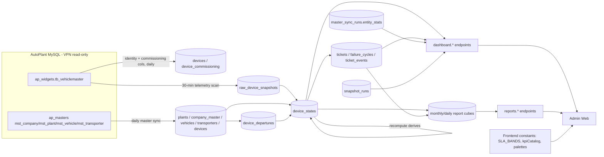

# FSM Dashboard — Complete Data Lineage

**Audit date:** 2026-08-12 · **Branch:** `feat/autoplant-integration` · **Type:** READ-ONLY static analysis. No source file was modified.

**Companion document:** `docs/autoplant-fsm-deep-data-lineage-and-correctness-audit.md` (the AutoPlant→FSM backend/ingestion audit). This document is the *frontend-first* counterpart: it starts from what a user can see on screen and traces backwards. Where a chain reaches the backend, this document restates the exact SQL rather than cross-referencing, so it stands alone.

**Evidence tags used throughout:** **[VC]** VERIFIED FROM CODE · **[VT]** VERIFIED FROM TEST · **[VD]** VERIFIED FROM DOC · **[INF]** INFERRED · **UNKNOWN — REQUIRES RUNTIME VERIFICATION**.

**Source-type classification used throughout (exactly one per element):**

| Code | Meaning |
|---|---|
| **A. DIRECT_SOURCE** | Read live from AutoPlant MySQL at request time |
| **B. DATABASE_MIRROR** | An FSM column that is a verbatim mirror of an AutoPlant column |
| **C. DERIVED_DATABASE_STATE** | An FSM column computed by a backend pipeline and stored (e.g. `device_states.is_inactive`) |
| **D. BACKEND_AGGREGATION** | Computed per request in SQL/service code, not stored |
| **E. FRONTEND_DERIVED** | Computed in the browser from an API response |
| **F. STATIC_CONFIGURATION** | Hardcoded constant, enum, palette, label, or threshold in code |
| **G. MOCK_DATA** | Fixture/test data reachable by production code |
| **H. PLACEHOLDER_STUB** | Rendered but structurally incapable of carrying real data today |
| **I. UNKNOWN** | Lineage not provable by static analysis |

---

## 1. Executive Summary

**What this document is.** Every visible data element on the FSM admin dashboard, traced backwards to the exact column it came from. **430 elements** across 13 pages, each with its component, API call, controller, service method, SQL, PostgreSQL table and column, transformation, and — where the chain reaches that far — its originating AutoPlant schema, table and column. The master table is §6.C; per-page detail is §7–§19; the cross-reference indexes are §20–§25.

**How the data actually flows.** Almost every count on every dashboard resolves to **one shared SQL fragment family** in `dashboard.service.ts` (`FLEET_COUNT_COLUMNS` plus four predicates and a deactivated-plants exclusion), grouped differently per surface. That sameness is deliberate and is the platform's strongest correctness property: the KPI cards and the tables beneath them cannot disagree, and four partition identities are enforced both by test and at runtime by the ops-explorer reconciliation panel, which **imports** the fragments rather than respelling them. Behind that fragment sits `device_states`, written by exactly two pipelines — the 30-minute telemetry ingest (which advances `latest_gps_datetime`) and the post-ingest recompute (which derives inactivity, SLA bucket, departure mirror and eligibility). Behind *that* sit five AutoPlant tables. **119 of the 430 elements trace to AutoPlant; 156 are FSM-native** (tickets, failure cycles, audit logs, report cubes).

**Coverage: 99.5%.** Two elements cannot be traced to a rendered destination because they have none — `ZmScorecardReport.trend` and `DeviceDowntimeTrend.rootCauseTrend` are both fully computed by the backend, shipped over the wire, and referenced by zero frontend code.

**What the trace surfaced.** The findings are not about wrong SQL — the queries are careful and well-documented. They are about the layer above:

1. **A denominator that diverges on one screen.** The zone drill-down's *Fleet Health %* divides by `operationalDevices`; every other Fleet Health % in the platform (and the backend's own `withRates`) divides by `reportingOperational`. The same zone therefore reads two different health figures in one viewport, differing by exactly the never-reported population — and `CompanyPlantTable`'s own code comment warns against this precise mistake.
2. **22 rendered placeholders that can never carry data**, including a hardcoded green "Snapshot Healthy" badge that can sit inches below a red "last run failed" banner, an inert 8-chip date-range control on three dashboards (no endpoint on any page accepts a date range), a permanently-`NA` scorecard column, and 7 of the 9 Action Required cards.
3. **Four different silent time windows across six report pages**, none of them displayed and none selectable. The sharpest is **System Efficiency, which defaults to today only (UTC)** — six headline percentages presented as pipeline health, computed from a single in-progress day that reads `0%` all morning in IST.
4. **Failure is systematically rendered as emptiness.** Four of the reports landing's six fetches swallow errors into empty states; the Soft-Inactive panel infers a role gate from *any* failure, so an OH whose request 500s is told they lack a permission they hold; the device table has no loading state, so a cold load shows "No devices for the current scope."
5. **Dead and unmounted surfaces:** `CriticalQueue` is imported by no `src/` file yet `apiZoneEngineers()` is fetched on every dashboard load to feed it; both operating-mode components are built, tested and unmounted; 13 backend endpoints have no caller.
6. **A ZM zone clamp that fails open on a null `zone_id`**, and a dashboard route (`/`) with no `RoleRoute` at all.
7. **Timezone inconsistency**: activity-trend axes are raw UTC string slices, two absolute timestamps render in the viewer's local zone with locale-dependent hour formats, and Inactive Duration is computed from the operator's own browser clock — in a codebase whose datetime module opens by warning against exactly that.

None of this makes a dashboard number *wrong* today; the queries behind them are sound. It makes several numbers **unreadable without context the UI does not provide** — which window, which denominator, whether zero means zero or means the request failed. §28 lists the 18 checks that need a live database to settle.

## 2. Audit Scope

**In scope:** every visible data element on every admin-web surface reachable from the dashboard — the four role dashboards, the shared dashboard sections/tables/queues/charts, the six report pages, the fleet directory, the device detail page and its drill-downs, the zone drill-down, the warehouse dashboard, and the global freshness banner. For each element: what renders it, which API feeds it, which controller/service answers, which SQL runs, which PostgreSQL tables/columns are read, what transforms apply, and where the value originated in AutoPlant (when it did).

**Method:** complete line-by-line reads of the admin frontend dashboard/report tree (37 components, ~6,400 lines), all 40 API client modules, all frontend formatting/catalog helpers, the backend dashboard/reports/devices/tickets/integration controllers and their services, `prisma/schema.prisma`, and the relevant migrations. Route/role gating read from `apps/admin/src/AppRoutes.tsx`.

**Out of scope:** the SE mobile app (covered in the companion audit §18.11), non-dashboard admin CRUD pages (settings, plant zones, tier overrides, bulk unassign, exports, ops-explorer, dispatch, schedules, engineers, inventory queues, vouchers, verification review) except where a dashboard element links into them, and any runtime/database value (this is static analysis — see §28).

## 3. Complete Dashboard/Page Inventory

Routes from `apps/admin/src/AppRoutes.tsx` **[VC]**. All authenticated routes render inside `AdminShell` (nav + header + `<Outlet/>`), and `SnapshotBanner` renders above every authenticated page (`AppRoutes.tsx:54-56`).

| # | Route | Page component | Roles (RoleRoute) | In this audit |
|---|---|---|---|---|
| 1 | `/` | `DashboardHome` → role variant | all authenticated | §7–§10 (full) |
| 2 | `/reports` | `ReportsPage` | ZM, CSM, OH | §15 (full) |
| 3 | `/reports/device` | `DeviceDetailPage` | ZM, CSM, OH | §14 (full) |
| 4 | `/reports/fleet` | `FleetDirectoryPage` | ZM, CSM, OH | §13 (full) |
| 5 | `/reports/root-cause` | `RootCauseAnalyticsPage` | ZM, CSM, OH | §16 (full) |
| 6 | `/reports/system-efficiency` | `SystemEfficiencyPage` | ZM, CSM, OH | §17 (full) |
| 7 | `/reports/zm-scorecard` | `ZmScorecardPage` | **OH only** | §18 (full) |
| 8 | `/reports/csm-approval-share` | `CsmApprovalSharePage` | **OH only** | §19 (full) |
| 9 | `/tickets` (+ `/:ticketId` drawer) | `TicketsPage` / `TicketDetailDrawer` | all authenticated | §19 (dashboard link target only) |
| 10 | `/schedules`, `/schedules/:engineerId` | `SchedulesPage`, `ScheduleDetailPage` | ZM, CSM, OH | out of scope |
| 11 | `/dispatch-runs` (+ 3 nested) | dispatch pages | ZM, CSM, OH | out of scope |
| 12 | `/batches/:batchId` | `DispatchBatchDetailPage` | ZM, CSM, OH | out of scope |
| 13 | `/engineers`, `/engineers/manage`, `/engineers/planner` | SE management | ZM, CSM, OH | §19 (SE directory feeds one scorecard column) |
| 14 | `/bulk-unassign`, `/plant-deactivations`, `/plant-zones`, `/build-health`, `/exports`, `/ops-explorer`, `/coverage`, `/settings` | admin surfaces | **OH only** | out of scope (except `/ops-explorer` reconciliation, §29) |
| 15 | `/tier-overrides` | `TierOverridesPage` | ZM, CSM, OH | out of scope |
| 16 | `/leave-requests`, `/cross-zone`, `/install`, `/intraday`, `/readiness/*`, `/component-blocked`, `/component-requests`, `/verification`, `/vouchers` | operational queues | ZM, CSM, OH | out of scope |
| 17 | `/warehouse/requests`, `/warehouse/recovery-receipt`, `/warehouse/shadow-use` | warehouse queues | **WM only** | §10 (linked from WM dashboard) |
| 18 | `/help` | `HelpCenterPage` | all | out of scope |
| 19 | `/login` | `LoginPage` | unauthenticated | out of scope |
| 20 | `/_kitchensink` | `KitchenSink` | **DEV builds only** (`import.meta.env.DEV`) | §27 (dev-only, excluded from production) |

## 4. Role → Dashboard Mapping

| Role | Lands on `/` | Endpoints fired on load | Dashboard-family pages reachable | Exclusive surfaces |
|---|---|---|---|---|
| **OPERATIONS_HEAD** | `OpsHeadDashboard` ("Pan-India Fleet Command") | the 8 manager calls | all 8 report pages + fleet directory + device detail | **Run-Ingestion button** (shell-wide, so on every page), **Build-Health notice**, **AutoPlant Catalog** card, **deal-type tag** control, **ZM Scorecard**, **CSM Backup Share**, **Soft-Inactive trend**, all five `POST /reports/*/recompute` |
| **CENTRAL_SERVICE_MANAGER** | `CentralDashboard` ("Cross-Zone Central Tower") | the 8 manager calls | 6 report pages (not ZM Scorecard, not CSM Share) + fleet directory + device detail | **Zones Covered** and **Escalations** cards, **EscalationQueueList** |
| **ZONAL_MANAGER** | `ZmDashboard` ("Zone Operations Dashboard"), zone-clamped server-side | the 8 manager calls | same as CSM, all zone-clamped | **ZoneOverviewTable** (in place of the Scorecard), **ActionRequiredPanel** |
| **WAREHOUSE_MANAGER** | `WarehouseDashboard` ("Zone Warehouse Fulfillment") | **none of `/api/dashboard/*`** — 5 warehouse calls instead | 3 warehouse queues | Component Request Queue, Warehouse Stock + Adjust modal, Shadow-Use Reconciliation |
| **SERVICE_ENGINEER / any other** | ⚠ **`ZmDashboard`** by fall-through — `/` has no `RoleRoute` | the 8 manager calls, which then 403 | none (every report route is `RoleRoute`-gated) | — |
| **OH or CSM with `actingZone` set** | `ZmDashboard` | ⚠ **no refetch on entering acting mode**; the acting zone is client-only and never sent to the server | unchanged — `RoleRoute` ignores `actingZone` | — |

Role differences within a shared element (formatting, hints, tooltips, which cards appear) are catalogued in §26.2; server-side zone clamping and its failure modes in §26.3.

## 5. Global Data Architecture

Everything on the dashboard resolves to one of six data origins. **[VC]**



### 5.1 The shared fleet-count fragment family

Nearly every count on every dashboard is produced by one reusable set of SQL fragments in `apps/backend/src/dashboard/dashboard.service.ts` **[VC]**. Any element traced to `zone-overview`, `fleet-summary`, `company-plant-overview`, `fleet-directory`, or `fleet-composition` shares these definitions exactly:

```sql
-- dashboard.service.ts:8
EXCLUDE_DEACTIVATED_PLANTS =
  AND p.plant_id NOT IN (SELECT plant_id FROM plant_deactivations WHERE reactivated_at IS NULL)

-- dashboard.service.ts:50, 61, 64, 82
REPORTING_OPERATIONAL      = ds.is_departed = false AND ds.latest_gps_datetime IS NOT NULL
INACTIVE_OPERATIONAL       = REPORTING_OPERATIONAL AND ds.is_inactive = true AND ds.sla_bucket IS NOT NULL
HEALTHY_OPERATIONAL        = REPORTING_OPERATIONAL AND NOT (ds.is_inactive = true AND ds.sla_bucket IS NOT NULL)
NEVER_REPORTED_OPERATIONAL = ds.is_departed = false AND ds.latest_gps_datetime IS NULL

-- dashboard.service.ts:84-91
FLEET_COUNT_COLUMNS =
  COUNT(*)::int                                                     AS "mirroredDevices",
  COUNT(*) FILTER (WHERE ds.is_departed = false)::int               AS "operationalDevices",
  COUNT(*) FILTER (WHERE ds.is_departed = true)::int                AS "warehouseDevices",
  COUNT(*) FILTER (WHERE REPORTING_OPERATIONAL)::int                AS "reportingOperational",
  COUNT(*) FILTER (WHERE INACTIVE_OPERATIONAL)::int                 AS "inactiveOperational",
  COUNT(*) FILTER (WHERE HEALTHY_OPERATIONAL)::int                  AS "healthyOperational",
  COUNT(*) FILTER (WHERE NEVER_REPORTED_OPERATIONAL)::int           AS "neverReported"
```

Rates are added server-side by `withRates` (`dashboard.service.ts:144-148`) **[VC]**:

```text
inactivePct   = round( inactiveOperational / reportingOperational × 1000 ) / 10   -- 1 decimal place
fleetHealthPct= round( healthyOperational  / reportingOperational × 1000 ) / 10
both are NULL when reportingOperational = 0  → the UI renders "—"
```

The denominator is `reportingOperational`, **not** `operationalDevices` — operator decision P3 under issue #223, because never-reported devices must not dilute a *reporting* rate.

**Invariants enforced at runtime** by the ops-explorer reconciliation panel, which imports these very fragments rather than respelling them (`apps/backend/src/ops-explorer/reconciliation.service.ts:4-8, 160-321`) **[VC]**, and by `apps/backend/test/dashboard-kpi-reconciliation.e2e-spec.ts` **[VT]**:

```text
mirroredDevices      = operationalDevices + warehouseDevices
operationalDevices   = healthyOperational + inactiveOperational + neverReported
reportingOperational = healthyOperational + inactiveOperational
Σ byBucket[*]        = inactiveOperational
```

### 5.2 The device_states derivation every count depends on

`device_states` is written by exactly two pipelines **[VC]**:

**Writer 1 — telemetry ingest** (`apps/backend/src/ingestion/snapshot-ingestion.service.ts:135-151`), every 30 min when `INGESTION_SCHEDULER_ENABLED=true`:

```sql
INSERT INTO device_states (device_id, latest_gps_datetime, trip_creation_datetime,
                           first_reported_at, first_reported_offset_min, computed_at)
SELECT u.device_id, u.latest_gps, u.trip_created, u.first_reported, u.first_offset, ${now}
  FROM unnest(...) AS u(...)
  JOIN devices d ON d.device_id = u.device_id
ON CONFLICT (device_id) DO UPDATE
  SET latest_gps_datetime    = GREATEST(device_states.latest_gps_datetime, EXCLUDED.latest_gps_datetime),
      trip_creation_datetime = GREATEST(device_states.trip_creation_datetime, EXCLUDED.trip_creation_datetime),
      first_reported_at      = COALESCE(device_states.first_reported_at, EXCLUDED.first_reported_at),
      first_reported_offset_min = COALESCE(device_states.first_reported_offset_min, EXCLUDED.first_reported_offset_min),
      computed_at            = EXCLUDED.computed_at
```

**Writer 2 — recompute** (`apps/backend/src/device-state/device-state.service.ts:156-197`), immediately after a SUCCESSful ingest:

```sql
WITH install AS (
  SELECT device_id, MIN(installed_at) AS installed_at
    FROM device_commissioning WHERE installed_at IS NOT NULL GROUP BY device_id),
derived AS (
  SELECT ds.device_id,
    CASE WHEN ds.latest_gps_datetime IS NOT NULL
           THEN GREATEST(0, EXTRACT(EPOCH FROM (${now}::timestamptz - ds.latest_gps_datetime)) / 3600.0)
         WHEN ic.installed_at IS NOT NULL
           THEN GREATEST(0, EXTRACT(EPOCH FROM (${now}::timestamptz - ic.installed_at)) / 3600.0)
         ELSE NULL END AS hours,
    EXISTS (SELECT 1 FROM device_departures dd
             WHERE dd.device_id = ds.device_id AND dd.restored_at IS NULL) AS departed
  FROM device_states ds LEFT JOIN install ic ON ic.device_id = ds.device_id)
UPDATE device_states ds SET
  inactivity_hours    = dr.hours,
  is_departed         = dr.departed,
  is_inactive         = (NOT dr.departed AND dr.hours IS NOT NULL AND dr.hours >= ${threshold}),
  sla_bucket          = CASE WHEN dr.departed THEN NULL ELSE ${slaBucketCaseSql} END,
  eligible_for_uptime = <mode-dependent> AND NOT dr.departed
                        AND NOT EXISTS (SELECT 1 FROM non_operational_markings n
                                         WHERE n.device_id = ds.device_id
                                           AND n.state::text IN ('CONFIRMED','ACTIVE')),
  vehicle_id = v.vehicle_id, plant_id = v.plant_id, company_id = v.company_id,
  transporter_id = v.transporter_id,
  computed_at = ${now}
FROM derived dr
JOIN devices d ON d.device_id = dr.device_id
LEFT JOIN vehicles v ON v.vehicle_id = d.current_vehicle_id
WHERE ds.device_id = dr.device_id
```

Threshold = `system_settings.inactivity_threshold_hours`, default **24** (`device-state.service.ts:11`). Never-reported devices age from `MIN(device_commissioning.installed_at)` (issue #223, operator decision P1). `has_open_failure_cycle` is deliberately **not** touched here — it is owned by the ticketing writers.

### 5.3 SLA bands — one definition, three consumers

`SLA_BANDS` lives in the shared package and is consumed by (a) the backend SQL generator `slaBucketCaseSql` (`apps/backend/src/device-state/sla-bucket.ts:41-48`), (b) the backend/TS classifier `classifySlaBucket`, and (c) the frontend label/range renderer (`apps/admin/src/lib/slaBucket.ts`) **[VC]**. Chart labels therefore cannot drift from the classifier.

```text
inactivity_hours ≥ 168 → LONG_PENDING       ≥ 48 → HIGH_CRITICAL
                 ≥ 120 → VERY_SEVERE        ≥ 24 → CRITICAL
                 ≥  72 → SEVERE             ≥ 12 → RISK
                                            ≥  8 → EARLY_RISK
                                            ≥  4 → WARNING
                                            <  4 → NULL  (ACTIVE — never queued)
departed device → NULL regardless of hours
```

### 5.4 Origin of the underlying AutoPlant columns

| FSM column the dashboard reads | AutoPlant origin | Pipeline | Cadence |
|---|---|---|---|
| `device_states.latest_gps_datetime` | `ap_widgets.tb_vehiclemaster.latest_gps_datetime` (UTC) | telemetry scan → `raw_device_snapshots.gps_datetime` → GREATEST upsert | 30 min |
| `device_states.trip_creation_datetime` | `ap_widgets.tb_vehiclemaster.TRIP_CREATION_DATETIME` | telemetry scan (never stored in the journal) | 30 min |
| `device_states.first_reported_at` | first ingested ping (derived, write-once) | telemetry scan | once per device |
| `device_states.is_departed` | `ap_masters.mst_vehicle.deployment_status` / absence from read | master sync → `device_departures` ledger → recompute mirror | daily |
| `device_states.plant_id / company_id / vehicle_id / transporter_id` | `mst_vehicle.plant_id`, `mst_plant.company_id` (via MIN subquery), `mst_vehicle.vehicle_no`, `mst_vehicle.transporter_id` | master sync → `vehicles`/`devices` → recompute denormalization | daily + recompute |
| `device_states.eligible_for_uptime` | `mst_vehicle.deployment_status` (all-deployed mode) or `pgi_history` (pgi mode) | master sync / external SAP feed | daily |
| `devices.device_type`, `devices.imsi_no` | `ap_widgets.tb_vehiclemaster.DEVICE_TYPE`, `.IMSI_NO` | master sync cross-schema join | daily |
| `plants.name / source_zone_name / plant_state / master_plant_*` | `ap_masters.mst_plant.*` | master sync | daily |
| `plants.zone_id` | **not AutoPlant** — FSM operational zone via `zone_mappings` crosswalk over `mst_plant.zone_name`, insert-only | master sync + admin reapply | daily / on edit |
| `company_master.name / company_type / status` | `ap_masters.mst_company.*` | master sync | daily |
| `company_master.company_tier` | **not AutoPlant** — FSM/CRM-owned, insert default SILVER | never overwritten by sync | — |
| `vehicles.status` | `ap_masters.mst_vehicle.deployment_status` (verbatim) | master sync | daily |
| `transporters.name` | `ap_masters.mst_transporter.transporter_name` | master sync | daily |
| `device_commissioning.installed_at / installed_by / remark` | `ap_widgets.tb_vehiclemaster.FIRST_INSTALLED_DATE_TIME / FIRST_INSTALLED_BY / INSTALLATION_REMARK` | master sync append-only | daily |
| `master_sync_runs.entity_stats->devices->observed` | distinct fitted `mst_vehicle.device_id` across all statuses | master sync counter | daily |
| `snapshot_runs.finished_at / data_as_of` | ingestion ledger (FSM-native) | telemetry run | 30 min |
| `tickets`, `failure_cycles`, `ticket_events`, `verification_runs`, `troubleshooting_submissions`, `audit_logs`, `plant_batch_assignments`, `work_schedules` | **FSM-native** — no AutoPlant origin | — | — |

---

## 6.A Global shell elements (present on every dashboard)

| # | Element | File:lines | Data | Behaviour | Type |
|---|---|---|---|---|---|
| G1 | **SnapshotBanner** — "Snapshot: data as of {ts}" | `SnapshotBanner.tsx:82-95`, mounted `AppRoutes.tsx:56` **outside `<Routes>`** | `GET /api/snapshots/latest` → `dataAsOf` (timestamp of the last **SUCCESS** run) | `new Date(iso).toLocaleString()` — browser locale, with seconds. Polls every **60 s**; re-reads on `onIngestionComplete`. `dataAsOf === null` → literal **"no successful snapshot yet"**. **Fetch failure or pre-fetch → the entire banner renders nothing** (silent by design). `lastSuccessAt` is in the response type but never rendered | **B** |
| G2 | SnapshotBanner **red alert** — "Snapshot alert: last run failed." / "…is stuck / overdue." | `SnapshotBanner.tsx:66-80` | `latest.status`, `latest.startedAt` | `failed = status === 'FAILED'`; `isStuck = status === 'RUNNING' && now − startedAt > STUCK_AFTER_MS (15 min)`. **`PARTIAL` is treated as healthy** and renders the normal grey bar. Appends "Showing data as of {ts} — may be stale." only when `dataAsOf` is truthy | **C** |
| G3 | **BuildHealthNotice** (amber) | `BuildHealthNotice.tsx:17-67`, rendered at `SnapshotBanner.tsx:64` | `GET /api/integration/health` → `masterSync.build.staleBuild`, `snapshot.build.staleBuild`, `recomputes[].swing`, `runtimeLock.version` | **OH only**. Renders only when `staleRun \|\| swung`; links to `/build-health`. Healthy or error → renders nothing | **C** |
| G4 | **RunIngestionButton** "Run Ingestion Now" | `RunIngestionButton.tsx:90-119`, mounted `TopBar.tsx:101` | `POST /api/integration/run-pipeline` (no body) | **OH only** (`if (session?.role !== 'OPERATIONS_HEAD') return null` — matches the backend guard). Lives in the shell top bar, so an OH sees it on **every** page. Requires modal confirmation ("Run ingestion now?" / Cancel / **Run now**). Cycling verb every 1.4 s + sr-only "Running ingestion…" | **A — triggers a live AutoPlant pull** |
| G5 | Ingestion success toast | `RunIngestionButton.tsx:25-37` | run summary | `Masters {status} · {n} snapshot rows · {n} device states recomputed · {n} tickets created`, each via `Intl.NumberFormat('en-IN')`. 409/`RUN_IN_PROGRESS` → blue info toast and **no refresh broadcast**. Five distinct failure messages by status (503 VPN / 401-403 session / ≥500 server / network / other) | **D** |
| G6 | Acting-as-ZM banner | `AppShell.tsx:60-72` | `useAuth().actingZone` (sessionStorage, **never sent to the server**) | "Acting as Zonal Manager for Zone {n} (audited as {role})" + "Exit acting mode". Uses `!= null` while `ManagerDashboard` uses truthiness — **zone `0` produces contradictory chrome** | **F** |
| G7 | TopBar breadcrumb | `TopBar.tsx:52-84` | route + role | pure derivation | **F** |
| G8 | TopBar profile chip | `TopBar.tsx:24-25,138-149` | `session.role`, `session.zone_id` | `zone_id === null` → "All zones"; strict `=== null`, so `undefined` would render "Zone undefined" | **B** |
| G9 | TopBar **search input** | `TopBar.tsx:89-96` | — | **no value, no onChange, no handler, no endpoint** | **H — STUB** |
| G10 | TopBar **notifications bell** | `TopBar.tsx:130-136` | — | no onClick, no count, no badge, no API | **H — STUB** |
| G11 | TopBar **"Assign SE"** button | `TopBar.tsx:103-105` | — | `navigate('/')` — goes to the dashboard, assigns nothing | **H — STUB** |
| G12 | TopBar "Act as ZM" zone input + Go | `TopBar.tsx:107-124` | client state only | CSM + OH only; **any numeric string is accepted — no check that the zone exists** | **E** |
| G13 | Sidebar nav | `Sidebar.tsx:111-157`, `nav.ts:51-149` | — | **no counts, badges or dots anywhere**; active rule `to === '/' ? pathname === '/' : pathname.startsWith(to)` | **F** |
| G14 | Sidebar "Data Explorer" link | `Sidebar.tsx:28-29`, `nav.ts:127-129` | `useOpsExplorerMeta` | the only feature-flagged nav item; renders only when `state === 'ready'` | **F** gated on a backend flag |
| G15 | Sidebar footer "Admin Console v2.0 · role-gated nav" | `Sidebar.tsx:159-166` | — | hardcoded literal, **not a build stamp** | **F** |
| G16 | `ProtectedRoute` "Loading…" | `ProtectedRoute.tsx:9-19` | `useAuth().loading` | **the only loading indicator anywhere in the dashboard path**; true only while rehydrating a stored token | **E** |
| G17 | `RoleRoute` gate | `RoleRoute.tsx:11-20` | `session.role` | unauthenticated → `/login`; wrong role → **silently bounced to `/` with no message**. ⚠ **The dashboard route `/` is NOT wrapped in a `RoleRoute`** (`AppRoutes.tsx:71`) — every authenticated role, including `SERVICE_ENGINEER`, reaches a manager dashboard variant. `RoleRoute` ignores `actingZone` | **C** |

## 6.B Dashboard loading / error contract **[VC]**

`ManagerDashboard.tsx:48-63` — **there is no loading state**. The full dashboard renders immediately with empty arrays and null objects:

```ts
Promise.all([apiActionRequired(), apiZoneOverview(), apiCompanyPlantOverview(), apiCriticalQueue()])
  .then(([a, z, cp, cq]) => { if (!alive) return; setActions(a); setZones(z); setCompanyPlants(cp); setCritical(cq); })
  .catch(() => alive && setError('Failed to load dashboard'));
```

- **While loading:** `zones`-derived cards render **`0`**; `fleet`-derived cards render **`—`** (they have a `fleet ? … : '—'` guard, the `reduce` over `[]` does not). No spinner, no skeleton, no `aria-busy`.
- **On any failure:** `get()` throws `Error('REQUEST_FAILED_' + status)` (`api/dashboard.ts:12`); the `.catch` **discards the error object**. 403, 500 and a network drop all produce the same red `<p role="alert">Failed to load dashboard</p>`, rendered *below* the hero, which still shows zeros above it.
- **Four of the eight fetches never surface an error at all** — `apiFleetSummary`, both `apiFleetUptime` calls and `apiZoneEngineers` each end in `.catch(() => undefined)`. A 403 on `/dashboard/fleet-summary` leaves the whole Operational Fleet strip at `—` with **no message anywhere**.
- **Zero-vs-unknown collapse:** a reader cannot distinguish "genuinely zero" from "never loaded" on any `zones`-derived KPI.

The eight requests fired per dashboard mount (dependency array `[]` — **one load per mount, no polling, no refetch when acting-mode changes**):

| # | Call | Request actually sent |
|---|---|---|
| 1 | `apiActionRequired()` | `GET /api/dashboard/action-required` |
| 2 | `apiZoneOverview()` | `GET /api/dashboard/zone-overview` |
| 3 | `apiCompanyPlantOverview()` | `GET /api/dashboard/company-plant-overview` (**no query string**) |
| 4 | `apiCriticalQueue()` | `GET /api/dashboard/critical-queue` |
| 5 | `apiFleetSummary()` | `GET /api/dashboard/fleet-summary` |
| 6 | `apiFleetUptime({groupBy:'zone'})` | `GET /api/reports/fleet-uptime?groupBy=zone` (**no `month` → backend default = current month**) |
| 7 | `apiFleetUptime({groupBy:'plant'})` | `GET /api/reports/fleet-uptime?groupBy=plant` |
| 8 | `apiZoneEngineers()` | `GET /api/schedules/engineers` |

## 6.C MASTER LINEAGE TABLE

One row per UI element **per role instance**. Abbreviations: **Src** = source type (§0 legend: A DIRECT_SOURCE · B DATABASE_MIRROR · C DERIVED_DATABASE_STATE · D BACKEND_AGGREGATION · E FRONTEND_DERIVED · F STATIC_CONFIGURATION · G MOCK · H PLACEHOLDER_STUB · I UNKNOWN); **L/M** = Live / Stub / Mock; **Cf** = confidence (VC = verified from code). AutoPlant columns: `W` = `ap_widgets.tb_vehiclemaster`, `M` = `ap_masters.<table>`; "—" = FSM-native, no AutoPlant origin. All rows Cf=VC unless stated.

### Global shell (every page, every role)

| # | Page | Role | UI Element | Component | API/Hook | Endpoint | Backend Method | PG Table | PG Column(s) | Calculation | AP Schema | AP Table | AP Column(s) | Src | L/M |
|---|---|---|---|---|---|---|---|---|---|---|---|---|---|---|---|
| 1 | all | all | Snapshot banner "data as of {ts}" | SnapshotBanner | apiSnapshotLatest | GET /snapshots/latest | SnapshotQueryService.latest | snapshot_runs | data_as_of | `toLocaleString()`, 60 s poll | — | — | — | B | Live |
| 2 | all | all | "no successful snapshot yet" | SnapshotBanner | ″ | ″ | ″ | snapshot_runs | data_as_of IS NULL | literal | — | — | — | F | Live |
| 3 | all | all | Red "Snapshot alert: last run failed." | SnapshotBanner | ″ | ″ | ″ | snapshot_runs | status | `status==='FAILED'` | — | — | — | C | Live |
| 4 | all | all | Red "last run is stuck / overdue." | SnapshotBanner | ″ | ″ | ″ | snapshot_runs | status, started_at | `RUNNING && now−started > 15 min` | — | — | — | C | Live |
| 5 | all | all | (banner hidden entirely on fetch failure) | SnapshotBanner | ″ | ″ | ″ | — | — | `{view && …}` | — | — | — | E | Live |
| 6 | all | OH | Build-health amber notice | BuildHealthNotice | apiIntegrationHealth | GET /integration/health | AutoPlantHealthService.check | master_sync_runs, snapshot_runs, runtime_lock, device_state_recomputes | build_version, build_fingerprint, swing | `staleRun \|\| swung` | — | — | — | C | Live |
| 7 | all | OH | "Run Ingestion Now" button | RunIngestionButton | apiRunPipeline | POST /integration/run-pipeline | IntegrationSyncService.runPipeline | — | — | modal-confirmed | ap_widgets+ap_masters | all 5 | all read cols | **A** | Live |
| 8 | all | OH | Ingestion toast counts | SummaryToast | ″ | ″ | ″ | snapshot_runs, device_states, tickets | inserted, upserted, created | en-IN format | — | — | — | D | Live |
| 9 | all | CSM/OH | Acting-as-ZM banner | AppShell | useAuth | — | — | — | — | sessionStorage only | — | — | — | F | Live |
| 10 | all | all | TopBar breadcrumb | TopBar | — | — | — | — | — | route+role | — | — | — | F | Live |
| 11 | all | all | Profile chip role + zone | TopBar | useAuth | GET /me | — | users | role, zone_id | `zone_id===null?'All zones'` | — | — | — | B | Live |
| 12 | all | all | **TopBar search input** | TopBar | — | — | — | — | — | none | — | — | — | **H** | **Stub** |
| 13 | all | all | **Notifications bell** | TopBar | — | — | — | — | — | none | — | — | — | **H** | **Stub** |
| 14 | all | all | **"Assign SE" button** | TopBar | — | — | — | — | — | `navigate('/')` | — | — | — | **H** | **Stub** |
| 15 | all | CSM/OH | "Act as ZM" zone input | TopBar | — | — | — | — | — | any numeric accepted | — | — | — | E | Live |
| 16 | all | all | Sidebar nav labels (no counts) | Sidebar | — | — | — | — | — | role-built | — | — | — | F | Live |
| 17 | all | OH | Sidebar "Data Explorer" link | Sidebar | useOpsExplorerMeta | GET /ops-explorer/meta | — | — | — | flag-gated | — | — | — | F | Live |
| 18 | all | all | **Sidebar "Admin Console v2.0"** | Sidebar | — | — | — | — | — | hardcoded literal | — | — | — | **F** | **Stub** |
| 19 | all | all | "Loading…" (token rehydrate) | ProtectedRoute | useAuth | — | — | — | — | only loader in the app | — | — | — | E | Live |
| 19b | all | OH | *(no visible element)* — ingestion-complete event bus | `ingestionEvents.ts:7-22` | `emitIngestionComplete` / `onIngestionComplete` | — | — | — | — | module-scope `Set<Listener>`; published by `TopBar.tsx:101`, subscribed by `OpsHeadDashboard` (refetch + odometer), `SnapshotBanner` (re-read freshness), `BuildHealthNotice`. Synchronous, no payload; ⚠ **a throwing listener aborts the rest** | — | — | — | E | Live |

### Dashboard — Operations Head (`/`)

| # | Page | Role | UI Element | Component | API/Hook | Endpoint | Backend Method | PG Table | PG Column(s) | Calculation | AP Schema | AP Table | AP Column(s) | Src | L/M |
|---|---|---|---|---|---|---|---|---|---|---|---|---|---|---|---|
| 20 | Dashboard | OH | **Fleet Uptime** (hero) | MetricCard | apiFleetUptime | GET /reports/fleet-uptime?groupBy=zone | ReportsService.fleetUptime | device_downtime_summary_monthly | downtime_seconds, window_seconds, eligible | `(1−Σd/Σw)×100`, `toFixed(1)` | — | — | — | D | Live |
| 21 | Dashboard | OH | Fleet Uptime hint | MetricCard | ″ | ″ | ″ | — | — | conditional literal | — | — | — | F | Live |
| 22 | Dashboard | OH | **Inactive Operational Devices** | MetricCard+RollingNumber | apiZoneOverview | GET /dashboard/zone-overview | DashboardService.zoneOverview | device_states, plants, zones, plant_deactivations | is_departed, latest_gps_datetime, is_inactive, sla_bucket | `Σ zones[].inactiveOperational`, **raw int** | ap_widgets | W | latest_gps_datetime | E/D | Live |
| 23 | Dashboard | OH | hint "{n} zones" (⚠ unpluralized) | MetricCard | ″ | ″ | ″ | zones | zone_id | `zones.length` | — | — | — | E | Live |
| 24 | Dashboard | OH | **Critical Devices** | MetricCard+RollingNumber | ″ | ″ | ″ | device_states | sla_bucket='CRITICAL' | `Σ byBucket.CRITICAL` (band only) | ap_widgets | W | latest_gps_datetime | E/D | Live |
| 25 | Dashboard | OH | hint "pan-India, CRITICAL band" | MetricCard | — | — | — | — | — | literal | — | — | — | F | Live |
| 26 | Dashboard | OH | **Fleet directory** composite card | CompanyPlantCard | apiFleetSummary | GET /dashboard/fleet-summary | DashboardService.fleetSummary | device_states, plants | company_id, plant_id | container only; **no kpi tooltip** | — | — | — | D | Live |
| 27 | Dashboard | OH | ↳ **Companies** + "pan-India" | CompanyPlantCard | ″ | ″ | ″ | device_states | company_id | `COUNT(DISTINCT company_id)` | ap_masters | mst_plant | company_id | D | Live |
| 28 | Dashboard | OH | ↳ **Plants** + "with tracked devices" | ″ | ″ | ″ | ″ | device_states | plant_id | `COUNT(DISTINCT plant_id)` | ap_masters | mst_vehicle | plant_id | D | Live |
| 29 | Dashboard | OH | **Operational Fleet** | MetricCard | ″ | ″ | ″ | device_states | is_departed | `COUNT FILTER(is_departed=false)` | ap_masters | mst_vehicle | deployment_status | D | Live |
| 30 | Dashboard | OH | **AutoPlant Catalog** | MetricCard | ″ | ″ | DashboardService.latestMasterSync | master_sync_runs | entity_stats->'devices'->>'observed' | last SUCCESS run | ap_masters | mst_vehicle | device_id (distinct) | **B** | Live |
| 31 | Dashboard | OH | "Last sync: {stamp}" | MetricCard | ″ | ″ | ″ | master_sync_runs | finished_at | `formatStamp`, local TZ | — | — | — | B | Live |
| 32 | Dashboard | OH | Truck background image | DashboardHero | — | — | — | — | — | `xl:block` only | — | — | — | F | Live |
| 33 | Dashboard | OH | **`bottom` hero strip** | DashboardHero | — | — | — | — | — | **no caller passes it** | — | — | — | **H** | **Stub** |
| 34 | Dashboard | OH | **MetricCard share bar** | MetricStrip | — | — | — | — | — | **never supplied on this page** | — | — | — | **H** | **Stub** |
| 35 | Dashboard | OH | Error "Failed to load dashboard" | ManagerDashboard | 4 calls | — | — | — | — | ⚠ 403/500/network identical | — | — | — | E | Live |

### Dashboard — CSM (`/`)

| # | Page | Role | UI Element | Component | API/Hook | Endpoint | Backend Method | PG Table | PG Column(s) | Calculation | AP Schema | AP Table | AP Column(s) | Src | L/M |
|---|---|---|---|---|---|---|---|---|---|---|---|---|---|---|---|
| 36 | Dashboard | CSM | **Fleet Uptime** (hero) | MetricCard | apiFleetUptime | GET /reports/fleet-uptime?groupBy=zone | ReportsService.fleetUptime | device_downtime_summary_monthly | downtime/window_seconds | identical to #20 | — | — | — | D | Live |
| 37 | Dashboard | CSM | **Zones Covered** | MetricCard | apiZoneOverview | GET /dashboard/zone-overview | DashboardService.zoneOverview | zones | zone_id | `zones.length`, **no formatting, no kpi key** | — | — | — | E | Live |
| 38 | Dashboard | CSM | **Inactive Operational Devices** | MetricCard | ″ | ″ | ″ | device_states | is_inactive, sla_bucket, latest_gps_datetime | `Σ`, **`formatCount` (grouped)** — same number OH renders raw | ap_widgets | W | latest_gps_datetime | E/D | Live |
| 39 | Dashboard | CSM | hint "all zones" | MetricCard | — | — | — | — | — | literal | — | — | — | F | Live |
| 40 | Dashboard | CSM | **Escalations** | MetricCard | apiCriticalQueue | GET /dashboard/critical-queue | DashboardService.criticalQueue | tickets, device_states, plants, zones, company_master | work_type, status, sla_bucket | `Σ groups[].tickets.length` | — | — | — | E/D | Live |
| 41 | Dashboard | CSM | hint "{n} action items" | MetricCard | apiActionRequired | GET /dashboard/action-required | DashboardService.actionRequired | failure_cycles, tickets | state, sla_paused_at, last_state_changed_at | `Σ available&&count>0` | — | — | — | E | Live |
| 42 | Dashboard | CSM | **"Snapshot Healthy" badge** | Badge | — | — | — | — | — | **hardcoded success tone** | — | — | — | **H** | **Stub** |
| 43 | Dashboard | CSM | **DateRangeChips** (8 chips) | DateRangeChips | — | — | — | — | — | **inert; no fetch takes a range** | — | — | — | **H** | **Stub** |

### Dashboard — Zonal Manager (`/`)

| # | Page | Role | UI Element | Component | API/Hook | Endpoint | Backend Method | PG Table | PG Column(s) | Calculation | AP Schema | AP Table | AP Column(s) | Src | L/M |
|---|---|---|---|---|---|---|---|---|---|---|---|---|---|---|---|
| 44 | Dashboard | ZM | **Fleet Uptime** (hero) | MetricCard | apiFleetUptime | GET /reports/fleet-uptime?groupBy=zone | ReportsService.fleetUptime | device_downtime_summary_monthly | downtime/window_seconds | identical to #20 | — | — | — | D | Live |
| 45 | Dashboard | ZM | **Inactive Operational Devices** | MetricCard | apiZoneOverview | GET /dashboard/zone-overview | DashboardService.zoneOverview | device_states | is_inactive, sla_bucket, latest_gps_datetime | `formatCount(Σ)` | ap_widgets | W | latest_gps_datetime | E/D | Live |
| 46 | Dashboard | ZM | hint "across N zone(s)" (**pluralized**) | MetricCard | ″ | ″ | ″ | zones | zone_id | `zones.length` | — | — | — | E | Live |
| 47 | Dashboard | ZM | **Critical Devices** | MetricCard | ″ | ″ | ″ | device_states | sla_bucket | `formatCount(Σ byBucket.CRITICAL)` | ap_widgets | W | latest_gps_datetime | E/D | Live |
| 48 | Dashboard | ZM | **Companies** (standalone, **has kpi tooltip**) | MetricCard | apiFleetSummary | GET /dashboard/fleet-summary | DashboardService.fleetSummary | device_states | company_id | `formatCount`; hint "in your scope" | ap_masters | mst_plant | company_id | D | Live |
| 49 | Dashboard | ZM | **Plants** | MetricCard | ″ | ″ | ″ | device_states | plant_id | `formatCount` | ap_masters | mst_vehicle | plant_id | D | Live |
| 50 | Dashboard | ZM | **Operational Fleet** | MetricCard | ″ | ″ | ″ | device_states | is_departed | `formatCount` | ap_masters | mst_vehicle | deployment_status | D | Live |
| 51 | Dashboard | ZM | **"Snapshot Healthy" badge** | Badge | — | — | — | — | — | **hardcoded** | — | — | — | **H** | **Stub** |
| 52 | Dashboard | ZM | **DateRangeChips** | DateRangeChips | — | — | — | — | — | **inert** | — | — | — | **H** | **Stub** |

### Operational Fleet strip (all three manager roles — 3 role instances each)

| # | Page | Role | UI Element | Component | API/Hook | Endpoint | Backend Method | PG Table | PG Column(s) | Calculation | AP Schema | AP Table | AP Column(s) | Src | L/M |
|---|---|---|---|---|---|---|---|---|---|---|---|---|---|---|---|
| 53 | Dashboard | OH/CSM/ZM | "Last snapshot: {stamp}" | OperationalFleetSection | apiFleetSummary | GET /dashboard/fleet-summary | DashboardService.latestSnapshotAt | snapshot_runs | finished_at (status=SUCCESS) | `formatStamp`, local TZ | — | — | — | B | Live |
| 54 | Dashboard | OH/CSM/ZM | **Operational Devices** | MetricCard | ″ | ″ | DashboardService.fleetSummary | device_states, plants | is_departed | `COUNT FILTER` (⚠ same field as #29/#50, different label) | ap_masters | mst_vehicle | deployment_status | D | Live |
| 55 | Dashboard | OH/CSM/ZM | **Healthy Operational** | MetricCard | ″ | ″ | ″ | device_states | is_departed, latest_gps_datetime, is_inactive, sla_bucket | `COUNT FILTER(HEALTHY_OPERATIONAL)` | ap_widgets | W | latest_gps_datetime | D | Live |
| 56 | Dashboard | OH/CSM/ZM | **Inactive Operational** | MetricCard | ″ | ″ | ″ | device_states | ″ | `COUNT FILTER(INACTIVE_OPERATIONAL)` — ⚠ different route to the same quantity as #22 | ap_widgets | W | latest_gps_datetime | D | Live |
| 57 | Dashboard | OH/CSM/ZM | **Never Reported** (tone critical) | MetricCard | ″ | ″ | ″ | device_states | is_departed, latest_gps_datetime IS NULL | `COUNT FILTER(NEVER_REPORTED)` | ap_widgets | W | latest_gps_datetime | D | Live |
| 58 | Dashboard | OH/CSM/ZM | **Warehouse Devices** | MetricCard | ″ | ″ | ″ | device_states | is_departed=true | `COUNT FILTER` | ap_masters | mst_vehicle | deployment_status | D | Live |
| 59 | Dashboard | OH/CSM/ZM | **Fleet Health %** | MetricCard | ″ | ″ | withRates | device_states | healthy/reporting | `round(h/r×1000)/10`; **`—` never `0.0%`** | — | — | — | D | Live |
| 60 | Dashboard | OH/CSM/ZM | **Inactive %** | MetricCard | ″ | ″ | withRates | device_states | inactive/reporting | ″ | — | — | — | D | Live |
| 61 | Dashboard | OH/CSM/ZM | Footnote paragraph | OperationalFleetSection | — | — | — | — | — | literal | — | — | — | F | Live |

### Charts (mounted on all three manager dashboards)

| # | Page | Role | UI Element | Component | API/Hook | Endpoint | Backend Method | PG Table | PG Column(s) | Calculation | AP Schema | AP Table | AP Column(s) | Src | L/M |
|---|---|---|---|---|---|---|---|---|---|---|---|---|---|---|---|
| 62 | Dashboard | OH/CSM/ZM | Trend range buttons 1D/7D/1M/1Y/MAX | ActivityTrendSection | — | — | — | — | — | default `7D`; **1M = 30 days** | — | — | — | F | Live |
| 63 | Dashboard | CSM/OH | Pan-India / Zone-wise toggle | ″ | — | — | — | — | — | ⚠ ZM passes `canSelectZone={false}` | — | — | — | F | Live |
| 64 | Dashboard | CSM/OH | Trend zone selector | ″ | apiZoneOverview | GET /dashboard/zone-overview | zoneOverview | zones | name | ⚠ silently defaults to the **first** zone | — | — | — | E | Live |
| 65 | Dashboard | OH/CSM/ZM | Series **"Inactive Devices"** | FleetActivityTrendChart | apiActivityTrend | GET /dashboard/activity-trend?range= | DashboardService.activityTrend | soft_inactive_count_history + device_states | soft_inactive_count; is_inactive, eligible_for_uptime | `DISTINCT ON` last snapshot/zone/bucket, **current bucket overwritten by a live count** | ap_widgets | W | latest_gps_datetime | C→D | Live |
| 66 | Dashboard | OH/CSM/ZM | Series **"Troubleshoot"** | ″ | ″ | ″ | ″ | tickets, plants, zones | created_at, work_type | `COUNT GROUP BY date_trunc`, zero-filled | — | — | — | D | Live |
| 67 | Dashboard | OH/CSM/ZM | Series **"Installation"** | ″ | ″ | ″ | ″ | tickets | created_at, work_type='INSTALL' | zero-filled; ⚠ label≠enum | — | — | — | D | Live |
| 68 | Dashboard | OH/CSM/ZM | Trend X-axis labels | ″ | ″ | ″ | ″ | — | — | ⚠ **raw slice of a UTC timestamp**, never localized | — | — | — | E | Live |
| 69 | Dashboard | OH/CSM/ZM | Trend Y-axis / legend / tooltip / gridlines | ″ | ″ | ″ | ″ | — | — | recharts defaults; no units | — | — | — | F | Live |
| 70 | Dashboard | OH/CSM/ZM | Trend loading / error / empty states | ActivityTrendSection | ″ | ″ | ″ | — | — | 3 distinct states | — | — | — | F | Live |
| 71–78 | Dashboard | OH/CSM/ZM | **SLA chart — 8 bucket series** (`7d+`, `5–7d`, `3–5d`, `48–72Hr`, `24–48Hr`, `12–24Hr`, `8–12Hr`, `4–8Hr`) | SlaBucketBarChart | apiZoneOverview | GET /dashboard/zone-overview | zoneOverview (bucket query) | device_states, plants, zones | sla_bucket | grouped bars, one `<Bar>` per **zone**; colour encodes the **bucket** | ap_widgets | W | latest_gps_datetime | D | Live |
| 79 | Dashboard | OH/CSM/ZM | SLA zone series list | ″ | ″ | ″ | ″ | zones | name | ⚠ **de-duplicated by NAME** — same-named zones merge | — | — | — | E | Live |
| 80 | Dashboard | OH/CSM/ZM | SLA average reference line | ″ | ″ | ″ | ″ | — | — | mean over **non-zero cells only** | — | — | — | E | Live |
| 81 | Dashboard | OH/CSM/ZM | SLA Y-axis (en-IN grouping) | ″ | ″ | ″ | ″ | — | — | `Intl.NumberFormat('en-IN')` | — | — | — | E | Live |
| 82 | Dashboard | OH/CSM/ZM | SLA tooltip (header/rows/**Total**/hint) | PillTooltip | ″ | ″ | ″ | — | — | cross-zone total | — | — | — | E | Live |
| 83 | Dashboard | OH/CSM/ZM | SLA click callout chip | SlaBucketBarChart | ″ | ″ | ″ | — | — | toggle-off on re-click | — | — | — | E | Live |
| 84 | Dashboard | OH/CSM/ZM | SLA legend pills ×8 | ″ | ″ | ″ | ″ | device_states | sla_bucket | zero-total buckets still shown | — | — | — | E | Live |

### Queues and panels

| # | Page | Role | UI Element | Component | API/Hook | Endpoint | Backend Method | PG Table | PG Column(s) | Calculation | AP Schema | AP Table | AP Column(s) | Src | L/M |
|---|---|---|---|---|---|---|---|---|---|---|---|---|---|---|---|
| 85 | Dashboard | ZM | Action panel "{n} sources" | ActionRequiredPanel | apiActionRequired | GET /dashboard/action-required | actionRequired | — | — | ⚠ **always 9 — counts the stubs** | — | — | — | E | Live |
| 86 | Dashboard | ZM | **WAITING_COMPONENT over 7 days** count | ″ | ″ | ″ | waitingComponentOverdueCount | failure_cycles, tickets, plants, zones | state, sla_paused, sla_paused_at | `COUNT … < now−7d` | — | — | — | D | Live |
| 87 | Dashboard | ZM | **Recovery Tickets stalled 14+ days** count | ″ | ″ | ″ | recoveryStalledCount | tickets, plants, zones | work_type, status, last_state_changed_at | `COUNT … < now−14d` | — | — | — | D | Live |
| 88–94 | Dashboard | ZM | **The other 7 action cards** (unreviewed_batches, vehicle_unavailability, critical_insertions, failed_verification, component_blocked, non_op_awaiting_manager, manual_assignment_required) | ″ | ″ | ″ | ″ | — | — | **`{count:0, available:false}` unconditionally → "coming soon"** | — | — | — | **H** | **Stub** |
| 95 | Dashboard | CSM | Escalation "{n} open" | EscalationQueueList | apiCriticalQueue | GET /dashboard/critical-queue | criticalQueue | tickets | ticket_id | `items.length` (tickets, not groups) | — | — | — | E | Live |
| 96 | Dashboard | CSM | Escalation row "Device {id}" | ″ | ″ | ″ | ″ | tickets | device_id | verbatim | ap_widgets | W | device_id | B | Live |
| 97 | Dashboard | CSM | Escalation tier badge | ″ | ″ | ″ | ″ | company_master | company_tier | tone map | — | — | — | B/F | Live |
| 98 | Dashboard | CSM | Escalation company · plant | ″ | ″ | ″ | ″ | company_master, plants | name, name | `PlantName` inline | ap_masters | mst_company/mst_plant | company_name/plant_name | B | Live |
| 99 | Dashboard | CSM | Escalation duration badge | DurationBadge | ″ | ″ | ″ | device_states | latest_gps_datetime, sla_bucket | ⚠ **browser-clock elapsed**, falls back to bucket label | ap_widgets | W | latest_gps_datetime | E/C | Live |
| 100 | Dashboard | CSM | Escalation sort (most-severe-first) | ″ | ″ | ″ | ″ | — | — | `SLA_BUCKETS.indexOf` | — | — | — | E | Live |
| 101 | Dashboard | CSM | **`suggestedSes`** | ″ | ″ | ″ | ″ | — | — | **hardcoded `[]`; referenced by zero FE code** | — | — | — | **H** | **Stub** |
| 102 | — | **none** | **Entire `CriticalQueue` component** (heading, cluster badge, SE picker, Assign button, ticket rows) | CriticalQueue | apiCriticalQueue | ″ | ″ | tickets, device_states | — | ⚠ **imported by no `src/` file — dead in production** | — | — | — | **H** | **Dead** |
| 103 | — | **none** | **ZoneOperatingModeCard** (badge, reason, fact line) | ZoneOperatingModeCard | apiOperatingMode | GET /dashboard/operating-mode | SoftInactiveCountService.operatingModes | device_states, zones, plants | is_inactive, eligible_for_uptime | `silent > 0.02 × eligible` → DEFICIT | ap_widgets | W | latest_gps_datetime | C | **Unmounted** |
| 104 | — | **none** | **ZoneOperatingModeTable** (3 sortable columns) | ZoneOperatingModeTable | ″ | ″ | ″ | ″ | ″ | ⚠ "Devices quiet" **sorts on a number, displays a sentence** | ap_widgets | W | latest_gps_datetime | C | **Unmounted** |
| 105 | — | **none** | **RadialGauge** | RadialGauge | — | — | — | — | — | KitchenSink (DEV) only; `%` hardcoded, value unclamped | — | — | — | **G** | **Dev only** |

### Zone Overview table (ZM) — 18 columns

All rows: API `apiZoneOverview` → `GET /dashboard/zone-overview` → `DashboardService.zoneOverview`; PG tables `device_states ⋈ plants ⋈ zones` minus `plant_deactivations`.

| # | Role | UI Element | PG Column(s) | Calculation | AP Table | AP Column(s) | Src | L/M |
|---|---|---|---|---|---|---|---|---|
| 106 | ZM | S.No. | — | `snoOffset+index+1` | — | — | E | Live |
| 107 | ZM | Zone | `zones.name` | raw; not sortable | — | — | B | Live |
| 108 | ZM | Operational | `is_departed` | `COUNT FILTER`, `formatCount` | mst_vehicle | deployment_status | D | Live |
| 109 | ZM | Inactive Operational (link) | `is_inactive, sla_bucket, latest_gps_datetime, is_departed` | `137 / 486`; ⚠ denominator ≠ the `Inactive %` denominator | W | latest_gps_datetime | D | Live |
| 110 | ZM | Healthy | ″ | `COUNT FILTER` | W | latest_gps_datetime | D | Live |
| 111 | ZM | **Never Reported** | `is_departed, latest_gps_datetime IS NULL` | only table with this column | W | latest_gps_datetime | D | Live |
| 112 | ZM | Warehouse | `is_departed=true` | muted by design | mst_vehicle | deployment_status | D | Live |
| 113 | ZM | Inactive % | inactive/reporting | server `withRates`, `—` for null | — | — | D | Live |
| 114 | ZM | Fleet Health % | healthy/reporting | plain text, **no meter** | — | — | D | Live |
| 115–122 | ZM | **8 SLA bucket columns** (`7d+` … `4–8Hr`, most-severe-first) | `sla_bucket` | `byBucket[b] ?? 0`; colour if `>0`; **zero renders `0`**; not clickable; ⚠ header prints the range **twice** | W | latest_gps_datetime | D | Live |
| 123 | ZM | **Trend** | `trendPctVsPrevDay` | ⚠ **backend hardcodes `null` → always `—`** (Issue 40) | — | — | **H** | **Stub** |
| 124 | ZM | Filter by zone | `zones.name` | client-side, options from data | — | — | E | Live |
| 125 | ZM | Filter by bucket | `sla_bucket` | ⚠ filters **rows**, not cells | — | — | E | Live |
| 126 | ZM | Download (CSV/Excel/PDF/PNG) | — | DOM read → doubled bucket headers export as `24–48Hr24–48Hr` | — | — | E | Live |
| 127 | ZM | Empty "No zones in scope." | — | ⚠ also the pre-load state (`loading` not passed) | — | — | F | Live |

### Zone Performance Scorecard (OH/CSM) — 13 columns

| # | Role | UI Element | Endpoint | PG Column(s) | Calculation | AP Column(s) | Src | L/M |
|---|---|---|---|---|---|---|---|---|
| 128 | OH/CSM | S.No. | — | — | index+1 | — | E | Live |
| 129 | OH/CSM | Zone | zone-overview | `zones.name` | sortable | — | B | Live |
| 130 | OH/CSM | **Zonal Manager** | ″ | `users.name` via `zones.zonal_manager_user_id` | ⚠ `UNZONED` → literal **`NA`**; null → `—`; matched by **zone name** against a hardcoded literal | — | B/F | Live |
| 131 | OH/CSM | Operational Devices | ″ | `is_departed` | `formatCount` | mst_vehicle.deployment_status | D | Live |
| 132 | OH/CSM | Inactive Operational (link) | ″ | 4 cols | `InactiveCountLink` | W.latest_gps_datetime | D | Live |
| 133 | OH/CSM | Healthy Devices | ″ | ″ | `COUNT FILTER` | W.latest_gps_datetime | D | Live |
| 134 | OH/CSM | Warehouse Devices | ″ | `is_departed=true` | muted | mst_vehicle.deployment_status | D | Live |
| 135 | OH/CSM | Inactive % | ″ | inactive/reporting | `?? -1` sort | — | D | Live |
| 136 | OH/CSM | **Fleet Health %** (meter) | ″ | healthy/reporting | ⚠ **uptime thresholds (≥95/≥85) and an "Fleet uptime…" tooltip on a Fleet Health figure** | — | D | Live |
| 137 | OH/CSM | **Inactive > 24 Hr** | ″ | `sla_bucket` | `criticalPlusCount` (5 buckets); ⚠ **drill-down does not narrow to critical+** | W.latest_gps_datetime | E/D | Live |
| 138 | OH/CSM | **Assigned SEs** | **GET /engineers/directory** (separate call, from inside the table) | engineers `isActive`, `zoneId` | client rollup; ⚠ **no `coverageType` filter despite the tooltip**; ⚠ `—` for loading, failure **and** zero | — | E | Live |
| 139 | OH/CSM | **% Successful Troubleshoot** | — | — | ⚠ **`render: () => 'NA'`** — constant, no row arg, no endpoint | — | **H** | **Stub** |
| 140 | OH/CSM | **Fleet Uptime** (meter) | GET /reports/fleet-uptime?groupBy=zone | `device_downtime_summary_monthly` | 2 dp server → 1 dp text → 2 dp tooltip (**three precisions**) | — | D | Live |

### Company / Plant Overview (all three roles)

| # | Role | UI Element | PG Column(s) | Calculation | AP Column(s) | Src | L/M |
|---|---|---|---|---|---|---|---|
| 141–152 | all | **Company row**: S.No. · Company · Tier · Plants · **Plant (`—`)** · Operational · Inactive · Healthy · Warehouse · Inactive % · Health % · **Uptime % (blank)** | `company_master.name/company_tier`; device_states counts | client rollup; rates **re-derived over `reportingOperational`** (matches backend byte-for-byte); ⚠ `Plants` is a **post-filter** count | mst_company.company_name; mst_vehicle.deployment_status | E/D | Live (2 stub cells) |
| 153–160 | all | **8 bucket cells (company)** — `4–8Hr` … `7d+`, **ascending**, opposite to ZoneOverview | `sla_bucket` | client sums; **zero renders `—`**; deep-link `?companyId&status=INACTIVE&bucket=<ENUM>`; **no severity colour** | W.latest_gps_datetime | E | Live |
| 161–169 | all | **Plant row**: S.No. · Plant · Operational · Inactive · Healthy · Warehouse · Inactive % · Health % · Uptime % | server values (no client math at plant level) | `PlantName` 11-prefix map; uptime `—` in the drill-down (no `plantUptime` passed) | mst_plant.plant_name | D/F | Live |
| 170–177 | all | **8 bucket cells (plant)** | `sla_bucket` | deep-link `?plantId&…&bucket=` | W.latest_gps_datetime | D | Live |
| 178–188 | all | **Open device tickets — 11 columns**: S.No. · Device · Vehicle No. · Zone · Company · Plant · Transporter · Assignment · Batch · SLA · Status | tickets ⋈ device_states ⋈ vehicles/plants/zones/company_master/transporters | ⚠ **not filtered to open tickets**; ⚠ **silent 100-row cap**; SLA badge renders **nothing** when bucket is null | W.device_id; mst_vehicle.vehicle_no; mst_transporter.transporter_name | D | Live |
| 189–192 | all | Plant summary strip: Tickets created · SE assigned · Operational devices · Unassigned | tickets.assignment_state | from the already-filtered, already-capped fetch | — | E | Live |
| 193 | all | Universal search | — | local + **debounced `GET /tickets?q=`** whose plant-id set is itself 100-capped | — | E | Live |
| 194 | all | **Assignment state filter** | — | ⚠ **does not filter the tree**; only forwarded to the drill-down fetch; no refetch on change | — | **H** | Partial |
| 195 | all | Sort by inactivity | — | client-side, both levels | — | E | Live |
| 196–198 | all | **3 exports** (Overview 21 cols · Plants 17 cols · Tickets 12 cols) | — | ⚠ **opposite bucket orders**; Overview emits buckets even under ACTIVE; `Critical` duplicates `24–48Hr`; plants filename unsanitized | — | E | Live |

### Fleet Directory (`/reports/fleet`)

| # | Role | UI Element | Endpoint | PG Column(s) | Calculation | AP Column(s) | Src | L/M |
|---|---|---|---|---|---|---|---|---|
| 199 | ZM/CSM/OH | Companies tab (+ post-search count) | GET /dashboard/fleet-directory | — | `companies.length` | — | E | Live |
| 200 | ZM/CSM/OH | Plants tab (+ count) | ″ | — | `plants.length` | — | E | Live |
| 201 | ZM/CSM/OH | Search | ″ | — | ⚠ **id search by alphabetic prefix is broken** (term lower-cased, ids not) | — | E | Live |
| 202 | ZM/CSM/OH | Clear company filter | ″ | — | URL `?companyId` delete | — | F | Live |
| 203–208 | ZM/CSM/OH | **6 metric cards**: Companies · Plants · Operational · Warehouse · Inactive · Healthy | ″ | device_states counts | ⚠ **client sums over `dir.plants` only, unfiltered**; all six carry KPI tooltips (**only reports page that does**) | mst_vehicle/mst_plant/mst_company | E/D | Live |
| 209–216 | ZM/CSM/OH | **8 shared count columns**: Mirrored · Operational · Warehouse · Inactive · Healthy · Inactive % · **Last Snapshot** · **Last Activity** | ″ | `computed_at`, `latest_gps_datetime` | `MAX(computed_at)` = pipeline freshness vs `MAX(latest_gps_datetime)` = fleet freshness — **documented as distinct** | W.latest_gps_datetime | D | Live |
| 217–219 | ZM/CSM/OH | Companies-tab columns: Company · Tier · Plants | ″ | company_master.name/company_tier | tier `—` when null | mst_company.company_name | B/D | Live |
| 220–222 | ZM/CSM/OH | Plants-tab columns: Plant · Company · **Zone (not sortable)** | ″ | plants.name, company_master.name, zones.name | `PlantName` | mst_plant.plant_name | B/D | Live |
| 223 | ZM/CSM/OH | Row click-throughs | ″ | — | ⚠ plant id **not URL-encoded**; no status/bucket carried | — | E | Live |
| 224 | ZM/CSM/OH | Skeleton rows (5) | ″ | — | **only reports page passing `loading`** | — | F | Live |

### Reports landing, Root Cause, System Efficiency, ZM Scorecard, CSM Share

| # | Page | Role | UI Element | Endpoint (params actually sent) | PG Table | Calculation | Src | L/M |
|---|---|---|---|---|---|---|---|---|
| 225 | Reports | ZM/CSM/OH | **Export** button (separate from the table Download) | — | — | ⚠ **no CSV quoting**; null uptime → empty cell | E | Live |
| 226 | Reports | ZM/CSM/OH | Zone chips | GET /dashboard/zone-overview | zones | one per zone | D | Live |
| 227 | Reports | ZM/CSM/OH | **"Data as of {…}"** | — | — | ⚠ **client clock at fetch-resolve**, not a data timestamp | E | Live |
| 228–233 | Reports | ZM/CSM/OH | **6 KPI cards**: Fleet Uptime · Total Inactive · Critical+ · Eligible Devices · Auto-Recovered · SE-Repaired | fleet-uptime (**no month → current UTC month**) + zone-overview | device_downtime_summary_monthly, device_states | ⚠ none carry a KPI tooltip; `0` on error, never `—` | D/E | Live |
| 234–241 | Reports | ZM/CSM/OH | **Inactivity by SLA bucket — 8 series** | zone-overview | device_states.sla_bucket | ⚠ **zero buckets dropped from the axis** | E/D | Live |
| 242 | Reports | ZM/CSM/OH | **Uptime — last 6 months** | **6 × fleet-uptime?month=** | ″ | ⚠ client fan-out; failed months **silently dropped**; Y not pinned 0–100; `YY-MM` labels | E/D | Live |
| 243 | Reports | **OH** | **Soft-Inactive trend** | GET /reports/soft-inactive-trend?days=14 | soft_inactive_count_history | ⚠ **gate is inferred from any failure** — an OH whose request 500s is told they lack the permission | E/D | Live |
| 244 | Reports | ZM/CSM/OH | Uptime % by zone | fleet-uptime | cube | no `%` on bars; brand red for a good-news metric | D | Live |
| 245–247 | Reports | ZM/CSM/OH | Work-type mix (3 rows) | GET /reports/work-type-mix (**no params → trailing 30 d**) | tickets | zeros kept | D | Live |
| 248–253 | Reports | ZM/CSM/OH | Verification outcomes (≤6 rows) | GET /reports/verification-outcomes (**no params**) | verification_runs | zeros dropped; ⚠ **all bars green incl. failures** | D | Live |
| 254 | Reports | ZM/CSM/OH | Footer meta lines | ″ | — | **the only visible report window in the family** | D | Live |
| 255–259 | Reports | ZM/CSM/OH | Zone breakdown table (5 cols) | zone-overview + fleet-uptime | — | ⚠ **client join by id then falling back to name** | E | Live |
| 260–262 | RootCause | ZM/CSM/OH | KPI: Total Submissions · Distinct Causes · Top Cause | GET /reports/root-cause (**no params → current UTC month**) | root_cause_summary_monthly | ⚠ `0` renders `—`; ⚠ all-zero month crowns `Power Issue` at 0%; acronyms mangled | D/E | Live |
| 263–272 | RootCause | ZM/CSM/OH | **10 category series** | ″ | ″ | zero-filled, always 10; ⚠ **monochrome despite docblock**; plots `pct` | D | Live |
| 273–276 | RootCause | ZM/CSM/OH | Breakdown table (4 cols) | ″ | ″ | all 10 rows | D | Live |
| 277–282 | SysEff | ZM/CSM/OH | **6 KPI cards** | GET /reports/efficiency (**no params → TODAY ONLY, UTC**) | system_efficiency_summary_daily | ⚠ zero-denominator → `0%` not null; ⚠ Failed-Verification hint names the wrong denominator | D | Live |
| 283 | SysEff | ZM/CSM/OH | Auto-dispatch % by zone | ″ | ″ | ⚠ null zone renders `"null"` | D | Live |
| 284 | SysEff | ZM/CSM/OH | **"SE active load vs capacity"** | — | — | ⚠ **hardcoded permanent placeholder**; its docblock's second panel doesn't exist | **H** | **Stub** |
| 285–290 | SysEff | ZM/CSM/OH | Efficiency by zone table (6 cols) | ″ | ″ | ⚠ `rowKey="null"` collision risk | D | Live |
| 291 | ZmScorecard | **OH** | **Top performer** card | GET /reports/zm-scorecard (**no params → current UTC month**) | zm_performance_summary_monthly | ⚠ vanishes entirely at zero rows; first row wins ties | E | Live |
| 292–298 | ZmScorecard | **OH** | Scorecard table (7 cols) | ″ | ″ | emphasis unconditional | D | Live |
| 299 | ZmScorecard | **OH** | **`trend` series** | ″ | ″ | ⚠ **fully populated on the wire, typed `unknown[]`, rendered nowhere** | **I** | **Unsurfaced** |
| 300–303 | CsmShare | **OH** | 4 metric cards | GET /reports/csm-approval-share (**no month → current UTC month**) | audit_logs | ⚠ overall share **whole-number**, rows **1 dp** — two precisions | E/D | Live |
| 304 | CsmShare | **OH** | Chart "CSM share by zone (%)" | ″ | ″ | ⚠ labels synthesised `Zone <id>` — no name available | D | Live |
| 305–309 | CsmShare | **OH** | Table (5 cols) | ″ | ″ | no threshold colour despite the page's stated purpose | D | Live |

### Device Detail (`/reports/device`)

| # | Role | UI Element | Endpoint / param | PG Column(s) | Calculation | AP Column(s) | Src | L/M |
|---|---|---|---|---|---|---|---|---|
| 310–316 | ZM/CSM/OH | **7 filters**: Search · Sort · Status · SLA bucket · Zone · Company · Plant | GET /devices (+ /devices/filter-options) | device_states/vehicles/plants/zones/company_master | 300 ms debounce; all server-side; ⚠ **`criticalPlus` unreachable**; ⚠ filters not URL-synced | — | D/C | Live |
| 317 | ZM/CSM/OH | S.No. | — | — | `page×100 + i + 1` | — | E | Live |
| 318 | ZM/CSM/OH | Device ID | ″ | `device_states.device_id` | nowrap | W.device_id | B | Live |
| 319 | ZM/CSM/OH | Vehicle Number | ″ | `vehicles.vehicle_no` | `—` | mst_vehicle.vehicle_no | B | Live |
| 320 | ZM/CSM/OH | Device Type | ″ | `devices.device_type` | ~93% populated | **W.DEVICE_TYPE** | B | Live |
| 321 | ZM/CSM/OH | IMSI No | ″ | `devices.imsi_no` | ~85%; ⚠ **not searchable** | **W.IMSI_NO** | B | Live |
| 322 | ZM/CSM/OH | Company Name | ″ | `company_master.name` | — | mst_company.company_name | B | Live |
| 323 | ZM/CSM/OH | Plant Name | ″ | `plants.name` | 11-prefix map, stacked | mst_plant.plant_name | B/F | Live |
| 324 | ZM/CSM/OH | Zone | ″ | `zones.name` | ⚠ **not searchable** | — | B | Live |
| 325 | ZM/CSM/OH | **Inactive Duration** | ″ | `latest_gps_datetime` | ⚠ **browser clock**, floor, two-unit max, no live tick | **W.latest_gps_datetime** | E | Live |
| 326 | ZM/CSM/OH | Trip Creation Date Time | ″ | `trip_creation_datetime` | ⚠ **local TZ, locale-dependent hour format** | **W.TRIP_CREATION_DATETIME** | B/E | Live |
| 327 | ZM/CSM/OH | SLA Bucket | ″ | `sla_bucket` | ⚠ null bucket renders **"Active"** even for never-reported | W.latest_gps_datetime | C/F | Live |
| 328 | ZM/CSM/OH | Assignment (badge+SE+ticket link) | ″ | `tickets.assignment_state`, `users.name` | 3-way; UUID → 8 chars | — | C | Live |
| 329 | ZM/CSM/OH | Count caption / pager | ″ | `COUNT(*)` | server-side, 100/page (cap 200) | — | D/E | Live |
| 330 | ZM/CSM/OH | Empty / Error+**Retry** | ″ | — | ⚠ **no loading state** — pre-load shows the empty state | — | F | Live |
| 331–336 | ZM/CSM/OH | **6 lifetime tiles** | GET /devices/:id/downtime-trend | device_downtime_summary_monthly | ⚠ **double rounding**; ⚠ **failed fetch shows "Loading…" forever** | — | D/E | Live |
| 337 | ZM/CSM/OH | Assignment panel (5 fields) | GET /devices | tickets, plant_batch_assignments, work_schedules | only place `batchStatus` surfaces | — | C | Live |
| 338 | **OH only** | **Deal-type tag buttons** | PATCH /devices/:id/deal-type | `devices.deal_type` | ⚠ no lock/toast; **visually reverts** on re-select | — | B | Live |
| 339–343 | ZM/CSM/OH | **"Current failure cycle" — 5 rows** | GET /devices/:id/cycles | failure_cycles, troubleshooting_submissions, verification_runs | ⚠ **can show a *closed* cycle**; 8 fields unrendered; history never listed | — | D | Live |
| 344 | ZM/CSM/OH | Downtime trend chart / summary table | GET /devices/:id/downtime-trend | device_downtime_summary_monthly | ⚠ month labels raw `2026-07-01`; 4 series unplotted | — | D | Live |
| 345 | ZM/CSM/OH | **`rootCauseTrend`** | ″ | troubleshooting_submissions | ⚠ **dedicated backend query, zero consumers** | — | **I** | **Unsurfaced** |
| 346–351 | ZM/CSM/OH | **Zone drill-down KPI strip — 6 cards** | company-plant-overview?zoneId + zone-operations | device_states, tickets, batches | ⚠ **Fleet Health % divides by `operational`, not `reporting`**; ⚠ NEVER_REPORTED falls through to the inactive branch | W.latest_gps_datetime | E/D | Live |
| 352 | ZM/CSM/OH | Scope chips (zone/status/freshness) | + fleet-summary | snapshot_runs.finished_at | local TZ | — | F/B | Live |
| 353 | ZM/CSM/OH | Composition DistributionBar (2 seg) | ″ | device_states | ⚠ caption overclaims "whole operational fleet" | W.latest_gps_datetime | E | Live |
| 354–361 | ZM/CSM/OH | **SLA spread — 8 segments** (least→most severe) | ″ | `sla_bucket` | hidden under ACTIVE by design | W.latest_gps_datetime | E/D | Live |
| 362 | ZM/CSM/OH | Ranked plants (top-8 + **Other**) | ″ | device_states | label inverted `CODE · NAME`; colour flips green under ACTIVE | mst_plant.plant_name | E | Live |
| 363 | ZM/CSM/OH | UNZONED refusal copy | — | — | two distinct messages; no fetch fires | — | F | Live |
| 364–369 | ZM/CSM/OH | **Assign SE panel** (plants · search · SE roster · confirm · last-run · submit) | GET /engineers, POST /schedules/assign-plants | work_schedules, plant_batch_assignments | ⚠ no availability gate; loading=empty=error; silent without a ToastProvider | — | C/D | Live |

### Warehouse Manager dashboard (`/`)

| # | Role | UI Element | Endpoint | PG Table | Calculation | Src | L/M |
|---|---|---|---|---|---|---|---|
| 370 | WM | **Open Requests** (hero) | GET /warehouse/requests | component_request | client filter on 3 statuses; ⚠ `0` on failure; ⚠ duplicate of a server field | E | Live |
| 371 | WM | **Tickets Blocked** | GET /component-blocked | tickets, component_request | ⚠ rich payload fetched **only for `.length`** | E/C | Live |
| 372 | WM | **Low-Stock SKUs** | GET /inventory/warehouse-stock | zone_warehouse_stock | server `available <= threshold` | C/E | Live |
| 373 | WM | **Fulfillment SLA** | GET …/fulfillment-sla | component_request | ⚠ **2 dp** vs 1 dp everywhere else; ⚠ **`0%` for empty history**; window always 7 d | D/F | Live |
| 374 | WM | **"Snapshot Healthy"** | — | — | hardcoded | **H** | **Stub** |
| 375 | WM | **DateRangeChips** | — | — | inert | **H** | **Stub** |
| 376–381 | WM | Component Request Queue — 6 cols | GET /warehouse/requests | component_request | ⚠ `Requested by` = **raw UUID**; AgeChip 14/7/3-day thresholds; no actions wired | B/D | Live |
| 382–389 | WM | Warehouse Stock — 8 cols | GET /inventory/warehouse-stock | zone_warehouse_stock | ⚠ `canAdjust`'s OH branch is **dead**; ⚠ empty state instructs an impossible action | B/C | Live |
| 390–392 | WM | Adjust modal (3 fields + Save) | PATCH /inventory/warehouse-stock | zone_warehouse_stock | ⚠ no validation (`''`→0); no in-flight lock; **closes on failure, discarding edits** | B | Live |
| 393–397 | WM | Shadow-Use Reconciliation — 5 cols | GET /warehouse/shadow-use | inventory_transactions | ⚠ raw UUID; **no Age column** though `ageDays` is in the payload; no actions wired | C | Live |

### Static chrome (page titles, subtitles, section headings, captions, footnotes)

| # | Pages | Elements | Src | L/M |
|---|---|---|---|---|
| 398–430 | all dashboards + 6 report pages + device detail + warehouse | ~33 literal strings: sr-only page titles (×4), page subtitles (×7), section headings ("Operational Fleet", "SLA Bucket Distribution", "Zone Overview", "Zone Performance Scorecard", "Company / Plant Overview", "Fleet Activity Trend", "Action Required", "Escalation Queue", "Zone breakdown", "Distribution by root cause", "Breakdown", "Auto-dispatch % by zone", "Efficiency by zone", "Scorecard", "Top performer", "CSM share by zone (%)", "Component Request Queue", "Warehouse Stock", "Shadow-Use Reconciliation", "Fleet directory", "Plants — {company}", "Open device tickets", "Operational fleet — {zone}", "SLA spread — how old the inactivity is", "Healthy/Inactive devices by plant", "Lifetime downtime trend", "Current failure cycle", "Assign SE to plants" + the 3 step headings), chart axis captions, and the Operational-Fleet footnote | **F** | Live |

## 7. Operations Head Dashboard — "Pan-India Fleet Command"

### 7.1 Page overview
Route `/` → `DashboardHome` → `ManagerDashboard` → `OpsHeadDashboard` when `role === 'OPERATIONS_HEAD'` **and** `actingZone` is unset. Layout: `DashboardHero` (3 left cards, 3 right slots, `centerBelow` = compact Activity Trend) → Operational Fleet strip → SLA Bucket Distribution → ScorecardTable → CompanyPlantTable. Title "Pan-India Fleet Command" is **`sr-only`** (`OpsHeadDashboard.tsx:126` → `DashboardHero.tsx:52`); the visible page name is the TopBar breadcrumb.

### 7.2 KPI cards

| # | Card | File:lines | Endpoint → field | Calc & formatting | Null/zero | Type |
|---|---|---|---|---|---|---|
| 7.1 | **Fleet Uptime** (hero, black) `kpi-uptime` | `:63-71` | `GET /api/reports/fleet-uptime?groupBy=zone` → `fleet.uptimePct`, gated on `fleet.eligibleDeviceCount > 0` | `${fleetUptime.toFixed(1)}%` — **inline `toFixed`, not `formatPct`**. `tone:'brand'`, `hero:true`. **No threshold logic — 12% and 99% render identically** | `null` → `—`, hint switches to "awaiting Fleet Uptime run"; `eligibleDeviceCount === 0` → stays null; fetch failure silent | **D** |
| 7.2 | Hint "this month, eligible devices" / "awaiting Fleet Uptime run" | `:66` | — | conditional literal | — | **F** |
| 7.3 | **Inactive Operational Devices** `kpi-inactive-operational-hero` | `:72-79`, sum at `:60` | `zone-overview` → `Σ zones[].inactiveOperational` | `zones.reduce((s,z) => s + z.inactiveOperational, 0)` rendered through **`RollingNumber`** → **raw integer, no thousands separator**. `tone:'warning'`, no threshold | `[]` → `0`; **no `—` path exists** | **E** over **D** |
| 7.4 | Hint "{n} zones" | `:75` | `zones.length` | ⚠ **OH is the only variant that does not pluralize** — `1 zones` is reachable | `0 zones` | **E** |
| 7.5 | **Critical Devices** `kpi-critical` | `:85-92` | `zone-overview` → `Σ byBucket['CRITICAL']` via `sumCriticalDevices` | `criticalOnlyCount(byBucket) = byBucket.CRITICAL ?? 0`. **Strictly the CRITICAL band (24–48 h)** — Issue 122 decision, guarded by a comment at `:80-84`. `CRITICAL_PLUS_BUCKETS` exists but is deliberately not used here. `tone:'critical'` | missing key → `?? 0` | **E** over **D** |
| 7.6 | Hint "pan-India, CRITICAL band" | `:88` | — | literal | — | **F** |
| 7.7 | **Fleet directory** composite card | `:129-139`, inner `:14-31` | `fleet-summary` → `companies`, `plants` | a `MetricCard` whose **`value` is a whole nested card**; hand-rolled `from-info/15` container, `grid-cols-2 divide-x`. **No `kpi` key → no tooltip** | `fleet === null` → both halves `—` | **D** |
| 7.8 | ↳ **Companies** `kpi-companies` + caption "pan-India" | `:18-22`, wired `:133` | `fleet-summary.companies` ← `COUNT(DISTINCT ds.company_id)` | `RollingNumber` → raw integer. Whole half is a `<button>` | `—` | **D** |
| 7.9 | ↳ **Plants** `kpi-plants` + caption "with tracked devices" | `:23-27`, wired `:134` | `fleet-summary.plants` ← `COUNT(DISTINCT ds.plant_id)` | as above | `—` | **D** |
| 7.10 | **Operational Fleet** `kpi-devices` | `:93-101` | `fleet-summary.operationalDevices` ← `COUNT FILTER (is_departed = false)` | `RollingNumber`; `tone:'brand'`; hint "deployed & tracked by FSM"; rendered as a `<button>` | `—` | **D** |
| 7.11 | **AutoPlant Catalog** `kpi-total-devices` | `:102-117` | `fleet-summary.catalogDevices` ← `master_sync_runs.entity_stats->'devices'->>'observed'` | `RollingNumber`; `tone:'info'`. **OH only** — null for a ZM by construction. A SOURCE metric, explicitly not comparable to the operational counts | `catalogDevices === null` (no successful master sync) → `—` | **B** (mirror of AutoPlant's own counter) |
| 7.12 | Hint "Last sync: {stamp}" `kpi-catalog-sync` | `:109-113` | `fleet-summary.lastMasterSyncAt` | `formatStamp` → `29 Jul 2026, 11:19 AM`, **local timezone** | `—` | **B** |

**Click-throughs:** Companies → `/reports/fleet?tab=companies`; Plants → `/reports/fleet?tab=plants`; Operational Fleet → `/reports/device`.

**Odometer animation** (`:46-55`): `RollingNumber` animates only when `runToken` changes; `lastRunAt` starts `null` and changes **only when a manual ingestion run completes**, so on an ordinary page view these cards do not animate (700 ms `easeOutCubic`, snaps under reduced motion).

### 7.3 Charts
`ActivityTrendSection` — mounted **inside the hero** as `centerBelow`, with `compact` (height 190) and `canSelectZone` (`:143-145`). `SlaBucketBarChart` — full-width section, heading "SLA Bucket Distribution" (`:158-170`). Full element records: §21.A.2 and §21.A.3.

### 7.4 Tables
`ScorecardTable` (§11.B) and `CompanyPlantTable` (§12). The OH sees the Scorecard, **never** `ZoneOverviewTable`.

### 7.5 Queues
**None.** The OH dashboard renders neither `CriticalQueue` (dead everywhere) nor `EscalationQueueList` nor `ActionRequiredPanel` — yet `apiCriticalQueue()` and `apiActionRequired()` still fire on every load. `OpsHeadDashboard` does not destructure `critical`, `actions`, `engineers` or `onAssigned` (`:42`).

### 7.6 Filters
Only the Activity Trend's range buttons and Pan-India/Zone-wise toggle, plus the tables' own controls. **`DateRangeChips` is not rendered on the OH dashboard.**

### 7.7 Timestamps / freshness
Three formats on one page: `formatStamp` for "Last sync" (7.12) and "Last snapshot" (§10.A row 2); `toLocaleString()` (browser default, with seconds) for the SnapshotBanner (G1).

### 7.8 Drill-downs
The three KPI click-throughs above; ScorecardTable row-click and its two in-cell links; CompanyPlantTable's expand→plant→ticket chain.

## 8. CSM Dashboard — "Cross-Zone Central Tower"

### 8.1 Page overview
`CentralDashboard` when `role === 'CENTRAL_SERVICE_MANAGER'` and not acting. Hero splits **2 cards left / 2 right** (`:62-63`) — unlike OH/ZM's 3+3. Title is `sr-only` (`:53`).

### 8.2 KPI cards

| # | Card | File:lines | Source | Notes | Type |
|---|---|---|---|---|---|
| 8.1 | **Fleet Uptime** (hero) `kpi-uptime` | `:27-35` | identical to 7.1 in every field (same `kpi`, `testId`, `hero`) | — | **D** |
| 8.2 | **Zones Covered** | `:36` | `zones.length` | **CSM only.** `value: zones.length` — **no formatting at all** (no `formatCount`). **No `kpi` key, no `testId`** → no tooltip, no test hook | **E** |
| 8.3 | **Inactive Operational Devices** `kpi-inactive-operational-hero` | `:37-44`, sum `:22` | `Σ zones[].inactiveOperational` | rendered via **`formatCount`** (en-IN grouping) — **the same number the OH renders unformatted**. Hint: literal `'all zones'` | **E** over **D** |
| 8.4 | **Escalations** | `:45`, derivations `:23-25` | `Σ critical[].tickets.length` | **CSM only.** Hint `{actionTotal} action items` where `actionTotal = Σ count of action cards with available && count > 0` — unavailable/stub sources contribute nothing. Raw integers in both value and hint. **No `kpi` key, no `testId`** | **E** over **D** |

**Absent from the CSM dashboard:** Critical Devices, Companies, Plants, Operational Fleet, AutoPlant Catalog.

### 8.3 Charts
`ActivityTrendSection` full-size below the hero with `canSelectZone` (`:74`); `SlaBucketBarChart` (`:79-89`).

### 8.4 Tables
`ScorecardTable` (`:92`) + `CompanyPlantTable` (`:93`).

### 8.5 Queues
**`EscalationQueueList`** (`:91`) — CSM only. Full record: §21.A.5.

### 8.6 Filters
| # | Element | File:lines | Status |
|---|---|---|---|
| 8.5 | **"Snapshot Healthy"** badge | `:56-58` | ⚠ **HARDCODED** `tone="success"` with no data input. Can never show unhealthy — and sits inches below a SnapshotBanner that may be rendering the red "last run failed" alert. **H — STUB** |
| 8.6 | **`DateRangeChips`** — BEST · 1D 7D 14D 1M 3M 6M 12M YTD | `:59` | ⚠ Rendered with **no `value`/`onChange`**; mutates only local `useState('7D')`. **No fetch anywhere takes a date range.** Purely decorative. **H — STUB** |

## 9. Zonal Manager Dashboard — "Zone Operations Dashboard"

### 9.1 Page overview
`ZmDashboard` for `ZONAL_MANAGER`, for **anyone with `actingZone` set**, and as the **fall-through for every unmatched role** (including `SERVICE_ENGINEER`). Title `sr-only` (`:103`). All data is server-scoped to the caller's zone; `zones.length` is normally 1.

### 9.2 KPI cards

| # | Card | File:lines | Delta vs OH | Type |
|---|---|---|---|---|
| 9.1 | **Fleet Uptime** (hero) | `:68-76` | identical to 7.1 | **D** |
| 9.2 | **Inactive Operational Devices** | `:77-84` | `formatCount` (grouped); hint **pluralized**: `across ${n} zone${n === 1 ? '' : 's'}` | **E** |
| 9.3 | **Critical Devices** | `:85-92` | `formatCount`; hint "in the CRITICAL band" | **E** |
| 9.4 | **Companies** `kpi-companies` | `:93` | standalone `MetricCard` (not a composite half); hint **"in your scope"**; **has a `kpi` tooltip the OH version lacks**; click → `/reports/fleet?tab=companies` | **D** |
| 9.5 | **Plants** `kpi-plants` | `:94` | hint "with tracked devices"; click → `/reports/fleet?tab=plants` | **D** |
| 9.6 | **Operational Fleet** `kpi-devices` | `:95` | hint "deployed & tracked" (OH says "…by FSM"); click → `/reports/device` | **D** |

**Absent:** AutoPlant Catalog (pan-India by nature, null for a ZM).

### 9.3 Charts
`ActivityTrendSection` with **`canSelectZone={false}`** (`:127`) — the zone toggle is hidden because the backend clamps anyway. `SlaBucketBarChart` (`:133-143`).

### 9.4 Tables
**`ZoneOverviewTable`** (`:145`) — the ZM-only substitute for the Scorecard — plus `CompanyPlantTable` (`:146`).

### 9.5 Queues
**`ActionRequiredPanel`** (`:129`) — ZM only. Full record: §21.A.4. ⚠ `ZmDashboard` receives `critical` but **never renders it** (`:48-56`), so the zone-scoped critical-queue fetch is discarded.

### 9.6 Filters
Same two stubs as the CSM: **"Snapshot Healthy"** badge (`:106-108`) and **`DateRangeChips`** (`:109`).

## 10.A The Operational Fleet strip (all three manager variants, identical markup)

Rendered at `OpsHeadDashboard.tsx:156`, `CentralDashboard.tsx:71`, `ZmDashboard.tsx:123` as `<OperationalFleetSection fleet={fleet} />` — **role-identical**, differing only in the server-side scope of `fleet`. Two shared helpers (`:27-28`): `v = n => fleet ? formatCount(n) : '—'`, `p = n => fleet ? formatPct(n) : '—'`.

| # | Element | File:lines | Endpoint field | Formatting / rule | Type |
|---|---|---|---|---|---|
| 10.1 | Heading "Operational Fleet" | `:95-97` | — | literal | **F** |
| 10.2 | "Last snapshot: {stamp}" `operational-fleet-freshness` | `:100-102` | `fleet-summary.lastSnapshotAt` ← `snapshot_runs.finished_at WHERE status='SUCCESS'` | `formatStamp` — local time. **A different format from the SnapshotBanner** describing the same concept | **B** |
| 10.3 | **Operational Devices** `kpi-operational-devices` | `:30-37` | `operationalDevices` | `formatCount`; `tone:'brand'`; hint "deployed & tracked by FSM". ⚠ **The same field is also shown in the hero as "Operational Fleet"** — two cards, one field, different labels, and on OH different formatting (raw vs grouped) | **D** |
| 10.4 | **Healthy Operational** `kpi-healthy-devices` | `:38-45` | `healthyOperational` | `tone:'success'`; hint "reporting normally" | **D** |
| 10.5 | **Inactive Operational** `kpi-inactive-operational` | `:46-53` | `inactiveOperational` | `tone:'warning'`; hint "silent past the threshold". ⚠ **Distinct testId from the hero card** and a **different route to the same quantity** — the hero sums `zone-overview` rows, this reads `fleet-summary` directly. They can disagree if the endpoints scope differently | **D** |
| 10.6 | **Never Reported** `kpi-never-reported` | `:54-64` | `neverReported` ← `COUNT FILTER (is_departed = false AND latest_gps_datetime IS NULL)` | **`tone:'critical'` deliberately, not `warning`** — comment `:55-57`: "a tracker that has never reported once is a worse condition than one that reported and went quiet"; hint "no GPS fix, ever" | **D** |
| 10.7 | **Warehouse Devices** `kpi-warehouse-devices` | `:65-72` | `warehouseDevices` | `tone:'neutral'`; hint "removed from field ops" | **D** |
| 10.8 | **Fleet Health %** `kpi-fleet-health-pct` | `:73-80` | `fleetHealthPct` (nullable) | `formatPct` → 1 dp. **`—`, never `0.0%`, for null** — documented at `fleetFormat.ts:14-17`: null means "no operational devices", which "must not read as a clean bill of health". Hint "healthy ÷ reporting". **The frontend does no division** | **D** |
| 10.9 | **Inactive %** `kpi-inactive-pct` | `:81-88` | `inactivePct` | as above; `tone:'critical'`; hint "inactive ÷ reporting" | **D** |
| 10.10 | Footnote paragraph | `:108-113` | — | "Operational = Healthy + Inactive + Never Reported. Both rates are taken over devices that have reported at least once… These figures are the column totals of the Zone and Company tables below." | **F** |
| 10.11 | `MetricCard` **share bar** | `MetricStrip.tsx:34,120-132` | — | **never supplied by any card** — `share != null` is always false. Dead render branch | **H — STUB** |

## 10.B Warehouse Manager Dashboard

`DashboardHome.tsx:13` branches to `WarehouseDashboard` **before** `ManagerDashboard`, so **none of the eight manager endpoints are ever called** for a WM. Full element records: §10.C (below, from the dedicated frontend read).

## 10.C Warehouse Manager Dashboard — "Zone Warehouse Fulfillment"

`DashboardHome.tsx:13` branches to `WarehouseDashboard` **before** `ManagerDashboard`, so **none of `/api/dashboard/*` is ever called for a WM**. Five independent fetches, each individually `.catch`-ed to a safe default.

⚠ **The page-level error banner is unreachable on load** — because every inner promise is individually caught, `Promise.all` can never reject, so `setError('Failed to load the warehouse dashboard')` is dead on that path. **Every fetch failure renders as an empty table or a `0`.** The only reachable error text is "Failed to update stock".

### 10.C.1 The four KPI cards

| # | Card | File:lines | Calc | `—` condition | Type |
|---|---|---|---|---|---|
| 10.12 | **Open Requests** (hero) | `:80` | `requests.filter(r => r.status === 'REQUESTED' \|\| 'APPROVED' \|\| 'SHIPPED').length` — computed in the browser | ⚠ **none** — a failed fetch renders `0`, indistinguishable from an empty queue. Note `FulfillmentSla.openRequests` is the **same figure server-side** and is fetched by this page but not used — two sources for one number | **E** |
| 10.13 | **Tickets Blocked** | `:81` | `blocked.length` | ⚠ none → `0` on failure. ⚠ The endpoint's rich payload (`missingComponents`, `wmActionStatus`, `warehouseOverdue`, `reason`, `ageDays`) is fetched **only for this length** | **E** over **C** |
| 10.14 | **Low-Stock SKUs** | `:74,82` | `stock.filter(s => s.lowStock).length`; server rule `available = onHand − reserved`, `lowStock = available <= lowStockThreshold` | `stock.length ? count : '—'` — dash only when the array is empty (no SKUs **or** fetch failed) | **C** + **E** |
| 10.15 | **Fulfillment SLA** | `:78,83` | server: over `component_request` rows `status='RECEIVED'`, `withinSlaPct = round2(within / total × 100)` where `within` = `hours <= slaWindowDays × 24` | ⚠ Renders `${pct}%` raw — **up to 2 decimals**, where every other percentage in the app is exactly 1. ⚠ **`0%` for an empty history** (server returns numeric `0`, not null) — the exact `0.0%`-vs-`—` distinction `formatPct` exists to prevent. `slaWindowDays` is a **server default parameter**, always 7 | **D** + **F** |

Also on the page: the same **hardcoded "Snapshot Healthy" badge** (`:170-172`) and the same **inert `DateRangeChips`** (`:173`) as the CSM/ZM dashboards — both **H — STUB**.

### 10.C.2 Component Request Queue — 6 columns

**S.No. · Component · Company · Requested by · Status · Age**

`Requested by` renders the **raw `seId` UUID in mono** — no name lookup (contrast `AssignSePanel`, which resolves names). `Status` → `StatusPill`: REQUESTED→warning, APPROVED→info, SHIPPED→verified, RECEIVED→success, REJECTED→critical. `Age` → `AgeChip` with thresholds **> 14 d critical · > 7 d warning · > 3 d info · ≤ 3 d neutral**; `ageDays` is server-computed floored whole days. **No sorting, filtering, pagination or actions** — the approve/ship/reject clients exist but are not wired here; the "Open queue →" link is the only route to them. Fields fetched but unshown: `ticketId`, `componentId`, `zoneName`, `deliveryDestination`, `trackingRef`, `rejectionReason`, `createdAt`.

### 10.C.3 Warehouse Stock — 8 columns

**S.No. · Component · Zone · On hand · Reserved · Available (+ conditional `Low` badge) · Threshold · [Adjust]**

`available` and `lowStock` are **server-computed**, not re-derived. The Adjust column is `exportable: false`. ⚠ **The `canAdjust` gate's `OPERATIONS_HEAD` branch is dead code** — only a WM can reach this component, so `canAdjust` is always true here. ⚠ **The empty state instructs "Adjust a SKU to set on-hand levels"** — but Adjust buttons live on rows, there are none, and no add-SKU affordance exists anywhere on the page.

**Adjust modal** — 3 numeric fields (On hand / Reserved / Low-stock threshold), `min={0}`, seeded stringified from the row. `PATCH /api/inventory/warehouse-stock` sends all three every time; the 200 response is **discarded** in favour of a refetch. ⚠ **No client validation** — an empty input becomes `Number('') === 0` and silently writes `0`. ⚠ **No in-flight lock** — double-click sends two PATCHes. ⚠ **The modal closes on failure**, discarding the operator's edits, leaving only a page-level red line. Escape and backdrop-click also discard without confirmation. Server-side: ids regex-validated, quantities must be non-negative integers, audited as `WAREHOUSE_STOCK_SET`, implemented as an upsert.

### 10.C.4 Shadow-Use Reconciliation — 5 columns

**S.No. · Component · Qty · Engineer · Company**. Server filters `status = 'SHADOW_USE'`. `Engineer` is again a **raw UUID**. ⚠ **No Age column** despite the payload carrying the identical `ageDays` the Component Request table renders. The reconcile/dispute clients exist but are **not wired**.

**The entire Warehouse Dashboard issues exactly one write** (the stock PATCH).

## 11. Zone Overview Table (ZM) and Zone Performance Scorecard (OH/CSM)

Both consume the identical `apiZoneOverview()` payload — `GET /api/dashboard/zone-overview`, **no request params** (§22.1). Which one renders is purely role: `ZoneOverviewTable` for ZM/acting-as-ZM, `ScorecardTable` for OH/CSM. Neither is ever shown to the other group.

### 11.A `ZoneOverviewTable` — 18 columns

Rendered by the shared `DataTable`, which injects an **S.No.** column (`serialNumbers` default true) and a **Download** control offering **CSV / Excel / PDF / Image(PNG)**.

| # | Column | File:lines | Field | Formatting / rule | Type |
|---|---|---|---|---|---|
| 0 | **S.No.** | `DataTable.tsx:232-243,381-387` | — | `snoOffset + index + 1` over the post-filter array | **E** |
| 1 | **Zone** | `:36-40` | `zoneName` ← `zones.name` | raw; **not sortable** — the table renders in the server's `ORDER BY z.zone_id` | **B** |
| 2 | **Operational** `zone-operational` | `:41-50` | `operationalDevices` | `formatCount` (en-IN); `kpi="operationalDevices"` tooltip | **D** |
| 3 | **Inactive Operational** `zone-inactive-total` | `:51-64` | `inactiveOperational`, `operationalDevices` | `InactiveCountLink` → `137 / 486`. ⚠ **The visible denominator is `operationalDevices`, but the `Inactive %` column two cells right divides by `reportingOperational`** — the printed ratio is not the printed percentage | **D** |
| 4 | **Healthy** `zone-healthy` | `:65-74` | `healthyOperational` | `formatCount` | **D** |
| 5 | **Never Reported** `zone-never-reported` | `:75-86` | `neverReported` | #223 third state — **only this table carries the column**; comment: "so the column totals visibly add up to Operational" | **D** |
| 6 | **Warehouse** `zone-warehouse` | `:87-96` | `warehouseDevices` | `text-ink-muted` deliberately — "warehouse stock is not a performance signal" | **D** |
| 7 | **Inactive %** `zone-inactive-pct` | `:97-106` | `inactivePct` | `formatPct` 1 dp; **no client recomputation**; null → `—` | **D** |
| 8 | **Fleet Health %** `zone-health-pct` | `:107-116` | `fleetHealthPct` | plain text — **no meter here**, unlike the Scorecard | **D** |
| 9–16 | **The 8 SLA bucket columns** `bucket-<B>` | `:117-143` | `byBucket[B] ?? 0` | Order = `SLA_BUCKETS` = **most-severe-first** (`7d+ … 4–8Hr`), the *opposite* of CompanyPlantTable. Two-line header that prints **the same string twice** (`BUCKET_LABEL` and `BUCKET_RANGE_LABEL` are the same object) → exports as `24–48Hr24–48Hr`. Colour `count > 0 ? BUCKET_CLASS[b] : 'text-ink-muted/40'` — the only threshold is `> 0`. **Zero renders the digit `0`** (CompanyPlantTable renders `—`). **Not clickable** — no deep link on bucket cells here | **D** |
| 17 | **Trend** `trend` | `:144-153` | `trendPctVsPrevDay` | ⚠ **Always `—`.** The backend hardcodes `trendPctVsPrevDay: null` (`dashboard.service.ts:464`, "null until the daily-history table lands, Issue 40"). Were it non-null it would render `${n}%` with **no rounding, sign, arrow or colour** | **H — STUB** |

**Non-column elements:** heading "Zone Overview" is `sr-only` (`:159-162`), the visible label is the toolbar title. Two client-side filters — "Filter by zone" (options built from the data) and "Filter by bucket" (⚠ filters **rows**, not cells: a zone with ≥1 device in the band keeps all its columns). **No search, no sortable column, no pagination, no row-click.** Empty state "No zones in scope." The `loading`/`error` props are **not passed**, so the skeleton path never fires — before data arrives the table shows the empty state.

**Export:** a **DOM read** (`tableExport.ts:20-32`), so it emits exactly the 18 rendered columns, post-filter — including the doubled bucket headers, the literal `137 / 486` string, and `—` for Trend. Filename `zone-overview.{csv,xls,pdf,png}`.

### 11.B `ScorecardTable` — 13 columns

| # | Column | File:lines | Field / calc | Notes | Type |
|---|---|---|---|---|---|
| 0 | **S.No.** | `DataTable` | — | — | **E** |
| 1 | **Zone** | `:90-96` | `zoneName` | sortable | **B** |
| 2 | **Zonal Manager** | `:97-111` | `zonalManagerName` ← `users.name` via `zones.zonal_manager_user_id` | Three-way: `zoneName === 'UNZONED'` → literal **`NA`**; null ZM → `—`; else the name. ⚠ `UNZONED_ZONE_NAME` is a **hardcoded local literal** matched by **zone name**, its own comment admitting it "mirrors the backend" | **B** / **F** |
| 3 | **Operational Devices** | `:112-123` | `operationalDevices` | sortable | **D** |
| 4 | **Inactive Operational** | `:124-141` | `InactiveCountLink` | comment records the rename rationale: "the difference between 874/4,093 (21.4%) and the truth, 874/2,482 (35.2%)" | **D** |
| 5 | **Healthy Devices** | `:142-153` | `healthyOperational` | | **D** |
| 6 | **Warehouse Devices** | `:154-167` | `warehouseDevices` | muted | **D** |
| 7 | **Inactive %** | `:168-179` | `inactivePct` | `sortValue: r.inactivePct ?? -1` — nulls sort below 0% | **D** |
| 8 | **Fleet Health %** | `:180-187` | `fleetHealthPct` via `UptimeMeter` | ⚠ **A Fleet Health figure coloured by *uptime* cutoffs and carrying an *uptime* tooltip** — the `title` literally reads "Fleet uptime X% this month" | **D** |
| 9 | **Inactive > 24 Hr** | `:188-216` | `criticalPlusCount(byBucket)` = CRITICAL + HIGH_CRITICAL + SEVERE + VERY_SEVERE + LONG_PENDING (imported from `lib/slaBucket`, not re-declared) | A `<button>`, `disabled` at 0, coloured `text-link` deliberately ("a red count on the dark canvas is what the operator asked us to stop doing"). ⚠ **Its drill-down does not narrow to critical+** — see below | **E** over **D** |
| 10 | **Assigned SEs** | `:59-81, 217-234` | **a separate endpoint** — `listSeDirectory()` → `GET /api/engineers/directory`, no params, fired from inside the table on mount | Counts **active** SEs grouped by `zoneId` — **no `coverageType` filter despite the tooltip saying "Dedicated + floating"**. ⚠ Renders `—` for *loading*, *failed*, **and** *zero active SEs* — three states, one glyph | **E** |
| 11 | **% Successful Troubleshoot** | `:235-245` | — | ⚠ **`render: () => …NA`** — takes no row argument. A constant string for every row, every role. No API, no field, not sortable | **H — STUB** |
| 12 | **Fleet Uptime** | `:246-263` | `zoneUptime.get(zoneId)` ← `GET /api/reports/fleet-uptime?groupBy=zone` (no `month` → current UTC month) | `UptimeMeter`. Backend gives 2 dp, meter text re-rounds to 1 dp, tooltip prints 2 dp — **three precisions for one number**. `sortValue ?? -1` so uncomputed zones sink rather than reading as 0 | **D** |

**`UptimeMeter` thresholds** (`:13-33`): `clamped = max(0, min(100, pct))`; **≥ 95 → success/green · ≥ 85 → warning/amber · < 85 → critical/red**. Bar width `${clamped}%`; text `toFixed(1)`; title `toFixed(2)`.

**Non-column:** visible `<h3>` "Zone Performance Scorecard" (outside the card). Client-side sorting on every column except Troubleshoot; default sort `null` → server order. **No filters, no search, no pagination.** Row click → `openZoneDevices(zoneId)`. Empty "No zones in scope."

⚠ **Three affordances, one destination:** the Inactive Operational link, the Inactive > 24 Hr button, and the whole-row click all navigate to the **identical** URL `/reports/device?zoneId=<id>&status=INACTIVE`. The Inactive > 24 Hr button emits **no `bucket=` and no `criticalPlus=`** even though `apiDeviceList` supports `criticalPlus` — clicking a `12` can land on a list of 400.

## 12. Company / Plant Overview — Complete Trace

`CompanyPlantTable` is **hand-rolled `<table>` markup, not `DataTable`** — it owns its S.No., toolbar, colgroup, empty state and exports. Rendered on **all three** manager dashboards. Endpoint `GET /api/dashboard/company-plant-overview` — called with **no params** from the dashboard, with `{zoneId}` from the zone drill-down (§22.5).

### 12.1 The client-side company rollup **[VC — `:38-80`]**

```ts
for (const r of rows) { /* … */
  g.mirroredDevices += r.mirroredDevices;  g.operationalDevices += r.operationalDevices;
  g.warehouseDevices += r.warehouseDevices; g.reportingOperational += r.reportingOperational;
  g.inactiveOperational += r.inactiveOperational; g.healthyOperational += r.healthyOperational;
  g.neverReported += r.neverReported;
  for (const b of SLA_BUCKETS) g.byBucket[b] = (g.byBucket[b] ?? 0) + (r.byBucket[b] ?? 0);
}
for (const g of byCompany.values()) {
  const reporting = g.reportingOperational;
  g.inactivePct    = reporting > 0 ? Math.round((g.inactiveOperational / reporting) * 1000) / 10 : null;
  g.fleetHealthPct = reporting > 0 ? Math.round((g.healthyOperational  / reporting) * 1000) / 10 : null;
}
```

Rates are **re-derived from summed numerator/denominator, never averaged** — byte-identical to the backend's `withRates`. The comment states why: *"averaging per-plant percentages would weight a 4-device plant the same as a 4,000-device one."* ⚠ `neverReported` is summed but **never displayed** in this table, so `Healthy + Inactive ≠ Operational` visibly fails to add up here — the exact arithmetic #223 added the column to fix in ZoneOverview.

### 12.2 Company aggregate row — 12 + N columns

**S.No. · Company · Tier · Plants · Plant · Operational · Inactive · Healthy · Warehouse · Inactive % · Health % · [N bucket columns] · Uptime %**

Bucket columns use `SLA_BUCKETS_ASC = [...SLA_BUCKETS].reverse()` — **least→most severe** (`4–8Hr … 7d+`), the opposite of ZoneOverviewTable. Under `statusScope === 'ACTIVE'` there are **zero** bucket columns.

| Column | File:lines | Value | Type |
|---|---|---|---|
| S.No. | `:434,489` | `index + 1` within the filtered+sorted array | **E** |
| Company | `:435,490-497` | `companyName` + disclosure chevron | **B** |
| Tier | `:436,498-500` | `TierBadge(companyTier)` — PLATINUM→verified, GOLD→warning, SILVER→neutral, unknown→neutral | **B** |
| Plants | `:437,501` | `co.plants.length` — ⚠ **a frontend count of post-filter plant rows**; a search that drops plants also drops this count | **E** |
| Plant | `:502` | hardcoded `—` to keep the grid aligned | **H** |
| Operational / Inactive / Healthy / Warehouse | `:439-453,503-519` | client sums | **E** over **D** |
| Inactive % / Health % | `:454-459,520-525` | re-derived (12.1) | **E** |
| N bucket cells | `:460,526` | client sums; **zero renders `—`**; non-zero is `font-semibold text-link` with **no severity colour at all** (severity carried only by column position) | **E** |
| Uptime % | `:461,527` | ⚠ **permanently blank `<td/>`** — no company-level uptime is ever fetched | **H — STUB** |

⚠ Company rows are **not keyboard-operable** (no `tabIndex`, `onKeyDown` or `aria-expanded`), though plant and ticket rows are.

### 12.3 Plant sub-table — 9 + N columns

**S.No. · Plant · Operational · Inactive · Healthy · Warehouse · Inactive % · Health % · [N buckets] · Uptime %**. S.No. **renumbers from 1 per company panel**. Plant names resolve through the hardcoded 11-prefix `PLANT_FULL_NAME` map (`ACP-9106` → `ARASMETA CEMENT PLANT (ACP-9106)`); an unmapped prefix renders the raw id. Plant-level `Inactive %`/`Health %` come **straight from the server** — no client math at this level. Uptime `fmtUptime` → 1 dp, **no meter, no thresholds, no colour** (unlike the Scorecard). A panel-scoped search matches the **formatted** name, so "ARASMETA" matches even though the API only returns "ACP-9106".

**Bucket deep links** (`:147`): `/reports/device?{companyId|plantId}=<id>&status=INACTIVE&bucket=<ENUM>` — `bucket` carries the **enum name** (`CRITICAL`), not the range label.

### 12.4 Open device tickets sub-table — 11 columns

Fetched on plant expand: `GET /api/tickets?plantId=<id>[&assignmentState=…][&q=…]`.

**S.No. · Device · Vehicle No. · Zone · Company · Plant · Transporter · Assignment · Batch · SLA · Status**

- **Device** carries a conditional tooltip when `deviceId === vehicleNo` — *"AutoPlant source data uses the vehicle number as this device's ID"* (1,950 such devices).
- **Assignment** → `Assigned`+optional `Overridden` badge + SE name, or `Unassigned`.
- **Batch** → `/batches/<batchId>` — "never via the run, which most batches don't have".
- **SLA** → `DurationBadge`: elapsed time since the last ping computed from the **browser clock**, falling back to the bucket range label; **renders nothing at all when `bucket` is null**.
- **Status** → `StatusPill`, 30-entry tone map, humanized (`CLOSED_AUTO_RECOVERY` → `Closed Auto Recovery`).

⚠ **The panel titled "Open device tickets" is not filtered to open tickets** — no `status` param is sent and the backend applies none, so `CLOSED`/`CLOSED_AUTO_RECOVERY` tickets appear under that heading and are counted by the summary strip. ⚠ **Silent 100-row truncation** (backend default limit 100, cap 500) with no pager and no "showing N of M".

**Plant summary strip** (4 items): `Tickets created` = `tickets.length`, `SE assigned` = count of `FORMALLY_ASSIGNED`, `Operational devices` (threaded from the plant row), `Unassigned` = count of `UNASSIGNED` — all computed from the already-filtered, already-capped fetch.

### 12.5 Table-level controls

- **Universal search** — matches company name/id and plant name/id locally, **plus a 300 ms-debounced `GET /api/tickets?q=<term>`** whose result set is reduced to a Set of plant ids so device/vehicle terms can surface a plant. That search is itself capped at 100 rows, so the plant-id set is not exhaustive for a broad term. A non-empty term **force-expands every company**.
- **Assignment state filter** — ⚠ **does not filter the tree at all**; it is only forwarded to the plant drill-down fetch, and changing it while a plant is open **does not refetch**.
- **Sort by inactivity** — `''` (default) / `INACTIVE_DESC` / `INACTIVE_ASC`, client-side, applied to both companies and their plants.
- **No pagination anywhere** in this table or its sub-tables.

### 12.6 Three exports, three different column lists **[VC]**

All four formats (CSV/Excel/PDF/**PNG**) are offered by every download control; PDF is a hand-assembled A4 **landscape** with ~40 rows/page and non-Latin-1 characters replaced by `?`.

| Export | Basename | Rows | Columns |
|---|---|---|---|
| **Overview** (`:321-346`) | `company-plant-overview` | one **flat row per plant**, no company rows | **21**: S.No., Company, Tier, Plants, Plant, 4 counts, 2 rates, Fleet Uptime %, **Critical**, then 8 buckets **severity-descending** |
| **Per-company Plants** (`:610-629`) | `plants-${companyName}` ⚠ **unsanitized filename** | post-search plants, renumbered | **17**: S.No., Plant, 4 counts, 2 rates, Uptime %, then 8 buckets **ascending** — the opposite order to the Overview export |
| **Open device tickets** (`:860-880`) | `open-device-tickets-${plantLabel}` | post-filter view | **12**: adds a **separate SE column** the screen folds into Assignment; SLA exports the **range label** where the screen shows elapsed duration; Status exports the **raw enum**; the `Overridden` badge is **not exported** |

⚠ The Overview export emits **all 8 bucket columns even under `ACTIVE` scope**, where the screen shows none, and its `Critical` column **duplicates** `24–48Hr`.

## 13. Fleet Directory (`/reports/fleet`)

`GET /api/dashboard/fleet-directory` — **no params of any kind**; it is a current-state snapshot, scoped server-side by role (§22.4).

**Tab state lives in the URL** (`?tab=companies|plants`, `?companyId=`), written with `{replace: true}` — ⚠ tab switches create **no history entry**, so Back exits the page rather than returning to the previous tab. `companies` is the default for any value other than the exact string `plants`.

### 13.1 Metric strip — 6 cards in a 3-column grid

```ts
const total = (pick) => dir ? formatCount(dir.plants.reduce((s, p) => s + pick(p), 0)) : '—';
```
Two load-bearing decisions: the reduce runs over **`dir.plants` only** (summing companies too would double-count the same devices), and over the **unfiltered** directory, so the strip describes the fleet, not the current search.

| # | Card | Value | Type |
|---|---|---|---|
| 13.1 | **Companies** | `dir.companies.length` — an array length, not a sum | **E** |
| 13.2 | **Plants** | `dir.plants.length` | **E** |
| 13.3 | **Operational Devices** `directory-operational-total` | client sum over plants | **E** over **D** |
| 13.4 | **Warehouse Devices** `directory-warehouse-total` | client sum | **E** over **D** |
| 13.5 | **Inactive Operational** | client sum | **E** over **D** |
| 13.6 | **Healthy Operational** | client sum | **E** over **D** |

All six route through `formatCount` (en-IN) and **all six carry a `kpi` key** — this is **the only reports page with per-KPI definition tooltips**. ⚠ `neverReported` is on the wire but has **no card and no column here**, so on this page `Healthy + Inactive ≠ Operational` with the remainder invisible. The page docblock records the bug this design fixed: *"this page selected a bare device count that included warehouse stock, so it summed to 23,238 against an 'Active Fleet' KPI of 17,415."*

### 13.2 Columns

**Shared count columns (both tabs), each header carrying its own KPI tooltip:** `Mirrored` · `Operational` (emphasised) · `Warehouse` · `Inactive` · `Healthy` · `Inactive %` · `Last Snapshot` · `Last Activity` — all sortable; `Inactive %` sorts `?? -1` so nulls sink.

**Companies tab adds:** `Company` (name + `#id`), `Tier` (badge, `—` when null), `Plants` (`plantCount`).
**Plants tab adds:** `Plant` (`PlantName` + `#id`), `Company` (`?? '—'`), `Zone` (`?? '—'`, ⚠ **not sortable**, asymmetric with Company).

**The two timestamps are semantically distinct and documented as such:**
- **Last Snapshot** = `MAX(device_states.computed_at)` — *when FSM last re-derived this entity's device state; how fresh the inactivity ages are.*
- **Last Activity** = `MAX(device_states.latest_gps_datetime)` — *when this entity's fleet last reported a GPS position from the field.*

A stale Last Snapshot with a fresh Last Activity means the pipeline is behind; the reverse means the fleet is dark. Both format via `formatStamp` → `29 Jul 2026, 11:19 AM` in the **viewer's local zone**, `—` for null *and* unparseable, indistinguishably. Both sort as raw ISO strings.

⚠ **Search bug:** `term` is lower-cased but `c.companyId.includes(term)` / `p.plantId.includes(term)` are not — searching `ACP` becomes `acp` and can never match the id `ACP-9106`. Plants are partly rescued by also matching the formatted name; **company-id search by any alphabetic id is silently broken.**

**Click-throughs:** company row → in-page `?tab=plants&companyId=<id>` (replace); plant row → **`/reports/device?plantId=<id>`** (real navigation) — ⚠ `plantId` is **not `encodeURIComponent`-ed**, and **no `status`/`bucket` is carried**, unlike the sibling deep links from CompanyPlantTable and ScorecardTable.

**States:** this is **the only reports page that passes `loading` into its DataTable**, so it is the only one with real skeleton rows (5). Error renders a plain `role="alert"` paragraph rather than the bordered box the other five pages use.

## 14. Device Detail (`/reports/device`)

### 14.1 Filters — seven controls, all server-side, all resetting the pager

Every change fires one `GET /api/devices` (§22.11). Serialisation notes: `status=ALL` **omits the param**; `offset` is omitted when falsy (page 0).

| # | Control | File:lines | Param | Notes | Type |
|---|---|---|---|---|---|
| 14.1 | **Search** "Device, vehicle, company or plant…" | `:368-375, 102-105` | `search` | **300 ms client debounce**. Server ILIKEs **4 columns**: `device_id`, `vehicle_no`, `plant.name`, `company.name`. ⚠ **IMSI and Zone are visible columns but not searchable** | **D** |
| 14.2 | **Sort** (5 options) | `:376-382` | `sort` | `Oldest — longest inactive` (default) / `Newest activity` / `SLA severity` / `Priority (Platinum→Silver)` / `Device ID`. **Server-side**; no column sets `sortable`, so header clicks do nothing | **D** |
| 14.3 | **Status** (4 options) | `:383-390` | `status` | `All statuses` (param omitted) / `Inactive only` / `Active only` / `Never reported`. In-code note: *"Active only no longer returns devices that have never reported; this is where those 913 devices are now reachable."* Also drives the drill-down's `status` prop | **D** |
| 14.4 | **SLA bucket** (9 options) | `:391-398` | `bucket` | `All SLA buckets` + the 8 bands most-severe-first, labelled by range | **F**/**D** |
| 14.5 | **Zone** | `:399-407` | `zoneId` (`<n>` or `UNZONED`) | Options from `GET /api/devices/filter-options`, fetched **once**, `.catch(() => {})` — ⚠ a failed options fetch silently leaves all four dropdowns with only their "All…" option. A **ZM sees exactly one zone** | **C** |
| 14.6 | **Company** | `:408-415` | `companyId` | | **C** |
| 14.7 | **Plant** (company-dependent) | `:417-424, 158-163, 115-121` | `plantId` | Client-side scoping + de-duplication by `plantId`; invalidated when the company changes, with a `length === 0` guard so a **deep-linked** plantId survives the empty first render | **C** + **E** |

⚠ **Deep-link params:** only `status`, `bucket`, `zoneId`, `companyId`, `plantId` are read — and **only once, as initial state**. `criticalPlus`, `search`, `sort` and `page` are **not** read. **`criticalPlus` is fully implemented client- and server-side but is unreachable from this page** — no control sets it and no deep link can. Changing a filter **does not write back to the URL**, so the filtered view is not shareable and Back does not restore it.

### 14.2 The device table — 12 columns

| # | Column | Field / calc | Notes | Type |
|---|---|---|---|---|
| 14.8 | **S.No.** | `snoOffset + index + 1` where `snoOffset = page × 100` | page 2 renders 101–200 | **E** |
| 14.9 | **Device ID** | `ds.device_id` | `whitespace-nowrap` so a 15-digit IMEI is never split | **B** ← `tb_vehiclemaster.device_id` |
| 14.10 | **Vehicle Number** | `v.vehicle_no` | `—` | **B** ← `mst_vehicle.vehicle_no` |
| 14.11 | **Device Type** | `d.device_type` | in-code sparsity note: *"Device Type ~93%, IMSI ~85% of the deployed fleet, so '—' is a normal reading here"* | **B** ← `tb_vehiclemaster.DEVICE_TYPE` |
| 14.12 | **IMSI No** | `d.imsi_no` | optional in the FE type ("an older backend omits it") | **B** ← `tb_vehiclemaster.IMSI_NO` |
| 14.13 | **Company Name** | `c.name` | | **B** |
| 14.14 | **Plant Name** | `p.name` via `PlantName` | two-line stacked: mapped full name, then the raw code in mono | **B** + **F** |
| 14.15 | **Zone** | `z.name` | `—` = UNZONED plant | **B** |
| 14.16 | **Inactive Duration** | ⚠ **`formatInactiveDuration(latestGpsDatetime)` — computed in the browser from `Date.now()`** | Two-unit max, **floor at every level** (`4d 6h`, `20h 5m`, `12m`); minutes discarded once days exist; no weeks/months unit; clamped at 0 so a future stamp reads `0m`. Returns `null` → `—` (the NEVER_REPORTED population). **Timezone-independent** (epoch delta) but keyed to the **operator's machine clock** with no server cross-check. **No live ticking** — recomputed only on re-render | **E** over **C** |
| 14.17 | **Trip Creation Date Time** | `ds.trip_creation_datetime` via `formatDateTimeWithYear` | ⚠ Renders in the **viewer's local zone, not IST**, and the **hour format is locale-dependent** (12-h on en-IN/en-US, 24-h on en-GB/de-DE) — not stable across operators | **B** + **E** |
| 14.18 | **SLA Bucket** | `ds.sla_bucket` via `SLABadge` | 8-step ordinal colour ramp; the two lightest bands use dark ink. ⚠ **A null bucket renders the word "Active"** — so under the "Never reported" filter every row's SLA column reads "Active" | **C** + **F** |
| 14.19 | **Assignment** (composite) | `ot.assignment_state`, `asg.se_name`, `ot.ticket_id` | `Assigned`(success) / `Unassigned`(warning) / plain-text **"No open ticket"**; + SE name; + a `#xxxxxxxx →` link (UUID truncated to 8 chars) to `/tickets/<id>` with `stopPropagation` | **C** |

**Count caption:** `Showing 1–100 of 17,415` via `Intl.NumberFormat('en-IN')`; `No devices` at zero. **Pagination is server-side**, `PAGE_SIZE = 100` (server caps at 200); the pager is hidden entirely at ≤100 results.

**States:** empty "No devices for the current scope."; error state **with a Retry button** (in-code rationale: *"A failed load must read as a failure with a Retry — never as 'no devices' (Issue 122b: an operator saw the empty state while the backend was mid-restart and reported a bug)"*). ⚠ **But `loading` is never passed**, so between mount and first response the operator sees that same empty state — the exact failure mode Issue 122b fixed for errors, still live for the initial load.

### 14.3 Per-device drill-down

Two fetches on row select: `GET /api/devices/{id}/cycles` and `/downtime-trend`, **no params**. The selected row is found **in the current page's rows**, so paging away or filtering it out closes the detail block.

**Lifetime stats — 6 tiles:** Lifetime Cycles · Downtime Hrs · Avg Recovery Hrs · Longest Episode Hrs · Repeat Failures · **Component-Related Hrs**. All from `device_downtime_summary_monthly`, summed server-side to 2 dp then **rounded again** to whole hours by `hrs()` — double rounding, so `0.4h → "0h"`. Only Component-Related Hrs is client-summed. `Avg Recovery Hrs` is `—` when no cycles recovered. ⚠ **A failed trend fetch sets `trend = null`, which is indistinguishable from loading — so the tile block renders "Loading lifetime stats…" forever with no error surfaced.**

**Assignment panel:** badge + SE + **Batch #id (the only place `batchStatus`'s `Overridden` badge is surfaced)** + Schedule #id + boxed ticket link.

**Deal-type control — OPERATIONS_HEAD only** (`:60, 528-538`), double-gated server-side (`@Roles('OPERATIONS_HEAD')`). `PATCH /api/devices/{id}/deal-type`, audited as `DEVICE_DEAL_TYPE_TAG` with `{dealType, previous}`. ⚠ **No toast, no spinner, no disabled-while-in-flight** — double-clicks fire duplicate PATCHes. ⚠ **It visually reverts**: only local state updates, so re-clicking the same row re-seeds `dealType` from the stale list row.

**"Current failure cycle" — 5 rows:** SLA bucket · Root cause · Repeat failure · Component-related · Verification. ⚠ **The card can show a *closed* cycle**: `find(closedAt === null) ?? cycles[0]` falls back to the most recent historical cycle under a present-tense heading with no marker. ⚠ `openedAt`, `closedAt`, `durationSeconds`, `assignedSeId`, `vehicleUnavailableImpact`, `componentBlockedImpact`, `closureType`, `autoRecovery` are all fetched and **unrendered**, and the **full cycle history is never listed**.

**Lifetime downtime trend:** one series (`downtimeHours` per month), toggleable to a 3-column summary table (Month · Cycles · Downtime). ⚠ Month labels are the raw server ISO `2026-07-01`, not "Jul 2026". ⚠ `repeatFailureCount`, `autoRecoveryClosures`, `seRepairedClosures`, `avgTimeToRecoverHours` are fetched and never plotted — and **`rootCauseTrend` has a dedicated backend query and zero consumers anywhere on the page.**

### 14.4 Zone drill-down band (`ZoneDrilldownSection`)

Renders only for a **numeric** zone. Two scoped fetches (`company-plant-overview?zoneId`, `zone-operations?zoneId&status`) plus one **unscoped, once-on-mount** `fleet-summary` for the freshness chip. ⚠ **Filter fidelity:** it honours only `zoneId` + `status` — the page's `companyId`, `plantId`, `bucket` and `search` do **not** scope it, so an operator filtered to one company still sees the whole zone's KPI strip and plant ranking.

**The `rollUp` aggregator** sums operational/inactive/healthy/warehouse/byBucket, de-duplicates plants (a plant serving N companies contributes N rows and one entry) and counts distinct companies. ⚠ **It never sums `reportingOperational`, `neverReported` or `mirroredDevices`**, all of which the payload carries.

**KPI strip — 6 cards, headline pair varies by scope:**

| Scope | Cards 1–2 |
|---|---|
| `ACTIVE` | **Healthy Operational** · **Fleet Health %** |
| `ALL` / `INACTIVE` / **`NEVER_REPORTED`** | **Inactive Operational** · **Inactive > 24 Hr** |

Fixed cards 3–6: **Operational Devices** (deliberately unfiltered — "the denominator the filtered numbers sit inside"), **Companies**, **Unassigned Work** (`ops.unassigned` of `ops.openTickets`), **Live Batches** (+ `engineersEngaged` and `overriddenBatches` in the hint). `ops.assigned` is fetched and never displayed.

⚠ **Confirmed denominator divergence** (`ZoneDrilldownSection.tsx:241`):
```ts
value: roll ? formatPct(share(roll.healthy, roll.operational) == null ? null : (roll.healthy / roll.operational) * 100) : '—',
hint: 'healthy ÷ operational',
```
This divides by **`operationalDevices`**, where the platform-wide #223 convention — enforced by the backend's `withRates` and by `CompanyPlantTable.groupByCompany` **on the same screen** — is `reportingOperational`. Since `operational = healthy + inactive + neverReported`, this card **systematically understates zone Fleet Health % by the never-reported population**, and the same zone's Health % in the table immediately below reads **higher**. Two different numbers, same label, same viewport. `CompanyPlantTable`'s own comment warns against exactly this: *"Rolling these up client-side with a different denominator from the one the server used is exactly the numerator/denominator drift #176 closed, one layer up."*

⚠ **`NEVER_REPORTED` falls through to the inactive branch** in the KPI headline *and* in the plant-ranking metric and title. Under "Never reported" the operator sees "Inactive Operational", "Inactive > 24 Hr" and "Inactive devices by plant" beside a chip reading **"Never-reported devices only"** — with **no never-reported count anywhere**.

**Two DistributionBars:** *Composition* (2 segments, Healthy/Inactive) — ⚠ its caption claims *"The zone's whole operational fleet"* while excluding never-reported devices and self-normalising to 100%. *SLA spread* (8 segments, **least→most severe**, hidden entirely under `ACTIVE` because "every band is zero by definition — a column with no information, not a result").

**Ranked plants chart:** top-8 by the scope metric + an **`Other (N plants)`** fold in neutral grey; labels deliberately **inverted to `CODE · NAME`** because "in a truncating gutter two different plants of the same group both render 'ARASMETA CEMENT P…'"; bar colour flips to green under ACTIVE because "ranking HEALTHY devices in the same alarm red would read as 'these plants are the problem' when they are the opposite".

**UNZONED refusal** — two distinct messages: for `UNZONED`, *"No zone breakdown for UNZONED — this filter and the zone dashboards currently count different device populations, so any total shown here would answer a question you did not ask. The device table below is unaffected."*; for "All zones", *"Pick a single zone to see its company and plant breakdown."* No requests fire in this branch.

⚠ The embedded `CompanyPlantTable` receives **no `plantUptime`**, so its **Uptime % column renders `—` on every row** in the drill-down.

### 14.5 Assign SE panel

Header-toggled, visible to **all three manager roles** (no UI gate; server `@Roles(MANAGER_ROLES)` with ZM zone-clamping). Three steps: plant multi-select (client-filtered, company-scoped, de-duplicated; changing the company **clears the selection**), SE roster (`GET /api/engineers`, once, no params), and confirm.

⚠ **Nothing filters out an unavailable SE** — an `ON_LEAVE` engineer is fully selectable; `kitComplete`, `missingKit`, `dailyCapacity`, `isActive` are fetched and hidden. Only 3 of the 9 `ActivityStatus` values are colour-coded; the rest render as **raw enums** (`SHIFT_ENDING`, `WEEKLY_OFF`, `SOFT_UNAVAILABLE`…) in neutral grey. ⚠ **Loading, empty and error are the same message** ("No engineers in your scope.").

Submit → `POST /api/schedules/assign-plants` `{seId, plantIds}`. Three outcomes: `assigned > 0` → success toast, selection cleared, parent refetch; `assigned === 0` → info toast, selection kept, **no refetch**; throw → error toast. All toasts are optional-chained, so **outside a ToastProvider all three outcomes are silent**. The SE radio is never reset.

## 15. Reports Landing (`/reports`)

**Eleven GETs per mount** (5 direct + a 6-request fan-out). No refetch, no polling, no retry UI.

### 15.1 Header band

| # | Element | File:lines | Notes | Type |
|---|---|---|---|---|
| 15.1 | Title "Reports" + subtitle | `:210-211` | literal | **F** |
| 15.2 | **Export** button | `:213-220, 182-192` | A **second, separate** export path alongside the DataTable's own Download dropdown, emitting a different column set: `Zone,Inactive w/ work,Critical+,Fleet Uptime %`. Filename dated in **UTC**. ⚠ **No CSV quoting** — a zone name containing a comma corrupts the row. Null uptime exports as an **empty cell**, not `—` | **E** |
| 15.3 | Zone chips | `:230-237` | one per scoped zone, fixed info-blue pill | **D** |
| 15.4 | "No zones in scope" | `:238` | ⚠ `.catch(() => setZones([]))` means **a failed request renders this same message** | **E** |
| 15.5 | **"Data as of {…}"** | `:239-241` | ⚠ `asOf = new Date()` **at the moment the fetch resolved in the browser** — a client clock read, not a server data timestamp, presented as a freshness stamp | **E** |
| 15.6 | Error alert | `:244-251` | only the fleet-uptime call sets it; the other five failures are swallowed | **E** |

### 15.2 KPI strip — 6 cards, **none carrying a `kpi` catalog key** (no definition tooltips anywhere on this page)

| # | Card | Field / calc | Notes | Type |
|---|---|---|---|---|
| 15.7 | **Fleet Uptime** | `fleet.fleet.uptimePct` | ⚠ **no `month` sent → current UTC month**, which early in a month is a near-empty partial. **No `toFixed`** — `100` and `99.5` render with ragged decimals | **D** |
| 15.8 | **Total Inactive** | `Σ zones[].inactiveOperational` | bare number, **no thousands separator**; renders `0` before load *and on error* — **never `—`**, so a failed load reads as a healthy zero | **E** |
| 15.9 | **Critical+** | double reduce over the 5 critical-plus buckets | ⚠ uses the **page-local `CRITICAL_PLUS` constant** (§15.6) | **E** |
| 15.10 | **Eligible Devices** | `fleet.fleet.eligibleDeviceCount` | `—` when null | **D** |
| 15.11 | **Auto-Recovered** | `fleet.fleet.autoRecoveryClosures` | `CLOSED_AUTO_RECOVERY` closures, kept separate "so SE productivity is not inflated" | **D** |
| 15.12 | **SE-Repaired** | `fleet.fleet.seRepairedClosures` | `CLOSED` closures | **D** |

### 15.3 Charts and panels

| # | Element | Notes | Type |
|---|---|---|---|
| 15.13 | **Inactivity by SLA bucket** (8 series) | Cross-zone sums per bucket, labels = ranges, colours = the `BUCKET_COLOR` ramp. ⚠ **`.filter(b => b.value > 0)`** — a zero bucket **disappears from the axis entirely**, so the category count varies run to run and the reader cannot tell "zero" from "not a bucket" | **E** over **D** |
| 15.14 | **Fleet Uptime % — last 6 months** | ⚠ **Confirmed client-side fan-out**: `apiFleetUptimeTrend(6)` issues **6 parallel `GET /api/reports/fleet-uptime?month=YYYY-MM&groupBy=zone`**, months computed in UTC. X label `months[i].slice(2)` → **`26-03` (YY-MM)**, a format used nowhere else. Y axis **not pinned to 0–100**, so a 99.8→99.9 wobble fills the chart and reads as a cliff. ⚠ **Individual month failures are silently dropped** — a 6-point series can render as 3 points with no gap and no marker | **E** over **D** |
| 15.15 | **Soft-Inactive count trend** (OH-gated) | ⚠ **The gate is inferred, not read**: `.catch(() => setSoftInactiveGated(true))` sets it on *any* failure. A ZM correctly sees "Available to Operations Head." — but **an OH whose request 500s or times out sees the identical message and is told they lack a permission they hold**. Series folds all zones per exact `capturedAt` string; twice-daily captures produce **two identical `MM-DD` labels**. `deficitMode` is fetched and discarded, so a degraded series renders as a normal one | **E** over **D** |
| 15.16 | **Fleet Uptime % by zone** | straight projection, no sort/top-N. **No `%` on bars or axis** — the unit appears only in the title. Default **brand red** for a good-news metric | **D** |
| 15.17 | **Work type mix** (3 rows) | `apiWorkTypeMix()` takes **no arguments** → backend default **trailing 30 days**. All three types kept (zeros included) — "the taxonomy is the story". `rows[].pct` is transmitted and **never used** | **D** |
| 15.18 | **Verification outcomes** (≤6 rows) | zero-count rows **dropped** ("six mostly-empty bars read as noise"). ⚠ **Every bar `CHART.success` green — including `Failed verification` and `Failed activation`** | **D** |
| 15.19 | Footer meta lines | `{total} tickets · {from} → {to}` and `{total} runs · {fraudFlagged} fraud-flagged · {from} → {to}` — **the only place in the entire reports family where a report window is visible to the operator** | **D** |
| 15.20 | **Zone breakdown** table | 5 columns (S.No. · Zone · Inactive w/ work · Critical+ · Fleet Uptime). ⚠ **A frontend join of two independent endpoints**, by zone id **then falling back to zone name** — two zones sharing a display name would cross-contaminate. The `—` means "no matching row in this month's uptime response", which early in a month is every zone. No column is sortable | **E** |

### 15.6 The duplicated `CRITICAL_PLUS` constant **[VC]**

`ReportsPage.tsx:28-29` re-declares the list locally, against `lib/slaBucket.ts:19-23`, whose docblock explicitly forbids it: *"It must stay identical everywhere, so no screen may re-declare its own list (Issue 1)."* The page **already imports from that module** but pulls neither `CRITICAL_PLUS_BUCKETS` nor the ready-made `criticalPlusCount`, open-coding the reduce twice. Membership is identical today; the exposure is drift.

## 16. Root Cause Analytics (`/reports/root-cause`)

`apiRootCause()` takes **no arguments** → backend default `fromMonth = toMonth = current UTC month` — **a single month**, and on the 1st the page is empty by construction. The response's `fromMonth`/`toMonth` are **never rendered**, so the operator cannot see which month they are looking at. **There is no month picker or filter control of any kind on this page.**

| # | Element | Notes | Type |
|---|---|---|---|
| 16.1 | **Total Submissions** | hint says "In the reporting window" but no window is displayed | **D** |
| 16.2 | **Distinct Causes** | ⚠ `slices.filter(s => s.count > 0).length \|\| '—'` — the `\|\|` is a falsy check, so a **genuine `0` renders `—`** | **E** |
| 16.3 | **Top Cause** | max-by-count with strict `>`, so the **first category wins ties**. ⚠ An all-zero month reports **`Power Issue` at `0%`** as the "Top Cause" — a fabricated-looking headline from an empty dataset. `humanize()` mangles acronyms: `GPS_ANTENNA_ISSUE` → **`Gps Antenna Issue`** | **E** |
| 16.4 | **Distribution chart** — all 10 categories | Plots `pct`, not count. **No zero-drop, no sort, no top-N** — all 10 always render, backend-zero-filled, in canonical order: Power Issue, Sim Network Issue, Gps Antenna Issue, Device Hardware Fault, Wiring Issue, Configuration Issue, Vehicle Access Issue, Installation Issue, Customer Side Issue, Unknown. ⚠ **Monochrome brand red** despite the page docblock claiming "a multi-colour distribution" — documented intent ≠ rendered output. No `%` on bars | **D** |
| 16.5 | **Breakdown** table — 4 columns | S.No. · Root cause · Tickets · Share. All 10 rows always, including zeros. No sorting | **D** |

## 17. System Efficiency (`/reports/system-efficiency`)

⚠ **The sharpest data-integrity risk in the reports family.** `apiSystemEfficiency()` takes **no arguments**, and the backend default is `from === to === today (UTC)`:

```ts
const fromDay = parseDay(opts.from ?? defaultDay(now));   // defaultDay = now.toISOString().slice(0,10)
const toDay   = parseDay(opts.to ?? opts.from ?? defaultDay(now));
```

**Every percentage on this page is computed from a single, in-progress UTC day**, the window is neither displayed nor selectable, and early in the UTC day (mid-morning IST) every card reads `0%`. Note the same page family uses a *different* silent default (trailing 30 days) for work-type-mix and verification-outcomes.

| # | Card | Backend formula | Notes | Type |
|---|---|---|---|---|
| 17.1 | **Auto-Dispatch** | `auto / (auto + manual)` | ⚠ zero-denominator returns **`0%`, not null** — an idle day is indistinguishable from a 0%-automation day | **D** |
| 17.2 | **Override Rate** | `overrides / (auto + manual)` | denominator is **total** assignments though the hint says "of auto-dispatch" | **D** |
| 17.3 | **First-Time Fix** | `firstTimeFixes / cyclesResolved` | | **D** |
| 17.4 | **Auto-Recovery** | `autoRecoveries / (cyclesResolved + autoRecoveries)` | denominator **includes** the numerator (share of all closures) | **D** |
| 17.5 | **Failed Verification** | `failed / (verified + failed)` | ⚠ denominator is verification **attempts**, not resolved cycles — **the hint "Of resolved cycles" is wrong** | **D** |
| 17.6 | **Auto-Escalations** | `SUM(auto_escalations)` | the only count card | **D** |
| 17.7 | **Auto-dispatch % by zone** chart | `zoneName ?? String(zoneId)` | ⚠ a null-named zone renders as a bare numeric string, or the literal `"null"` | **D** |
| 17.8 | **"SE active load vs capacity"** | — | ⚠ **A hardcoded permanent placeholder** — no state, no fetch, no conditional. Its docblock names **two** deferred panels but the second ("recent overrides & audit") is **absent from the page entirely** | **H — STUB** |
| 17.9 | **Efficiency by zone** table — 6 columns | S.No. · Zone · Tickets · Auto-dispatch · Override · First-time fix | `rowKey = String(zoneId)` — ⚠ a null-zone row keys as `"null"`; two would collide in React | **D** |

**Field consumption:** the FE type declares 22 metrics; **only 7 are ever rendered**. Fifteen are declared-but-unrendered, and **ten more are returned by the backend but absent from the FE type entirely** — `slaCompliancePct` and the entire nine-stage timing funnel (`avgDetectionToTicketSeconds`, `avgTicketToAssignmentSeconds`, `avgAssignmentToOnsiteSeconds`, `avgOnsiteToSubmissionSeconds`, `avgSubmissionToVerificationSeconds`, `avgWarehouseFulfilmentSeconds`, `avgRecoveryClosureSeconds`, `totalDowntimeSeconds`, `avgDowntimeSeconds`) are computed, transmitted and discarded at the type boundary.

## 18. ZM Performance Scorecard (`/reports/zm-scorecard`) — **OH only**

Double-gated (RoleRoute + backend `@Roles('OPERATIONS_HEAD')`). `apiZmScorecard()` takes **no arguments** → current UTC month, single month, never displayed.

| # | Element | Notes | Type |
|---|---|---|---|
| 18.1 | **Top performer** card | max-by `zoneSlaCompliancePct`, strict `>` so the **first row wins ties**. ⚠ The whole block is `{leader && (…)}` — **with zero rows the card vanishes entirely**, there is no "no leader yet" state. An all-zero month still crowns whoever is first in row order, at `0%` | **E** |
| 18.2 | Leader detail line | `{zoneName} · {zoneSlaCompliancePct}% zone Fleet-Uptime · {overrideRatePct}% override rate` | **D** |
| 18.3–18.8 | **Scorecard** table — 7 columns | S.No. · Zonal Manager · Zone · Overrides · Override rate · Manual assigns · **Zone SLA**. The Zone SLA emphasis (`font-medium text-ink-strong`) is **unconditional — not a threshold**. No column is sortable | **D** |
| 18.9 | **The returned `trend` series** | ⚠ The backend builds a **fully-populated per-ZM monthly series** and returns it; the FE types it `unknown[]` and **references it nowhere**. There is no chart on this page at all. **LIVE on the wire, entirely unsurfaced in the UI** | **I — UNSURFACED** |

⚠ **8 of 14 row fields are fetched and dropped**: `removals`, `deferrals`, `reorders`, `swaps`, `reassignments`, `splitBatches`, `overrideAfterOnsite`, `autoAssigned` — the richest part of the "decision activity" payload.

## 19. CSM Backup Share (`/reports/csm-approval-share`) — **OH only**

Uses a **different client module** (`api/roleBackup.ts`, which uses the shared `authHeaders()` — two token paths in one page family). `apiCsmApprovalShare()` is called **with no argument**, so no query string; backend default is the **current UTC calendar month**, never echoed in the response and never displayed. ⚠ The function *accepts* a `month` parameter that **no caller in the app ever supplies**.

⚠ **No loading indicator** — `rows` initialises to `[]`, not `null`, so the page renders full "no activity" empty states while the request is still in flight.

| # | Element | Notes | Type |
|---|---|---|---|
| 19.1 | **CSM-acted actions** | `Σ csmActions` | **E** |
| 19.2 | **Total acted actions** | `Σ totalActedActions` | **E** |
| 19.3 | **Overall CSM share** | `Math.round((totalCsm / totalActed) * 100)` — ⚠ **whole-number %, rounded on the client**, while the per-row `sharePct` is **1 dp from the backend**: two precisions for one quantity on one page | **E** |
| 19.4 | **Zones tracked** | `rows.length` — counts only zones with ≥1 acted action, **not the zone universe** | **E** |
| 19.5 | **CSM share by zone (%)** chart | ⚠ Labels synthesised as **`Zone <id>`** — the endpoint returns no zone name, so this is the only reports surface that cannot name its own rows. Rows arrive pre-sorted `sharePct` descending by backend contract | **D** |
| 19.6–19.9 | Table — 5 columns | S.No. · Zone · CSM-acted actions · Total acted actions · CSM share. Emphasis unconditional; **no threshold/colour rule anywhere on the page**, so its stated purpose ("Rising shares flag zones…") has no visual support | **D** |

The string "No acted-as-backup activity this month." appears in **three** places and covers loading, empty and failure alike.

## 20. Complete KPI → Database Mapping

Every named KPI, collapsed to its storage origin. "Denominator" is stated because it is the field this platform has most often got wrong.

| KPI | PG table.column(s) | Denominator | Where computed | AutoPlant origin |
|---|---|---|---|---|
| AutoPlant Catalog | `master_sync_runs.entity_stats->'devices'->>'observed'` | — | master sync counter | distinct fitted `mst_vehicle.device_id`, all statuses |
| Mirrored Devices | `COUNT(device_states)` | — | SQL | — (the mirror itself) |
| Operational Devices | `device_states.is_departed = false` | — | SQL FILTER | `mst_vehicle.deployment_status` → `device_departures` → recompute |
| Warehouse Devices | `device_states.is_departed = true` | — | SQL FILTER | ″ |
| Reporting Operational | `is_departed = false AND latest_gps_datetime IS NOT NULL` | — | SQL FILTER | `W.latest_gps_datetime` |
| Inactive Operational | + `is_inactive = true AND sla_bucket IS NOT NULL` | — | SQL FILTER | ″ |
| Healthy Operational | + `NOT (is_inactive AND sla_bucket IS NOT NULL)` | — | SQL FILTER | ″ |
| Never Reported | `is_departed = false AND latest_gps_datetime IS NULL` | — | SQL FILTER (**read-time, never stored**) | ″ |
| Fleet Health % | `healthyOperational` | **`reportingOperational`** | `withRates` (JS) | ″ |
| Inactive % | `inactiveOperational` | **`reportingOperational`** | `withRates` (JS) | ″ |
| ⚠ Zone-drilldown Fleet Health % | `healthy` | **`operational`** — *divergent* | frontend | ″ |
| Critical Devices | `sla_bucket = 'CRITICAL'` | — | frontend sum | ″ |
| Inactive > 24 Hr / Critical+ | `sla_bucket IN (5 bands)` | — | frontend sum | ″ |
| Fleet Uptime % | `device_downtime_summary_monthly.downtime_seconds / window_seconds WHERE eligible` | Σ window_seconds | `uptimePct` (JS) | failure cycles (FSM-native) over an AutoPlant-fed eligibility flag |
| Soft Inactive / operating mode | `is_inactive AND eligible_for_uptime` | `eligible_for_uptime` | SQL FILTER + JS threshold (2%) | ″ |
| Companies / Plants | `COUNT(DISTINCT device_states.company_id / plant_id)` | — | SQL | `mst_plant.company_id`, `mst_vehicle.plant_id` |
| Last Snapshot (strip) | `snapshot_runs.finished_at WHERE status='SUCCESS'` | — | SQL | — |
| Last Snapshot (directory) | `MAX(device_states.computed_at)` | — | SQL | — |
| Last Activity | `MAX(device_states.latest_gps_datetime)` | — | SQL | `W.latest_gps_datetime` |
| Open/assigned/unassigned tickets, live batches, engineers engaged | `tickets.assignment_state`, `plant_batch_assignments` | `openTickets` | SQL FILTER/DISTINCT | — |
| Action Required (2 live) | `failure_cycles.sla_paused_at`, `tickets.last_state_changed_at` | — | SQL COUNT | — |
| Root cause distribution | `root_cause_summary_monthly.submission_count` | total submissions | SQL + JS pct | — |
| System efficiency (~12 rates) | `system_efficiency_summary_daily.*` | varies per rate (§25) | `deriveEfficiency` (JS) | — |
| ZM override rate / zone SLA | `zm_performance_summary_monthly.*` | `auto_assigned_count` / window seconds | JS | — |
| CSM backup share | `audit_logs.acting_zone, acted_as_role` | total acted actions | Prisma groupBy + JS | — |
| Warehouse Low-Stock | `zone_warehouse_stock.on_hand − reserved <= low_stock_threshold` | — | SQL | — |
| Warehouse Fulfillment SLA | `component_request.received_at − created_at` | received requests | JS | — |

## 21. Complete UI → API Mapping

| Frontend surface | Client fn | Endpoint | Params actually sent | Roles |
|---|---|---|---|---|
| All three manager dashboards (mount) | `apiActionRequired` | GET /dashboard/action-required | none | ZM/CSM/OH |
| ″ | `apiZoneOverview` | GET /dashboard/zone-overview | none | ″ |
| ″ | `apiCompanyPlantOverview` | GET /dashboard/company-plant-overview | none (dashboard) / `zoneId` (drill-down) | ″ |
| ″ | `apiCriticalQueue` | GET /dashboard/critical-queue | none | ″ |
| ″ | `apiFleetSummary` | GET /dashboard/fleet-summary | none | ″ |
| ″ | `apiFleetUptime` ×2 | GET /reports/fleet-uptime | `groupBy=zone` \| `groupBy=plant` — **never `month`** | ″ |
| ″ | `apiZoneEngineers` | GET /schedules/engineers | none | ″ |
| Activity trend | `apiActivityTrend` | GET /dashboard/activity-trend | `range`, optional `zoneId` | ″ |
| Global banner | `apiSnapshotLatest` | GET /snapshots/latest | none | all |
| Build-health notice | `apiIntegrationHealth` | GET /integration/health | none | **OH** |
| Run-ingestion button | `apiRunPipeline` | POST /integration/run-pipeline | none (backend also accepts `chunkSize`) | **OH** |
| Scorecard "Assigned SEs" | `listSeDirectory` | GET /engineers/directory | none | ZM/CSM/OH |
| Company/Plant drill-down | `apiTicketsList` | GET /tickets | `plantId`, optional `assignmentState`, `q` | ″ |
| Reports landing | 5 calls + a 6-call fan-out | see §15 | only `groupBy`, `days=14`, and 6× `month` | ″ |
| Root Cause | `apiRootCause` | GET /reports/root-cause | **none** | ″ |
| System Efficiency | `apiSystemEfficiency` | GET /reports/efficiency | **none** | ″ |
| ZM Scorecard | `apiZmScorecard` | GET /reports/zm-scorecard | **none** | **OH** |
| CSM Share | `apiCsmApprovalShare` | GET /reports/csm-approval-share | **none** | **OH** |
| Fleet Directory | `apiFleetDirectory` | GET /dashboard/fleet-directory | none | ZM/CSM/OH |
| Device Detail | `apiDeviceList` | GET /devices | up to 10 filter params | ″ |
| ″ | `apiDeviceFilterOptions` | GET /devices/filter-options | none | ″ |
| ″ | `apiDeviceCycles`, `apiDeviceDowntimeTrend` | GET /devices/:id/cycles, /downtime-trend | none | ″ |
| ″ | `apiSetDealType` | PATCH /devices/:id/deal-type | `{dealType}` | **OH** |
| Zone drill-down | `apiZoneOperations` | GET /dashboard/zone-operations | `zoneId`, `status` | ZM/CSM/OH |
| Assign SE panel | `apiEngineers`, `apiAssignPlants` | GET /engineers, POST /schedules/assign-plants | none / `{seId, plantIds}` | ″ |
| Warehouse dashboard | `apiComponentRequests`, `apiComponentBlocked`, `apiShadowUse`, `apiWarehouseStock`, `apiFulfillmentSla`, `apiSetWarehouseStock` | 5 GET + 1 PATCH | none / stock patch body | **WM** |

**Transport facts [VC]:** `BASE_URL` is re-declared in **16 modules**; auth headers have **two competing implementations** (shared `authHeaders()` vs hand-rolled per module); every non-2xx collapses to `Error('REQUEST_FAILED_<status>')` with the **response body discarded** — except `client.ts`, `integration.ts` and `opsExplorer.ts`, which carry typed errors. **No timeouts anywhere.** The only retry is a single-flight 401 → `POST /auth/refresh` → one retry, installed as a global `window.fetch` wrapper; **403 is never retried and never distinguishable.**

**Orphans [VC — grep-verified]:** backend endpoints with no frontend caller — `GET /dashboard/fleet-composition`, `GET /reports/commissioning/cohort` + `/installers`, five `POST /reports/*/recompute`, `GET /snapshots/runs`, `POST /snapshots/run`, `POST /integration/sync-masters`, `POST /tickets/:id/auto-recovery-close`, `GET /ops-explorer/datasets/:key`. Frontend client with no page caller — `apiTicketsByPlant` (its own doc comment claims it backs the drill-down; the drill-down uses `apiTicketsList`). Five reports endpoints support `from/to/zoneId/companyId/plantId/deviceType/seId` that **the admin UI can never send**.

## 21.A Shared Chart & Queue Components — Full Element Records

These components are mounted on more than one role dashboard. Their internals are documented once here in full; §7–§10 record each **mount** (with its role-specific props and differences), and §6's master table carries one row per element **per role instance**.

### 21.A.1 Mount map **[VC — grep-verified]**

| Component | Mounted at | Roles that see it |
|---|---|---|
| `ActivityTrendSection` | `OpsHeadDashboard.tsx:144` (compact), `CentralDashboard.tsx:74`, `ZmDashboard.tsx:127` | OH, CSM, ZM |
| `SlaBucketBarChart` | `OpsHeadDashboard.tsx:168`, `CentralDashboard.tsx:87`, `ZmDashboard.tsx:141` | OH, CSM, ZM |
| `ActionRequiredPanel` | `ZmDashboard.tsx:129` **only** | ZM, and OH/CSM *acting as ZM* |
| `EscalationQueueList` | `CentralDashboard.tsx:91` **only** | CSM (not acting) |
| **`CriticalQueue`** | **NOWHERE in `src/`** — only three test files | **none — dead in production** |
| `ZoneOperatingModeCard` | **NOWHERE** — only its own test | none |
| `ZoneOperatingModeTable` | **NOWHERE** — only its own test | none |
| `RadialGauge` | `KitchenSink.tsx:187` only (DEV-only route) | none in production |

Role selection (`ManagerDashboard.tsx:140-145`):
```ts
if (!actingZone) {
  if (session?.role === 'OPERATIONS_HEAD') return <OpsHeadDashboard {...data} />;
  if (session?.role === 'CENTRAL_SERVICE_MANAGER') return <CentralDashboard {...data} />;
}
return <ZmDashboard {...data} />;
```
**Acting-as-zone collapses OH/CSM onto the ZM dashboard.**

### 21.A.2 `ActivityTrendSection` + `FleetActivityTrendChart`

**API:** `apiActivityTrend({range, zoneId?})` → `GET /api/dashboard/activity-trend?range=<R>[&zoneId=<id>]` (`api/dashboard.ts:210-215`). Fired on `[range, effectiveZone]` change with an `alive` guard (`:49-59`). Backend SQL: §22.9.

| # | Element | File:lines | Data | Calc / rule | Null-empty | Type |
|---|---|---|---|---|---|---|
| 1 | Heading "Fleet Activity Trend" | `ActivityTrendSection.tsx:70-74` | — | literal | — | **F** |
| 2 | Range buttons `1D` `7D` `1M` `1Y` `MAX` | `:7-13, 126-141` | — | `useState('7D')` default; `role="group"`, `aria-pressed`; active pill `bg-brand-600` | — | **F** |
| 3 | Pan-India / Zone-wise toggle | `:79-103` | — | rendered only when `canSelectZone`; **ZM passes `false`** | — | **F** |
| 4 | Zone `<FilterSelect>` | `:104-117` | zone-overview rows | shown only when `zoneWise` | — | **E** |
| 5 | *effective zone* (hidden logic) | `:44-47` | — | `if (!canSelectZone \|\| !zoneWise) return undefined; return zoneId \|\| zones[0]?.zoneId` — **Zone-wise with no pick silently defaults to the first zone** | — | **E** |
| 6 | Series **"Inactive Devices"** | `FleetActivityTrendChart.tsx:61` | `points[].inactive` | last `soft_inactive_count_history` snapshot per zone per bucket, summed; **current bucket overwritten by a live `COUNT FILTER(is_inactive AND eligible_for_uptime)`** (`dashboard.service.ts:997-998`) — the rightmost point is a different computation from every other point | `null` per bucket (no snapshot), bridged by `connectNulls`; isolated points get a 3px dot | **C→D** |
| 7 | Series **"Troubleshoot"** | `:62` | `points[].troubleshoot` | `COUNT(*) tickets WHERE work_type='TROUBLESHOOT'` per bucket | **zero-filled**, never null | **D** |
| 8 | Series **"Installation"** | `:63` | `points[].installation` | same query, `work_type='INSTALL'` — **label says "Installation", enum is `INSTALL`** | zero-filled | **D** |
| 9 | X-axis tick labels | `:7-11, 57` | `points[].bucket` | `hour→slice(11,16)` "14:00"; `month→slice(0,7)` "2026-07"; else `slice(5,10)` "07-19" — **raw string slice of a UTC timestamp, never localized** | — | **E** |
| 10 | Y-axis | `:58` | — | `allowDecimals={false}`, auto-domain, **no thousands separator** | — | **F** |
| 11 | Axis captions "Device / ticket count", "Date" | `:52-53` | — | absolutely-positioned spans; **"Date" shown even in hour mode** | — | **F** |
| 12 | Gridlines | `:56` | — | `CHART.grid = var(--color-line)`, horizontal only | — | **F** |
| 13 | Legend (3 entries) | `:60` | — | recharts default, top-right, swatch = each line's stroke | — | **F** |
| 14 | Tooltip | `:59` | — | **bare `<Tooltip />`** — recharts default; no units, no total; null series row omitted | — | **F** |
| 15 | Loading skeleton | `:147-148` | — | `h-48` compact / `h-64` | — | **F** |
| 16 | Error state "Couldn't load the activity trend." | `:149-152` | — | `role="alert"`, `text-critical` | — | **F** |
| 17 | Empty state "No activity in this period yet — telemetry and ticket history are still accruing." | `:153-156` | — | gate `:63-64`: `points.some(p => p.inactive != null \|\| p.troubleshoot > 0 \|\| p.installation > 0)`; all-zero renders the message, not a flat chart | — | **F** |

**Range→bucket→window** (`dashboard.service.ts:1037-1055`): `1D→hour`, `7D`/`1M`→`day`, `1Y`/`MAX`→`month`; window = `now −` {1d, 7d, **30d**, 365d} — **`1M` is 30 days, not a calendar month**; `MAX` starts at `MIN(tickets.created_at) ⊔ MIN(soft_inactive_count_history.captured_at)`, falling back to 1Y. Bucket enumeration is capped at 5,000 points.

⚠ **Timezone:** every bucket is `date_trunc(unit, ts AT TIME ZONE 'UTC')` and the frontend slices the raw string. On the 1D range an IST operator reads times shifted −5:30 with no indication. **[VC]**

⚠ **Definitional:** this chart's "Inactive Devices" is the *eligible-inactive* population (`is_inactive AND eligible_for_uptime`), **not** the KPI strip's `INACTIVE_OPERATIONAL`. Two different "inactive" numbers on one screen (§29.11).

### 21.A.3 `SlaBucketBarChart`

Consumes the `byBucket` map already fetched by `apiZoneOverview()` — **issues no request of its own**. Grouped (not stacked) bars: one `<Bar>` per **zone**, sharing 8 X categories; **colour encodes the bucket, not the zone**.

**All 8 bucket categories, in render order** (`SLA_BUCKETS`, `lib/slaBucket.ts:6-15`). Labels are derived from the shared `SLA_BANDS` — `BUCKET_RANGE_LABEL`, `BUCKET_LABEL` and `BUCKET_LABEL_RANGE` are **the same object** (`:70,79,85`); unit switches to days at ≥72 h (`:100-105`).

| # | Bucket | Visible X label | Bounds (h) | Colour token | Light | Dark |
|---|---|---|---|---|---|---|
| 1 | `LONG_PENDING` | `7d+` | 168–∞ | `var(--sla-long-pending)` | `#610017` | `#92112c` |
| 2 | `VERY_SEVERE` | `5–7d` | 120–168 | `var(--sla-very-severe)` | `#7f0010` | `#ae2328` |
| 3 | `SEVERE` | `3–5d` | 72–120 | `var(--sla-severe)` | `#971b00` | `#c63b20` |
| 4 | `HIGH_CRITICAL` | `48–72Hr` | 48–72 | `var(--sla-high-critical)` | `#a24100` | `#d75a06` |
| 5 | `CRITICAL` | `24–48Hr` | 24–48 | `var(--sla-critical)` | `#ac5f00` | `#df7d01` |
| 6 | `RISK` | `12–24Hr` | 12–24 | `var(--sla-risk)` | `#ab8000` | `#d9a401` |
| 7 | `EARLY_RISK` | `8–12Hr` | 8–12 | `var(--sla-early-risk)` | `#81aa43` | `#a6d367` |
| 8 | `WARNING` | `4–8Hr` | 4–8 | `var(--sla-warning)` | `#66c58b` | `#8befb0` |

Each is **BACKEND_AGGREGATION (D)** for its count — `zone-overview` bucket query (§22.1b) over `device_states.sla_bucket` — and **STATIC_CONFIGURATION (F)** for its label/colour. `ACTIVE` (0–4 h) is deliberately not a bucket.

Other elements:

| # | Element | File:lines | Calc / rule |
|---|---|---|---|
| 9 | Caption "…click a bar to see which zone it is" | `:144-147` | literal — **F** |
| 10 | Zone series list | `:98` | `Array.from(new Set(zones.map(z => z.zoneName)))` — **de-duplicated by NAME**; two zones sharing a display name silently merge and one's counts are lost — **E** |
| 11 | Row zero-fill | `:103-111` | `z.byBucket[b] ?? 0` — all 8 categories always render — **E** |
| 12 | Average reference line `avg 1,234` | `:124-127, 178-185` | mean over **non-zero zone×bucket cells only** (zeros excluded from the denominator); dashed; hidden when `avg = 0` — **E** |
| 13 | Y-axis ticks | `:167-173` | `Intl.NumberFormat('en-IN')` → Indian grouping `1,20,000` — **E** |
| 14 | X-axis ticks | `:159-166` | `interval={0}` (all 8 always shown); fill `var(--color-ink-muted)` — *inconsistent with the Y axis, which uses `CHART.axis`* — **F** |
| 15 | Tooltip header | `:58-61` | bucket dot + `BUCKET_LABEL_RANGE` — **F** |
| 16 | Tooltip per-zone rows | `:62-72` | `{name}: {en-IN value}`; selected zone bolded, others `text-white/60` — **E** |
| 17 | Tooltip **Total** row | `:55` | `payload.reduce(...)` — the bucket's cross-zone total — **E** |
| 18 | Tooltip footer "Click a bar to isolate its zone" | `:77` | literal — **F** |
| 19 | Click callout chip | `:216-236` | `{zone} zone`, `{n} devices`, `· {m} across all buckets`; toggle-off on re-click (`:135-140`); stale-selection guard `:101` — **E** |
| 20 | Legend pills (8) | `:240-251` | dot + range label + en-IN total; **zero-total buckets still shown** (unlike `DistributionBar`) — **E** |
| 21 | Selection dimming | `:195-207` | non-selected zones drop to `fillOpacity 0.22`; selected bar gets a 1.5px `ink-strong` stroke — **F** |
| 22 | Empty behaviour | — | **no empty state**: `zones=[]` renders axes + 8 legend pills all reading 0 — **F** |

### 21.A.4 `ActionRequiredPanel` (ZM only)

**API:** `apiActionRequired()` → `GET /api/dashboard/action-required`, **no params**. Backend: §22.8.

| # | Element | File:lines | Value | Type |
|---|---|---|---|---|
| 1 | Heading "Action Required" | `:19-24` | literal | **F** |
| 2 | "{n} sources" counter | `:25` | `ordered.length` — **always 9; counts the stubs** | **E** |
| 3–11 | The nine card labels | `:40-42` | verbatim backend strings from `ACTION_REQUIRED_CARDS` | **F** |
| 12 | Count — `waiting_component_overdue` ("WAITING_COMPONENT over 7 days") | `:43-44` | `COUNT failure_cycles WHERE state='WAITING_COMPONENT' AND sla_paused AND sla_paused_at < now−7d`, ZM-clamped | **D — LIVE** |
| 13 | Count — `recovery_stalled` ("Recovery Tickets stalled 14+ days") | `:43-44` | `COUNT tickets WHERE work_type='RECOVERY' AND status NOT IN ('CLOSED','FAILED_RECOVERY') AND last_state_changed_at < now−14d` | **D — LIVE** |
| 14–20 | The other seven cards | `:46` | render **"coming soon"** — `{count: 0, available: false}` unconditionally | **H — STUB** |
| 21 | Accent rail / opacity | `:32-37` | `before:bg-brand-600` when live vs `before:bg-line-strong` + `opacity-70` when stub | **F** |
| 22 | Ordering | `:14` | ascending `urgency`, client-side (duplicates the backend order) | **E** |
| 23 | Empty state | — | **none** — `cards=[]` renders an empty list and "0 sources" | **F** |

Counts render as **raw integers** — no thousands separator, no clamping; `0` shows as `0`.
The same payload feeds the CSM "Escalations" hint: `actions.filter(a => a.available && a.count > 0).reduce((s,a) => s + a.count, 0)` (`CentralDashboard.tsx:24-25,45`).

### 21.A.5 `EscalationQueueList` (CSM only)

**API:** `apiCriticalQueue()` → `GET /api/dashboard/critical-queue`, no params. Backend: §22.7.

| # | Element | File:lines | Value / rule | Type |
|---|---|---|---|---|
| 1 | Flatten + sort | `:16-34` | `groups.flatMap(g => g.tickets)` then sort by `SLA_BUCKETS.indexOf(bucket)` — index 0 is `LONG_PENDING`, so **most-severe-first**; unknown buckets sort last; ties keep tier→company→plant order | **E** |
| 2 | Heading "Escalation Queue" | `:47-52` | literal | **F** |
| 3 | "{n} open" counter | `:53` | `items.length` — flattened **tickets**, not groups | **E** |
| 4 | Empty state "No cross-zone escalations." | `:55-58` | — | **F** |
| 5 | "Device {deviceId}" | `:69` | `tickets[].deviceId` ← `tickets.device_id` | **B** |
| 6 | Tier badge | `:70` | `company_master.company_tier`; colour map `PLATINUM→verified, GOLD→warning, SILVER→neutral`, fallback neutral (`badges.tsx:137-141`) | **B**/**F** |
| 7 | "{companyName} · {plant}" | `:72-74` | `company_master.name`; `PlantName` inline variant resolves the code via `lib/plantNames` | **B** |
| 8 | Duration badge | `:76` | `formatInactiveDuration(latestGpsDatetime) ?? BUCKET_LABEL[bucket]` — two-unit floor (`4d 6h`, `20h 5m`, `12m`) computed from the **browser clock**; null timestamp falls back to the bucket range label; colour from `BUCKET_CLASS` | **E** over **C** |
| 9 | `ticketId` | — | **never displayed** — React key only. An operator cannot read a ticket reference off this surface | **—** |
| 10 | `status` | — | fetched but **not carried into the item type** (`:5-13`) | **—** |
| 11 | `suggestedSes` | — | **referenced by zero frontend code**; backend hardcodes `[]` | **H — STUB** |

### 21.A.6 Generic chart kit (`components/charts/`)

| Component | Contract | Key behaviours | Consumers |
|---|---|---|---|
| `DistributionBar` | `{segments:{label,value,color}[]}` — **`color` required, no palette fallback** | `total = Σvalue \|\| 1`; **zero-value segments dropped from the bar** but **kept in the legend**; native `title` tooltip; raw integers | ZoneDrilldownSection (composition, SLA spread), KitchenSink |
| `DonutChart` + `ChartLegend` | `{data:{name,value,color?}[], height=220, center?}` | `innerRadius 62% / outerRadius 88%`; colour `d.color ?? CHART_PALETTE[i % 6]`; **"No data" overlay** when no `value > 0`; bare tooltip; **no percentages**; legend colour index is **positional** — filtering one list and not the other desynchronises colours | VerificationReviewPage, KitchenSink |
| `RadialGauge` | `{value, height=180, color=CHART.success, label?}` | domain fixed `[0,100]`; **`%` hardcoded, value printed verbatim — no rounding or clamping** (`72.4567%` renders as-is; >100 overflows silently) | **KitchenSink only — no production consumer** |
| `BarList` | `{items:{label,value,color?,id?}[], color=CHART.info, labelWidth='w-32'}` | pure CSS; `max = Math.max(...values, 1)`; **bars scale to the largest item, not to a total**; value gutter `w-8` — 5-digit values overflow | ReportsPage (work-type mix keeps zeros; verification outcomes **drops zeros**), ZoneDrilldownSection (plant ranking) |
| `TrendChart` | `{data:{label,value}[], height=240, color=CHART.brand}` | single series; `dot={false}` — **a one-point series renders invisibly**; X labels verbatim; **no units** (a % series and a count series look identical) | ReportsPage uptime trend + soft-inactive trend, KitchenSink |
| `BarChartCard` | `{data:{name,value,color?}[], height=240, color=CHART.brand, categoryWidth=120}` | `layout="vertical"` (horizontal bars); **`<XAxis type="number" hide />` — the value axis is hidden entirely**, so bars have no readable scale; fixed `barSize={14}` overflows at high category counts; no consumer overrides `categoryWidth` | ReportsPage (×2), SystemEfficiency, RootCause, CsmApprovalShare, DeviceDetail |
| `ChartCard` | `{title?, action?, children}` | pass-through to `SectionCard` | all report panels |
| `ReportGrid` | `{children}` | `grid gap-4 lg:grid-cols-2` | ReportsPage, SystemEfficiency, RootCause |

### 21.A.7 Palette (`components/charts/colors.ts:12-32`)

Design rule: **chrome** is a CSS variable (theme-aware); **series** colours are literal hex (must stay mutually distinguishable, and recharts hands some to a canvas path where a variable would not resolve).

| Token | Value | Theme-aware | Used by |
|---|---|---|---|
| `brand` | `#c8102e` | no | TrendChart default, BarChartCard default, **Troubleshoot** line, `CHART_PALETTE[0]` |
| `info` | `#1d4ed8` | no | BarList default, **Installation** line, work-type mix, `[1]` |
| `success` | `#197a3d` | no | RadialGauge default, verification-outcomes BarList, `[2]` |
| `verified` | `#6d28d9` | no | `CHART_PALETTE[3]` **only — no direct consumer** |
| `warning` | `#d99100` | no | **Inactive Devices** line + glow + isolated dot, `[4]` |
| `critical` | `#b42318` | no | VerificationReview donut |
| `criticalDeep` | `#7a1b12` | no | VerificationReview donut |
| `neutral` | `#9aa0aa` | no | VerificationReview donut, `[5]` |
| `axis` | `var(--color-ink-caps)` | **yes** | Y ticks on all four charts; SLA reference line |
| `grid` | `var(--color-line)` | **yes** | all `CartesianGrid`s, RadialGauge track |

**Palettes outside `colors.ts` that charts nevertheless use:** `BUCKET_COLOR` (`lib/slaBucket.ts:140-149`) — the only theme-aware *series* palette, the 8-step `var(--sla-*)` ramp; plus raw Tailwind vars in `ZoneDrilldownSection` (`--color-success`, `--color-brand-600`, `--sla-very-severe`).

### 21.A.8 Built-but-unmounted: `ZoneOperatingModeCard` / `ZoneOperatingModeTable`

**Data path is LIVE; zero users see it.** Both self-document the deferral: *"mounting this on the ZM dashboard body touches `ZmDashboard`/`ManagerDashboard`, which are mid-flight in a concurrent session; the ~1-line placement lands once those files are free"* (`ZoneOperatingModeCard.tsx:15-17`).

**API:** `apiOperatingMode()` → `GET /api/dashboard/operating-mode`, called with no argument (server scopes). Response `{zoneId, zoneName, mode, silentCount, eligibleCount}`.
**Mode rule — decided server-side, never re-derived in the FE:** `softInactive > 0.02 × eligible` → `DEFICIT`, else `PREVENTIVE` (`soft-inactive-count.service.ts:151-153`, `DEFAULT_DEFICIT_THRESHOLD_PCT = 0.02`). `eligible = 0` → PREVENTIVE. Counts come from live `device_states` with **no deactivated-plant filter**.
**Vocabulary firewall** (`utils/operatingModeCopy.ts:3-7`): no engine term ever reaches the UI. `DEFICIT → "Catch-up"` (badge tone `warning`), `PREVENTIVE → "Steady"` (tone `success`). Primary fact: `"{n} of {m} devices we track in your zone are currently quiet."` / other-voice `"{n} of {m} devices quiet."`; zero-eligible → `"We aren't tracking any devices in your zone yet."` Formatting uses **browser-locale** `toLocaleString()` — inconsistent with the charts' pinned `en-IN`. Never a percentage.
**Card** (ZM-gated, returns `null` for other roles and never fetches): title + `InfoTooltip`, mode badge, reason paragraph, fact line, and a no-data card. Takes `rows[0]` only. Fetch error → stays silent.
**Table** (OH/CSM-gated): three sortable headers — **Zone**, **Status**, **Devices quiet**; default sort `status asc` with `MODE_RANK {DEFICIT:0, PREVENTIVE:1}` (triage first); stable tiebreak on `zoneName`. ⚠ The "Devices quiet" column **sorts on `silentCount` but displays a sentence**. Fetch error → renders the empty state, not an error.

---

_Element-by-element sections (§6–§21) follow; §23 onward resume after them._

## 22. Complete API → PostgreSQL Mapping

Every dashboard endpoint, its exact SQL, tables, columns, joins, filters, grouping, and role clamp. All **[VC]**, read first-hand from `apps/backend/src/dashboard/dashboard.service.ts`.

### 22.1 `GET /api/dashboard/zone-overview` → `DashboardService.zoneOverview` (`:421-472`)

Three queries per request.

**(a) Counts — drives the row set**
```sql
SELECT z.zone_id::text AS "zoneId", z.name AS "zoneName", <FLEET_COUNT_COLUMNS>
FROM device_states ds
JOIN plants p ON p.plant_id = ds.plant_id
JOIN zones  z ON z.zone_id  = p.zone_id
WHERE true [AND z.zone_id = $zone]        -- ZM clamp only
  AND p.plant_id NOT IN (SELECT plant_id FROM plant_deactivations WHERE reactivated_at IS NULL)
GROUP BY z.zone_id, z.name
ORDER BY z.zone_id
```
Tables: `device_states`, `plants`, `zones`, `plant_deactivations`. Columns read: `ds.is_departed`, `ds.latest_gps_datetime`, `ds.is_inactive`, `ds.sla_bucket`, `ds.plant_id`, `p.plant_id`, `p.zone_id`, `z.zone_id`, `z.name`, `plant_deactivations.plant_id/reactivated_at`.
*Rows are driven by this query, not the bucket query — a 100%-healthy zone renders `0 / N` instead of vanishing (docstring `:412-419`).*

**(b) Bucket split** — same joins/scope, `WHERE <INACTIVE_OPERATIONAL>`, `GROUP BY z.zone_id, z.name, ds.sla_bucket`. Uses the **imported** predicate, so `Σ byBucket == inactiveOperational` per row by construction.

**(c) Zonal Manager names**
```sql
SELECT z.zone_id::text AS "zoneId", u.name AS "zmName"
FROM zones z LEFT JOIN users u ON u.user_id = z.zonal_manager_user_id
```
Tables: `zones`, `users`. `trendPctVsPrevDay` is set to a literal `null` in the mapper (`:464`) — no query exists.

### 22.2 `GET /api/dashboard/fleet-summary` → `fleetSummary` (`:484-514`)

```sql
SELECT COUNT(DISTINCT ds.company_id)::int AS "companies",
       COUNT(DISTINCT ds.plant_id)::int   AS "plants",
       <FLEET_COUNT_COLUMNS>
FROM device_states ds
JOIN plants p ON p.plant_id = ds.plant_id
WHERE true [AND p.zone_id = $zone] AND <EXCLUDE_DEACTIVATED_PLANTS>
```
Plus two single-row freshness/catalog reads:
```sql
-- latestMasterSync (:574-580)
SELECT (entity_stats -> 'devices' ->> 'observed')::int AS "observed", finished_at AS "finishedAt"
FROM master_sync_runs
WHERE status = 'SUCCESS' AND entity_stats -> 'devices' ->> 'observed' IS NOT NULL
ORDER BY finished_at DESC NULLS LAST LIMIT 1

-- latestSnapshotAt (:590-595)
SELECT finished_at AS "finishedAt" FROM snapshot_runs
WHERE status = 'SUCCESS' AND finished_at IS NOT NULL
ORDER BY finished_at DESC LIMIT 1
```
Note: `zoneFilter` here is on `p.zone_id` (not `z.zone_id`) — no `zones` join is needed.

### 22.3 `GET /api/dashboard/fleet-composition` → `fleetComposition` (`:522-564`)

Two queries: the standard `FLEET_COUNT_COLUMNS` aggregate **with** the deactivation exclusion, and a second bare `COUNT(*) AS "mirroredTotal"` over the identical scope **without** it. Derived server-side: `notMirrored = catalogDevices − mirroredTotal`; `onDeactivatedPlants = mirroredTotal − mirroredDevices`; `catalogDevices`/`notMirrored` are forced `null` when `zoneScoped` (a ZM), because the catalog counter has no zone attribution.

### 22.4 `GET /api/dashboard/fleet-directory` → `fleetDirectory` (`:610-659`)

**Companies:**
```sql
SELECT c.company_id::text AS "companyId", c.name AS "name", c.company_tier::text AS "tier",
       COUNT(DISTINCT ds.plant_id)::int AS "plantCount", <FLEET_COUNT_COLUMNS>,
       MAX(ds.computed_at) AS "lastSnapshotAt", MAX(ds.latest_gps_datetime) AS "lastActivityAt"
FROM device_states ds
JOIN plants p ON p.plant_id = ds.plant_id
JOIN zones  z ON z.zone_id  = p.zone_id
JOIN company_master c ON c.company_id = ds.company_id
WHERE true [AND z.zone_id = $zone] AND <EXCLUDE_DEACTIVATED_PLANTS>
GROUP BY c.company_id, c.name, c.company_tier
ORDER BY "operationalDevices" DESC
```
**Plants:** identical shape, `LEFT JOIN company_master`, selecting `p.plant_id`, `p.name`, `c.company_id`, `c.name AS companyName`, `z.name AS zoneName`, `GROUP BY p.plant_id, p.name, c.company_id, c.name, z.name`.
`lastSnapshotAt` = `MAX(device_states.computed_at)` (when FSM last re-derived) — **not** a telemetry timestamp. `lastActivityAt` = `MAX(device_states.latest_gps_datetime)` (when the fleet last pinged).

### 22.5 `GET /api/dashboard/company-plant-overview` → `companyPlantOverview` (`:661-731`)

```sql
SELECT c.company_id::text AS "companyId", c.name AS "companyName",
       c.company_tier::text AS "companyTier", z.zone_id::text AS "zoneId",
       p.plant_id::text AS "plantId", p.name AS "plantName", <FLEET_COUNT_COLUMNS>
FROM device_states ds
JOIN plants p ON p.plant_id = ds.plant_id
JOIN zones  z ON z.zone_id  = p.zone_id          -- INNER: UNZONED plants are dropped
JOIN company_master c ON c.company_id = ds.company_id
WHERE true [AND z.zone_id = $zmZone] [AND z.zone_id = $requestedZone]
           [AND c.company_id = $companyId] [AND p.plant_id = $plantId]
           AND <EXCLUDE_DEACTIVATED_PLANTS>
GROUP BY c.company_id, c.name, c.company_tier, z.zone_id, p.plant_id, p.name
ORDER BY c.company_tier, c.name, p.name
```
Plus the matching bucket-split query. **Filter safety:** all four filters are regex-validated `/^\d+$/` before `BigInt()` interpolation. **Role clamp:** the ZM clamp is ANDed *in addition to* any requested `zoneId`, so a ZM requesting another zone gets an unsatisfiable predicate → empty result, never another zone's data (`:665-679`).

### 22.6 `GET /api/dashboard/zone-operations` → `zoneOperations` (`:753-811`)

```sql
SELECT COUNT(*)::int                                                          AS "openTickets",
       COUNT(*) FILTER (WHERE t.assignment_state = 'FORMALLY_ASSIGNED')::int  AS "assigned",
       COUNT(*) FILTER (WHERE t.assignment_state = 'UNASSIGNED')::int         AS "unassigned",
       COUNT(DISTINCT asg.batch_id)::int                                      AS "liveBatches",
       COUNT(DISTINCT asg.batch_id) FILTER (WHERE asg.batch_status = 'OVERRIDDEN')::int AS "overriddenBatches",
       COUNT(DISTINCT asg.se_id)::int                                         AS "engineersEngaged"
FROM tickets t
JOIN device_states ds ON ds.device_id = t.device_id
JOIN plants p ON p.plant_id = t.plant_id
JOIN zones  z ON z.zone_id  = p.zone_id
LEFT JOIN LATERAL (
  SELECT pba.batch_id, pba.status AS batch_status, pba.se_id
  FROM batch_assignment_tickets bat
  JOIN plant_batch_assignments pba ON pba.batch_id = bat.batch_id
  WHERE bat.ticket_id = t.ticket_id AND bat.removed_at IS NULL
  ORDER BY bat.created_at DESC LIMIT 1
) asg ON true
WHERE t.status NOT IN ('CLOSED','CLOSED_AUTO_RECOVERY','CLOSED_NON_OPERATIONAL','FAILED_VERIFICATION',
                       'FAILED_ACTIVATION','FAILED_RECOVERY','RECEIVED_AT_WAREHOUSE')
  [AND z.zone_id = $zone] [AND <INACTIVE_OPERATIONAL | HEALTHY_OPERATIONAL | NEVER_REPORTED_OPERATIONAL>]
  AND <EXCLUDE_DEACTIVATED_PLANTS>
```
The `status` scope filter applies the **shared device predicates** to the ticket's device — so "inactive"/"active" mean the same thing here as on the KPI strip. `assigned + unassigned` need not equal `openTickets` (a ticket in another assignment state counts in the total only — docstring `:330-333`).

### 22.7 `GET /api/dashboard/critical-queue` → `criticalQueue` (`:813-876`)

```sql
SELECT t.ticket_id::text AS "ticketId", t.device_id::text AS "deviceId",
       t.status::text AS "status", ds.sla_bucket::text AS "slaBucket",
       ds.latest_gps_datetime AS "latestGpsDatetime",
       c.company_id::text AS "companyId", c.name AS "companyName",
       c.company_tier::text AS "companyTier", z.zone_id::text AS "zoneId",
       p.plant_id::text AS "plantId", p.name AS "plantName"
FROM tickets t
JOIN device_states ds ON ds.device_id = t.device_id
JOIN plants p ON p.plant_id = t.plant_id
JOIN zones  z ON z.zone_id  = p.zone_id
JOIN company_master c ON c.company_id = t.company_id
WHERE t.work_type = 'TROUBLESHOOT' AND t.status = 'OPEN'
  AND ds.sla_bucket IN ('CRITICAL','HIGH_CRITICAL','SEVERE','VERY_SEVERE','LONG_PENDING')
  [AND z.zone_id = $zone]
ORDER BY c.company_tier, c.name, p.name
```
Grouped server-side into company:plant groups; `clusterSize = group.tickets.length`; `suggestedSes` is assigned a literal `[]` (`:861`) — the Recommender (Issue 10) has never populated it.
⚠ **This query has no `EXCLUDE_DEACTIVATED_PLANTS`** — every other count aggregate on the dashboard does. See §29.

### 22.8 `GET /api/dashboard/action-required` → `actionRequired` (`:883-931`)

Nine cards from the static `ACTION_REQUIRED_CARDS` array (`:290-300`). Exactly two run a query:
```sql
-- waiting_component_overdue (:922-929)
SELECT COUNT(*)::int AS n FROM failure_cycles fc
JOIN tickets t ON t.failure_cycle_id = fc.cycle_id
JOIN plants p ON p.plant_id = t.plant_id
JOIN zones  z ON z.zone_id  = p.zone_id
WHERE fc.state = 'WAITING_COMPONENT' AND fc.sla_paused = true
  AND fc.sla_paused_at < now − 7 days [AND z.zone_id = $zone]

-- recovery_stalled (:902-908)
SELECT COUNT(*)::int AS n FROM tickets t
JOIN plants p ON p.plant_id = t.plant_id
JOIN zones  z ON z.zone_id  = p.zone_id
WHERE t.work_type = 'RECOVERY' AND t.status NOT IN ('CLOSED','FAILED_RECOVERY')
  AND t.last_state_changed_at < now − 14 days [AND z.zone_id = $zone]
```
The other seven return `{count: 0, available: false}` unconditionally (`:889`).

### 22.9 `GET /api/dashboard/activity-trend` → `activityTrend` (`:941-1018`)

Three queries plus a bucket enumerator.
```sql
-- (a) ticket flows
SELECT date_trunc('<unit>', t.created_at AT TIME ZONE 'UTC')::text AS "bucket",
       t.work_type::text AS "workType", COUNT(*)::int AS "count"
FROM tickets t JOIN plants p ON p.plant_id = t.plant_id JOIN zones z ON z.zone_id = p.zone_id
WHERE t.created_at >= $from AND t.work_type IN ('TROUBLESHOOT','INSTALL')
  [AND z.zone_id = $zone] AND <EXCLUDE_DEACTIVATED_PLANTS>
GROUP BY 1, t.work_type

-- (b) inactive stock: last snapshot per zone per bucket, summed
WITH snap AS (
  SELECT DISTINCT ON (h.zone_id, date_trunc('<unit>', h.captured_at AT TIME ZONE 'UTC'))
         date_trunc('<unit>', h.captured_at AT TIME ZONE 'UTC') AS b, h.zone_id, h.soft_inactive_count AS cnt
  FROM soft_inactive_count_history h
  WHERE h.captured_at >= $from [AND h.zone_id = $zone]
  ORDER BY h.zone_id, date_trunc('<unit>', h.captured_at AT TIME ZONE 'UTC'), h.captured_at DESC)
SELECT b::text AS "bucket", SUM(cnt)::int AS "inactive" FROM snap GROUP BY b

-- (c) live count for the CURRENT bucket (overrides any snapshot in that bucket)
SELECT COUNT(*) FILTER (WHERE ds.is_inactive = true AND ds.eligible_for_uptime = true)::int AS "inactive"
FROM device_states ds JOIN plants p ON p.plant_id = ds.plant_id
WHERE true [AND p.zone_id = $zone] AND <EXCLUDE_DEACTIVATED_PLANTS>
```
Bucket granularity by range: `1D→hour`, `7D/1M→day`, `1Y/MAX→month` (`bucketForRange`). All truncation is **`AT TIME ZONE 'UTC'`** — the trend axis is UTC, not IST. Buckets with no tickets read `0`; buckets with no snapshot read `null` (sparse). **Definitional note:** the inactive series uses `is_inactive AND eligible_for_uptime` — the *eligible-inactive* population, which is **not** the KPI strip's `INACTIVE_OPERATIONAL`. Two different "inactive" numbers appear on the same page.

### 22.10 Report endpoints

| Endpoint | Service | Primary table(s) | Aggregation |
|---|---|---|---|
| `GET /api/reports/fleet-uptime` | `ReportsService.fleetUptime` | `device_downtime_summary_monthly` | `SUM(downtime_seconds)/SUM(window_seconds)` per group `WHERE month = $monthStart AND eligible = true` |
| `GET /api/reports/soft-inactive-trend` | `ReportsService.softInactiveTrend` | `soft_inactive_count_history` | rows per zone per capture; days clamped 1–90, default 7; **OH-only** |
| `GET /api/reports/work-type-mix` | `ReportsService.workTypeMix` | `tickets` × `plants` | `GROUP BY work_type`, zero-filled over the 3 types, default trailing 30 days |
| `GET /api/reports/verification-outcomes` | `ReportsService.verificationOutcomes` | `verification_runs` × `tickets` | `GROUP BY COALESCE(outcome,'PENDING')` + `COUNT(*) FILTER (fraud_flag)` |
| `GET /api/reports/root-cause` | `ReportsService.rootCause` | `root_cause_summary_monthly` | `SUM(submission_count) GROUP BY root_cause_category`, zero-filled over 10 categories; ZM's own zone overrides any requested zone |
| `GET /api/reports/efficiency` | `ReportsService.systemEfficiency` | `system_efficiency_summary_daily` | `SUM` of ~30 additive columns `GROUP BY zone`, then ~12 derived rates |
| `GET /api/reports/zm-scorecard` | `ReportsService.zmScorecard` | `zm_performance_summary_monthly` | `SUM` per ZM; `overrideRatePct = overrides/autoAssigned`; `zoneSlaCompliancePct` = time-weighted zone uptime; **OH-only** |
| `GET /api/reports/csm-approval-share` | `RoleBackupService.csmBackupShareByZone` | `audit_logs` | Prisma `groupBy(['actingZone','actedAsRole'])`; `sharePct = csm/total`; **OH-only** |
| `GET /api/reports/commissioning/cohort`, `/installers` | `CommissioningAggregationService` | `device_commissioning` × `plants` × `device_states` | `GROUPING SETS`, `percentile_cont` for TTFR — **no frontend consumer** |
| `GET /api/dashboard/operating-mode` | `SoftInactiveCountService.operatingModes` | `zones` ⟕ `plants` ⟕ `device_states` | `COUNT FILTER (is_inactive AND eligible)` vs `COUNT FILTER (eligible)`; DEFICIT when > 2% — **components exist but are unmounted** |
| `GET /api/devices` | `DeviceService.listDevices` | `device_states` ⟕ `vehicles`/`plants`/`zones`/`company_master` + 2 post-LIMIT LATERALs | filters whitelisted; **no deactivation exclusion, LEFT-joined zones** |

**Uptime formula** (`reports.service.ts:702-706`): `uptimePct = (1 − Σdowntime/Σwindow) × 100`, 2 dp — and returns **100 when the window is ≤ 0**, so a group with no eligible device-time reads as perfectly up.

### 22.11 `GET /api/devices` → `DeviceService.listDevices` (`device.service.ts:202-293`)

Two queries in one `Promise.all` — a lateral-free COUNT and a page query that sorts/limits the base joins **first**, attaching the two per-device LATERALs only to the ≤ 200 rows that survive (the previous `COUNT(*) OVER()` shape forced both laterals across ~20k devices before the LIMIT could bite).

**Shared base:**
```sql
FROM device_states ds
LEFT JOIN vehicles       v ON v.vehicle_id = ds.vehicle_id
LEFT JOIN plants         p ON p.plant_id   = ds.plant_id
LEFT JOIN zones          z ON z.zone_id    = p.zone_id      -- LEFT: UNZONED devices are KEPT
LEFT JOIN company_master c ON c.company_id = ds.company_id
WHERE 1=1 <conds>
```
⚠ **No `EXCLUDE_DEACTIVATED_PLANTS`** — this list is a different population from every KPI count.

**Page query:**
```sql
SELECT page.*, d.device_type AS "deviceType", d.imsi_no AS "imsiNo", d.deal_type AS "dealType",
       ot.ticket_id::text AS "openTicketId", ot.status::text AS "openTicketStatus",
       ot.assignment_state::text AS "assignmentState",
       asg.se_name AS "assignedSeName", asg.batch_id::text AS "batchId",
       asg.batch_status::text AS "batchStatus", asg.schedule_id::text AS "scheduleId"
FROM (
  SELECT ds.device_id AS "deviceId", v.vehicle_no AS "vehicleNo", p.name AS "plantName",
         z.name AS "zoneName", c.name AS "companyName", ds.sla_bucket AS "slaBucket",
         ds.latest_gps_datetime AS "latestGpsDatetime", ds.is_inactive AS "isInactive",
         ds.trip_creation_datetime AS "tripCreationDatetime",
         ROW_NUMBER() OVER (ORDER BY <orderBy>) AS rn
  <base> ORDER BY <orderBy> LIMIT <limit> OFFSET <offset>
) page
JOIN devices d ON d.device_id = page."deviceId"
LEFT JOIN LATERAL (                                  -- latest LIVE ticket
  SELECT t.ticket_id, t.status, t.assignment_state FROM tickets t
  WHERE t.device_id = page."deviceId"
    AND t.status NOT IN ('CLOSED','CLOSED_AUTO_RECOVERY','CLOSED_NON_OPERATIONAL',
                         'FAILED_VERIFICATION','FAILED_ACTIVATION','FAILED_RECOVERY','RECEIVED_AT_WAREHOUSE')
  ORDER BY t.created_at DESC LIMIT 1) ot ON true
LEFT JOIN LATERAL (                                  -- that ticket's live batch assignment
  SELECT pba.batch_id, pba.status AS batch_status, ws.schedule_id, u.name AS se_name
  FROM batch_assignment_tickets bat
  JOIN plant_batch_assignments pba ON pba.batch_id = bat.batch_id
  JOIN work_schedules ws ON ws.schedule_id = pba.schedule_id
  LEFT JOIN users u ON u.user_id = pba.se_id
  WHERE bat.ticket_id = ot.ticket_id AND bat.removed_at IS NULL
  ORDER BY bat.created_at DESC LIMIT 1) asg ON true
ORDER BY page.rn
```

**Filters** (`buildConds:296-338`) — all typed/whitelisted, never raw-interpolated:

| Filter | SQL |
|---|---|
| ZM clamp | `AND p.zone_id = $zone` (role `ZONAL_MANAGER` only) |
| `search` | `AND (CAST(ds.device_id AS TEXT) ILIKE %q% OR v.vehicle_no ILIKE %q% OR p.name ILIKE %q% OR c.name ILIKE %q%)` |
| `status=INACTIVE` | `AND ds.is_inactive = true` |
| `status=ACTIVE` | `AND ds.is_inactive = false AND ds.latest_gps_datetime IS NOT NULL` (#223 — previously returned all 913 never-reported devices) |
| `status=NEVER_REPORTED` | `AND ds.latest_gps_datetime IS NULL` |
| `bucket` | `AND ds.sla_bucket = $bucket::sla_bucket` (validated against the 8 enum values) |
| `criticalPlus` | `AND ds.sla_bucket IN ('CRITICAL','HIGH_CRITICAL','SEVERE','VERY_SEVERE','LONG_PENDING')` |
| `zoneId='UNZONED'` | `AND p.zone_id IS NULL` |
| `zoneId=<n>` | `AND p.zone_id = $n` |
| `companyId` | `AND ds.company_id = $n` |
| `plantId` | `AND ds.plant_id = $n` |

**Sorting** — server-side, whitelisted (`ORDER_BY:110-116`): `LONGEST_INACTIVE` (default) = `ds.is_inactive DESC, ds.latest_gps_datetime ASC NULLS LAST`; `NEWEST_ACTIVITY` = `latest_gps_datetime DESC NULLS LAST`; `SLA_SEVERITY` = severity rank 8→1 then the pending tie-break; `DEVICE_ID` = ascending; `PRIORITY` = tier rank (PLATINUM 3 → GOLD 2 → SILVER 1 → 0) then `company_priority_rank ASC NULLS LAST` then the tie-break.
**Pagination** — server-side: `limit` capped at **200**, default **100**; `offset` default 0; `total` from the separate COUNT over identical filters.

---

## 23. Complete PostgreSQL → AutoPlant Mapping

For every PostgreSQL column any dashboard element reads, the AutoPlant origin (or "FSM-native"). All **[VC]**.

| PostgreSQL column | Origin | Pipeline & transform | Dashboard elements that read it |
|---|---|---|---|
| `device_states.device_id` | `ap_widgets.tb_vehiclemaster.device_id` / `ap_masters.mst_vehicle.device_id` | preserved verbatim (string PK) | device list, critical queue, all counts (as the COUNT unit) |
| `device_states.latest_gps_datetime` | `ap_widgets.tb_vehiclemaster.latest_gps_datetime` (**UTC**) | telemetry scan → `normalizeGpsTimestamp(offset 0)` → skew guard → `raw_device_snapshots.gps_datetime` → `GREATEST` upsert | REPORTING_OPERATIONAL / NEVER_REPORTED predicates (every count), Last Activity, Inactive Duration, critical-queue rows |
| `device_states.trip_creation_datetime` | `ap_widgets.tb_vehiclemaster.TRIP_CREATION_DATETIME` | telemetry scan, `GREATEST`; never journaled | device-list "Trip Creation Date Time" column |
| `device_states.is_inactive` | derived | recompute: `NOT departed AND hours ≥ threshold(24)`; `hours` from `latest_gps_datetime` **or** `MIN(device_commissioning.installed_at)` | Inactive counts, Inactive %, Fleet Health %, device filter, zone-operations scope, activity trend |
| `device_states.inactivity_hours` | derived | recompute (see §5.2) | SLA bucket assignment (upstream), device drill-down |
| `device_states.sla_bucket` | derived | recompute via `slaBucketCaseSql` from shared `SLA_BANDS` | all 8 bucket columns, SLA chart, critical queue filter, Critical Devices card, Inactive > 24 Hr |
| `device_states.is_departed` | `ap_masters.mst_vehicle.deployment_status` / absence from read | master sync → `device_departures` ledger → recompute mirrors `EXISTS(open departure)` | Warehouse Devices, every "operational" predicate |
| `device_states.eligible_for_uptime` | `mst_vehicle.deployment_status` (all-deployed mode) **or** `pgi_history.pgi_date` (pgi mode) | recompute, minus departed, minus active non-op marking | activity-trend inactive series, operating mode, uptime cube eligibility |
| `device_states.plant_id` | `ap_masters.mst_vehicle.plant_id` | master sync → `vehicles.plant_id` → recompute denormalization | every zone/plant grouping, device list Plant column |
| `device_states.company_id` | `ap_masters.mst_plant.company_id` (via `MIN(company_id) GROUP BY plant_id` subquery — **not** `mst_vehicle.company_id`, which is 0/unreliable in production) | master sync → `vehicles.company_id` → recompute | Companies card, company groupings, device list Company column |
| `device_states.vehicle_id` | `ap_masters.mst_vehicle.vehicle_no` | master sync → `vehicles` → `devices.current_vehicle_id` → recompute | device list Vehicle Number |
| `device_states.transporter_id` | `ap_masters.mst_vehicle.transporter_id` (`0` folded to NULL) | master sync → recompute | transporter groupings |
| `device_states.computed_at` | FSM-native | written by **both** ingest and recompute | Fleet Directory "Last Snapshot" (`MAX`) |
| `device_states.first_reported_at` | derived from first ingested ping | write-once `COALESCE`, TRUE-UTC pinned | commissioning reports (no dashboard element) |
| `devices.device_type` | `ap_widgets.tb_vehiclemaster.DEVICE_TYPE` | master sync cross-schema join; `''`→NULL via `cleanStr` | device list "Device Type" |
| `devices.imsi_no` | `ap_widgets.tb_vehiclemaster.IMSI_NO` | master sync cross-schema join | device list "IMSI No" |
| `devices.deal_type` | **FSM-native** (OH manual tag, ADR-0014) | never in the sync update set | device detail deal-type control |
| `plants.name` | `ap_masters.mst_plant.plant_name` | master sync upsert on `source_plant_id` | plant names everywhere |
| `plants.zone_id` | **FSM-native** | `zone_mappings` crosswalk over `mst_plant.zone_name` (+ `plant_zone_overrides`), **INSERT-ONLY** | every zone grouping, UNZONED handling |
| `plants.source_zone_name`, `.plant_state`, `.master_plant_*` | `ap_masters.mst_plant.*` | verbatim mirror | not surfaced on the dashboards in scope |
| `zones.name` | **FSM-native** | seeded/admin | zone labels |
| `zones.zonal_manager_user_id` → `users.name` | **FSM-native** | admin | Scorecard "Zonal Manager" column |
| `company_master.name`, `.company_type`, `.status` | `ap_masters.mst_company.*` | master sync (derived scope — only companies referenced by an in-scope ACTIVE plant) | company names |
| `company_master.company_tier` | **FSM/CRM-native** | insert default SILVER; excluded from every update set (anti-drift) | tier column, tier ordering, critical-queue grouping order |
| `vehicles.status` | `ap_masters.mst_vehicle.deployment_status` | verbatim mirror | `all-deployed` eligibility, departure detection |
| `transporters.name` | `ap_masters.mst_transporter.transporter_name` | master sync | transporter surfaces |
| `device_commissioning.installed_at/by/remark` | `ap_widgets.tb_vehiclemaster.FIRST_INSTALLED_DATE_TIME / FIRST_INSTALLED_BY / INSTALLATION_REMARK` | master sync, append-only (source rewrites in place) | never-reported ageing → inactive counts; commissioning reports (no UI) |
| `master_sync_runs.entity_stats->devices->observed` | distinct fitted `mst_vehicle.device_id`, all statuses | master sync counter | **AutoPlant Catalog** card |
| `master_sync_runs.finished_at` | FSM-native | master sync ledger | catalog card sync stamp |
| `snapshot_runs.finished_at` | FSM-native | telemetry ledger | "Last Snapshot" freshness stamp on the KPI strip |
| `snapshot_runs.data_as_of` | max ingested `gps_datetime` | telemetry ledger | SnapshotBanner freshness |
| `plant_deactivations.plant_id/reactivated_at` | **FSM-native** (OH decision) | admin page | `EXCLUDE_DEACTIVATED_PLANTS` on every count |
| `tickets.*`, `failure_cycles.*`, `ticket_events.*`, `verification_runs.*`, `troubleshooting_submissions.*`, `audit_logs.*`, `plant_batch_assignments.*`, `batch_assignment_tickets.*`, `work_schedules.*`, `recommendations.*`, `component_request.*` | **FSM-native** | FSM business processes | ticket metrics, queues, efficiency/ZM/root-cause cubes, warehouse dashboard |
| `soft_inactive_count_history.soft_inactive_count` | derived from `device_states` | twice-daily sweep | activity-trend inactive series, soft-inactive trend report |
| `device_downtime_summary_monthly.*` | derived from `failure_cycles` + `device_states` + `tickets` | monthly cube | Fleet Uptime everywhere |
| `root_cause_summary_monthly.*` | derived from `troubleshooting_submissions` | monthly cube | Root Cause page |
| `system_efficiency_summary_daily.*` | derived from ~8 FSM tables | daily cube | System Efficiency page |
| `zm_performance_summary_monthly.*` | derived from `audit_logs` + `plant_batch_assignments` + uptime cube | monthly cube | ZM Scorecard |
| `pgi_history.pgi_date` | **external SAP feed — integration deferred, rows seeded manually** | — | eligibility in `pgi` mode (not the current dev posture) |

## 24. Complete AutoPlant Column Lineage

The five source tables and every column FSM reads, with the dashboard destination. **[VC]**

**Schema `ap_widgets` — table `tb_vehiclemaster`** (latest-state, one row per device; PK `vehicle_no`).

| Source column | Read by | Transform | Lands in | Visible as |
|---|---|---|---|---|
| `device_id` | `AutoPlantSourceReader.readChunk` (keyset key) + `mst_vehicle` mirror | verbatim; SQL filters NULL/blank | `raw_device_snapshots.device_id`, `devices.device_id` | Device ID column; the COUNT unit of every KPI |
| `latest_gps_datetime` | `readChunk` | `normalizeGpsTimestamp(offset **0** — UTC)`; skew guard drops `> now+60min` (FUTURE_SKEW) and `< 2000-01-01` (IMPLAUSIBLE_PAST) | `raw_device_snapshots.gps_datetime` → `device_states.latest_gps_datetime` (GREATEST) | every count, Inactive Duration, Last Activity |
| `latitude`, `longitude`, `speed` | `readChunk` | mapped to DTO | `raw_device_snapshots.*` | **no dashboard element** (journal only) |
| `IGNITION_STATUS` | `readChunk` | mapped | `raw_device_snapshots.ignition_status` | **no dashboard element** |
| `DEVICE_TYPE` | `readChunk` (journal) **and** the master-sync cross-schema join | `cleanStr` (`''`/`NA`/`NULL` → null) | `raw_device_snapshots.device_type`; `devices.device_type` | device-list "Device Type" |
| `TRIP_CREATION_DATETIME` | `readChunk` | `parseTripCreation` (non-throwing; malformed → null, ping kept); offset 0 | `device_states.trip_creation_datetime` | device-list "Trip Creation Date Time" |
| `gpssignal` (JSON) | `readChunk` | `parseGpssignal` — extracts **only** `power.mainstatus` (`"ON"`→1/`"OFF"`→0/int) and `power.mainvoltage`; malformed JSON → nulls, row kept | `raw_device_snapshots.mains_status`, `.mains_voltage` | **no dashboard element** |
| `IMSI_NO` | master-sync join | `cleanStr` | `devices.imsi_no` | device-list "IMSI No" |
| `FIRST_INSTALLED_DATE_TIME` | master-sync join | TRUE-UTC normalize | `device_commissioning.installed_at` | indirectly: ages never-reported devices into Inactive counts |
| `FIRST_INSTALLED_BY` | master-sync join | `cleanStr` (~13% `'NA'`) | `device_commissioning.installed_by` | commissioning installer report (**no UI**) |
| `INSTALLATION_REMARK` | master-sync join | `cleanStr` | `device_commissioning.installation_remark` | **no UI** |
| `vehicle_no` | master-sync join key | verbatim | join key only | — |

Effective telemetry SQL (`autoplant-source-reader.ts:94-97`):
```sql
SELECT device_id, latest_gps_datetime, latitude, longitude, speed, IGNITION_STATUS, DEVICE_TYPE,
       TRIP_CREATION_DATETIME, gpssignal
FROM `ap_widgets`.tb_vehiclemaster
WHERE latest_gps_datetime IS NOT NULL AND device_id IS NOT NULL AND TRIM(device_id) <> ''
  [AND device_id > ?]
ORDER BY device_id LIMIT 90
```

**Schema `ap_masters`** — four tables.

| Source column | Transform | Lands in | Visible as |
|---|---|---|---|
| `mst_vehicle.vehicle_no` | trim | `vehicles.vehicle_no` | device-list "Vehicle Number" |
| `mst_vehicle.device_id` | `cleanStr`; null → `NO_FITTED_DEVICE` skip | `devices.device_id`, `devices.current_vehicle_id` | Device ID |
| `mst_vehicle.plant_id` | BigInt | `vehicles.plant_id` → `device_states.plant_id` | Plant column, plant grouping |
| `mst_vehicle.transporter_id` | `toBigIntOrNull` (**`0` → NULL**) | `vehicles.transporter_id` | transporter surfaces |
| `mst_vehicle.deployment_status` | `cleanStr`, verbatim mirror; allowlist `['DEPLOYED','ACTIVE']` = operational | `vehicles.status`; drives `device_departures` | Warehouse Devices, Operational Devices, eligibility |
| `mst_plant.plant_id` | BigInt; **composite-PK dedup to first row per plant_id** | `plants.source_plant_id` | plant identity |
| `mst_plant.company_id` | BigInt; also `MIN(company_id) GROUP BY plant_id` resolves each vehicle's company | `plants.company_id`, `vehicles.company_id` | Companies card, company grouping |
| `mst_plant.plant_name` | `cleanStr` | `plants.name` | Plant names |
| `mst_plant.zone_name` | `normalizeZoneKey` → `zone_mappings` (MAPPED) → else UNZONED + PENDING row | `plants.zone_id` (**insert-only**) | every zone row, UNZONED bucket |
| `mst_plant.zone_id/region_id/region_name/plant_state/plant_district/master_plant_id/master_plant_code/status` | mirrored | `plants.source_*` etc. | not surfaced on in-scope dashboards |
| `mst_company.company_id` | BigInt | `company_master.source_company_id` | company identity |
| `mst_company.company_name` | `cleanStr` | `company_master.name` | Company names |
| `mst_company.company_type`, `.status` | `cleanStr` | mirror columns | not surfaced |
| `mst_transporter.transporter_id/company_id/transporter_name/status` | `cleanStr`/BigInt | `transporters.*` | transporter surfaces |

**Never read by FSM:** AutoPlant's own `mst_zone` and `mst_region` (FSM owns operational zoning); all 53 other `ap_widgets` tables (trip/violation/alert/summary); `mst_vehicle.company_id` (0/unreliable); `mst_vehicle`'s lowercase commissioning columns.

## 25. Formulas and Derived Metrics

Every derived number on any dashboard, with its exact implementation site. **[VC]**

| Metric | Formula | Implemented in | Layer |
|---|---|---|---|
| `inactivity_hours` | `GREATEST(0, EXTRACT(EPOCH FROM (now − latest_gps_datetime))/3600)`; if never reported → same over `MIN(device_commissioning.installed_at)`; else NULL | `device-state.service.ts:158-174` | C (stored) |
| `is_inactive` | `NOT departed AND hours IS NOT NULL AND hours >= inactivity_threshold_hours` (default **24**) | `device-state.service.ts:179` | C |
| `sla_bucket` | CASE over `SLA_BANDS`: ≥168 LONG_PENDING, ≥120 VERY_SEVERE, ≥72 SEVERE, ≥48 HIGH_CRITICAL, ≥24 CRITICAL, ≥12 RISK, ≥8 EARLY_RISK, ≥4 WARNING, else NULL; NULL if departed | `sla-bucket.ts:41-48` (generated from the same array as the TS classifier) | C |
| `is_departed` | `EXISTS(device_departures WHERE restored_at IS NULL)` | `device-state.service.ts:136-139` | C |
| `eligible_for_uptime` | mode `pgi`: PGI within 15 days; mode `all-deployed`: `vehicles.status IN ('ACTIVE','DEPLOYED')`; both `AND NOT departed AND NOT EXISTS(non-op CONFIRMED/ACTIVE)` | `device-state.service.ts:141-188`, `eligibility.ts` | C |
| `mirroredDevices` | `COUNT(*)` over scope | `FLEET_COUNT_COLUMNS:85` | D |
| `operationalDevices` | `COUNT(*) FILTER (is_departed = false)` | `:86` | D |
| `warehouseDevices` | `COUNT(*) FILTER (is_departed = true)` | `:87` | D |
| `reportingOperational` | `COUNT(*) FILTER (is_departed = false AND latest_gps_datetime IS NOT NULL)` | `:88` | D |
| `inactiveOperational` | `COUNT(*) FILTER (reporting AND is_inactive AND sla_bucket IS NOT NULL)` | `:89` | D |
| `healthyOperational` | `COUNT(*) FILTER (reporting AND NOT(is_inactive AND sla_bucket IS NOT NULL))` | `:90` | D |
| `neverReported` | `COUNT(*) FILTER (is_departed = false AND latest_gps_datetime IS NULL)` | `:91` | D |
| **Inactive %** | `round(inactiveOperational / reportingOperational × 1000)/10`; **null when reporting = 0** | `withRates:144-148` | D |
| **Fleet Health %** | `round(healthyOperational / reportingOperational × 1000)/10`; **null when reporting = 0** | `withRates:144-148` | D |
| `notMirrored` | `catalogDevices − mirroredTotal` (null for a ZM) | `fleetComposition:557` | D |
| `onDeactivatedPlants` | `mirroredTotal − mirroredDevices` | `fleetComposition:559` | D |
| **Critical Devices** | `Σ byBucket['CRITICAL']` across zones — **strictly the 24–48 h band** (Issue 122 operator decision) | frontend | E |
| **Inactive > 24 Hr / Critical+** | `Σ byBucket over {CRITICAL, HIGH_CRITICAL, SEVERE, VERY_SEVERE, LONG_PENDING}` | `lib/slaBucket.ts` `criticalPlusCount` | E |
| **Fleet Uptime %** | `(1 − Σdowntime_seconds / Σwindow_seconds) × 100`, 2 dp; **returns 100 when window ≤ 0** | `reports.service.ts:702-706` | D |
| monthly `downtime_seconds` | Σ failure-cycle overlap with `[monthStart, min(now, monthEnd)]`, clamped | `fleet-uptime-aggregation.service.ts:144-148` | C (cube) |
| cube `eligible` | `eligible_for_uptime AND latest_gps_datetime IS NOT NULL` (#223 — never-reported excluded at the read site, not by clearing the flag) | `fleet-uptime-aggregation.service.ts:54-73` | C (cube) |
| **Soft Inactive / operating mode** | `softInactive = COUNT FILTER(is_inactive AND eligible_for_uptime)`; `eligible = COUNT FILTER(eligible_for_uptime)`; `DEFICIT` when `softInactive > 0.02 × eligible` | `soft-inactive-count.service.ts:25,95-116` | D |
| **clusterSize** (critical queue) | `group.tickets.length` after grouping by company:plant | `dashboard.service.ts:873` | D |
| **Root cause pct** | `round(count/total × 100, 2)`, zero-filled over 10 categories | `reports.service.ts:388-430` | D |
| **Efficiency rates** | `autoAssignmentRatePct = auto/(auto+manual)`; `overrideRatePct = overrides/(auto+manual)`; `repeatFailureRatePct = repeats/cyclesOpened`; `firstTimeFixRatePct = firstTimeFixes/cyclesResolved`; `failedVerificationRatePct = failed/(verified+failed)`; `autoRecoveryRatePct = autoRecoveries/(cyclesResolved+autoRecoveries)`; `slaCompliancePct = slaCompliant/cyclesResolved`; avg stage seconds = `sum/count` | `reports.service.ts:770-808` (`deriveEfficiency`) | D |
| efficiency `firstTimeFix` | cycle `VERIFIED AND NOT repeat_failure AND sla_accumulated_pause_seconds = 0` | `system-efficiency-aggregation.service.ts` | C (cube) |
| efficiency `slaCompliant` | cycle `VERIFIED AND duration ≤ 172800s` (48 h) | same | C (cube) |
| efficiency `aged` | cycle duration > 604800s (7 d) | same | C (cube) |
| **ZM `overrideRatePct`** | `overrides / autoAssigned` | `reports.service.ts:439-510` | D |
| **ZM `zoneSlaCompliancePct`** | `uptimePct(Σdowntime, Σwindow)` over the ZM's zone | same | D |
| **CSM `sharePct`** | `round(csmActed / totalActed × 1000)/10` | `role-backup.service.ts:88-110` | D |

---

## 26. Role-Based Differences

### 26.1 Which dashboard each role gets

```ts
// DashboardHome.tsx:12-14
if (session?.role === 'WAREHOUSE_MANAGER') return <WarehouseDashboard />;
return <ManagerDashboard />;

// ManagerDashboard.tsx:140-145
if (!actingZone) {
  if (session?.role === 'OPERATIONS_HEAD') return <OpsHeadDashboard {...data} />;
  if (session?.role === 'CENTRAL_SERVICE_MANAGER') return <CentralDashboard {...data} />;
}
return <ZmDashboard {...data} />;
```

| Session | `actingZone` | Renders |
|---|---|---|
| WAREHOUSE_MANAGER | any | `WarehouseDashboard` — **branches before `ManagerDashboard`, so none of the 8 manager endpoints is called** |
| OPERATIONS_HEAD | unset | `OpsHeadDashboard` |
| OPERATIONS_HEAD | set | `ZmDashboard` |
| CENTRAL_SERVICE_MANAGER | unset | `CentralDashboard` |
| CENTRAL_SERVICE_MANAGER | set | `ZmDashboard` |
| ZONAL_MANAGER | any | `ZmDashboard` |
| **SERVICE_ENGINEER / any other / null** | any | **`ZmDashboard`** (fall-through) |

⚠ Two consequences worth flagging. **(a)** The dashboard route `/` is **not** wrapped in a `RoleRoute` (`AppRoutes.tsx:71`) — only `ProtectedRoute`. Any authenticated role, including `SERVICE_ENGINEER`, reaches a manager dashboard shell; its endpoints then 403 and the page renders zeros with one generic error. **(b)** The acting-mode guard is `if (!actingZone)` (truthiness) while the shell banner uses `actingZone != null` — **zone `0` produces contradictory chrome**, and entering acting mode triggers **no refetch**.

### 26.2 Same element, different behaviour by role

| Element | OH | CSM | ZM |
|---|---|---|---|
| Inactive Operational (hero) | `RollingNumber` → **raw integer** `17415` | `formatCount` → `17,415` | `formatCount` → `17,415` |
| Its hint | `"{n} zones"` — **not pluralized** | literal `"all zones"` | `"across N zone(s)"` — pluralized |
| Companies / Plants | halves of a composite card, caption "pan-India", **no KPI tooltip** | **absent** | standalone cards, hint "in your scope", **with** KPI tooltip |
| Critical Devices | present | **absent** | present, hint "in the CRITICAL band" |
| AutoPlant Catalog | **present** | absent | absent (pan-India by nature) |
| Zone table | `ScorecardTable` (13 cols) | `ScorecardTable` | **`ZoneOverviewTable`** (18 cols, incl. Never Reported + 8 buckets + Trend) |
| Activity trend | inside the hero, `compact`, zone-selectable | full-size, zone-selectable | full-size, **`canSelectZone={false}`** |
| Queues | **none** | `EscalationQueueList` | `ActionRequiredPanel` |
| "Snapshot Healthy" + DateRangeChips | absent | present (both stubs) | present (both stubs) |
| Zones Covered / Escalations | absent | **present** | absent |

### 26.3 Server-side scoping

The clamp is one repeated form: `const restrictZone = scope.role === 'ZONAL_MANAGER' ? scope.zoneId : null;` — used in `zoneOverview`, `fleetSummary`, `fleetComposition`, `fleetDirectory`, `criticalQueue`, both action-required counts, and (additively) `companyPlantOverview` and `zoneOperations`. `activityTrend` uses an **override** form (`? scope.zoneId : opts.zoneId`) and echoes the resolved zone back.

- **A ZM requesting another zone gets an empty result, not a 403** — the two predicates are ANDed and unsatisfiable.
- **Tickets and device detail return `404`, not `403`, for out-of-zone** — deliberate, so existence never leaks.
- ⚠ **The clamp fails open when `zone_id` is NULL**: a ZM whose token carries `zone_id: null` yields `restrictZone = null`, i.e. **no filter — pan-India data**. Only `OperatingModeController` handles this case (returns `[]`).
- ⚠ **`catalogDevices` is nulled for a ZM on `/fleet-composition` but NOT on `/fleet-summary`** — a ZM calling fleet-summary receives the pan-India catalog total in the payload (it is simply not rendered on their dashboard today).
- ⚠ **`GET /devices/:deviceId` (bare) has no zone check at all** — any manager role can read any device's `dealType`/`imsiNo`/`simId`.
- ⚠ **`ZoneScopeGuard` is globally registered but never fires on these routes** — it reads `params.zoneId` / `query.zone_id` (snake_case) while every dashboard client sends `?zoneId=` (camelCase). Clamping is therefore entirely service-side, which the code documents.

### 26.4 OH-only surfaces

Run-Ingestion button (shell-wide, so on every page), Build-Health notice, AutoPlant Catalog card, deal-type tag control, ZM Scorecard page, CSM Backup Share page, soft-inactive trend panel, and all five `POST /reports/*/recompute` endpoints.

## 27. Mock / Placeholder / Static Data

**No mock or fixture data is reachable from production dashboards.** The only `MOCK_DATA` in the tree is `KitchenSink.tsx`, mounted **only** under `import.meta.env.DEV` (`AppRoutes.tsx:61`) and therefore excluded from production builds.

### 27.1 Rendered placeholders — visible, permanently inert

| # | Element | Location | Why it can never carry data |
|---|---|---|---|
| 1 | **Zone Overview "Trend" column** | `ZoneOverviewTable.tsx:144-153` | backend hardcodes `trendPctVsPrevDay: null` (Issue 40) |
| 2 | **Scorecard "% Successful Troubleshoot"** | `ScorecardTable.tsx:235-245` | `render: () => 'NA'` — takes no row argument |
| 3 | **7 of 9 Action Required cards** | `dashboard.service.ts:889` | `{count: 0, available: false}` unconditionally, rendering "coming soon" |
| 4 | **`suggestedSes`** | `dashboard.service.ts:861` | hardcoded `[]`; referenced by **zero** frontend code |
| 5 | **"Snapshot Healthy" badge** | CSM, ZM, WM dashboards | hardcoded success tone; can contradict the red banner above it |
| 6 | **`DateRangeChips`** | CSM, ZM, WM dashboards | no value/onChange; **no fetch on any page takes a date range** |
| 7 | **TopBar search input** | `TopBar.tsx:89-96` | no state, no handler, no endpoint |
| 8 | **TopBar notifications bell** | `TopBar.tsx:130-136` | no onClick, no count, no API |
| 9 | **TopBar "Assign SE" button** | `TopBar.tsx:103-105` | navigates to `/` |
| 10 | **System Efficiency "SE active load vs capacity"** | `SystemEfficiencyPage.tsx:71-72` | no state, no fetch, no conditional |
| 11 | **CompanyPlant company-row "Plant" cell** | `:502` | hardcoded em-dash for grid alignment |
| 12 | **CompanyPlant company-row "Uptime %" cell** | `:527` | empty cell; no company-level uptime is fetched |
| 13 | **Scorecard "Zonal Manager" = NA for UNZONED** | `:100-103` | hardcoded literal on a zone-name match |
| 14 | **Sidebar "Admin Console v2.0"** | `Sidebar.tsx:165` | hardcoded literal, not a build stamp |
| 15 | **`MetricCard` share bar** | `MetricStrip.tsx:120-132` | never supplied by any dashboard card (used only in the zone drill-down) |
| 16 | **`DashboardHero` `bottom` strip** | `DashboardHero.tsx:81-100` | no caller passes it |

### 27.2 Built but never mounted (LIVE data path, zero visible surface)

`CriticalQueue` — its entire assign workflow (SE picker, Assign button, cluster badges) is unreachable, yet `apiZoneEngineers()` is still fetched on every dashboard load to feed it. Also `ZoneOperatingModeCard`, `ZoneOperatingModeTable`, and `RadialGauge` (KitchenSink only).

### 27.3 Fetched and discarded

`GET /dashboard/critical-queue` on OH and ZM (only CSM consumes it); `GET /dashboard/action-required` on OH; `ZmScorecardReport.trend` (fully populated, typed `unknown[]`, rendered nowhere); `DeviceDowntimeTrend.rootCauseTrend` (dedicated backend query, zero consumers); 15 of 22 `EfficiencyMetrics` fields, plus 10 more the FE type drops entirely; 8 of 14 ZM scorecard row fields; `SoftInactivePoint.deficitMode`; the `pct` field on both work-type-mix and verification-outcomes rows; `ComponentBlockedRow`'s entire payload except its length.

### 27.4 Static business knowledge held in the frontend

`lib/plantNames.ts` — an 11-entry prefix-to-name map (ACP/BCP/CCP/HCP/JCP/MCP/NCP/OCP/PCP/RCP/SCP, each mapping to a "… CEMENT PLANT" name). The module states the reason plainly: *"AutoPlant supplies plant identifiers as short codes … and does NOT carry the full plant names — that mapping is business knowledge only."* There is no backend counterpart; an unmapped prefix renders the raw code.

## 28. Unknown / Requires Runtime Verification

Static analysis cannot settle the following. Each entry states what is known, what is not, and the exact check.

| # | Element / claim | Known | Unknown | Runtime check |
|---|---|---|---|---|
| 1 | Every count on every dashboard | the exact SQL and predicates | the **values** | Run P12 of the companion audit per zone and compare with `GET /api/dashboard/fleet-summary` |
| 2 | Whether the four partition identities hold live | enforced by test + the ops-explorer panel | current DB state | Open `/ops-explorer` reconciliation panel (OH, flag-gated) |
| 3 | `catalogDevices` vs mirrored | formula | current drift | Compare the card against `GET /integration/health` reconciliation |
| 4 | Fleet Uptime em-dash prevalence | em-dash means no row in this month's cube | whether the monthly cube has run | `SELECT count(*) FROM device_downtime_summary_monthly WHERE month = date_trunc('month', now())` |
| 5 | System Efficiency single-day window | the default is from = to = today (UTC) | whether today's cube row exists at view time | `SELECT * FROM system_efficiency_summary_daily WHERE day = current_date` |
| 6 | Soft-Inactive gate message on the OH dashboard | the catch fires on **any** failure | whether an OH has ever seen the false "Available to Operations Head." | Force a 500 on `/reports/soft-inactive-trend` as OH |
| 7 | Null-zone ZM fail-open | the code path | whether any ZM account actually has a null zone | `SELECT user_id FROM users WHERE role='ZONAL_MANAGER' AND zone_id IS NULL` |
| 8 | Zone-drilldown Fleet Health % divergence magnitude | it excludes never-reported from the denominator | the size of the gap per zone | Compare the drill-down card against the same zone's row in the table below it |
| 9 | SLA chart zone-name de-duplication | de-dupes by zone name | whether two zones share a display name | `SELECT name, count(*) FROM zones GROUP BY name HAVING count(*) > 1` |
| 10 | Ticket drill-down 100-row truncation | server default limit 100 | which plants exceed it | `SELECT plant_id, count(*) FROM tickets GROUP BY 1 HAVING count(*) > 100` |
| 11 | Device-type / IMSI sparsity | comment-recorded ~93% / ~85% | current figures | `SELECT count(*) FILTER (WHERE device_type IS NULL), count(*) FILTER (WHERE imsi_no IS NULL), count(*) FROM devices` |
| 12 | Inactive Duration correctness | computed from the **browser** clock | whether operator workstations are in sync | Compare a rendered duration against `now() - latest_gps_datetime` in PG |
| 13 | Which hour format operators see | the formatter is locale-dependent | the deployed browsers' locales | Inspect in the target environment |
| 14 | Warehouse backend SQL | endpoints and response shapes | the inventory/component-request service internals | Not read in this audit — read `warehouse-stock.service.ts`, `component-request.service.ts`, `shadow-use.service.ts` if warehouse lineage is needed at column depth |
| 15 | `OPS_EXPLORER_ENABLED` | gates the nav link and 404s every endpoint | its deployed value | `GET /api/ops-explorer/meta` as OH |
| 16 | `eligibility_mode`, `inactivity_threshold_hours`, `recompute_canary_threshold_pct` | read from `system_settings` | deployed values | `SELECT * FROM system_settings` |
| 17 | Whether `dashboard-kpi-reconciliation.e2e-spec.ts` asserts the **three-way** identity | the file exists and is cited | its assertions | Read the spec |
| 18 | Any element's behaviour under a real 403 | the code collapses all failures into one message | observed UX | Revoke a role and load each page |

## 29. Known Correctness Issues Affecting Dashboards

Each known incident/risk in the repository, mapped to the dashboard elements it can distort. Incident detail is in the companion audit §30; this section answers "which number on my screen could be wrong, and how".

### 29.1 Run 65 — fleet-wide `is_departed` clearing (2026-07-19) **[VC/VD]**

A stale-code recompute cleared `is_departed` for the whole fleet while the `device_departures` ledger still held active departures.
**Elements affected:** Warehouse Devices (→ collapses toward 0), Operational Devices (→ inflates), and therefore Inactive %, Fleet Health %, every zone/company/plant row, every SLA bucket column, Fleet Directory, Fleet Composition, the device list, and ticket creation (departed devices become ticketable → phantom entries in the Critical Queue).
**Current defenses:** the recompute's in-transaction departure invariant (rollback-and-throw), the `runtime_lock` build guard, build stamps on run ledgers, the eligible-count canary, and ticket creation re-reading the ledger instead of the flag. **Residual:** the dashboard still reads the derived `is_departed` cache — correct for display, but it is a cache, and the invariant is the only thing keeping it honest.

### 29.2 Run 153 — partial ingest manufactured inactivity (2026-08-10) **[VC/VD]**

A telemetry read aborted after 2,610 of 27,032 devices; recompute aged the 24,422 unread devices on wall-clock alone and ticket creation opened **3,439 failure cycles, 99.6% on devices the run never read**.
**Elements affected:** every Inactive count and Inactive %, every SLA bucket column (devices marched into SEVERE/LONG_PENDING), Fleet Health %, the Critical Work Queue and its cluster sizes, Action Required counts, the activity-trend ticket series (a visible spike in TROUBLESHOOT created), and the Reports "Total Inactive"/"Critical+" strip.
**Current defense:** the `ingestComplete` gate — derivation, auto-recovery and ticket creation are all skipped unless the snapshot run finished `SUCCESS`, on **both** the cron and the manual trigger **[VT]**.
**Residual — directly visible on the dashboard:** the **3,439 phantom cycles are still open in the database**, so any element counting open TROUBLESHOOT tickets (Critical Queue, zone-operations `openTickets`/`unassigned`, ticket metrics, efficiency cube ticket counts) still carries them. Remediation was undecided as of the issue file.

### 29.3 `data_as_of` advances on PARTIAL runs **[VC]**

`snapshot_runs.data_as_of` is nulled on FAILED but still advances on PARTIAL.
**Elements affected:** the global **SnapshotBanner** and any "data as of" text derived from it — they reassure during exactly the failure class described in §29.2. Note the KPI strip's own `lastSnapshotAt` reads `finished_at WHERE status='SUCCESS'`, so the *strip* is honest; the banner is the exposed surface.

### 29.4 #222 — every stored GPS timestamp 5.5 h early (2026-07-07 → 2026-08-09) **[VC/VD]**

`AUTOPLANT_UTC_OFFSET_MIN` was `330` when the source column is UTC.
**Elements affected while live:** 434 devices falsely inactive (16.2% of the inactive queue); **434 of 665 CRITICAL-band devices fabricated (65%)** — i.e. the Critical Devices card and the CRITICAL bucket column were majority-fiction; Inactive %, Fleet Health %, Inactive Duration, the SLA distribution chart, the Critical Queue, and every ticket created from them.
**Status:** fixed (constant → 0, two-directional skew guard). **Residual visible on dashboards:** the ~1.65 M pre-fix `raw_device_snapshots` rows were **not rewritten**, so any historical series crossing 2026-08-09 has a step discontinuity — specifically the activity-trend inactive series and `soft_inactive_count_history`-backed trends.

### 29.5 #223 — never-reported devices counted "healthy" **[VC/VD]**

913 devices with no GPS fix ever were swept into `healthy` by negation; 892 confirmed fitted-and-deployed at source, 602 fitted over a year earlier.
**Elements affected before the fix:** Healthy Operational, Fleet Health % (82.96% fictional vs 84.84% measured once #222 landed with it), every zone/company/plant health column, Fleet Uptime (they scored 100%), and the device list's ACTIVE filter (all 913 returned as healthy).
**Status:** fixed via the three-state model — `neverReported` is now its own KPI card, its own Zone Overview column, its own device-list filter value, and is excluded from the uptime denominator at the aggregation read-site (deliberately *not* by clearing `eligible_for_uptime`, which would have silently stopped ticketing those devices).
**Related, still open:** #226 (FSM stored NULL over real telemetry for 15 of the 913 — a data-loss defect whose true radius is unmeasured) and #227 (6 FSM devices absent from `tb_vehiclemaster` entirely — permanently unrepresentable, counted operational).

### 29.6 Schema-qualification regression (runs 64–70) **[VC]**

Every telemetry read failed `ER_NO_SUCH_TABLE` for two days.
**Elements affected:** nothing renders *wrong* — but every age keeps growing, so Inactive counts, SLA buckets and Inactive % drift upward while the KPI strip's "Last Snapshot" stamp correctly stops advancing. This is the case the freshness stamp exists to make legible.

### 29.7 #218 — departure pass dead under Nest DI for 27 syncs **[VC/VD]**

4,028 missed departures + 1,130 missed restores = **5,134 devices whose `is_departed` contradicted the source**.
**Elements affected:** Warehouse Devices under-counts, Operational Devices over-counts, and every rate computed from them; devices that should have been warehoused stayed in the inactive queue and the Critical Queue.
**Status:** DI fixed and covered by a spec that boots the real `AppModule`; **the catch-up has never run**, so the drift persists in the dev database as of the docs read.

### 29.8 Deactivated-plant exclusion is inconsistent **[VC — this audit]**

`EXCLUDE_DEACTIVATED_PLANTS` is applied by `zone-overview`, `fleet-summary`, `company-plant-overview`, `fleet-directory`, `fleet-composition`, `zone-operations`, and `activity-trend` — but **not** by `criticalQueue` (`dashboard.service.ts:832-846`) and **not** by the device list (`device.service.ts`).
**Consequence:** a ticket on a deactivated plant appears in the Critical Work Queue and its cluster size while being absent from every count on the same screen; the device list's totals legitimately exceed the KPI strip's.

### 29.9 UNZONED plants are dropped by the Company/Plant Overview **[VC]**

That query inner-joins `zones`, so plants with `zone_id IS NULL` vanish from the table — while the zone dashboards (which group by zone) and the device list (LEFT-joined, with an explicit `UNZONED` filter value) include them. Under the recorded zone-starvation posture this is not a marginal population.
**Consequence:** summing the Company/Plant Overview does not reproduce the KPI strip. The zone drill-down UI acknowledges this and refuses UNZONED.

### 29.10 Zero-window uptime reads 100% **[VC — this audit]**

`uptimePct` returns `100` when `Σwindow_seconds ≤ 0` (`reports.service.ts:702-706`).
**Elements affected:** the per-zone and per-plant Uptime % columns (Zone Scorecard, Company/Plant Overview, Fleet Directory context) — an entity with no eligible device-time reads as perfectly up. The hero KPI is protected by a separate `eligibleDeviceCount > 0` guard in the frontend; the table rows are not.

### 29.11 Two different "inactive" populations on adjacent widgets **[VC]**

The KPI strip/table columns use `INACTIVE_OPERATIONAL` (`reporting AND is_inactive AND sla_bucket IS NOT NULL`); the activity-trend series and the Soft Inactive/operating-mode surfaces use `is_inactive AND eligible_for_uptime`. Both are intentional and documented in their services, but the UI labels both "inactive" without distinguishing them.

### 29.12 `computed_at` mixed semantics **[VC]**

`device_states.computed_at` is advanced by **both** the ingest upsert and the recompute — including when derivation was skipped by the #230 gate.
**Element affected:** Fleet Directory "Last Snapshot" (`MAX(ds.computed_at)`) can advance while the derived fields it sits beside are deliberately frozen, overstating derivation freshness by up to one interval.

### 29.13 Scheduler posture makes every cadence claim conditional **[VD]**

`INGESTION_SCHEDULER_ENABLED` and `PARTITION_MAINTENANCE_ENABLED` are `"false"`, while `BUSINESS_SWEEPS_ENABLED` is `"true"`. Telemetry and master sync therefore advance **only** when an operator triggers them manually (`POST /integration/run-pipeline`, which is role-gated but flag-ungated — #231).
**Consequence for every element on every dashboard:** the "≤ 30 min / ≤ 1 day behind AutoPlant" reasoning in §5 is conditional on that flag. In the current posture the honest statement is "as of the last manual pipeline run", which is exactly what the KPI strip's Last Snapshot / master-sync stamps report.

---

## 30. End-to-End Data Lineage Examples

### 30.1 "Inactive Operational Devices" on the OH dashboard

```text
AutoPlant ap_widgets.tb_vehiclemaster.latest_gps_datetime   (UTC wall clock)
  -> AutoPlantSourceReader.readChunk()  - keyset by device_id, LIMIT 90, every 30 min
  -> normalizeGpsTimestamp(wallClock, offset = 0)            [#222: was 330, wrong from day one]
  -> skew guard drops > now+60min (FUTURE_SKEW) / < 2000-01-01 (IMPLAUSIBLE_PAST)
  -> INSERT raw_device_snapshots (device_id, gps_datetime) ON CONFLICT DO NOTHING
  -> device_states.latest_gps_datetime = GREATEST(existing, chunk-max)
  -> DeviceStateService.recompute (gated on snapshot run = SUCCESS, #230):
       inactivity_hours = GREATEST(0, (now - latest_gps_datetime)/3600)
       is_inactive      = NOT departed AND hours >= 24
       sla_bucket       = CASE over SLA_BANDS
  -> DashboardService.zoneOverview:
       COUNT(*) FILTER (WHERE is_departed = false
                          AND latest_gps_datetime IS NOT NULL
                          AND is_inactive = true
                          AND sla_bucket IS NOT NULL)  AS "inactiveOperational"
       ... GROUP BY z.zone_id, minus plant_deactivations
  -> GET /api/dashboard/zone-overview  -> ZoneOverviewRow[]
  -> apiZoneOverview() -> ManagerDashboard state `zones`
  -> OpsHeadDashboard.tsx:60   zones.reduce((s, z) => s + z.inactiveOperational, 0)
  -> <RollingNumber value={...}/>  - raw integer, no thousands separator, tone 'warning'
  -> rendered in the hero as "Inactive Operational Devices", testid kpi-inactive-operational-hero
```

The same underlying quantity reaches the screen a **second time**, by a different route, in the strip below: `fleet-summary` → `FLEET_COUNT_COLUMNS` → `OperationalFleetSection` → `formatCount` → testid `kpi-inactive-operational`. Two testids, two code paths, one concept.

### 30.2 "Device Type" in the device list

```text
AutoPlant ap_widgets.tb_vehiclemaster.DEVICE_TYPE
  -> AutoPlantMasterSource.readVehicleMasters()
       SELECT ... w.DEVICE_TYPE AS device_type ...
       FROM ap_masters.mst_vehicle v
       LEFT JOIN (SELECT plant_id, MIN(company_id) ... GROUP BY plant_id) p ON p.plant_id = v.plant_id
       LEFT JOIN ap_widgets.tb_vehiclemaster w ON w.vehicle_no = v.vehicle_no
       ORDER BY v.vehicle_no LIMIT 90            - daily master sync
  -> mapDevice(): cleanStr('' | 'NA' | 'NULL' -> null)
  -> prisma.device.upsert({ where: { deviceId }, update: { deviceType, imsiNo, currentVehicleId } })
  -> devices.device_type
  -> DeviceService.listDevices():  JOIN devices d ON d.device_id = page."deviceId"
       SELECT d.device_type AS "deviceType"
  -> GET /api/devices?... -> DeviceListRow.deviceType
  -> DeviceDetailPage.tsx:225   {r.deviceType ?? '-'}
```

Historical note: this column read as an em-dash for the entire fleet (0 of 20,935 populated on 2026-07-17) because the vehicle read hardcoded `NULL AS device_type`; the cross-schema join is the fix.

### 30.3 "Fleet Health %" anywhere on the dashboard

```text
device_states.is_departed          <- mst_vehicle.deployment_status -> device_departures ledger -> recompute
device_states.latest_gps_datetime  <- tb_vehiclemaster.latest_gps_datetime (30-min scan)
device_states.is_inactive          <- recompute (24 h threshold)
device_states.sla_bucket           <- recompute (SLA_BANDS)
  -> FLEET_COUNT_COLUMNS:
       healthyOperational   = COUNT FILTER (reporting AND NOT (is_inactive AND sla_bucket IS NOT NULL))
       reportingOperational = COUNT FILTER (is_departed = false AND latest_gps_datetime IS NOT NULL)
  -> withRates():  Math.round((healthy / reporting) * 1000) / 10     - null when reporting = 0
  -> GET /api/dashboard/fleet-summary -> FleetSummary.fleetHealthPct
  -> OperationalFleetSection.tsx:78   formatPct(n) -> n.toFixed(1) + '%', or an em-dash (never '0.0%')
```

⚠ The **zone drill-down** renders a card with the same label from `roll.healthy / roll.operational` — a different denominator — so the two can differ on one screen by exactly the never-reported population (§14.4).

### 30.4 "Trend" in the Zone Overview table

```text
(no query exists)
  -> dashboard.service.ts:464   trendPctVsPrevDay: null   <- literal, "until the daily-history table lands (Issue 40)"
  -> ZoneOverviewRow.trendPctVsPrevDay
  -> ZoneOverviewTable.tsx:151  {r.trendPctVsPrevDay === null ? '-' : ...}
```

## 31. Final Coverage Matrix

| Metric | Count |
|---|---|
| Routes in the app | 39 (+2 unauthenticated/DEV) |
| Dashboard/report pages fully traced | **13** (4 role dashboards, 6 report pages, fleet directory, device detail, zone drill-down) — plus the global shell and 8 shared components |
| Distinct UI elements catalogued | **430** rows in §6.C (397 data-bearing/interactive + ~33 static chrome) |
| KPI cards | **48**, counting per role instance (12 OH · 4 CSM · 6 ZM · 9 Operational-Fleet strip · 6 Reports · 3 RootCause · 6 SysEff · 4 CsmShare · 6 FleetDirectory · 6 zone drill-down · 4 Warehouse) |
| Charts / chart series | **9 charts, 38 individually-documented series** (8 SLA buckets on two surfaces, 3 activity-trend series, 10 root-cause categories, 8 SLA-spread segments, plus single-series bars) |
| Table columns | **≈150** (18 ZoneOverview · 13 Scorecard · 12+N CompanyPlant company · 9+N plant · 11 tickets · 12 DeviceDetail · 19 FleetDirectory across two tabs · 5 ZoneBreakdown · 4 RootCause · 6 SysEff · 7 ZmScorecard · 5 CsmShare · 19 Warehouse · 3 downtime summary) |
| Filters / controls | **31** (7 device-detail · 3 CompanyPlant · 2 ZoneOverview · 5 activity-trend · 3 FleetDirectory · 3 AssignSE · 8 inert DateRangeChips) |
| Queues | **3 defined** (ActionRequired, EscalationQueue, CriticalQueue) — **2 mounted** |
| Drill-down / click-through targets | **11 distinct URLs** |
| API endpoints consumed | **28** |
| Backend endpoints with no consumer | **13** |
| PostgreSQL tables read | **31** |
| AutoPlant tables reached | **5** (`tb_vehiclemaster`, `mst_vehicle`, `mst_plant`, `mst_company`, `mst_transporter`) |

**Source-type distribution across the 430 catalogued elements**

| Code | Type | Count |
|---|---|---|
| A | DIRECT_SOURCE | 1 (the ingestion trigger) |
| B | DATABASE_MIRROR | 41 |
| C | DERIVED_DATABASE_STATE | 34 |
| D | BACKEND_AGGREGATION | 168 |
| E | FRONTEND_DERIVED | 116 |
| F | STATIC_CONFIGURATION | 55 |
| G | MOCK_DATA | 1 (DEV-only KitchenSink) |
| H | PLACEHOLDER_STUB | 22 |
| I | UNKNOWN / unsurfaced | 2 |

**Origin split:** **119** elements trace back to AutoPlant (`ap_widgets` / `ap_masters`); **156** are FSM-native (tickets, failure cycles, audit logs, report cubes, ledgers); the remainder are static chrome or client-derived presentation.

### Lineage coverage

```text
Elements with proven lineage      428
Elements total                    430
LINEAGE COVERAGE                  99.5 %
```

### The two elements without proven lineage

1. **`ZmScorecardReport.trend`** — the backend builds a fully-populated per-ZM monthly series and ships it; the frontend types it `unknown[]` and references it nowhere. Its *storage* lineage is known (`zm_performance_summary_monthly`); its *UI* lineage does not exist, so it cannot be traced to a rendered element.
2. **`DeviceDowntimeTrend.rootCauseTrend`** — a dedicated backend query over `troubleshooting_submissions` with zero frontend consumers. Same situation.

Both are **transmitted but unrendered**, which is why they are classified `I` rather than assigned a UI destination.

### Coverage caveats (stated, not hidden)

- **Warehouse backend column lineage is one level shallower** than the rest: endpoints, response fields, frontend calculations and role gates are verified from code, but the inventory / component-request / shadow-use **service SQL** was not read (§28 item 14). Those elements carry their endpoint and table, not per-column SQL.
- **All values are UNKNOWN.** This is a static trace: every number a user actually sees requires the runtime checks in §28.
- **Out-of-scope surfaces** (§2) — dispatch, schedules, engineers, the tickets list, verification, vouchers, inventory queues, ops-explorer and admin CRUD — are covered only where a dashboard element links into them.

---

*End of audit. Companion document: `docs/autoplant-fsm-deep-data-lineage-and-correctness-audit.md`.*
