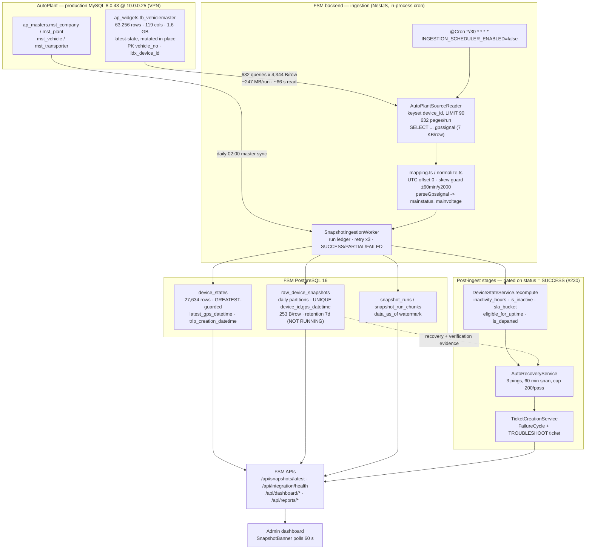
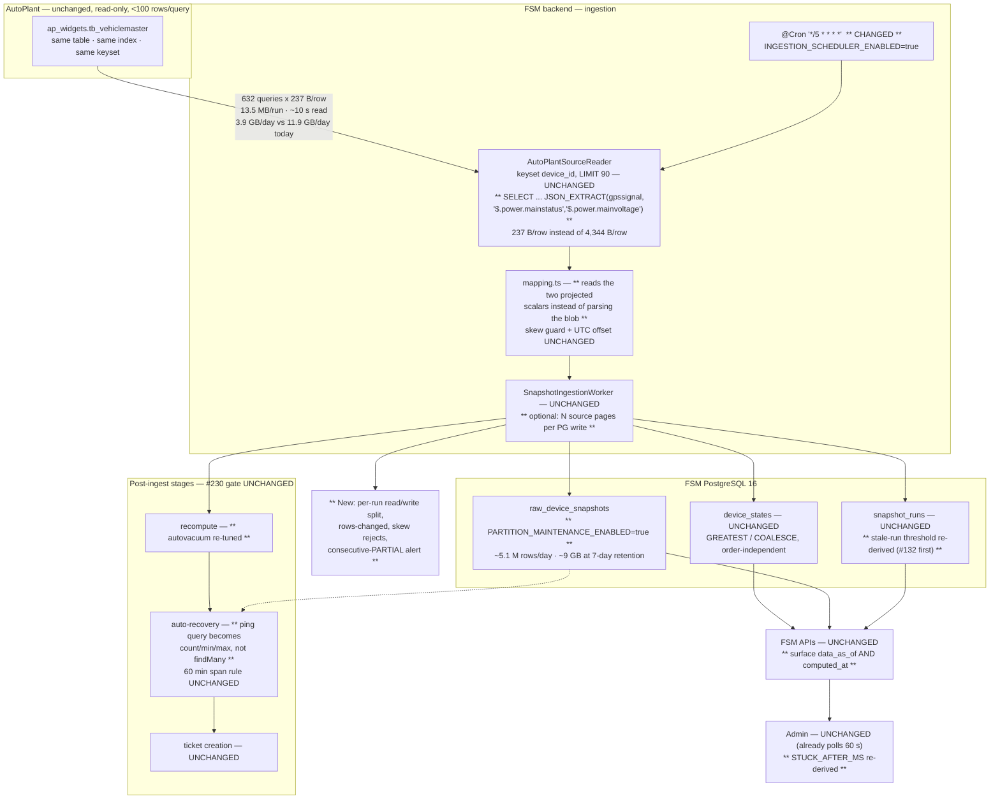

# Near-Real-Time AutoPlant → FSM Ingestion — Feasibility Investigation

**Date:** 2026-08-13 · **Branch:** `feat/autoplant-integration` · **Status:** investigation only, nothing
implemented, nothing modified.

**Scope of access used.** Read-only throughout. AutoPlant MySQL was reached over the live VPN with the
existing `bi_enroute_readonly` account; every statement was a `SELECT`/`SHOW`/`EXPLAIN`, aggregate-first,
and every row-listing query carried `LIMIT 90` — the DBA's `< 100 rows/query` cap was honoured on every
call. FSM Postgres was read with `default_transaction_read_only = on`. No DDL, no migrations, no writes,
no config changes, no test changes.

**Evidence labelling.** Every material claim below carries one of:
`[CODE]` verified from source in this repo · `[LIVE-AP]` verified from the live AutoPlant MySQL
(2026-08-13, 10:36–10:52 UTC) · `[LIVE-FSM]` verified from the live FSM Postgres · `[DOC]` verified from
repository documentation · `[INFERRED]` reasoned from the above, not directly observed ·
`UNVERIFIED — insufficient evidence` where nothing supports a conclusion.

---

# Executive Summary

**Yes — FSM can ingest AutoPlant telemetry substantially more frequently, and the reason is not the one
the question implies.**

The current 30-minute cadence is not limited by the DBA row cap, by AutoPlant's capabilities, or by any
missing change-detection mechanism. It is limited by a single implementation detail: **the telemetry
reader pulls a ~7 KB JSON document (`gpssignal`) for every device in order to extract two scalar
fields.** That one column accounts for 85% of a run's wall-clock time and 95% of its network bytes.

Measured on the live source `[LIVE-AP]`, same plan, same 90-row page:

| Reader projection | Median latency | Bytes/row | Full-fleet scan (56,837 rows) |
|---|---:|---:|---:|
| Production shape today (`…, gpssignal`) | **104 ms** | **4,344 B** | ~66 s read, **~247 MB** |
| Same, with `JSON_EXTRACT` pushed into SQL | **16 ms** | **237 B** | ~10 s read, **~13.5 MB** |

Corroborated end-to-end by snapshot run 159 (today, live) `[LIVE-FSM]`: 632 chunks, 207 s wall clock, of
which the Postgres write side averaged **47.4 ms/chunk** and the AutoPlant read side averaged
**280.6 ms/chunk**. The source read is the bottleneck, and the payload is the read.

**Recommendation: keep the existing single deterministic `device_id` keyset scan exactly as it is,
project the two `gpssignal` fields server-side, and move the cadence from 30 minutes to 5 minutes.**

That gives ~6× fresher data while moving **three times fewer bytes per day than the current 30-minute
cadence would move if the scheduler were switched on today** (3.9 GB/day vs 11.9 GB/day `[INFERRED]` from
the measured per-row sizes). No new architectural concept, no change cursor, no source-side mechanism, no
new runtime component, no change to what any FSM business rule means.co

**Three things must land before the cadence flips, and they are not optional:**

1. `PARTITION_MAINTENANCE_ENABLED` must be `true`. It is `false` today `[CODE]`, and every ping since
   2026-07-11 has landed in the `DEFAULT` partition — 1,217,502 rows / 294 MB `[LIVE-FSM]`. Retention has
   never run. A 5-minute cadence writes ~5.1 M rows/day `[INFERRED]`.
2. Issue **#132** (the stale-run reaper reaping still-alive runs) must be closed. `INGESTION_STALE_RUN_MIN`
   is 45 min against a 30-min cadence today; at 5 minutes the margin arithmetic changes entirely `[CODE]`.
3. The three cadence-coupled constants must move together with the cron: `INGESTION_STALE_RUN_MIN` (45),
   `SnapshotBanner.STUCK_AFTER_MS` (15 min), and the auto-recovery per-candidate ping query (which
   currently fetches every ping row and would fetch ~6× more) `[CODE]`.

**What we found that changes the business case.** FSM's three-phase GPS verification requires no gap
greater than 30 minutes between consecutive pings (`MAX_GAP_MIN = 30`) `[CODE]`. A 30-minute sampler
cannot reliably produce such a series — measured over the FSM journal's last 36 hours, **69.2% of
consecutive-ping gaps exceed 30 minutes** `[LIVE-FSM]`. Verification is therefore structurally
unsatisfiable at the current cadence. This is an existing latent defect that fresher ingestion **fixes**;
it is also the one place where fresher data genuinely changes an outcome, and it must be sequenced
deliberately rather than arriving as a side-effect.

**What we explicitly do not recommend.** No CDC, no binlog, no incremental cursor, no separate
high-frequency worker, no sub-minute polling. Each is rejected below on measured evidence, not on taste.

---

# Current Ingestion Architecture

## The traced path

```
ap_widgets.tb_vehiclemaster (MySQL 8.0.43 @ 10.0.0.25, over OpenVPN)
   │  SELECT device_id, latest_gps_datetime, latitude, longitude, speed,
   │         IGNITION_STATUS, DEVICE_TYPE, TRIP_CREATION_DATETIME, gpssignal
   │  WHERE latest_gps_datetime IS NOT NULL AND device_id IS NOT NULL
   │        AND TRIM(device_id) <> '' [AND device_id > ?]
   │  ORDER BY device_id LIMIT 90
   ▼
AutoPlantMysqlClient          read-only guard (SELECT/SHOW/DESCRIBE/DESC/EXPLAIN only),
                              30 s statement timeout, 10 s connect timeout, pool of 4,
                              dateStrings:true, default schema ap_masters
   ▼
AutoPlantSourceReader         keyset page → mapVehicleMasterRow() per row
   ▼
mapping.ts / normalize.ts     UTC offset 0, gpssignal.power.{mainstatus,mainvoltage} extracted,
                              two-directional skew guard (future +60 min / past year-2000),
                              rejects counted per chunk and WARNed
   ▼
SnapshotIngestionWorker       opens snapshot_runs RUNNING, drains chunk-by-chunk,
                              3 attempts/chunk with exponential backoff, records
                              snapshot_run_chunks, finalises SUCCESS / PARTIAL / FAILED
   ▼
SnapshotIngestionService      (a) createMany → raw_device_snapshots, skipDuplicates
                              (b) one set-based INSERT…SELECT unnest(…) JOIN devices
                                  ON CONFLICT DO UPDATE → device_states.latest_gps_datetime
                                  (GREATEST), trip_creation_datetime (GREATEST),
                                  first_reported_at (COALESCE, write-once)
   ▼
IntegrationSyncService.runPostIngestStages()   ── gated on snapshot status === 'SUCCESS' (#230)
   ├─ DeviceStateService.recompute()      inactivity_hours, is_inactive, sla_bucket,
   │                                      eligible_for_uptime, is_departed, denormalised fitment
   │                                      + device_state_recomputes ledger + ±5% eligible canary
   ├─ AutoRecoveryService.runAutoRecovery()   healthy device + ≥3 pings + ≥60 min span
   │                                          → CLOSED_AUTO_RECOVERY, capped 200/pass
   └─ TicketCreationService.createForInactiveEligible()   inactive ∧ eligible ∧ no open cycle
   ▼
FSM APIs      /api/snapshots/latest · /api/integration/health · /api/dashboard/* · /api/reports/*
   ▼
Admin         SnapshotBanner (polls every 60 s, "stuck" after 15 min RUNNING) + dashboards
```

Source references `[CODE]`: `autoplant-source-reader.ts:87-134`, `autoplant-mysql.client.ts:56,60,104,179`,
`mapping.ts:45,74,95,207`, `snapshot-ingestion.worker.ts:50-137`, `snapshot-ingestion.service.ts:44-161`,
`integration-sync.service.ts:94-168`, `device-state.service.ts:71-208`,
`integration-scheduler.service.ts:21-23,70-85`, `SnapshotBanner.tsx:17-18`.

## Exact current behaviour, stated precisely

**Scheduling.** `@Cron('*/30 * * * *')` named `ingestion-telemetry`, master switch
`INGESTION_SCHEDULER_ENABLED`, currently **`"false"`** `[CODE]`. Cron strings are resolved once at
decorator evaluation, so a change needs a restart; the enabled/configured gate is re-checked per tick.
Masters sync is separate, daily at `0 2 * * *`. Because the scheduler is off, production runs today are
manual: **11 snapshot runs in the last 7 days** `[LIVE-FSM]`.

**Pagination.** Keyset on the immutable `device_id` (`ORDER BY device_id`, `device_id > ?`), page size 90
on the tick path (`integration-sync.service.ts:95`). Deliberately **no** `latest_gps_datetime` predicate
and **no** cross-run resume cursor — the reader's docstring argues this at length and the argument is
sound: ordering on an immutable key gives termination in ⌈N/90⌉ queries and makes it impossible for a
device that re-pings mid-scan to be either re-harvested or skipped `[CODE]`.

**Two cursors, deliberately asymmetric.** `snapshot_runs.data_as_of` is the conservative *display*
watermark (high-water of succeeded chunks; never advances on lost data). `snapshot_runs.cursor` is the
optimistic *re-read floor*. Neither gates which rows are scanned `[CODE]`.

**Idempotency.** `raw_device_snapshots` has `UNIQUE (device_id, gps_datetime)`; the writer is
`createMany({ skipDuplicates: true })` → `ON CONFLICT DO NOTHING`. Re-reads and overlaps are free `[CODE]`.

**The partial-ingest gate (#230).** Device-state derivation, auto-recovery and ticket creation all run
behind `snapshotStatus === 'SUCCESS'`. A PARTIAL/FAILED run produces *less* data, never *confidently
wrong* data `[CODE]`. This gate is load-bearing for everything proposed here.

**Guards.** `snapshot_runs_one_in_flight` partial unique `WHERE status='RUNNING'` plus a transaction-scoped
`pg_try_advisory_xact_lock`. An overlapping scheduled tick returns `{skipped: true, reason:
'RUN_IN_PROGRESS'}` rather than throwing. `reapStaleRuns()` fails runs stuck RUNNING past
`INGESTION_STALE_RUN_MIN` (45 min, `.env`) `[CODE]`.

## Measured current cost — snapshot run 159, today

`[LIVE-FSM]`, `snapshot_run_chunks` timestamps for `run_id = 159` (started 10:11:28 UTC, finished
10:14:55 UTC):

| Metric | Value |
|---|---:|
| Chunks | 632 (all SUCCESS, 0 retries) |
| Wall clock | **207 s** |
| Postgres write per chunk (`created_at`→`updated_at`) | **47.4 ms avg** |
| AutoPlant read + ledger insert per chunk (inter-chunk gap) | **280.6 ms avg, 906.5 ms p95** |
| Share of run spent on the source read | **~85%** |

Recent run durations `[LIVE-FSM]`: 159 = 207 s, 158 = 160 s, 157 = 167 s, 156 = 229 s, 155 = 158 s,
154 = **610 s**, 152 = 225 s. Run 153 is the #230 incident (PARTIAL after 29 of 632 chunks).

Historical corroboration `[DOC]`: `docs/audits/2026-07-07-production-validation-audit.md:208` records
"snapshot ingest 353s (network-bound to AutoPlant)". The diagnosis "network-bound" was correct; the cause
was never isolated to the payload.

---

# AutoPlant Source Analysis

## Server and account

`[LIVE-AP]`

| Fact | Value |
|---|---|
| Version / host | MySQL **8.0.43**, `ip-10-0-0-25.ap-south-1.compute.internal` |
| `@@system_time_zone` / `@@session.time_zone` | `UTC` / `SYSTEM` |
| `@@sql_select_limit` | 18446744073709551615 (**unset — no server-side row cap**) |
| `@@max_execution_time` | `0` (**no server-side statement timeout**) |
| `@@transaction_isolation` | `REPEATABLE-READ` |
| `@@log_bin` / `@@binlog_format` / `@@server_id` / `@@gtid_mode` | `1` / `ROW` / `2` / `OFF` |
| `max_connections` / in use at probe | 151 / **6** |
| Grants for `bi_enroute_readonly@%` | `SELECT ON *.*`; `SELECT` on `ap_company`, `ap_gpsmw`, `ap_masters`; `SELECT, SHOW VIEW` on `ap_widgets`, `ap_etl`, `ap_vehicle` |

**No `REPLICATION SLAVE`, `REPLICATION CLIENT`, `PROCESS`, or `SUPER` grant exists on this account.**
Binary logging is on server-side, but this account cannot read it, list it, or attach a replication
stream to it.

## Accessible schemas

`[LIVE-AP]`

| Schema | Tables | Approx rows | Size |
|---|---:|---:|---:|
| `ap_widgets` | 54 | 90,247,295 | **63.8 GB** |
| `ap_masters` | 43 | 2,660,966 | 0.9 GB |
| `ap_gpsmw` | 5 | 0 | 0 |
| `ap_etl` | 9 | 0 | 0 |

`ap_gpsmw` — the GPS-middleware schema, and the only plausible home for an append-only raw-packet feed —
contains `ng_gps_data`, `ng_gps_data_arch`, `rawdata`, `tbl_ap_outword_integration`, `hibernate_sequence`.
**All are empty** (`SELECT COUNT(*)` returned 0 for `ng_gps_data` and `rawdata`) `[LIVE-AP]`. Whether raw
packets live on a different host is **UNVERIFIED — insufficient evidence**; from this connection there is
no append-only telemetry source.

## `ap_widgets.tb_vehiclemaster` — the one telemetry table FSM reads

`[LIVE-AP]`

| Property | Value |
|---|---|
| Engine / rows | InnoDB / **63,256** actual (`information_schema` estimate 70,694) |
| Size | **1,610 MB data + 41 MB index** (~26 KB/row) |
| Columns | **119** |
| `UPDATE_TIME` at probe | `2026-08-13 10:36:16` — mutating continuously |
| Rows with non-null `latest_gps_datetime` | **56,837** |
| Rows with non-null, non-blank `device_id` | **63,256** |
| Duplicate `device_id` | **0** |
| Duplicate `vehicle_no` | **0** (it is the PK) |

**It is a latest-state table, one row per vehicle, mutated in place. There is no history, no versioning,
and no append-only variant.** `[LIVE-AP]` + `[DOC]`

### Indexes

`[LIVE-AP]` (`SHOW INDEX`)

| Key | Columns | Notes |
|---|---|---|
| `PRIMARY` | `vehicle_no` | cardinality 103,419 |
| `idx_device_id` | `device_id` | cardinality 63,228 — **this is what the current scan rides** |
| `idx_vehiclemaster_deviceid_gpsdatetime` | `device_id`, `latest_gps_datetime` **DESC** | covering for the (id, timestamp) pair |
| `tb_vehicles_indx` | `plant_id`, `transporter_id`, `vehicle_no` | |
| `index_name` | `transporter_code`, `hierarchy_path` | |
| `idx_plantid` | `plant_id` | |

**No index leads with `latest_gps_datetime`, `insertion_datetime`, `RECORD_UPDATED_DATE`, `MODIFIED_DT`,
or any other time column.** This single fact governs every incremental-read option below.

### Payload profile — the finding that drives the recommendation

`[LIVE-AP]`

| Column | Avg length | Max | Total across table |
|---|---:|---:|---:|
| `gpssignal` (JSON) | **7,296 B** | **203,753 B** | **356 MB** |
| `current_location` (longtext) | 86 B | — | 5 MB |

FSM reads exactly two values out of that 7 KB document: `power.mainstatus` and `power.mainvoltage`
(`mapping.ts parseGpssignal`) `[CODE]`. Everything else is transferred over the VPN and discarded in
process memory.

### Time semantics and data hazards

`[LIVE-AP]`, confirming the #222 findings independently:

- Server UTC at probe `2026-08-13 10:38:01`; `MAX(latest_gps_datetime)` = `2026-08-13 16:07:46` — **5.5 h
  in the future**. Exactly **5** rows sit ahead of `UTC_TIMESTAMP()`, **5** ahead of +60 min, **4** ahead
  of +5 h. These are the ~5 IST-writing devices #222 documented; the reader's 60-minute future-skew guard
  rejects them and counts the rejection `[CODE]`.
- `MAX()` remains an invalid probe for this source's timezone contract — five devices out of 56,837
  decide it. Percentiles are the only honest instrument. `[DOC]` #222.
- `latest_gps_datetime` is a **device event clock**, not a server write clock. That distinction is the
  reason it cannot be used as a change cursor (below).

### Fleet freshness distribution — how fresh "current" can even be

`[LIVE-AP]`, devices with non-blank `device_id`, measured 10:38 UTC:

| Devices whose `latest_gps_datetime` is within | Count | % of 56,837 pinged |
|---|---:|---:|
| 1 minute | **5,103** | 9.0% |
| 5 minutes | **17,697** | 31.1% |
| 10 minutes | 18,285 | 32.2% |
| 30 minutes | 18,951 | 33.3% |
| 60 minutes | 19,332 | 34.0% |
| 24 hours | 21,498 | 37.8% |

Read this carefully — it is the single most important number for choosing a cadence:

- The **actively-reporting fleet is ~18,000–19,000 devices**. Between the 5-minute and 30-minute marks
  the population grows by only 1,254 devices (7%). Essentially every device that is alive reports inside
  5 minutes.
- **The devices' own ping period is roughly 1–5 minutes.** 5,103 report per minute; 17,697 report per
  5 minutes.
- **Consequence: polling faster than ~1 minute cannot make data fresher** — it would re-read rows that
  have not changed. The irreducible floor on end-to-end freshness is the device's own reporting period,
  not FSM's polling period.
- **Consequence: an "incremental" read at 30-minute cadence saves nothing.** 18,951 of the 56,837 rows
  changed in the last 30 minutes; the incremental set *is* the active fleet.

### Scope mismatch worth naming

`tb_vehiclemaster.vehicle_deployment_status` and `ap_masters.mst_vehicle.deployment_status` **do not
agree** `[LIVE-AP]`:

| Status | `tb_vehiclemaster` | `mst_vehicle` |
|---|---:|---:|
| DEPLOYED | 7,177 | 15,573 |
| UNDEPLOYED | 46,233 | 35,511 |
| ACTIVE | 9,591 | 40 |
| MAINTENANCE | 253 | 278 |

The widgets-side status is therefore **not** a usable scope filter for the telemetry read. FSM's own scope
(DEPLOYED vehicles in ACTIVE plants) resolves to **19,405** vehicles `[LIVE-AP]` against **27,634**
`device_states` rows `[LIVE-FSM]` (the difference being accumulated departed/historical devices).

---

# Change Detection / Incremental Read Analysis

The instruction was to assume nothing. Here is what actually exists, tested one mechanism at a time.

## 1. `insertion_datetime` — a real change marker, unusable at speed

`[LIVE-AP]` Column 112: `timestamp NULL DEFAULT CURRENT_TIMESTAMP **ON UPDATE CURRENT_TIMESTAMP**`.
MySQL maintains it automatically on any UPDATE that changes at least one column.

**Does it actually track telemetry changes?** Tested directly:

| Probe | Result |
|---|---:|
| Rows with a sane (non-future) `latest_gps_datetime` in the last 5 min | 17,712 |
| …of which `insertion_datetime IS NULL` | **1** |
| …of which `insertion_datetime` is older than 5 min | **0** |

So for rows that are actually moving, it is a **faithful superset** of telemetry change (it also catches
non-telemetry updates: 9,647 rows changed in 1 min vs 5,103 GPS advances). One row in 17,712 is missed —
a small but non-zero miss rate.

**Why it is nonetheless unusable:**

- **64.6% NULL** — 40,878 of 63,256 rows `[LIVE-AP]`. A predicate on it silently excludes two-thirds of
  the table, so any incremental reader needs an `IS NULL` fallback that re-admits the full population.
- **No index.** `EXPLAIN` on `WHERE insertion_datetime > ?` → `type: ALL`, `key: NULL`, `rows: 62,114`,
  `Extra: Using where; Using filesort` — **a full scan of the 1.6 GB table, per page** `[LIVE-AP]`.
- **Measured cost: 438 ms median per 90-row page** vs 13–16 ms for the indexed shapes — **~30× worse**
  `[LIVE-AP]`.
- Creating an index on a 1.6 GB production table is a DBA action outside this investigation's authority.

**Verdict: rejected.** Documented here because it is the only genuine source-side change marker that
exists, and because it becomes viable *if and only if* the DBA adds
`INDEX (insertion_datetime)`. That is an open question, not a plan.

## 2. `latest_gps_datetime` as a cursor — rejected on correctness, not cost

The brief said not to assume this is suitable. It is not, for three independent reasons:

- **It is a device clock, not a server clock** `[LIVE-AP]`. Five devices currently write timestamps 5.5 h
  in the *future*. A device whose clock runs *behind* real time would sit permanently below any
  fleet-wide watermark and be **silently excluded from every future read** — which FSM would then age
  into `is_inactive` and open a Failure Cycle for. That is the #230 failure mode reached by a different
  road.
- **The index cannot seek on it.** It is the *second* column of
  `idx_vehiclemaster_deviceid_gpsdatetime`, so `EXPLAIN` shows `type: index` (full covering index scan)
  + `Using filesort`, not `type: range` `[LIVE-AP]`. Cheap (13 ms) because the index is only 41 MB, but
  O(fleet) per page regardless of the window.
- **It saves nothing at any cadence FSM would use.** 18,951 of 56,837 rows change per 30 minutes; 17,697
  per 5 minutes. The "incremental" set is 93% of the "full" set at 5 minutes `[LIVE-AP]`.

The existing reader docstring already argues points 1 and 3 from first principles. The live data confirms
it. **Verdict: rejected, and the current design is right.**

## 3. `tb_vehiclemaster_logs` — a change log, but the wrong changes

`[LIVE-AP]` This looked like the answer: `id BIGINT AUTO_INCREMENT PRIMARY KEY`, `device_id`,
`event_type`, `insertion_time`, `payload JSON`, `vehicle_no`. Append-only, monotonic id, 42,095 rows,
359 MB, `UPDATE_TIME` current.

Then:

```
event_type | n      | first_seen           | last_seen
DELETE     | 42,095 | 2025-08-05 14:04:53  | 2026-08-13 10:36:04
```

**Every row is a `DELETE`.** Recent volume: 124–296 rows/day. It records vehicle-master row *removals*,
not telemetry mutations.

**Verdict: not a telemetry change feed.** It is, however, a genuinely useful find for a different
problem — it is a durable, monotonic record of devices vanishing from the source, which is exactly the
`MISSING_FROM_SOURCE` case #128 and #227 currently have to infer by absence-diffing. Filed as an
observation, out of scope here.

## 4. Binlog / CDC

`[LIVE-AP]` `log_bin = 1`, `binlog_format = ROW`, `server_id = 2`, `gtid_mode = OFF`. The binlog exists
and is in the right format for CDC.

It is nonetheless not available:

- The account holds `SELECT` only — no `REPLICATION SLAVE` / `REPLICATION CLIENT` `[LIVE-AP]`.
- `gtid_mode = OFF` means a consumer must track file+position, which makes failover and restart
  materially harder.
- FSM's stack is a NestJS modular monolith with **in-process `@nestjs/schedule` cron and no Redis, no
  BullMQ, no message broker, no object store** `[DOC]` `CLAUDE.md`. A CDC pipeline (Debezium/Kafka or
  equivalent) is a new runtime tier, new operational surface, and new failure domain — for a source
  whose devices only report every 1–5 minutes anyway.

**Verdict: rejected on architectural consistency and cost/benefit, not on impossibility.** Whether the
DBA would provision a replication user is **UNVERIFIED — insufficient evidence**; it is listed as an open
question, but the recommendation does not depend on the answer.

## 5. Other mechanisms checked and found absent

`[LIVE-AP]`

- **No API, webhook, or push endpoint** from AutoPlant to FSM — nothing in the codebase or docs
  references one, and none was found. `UNVERIFIED — insufficient evidence` that one exists at all.
- **No audit/history table for `tb_vehiclemaster`.** `ap_widgets` contains Hibernate Envers artefacts
  (`revinfo`, `tb_defaultchoosecolumn_aud`, `tb_violationconfigmaster_aud`) but **only for two config
  tables**, not for the vehicle master.
- **No sequence or monotonic id on `tb_vehiclemaster`** — the PK is `vehicle_no` (a string), and there is
  no auto-increment column among the 119.
- **`RECORD_UPDATED_DATE` (col 117) and `MODIFIED_DT` (col 108)** exist but are application-maintained,
  unindexed, and not covered by any `ON UPDATE` clause — strictly weaker than `insertion_datetime`, which
  is already rejected.
- **`tb_vehiclemaster_og`, `temp_table`, `execution_status`, `backup_progress`** — all 0 rows.

## 6. Key stability — the assumption the whole design rests on

`[LIVE-AP]`

- `device_id`: 63,256 non-null values, **0 duplicates**. Effectively unique, though **not enforced by a
  constraint** — `idx_device_id` is `Non_unique: 1`. The keyset scan's no-skip guarantee therefore rests
  on an *observed* property, not a declared one. This is worth a standing assertion in the reader rather
  than a comment.
- `vehicle_no`: PK, 0 duplicates. Stable.
- The source **rewrites fitment in place** — `[DOC]` measured 10,565 devices have had
  `first_installed_dt` moved, 1,757 by more than a year. This is why FSM keeps `device_commissioning` as
  an append-only side table. Nothing here changes that.

---

# DBA / Performance Constraints

## What the cap actually is

`[DOC]` `docs/archive/autoplant-integration-session-handoff.md:38`:

> **DBA constraint (CONFIRMED HARD RULE, 2026-07-04):** `10.0.0.25` is the company's **production**
> database. Every query MUST carry a `LIMIT` **below 100** — the team made this compulsory, not guidance.

`[LIVE-AP]` **It is a policy, not a server-enforced limit**: `@@sql_select_limit` is unset (unbounded) and
`@@max_execution_time` is 0. Nothing on the server would stop a 60,000-row query. The cap holds because
the code holds it — and it should keep holding it.

## What the cap does and does not constrain

**It caps rows returned per query. It says nothing about query count, query frequency, or bytes.** That
is a literal reading, and it is the reading every existing FSM read already relies on (632 queries per
telemetry run, ~216 per master sync).

But the cap's *intent* is plainly "do not put load on production." Query volume is therefore the thing to
put in front of the DBA, and the honest framing is:

> "We are proposing 6× more queries per day against `tb_vehiclemaster`, each still ≤90 rows — **and 3×
> fewer bytes per day than today**, because we are going to stop pulling a 7 KB JSON blob per row to read
> two numbers out of it."

## Load per cadence — measured, not modelled

Basis `[LIVE-AP]`: 56,837 rows pass the reader's WHERE clause → **632 pages of 90**. Per-page median
latency measured over the live VPN, 3 reps each, all pages ≤90 rows.

### Current projection (with `gpssignal`) — 104 ms/page, 4,344 B/row

| Cadence | Runs/day | Queries/day | Source read time/run | Bytes/run | **Bytes/day** | Feasible? |
|---|---:|---:|---:|---:|---:|---|
| 30 min (today's default) | 48 | 30,336 | ~66 s (obs. 207 s wall) | 247 MB | **11.9 GB** | Yes — current design |
| 10 min | 144 | 91,008 | ~66 s | 247 MB | 35.6 GB | Marginal; 207 s run vs 600 s window |
| 5 min | 288 | 182,016 | ~66 s | 247 MB | 71.1 GB | **No** — 207 s run in a 300 s window, no headroom |
| 1 min | 1,440 | 910,080 | ~66 s | 247 MB | 355 GB | **No** — run exceeds the window ~3.5× |
| Continuous | — | — | — | — | — | **No** |

### With server-side `JSON_EXTRACT` — 16 ms/page, 237 B/row

| Cadence | Runs/day | Queries/day | Source read time/run | Bytes/run | **Bytes/day** | Duty cycle | Feasible? |
|---|---:|---:|---:|---:|---:|---:|---|
| 30 min | 48 | 30,336 | **~10 s** | 13.5 MB | **0.65 GB** | 3.3% | Yes |
| 10 min | 144 | 91,008 | ~10 s | 13.5 MB | 1.9 GB | 10% | Yes |
| **5 min** | **288** | **182,016** | **~10 s** | **13.5 MB** | **3.9 GB** | **~20%** | **Yes — recommended** |
| 1 min | 1,440 | 910,080 | ~10 s | 13.5 MB | 19.4 GB | ~100% | **No** — zero headroom, and buys nothing (see below) |
| Continuous | — | — | — | — | — | 100% | **No** |

Duty cycle = (read time + Postgres write time) / window. At 5 minutes the projected full pipeline run is
~60 s of a 300 s window `[INFERRED]` from 631 × (16 ms read + ~20 ms ledger + 47.4 ms write) ≈ 52 s, plus
recompute/recovery/creation. Twenty percent duty cycle leaves room for a slow run, a retry storm, and a
VPN hiccup without a tick ever colliding with its predecessor.

**Why 1-minute polling is rejected even though it is arithmetically borderline:** the devices themselves
report every 1–5 minutes `[LIVE-AP]`. At 1-minute polling, 51,734 of the 56,837 rows read per pass would
be unchanged — 91% pure waste, for a freshness gain bounded below by the device's own reporting period.
It costs 5× the query volume for a fraction of a minute of real freshness.

## Concurrency and connection headroom

`[LIVE-AP]` `max_connections = 151`, 6 in use at probe time. The FSM pool is `connectionLimit: 4` and the
reader is strictly serial (one page at a time) `[CODE]`. Even at 5-minute cadence FSM occupies 1
connection ~20% of the time. **Connections are not a constraint.**

## Safety practices that must not change

- Every source read stays ≤90 rows. Non-negotiable.
- The `READ_ONLY_PREFIXES` guard in `AutoPlantMysqlClient.query()` stays `[CODE]`.
- `AUTOPLANT_QUERY_TIMEOUT_MS` (30 s) and `connectTimeout` (10 s) stay or tighten — at 5-minute cadence a
  30 s statement timeout is 10% of the window, which is already generous.
- **One transient `connect ETIMEDOUT` was observed during this session's probing** `[LIVE-AP]`. The VPN
  is not continuously reliable; this is a design input, not an anomaly.

---

# FSM PostgreSQL Impact

## Current state

`[LIVE-FSM]` (dev Postgres 16.14 @ `localhost:5433/fsm`)

| Table | Rows | Size |
|---|---:|---:|
| `raw_device_snapshots_default` | **1,217,502** | **294 MB** (**253 B/row** incl. indexes) |
| `raw_device_snapshots_y2026m07d01..d11` | 32–992 each | 264 kB – 64 MB |
| `device_states` | 27,634 | 15 MB |
| `devices` | 27,634 | 5.9 MB |
| `tickets` / `failure_cycles` | 28,173 / 28,173 | 19 MB / 8 MB |
| `ticket_events` | 49,990 | 8 MB |
| `snapshot_run_chunks` | 53,973 | 9.2 MB |

`device_states` profile: 27,634 total · 2,118 never pinged · 3,187 inactive · 15,587 eligible · 13,156
with an open failure cycle · `computed_at` = 2026-08-13 10:14:55.

**Two problems visible immediately, both pre-existing and both aggravated by higher frequency:**

1. **Partition maintenance has never run.** `PARTITION_MAINTENANCE_ENABLED="false"` `[CODE]`; the dated
   partitions stop at 2026-07-11 and everything since — 1.2 M rows — is in `DEFAULT` `[LIVE-FSM]`.
   Retention (`telemetry_retention_days = 7` `[LIVE-FSM]`) has therefore never dropped anything. At
   30-minute cadence this is a slow leak; at 5-minute cadence it is a fast one.
2. **23% of the journal is for devices FSM does not master.** Of 81,495 snapshot rows in the last 2 days,
   **18,853 belong to `device_id`s with no row in `devices`** `[LIVE-FSM]`. They are journalled (there is
   no FK on `raw_device_snapshots`) and then skipped by the `device_states` upsert's INNER JOIN `[CODE]`.
   Pure storage waste, scaling linearly with cadence.

## Projected impact by cadence

Basis `[INFERRED]` from `[LIVE-AP]` change counts and the measured 253 B/row:

| Cadence | New rows/run | Rows/day | Storage/day | 7-day retained | `device_states` UPDATEs/day |
|---|---:|---:|---:|---:|---:|
| 30 min (scheduler on) | 18,951 | 910 k | 230 MB | 1.6 GB | 1.33 M row-versions |
| 10 min | 18,285 | 2.63 M | 666 MB | 4.7 GB | 3.98 M |
| **5 min** | **17,697** | **5.10 M** | **1.29 GB** | **9.0 GB** | **7.96 M** |
| 1 min | 5,103 | 7.35 M | 1.86 GB | 13.0 GB | 39.8 M |

Scoping the read to FSM-mastered devices would cut ~23% off every row in the storage columns.

## Subsystem-by-subsystem

**`raw_device_snapshots`.** The unique key is `(device_id, gps_datetime)`. **Row volume is bounded by the
devices' real ping rate, not by our polling rate** — polling faster reduces *aliasing* (pings we currently
miss between samples), it cannot fabricate rows. At 30-minute polling FSM captures at most 48 of a
device's ~288–1,440 daily pings; at 5-minute polling it captures at most 288. Growth is real and
proportional; nothing about it is spurious.

**`device_states`.** The write path is already correct for any frequency: one set-based
`INSERT … SELECT unnest(…) JOIN devices … ON CONFLICT DO UPDATE` with `GREATEST` on both timestamp
columns and `COALESCE` on the write-once `first_reported_at` `[CODE]`. It **cannot regress** on a
replayed, overlapping, or out-of-order chunk. No change needed.

**Recompute.** `DeviceStateService.recompute()` issues one `UPDATE device_states` touching **every one of
27,634 rows** inside a transaction, followed by an invariant assertion and a ledger insert `[CODE]`. At
5-minute cadence that is ~7.96 M row-versions/day on a 15 MB table `[INFERRED]`. This is the single
largest new write pressure and it is **not** in the ingest path — it is in the derive path. Autovacuum
tuning and/or a `WHERE` clause that skips genuinely-unchanged rows should be measured before the cadence
flips. **Flagged as needing measurement, not assumed safe.**

**Auto-recovery.** For each of up to 200 candidates per pass it runs
`rawDeviceSnapshot.findMany({ where: { deviceId, gpsDatetime: { gt: cycle.openedAt } } })` — **fetching
every ping row** to compute a count, a min and a max `[CODE]`. With 13,156 open cycles `[LIVE-FSM]` and
~6× the ping density, this query gets ~6× heavier and runs 6× more often. It should become an aggregate
(`count`/`min`/`max`) rather than a row fetch. **This is a required change, not an optimisation.**

**Verification.** Same shape (`findMany` over pings since submission), same ~6× growth `[CODE]`.
Currently dormant — `verification_runs` has **0 rows** `[LIVE-FSM]`.

**Partitioning and locking.** `CREATE TABLE … PARTITION OF` and `DROP TABLE` both take `ACCESS EXCLUSIVE`
on the parent `raw_device_snapshots` `[CODE]` `partition-maintenance.service.ts:92-100`. Daily
maintenance at `10 0 * * *` will collide with a 5-minute tick roughly once a day. The collision window is
milliseconds and the ingest side will simply wait, but it should be verified rather than assumed.

**Concurrency.** Unchanged. The single-in-flight guard (partial unique + advisory lock) already serialises
runs, and an overlapping tick degrades to a logged `RUN_IN_PROGRESS` skip `[CODE]`. At 5-minute cadence
with a ~60 s run there is no realistic overlap.

**Dashboard freshness.** `SnapshotBanner` already polls every **60 s** `[CODE]`. The admin side is not the
constraint and needs no change — except `STUCK_AFTER_MS` (below).

---

# Live State vs Durable State

**The existing architecture already makes this distinction correctly, and no new concept is required.**

| Concern | Table | Semantics | Fit for higher frequency |
|---|---|---|---|
| **Live / current state** | `device_states` | One hot row per device. `latest_gps_datetime` and `trip_creation_datetime` maintained at ingest under `GREATEST`; `first_reported_at` write-once under `COALESCE`; derived fields recomputed from wall clock | **Already correct.** Monotone, idempotent, order-independent. Nothing to change. |
| **Durable / historical journal** | `raw_device_snapshots` | One row per observed `(device_id, gps_datetime)`. Daily RANGE partitions, `ON CONFLICT DO NOTHING`, 7-day retention | **Already correct.** Grows proportionally; retention is O(1) `DROP TABLE`. |
| **Evidence watermark** | `snapshot_runs.data_as_of` | High-water `gps_datetime` across *succeeded* chunks; never advances on lost data | **Already correct.** |
| **Derivation timestamp** | `device_states.computed_at` | When the derive pass last ran | Correct, but see below |

**The one honest gap.** `computed_at` answers "when did we last recompute", while `data_as_of` answers
"how fresh is the evidence". Under #230's `skipDerivation` these deliberately diverge — `computed_at`
lags to signal "this picture is stale-but-true" `[CODE]`. At 30-minute cadence a divergence is a rare,
visible event. At 5-minute cadence, with 288 chances a day for a PARTIAL run, a persistent divergence is
plausible and would be invisible on the current surfaces. **The fix is display and monitoring, not a new
state concept:** surface both timestamps, and alert on consecutive non-SUCCESS runs.

**Explicitly: no "live telemetry cache", no "hot state" table, no separate real-time store is warranted.**
The proposal changes how often the existing pipeline runs, not what it means.

---

# Candidate Architectures

Every option was evaluated against the same criteria. Measured figures are `[LIVE-AP]` / `[LIVE-FSM]`;
projections are `[INFERRED]`.

## A — Status quo: 30-minute full keyset scan, fat projection

| | |
|---|---|
| Freshness | 30–34 min worst case (cadence + 3.5 min run) |
| Correctness | High — the keyset design is sound |
| Query volume | 30,336/day · **11.9 GB/day** |
| Complexity | Zero (already built) |
| Verdict | **Baseline. Leaves the verification `MAX_GAP_MIN=30` defect unfixed and moves 3× more bytes/day than option C.** |

## B — Same reader, cadence to 5 or 10 minutes, no projection change

| | |
|---|---|
| Freshness | 5–9 min |
| Query volume | 182,016/day · **71 GB/day** |
| Duty cycle | 207 s run in a 300 s window = **69%** |
| Verdict | **Rejected.** No headroom for a slow run; the #132 reaper interacts badly; 6× the bytes at production. |

## C — Server-side `JSON_EXTRACT` + 5-minute cadence ★ RECOMMENDED

| | |
|---|---|
| Freshness | **~6 min** end-to-end from FSM's side; ~7–11 min including the device's own reporting period |
| Correctness | **Unchanged** — same rows, same order, same cursor, same guards. The two extracted fields are exactly what `parseGpssignal` computes today. |
| Query volume | 182,016/day · **3.9 GB/day** (3× *less* than option A) |
| Duty cycle | ~20% |
| Complexity | **Low** — one SQL projection change + one mapping change + one cron string, plus the mandatory prerequisites |
| Failure recovery | Unchanged (run ledger, chunk retry ×3, read-error fall-through, #230 gate) |
| Duplicates / out-of-order | Unchanged (`ON CONFLICT DO NOTHING` + `GREATEST`) |
| Rollback | **One env var.** `INGESTION_TELEMETRY_CRON` back to `*/30 * * * *`, restart. The projection change is independently revertable and semantically neutral. |
| Verdict | **Recommended.** |

## D — Two-pass change detection (cheap id+timestamp scan, then fetch only changed)

Pass 1: covering-index scan of `(device_id, latest_gps_datetime)` — 13 ms/page `[LIVE-AP]`, 703 pages.
Diff against `device_states` in Postgres. Pass 2: fetch full telemetry only for changed devices.

| | |
|---|---|
| Correctness | **Excellent** — the diff is per-device against what FSM actually holds, so no clock assumption is needed anywhere |
| Query volume | 703 + ~197 = **~900 pages per 5-min pass — worse than option C's 632** |
| Complexity | High — two readers, a diff stage, a new intermediate representation |
| Verdict | **Rejected.** It is the theoretically cleanest change-detection design available without source cooperation, and it costs *more* queries than just reading everything cheaply. Worth revisiting only if the fleet grows to where the changed set is a small fraction of the total (it is currently 93% at 5 minutes). |

## E — Scope the read to FSM-mastered devices (join `ap_masters.mst_vehicle`)

Adds `JOIN ap_masters.mst_vehicle mv ON mv.vehicle_no = w.vehicle_no AND mv.deployment_status='DEPLOYED'`
+ ACTIVE-plant filter → **19,405 rows instead of 56,837** `[LIVE-AP]` → **216 pages instead of 632 (−66%)**.

| | |
|---|---|
| Query volume | 62,208/day at 5 min — **fewer than today's 30-min cadence** |
| Risk | Changes what the journal contains (drops the 23% unmastered rows), and couples the telemetry read to master-sync scope. A device newly mastered by the daily sync would have no back-history. Cross-schema join fan-out must be re-verified (`mst_plant` has a composite PK and `plant_id` is *not* unique `[DOC]`). |
| Verdict | **Deferred, not rejected.** A strong follow-on once option C is stable and measured. Not bundled, because it changes ingestion *semantics* while option C changes only *cost*, and the two must not be diagnosed together. |

## F — Separate high-frequency telemetry worker

A second cron reading a hot subset (e.g. devices with open Failure Cycles) at 1 minute while the full scan
stays at 30.

| | |
|---|---|
| Verdict | **Rejected.** It creates two device populations with different freshness, which every downstream aggregate (`inactivity_hours`, SLA buckets, Fleet Uptime, KPIs) would silently mix. That is the #228 failure class — a mechanism that fails toward a confident wrong answer. Option C makes it unnecessary. |

## G — Source-side CDC (binlog / Debezium)

| | |
|---|---|
| Freshness | Seconds |
| Blockers | No `REPLICATION` grant `[LIVE-AP]`; `gtid_mode=OFF`; requires a broker tier this stack does not have `[DOC]` |
| Verdict | **Rejected.** Highest freshness, highest cost, largest new failure surface — for a source whose devices only report every 1–5 minutes. |

## H — Continuous / streaming poll

| | |
|---|---|
| Verdict | **Rejected.** The source has no stream. A tight poll loop is just option B with a worse duty cycle, and gains nothing below the devices' own 1–5 minute reporting period. |

## Rejected outright by requirement

**Frontend → AutoPlant direct.** Excluded by the brief, and independently impossible: the account is a
VPN-only read-only MySQL user with production-DBA constraints. The layering
`AutoPlant → FSM ingestion → FSM Postgres → FSM APIs → Admin` is preserved by every option above.

---

# Risk Analysis

## Failure modes, current handling, and what changes at 5 minutes

| Failure mode | Current handling `[CODE]` | At 5-min cadence | Action needed |
|---|---|---|---|
| **AutoPlant connection loss / VPN drop** | `connectTimeout` 10 s; the mid-scan read throw is caught, the run finalises PARTIAL/FAILED (the "run 456" fix); #230 gate skips all derivation | Fires ~6× more often. **One `connect ETIMEDOUT` was observed during this session** `[LIVE-AP]` | Alert on **consecutive** non-SUCCESS runs, not on individual ones |
| **Query timeout** | 30 s per statement; the chunk retries ×3 with backoff, then the run goes PARTIAL | 30 s is 10% of the window | Tighten to ~10 s; measured p95 page latency is 906 ms `[LIVE-FSM]` |
| **FSM restart mid-run** | Run left `RUNNING`; `reapStaleRuns()` fails it after `INGESTION_STALE_RUN_MIN` | 45 min = 9 missed ticks | Lower to ~10 min **only after #132 is fixed** |
| **Reaper reaps a live run (#132)** | **Open issue.** A run exceeding the threshold is reaped to FAILED while still draining, freeing the guard for a second concurrent run; the zombie's `finishRun` then resurrects it to SUCCESS | Threshold/cadence margin changes completely | **Blocking prerequisite** |
| **Overlapping runs** | Partial unique + advisory lock; tick returns `RUN_IN_PROGRESS` skip | ~60 s run in a 300 s window — no realistic overlap | None |
| **Partial source read** | #230 gate: derivation, auto-recovery and ticket creation all skipped | 288 chances/day for a skip → `computed_at` could lag persistently and invisibly | Surface `data_as_of` **and** `computed_at`; alert on divergence |
| **Duplicate reads** | `ON CONFLICT DO NOTHING` on `(device_id, gps_datetime)` | Unchanged | None |
| **Device re-pings mid-scan** | Cursor rides immutable `device_id`, so it can neither sort ahead nor fall below | Unchanged — **this is why option C keeps the keyset** | None |
| **Out-of-order telemetry** | `GREATEST` on both `device_states` timestamps; journal is keyed on the observed instant | Unchanged | None |
| **Source timestamp anomalies / clock skew** | Two-directional guard: future > +60 min rejected, past < year-2000 rejected; rejects counted + WARNed | 5 IST-writers still present `[LIVE-AP]` | Surface the reject counters on the health endpoint |
| **Backlog / fleet-wide update burst** | Bounded by page size and the fleet's size (the scan is O(fleet), not O(changes)) | A burst cannot lengthen the scan | None — a genuine architectural strength of the full-scan design |
| **Worker crash** | Reaper + `snapshot_runs` ledger | See #132 | Prerequisite |
| **Auto-recovery storm on first enable** | `AUTO_RECOVERY_MAX_PER_PASS = 200` | 288 passes/day = up to 57,600 closures/day vs 9,600 at 30 min | Re-baseline the cap for the new pass frequency |
| **Partition DDL vs ingest** | `ACCESS EXCLUSIVE` on the parent during daily create/drop | ~1 collision/day, sub-second | Verify, don't assume |
| **Banner false "stuck"** | `STUCK_AFTER_MS = 15 min` | A 60 s run never trips it; but the constant no longer relates to the cadence | Re-derive from the cadence |

## Business-semantics risk — does fresher data change what FSM means?

This is the question the brief cares most about. Checked one rule at a time.

| Business rule | Definition `[CODE]` | Effect of fresher ingestion | Verdict |
|---|---|---|---|
| **Active / inactive** | `now − device_states.latest_gps_datetime ≥ 24 h` | `latest_gps_datetime` moves *closer to truth*. Today a device can look up to 30 min staler than it is. Fresher sampling **removes false staleness** and can never add any | **Safe — strictly improves.** Slightly *fewer* inactive devices |
| **Never-reported (NDD, #223)** | `latest_gps_datetime IS NULL`, aged from `device_commissioning.installed_at` | Independent of cadence | **Unchanged** |
| **Operational / warehouse (departed) devices** | `device_departures` side table; excluded from inactive/SLA/eligibility | Independent of cadence | **Unchanged** |
| **SLA buckets** | `slaBucketCaseSql(inactivity_hours)`, same `SLA_BANDS` as the TS classifier | Same function of a more accurate input | **Safe — same definition, better input** |
| **Ticket eligibility** | `eligible_for_uptime` from `eligibility_mode` (`all-deployed` today `[LIVE-FSM]`) ∧ no active Non-Op | Independent of cadence | **Unchanged** |
| **Ticket creation frequency** | inactive ∧ eligible ∧ no open cycle | Fewer false-inactive devices → **slightly fewer** tickets | **Safe — directionally fewer** |
| **Auto-recovery** | ≥3 pings ∧ span ≥ max(15, 60) = **60 min** | At 30-min cadence, 3 pings already implies ≥60 min span — the two clauses bind together by accident. At 5-min cadence 3 pings takes 15 min, but **the 60-minute span still binds** | **Timing unchanged.** Ping *count* per candidate grows ~6× → the per-candidate query must become an aggregate |
| **GPS verification (Phases 1 & 2)** | `MAX_GAP_MIN = 30` between consecutive pings, in **both** phases | **A 30-minute sampler structurally cannot satisfy a ≤30-minute gap requirement.** Measured over the FSM journal's last 36 h: p50 gap **299 min**, p90 1,010 min, **69.2% of gaps > 30 min** `[LIVE-FSM]` | **This is the one real change — and it is a fix.** Verification is currently unsatisfiable; at 5-min cadence it becomes satisfiable |
| **Fleet health / Fleet Uptime / company-plant-zone KPIs** | Aggregates over `device_states` + `device_downtime_summary_monthly` | Same aggregates over a more accurate base | **Safe**, but the **first fresher recompute will move the numbers** |
| **Reconciliation** | `AutoPlantHealthService.reconciliationHealth()` — source-vs-FSM row COUNT diff | More frequent comparison against a moving source | **Safe**; expect noisier diffs |
| **Recompute canary** | Warns on >±5% eligible-count swing vs the previous ledger row | **Will fire on the first fresher run.** That is the canary working, not breaking | **Pre-announce it.** Do not raise the threshold to silence it |

**The honest summary of Phase 9:** fresher ingestion does not change any FSM business rule's *definition*.
It changes one thing materially — GPS verification becomes achievable where it currently is not — and that
change is a defect being fixed, not a semantic drift. Everything else moves in the direction of fewer
false positives.

**But** verification is currently dormant (`verification_runs` = 0 rows `[LIVE-FSM]`, and
`BUSINESS_SWEEPS_ENABLED` was disabled on 2026-07-31 precisely because "verification sweep expires on
wall-clock while ingestion is paused" `[CODE]` `.env`). Enabling fresher ingestion and the business sweeps
in the same change would make an unfamiliar verification subsystem start concluding outcomes on a fleet
nobody has watched it run against. **Sequence them separately.**

---

# Recommended Architecture

## The proposal in one line

> Keep the single deterministic `device_id` keyset scan exactly as designed. Stop transferring a 7 KB
> JSON document per device to read two numbers out of it. Move the cron from 30 minutes to 5.

## Current flow



## Proposed flow (changes in **bold** on the labels)



## Why it is safe

1. **The scan is byte-for-byte the same rows in the same order under the same cursor.** `ORDER BY
   device_id`, `device_id > ?`, `LIMIT 90`, no telemetry predicate, no cross-run watermark. Every
   correctness property the current reader argues for is preserved verbatim.
2. **The projection change is provably semantics-neutral.** `parseGpssignal` extracts exactly
   `power.mainstatus` and `power.mainvoltage` and discards the rest `[CODE]`. Moving that extraction into
   SQL changes where two scalars are computed, not what they are. The coercion helpers
   (`coerceMainsStatus` handling `"1"`/`"0"`/`"ON"`/`"OFF"`, `coerceNumeric`) stay in TypeScript and stay
   under their existing unit tests.
3. **Idempotency is unchanged and unconditional.** `ON CONFLICT DO NOTHING` on the journal, `GREATEST` on
   the hot row, `COALESCE` on the write-once column. Replays, overlaps and out-of-order chunks were
   already free and remain free.
4. **The #230 gate remains the safety net.** No derivation, no auto-recovery, no ticket creation on a run
   that did not finalise SUCCESS. Higher frequency makes this gate fire more often, which is the correct
   response to a less reliable link.
5. **It respects the DBA cap absolutely** — every page stays at 90 rows — and it **reduces** the bytes
   pulled from production per day by roughly 3×.
6. **Rollback is one environment variable.**

## What must remain unchanged

- The keyset on immutable `device_id`. No telemetry-timestamp cursor, ever.
- The absence of a cross-run resume watermark gating which rows are scanned.
- Page size ≤90 and the `READ_ONLY_PREFIXES` guard.
- The `(device_id, gps_datetime)` unique + `ON CONFLICT DO NOTHING` journal contract.
- `GREATEST` / `COALESCE` semantics on `device_states`.
- The #230 `ingestComplete` gate and its all-or-nothing posture.
- The two-directional skew guard, `AUTOPLANT_UTC_OFFSET_MIN = 0`, and the 60-minute future bound.
- Every SLA band, eligibility rule, inactivity threshold, and recovery threshold.
- The recompute canary threshold (±5%). It will fire once; that is correct.

## What must change

| # | Change | Kind |
|---|---|---|
| 1 | Push `JSON_EXTRACT` of the two power fields into the reader's `SELECT` | Efficiency |
| 2 | `PARTITION_MAINTENANCE_ENABLED=true` + backfill the DEFAULT partition's 1.2 M rows | **Prerequisite** |
| 3 | Close #132 (reaper vs live runs) | **Prerequisite** |
| 4 | Auto-recovery ping query → aggregate instead of `findMany` | **Prerequisite** |
| 5 | `INGESTION_TELEMETRY_CRON` `*/30` → `*/5`; `INGESTION_SCHEDULER_ENABLED=true` | Cadence |
| 6 | Re-derive `INGESTION_STALE_RUN_MIN`, `STUCK_AFTER_MS`, `AUTO_RECOVERY_MAX_PER_PASS`, `AUTOPLANT_QUERY_TIMEOUT_MS` from the new cadence | Cadence |
| 7 | Observability: per-run read/write split, rows-changed, skew rejects, consecutive-PARTIAL alert; surface `data_as_of` **and** `computed_at` | Monitoring |
| 8 | Measure `device_states` autovacuum behaviour under ~8 M row-versions/day | Measurement |

## Expected freshness

| | Today (scheduler on) | Proposed |
|---|---|---|
| Cadence | 30 min | 5 min |
| Run duration | ~207 s observed | ~60 s projected `[INFERRED]` |
| FSM-side staleness, worst case | ~34 min | **~6 min** |
| Device's own reporting period (irreducible) | 1–5 min | 1–5 min |
| **End-to-end worst case** | **~35–39 min** | **~7–11 min** |
| Admin banner refresh | 60 s | 60 s (unchanged) |

## Expected load

| | Today (scheduler on) | Proposed |
|---|---:|---:|
| Queries/day against `tb_vehiclemaster` | 30,336 | **182,016** (6×) |
| Rows/query | ≤90 | ≤90 (unchanged) |
| Bytes/day from production | 11.9 GB | **3.9 GB** (0.33×) |
| Source duty cycle | 11% | ~20% |
| MySQL connections used | 1 of 151 | 1 of 151 |
| New journal rows/day | ~910 k | ~5.1 M |
| Journal storage at 7-day retention | 1.6 GB | **9.0 GB** |
| `device_states` row-versions/day | 1.33 M | 7.96 M |

---

# Development Slices

Written to the repository's conventions: thin vertical slices, TDD (red → green → refactor), filed in
`.scratch/fsm-platform-v1/INDEX.md`, per-issue completion reports in `docs/progress/<issue>.md`, and
`docs/SYSTEM-STATE-2026-07.md` edited in place. **No code is to be written until the architecture and this
plan are explicitly approved.**

The slices are ordered so that **every prerequisite lands before the cadence flips**, and so that each
slice is independently valuable and independently revertable.

---

## Slice 1 — Server-side `gpssignal` projection

**Objective.** Stop transferring ~7 KB per device to read two scalars. Reduce per-page read latency from
~104 ms to ~16 ms and per-run bytes from ~247 MB to ~13.5 MB, with no semantic change.

**Scope.** The reader's `SELECT` list and the mapping layer's entry point only. Cadence unchanged at 30
minutes. This slice is valuable on its own — it makes today's runs 3–4× faster.

**Dependencies.** None.

**Files likely affected.** `apps/backend/src/ingestion/autoplant/autoplant-source-reader.ts` (`SELECT_COLS`),
`apps/backend/src/ingestion/autoplant/mapping.ts` (`VehicleMasterRow`, `parseGpssignal`,
`mapVehicleMasterRow`), `apps/backend/test/autoplant-mapping.spec.ts`,
`apps/backend/test/autoplant-source-reader.spec.ts`.

**Database impact.** None on either side.

**Tests.**
- The reader's SQL contains no bare `gpssignal` and does contain both `JSON_EXTRACT` paths.
- Mapping produces byte-identical `SourceSnapshotRow`s from the projected shape and the legacy blob shape,
  across the full existing fixture set — including `"1"`/`"0"`/`"ON"`/`"OFF"`/`null`/blank/malformed.
- A row whose `gpssignal` is NULL or non-JSON still maps with `mainsStatus`/`mainsVoltage` null and is not
  dropped.
- Existing skew-guard, UTC-offset, trip-creation and `first_reported_at` tests pass unchanged.

**Rollout.** Deploy with the scheduler still OFF. Run one manual `POST /api/integration/run-pipeline` and
compare against run 159's ledger (632 chunks, 207 s). Compare `raw_device_snapshots` rows written and
`mains_status`/`mains_voltage` distributions for the same window against the previous run — they must be
identical.

**Acceptance criteria.**
1. `SELECT_COLS` projects the two JSON paths server-side; no full `gpssignal` column is transferred.
2. Mapping output is provably identical to the current implementation for every fixture.
3. A live manual run writes the same row count and the same `mains_*` value distribution as the prior run.
4. Measured per-chunk source read time drops by ≥4× against run 159's 280.6 ms baseline.
5. `INGESTION_TELEMETRY_CRON` and `INGESTION_SCHEDULER_ENABLED` are untouched.

---

## Slice 2 — Partition maintenance activated and the DEFAULT partition drained

**Objective.** Make the journal's growth bounded before the volume arrives. Today
`PARTITION_MAINTENANCE_ENABLED` is `false`, 1,217,502 rows sit in `raw_device_snapshots_default`, and
retention has never executed `[LIVE-FSM]`.

**Scope.** Enable the existing service; devise and execute a one-time drain of the DEFAULT partition into
dated partitions (or an explicit, audited decision to discard rows older than retention). Verify the
create-ahead runway.

**Dependencies.** None. **Blocking prerequisite for Slice 5.**

**Files likely affected.** `apps/backend/.env`, possibly `partition-planner.ts` /
`partition-maintenance.service.ts` if the drain needs a bounded batch mode; a documented runbook under
`docs/runbooks/`.

**Database impact.** Substantial and deliberate. Creating dated partitions and moving ~1.2 M rows takes
`ACCESS EXCLUSIVE` on the parent for the duration of each DDL. Must run in a maintenance window with
ingestion paused.

**Tests.**
- The planner creates exactly `CREATE_AHEAD_DAYS` partitions ahead and drops exactly those past retention.
- The DEFAULT partition is never a drop candidate.
- Every generated name passes `SAFE_NAME_RE`.
- Post-drain: no row in `raw_device_snapshots_default` whose `gps_datetime` falls inside a dated
  partition's range.

**Rollout.** Maintenance window, scheduler off, `pg_dump` of the telemetry table first.

**Acceptance criteria.**
1. `PARTITION_MAINTENANCE_ENABLED=true` and the daily tick is observed running.
2. `raw_device_snapshots_default` holds 0 rows, or holds only rows explicitly out of every dated range,
   with the count recorded.
3. Retention has demonstrably dropped at least one partition.
4. At least 3 days of partitions exist ahead of today at all times.
5. Projected 7-day steady-state size at 5-minute cadence is documented against measured `B/row`.

---

## Slice 3 — Close #132 (stale-run reaper vs live runs)

**Objective.** The reaper currently fails a still-draining run to `FAILED`, freeing the single-in-flight
guard for a concurrent second run, whose `finishRun` then resurrects the zombie to `SUCCESS`. At 30-minute
cadence with a 45-minute threshold this is latent. It must be closed before the cadence changes.

**Scope.** #132 as already filed (`needs-triage`, ACs marked DRAFT, HITL gate on the fix approach —
heartbeat column vs guarded `finishRun`, both proposed). Both `snapshot_runs` and `master_sync_runs`.

**Dependencies.** **HITL: the fix approach needs sign-off before any code** (this is #132's own recorded
gate, not a new one).

**Files likely affected.** `snapshot-run.service.ts`, `stale-run.ts`, `master-sync-run.service.ts`, a
migration if a heartbeat column is chosen.

**Database impact.** Possibly one column + index on the two ledger tables.

**Tests.**
- A run that exceeds the threshold while actively progressing is **not** reaped.
- A genuinely dead run **is** reaped.
- A reaped run's late `finishRun` cannot flip it back to SUCCESS.
- Two concurrent runs cannot both hold the guard.

**Acceptance criteria.**
1. #132's ACs are finalised and signed off.
2. All four scenarios above are covered by e2e tests.
3. `INGESTION_STALE_RUN_MIN` can be safely set below the cadence without risking a live-run reap.

---

## Slice 4 — Downstream consumers made density-independent

**Objective.** Three consumers fetch every ping row to compute a summary. At ~6× ping density they get
~6× heavier while computing the same answer.

**Scope.**
- `AutoRecoveryService.runAutoRecovery` — replace the per-candidate
  `rawDeviceSnapshot.findMany` with a single aggregate (`count`, `min`, `max`) per candidate, or one
  set-based query across all candidates. The predicate (≥3 pings, ≥60 min span) is **unchanged**.
- `VerificationService.verifyTicket` — the phase evaluators need timestamps and the *first* ping's
  lat/lon; bound the fetch accordingly.
- `MeTicketsQueryService` / `MeTicketDetailService` — already `findFirst`; verify the index is used.

**Dependencies.** None. **Blocking prerequisite for Slice 5.**

**Files likely affected.** `auto-recovery.service.ts`, `recovery-criteria.ts` (an evidence-from-aggregate
constructor), `verification.service.ts`, plus their specs.

**Database impact.** Read-path only. `raw_device_snapshots (device_id, gps_datetime)` already exists in
both ASC (unique) and DESC forms `[LIVE-FSM]`.

**Tests.**
- `meetsRecoveryEvidence` returns identical verdicts from aggregate-derived evidence and from
  row-derived evidence, across the existing fixture set.
- The recovery predicate's thresholds are untouched (≥3 pings, `max(15, 60)` minutes).
- A candidate with 6× the ping density produces the same verdict as one with today's density over the
  same wall-clock span.
- Query count per auto-recovery pass is bounded and asserted.

**Acceptance criteria.**
1. No `findMany` over `raw_device_snapshots` returns an unbounded row set on any hot path.
2. Auto-recovery verdicts are bit-identical to the current implementation on the existing corpus.
3. Measured auto-recovery pass time at simulated 5-minute-cadence density is within budget for a 300 s
   window.

---

## Slice 5 — Cadence 30 min → 5 min, behind the existing env knobs

**Objective.** Deliver the freshness. Nothing in this slice is novel; it is the payoff for slices 1–4.

**Scope.** `INGESTION_TELEMETRY_CRON` `*/30` → `*/5`; `INGESTION_SCHEDULER_ENABLED` → `true`; re-derive
`INGESTION_STALE_RUN_MIN`, `SnapshotBanner.STUCK_AFTER_MS`, `AUTO_RECOVERY_MAX_PER_PASS`, and
`AUTOPLANT_QUERY_TIMEOUT_MS` from the new cadence. **`BUSINESS_SWEEPS_ENABLED` is explicitly out of
scope** and stays as it is.

**Dependencies.** Slices 1, 2, 3, 4 **all complete**. Plus **DBA sign-off on 182,016 queries/day** — carry
the "6× queries, 3× fewer bytes" framing and the measured page latencies.

**Files likely affected.** `apps/backend/.env`, `integration-scheduler.service.ts` (default constant),
`apps/admin/src/components/SnapshotBanner.tsx`, `auto-recovery.service.ts`
(`DEFAULT_AUTO_RECOVERY_MAX_PER_PASS`), `docs/SYSTEM-STATE-2026-07.md` §3g table.

**Database impact.** Journal growth ~910 k → ~5.1 M rows/day; `device_states` row-versions 1.33 M → 7.96 M
per day. Autovacuum behaviour on `device_states` must be measured during the staged rollout, not assumed.

**Tests.**
- Scheduler-wiring test asserts the cron string, the master switch, and the dormant paths.
- A cadence-consistency test asserting `INGESTION_STALE_RUN_MIN` > expected run duration and
  `STUCK_AFTER_MS` > expected run duration — so these constants can never silently drift apart again.
- An overlap test: back-to-back ticks degrade to `RUN_IN_PROGRESS` skips, never a concurrent run.
- A soak: N consecutive simulated ticks leave `snapshot_runs` with no orphaned RUNNING row.

**Rollout.** Staged, with a hold point after each step:
`*/30` (baseline, slices 1–4 live) → `*/15` for 24 h → `*/10` for 24 h → `*/5`.
At each step record: run duration, chunk read/write split, PARTIAL rate, journal rows/day, `device_states`
dead-tuple ratio, eligible/inactive counts, tickets created, auto-recovery closures.

**Acceptance criteria.**
1. Median run duration < 90 s and p95 < 150 s at 5-minute cadence.
2. Zero overlapping runs and zero orphaned RUNNING rows over a 48 h soak.
3. PARTIAL/FAILED rate no worse than the 30-minute baseline.
4. `device_states.computed_at` never lags `now()` by more than 15 minutes across the soak.
5. Fleet-level counts (inactive, eligible, open cycles) move within the canary's ±5% band after the first
   two runs, or the movement is explained and recorded.
6. Journal growth and 7-day retained size match the projection within 25%.

---

## Slice 6 — Observability for a short-cadence pipeline

**Objective.** At 288 runs/day, per-run log lines are unreadable and individual failures are noise. What
matters is *streaks* and *trends*.

**Scope.** Record the read/write time split and rows-changed per run on the ledger; surface skew-guard
reject counts (currently only WARNed); alert on consecutive non-SUCCESS runs and on
`computed_at` − `data_as_of` divergence; show both timestamps in the Admin banner.

**Dependencies.** Slice 5 in staged rollout (this slice is what makes the staging observable — it may run
concurrently and should land before `*/5`).

**Files likely affected.** `snapshot-run.service.ts` (`chunk_stats` JSONB is present and currently
**always null** `[LIVE-FSM]` — it is the natural home), `health.service.ts`,
`integration-health.controller.ts`, `apps/admin/src/components/SnapshotBanner.tsx`,
`apps/admin/src/pages/.../BuildHealthPage.tsx`.

**Database impact.** Writes to the existing `snapshot_runs.chunk_stats` JSONB. No migration.

**Tests.**
- `chunk_stats` is populated with read ms, write ms, rows read, rows inserted, and skew rejects by reason.
- The health endpoint reports a consecutive-non-SUCCESS streak.
- The banner renders both `data_as_of` and `computed_at` and flags divergence beyond a threshold.
- A run with skew rejects surfaces the count and reason on the API, not only in logs.

**Acceptance criteria (UI parity — per the surfacing rule in `CLAUDE.md`).**
1. The Admin freshness surface shows evidence freshness *and* derivation freshness, distinguishably.
2. Skew-guard rejections are visible on an operator surface, not only in server logs.
3. A consecutive-PARTIAL streak is visible without reading logs.
4. Reference images under `docs/ui/desktop/v2-reference/` are consulted before any layout work.

---

## Deliberately NOT slices

- **Scoping the read to FSM-mastered devices (option E).** Real value (−66% queries) but it changes
  ingestion *semantics*. File as a follow-up issue; do not bundle.
- **Any incremental/change-cursor reader.** Rejected on measured evidence above.
- **CDC / binlog / a separate high-frequency worker / sub-minute polling.** Rejected above.
- **Enabling `BUSINESS_SWEEPS_ENABLED`.** Out of scope, and deliberately so — verification's behaviour
  changes as a *consequence* of this work, and that deserves its own issue with its own baseline.

---

# Testing Strategy

**Layer 1 — pure unit (no DB, no VPN).** Mapping equivalence between the projected and legacy `gpssignal`
shapes across the full fixture corpus; skew-guard boundaries; recovery-evidence equivalence between
aggregate-derived and row-derived inputs; the cadence-consistency assertions on the constants.

**Layer 2 — integration against Postgres.** Idempotent re-ingest of the same chunk at 5-minute spacing;
out-of-order chunk delivery leaving `device_states` monotone; the #230 gate under a simulated mid-scan read
throw; partition create-ahead/drop under concurrent inserts; overlap-guard behaviour under back-to-back
ticks.

**Layer 3 — live, read-only, against AutoPlant.** Re-run the page-latency and payload measurements in this
document as a repeatable probe under `apps/backend/test/probes/` (the pattern
`commissioning-population.probe.ts` already establishes), so the "104 ms → 16 ms" claim is re-verifiable
rather than a one-off. Every probe query ≤90 rows.

**Layer 4 — soak.** 48 h at each cadence step with the metrics listed in Slice 5, and an explicit
before/after fleet-count comparison (inactive, eligible, open cycles, tickets created, auto-recovery
closures) at every step.

**Regression corpus that must stay green.** `autoplant-mapping.spec.ts`, `autoplant-source-reader.spec.ts`,
`snapshot-worker.e2e-spec.ts`, `snapshot-partial-cursor.e2e-spec.ts`, `snapshot-run-lifecycle.e2e-spec.ts`,
`snapshot-first-reported-dualwrite.e2e-spec.ts`, `telemetry-tick.e2e-spec.ts`,
`integration-sync-tickets.e2e-spec.ts`, `integration-scheduler.e2e-spec.ts`, `scheduler-wiring.e2e-spec.ts`,
`verification-staleness.e2e-spec.ts`.

---

# Rollout Strategy

| Step | Action | Hold-point gate |
|---|---|---|
| 0 | Approve architecture + plan | **Operator sign-off (this document)** |
| 1 | Slice 1 (projection), scheduler still OFF | Manual run matches run 159 row-for-row; read time ≥4× faster |
| 2 | Slice 2 (partitions) in a maintenance window | DEFAULT drained; retention observed dropping a partition |
| 3 | Slice 3 (#132) | #132 ACs signed off and green |
| 4 | Slice 4 (density-independent consumers) | Auto-recovery verdicts bit-identical |
| 5 | Slice 6 (observability) | `chunk_stats` populated; streak alerting live |
| 6 | **DBA conversation** | Sign-off on 182,016 queries/day (with the 3×-fewer-bytes framing) |
| 7 | Scheduler ON at `*/30` | 24 h clean; baseline metrics recorded |
| 8 | `*/15` | 24 h clean |
| 9 | `*/10` | 24 h clean |
| 10 | `*/5` | 48 h soak; Slice 5 ACs met |
| — | *(separate issue)* re-baseline verification, then consider `BUSINESS_SWEEPS_ENABLED` | Own issue, own gate |

Never advance two steps in one window. Every step records the same metric set so a regression is
attributable to one change.

---

# Rollback Strategy

| Scenario | Rollback | Cost |
|---|---|---|
| Cadence too aggressive (runs overlap, PARTIAL rate climbs, DB pressure) | `INGESTION_TELEMETRY_CRON` back one step, restart | Seconds. Cron is read once at boot `[CODE]` |
| Ingestion misbehaving entirely | `INGESTION_SCHEDULER_ENABLED=false` | Immediate. Manual `POST /api/integration/run-pipeline` still works |
| Projection change suspected | Revert Slice 1's two files. **The journal needs no repair** — `mains_status`/`mains_voltage` are per-row observations, and any row written under a faulty projection is corrected by the next run writing a *new* `(device_id, gps_datetime)` pair | One deploy |
| Journal growth unsustainable | Lower `system_settings.telemetry_retention_days` (Ops-tunable, no redeploy); retention is O(1) `DROP TABLE` per day | Minutes |
| Auto-recovery closing too fast | Lower `AUTO_RECOVERY_MAX_PER_PASS`; it is env-read per pass `[CODE]` | Immediate |
| Fleet counts move unexpectedly | The recompute canary already warns on ±5% eligible swings and the `device_state_recomputes` ledger records every pass with a build fingerprint `[CODE]` — roll the cadence back and diff the ledger | Minutes |

**What cannot be rolled back:** `first_reported_at` is write-once by contract `[CODE]`. Fresher ingestion
can only make it *earlier and more accurate* for devices whose true first ping currently falls between two
30-minute samples — it can never corrupt an existing value, because `COALESCE` never revisits a non-null.
This is safe, but it is the one irreversible column on the path and is named here deliberately.

---

# Open Questions / Decisions

## Requires the DBA (external — Strategic HITL)

1. **Is 182,016 bounded queries/day against `tb_vehiclemaster` acceptable?** The `<100 rows/query` cap is
   honoured absolutely; total bytes pulled from production *fall* by ~3×. This is the one genuine external
   gate. **UNVERIFIED — insufficient evidence** on the answer.
2. **Would the DBA add `INDEX (insertion_datetime)` on `tb_vehiclemaster`?** Not needed for the
   recommendation. It would make option D's incremental read viable if the fleet ever grows to where the
   changed set is a small fraction of the whole. Worth asking once, cheaply.
3. **Is `bi_enroute_readonly` permitted `REPLICATION CLIENT`/`SLAVE`?** Asked only to close the CDC
   question on the record. The recommendation does not depend on it.
4. **What is `tb_vehiclemaster_logs` for, and is `event_type` guaranteed to stay `DELETE`-only?** Relevant
   to #128/#227's `MISSING_FROM_SOURCE` detection, not to this proposal.
5. **Does an append-only raw-packet feed exist on another host?** `ap_gpsmw.ng_gps_data` /
   `ap_gpsmw.rawdata` are empty here `[LIVE-AP]`. **UNVERIFIED — insufficient evidence.**

## Requires an operator decision (internal)

6. **Is 5 minutes the right target, or is 10 enough?** 10 minutes halves the query volume, needs the same
   prerequisites, and still resolves the verification `MAX_GAP_MIN=30` defect (a 10-minute sampler
   comfortably produces sub-30-minute gaps). The staged rollout passes through 10 minutes anyway — the
   decision can be deferred to the hold point rather than taken now.
7. **Should the telemetry read be scoped to FSM-mastered devices (option E)?** −66% queries, but it changes
   what the journal contains and couples telemetry scope to master scope. Recommended as a *separate*
   follow-up.
8. **`device_states` autovacuum under ~8 M row-versions/day** — measure at the `*/15` and `*/10` hold
   points and decide whether recompute needs a change-detecting `WHERE`. **UNVERIFIED — insufficient
   evidence** until measured on real hardware.
9. **When to re-baseline GPS verification.** Fresher data makes an unsatisfiable rule satisfiable. This is
   a defect fix, but it will change outcomes on a subsystem with **0 runs to date** `[LIVE-FSM]`. It needs
   its own issue and its own before/after, and it must not ride this change.

## Recorded observations, out of scope

10. `device_id` uniqueness on `tb_vehiclemaster` is **observed** (0 duplicates in 63,256) but **not
    constrained** — `idx_device_id` is non-unique `[LIVE-AP]`. The keyset scan's no-skip guarantee depends
    on it. Worth a runtime assertion rather than a comment.
11. **23% of journal rows are for devices FSM does not master** (18,853 of 81,495 over 2 days
    `[LIVE-FSM]`). Feeds option E.
12. `docs/SYSTEM-STATE-2026-07.md` §3b still describes `latest_gps_datetime` as "naive IST ⇒ normalize
    +330". That was corrected by #222 on 2026-08-09 and the constant is now `0` `[CODE]`. **The §3b prose
    is stale and should be edited in place** — flagged, not edited, because this investigation is read-only.

---

*Investigation performed 2026-08-13 against live AutoPlant MySQL (`10.0.0.25`, read-only account, VPN) and
live FSM Postgres (`localhost:5433/fsm`, `default_transaction_read_only = on`). No code, schema, migration,
test, or configuration was modified. Nothing here is to be implemented before explicit approval of the
architecture and the development plan.*
