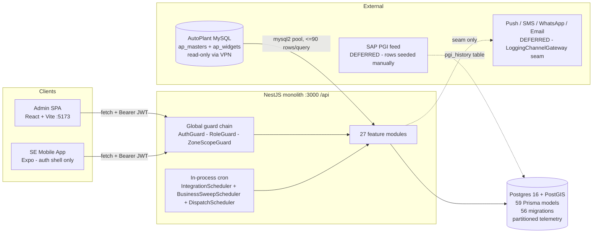

# 01 — System Overview

> **Point-in-time reverse-engineering analysis (2026-07-14, branch `feat/autoplant-integration`).**
> Derived entirely from source code. The living current-state document remains
> `docs/SYSTEM-STATE-2026-07.md`; this set is an independent architecture audit.

## What the system is

A **GPS Field Service Management (FSM) platform** for a fleet-telematics fitment business.
GPS devices are fitted to customer vehicles at plants. When a device stops reporting
("goes inactive"), the platform detects it, opens a Failure Cycle + Troubleshoot Ticket,
recommends a Service Engineer (SE), dispatches a per-SE Day Plan, and tracks the field loop
through GPS-verified repair, inventory consumption, and reporting.

Evidence: `apps/backend/src/ticketing/ticket-creation.service.ts:13-22`,
`apps/backend/src/recommender/recommender.service.ts:57-64`,
`apps/backend/src/scheduling/dispatch-run.service.ts:22-35`.

## Products (from `pnpm-workspace.yaml` + `apps/*`)

| Workspace | Package | Stack | Status (from code) |
|---|---|---|---|
| `apps/backend` | `@fsm/backend` | NestJS 10 modular monolith, Prisma 7 → Postgres 16 + PostGIS, `@nestjs/schedule` cron, `mysql2` for the external AutoPlant source | 27 feature modules, 51 controllers, ~150 endpoints, 268 test files |
| `apps/admin` | `@fsm/admin` | React 18 + TypeScript + Vite 5, react-router-dom v6, Tailwind CSS 4, Radix primitives, Recharts | ~40 routed pages, role-gated shell, full API layer (31 modules) |
| `apps/mobile` | `@fsm/mobile` | React Native 0.81 + Expo 54, expo-router | **Auth shell only**: login/session/token store (`apps/mobile/src/auth/*`, `apps/mobile/src/api/client.ts`) |
| `packages/shared` | `@fsm/shared` | Pure TypeScript (CJS+ESM dual build) | Auth/session DTOs, `ROLES`, `SlaBucket` + `SLA_BANDS` — single source of truth shared by all three apps |

## High-level system architecture

## The operational funnel (verified in code)

1. **Master sync** — `MasterSyncService` upserts companies/transporters/plants/vehicles/devices
   from AutoPlant `ap_masters`, keyed by `source_*_id`, zone-resolved via the `zone_mappings`
   crosswalk (unmapped → UNZONED holding zone).
2. **Snapshot ingestion** — `SnapshotIngestionWorker` drains telemetry chunk-by-chunk into
   partitioned `raw_device_snapshots` with per-chunk retry and a run ledger (`snapshot_runs`).
3. **Device-state recompute** — `DeviceStateService.recompute()` set-based SQL derives
   `inactivity_hours`, `sla_bucket`, `eligible_for_uptime` per device.
4. **Ticket creation** — `TicketCreationService` opens FailureCycle + TROUBLESHOOT Ticket for
   newly inactive + eligible devices (invariant I1: one active cycle per device).
5. **Recommender** — canonical sort, hard filters, weighted scoring, explainability rows in
   `recommendations`.
6. **Dispatch** — `DispatchRunService` → `BatchAssignmentService` builds `work_schedules` +
   plant batches (Day Plan), transactional + advisory-locked.
7. **Field loop** — soft states, troubleshoot submissions, intraday CRITICAL insertions, ZM
   overrides, cross-zone escalation, install & recovery lifecycles, inventory.
8. **Verification** — 3-phase GPS verification (`verification_runs`) closes/fails tickets.
9. **Reports** — pre-aggregated cubes (fleet uptime, root cause, ZM scorecard, system efficiency).

**Activation state (from code, not docs):** all schedulers are env-gated **OFF by default**
(`INGESTION_SCHEDULER_ENABLED`, `BUSINESS_SWEEPS_ENABLED` must equal the literal `'true'`), and
the AutoPlant source binds to empty/no-op implementations when `AUTOPLANT_MYSQL_*` env is unset
(`ingestion.module.ts:41-46, 88-103, 132-143`). Nothing runs unattended unless explicitly enabled.

## Key architectural decisions visible in code

- **Modular monolith, no queues** — no Redis/BullMQ/Kafka anywhere in `package.json`; all
  background work is in-process `@nestjs/schedule` cron with in-memory single-in-flight guards.
- **Secure-by-default HTTP** — global `APP_GUARD` chain + global `ValidationPipe`
  (whitelist + forbidNonWhitelisted) + global `AllExceptionsFilter` (`app.module.ts:163-183`).
- **Fail-fast boot** — `validateBootConfig()` refuses to start on missing/weak `JWT_ACCESS_SECRET`
  or unparseable `DATABASE_URL` (`config/boot-config.ts`).
- **In-transaction audit** — `AuditService.withAudit` commits the audit row atomically with the
  mutation it records (`audit/audit.service.ts:56-77`).
- **Anti-drift sync posture** — FSM-owned columns (operational `zone_id`, tier/rank, deactivations)
  are excluded from master-sync updates; AutoPlant can never clobber FSM decisions.
- **Derived-state + summary-cube reads** — hot paths read `device_states` and monthly/daily
  summary tables, never raw telemetry.
- **Interim auth** — in-memory user store (5 seeded users) + in-memory rotating refresh tokens;
  hand-rolled HS256 JWT on `node:crypto`. DB `users` table exists but is not the login store.

## Reading order for the rest of this set

02 structure → 03 backend → 05 database → 06 API → 09 auth → 11 workflows → 15 findings →
16 doc mismatches → 17 debt → 18 recommendations. File 14 consolidates all 20 diagrams.
