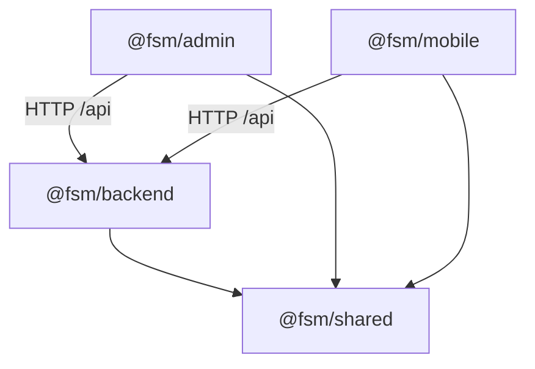

# 02 — Project Structure

## Monorepo layout

pnpm workspaces (`pnpm-workspace.yaml`: `apps/*`, `packages/*`) orchestrated by **Turborepo**
(`turbo.json`: `build` with `^build` dependency + `dist/**` outputs; `test` depends on `^build`;
`lint`/`typecheck` uncached-simple). Package manager pinned: `pnpm@11.7.0`, Node `>=20`
(root `package.json`).

```
fsm-platform-greenfield/
├── apps/
│   ├── backend/            @fsm/backend — NestJS API + workers
│   │   ├── prisma/         schema.prisma (59 models) + 56 migrations + seed-mock-engineers.ts
│   │   ├── src/            27 feature modules (see 03)
│   │   │   └── generated/prisma/   generated Prisma 7 client (gitignored, committed to src path)
│   │   └── test/           268 spec files (vitest; *.e2e-spec.ts hit a real Postgres)
│   ├── admin/              @fsm/admin — React SPA
│   │   ├── src/api/        31 fetch modules (one per backend domain) + http.ts interceptor
│   │   ├── src/auth/       AuthProvider / ProtectedRoute / RoleRoute
│   │   ├── src/components/ shell/ ui/ data/ overlay/ charts/ domain/
│   │   ├── src/pages/      ~40 pages grouped by domain
│   │   ├── test/           vitest + testing-library (jsdom)
│   │   └── visual/         pixelmatch-based visual capture/compare scripts
│   ├── mobile/             @fsm/mobile — Expo app (auth shell only)
│   │   ├── app/            expo-router entry (_layout.tsx, index.tsx)
│   │   └── src/            api/client.ts, auth/ (Login/Session screens, keychain token store)
│   └── (each app has its own tsconfig / vite.config / babel config)
├── packages/
│   └── shared/             @fsm/shared — DTOs + ROLES + SLA_BANDS; triple tsc build (cjs/esm/types)
├── docs/                   PRD, CONTEXT.md (129 KB domain bible), SYSTEM-STATE, ADRs, audits, UI refs
├── .scratch/fsm-platform-v1/  local markdown issue tracker (INDEX.md = build order)
├── data/, backups/         untracked local artifacts (gitignore-anchored /data/, /backups/)
├── turbo.json, pnpm-workspace.yaml, pnpm-lock.yaml
└── CLAUDE.md               agent/project conventions
```

## Build system

| Package | build | test | notes |
|---|---|---|---|
| backend | `tsc -p tsconfig.json` → `dist/` | `vitest run` | start: `node -r dotenv/config dist/main.js`; extra bins: `seed`, `autoplant:ping`, `autoplant:sync` |
| admin | `tsc -b && vite build` | `vitest run` (jsdom) | `visual:capture`/`visual:compare` Playwright+pixelmatch scripts |
| mobile | (expo — no build task) | `jest` (jest-expo preset) | `typecheck` uses a dedicated `tsconfig.typecheck.json` |
| shared | 3× `tsc` (cjs/esm/types) + dist markers script | none (covered by consumers) | dual `exports` map in package.json |

## Configuration & environment variables (grep-verified)

**Backend** (`process.env.*` in `apps/backend/src`):

| Variable | Where | Purpose |
|---|---|---|
| `JWT_ACCESS_SECRET` | boot-config.ts, token.service.ts | HS256 secret; boot fails if absent/short/dev-default |
| `DATABASE_URL` | boot-config.ts, prisma.service.ts | Postgres; session pinned `-c timezone=UTC` |
| `PORT` | main.ts | default 3000 |
| `ADMIN_ORIGIN` | app.config.ts | CORS origin, default `http://localhost:5173`, credentials:true |
| `BODY_LIMIT_JSON` | app.config.ts | JSON body cap, default 1mb |
| `AUTOPLANT_MYSQL_HOST/USER/PASSWORD/PORT/SSL` | autoplant-mysql.client.ts | source connection; unset ⇒ mock/no-op sources |
| `AUTOPLANT_MYSQL_DB_WIDGETS` (alias `_DATABASE`), `AUTOPLANT_MYSQL_DB_MASTERS` | autoplant-mysql.client.ts | schema names |
| `AUTOPLANT_QUERY_TIMEOUT_MS`, `AUTOPLANT_CONNECT_TIMEOUT_MS` | autoplant-mysql.client.ts | fail-fast on VPN loss |
| `AUTOPLANT_SOURCE_UTC_OFFSET_MIN` | ingestion.module.ts, autoplant-sync.ts | source-timestamp UTC normalization |
| `AUTOPLANT_SNAPSHOT_CHUNK_SIZE` | snapshots.controller.ts, autoplant-sync.ts | chunk override (default 90 — DBA <100/query cap) |
| `INGESTION_SCHEDULER_ENABLED`, `INGESTION_MASTERS_CRON`, `INGESTION_TELEMETRY_CRON` | integration-scheduler.service.ts | masters daily 02:00 / telemetry */30; **default OFF** |
| `BUSINESS_SWEEPS_ENABLED` + 11 `BUSINESS_SWEEP_*_CRON` | business-sweep-scheduler.service.ts, dispatch-scheduler.service.ts | field-loop sweeps + daily dispatch 05:00; **default OFF** |
| `PARTITION_MAINTENANCE_ENABLED`, `PARTITION_MAINTENANCE_CRON` | partition-maintenance.service.ts | daily-partition pre-create |
| `PUBLIC_API_URL` | non-operational.service.ts | customer confirm-link base |
| `INSTALL_CSV_MAX_ROWS` | install.service.ts | bulk-install cap (default 1000) |
| `DEV_AUTH_ZONE` | dev-zone-resolver.ts | DEV-ONLY zone claim override (Issue #91 removes) |

**Admin:** `VITE_API_URL` (default `http://localhost:3000/api`).
**Mobile:** `EXPO_PUBLIC_API_URL` (default `http://10.0.2.2:3000/api` — Android-emulator loopback).

## What does NOT exist (verified by absence)

- **No Dockerfile, no docker-compose, no `.github/` CI, no IaC, no deployment manifests.**
- No `.env.example` found at repo root (gitignore whitelists one).
- No Redis / message broker / object storage dependencies.
- Root `package.json`/`package-lock.json` is a vestigial npm artifact holding only
  `@playwright/mcp` + `turbo` devDeps; the real lockfile is `pnpm-lock.yaml`.

## Workspace dependency graph


