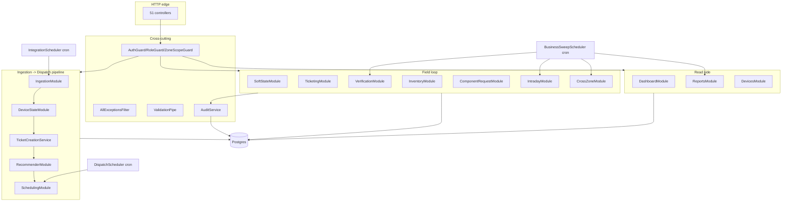

# 03 — Backend Architecture

NestJS 10 modular monolith. Entry: `apps/backend/src/main.ts`.

## Startup sequence (from `main.ts`)

1. `validateBootConfig()` — throws before Nest boots if `JWT_ACCESS_SECRET` missing / equals the
   published dev default / < 32 chars, or `DATABASE_URL` missing/not postgres (`config/boot-config.ts`).
2. `NestFactory.create(AppModule, { bodyParser: false })` — body parsing is owned by
   `configureApp` so the env-tunable 1 MB JSON limit is the only parser.
3. `app.enableShutdownHooks()` — SIGTERM/SIGINT run `onModuleDestroy` (Prisma `$disconnect`,
   AutoPlant MySQL pool end).
4. `configureApp(app)` — global prefix `api`, CORS (`ADMIN_ORIGIN`, credentials:true), JSON limit.
5. `app.listen(PORT ?? 3000)`.
6. Everything wrapped in `runWithFatalGuard` (`bootstrap-guard.ts`) — startup failure = logged
   fatal + exit(1), never a swallowed rejection.

## Global cross-cutting providers (`app.module.ts:163-183`)

| Registration | Class | Behaviour |
|---|---|---|
| `APP_FILTER` | `AllExceptionsFilter` | sanitized 500s + correlation id; HttpException payloads (e.g. `{ code }`) preserved verbatim |
| `APP_GUARD` #1 | `AuthGuard` | every route requires Bearer JWT by default; `@Public()` opts out |
| `APP_GUARD` #2 | `RoleGuard` | enforces `@Roles(...)` allow-list (handler or controller level) |
| `APP_GUARD` #3 | `ZoneScopeGuard` | ZONAL_MANAGER may only target own zone via `:zoneId` param / `zone_id` query → 403 `ZONE_SCOPE_VIOLATION` |
| `APP_PIPE` | `ValidationPipe` | `whitelist + forbidNonWhitelisted + transform`; only class-typed DTO routes validated (interface-typed bodies untouched) |

## Module inventory (27 imports in `AppModule`)

| Module | Responsibility | Key services |
|---|---|---|
| `prisma` | Single PrismaClient (Prisma 7 + `@prisma/adapter-pg`, session TZ pinned UTC) | `PrismaService` |
| `auth` | login/refresh, HS256 JWT (15-min access), 30-day single-use rotating refresh; **in-memory** user + refresh stores; `DevZoneResolver` dev scaffold | `AuthService`, `TokenService` |
| `settings` | `system_settings` key-value config (incl. `eligibility_mode`, `inactivity_threshold_hours`, `plant_cluster_multiplier`) | `SettingsService` |
| `audit` | in-transaction audit writer + `/audit-trail` reader | `AuditService`, `AuditTrailService` |
| `org` | org-graph CRUD: zones, plants, companies, users, engineers+coverage, territory, geography, SLA rules, scoring weights, common kit, zone-mapping crosswalk + plant-zone overrides | 14 admin controllers; `ZoneMappingService.reapply`, `plant-eligible-floating-se` MV refresh |
| `ingestion` | AutoPlant everything: MySQL client, master sync, snapshot worker, run ledgers, partition maintenance, integration health, **IntegrationSchedulerService** (owns `ScheduleModule.forRoot()`) | see 12_EXTERNAL_INTEGRATIONS |
| `device-state` | set-based `device_states` recompute; `sla-bucket.ts` classifier generated from shared `SLA_BANDS`; `eligibility.ts` modes (`pgi` \| `all-deployed`) | `DeviceStateService` |
| `ticketing` | ticket create/query, troubleshoot submissions, auto-recovery, repeat escalation, vehicle unavailability, non-op dual confirmation, recovery lifecycle, install create + lifecycle | 8 controllers, 12 services |
| `devices` | device list/detail/cycles/downtime-trend, deal-type tag | `DeviceService`, `DeviceDetailService` |
| `recommender` | candidate selection (Dedicated→Multi-Plant→Floating precedence), hard filters, scoring, canonical sort | `RecommenderService` |
| `scheduling` | batch assignment + dispatch run, ZM overrides, same-day updates, day-plan queries, **DispatchSchedulerService** (daily 05:00) | `BatchAssignmentService`, `DispatchRunService` |
| `business-sweep-scheduler` | 10 cron sweeps (verification ×2, intraday timeout, cross-zone, repeat escalation, soft-inactive, 4 report cubes) | `BusinessSweepSchedulerService` |
| `intraday` | system CRITICAL insertion offer state machine (accept/decline/timeout/reroute/escalate) | `IntradayInsertionService` |
| `cross-zone` | Platinum auto-escalation + manual flag queue; approve/deny/defer/re-escalate | `CrossZoneEscalationService` |
| `shared-pool` | SE shared-pool ticket query | `SharedPoolService` |
| `planner` | SE Planner (ZM plant-visit intent; soft bias into recommender) | `SePlannerService` |
| `dashboard` | zone overview, company/plant drill-down, critical queue, action-required | `DashboardService` |
| `reports` | report reads + 5 aggregation workers (fleet uptime, root cause, soft-inactive, system efficiency, ZM performance) | `ReportsService` + aggregators |
| `soft-state` | VIEWED / ON_SITE / TROUBLESHOOT_STARTED soft states, activity ping, derived SE Activity Status | `SoftStateService` |
| `verification` | 3-phase GPS verification runs, review queue, fraud flags | `VerificationService` |
| `inventory` | van stock, warehouse stock, shadow-use reconciliation, component-blocked queue | `InventoryService` |
| `component-request` | WAITING_COMPONENT flow: WM approve/ship/reject, SE receipt/resubmit | `ComponentRequestService` |
| `engineers` | SE admin CRUD, availability windows, leave requests, activity queries | `EngineerAdminService`, `SeAvailabilityService` |
| `roles` (role-backup) | role unavailability + backup cascade (ZM→CSM→OH), CSM approval-share report | `RoleBackupService` |
| `notifications` | notification spine: in-app always; PUSH→SMS→WHATSAPP→EMAIL fallback chain via **`NotificationChannelGateway` seam** (default `LoggingChannelGateway` returns UNAVAILABLE) | `NotificationService` |
| `vouchers` | expense-voucher lifecycle (draft→submit→ZM review→approve/reject/clarify→OH mark-paid + finance export) | `VouchersService` |
| `exports` | entity-mapping CSV export (OH) | `EntityMappingExportService` |
| `plant-deactivation` | FSM-owned plant deactivate/reactivate (side-table, sync-proof) | `PlantDeactivationService` |

Plus app-level `HealthController` (`/health`, `/health/ready`) and `MeController` (`/me`).

## Backend module diagram

## Dependency-injection patterns worth knowing

- **Token-based seams**: `SOURCE_READER`, `MASTER_SYNC_SOURCE`, `PLANT_ZONE_RESOLVER`,
  `MASTER_SYNC_SCOPE`, `NOTIFICATION_CHANNEL_GATEWAY` — all bound via factories in module
  definitions; unconfigured environments get no-op implementations so boot never blocks
  (`ingestion.module.ts`, `notifications.module.ts`).
- **Guard duplication**: `IngestionModule` provides its own `AuthGuard`/`RoleGuard` instances so
  its controllers stay self-contained (`ingestion.module.ts:57-66`). Harmless (idempotent
  re-runs), but two registration styles coexist.
- **Constructor-default DI escape hatch**: `RecommenderService` defaults its collaborator params
  (`new InventoryService(prisma)` etc.) for direct test construction
  (`recommender.service.ts:66-74`) — a deliberate test seam, but it bypasses Nest's graph if
  constructed manually.

## Schedulers & background work (all in-process; no queue/worker processes)

| Scheduler | Ticks | Gate | Overlap policy |
|---|---|---|---|
| `IntegrationSchedulerService` | masters `0 2 * * *`, telemetry `*/30 * * * *` | `INGESTION_SCHEDULER_ENABLED==='true'` AND AutoPlant configured | DB single-in-flight guards → RUN_IN_PROGRESS skip |
| `BusinessSweepSchedulerService` | 10 crons (5-min verification → monthly cubes) | `BUSINESS_SWEEPS_ENABLED==='true'` | in-memory `Set` per-sweep guard |
| `DispatchSchedulerService` | `0 5 * * *` | same master switch | in-memory boolean; run itself advisory-locked per zone |
| `PartitionMaintenanceService` | env cron | `PARTITION_MAINTENANCE_ENABLED` | pre-creates daily `raw_device_snapshots` partitions |

All cron handlers return structured `SchedulerTickOutcome` and never throw out of cron context.

## Error handling & audit

- Services throw `HttpException` subclasses with `{ code }` payloads (e.g. `RUN_IN_PROGRESS`
  409s); `transition-or-conflict.ts` centralizes optimistic-concurrency 409s on `version` columns.
- Every mutation that matters is wrapped in `AuditService.withAudit` → audit row commits in the
  same transaction (`audit.service.ts`); actor attribution flows from JWT claims +
  `X-Acting-As-Zone` header through `resolveRequestActor` (`common/request-actor.ts`) so
  backup-cascade actions stamp `acted_as_role`/`acting_zone`.
