# 04 — Frontend Architecture (Admin SPA)

React 18 + TypeScript + Vite. No state-management library, no react-query/SWR — plain
`useState`/`useEffect` per page with hand-rolled fetch modules. Styling: Tailwind CSS 4
(`@tailwindcss/vite`) + `clsx`/`tailwind-merge` (`lib/cn.ts`); primitives from Radix
(dialog/dropdown/select/tabs/tooltip); charts from Recharts wrapped in local chart components.

## Boot & rendering flow (`src/main.tsx`, `src/App.tsx`)

1. `installAuthFetch()` — wraps `window.fetch` once with the 401→refresh→retry interceptor
   **before anything renders** (`api/http.ts:85-88`).
2. `createRoot(...).render(<StrictMode><App/></StrictMode>)`.
3. `App` composes `AuthProvider` → Router → `AppRoutes`.

## Authentication layer (`src/auth/`, `src/api/http.ts`, `src/api/tokens.ts`)

- **Token storage**: `sessionStorage` (`fsm.accessToken`, `fsm.refreshToken`) — commented as the
  interim before an httpOnly-cookie upgrade (#91 fast-follow).
- **AuthProvider**: session rehydrate on reload via `/me` (loading gate, not a login bounce);
  proactive refresh scheduled ~1 min before JWT `exp`; reactive single-flight refresh on any 401;
  `sessionExpired` flag drives the LoginPage notice; `actingZone` (backup cascade) persisted in
  sessionStorage and sent as `X-Acting-As-Zone` by API modules.
- **Route gates**: `ProtectedRoute` (must be logged in) wraps the shell; `RoleRoute roles={[...]}`
  gates each manager/OH/WM page (server-side guards remain the real enforcement).

## Routing (from `AppRoutes.tsx`)

```mermaid
flowchart TD
  LOGIN["/login"]
  KS["/_kitchensink (DEV only)"]
  SHELL["ProtectedRoute + AdminShell (sidebar + topbar + Outlet)"]
  SHELL --> HOME["/ DashboardHome (role-variant: ZM / CSM Central / OpsHead / Warehouse)"]
  SHELL --> TK["/tickets (+ nested /tickets/:ticketId detail drawer)"]
  SHELL --> SCH["/schedules, /schedules/:engineerId (mgr)"]
  SHELL --> ENG["/engineers, /engineers/manage, /engineers/planner (mgr)"]
  SHELL --> REP["/reports + device, root-cause, system-efficiency (mgr); zm-scorecard, csm-approval-share (OH)"]
  SHELL --> OPS["/install, /intraday, /cross-zone, /leave-requests (mgr)"]
  SHELL --> RDY["/readiness: vehicle-unavailability, non-operational, recovery-decisions (mgr)"]
  SHELL --> COMP["/component-blocked (mgr), /component-requests (mgr read-only)"]
  SHELL --> WH["/warehouse: requests, recovery-receipt, shadow-use (WAREHOUSE_MANAGER)"]
  SHELL --> VER["/verification, /vouchers (mgr)"]
  SHELL --> OH["/coverage, /settings, /plant-deactivations, /exports (OPERATIONS_HEAD)"]
  SHELL --> HELP["/help (all roles)"]
```

`SnapshotBanner` (data-freshness "as of" banner from `/snapshots/latest`) renders above all
authenticated pages and nothing when logged out.

## API layer (`src/api/` — 31 modules)

- `http.ts` — the **only** cross-cutting HTTP logic: base URL (`VITE_API_URL`), single-flight
  rotating refresh (`refreshOnce`), retry-once-with-new-bearer, session-expiry callback.
- `client.ts` — login/refresh/me.
- One module per backend domain (`tickets.ts`, `dashboard.ts`, `schedules.ts`, `reports.ts`,
  `org.ts`, `inventory.ts`, `vouchers.ts`, `plantDeactivations.ts`, …) exporting typed
  `apiXxx(token, params)` functions; DTO types largely declared locally per module (only the
  auth/session contract comes from `@fsm/shared`).
- `authHeaders.ts` builds `Authorization` + `X-Acting-As-Zone` headers.

## Component system (`src/components/`)

| Layer | Contents |
|---|---|
| `shell/` | `AppShell`, `Sidebar` (+collapse context), `TopBar`, `BrandLogo`, `Footer`, `nav.ts` — role-scoped grouped navigation builder (`buildNav(role)`: WM gets Warehouse group; managers get Operations/Components/Reports; only OH sees Admin group) |
| `ui/` | Button, Card, Badge, Input, icon set (hand-rolled SVG icons) |
| `data/` | DataTable, FilterBar, MetricStrip, PageHeader, Toast, DateRangeChips, RollingNumber, feedback (empty/error/loading) |
| `overlay/` | Modal, Sheet, Select, Tabs, DropdownMenu (Radix wrappers) |
| `charts/` | ChartCard, TrendChart, BarChartCard, DonutChart, RadialGauge, DistributionBar, ReportGrid + palette (`colors.ts`) |
| `domain/` | TicketCard, Timeline, status badges, PlantName |

⚠ Historical hazard (now fixed): `.gitignore` once had an unanchored `data/` rule that untracked
`src/components/data/`; the rule is now anchored `/data/` with an explanatory comment.

## Data-fetching & state pattern

Every page follows the same shape: local `useState` for data/loading/error, `useEffect` to fetch
on mount/param change, manual refetch after mutations, `Toast` for feedback. There is no client
cache; freshness comes from refetching. Dashboards poll/refresh via explicit user actions and the
`RunIngestionButton` (manual pipeline trigger) publishes through a tiny event bus
(`pages/dashboard/ingestionEvents.ts`).

## Role-variant dashboard

`DashboardHome` switches on `session.role`: `ZmDashboard` (zone KPIs, critical queue,
action-required), `CentralDashboard` (CSM), `OpsHeadDashboard`, `WarehouseDashboard` — mirroring
`docs/ui/desktop/v2-reference/` layouts (per repo convention).

## Mobile app (Expo) — current truth

`apps/mobile` is an **auth shell only**: expo-router `app/index.tsx` → `AppEntry` →
`LoginScreen`/`SessionScreen`; `src/api/client.ts` implements only `apiLogin` + `apiMe`;
`src/auth/tokenStore.ts` persists tokens via `react-native-keychain`. No feature screens exist.
