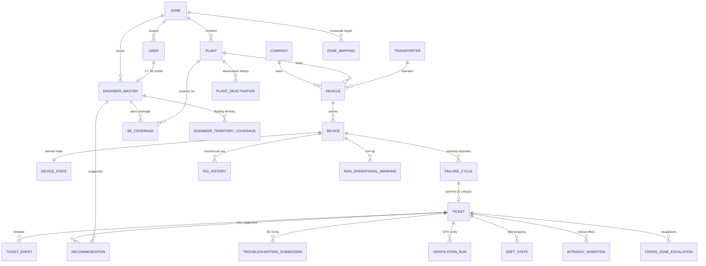
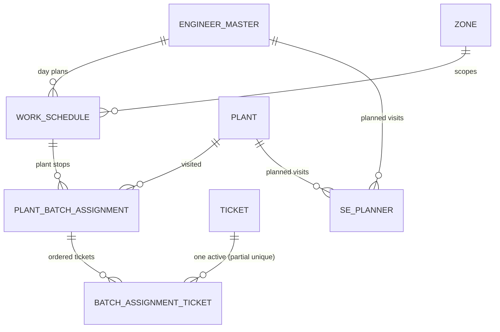
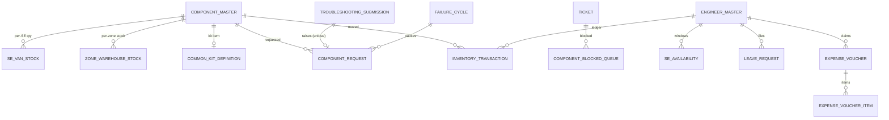

# 05 — Database Architecture

**Technology:** PostgreSQL 16 + PostGIS, accessed via Prisma 7 (`prisma-client` generator,
driver adapter `@prisma/adapter-pg`, generated client committed under
`apps/backend/src/generated/prisma/`). Session timezone pinned to UTC at connection
(`prisma.service.ts:23`). Naming: snake_case via `@map`/`@@map`; all timestamps `timestamptz`.

**Migrations:** 56 SQL migrations (`20260617103804_init_system_settings` →
`20260714120000_plant_deactivations`). Prisma-inexpressible constructs are appended as **raw SQL
inside migrations** — a deliberate, recurring pattern:

- Partial-unique indexes: one active FailureCycle per device (I1), one active batch ticket,
  one RUNNING snapshot run, one in-flight verification run, one active soft state, one active
  non-op marking (I13), one active plant deactivation, shared-pool partial index on
  `tickets(plant_id) WHERE status='OPEN' AND assignment_state='UNASSIGNED'`.
- CHECK constraints: coverage-type rules on `se_coverage`, `work_type='TROUBLESHOOT' ⇒
  failure_cycle_id NOT NULL`, `inactivity_hours >= 0`, territory ≥1 dimension.
- **Partitioning:** `raw_device_snapshots` is RANGE-partitioned (monthly at creation, converted
  to **daily** by `20260706130000_partition_raw_device_snapshots_daily`); partitions pre-created
  by `PartitionMaintenanceService`.
- PostGIS geometry: `plants.location Point`, `engineer_territory_coverage.polygon MultiPolygon`,
  `troubleshooting_submissions.onsite_capture_gps` — all `Unsupported(...)` in Prisma, queried
  by raw SQL; plus the `plant_eligible_floating_se` **materialized view** (Floating-SE
  territory membership).
- Case-insensitive unique zone names (`20260707120000`).

## Model inventory (59 models, grouped by domain)

| Domain | Tables |
|---|---|
| Org & master data | zones, plants, regions, districts, company_master, transporters, vehicles, devices, users, engineer_master, se_coverage, engineer_territory_coverage |
| Sync & mapping | zone_mappings, plant_zone_overrides, plant_deactivations, master_sync_runs, master_sync_rejects |
| Telemetry & state | snapshot_runs, snapshot_run_chunks, raw_device_snapshots (partitioned), device_states, pgi_history |
| Ticket spine | failure_cycles, tickets, ticket_events, non_operational_markings, vehicle_unavailability_reports |
| Recommendation & dispatch | recommendations, intraday_insertions, cross_zone_escalations, work_schedules, plant_batch_assignments, batch_assignment_tickets, se_planner |
| Field capture | soft_states, troubleshooting_submissions, verification_runs |
| Inventory | component_master, se_van_stock, zone_warehouse_stock, common_kit_definition, component_blocked_queue, component_request, inventory_transactions |
| People ops | se_availability, leave_requests, role_unavailability, expense_vouchers, expense_voucher_items |
| Config & audit | system_settings, sla_rule_config, priority_rule_config, audit_logs, notifications, notification_deliveries |
| Report cubes | soft_inactive_count_history, device_downtime_summary_monthly, root_cause_summary_monthly, zm_performance_summary_monthly, system_efficiency_summary_daily |

## ER diagram — core operational spine

## ER diagram — dispatch & day plan

## ER diagram — inventory & component flow

## Query & transaction patterns

- **Hot-path reads hit derived/denormalised tables only**: `device_states` carries denormalised
  vehicle/plant/company/transporter ids + stored `sla_bucket`; report endpoints read the
  `*_summary_*` cubes (rebuilt delete+insert per period — idempotent).
- **Set-based recompute**: `DeviceStateService.recompute` is two raw SQL statements
  (INSERT…ON CONFLICT + one UPDATE with CTE), never a per-row loop; the SLA-bucket CASE is
  code-generated from the same `SLA_BANDS` array the TS classifier and admin UI use.
- **Idempotent ingest**: `raw_device_snapshots` UNIQUE `(device_id, gps_datetime)` +
  `ON CONFLICT DO NOTHING` makes chunk re-reads free; the run ledger stores an optimistic
  resume cursor vs a conservative display watermark (`snapshot-ingestion.worker.ts:120-134`).
- **Optimistic concurrency**: `version` int columns on tickets/failure_cycles/component_request/
  non_operational_markings + `transition-or-conflict.ts` → 409 on conflicting transitions;
  409-loser inventory consumption becomes SHADOW_USE for WM reconciliation.
- **Advisory locks**: batch dispatch per zone (#100) so concurrent dispatch runs serialize.
- **Client-submission idempotency**: `(se_id, client_submission_id)` unique on submissions and
  vouchers — offline mobile retry-safety.
- **Audit atomicity**: `AuditService.withAudit` wraps mutation + audit insert in one
  `$transaction`.

## Seeding

- `src/seed.ts` (built to `dist/seed.js`, run via `pnpm seed`) and `src/org/org-seed.ts` —
  reference/org data; `prisma/seed-mock-engineers.ts` — mock SE dataset;
  `test/env/book8/` — a full deterministic test-world seeder for e2e suites.
