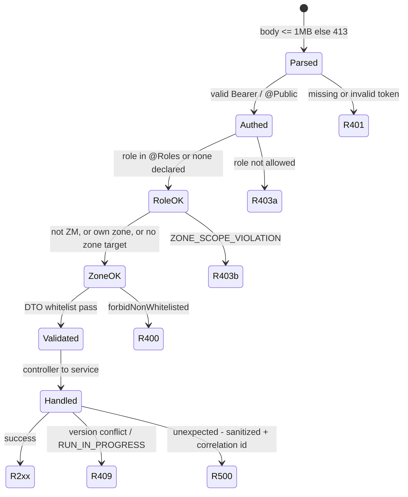

# 07 — Request Flow (Runtime Lifecycle)

## HTTP request lifecycle

Order of middleware/guards is fixed by `app.module.ts` provider registration and the comment at
`common/guards/auth.guard.ts:18-23`:

```
express json parser (1 MB cap) → CORS → global prefix /api
  → AuthGuard        (Bearer verify; @Public bypass)
  → RoleGuard        (@Roles allow-list)
  → ZoneScopeGuard   (ZM zone clamp)
  → ValidationPipe   (class DTOs only: whitelist + forbidNonWhitelisted + transform)
  → Controller handler
  → Service (business logic, Prisma, AuditService.withAudit)
  → AllExceptionsFilter (on any throw: sanitized 500 + correlation id; HttpException verbatim)
```



## Failure/conflict conventions

- **409 with `{ code }` payloads** is the concurrency contract everywhere:
  `RUN_IN_PROGRESS` (snapshot/master-sync single-in-flight), optimistic `version` conflicts
  (`transition-or-conflict.ts`), one-live-offer intraday races.
- **Idempotent replays**: unique keys turn duplicates into no-ops rather than errors —
  P2002 skip in ticket creation, `(se_id, client_submission_id)` for mobile submissions,
  `ON CONFLICT DO NOTHING` in telemetry ingest.
- 401s from the admin SPA trigger the client-side single-flight refresh + one retry
  (`apps/admin/src/api/http.ts`).

## Actor resolution (attribution path)

```
JWT claims {user_id, role, zone_id}
  + optional X-Acting-As-Zone header (CSM/OH acting as ZM via backup cascade)
  → resolveActingContext → RequestActor {userId, role, actedAsRole, actingZone}
  → services stamp auditActor(actor) into audit_logs and ticket_events
```

Evidence: `common/request-actor.ts`, `auth/acting-context.ts`, `audit/audit.service.ts:30-37`.

## Scheduler "request" lifecycle (non-HTTP entry points)

Every cron tick follows one shape (both scheduler families):

```
@Cron handler → enabled-gate (env, re-checked per tick) → configured-gate (AutoPlant only)
  → single-in-flight guard (DB partial-unique or in-memory set)
  → run sweep/pipeline in try/catch
  → structured SchedulerTickOutcome {ran} | {ran:false, reason: DISABLED|UNCONFIGURED|RUN_IN_PROGRESS|ERROR}
```

A tick never throws out of cron context; overlaps degrade to logged skips
(`integration-scheduler.service.ts`, `business-sweep-scheduler.service.ts:125-141`).

## CLI entry points (secondary binaries)

- `dist/seed.js` — DB seeding (`seed.ts`, own env bootstrapping).
- `dist/ingestion/autoplant/autoplant-ping.js` — connectivity probe.
- `dist/ingestion/autoplant/autoplant-sync.js` — one-shot pipeline run outside the HTTP process.
