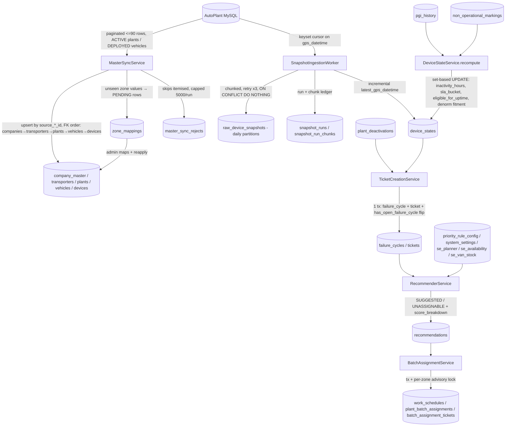
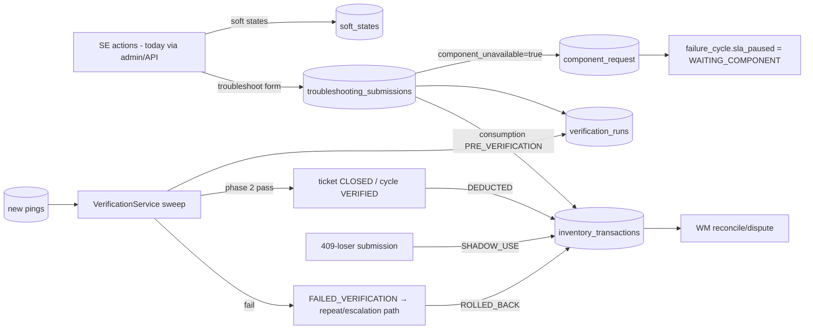

# 08 — Data Flow

## End-to-end pipeline (write side)

## Field-loop data flow (mutation side)

## Read-side data flow

- **Dashboards** (`DashboardService`) read `device_states` + `tickets` + queues — indexed,
  denormalised; never raw telemetry.
- **Reports** read pre-aggregated cubes written by the five aggregation services
  (delete+insert per month/day, idempotent):
  `device_downtime_summary_monthly`, `root_cause_summary_monthly`,
  `zm_performance_summary_monthly`, `system_efficiency_summary_daily`,
  `soft_inactive_count_history`.
- **Freshness banner**: `GET /snapshots/latest` → `snapshot_runs.data_as_of` (the conservative
  display watermark — never advances on failed chunks).
- **Explainability**: recommendation `score_breakdown` JSONB is append-only; the admin UI reads
  it verbatim for the "why suggested" view.

## State ownership matrix (who writes what)

| Table cluster | Sole writer |
|---|---|
| org mirror (companies/plants/vehicles/devices/transporters) | MasterSyncService (FSM-owned columns excluded from updates) |
| operational zone_id, zone_mappings, plant_zone_overrides, plant_deactivations | Admin endpoints (OH), applied via `reapply` — sync never touches them |
| raw_device_snapshots, snapshot_runs | SnapshotIngestionWorker only |
| device_states | DeviceStateService (recompute) + ingest (latest_gps_datetime) + ticket-creation (has_open_failure_cycle) |
| failure_cycles/tickets | TicketCreationService + lifecycle services (ticketing/*) |
| recommendations | RecommenderService (append-only) |
| work_schedules/batches | BatchAssignmentService + override/same-day services |
| report cubes | aggregation services only |
| audit_logs | AuditService only (in-transaction) |
