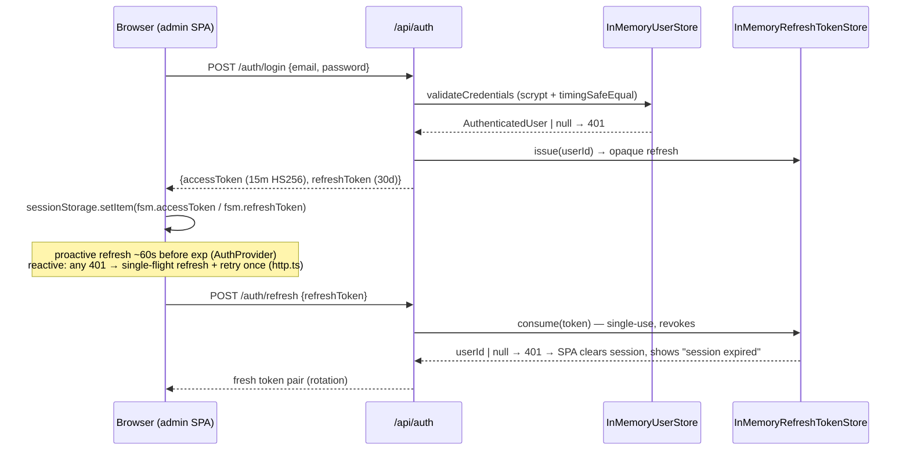
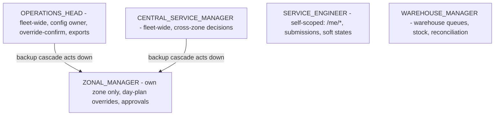

# 09 — Authentication & Authorization

## Authentication (who you are)

**Implementation is intentionally interim** — every piece below is commented in code as awaiting
the DB-backed auth slice (Issue #91):

| Piece | File | Reality |
|---|---|---|
| User store | `auth/user-store.ts` | **In-memory**, 5 seeded accounts (`zm.north@fsm.test`, `se.north@`, `ops.head@`, `csm@`, `wm@` — password `correct-password`), scrypt-hashed with per-boot random salts, timing-safe compare |
| Access token | `auth/token.service.ts` | Hand-rolled HS256 JWT on `node:crypto` (no jwt lib), claims `{user_id, role, zone_id, iat, exp}`, **15-min TTL**, timing-safe signature check |
| Refresh token | `auth/refresh-token-store.ts` | **In-memory** opaque 32-byte tokens, **30-day TTL, single-use rotation** (consume revokes; reuse of a rotated token is rejected) |
| Secret | `config/boot-config.ts` | Boot fails on missing/short/dev-default `JWT_ACCESS_SECRET`; `TokenService` has a defensive re-check |
| Dev scaffold | `auth/dev-zone-resolver.ts` | `DEV_AUTH_ZONE` env can re-point the seeded ZM's `zone_id` claim to a live zone; default-off |

Consequences visible in code: restart invalidates all refresh tokens; horizontal scaling is
impossible for sessions; the Postgres `users` table exists but **cannot log in**.

## Login / refresh flow

## Authorization (what you may do)

Three layers, all server-side; the SPA's `RoleRoute` is UX-only defense-in-depth.

1. **AuthGuard** (global): valid Bearer or 401; attaches verified claims to `request.user`.
2. **RoleGuard** (global): `@Roles(...)` allow-list on handler/controller; no decorator = any
   authenticated role.
3. **ZoneScopeGuard** (global): only constrains `ZONAL_MANAGER`; rejects a `:zoneId` param or
   `zone_id` query targeting another zone (403 `ZONE_SCOPE_VIOLATION`). **Caveat found in code:**
   the guard only fires when the request names a zone explicitly — list endpoints without a zone
   parameter must self-scope in their services (they do, by reading `user.zone_id`), so zone
   security is guard + convention, not guard alone.

### Role model (from `@fsm/shared` ROLES — no ADMIN role by design)

### Acting-as (backup cascade, Issue 27)

A CSM/OH acting in a ZM's zone sends `X-Acting-As-Zone: <zoneId>`; `resolveActingContext`
(`auth/acting-context.ts`) validates role + zone and produces `actedAsRole`/`actingZone`, which
flow into `audit_logs.acted_as_role` / `acting_zone` and `ticket_events.acted_as_role`. The
`role_unavailability` table records why the cascade is active; the CSM approval-share report is
built from this attribution.

### One public business route

`GET /api/non-op/confirm?token=...` — customer one-time tokenised email confirmation for
Non-Operational markings (`non-operational.controller.ts` `NonOperationalPublicController`,
`@Public()`); token is unique + expiring (`non_operational_markings.customer_token`).

## Client-side session handling

- Admin: `sessionStorage` tokens (XSS-readable — flagged as interim in `api/tokens.ts` comments),
  fetch interceptor over `window.fetch`, proactive + reactive refresh, session-expired UX.
- Mobile: `react-native-keychain` secure storage (`apps/mobile/src/auth/tokenStore.ts`); only
  login + `/me` are implemented.
