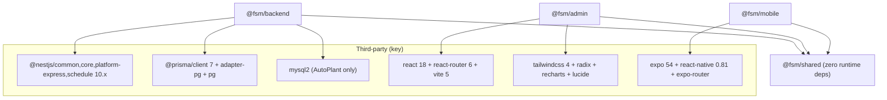
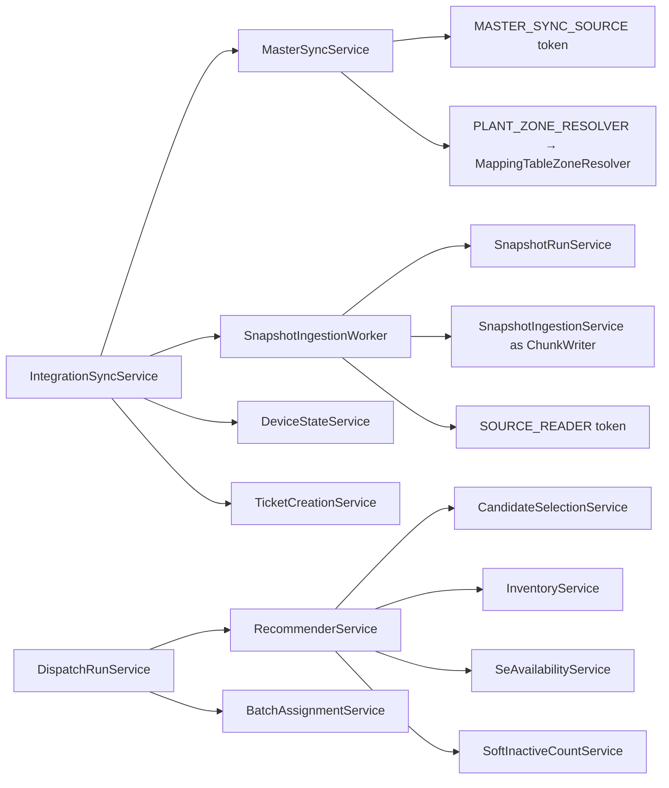
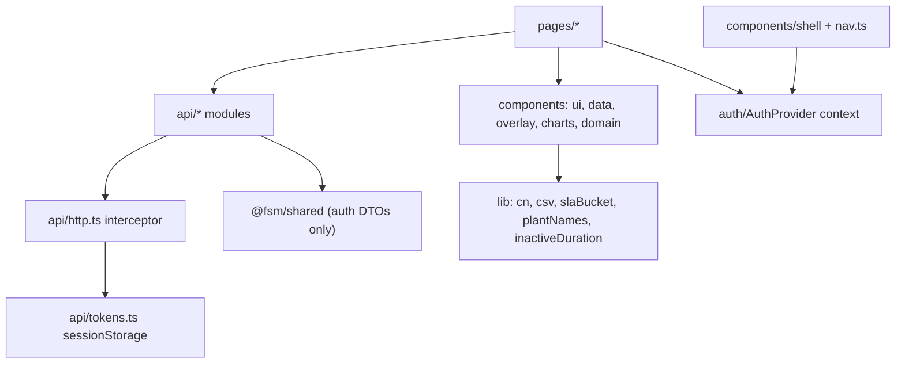

# 10 — Dependency Graphs

## Workspace / package graph

Notable: backend has **no** auth library (hand-rolled JWT), **no** queue/cache/storage client,
**no** logging framework beyond Nest `Logger`. Test stacks: vitest+supertest (backend),
vitest+testing-library (admin), jest-expo (mobile).

## Backend module dependency graph (imports between Nest modules)

```mermaid
graph TD
  PRISMA[PrismaModule] 
  AUTHM[AuthModule] --> PRISMA
  SET[SettingsModule] --> PRISMA
  AUD[AuditModule] --> PRISMA
  ORG[OrgModule] --> PRISMA & AUD
  DSTATE[DeviceStateModule] --> PRISMA & SET
  TICK[TicketingModule] --> PRISMA & AUD
  ING[IngestionModule] --> AUTHM & DSTATE & SET & TICK
  ING -->|owns| SCHEDROOT[ScheduleModule.forRoot]
  RECO[RecommenderModule] --> PRISMA & SET
  SCHD[SchedulingModule] --> RECO & PRISMA & AUD
  BSS[BusinessSweepSchedulerModule] --> VERM & IDY & CZ & TICK & REPM
  IDY[IntradayModule] --> PRISMA & AUD & NOTIF
  CZ[CrossZoneModule] --> PRISMA & AUD
  VERM[VerificationModule] --> PRISMA & TICK
  INV[InventoryModule] --> PRISMA & AUD
  CREQ[ComponentRequestModule] --> PRISMA & AUD & NOTIF
  ENGM[EngineersModule] --> PRISMA & AUD
  NOTIF[NotificationsModule] --> PRISMA
  REPM[ReportsModule] --> PRISMA
  DASH[DashboardModule] --> PRISMA
  DEVM[DevicesModule] --> PRISMA
  SSM[SoftStateModule] --> PRISMA & AUD
  PLAN[PlannerModule] --> PRISMA & AUD
  SPOOL[SharedPoolModule] --> PRISMA
  RB[RoleBackupModule] --> PRISMA & AUD
  VOU[VouchersModule] --> PRISMA & AUD & NOTIF
  EXP[ExportsModule] --> PRISMA & AUD
  PDEACT[PlantDeactivationModule] --> PRISMA & AUD
```

(Edge set reconstructed from module `imports:` arrays; PrismaModule is global-ish — imported
everywhere data is touched. The pipeline chain Ingestion→DeviceState→Ticketing is acyclic:
Ticketing imports only Prisma+Audit, so IngestionModule importing TicketingModule creates no cycle
— stated and verified at `ingestion.module.ts:63-64`.)

## Service-level pipeline dependencies

## Frontend dependency layers

## Circular dependencies

None found at module level. The one intentional near-cycle (Ingestion→Ticketing while the
pipeline conceptually feeds back) is broken by TicketingModule's narrow import set. Frontend has
no cycles (pages → api/components one-way).
