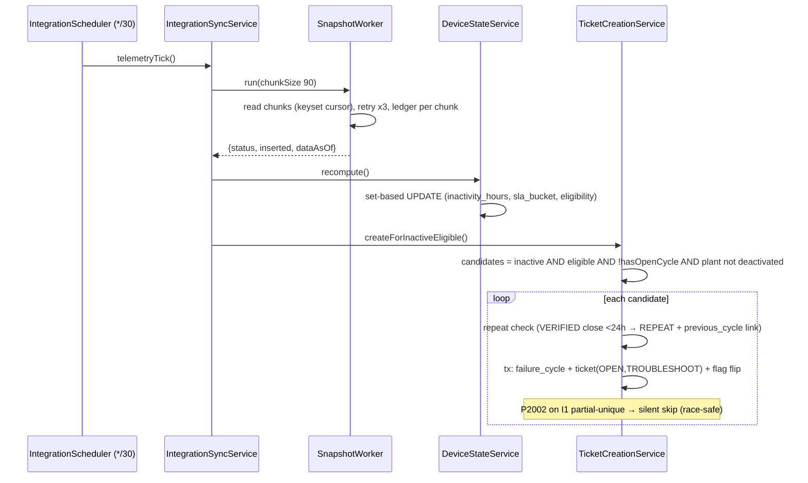
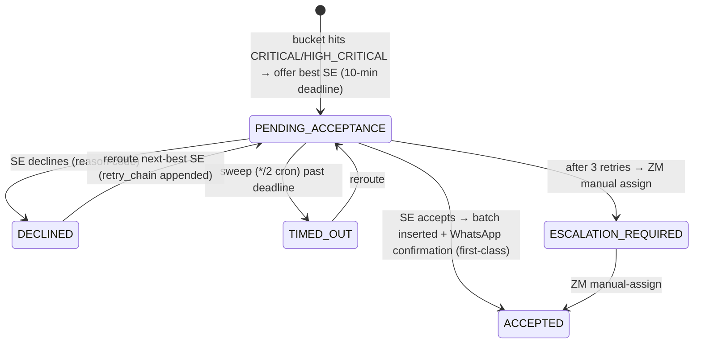

# 11 — Business Workflows

Sequence diagrams for the workflows reconstructed from services + e2e tests.

## 1. User login + dashboard load

```mermaid
sequenceDiagram
  actor U as User
  participant SPA as Admin SPA
  participant API as Backend
  U->>SPA: credentials
  SPA->>API: POST /auth/login
  API-->>SPA: token pair
  SPA->>API: GET /me
  API-->>SPA: {role, zone_id, acted_as_role}
  SPA->>SPA: buildNav(role); route to role dashboard
  par freshness banner
    SPA->>API: GET /snapshots/latest
  and dashboard data
    SPA->>API: GET /dashboard/zone-overview (+critical-queue, action-required)
  end
  API-->>SPA: device_states aggregates (never raw telemetry)
```

## 2. Inactivity detection → ticket (the automated funnel)



## 3. Morning dispatch (recommend + day plan)

```mermaid
sequenceDiagram
  participant CRON as DispatchScheduler (05:00)
  participant DR as DispatchRunService
  participant RS as RecommenderService
  participant BA as BatchAssignmentService
  CRON->>DR: runForActiveZones(now)
  loop each zone with >=1 plant
    DR->>RS: runForZone(zone)
    RS->>RS: mode = DEFICIT|PREVENTIVE (soft-inactive count vs threshold)
    RS->>RS: canonical sort OPEN unassigned tickets (+install backlog if PREVENTIVE)
    loop each ticket
      RS->>RS: candidates by precedence Dedicated→MultiPlant→Floating
      RS->>RS: hard filters (available, capacity, common kit, availability windows)
      RS->>RS: planner soft-bias pick → scoreCandidate (weights, cluster multiplier)
      RS->>RS: recommendations row SUGGESTED | UNASSIGNABLE (+component-blocked record)
    end
    DR->>BA: dispatchForZone (tx + zone advisory lock)
    BA->>BA: consume SUGGESTED → work_schedule ACTIVE + plant batches + stop order
    BA->>BA: ticket.assignment_state = FORMALLY_ASSIGNED; notify SE (day-plan-notifier)
  end
```

## 4. Field repair + GPS verification

```mermaid
sequenceDiagram
  actor SE
  participant API as Backend
  participant VS as VerificationService (cron */5)
  SE->>API: POST /tickets/:id/soft-state (VIEWED → ON_SITE geofence/manual → TROUBLESHOOT_STARTED)
  SE->>API: POST /tickets/:id/troubleshoot {client_submission_id, root_cause, gps, components}
  API->>API: idempotent by (se_id, client_submission_id); ticket → SUBMITTED/VERIFICATION_PENDING
  API->>API: inventory_transactions PRE_VERIFICATION; verification_run PENDING opened
  VS->>VS: sweep: first ping within ±500m of SE form GPS → PHASE_1_PASS (fraud_flag if not)
  VS->>VS: continued pinging → PHASE_2_PASS
  VS->>API: outcome CLOSED (cycle VERIFIED, inventory DEDUCTED) | FAILED_VERIFICATION (ROLLED_BACK)
  Note over API: re-failure <24h after VERIFIED → next cycle = REPEAT (ADR-0021)
```

## 5. Component-unavailable pause (WAITING_COMPONENT)

```mermaid
sequenceDiagram
  actor SE
  actor WM
  SE->>API: troubleshoot submit component_unavailable=true
  API->>API: component_request REQUESTED (1 per submission); cycle → WAITING_COMPONENT; SLA paused
  WM->>API: POST /warehouse/requests/:id/approve → ship {trackingRef, destination}
  SE->>API: POST /component-requests/:id/confirm-receipt
  SE->>API: POST /component-requests/:id/confirm-resubmit → SLA resumes, cycle back in play
  Note over API: reject path → rejection reason → ZM visibility; delivery_destination drives floating-SE resubmit ownership
```

## 6. Intraday CRITICAL insertion (offer state machine)



## 7. Non-Operational marking (dual confirmation) & recovery

```mermaid
sequenceDiagram
  actor ZM
  actor Cust as Customer
  actor OH
  ZM->>API: POST /non-op {device, reason, window}
  API->>API: state REQUESTED → AWAITING_CUSTOMER_CONFIRMATION; email one-time token link
  Cust->>API: GET /non-op/confirm?token=... (public)
  API->>API: → AWAITING_ZM_CONFIRMATION → ZM confirm → CONFIRMED
  OH->>API: POST /non-op/:id/override-confirm (7-day no-response, reason mandatory)
  API->>API: CONFIRMED: device leaves eligibility; open TROUBLESHOOT → CLOSED_NON_OPERATIONAL
  API->>API: RECURRING deal + physical-retrieval reason → auto-create RECOVERY ticket
  Note over API: RECOVERY: REQUESTED→SCHEDULED→ON_SITE→COLLECTED→RECEIVED_AT_WAREHOUSE (WM receipt auto-closes) | unable-to-collect → ZM decision queue
```

## 8. Cross-zone escalation

Platinum ticket unassigned past threshold (1h CRITICAL / 4h OPEN) → auto-escalation row
(sweep, */15); ZM can manually flag Gold/Silver. CSM/OH approve (target zone + SE → formal
assignment), deny (reason; stays in home queue), defer (review date); denied AUTO can re-escalate
to OH. Ticket never leaves its home queue (`cross-zone/cross-zone-escalation.service.ts`).

## 9. Expense voucher

DRAFT (mobile, offline, client_submission_id) → SUBMITTED → ZM review (approve / reject /
needs-clarification; over-limit rows flagged) → OH monthly finance export → mark PAID (batch ref).
SE cannot self-approve; PAID requires prior APPROVED (`vouchers.service.ts`, schema D15).

## 10. Reporting cadence

Daily 01:30: system-efficiency (previous day). Twice daily 06/18h: soft-inactive snapshot
(also drives the recommender DEFICIT/PREVENTIVE switch). Month-start 03:00/03:15/03:30 staggered:
fleet-uptime, root-cause, ZM-performance cubes for the month just ended. All recomputable
on demand via `POST /reports/*/recompute`.
