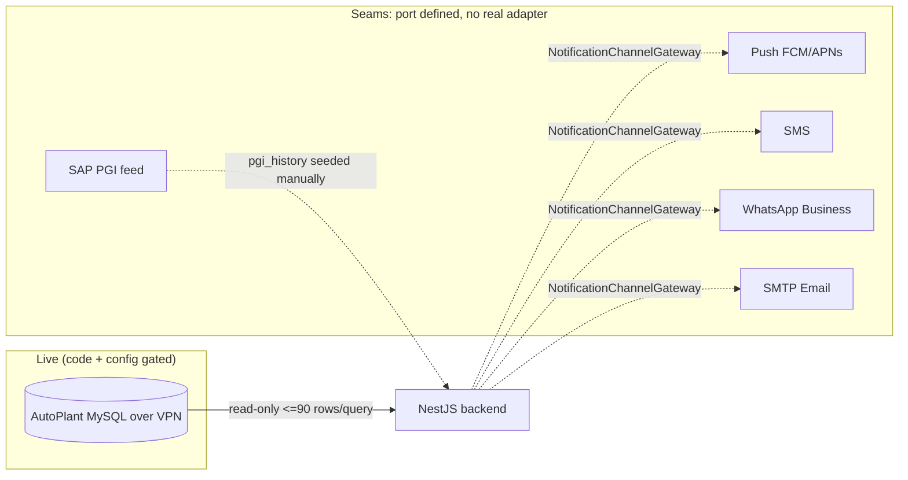

# 12 — External Integrations

## 1. AutoPlant MySQL (the only LIVE integration)

Read-only mirror of the upstream telematics system, reached over VPN via `mysql2` lazy pool
(`ingestion/autoplant/autoplant-mysql.client.ts`). Two schemas:

- `ap_masters` — `mst_company`, `mst_transporter`, `mst_plant` (org hierarchy)
- `ap_widgets` — `tb_vehiclemaster` (vehicle+device masters, GPS telemetry columns)

**Hard constraints honoured in code:** DBA cap of <100 rows/query → all reads paginated ≤90
(`MasterSyncService` scope + `AutoPlantSourceReader` keyset cursor); query + connect timeouts
env-tuned so a VPN drop fails a tick fast instead of hanging.

**Config-gated wiring** (`ingestion.module.ts`): when `AUTOPLANT_MYSQL_*` env is unset, DI binds
`InMemorySourceReader([])` and `EMPTY_MASTER_SOURCE` — dev/test/CI boot with zero external
dependencies; the sync controller answers 503; health reports degraded, never crashes.

**Sub-pipelines:**

| Pipeline | Source | Target | Idempotency |
|---|---|---|---|
| Master sync (daily 02:00) | ap_masters + master cols of tb_vehiclemaster | company_master, transporters, plants, vehicles, devices | upsert by `source_*_id`; FSM-owned columns excluded from UPDATE (anti-drift); skips itemised to `master_sync_rejects` |
| Telemetry snapshot (*/30) | tb_vehiclemaster ping columns | raw_device_snapshots (daily partitions) | UNIQUE `(device_id, gps_datetime)` + ON CONFLICT DO NOTHING; keyset resume cursor |
| Zone resolution | mst_plant.zone_name (raw) | zone_mappings crosswalk → plants.zone_id | normalized key (trim/lower/collapse); unseen → PENDING queue; per-plant override table wins; edits applied via explicit `reapply`, never by re-sync |

Timestamps: source is IST-offset; `AUTOPLANT_SOURCE_UTC_OFFSET_MIN` normalizes to UTC at ingest
(`ingestion/normalize.ts`); Prisma session pinned UTC so the offset can never re-enter.

Health surface: `GET /integration/health` — connectivity probe + source-vs-mirror reconciliation
counts (null/degraded when unconfigured) (`ingestion/autoplant/health.service.ts`).

## 2. SAP PGI (Post-Goods-Issue) — **seam only**

`pgi_history` table feeds the eligibility gate (active PGI ≤15 days). The schema comment states
the SAP integration is external/deferred and rows are seeded directly
(`schema.prisma` PgiHistory model). Because `eligibility_mode` defaults to `pgi` over an empty
table, **eligibility currently yields no devices unless the mode is switched to `all-deployed`**
(`device-state/eligibility.ts`, `device-state.service.ts:60-68`).

## 3. Notification channels (Push/SMS/WhatsApp/Email) — **seam only**

`NotificationChannelGateway` port with default `LoggingChannelGateway` returning `UNAVAILABLE`
(`notifications/notification-channel.gateway.ts`). `NotificationService` owns the fallback chain
(IN_APP always persists; PUSH→SMS→WHATSAPP→EMAIL recorded ATTEMPTED/SKIPPED/SENT per channel in
`notification_deliveries`; WhatsApp acceptance-confirmations flagged `first_class`). Real FCM/APNs,
SMS, WhatsApp Business, SMTP adapters require external accounts — not present anywhere in code.

## 4. Customer email confirm link — half-seam

Non-Op flow generates a tokenised URL from `PUBLIC_API_URL` (`non-operational.service.ts`); the
link handler exists and is public, but no SMTP sender exists (see #3) — the email itself cannot
be sent by this codebase today.

## External integration map

This matches the repo's stated "build the seam" policy for external integrations (CLAUDE.md
surfacing rule) — verified true in code for all five.
