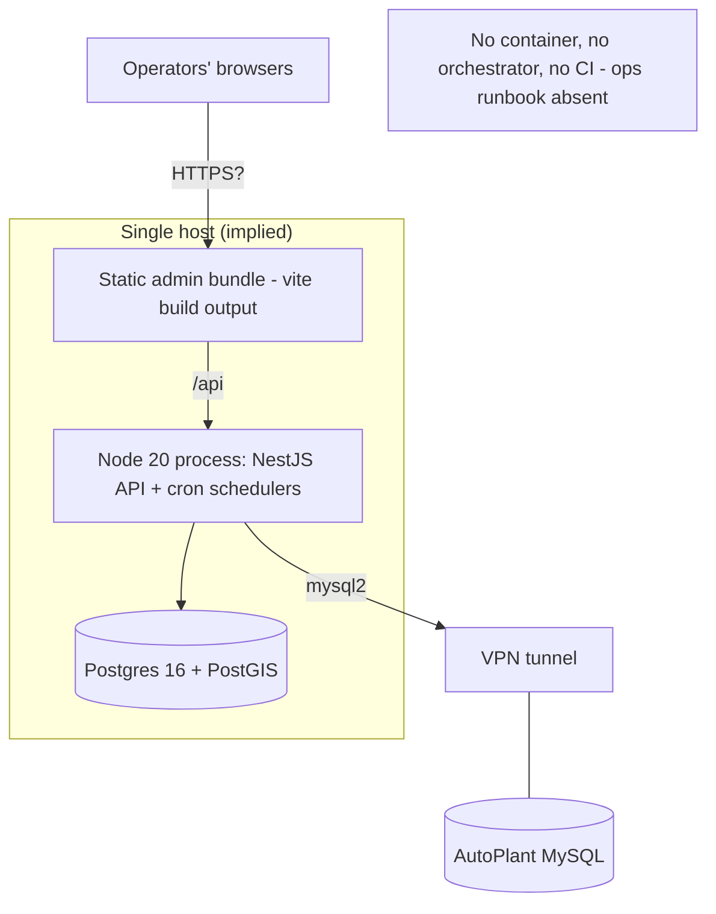

# 13 — Infrastructure & Deployment

## What exists (verified)

| Concern | Reality | Evidence |
|---|---|---|
| Runtime topology | **One Node process** serves HTTP + all cron + all "workers" | `main.ts`; schedulers are `@Injectable` in the same AppModule graph |
| Database | Single Postgres 16 + PostGIS instance via `DATABASE_URL`; Prisma migrations | `prisma/`, `prisma.service.ts` |
| Web serving | Vite dev server :5173 / `vite build` static bundle; no server-rendering | `apps/admin` |
| Process mgmt | `node -r dotenv/config dist/main.js` — dotenv-based env, no PM2/systemd files | backend `package.json` |
| Graceful shutdown | `enableShutdownHooks` → Prisma disconnect + MySQL pool end | `main.ts:16` |
| Health probes | `/api/health` (live), `/api/health/ready` (DB check) | `health/health.controller.ts` |
| Partition upkeep | `PartitionMaintenanceService` cron pre-creates daily telemetry partitions | `ingestion/partition-maintenance.service.ts` |
| Observability | Nest `Logger` to stdout only; correlation id on 500s; DB-side run ledgers + audit trail act as the operational record | `all-exceptions.filter.ts`, `snapshot_runs`, `audit_logs` |

## What does NOT exist (verified by absence — this is the gap list)

- **No Dockerfile / docker-compose** anywhere in the repo.
- **No CI/CD**: no `.github/workflows`, no GitLab/Jenkins/Azure files.
- **No IaC / deployment manifests** (k8s, terraform, serverless — none).
- **No reverse proxy / TLS config**; CORS assumes a single admin origin.
- **No metrics/tracing/APM**, no Prometheus endpoint, no Sentry.
- **No log aggregation** (comments mention Pino aspirationally; only Nest Logger is used).
- **No secrets management** beyond `.env` files (gitignored).
- **No horizontal scalability**: in-memory refresh tokens, in-memory scheduler guards, and
  in-process cron all assume exactly one instance.

## Deployment architecture (as the code permits today)

## Environment matrix (behavioural switches)

| Environment | AutoPlant env | Scheduler flags | Effective behaviour |
|---|---|---|---|
| dev / test / CI | unset | unset | boots on mock/no-op sources; nothing scheduled; manual HTTP triggers only |
| staging-like | set | unset | live reads possible via manual triggers; still no automation |
| production-intended | set | `INGESTION_SCHEDULER_ENABLED=true`, `BUSINESS_SWEEPS_ENABLED=true`, `PARTITION_MAINTENANCE_ENABLED=true` | fully self-running pipeline + sweeps + daily dispatch |

## Test infrastructure (the de-facto "environment" that exists)

- Backend: vitest + supertest; e2e specs boot Nest test apps against a real Postgres
  (`test/test-db-url.ts`, `test/global-setup.ts`); deterministic world-seeder in
  `test/env/book8/`; 268 spec files.
- Admin: vitest/jsdom component tests + Playwright-based visual regression scripts
  (`apps/admin/visual/`).
- Known operational caveat (local): full backend suite can OOM a fork on 8 GB machines.
