# 14 — Architecture Diagrams (Consolidated)

All 20 required diagrams. Richer domain-specific variants live in the topical files
(05 database, 06 API, 09 auth, 11 workflows).

## 1. High-level system architecture

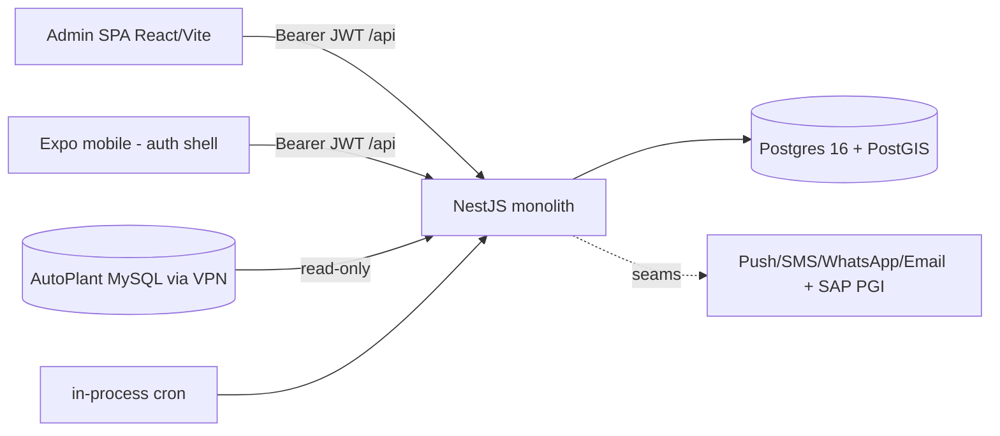

## 2. Application architecture

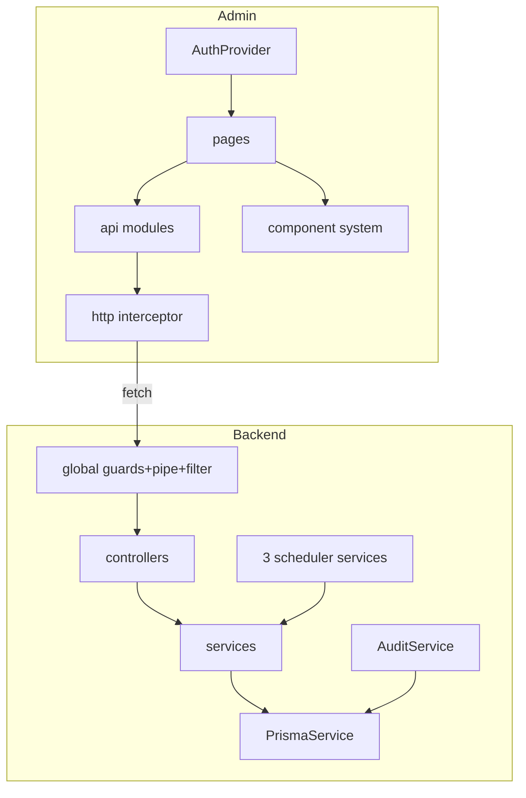

## 3. Backend module diagram

```mermaid
graph TD
  APPM[AppModule] --> PRISMA[Prisma] & AUTH[Auth] & SET[Settings] & AUD[Audit]
  APPM --> ORG[Org] & ING[Ingestion] & TICK[Ticketing] & DEV[Devices]
  APPM --> RECO[Recommender] & SCHD[Scheduling] & BSS[BusinessSweepScheduler]
  APPM --> IDY[Intraday] & CZ[CrossZone] & SP[SharedPool] & PLN[Planner]
  APPM --> DASH[Dashboard] & REP[Reports] & SS[SoftState] & VER[Verification]
  APPM --> INV[Inventory] & CR[ComponentRequest] & ENG[Engineers] & RB[RoleBackup]
  APPM --> NOT[Notifications] & VOU[Vouchers] & EXP[Exports] & PD[PlantDeactivation]
  ING --> DSTATE[DeviceState] & TICK
  SCHD --> RECO
```

## 4. Frontend architecture

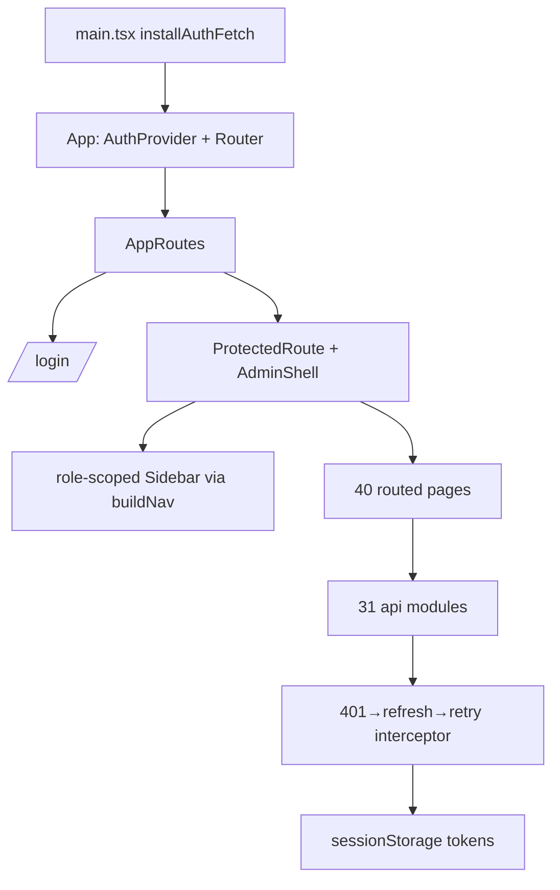

## 5. Database ER diagram (core; full set in 05)

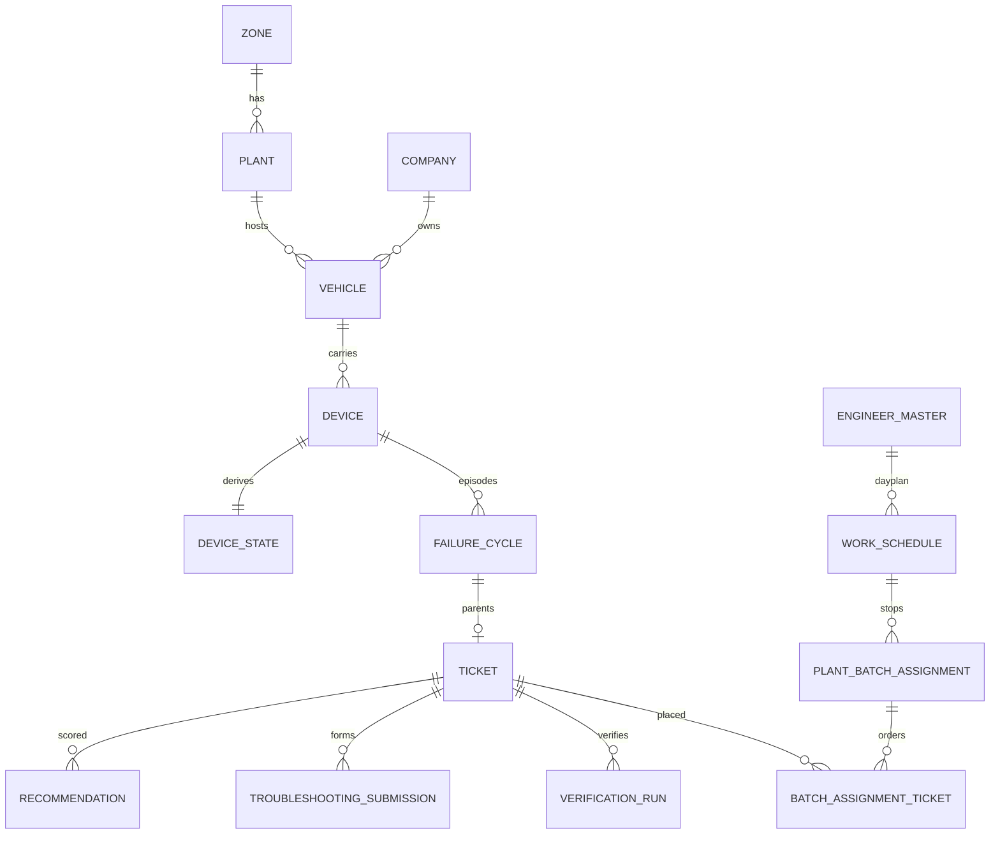

## 6. Authentication flow

```mermaid
sequenceDiagram
  participant B as Browser
  participant A as AuthController
  B->>A: POST /auth/login
  A->>A: scrypt verify (in-memory store)
  A-->>B: 15m HS256 access + 30d rotating refresh
  B->>B: sessionStorage; proactive refresh at exp-60s
  B->>A: POST /auth/refresh (single-use token)
  A-->>B: rotated pair | 401 → session expired
```

## 7. Authorization flow

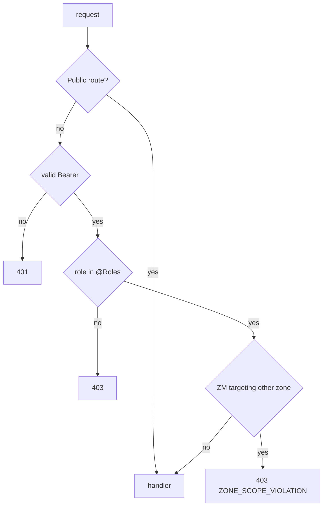

## 8. Request lifecycle

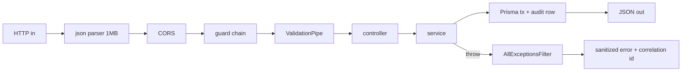

## 9. API flow (typical mutation)

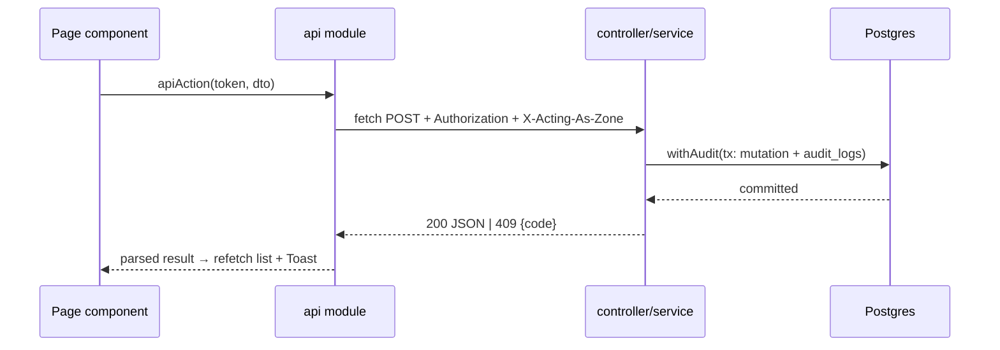

## 10. Business logic flow (device outage lifecycle)

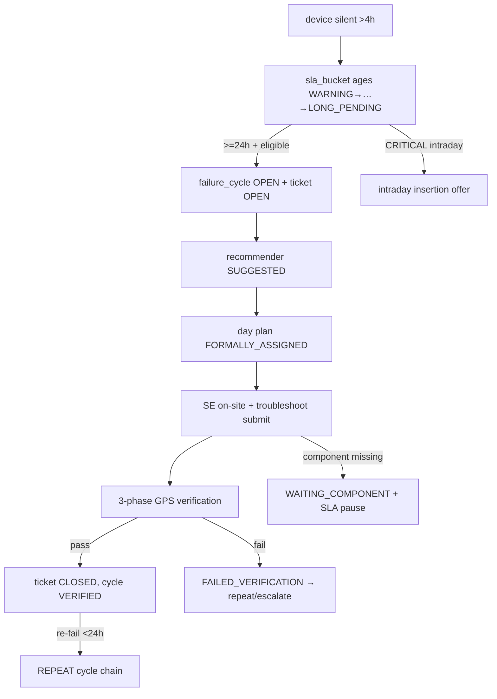

## 11. Data flow

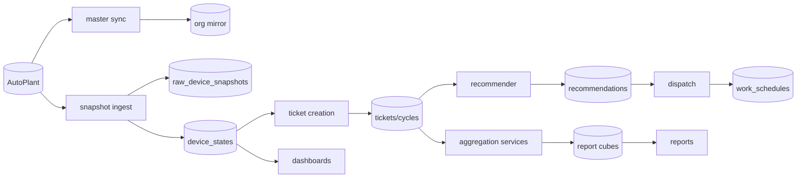

## 12. Scheduler / cron architecture

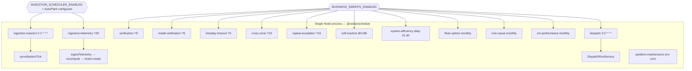

## 13. Queue / worker architecture

**There are no queues and no separate worker processes.** The "workers"
(SnapshotIngestionWorker, aggregation services) are plain injectable classes invoked by cron
ticks or HTTP triggers inside the API process. Serialization is done by DB partial-unique
in-flight guards, per-zone advisory locks, and in-memory sets — not by a broker.

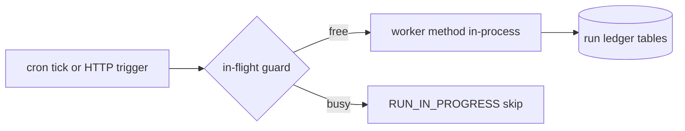

## 14. External integrations

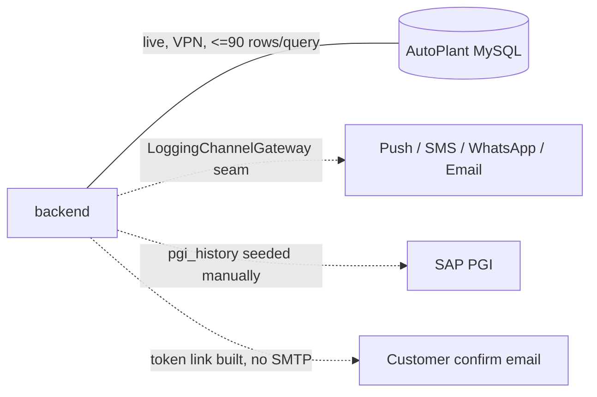

## 15. Infrastructure diagram

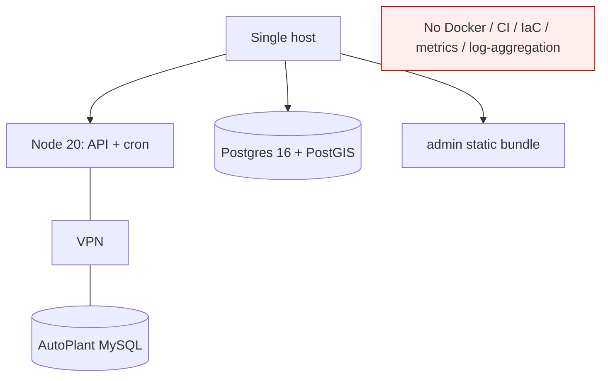

## 16. Deployment architecture

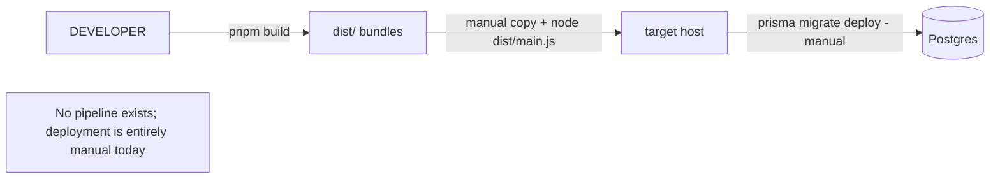

## 17. Dependency graph (runtime composition)

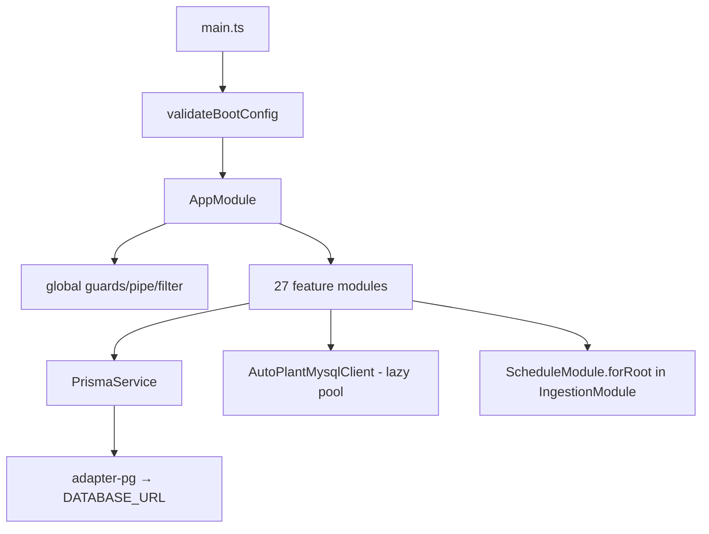

## 18. Package dependency graph

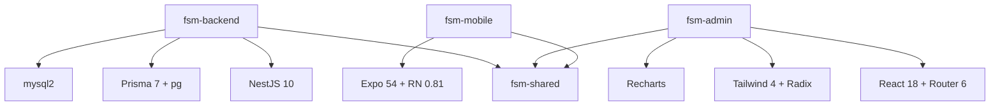

## 19. Module dependency graph (backend, condensed)

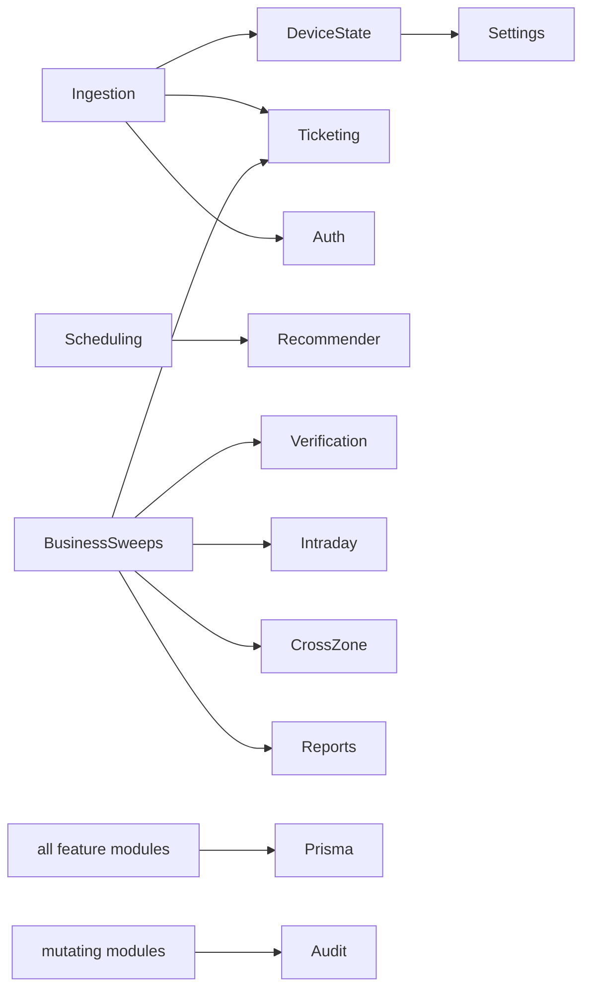

## 20. Complete end-to-end sequence

```mermaid
sequenceDiagram
  participant AP as AutoPlant
  participant SCH as Cron
  participant PIPE as Ingestion pipeline
  participant DB as Postgres
  participant DISP as Dispatch
  participant ZM as ZM (admin)
  participant SE as SE
  participant VER as Verification sweep
  participant REP as Report cubes
  SCH->>PIPE: telemetry tick (*/30)
  PIPE->>AP: read chunks (<=90)
  PIPE->>DB: raw snapshots + device_states + new tickets
  SCH->>DISP: 05:00 dispatch tick
  DISP->>DB: recommendations → work_schedules (Day Plan)
  ZM->>DB: overrides / manual assigns (audited)
  SE->>DB: soft states → troubleshoot submission (idempotent)
  VER->>AP: (via ingested pings) phase 1/2 checks
  VER->>DB: ticket CLOSED | FAILED_VERIFICATION; inventory DEDUCTED | ROLLED_BACK
  SCH->>REP: daily/monthly aggregation ticks
  REP->>DB: summary cubes
  ZM->>DB: dashboards + reports read derived tables
```
