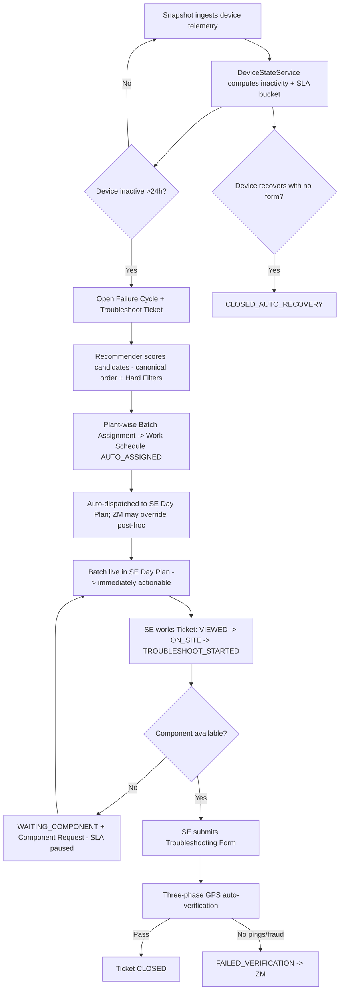
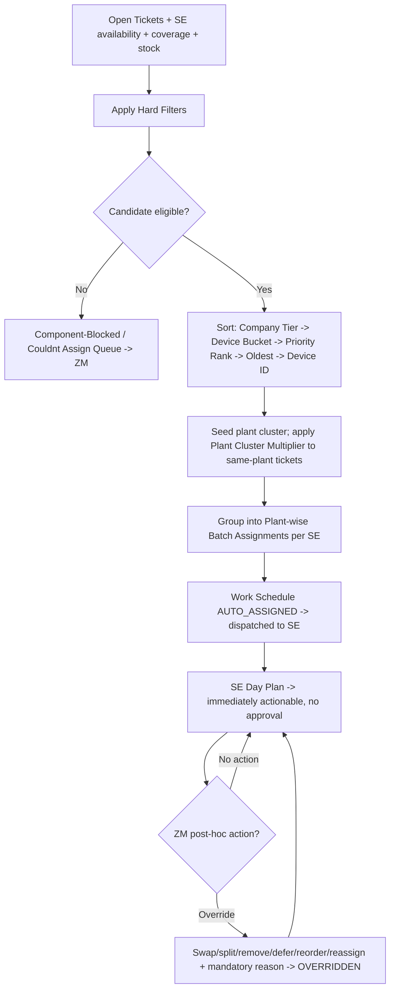
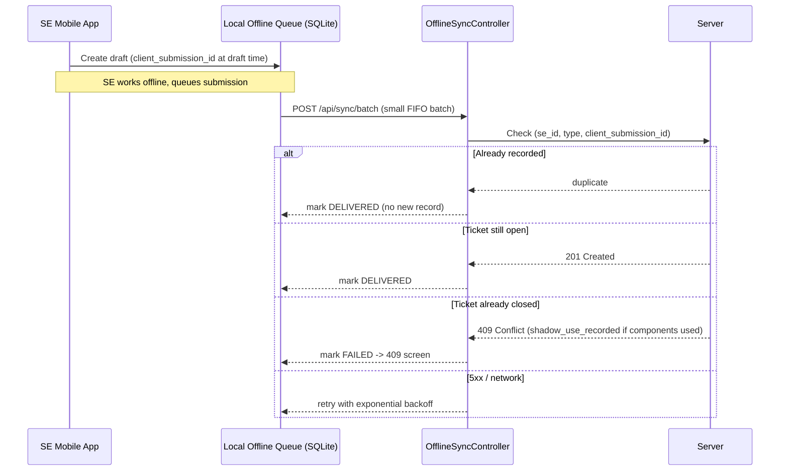
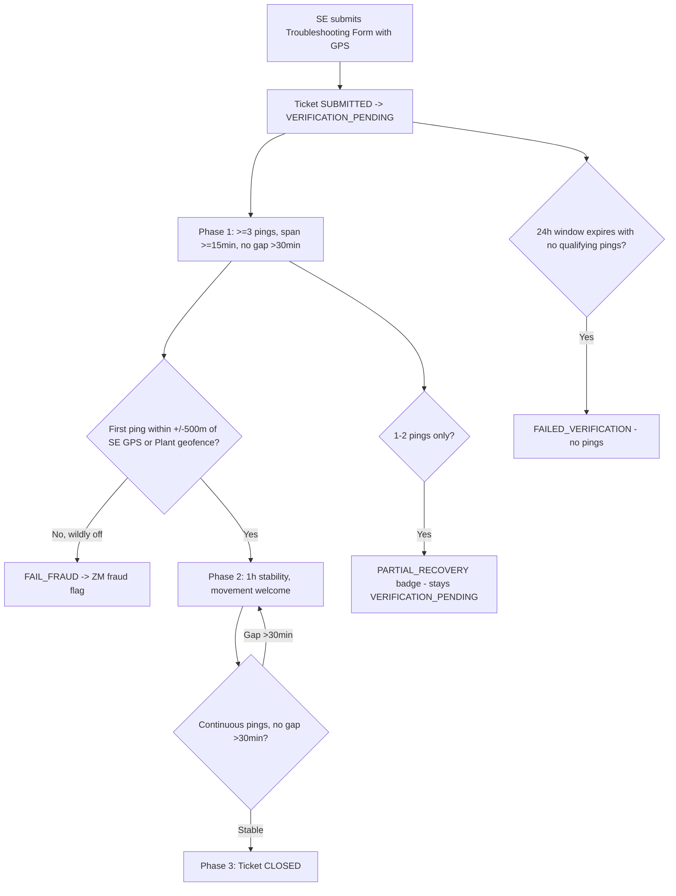
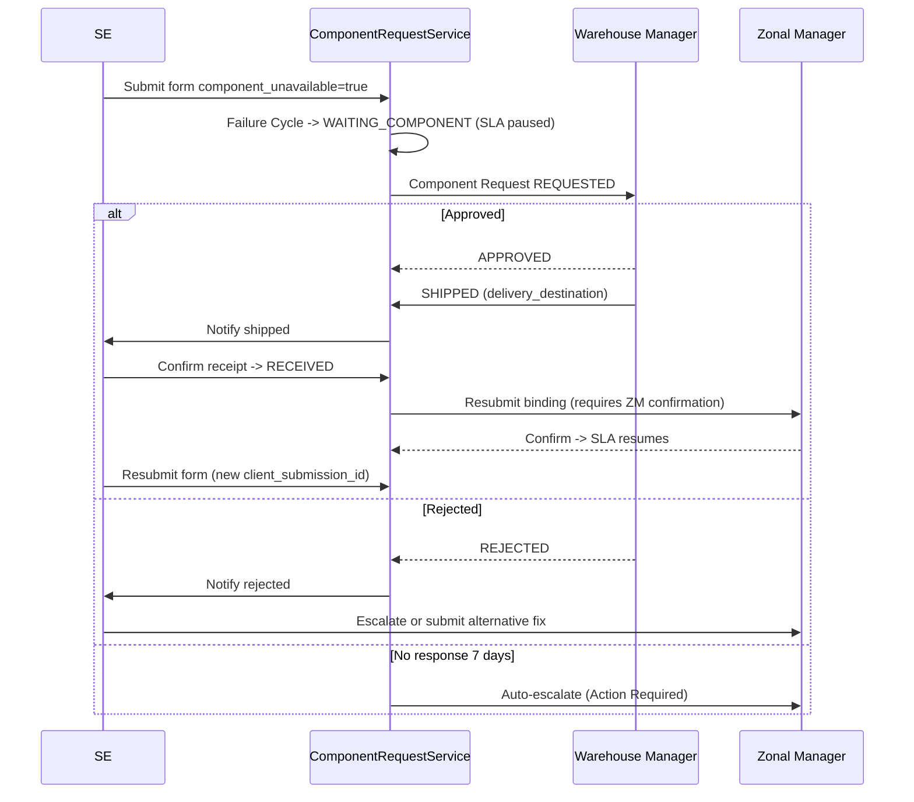
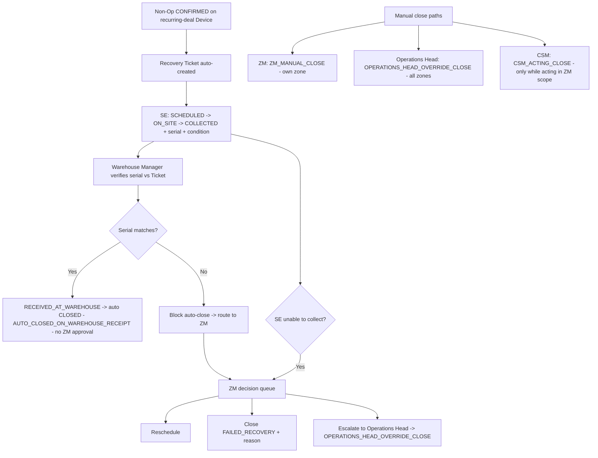
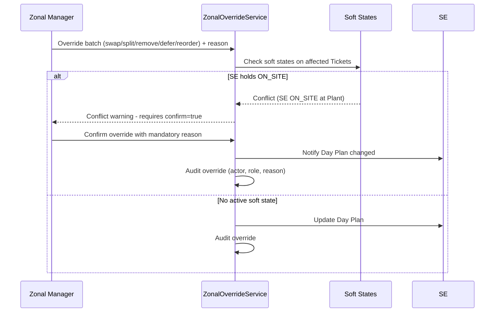

# FSM GPS Field Service Management — Business & Technical Workflow

> **Status:** Living document · **Date:** 2026-06-05
> **Source of truth:** CONTEXT.md (domain language + resolved decisions) · docs/PRD-fsm-admin-dashboard.md (product behaviour)
> **Contradictions found:** Listed in §31 Open Questions. No rules invented silently.

---

## 1. Executive Summary

The FSM system keeps a pan-India fleet of ~50,000 GPS devices at ≥98% active uptime by intelligently routing repair work to ~40 Service Engineers (SEs) through a Zonal Manager-approved scheduling system.

**Operational flow in plain terms:**

1. **Data arrives from GPS hardware.** Every GPS device in the field periodically transmits its location and status to the **AutoPlant DB** GPS platform (the source database). The FSM system ingests these as periodic **Snapshots** — point-in-time reads of all device states.

2. **Inactivity is detected.** After ingestion, the FSM system calculates each device's last GPS transmission timestamp. Any device silent for more than 24 hours is classified as **Inactive** and assigned an **SLA Bucket** based on how long it has been silent (WARNING at 4–8h through LONG_PENDING at 7d+).

3. **A Failure Cycle and Troubleshoot Ticket are created.** When a device crosses the inactivity threshold for the first time in a new episode, the system opens a **Failure Cycle** (an inactivity audit record) and its corresponding **Troubleshoot Ticket** (the actionable work item). One active Failure Cycle per device at a time.

4. **Tickets are grouped by Plant.** The system groups open Tickets by the Plant where the inactive device is located. A Plant is a physical company site — a logistics yard, depot, or factory. Plant-grouping is the foundation of efficient SE routing because one SE visiting one Plant can fix many devices in a single trip.

5. **The Recommender generates Plant-wise Batch Assignments.** The system automatically assigns groups of Tickets from the same Plant to the SE who covers that Plant. Example: Ramesh is the Dedicated SE for Panvel Plant. Panvel has 20 inactive device Tickets. The Recommender creates: **Ramesh → Panvel Plant → 20 Tickets** as one Plant-wise Batch Assignment.

6. **Batches auto-dispatch; the Zonal Manager monitors and overrides.** System-generated Plant-wise Batch Assignments go **directly** to the SE's Day Plan as Formal Assignments — there is **no approval gate**. The Zonal Manager sees the dispatched batch on their web dashboard and can override it at any time — swap SE, split the batch, remove Tickets, defer Tickets, reorder stops, or reassign. They review/override at a **Schedule Cadence** that matches their operational rhythm (daily, alternate day, weekly, or on-demand). There is no fixed 08:00 IST gate and no auto-approve timer (nothing needs approving).

7. **SE sees assigned work on mobile.** As soon as the system dispatches a batch, it appears in the SE's **Day Plan** on the mobile app. The SE can begin acting on Tickets immediately — no approval gate or pre-approval lock blocks SE actions on normal batch work.

8. **SE works from the mobile app.** The SE travels to the Plant, marks ON_SITE on each Ticket, troubleshoots the device, and submits a Troubleshooting Form. The form captures components used, diagnosis notes, and the SE's GPS location. All of this works offline — the app queues submissions locally and syncs when connectivity is restored.

9. **GPS auto-verification confirms closure.** After the SE submits the form, the system watches for the device's GPS pings to resume. Once the device sends ≥3 valid pings within a qualifying window, the Ticket closes automatically as **CLOSED**. If no pings arrive, the Ticket is marked **FAILED_VERIFICATION** and escalates to the Zonal Manager.

10. **Warehouse, inventory, vouchers, leave, and audit are all connected.** Component requests flow through the Warehouse Manager. Expense vouchers submitted by SEs are reviewed by the Zonal Manager before Finance export. Leave requests from SEs are approved by the Zonal Manager, which automatically excludes the SE from the Recommender for the approved window. Every state transition, override, and close action is recorded in an immutable audit trail.

---

## 2. Current Manual Workflow vs New Digital Workflow

| Area | Current Manual Process | New FSM Digital Process | What Improves |
|---|---|---|---|
| **Work list distribution** | Zonal Head shares Excel file via WhatsApp — alternate day, weekly, or 2–3 times per week depending on zone and mood | Recommender auto-generates and dispatches Plant-wise Batch Assignments; Zonal Manager monitors and overrides on dashboard at their own Schedule Cadence | Structured, auditable, consistent — no dependency on WhatsApp message timing |
| **Scheduling cadence** | No consistent rule — completely ad hoc | Configurable cadence (daily / alternate day / 2–3x week / weekly / on-demand); reminder notification is advisory, not a gate | ZM retains flexibility; SEs don't lose work time waiting for a message |
| **SE blocking before dispatch** | SEs sometimes wait hours for WhatsApp message before knowing their assignments | SE acts on Tickets immediately on dispatch — no approval gate, no pending-but-visible lock | SEs start work faster; no idle time |
| **Inactivity visibility** | ZM manually aggregates device reports from spreadsheets; no real-time view | Live dashboard with SLA bucket breakdown, drill-down from zone → company → plant → device, data-as-of Snapshot timestamp | ZM sees the full picture in seconds, with freshness signal |
| **Override and adjustment** | ZM edits Excel and re-sends via WhatsApp; no audit of what changed or why | ZM overrides on dashboard with mandatory reason code; conflict warning if SE already ON_SITE; SE mobile receives push notification on update | Complete audit trail; conflict prevention; real-time SE notification |
| **SE day plan** | SE receives Excel/WhatsApp list; no structure, no ordering, no plant clustering | Ordered, plant-clustered Day Plan on mobile; Technical Hints for each device; QR Scanner to find Ticket quickly | SE travels efficiently; arrives with diagnostic context |
| **Component tracking** | Not tracked — SEs carry whatever they have; warehouse has no visibility | Van Stock tracked per SE; Component-Blocked Queue visible to ZM; Component Requests routed to Warehouse Manager | Components tracked end-to-end; SEs not dispatched without needed parts |
| **Verification of work done** | ZM follows up by phone; no structured confirmation | GPS auto-verification: device resumes pinging → Ticket closes; fraud-flagged if SE GPS and device location mismatch | Work confirmed by physical evidence, not phone calls |
| **Repeat failures** | Not tracked — same device fixed multiple times with no visibility | Failure Cycle links back to prior cycles; REPEAT and ESCALATED flags on Tickets; 3+ cycles in 7 days escalates | ZM sees chronic device failures; can escalate to Operations Head |
| **Auto-recovery** | Not distinguished from SE repairs; SE gets credit for devices that fixed themselves | Auto-recovery detected before form submission; CLOSED_AUTO_RECOVERY status; separated from SE-repaired closures | Accurate SE productivity metrics; component consumption not inflated |
| **Expense reimbursement** | SE submits paper receipts or WhatsApp photos to Zonal Manager; Finance runs on Tally | SE creates digital voucher with photo proof offline; ZM reviews in dashboard; Finance exports monthly Excel | Structured approval flow; ZM verifies activity record before approving |
| **Leave tracking** | ZM manages SE leaves informally via calls/WhatsApp | SE submits Leave Request in app; ZM approves; system auto-excludes SE from Recommender for approved window | SE leave visible at planning time; no surprise capacity gaps |
| **Audit trail** | No audit trail; no way to know who approved what or when | Every state change, approval, override, and close action recorded with actor, role, timestamp, and reason | Full accountability; post-incident review possible |
| **SLA monitoring** | No automated SLA tracking; manual follow-up | SLA bucket age tracked per device; Action Required panel surfaces critical items; SLA pauses only for documented reasons (WAITING_COMPONENT or a filed Vehicle Unavailability Report); a manager-only Secondary SLA Clock never pauses | Contractual SLA commitments supported by automated escalation; paused clocks can't hide aging |
| **Cross-zone escalation** | Informal phone calls between Zonal Heads; no structured handover | Platinum company tickets auto-escalate to Central Service Manager after 1h unassigned in CRITICAL; Gold/Silver via ZM flag | Platinum SLAs protected automatically; no escalation falling through the cracks |

---

## 3. Core Actors and Responsibilities

### 3.1 Service Engineer (SE)

The field engineer who physically installs and repairs GPS devices.

| Capability | Details |
|---|---|
| **Can view** | Own Day Plan (assigned Plant-wise Batch Assignments); Shared Pool (open Tickets for covered Plants, always-visible secondary); Ticket Detail with Transporter name + contact, Technical Hints and raw telemetry; Van Stock levels; own Expense Vouchers; own Leave Requests; Verification outcomes on own Tickets |
| **Can create** | Troubleshooting Form submission (with client_submission_id); Expense Voucher draft; Leave Request; Vehicle Unavailability Report (when the vehicle is not available to work) |
| **Can update** | Soft States on Tickets (VIEWED → ON_SITE → TROUBLESHOOT_STARTED; ON_SITE auto-updates from geofence capture, manual tap fallback); SOFT_UNAVAILABLE flag with time window; Confirm Component Request receipt |
| **Can approve** | Intra-day CRITICAL insertion (Accept or Decline with reason code) — this is the **only** accept/decline gate the SE has |
| **Cannot do** | **Reject normal assigned work** — there is no Reject option for normally assigned Tickets, Plant-wise Batch Assignments, or Work Schedules (they are committed and immediately actionable; an SE who cannot work a Ticket files a Vehicle Unavailability Report or marks incomplete/unable with a mandatory reason, never "rejects" it); approve own Leave Request; set own availability to ON_LEAVE/WEEKLY_OFF directly; create Tickets; override batch assignments; view other SEs' Day Plans; access ZM dashboard; modify Van Stock directly |

### 3.2 Zonal Manager (ZM)

Operations owner of one Zone. Monitors and overrides system-dispatched SE assignments (no approval gate) and resolves conflicts within their zone.

| Capability | Details |
|---|---|
| **Can view** | Zone Dashboard Home (own zone); Batch Schedule Monitoring & Override (own zone); Intra-day Queue (own zone); Ticket List & Detail (own zone); SE Management & Planner (own zone); Verification Review (own zone); Non-Op Marking Queue (own zone); Expense Voucher Review (own zone); Component-Blocked Queue (own zone); Component Requests (own zone, read-only); Secondary SLA Clock; Reports (own zone) |
| **Can create** | Install Tickets for own-zone Plants (single or CSV; `created_by_role = ZONAL_MANAGER`); manual Ticket assignments; SE Planner entries; manual same-day Day Plan updates |
| **Can update** | Override dispatched batch assignments (swap SE, split batch, remove Tickets, defer Tickets, reorder stops, reassign); set SE availability (ON_LEAVE / OFF_SHIFT / WEEKLY_OFF / SOFT_UNAVAILABLE); edit/confirm Vehicle Unavailability expected window and resume SLA; manually update in-progress Day Plans; manually close Recovery Tickets in exception cases (with mandatory reason) |
| **Can approve** | SE Leave Requests; Expense Vouchers (ZONAL_MANAGER_REVIEW → APPROVED / REJECTED / NEEDS_CLARIFICATION); Non-Operational marking requests (own zone); cross-zone escalation flags for Gold/Silver companies |
| **Cannot do** | Approve cross-zone capacity (Central Service Manager authority); access other zones' data; create Install Tickets outside own zone; approve Component Request stock movement unless explicitly authorized; access Warehouse queues; mark Expense Vouchers as PAID (Operations Head authority); configure system settings |

### 3.3 Central Service Manager (CSM)

Cross-zone operational layer. Normal authority: cross-zone reporting and SE-deployment approvals. Acting authority: full Zonal Manager scope when a ZM is unavailable.

| Capability | Details |
|---|---|
| **Can view** | All zones (read + acting scope on Batch Schedule Review and Intra-day Queue); Cross-Zone Dashboard (full access); all Ticket lists across zones |
| **Can create** | Cross-zone SE deployment approvals; Install Tickets within authority scope (single or CSV; `created_by_role = CENTRAL_SERVICE_MANAGER`) |
| **Can update** | All Zonal Manager actions when acting in ZM scope (displayed as "Acting as Zonal Manager for [Zone]" banner); all actions carry `acted_as_role = CENTRAL_SERVICE_MANAGER` in audit. **Current-phase access:** complete access across all modules and all zones |
| **Can approve** | Cross-zone escalation requests from ZMs and auto-triggered Platinum escalations; batch override when acting in ZM scope (no approval gate exists) |
| **Cannot do** | Close Recovery Tickets outside acting scope; access Settings; mark Expense Vouchers as PAID; approve Expense Vouchers outside acting scope |

### 3.4 Operations Head

Fleet-wide strategic owner and system configurator. Acts as second-line backup when both ZM and CSM are unavailable.

| Capability | Details |
|---|---|
| **Can view** | All zones, all data, all reports; Fleet Uptime % per zone/company/plant; **ZM Performance Scorecard** (Operations Head / Operations Manager only — measures quality/impact of each ZM's decisions; computed from assignment history/audit/SLA outcomes/overrides; not a ZM self-score); Root Cause Analytics %; System Efficiency Report; Device Detail downtime history/trend — all read from summary tables |
| **Can create** | Install Tickets (manually or via CSV bulk upload); user accounts for all roles |
| **Can update** | Zones, plants, SE mappings, SE coverage types; SLA rules; Company Tier and Company Priority Rank; Common Kit definition; Recommender scoring weights; `device.deal_type` when CRM/SAP data is missing; override-confirm Non-Operational markings after 7-day non-response; manually close or override Recovery Tickets in any zone (with mandatory reason) |
| **Can approve** | Non-Operational marking override-confirm (any zone); mark Expense Vouchers PAID after Finance export; Finance Excel export |
| **Cannot do** | Self-approve anything without audit trail; bypass the mandatory reason requirement on any manual close |

### 3.5 Warehouse Manager

Owner of physical inventory. No access to SE Day Plans or Ticket assignments.

| Capability | Details |
|---|---|
| **Can view** | Component Requests (all zones); Shadow Use Queue (all zones); Warehouse Stock levels (all zones); GPS serial numbers and SIM serial numbers on Install Tickets |
| **Can create** | Shadow Use reconciliation decisions; inventory rollback transactions when verification fails |
| **Can update** | Component Requests (APPROVED / REJECTED / SHIPPED); mark Recovery Ticket as RECEIVED_AT_WAREHOUSE (triggers auto-close); reconcile Shadow Use Queue (RECONCILED or DISPUTED); Zone Warehouse stock levels |
| **Can approve** | Component Requests |
| **Cannot do** | Access ZM Batch Schedule Review; approve Expense Vouchers; set SE availability; access non-warehouse Ticket queues |

### 3.6 System / Recommender / Workers

Automated background services that act on domain objects without human intervention.

| Capability | Details |
|---|---|
| **Generates** | Plant-wise Batch Assignments (Morning Batch); Intra-day Re-plan on Qualifying Events; Technical Hints from snapshot telemetry; SLA bucket classifications; SE Activity Status (derived at query time, never stored) |
| **Creates** | Failure Cycles and Troubleshoot Tickets on inactivity threshold; Recovery Tickets on Non-Op CONFIRMED for RECURRING deals; Shadow Use inventory transactions on 409 Conflict |
| **Sends** | SE Acceptance notifications for CRITICAL intra-day insertions; WhatsApp Confirmation on SE Acceptance; escalation notifications on 3 retry failures; stale Snapshot alerts |
| **Closes** | Tickets via auto-verification (CLOSED, CLOSED_AUTO_RECOVERY, FAILED_VERIFICATION); Recovery Tickets via RECEIVED_AT_WAREHOUSE warehouse confirmation; in-flight Tickets as CLOSED_NON_OPERATIONAL on Non-Op CONFIRMED |

---

## 4. Core Domain Objects

### Snapshot
**Business:** A periodic photograph of all GPS device states from the **AutoPlant DB** source system. The timestamp on the Snapshot is the "freshness" signal displayed on every dashboard panel. A stale or failed Snapshot means device data is outdated — inactive devices may not surface in time for SE dispatch.
**Technical:** A record in `SNAPSHOT_RUNS` with `status = RUNNING | SUCCESS | FAILED | PARTIAL`, `started_at`, `completed_at`, and a `data_as_of` timestamp. The Snapshot run processes raw device records from **AutoPlant DB** in chunks; a failed chunk retries without restarting the full run. All panels derive their "data as of [timestamp]" label from the last `SUCCESS` snapshot.

### Device
**Business:** A single GPS unit (e.g., device model NG-300 with IMEI 123456789). One device can be mapped to one vehicle at a time. A vehicle can carry multiple devices in different roles (PRIMARY, SECONDARY, BACKUP, etc.).
**Technical:** Identified by `device_id`. Has a `device_role` on the `VEHICLE_DEVICE_MAPPING` table. Auto-verification tracks the specific `device_id` named in the Ticket — not the vehicle. A BACKUP device waking up does not close a PRIMARY device's Ticket.

### Vehicle
**Business:** The physical truck or commercial vehicle that carries GPS devices. The SE contacts the Transporter to get access to the vehicle for repair.
**Technical:** Identified by `vehicle_no`. Carries a `readiness` state: `AT_PLANT | UPCOMING_TRIP | ON_TRIP | STALE | UNKNOWN | WAITING_CONFIRMATION | AVAILABLE_FOR_REPAIR` (`EXPECTED_BACK` is **removed**). Readiness is an input to the Recommender's Hard Filter — **only `ON_TRIP` blocks normal assignment**. An external **LR Date / Next Trip** signal (a planning hint from another application) feeds `UPCOMING_TRIP` (planned trip soon — colour hint, not a blocker) and, with current system time, `ON_TRIP` (on trip now — blocks normal assignment; Ticket still created and visible to ZM / Ticket Pool, manager override possible with reason/audit). `AT_PLANT` is confirmed **only by SE field action** (ON_SITE / deliberate location capture) — never inferred from LR Date. `UNKNOWN` / `STALE` are colour warnings only — they never block assignment and never require SE Confirmation. LR Date alone never confirms `AT_PLANT` and never pauses SLA.

### Plant
**Business:** A physical company site (logistics yard, depot, factory) that houses vehicles. The unit of SE visit planning — one SE drives to one Plant and fixes multiple devices in a single trip. Plant clustering is the primary efficiency mechanism.
**Technical:** Has `plant_id`, `zone_id`, `district_id`, `lat`, `lon`. One plant can have vehicles from multiple Transporters. Plants are the grouping key for Batch Assignments.

### Transporter
**Business:** The logistics company that operates vehicles at a Plant. The SE calls the Transporter to arrange vehicle access — not the Customer (company that holds the GPS contract).
**Technical:** Reference entity linked to vehicles. Appears on Ticket Detail for SE field use. Not a billing entity in FSM.

### Zone
**Business:** A coarse geographic rollup of Plants (NORTH / SOUTH / EAST / WEST). One Zonal Manager owns one Zone. All SE coverage, Batch Assignment review, and SLA monitoring happens within Zone scope.
**Technical:** Has `zone_id`, `zone_name`. The authority boundary for ZM actions. Cross-zone work requires CSM or Operations Head involvement.

### Service Engineer (SE)
**Business:** The field engineer. Has a coverage type (Dedicated to one Plant, Multi-Plant across 3–4 Plants, or Floating across a Territory). Has a Van Stock of components carried in the field.
**Technical:** `ENGINEER_MASTER` table with `engineer_id`, `name`, `coverage_type`, `zone_id`, `last_activity_at`. Coverage stored in `SE_COVERAGE` (plant-bound) or `ENGINEER_TERRITORY_COVERAGE` (Floating SE with hierarchical districts + polygon). `SE_AVAILABILITY` stores time-windowed availability status.

### SE Coverage
**Business:** The set of Plants (or Region/District Territory for Floating SEs) an SE is responsible for servicing.
**Technical:** `SE_COVERAGE` table for Dedicated/Multi-Plant SEs with `(engineer_id, plant_id)` rows. `ENGINEER_TERRITORY_COVERAGE` for Floating SEs with hierarchical district lists and/or PostGIS polygon geometry. Membership is the union of district coverage and polygon coverage.

### Ticket
**Business:** The unified actionable work item for SEs. Represents either a troubleshoot job, an install job, or a recovery job. The thing that appears on the SE's Day Plan and the ZM's dashboard.
**Technical:** `TICKETS` table with `ticket_id`, `work_type = TROUBLESHOOT | INSTALL | RECOVERY`, `status`, `plant_id`, `company_id`, `device_id`, `vehicle_no`, `se_id` (current assignee), `failure_cycle_id` (null for INSTALL). Sub-type details in `INSTALL_DETAILS` and `TROUBLESHOOT_DETAILS` 1:1 child tables.

### Work Type
**Business:** Discriminator that determines what kind of work an SE is doing: repairing an inactive device (TROUBLESHOOT), installing a new device (INSTALL), or retrieving a provider-owned device after Non-Op marking (RECOVERY).
**Technical:** `Ticket.work_type` enum: `TROUBLESHOOT | INSTALL | RECOVERY`. Immutable after creation.

### Failure Cycle
**Business:** The audit record for one inactivity episode. Opened when a device goes silent past the threshold; closed when GPS recovery is verified. One device can have multiple sequential Failure Cycles — each new episode opens a new Failure Cycle linking back to the previous via `previous_failure_cycle_id`.
**Technical:** `FAILURE_CYCLES` table. States: `OPEN → WAITING_COMPONENT → SUBMITTED → VERIFIED | FAILED | REPEAT | ESCALATED`. At most one active Failure Cycle per device at a time. Immutable once `VERIFIED`.

### Troubleshoot Ticket
**Business:** A Ticket for repairing an inactive device. Always has a parent Failure Cycle.
**Technical:** `work_type = TROUBLESHOOT`. Lifecycle: `OPEN → SUBMITTED → VERIFICATION_PENDING → CLOSED` (or `FAILED_VERIFICATION`, `ESCALATED`, `CLOSED_AUTO_RECOVERY`).

### Install Ticket
**Business:** A Ticket for fitting a new GPS device to a vehicle for the first time. Created only by Operations Head.
**Technical:** `work_type = INSTALL`, `install_trigger_source = MANUAL_OPERATIONS`. Lifecycle: `REQUESTED → SCHEDULED → ON_SITE → FITTED → ACTIVATED → CLOSED` (or `FAILED_ACTIVATION`). The `device_serial` and `sim_serial` captured at FITTED become the `device_id` that auto-verification tracks.

### Recovery Ticket
**Business:** A Ticket for physically retrieving a provider-owned GPS device after a Non-Operational marking on a RECURRING deal. The SE collects the device and returns it to the Zone Warehouse.
**Technical:** `work_type = RECOVERY`. Auto-created on Non-Op `CONFIRMED` for RECURRING deals with retrieval reasons. Lifecycle: `REQUESTED → SCHEDULED → ON_SITE → COLLECTED → RECEIVED_AT_WAREHOUSE → CLOSED` (or `FAILED_RECOVERY`).

### Recommendation
**Business:** A system-generated binding that a specific SE should work on a specific Ticket. For normal batches it is **committed directly** as a Formal Assignment (no ZM approval); only urgent intra-day CRITICAL/HIGH_CRITICAL insertions await explicit SE Acceptance.
**Technical:** `RECOMMENDATIONS` table / `RECOMMENDATION_HISTORY` with `ticket_id`, `engineer_id`, `recommendation_reason`, `company_tier_gate`, `device_bucket_tier`, `weighted_score`, `plant_cluster_multiplier`, `processing_rank`. Immutable once created — changes create new recommendation rows.

### Work Schedule
**Business:** The primary scheduling entity grouping one or more Plant-wise Batch Assignments for one SE across a date or date range. The SE's Work Schedule is what the SE sees on mobile as their Day Plan.
**Technical:** `WORK_SCHEDULES` table with `schedule_id`, `engineer_id`, `date_from`, `date_to`, `status = ACTIVE | OVERRIDDEN | COMPLETED | PARTIAL` (auto-dispatched — no DRAFT/approval gate), `source = SYSTEM_GENERATED | ZM_MANUAL`, `zone_id`.

### Plant-wise Batch Assignment
**Business:** A group of Tickets from one Plant assigned as a unit to one SE. Example: Ramesh → Panvel Plant → 20 Tickets. The fundamental building block of the Work Schedule.
**Technical:** `PLANT_BATCH_ASSIGNMENTS` table with `batch_id`, `schedule_id`, `engineer_id`, `plant_id`, `ticket_ids[]`, `status`, `override_reason`, `stop_sequence`. Parent of `BATCH_ASSIGNMENT_TICKETS` rows.

### Day Plan / Assigned Work
**Business:** The SE's view of their current Work Schedule on the mobile app. Shows all dispatched Plant-wise Batch Assignments for the current and upcoming dates, ordered by stop sequence and plant clustering.
**Technical:** Derived from active `WORK_SCHEDULES` and `PLANT_BATCH_ASSIGNMENTS` for the SE. The SE can act on Tickets immediately on dispatch — no approval gate, no pending lock.

### Formal Assignment
**Business:** A system-committed binding SE↔Ticket link generated **directly** from dispatched Plant-wise Batch Assignments — no ZM pre-approval. Appears under "Assigned to Me" in the SE mobile app; the ZM can override post-hoc.
**Technical:** Generated from dispatched Plant-wise Batch Assignments. `Ticket.se_id` is set; `Ticket.assignment_state = FORMALLY_ASSIGNED`.

### Shared Pool
**Business:** Always-visible secondary view of open Tickets for Plants in the SE's coverage area, shown alongside Assigned Work regardless of Formal Assignment. Never shows Tickets outside the SE's covered Plants unless explicitly assigned by an authorized override.
**Technical:** Derived view from open Tickets with `plant_id` in the SE's coverage and no current `se_id`. Secondary to Assigned Work in the UI; scoped strictly to the SE's covered Plants.

### Soft State
**Business:** A temporary field progress signal that tells the ZM dashboard what the SE is currently doing on a Ticket. Not a Ticket lifecycle state — it does not advance the Ticket through its state machine.
**Technical:** Stored in separate `SOFT_STATES` table, not in `Ticket.status`. Three values: `VIEWED` (configurable timeout, default 1.5h), `ON_SITE` (no automatic expiry — resolved only by explicit events), `TROUBLESHOOT_STARTED` (no automatic expiry). Multiple SEs may hold Soft States on the same Ticket simultaneously.

### Offline Queue
**Business:** The local queue of pending SE form submissions on a mobile device. Works entirely offline — the SE can submit forms in zero-connectivity areas, and the app syncs when connectivity is restored.
**Technical:** SQLite / WatermelonDB table with `client_submission_id`, `submission_type`, `payload`, `queued_at`, `retry_count`, `last_attempt_at`, `status = PENDING | RETRYING | DELIVERED | FAILED`. Per-device FIFO. Photos stored as file references, not blobs. Max 500 pending items (configurable).

### client_submission_id
**Business:** A unique identifier generated when the SE creates a form draft — guaranteeing that the same form never creates duplicate records even if the SE submits it multiple times due to network failures.
**Technical:** UUID generated at **draft creation time** (not submit time). Uniqueness scope: `(se_id, submission_type, client_submission_id)`. The server returns the existing record on duplicate receipt — never creates a second record or inventory transaction.

### Component Request
**Business:** A formal request for a spare part, automatically raised when an SE submits a form with `component_unavailable = true`. Routed to the Warehouse Manager for approval and shipment.
**Technical:** `COMPONENT_REQUESTS` table. v1 lifecycle: `REQUESTED → APPROVED | REJECTED → SHIPPED → RECEIVED`. SLA pauses when Failure Cycle enters `WAITING_COMPONENT`; resumes on manager confirmation after SE receipt. 7-day auto-escalation to ZM. **ZM read-only visibility:** the Zonal Manager sees all Component Requests for Tickets/devices in their zone (requested component, ticket/device, SE who raised it, request status, Warehouse action/status, age) but does not approve stock movement unless explicitly authorized.

### Van Stock
**Business:** The components physically carried by an SE in their van or field bag. The source of parts consumed during repairs and the basis for the Common Kit Hard Filter.
**Technical:** `SE_VAN_STOCK` table with `(engineer_id, component_id, quantity)`. Decremented on form submission (component_used). Also decremented on 409 Conflict (Shadow Use). Read-only to SE in the app.

### Shadow Use
**Business:** Components physically consumed by an SE whose form submission was rejected with a 409 Conflict (another SE already closed the Ticket). The components are gone from the van even though the submission was rejected, so they must be tracked for warehouse reconciliation.
**Technical:** `INVENTORY_TRANSACTION` rows with `status = SHADOW_USE`, `rejection_reason = DUPLICATE_SUBMISSION`. Surfaces in Warehouse Manager's **Shadow Use Queue** for reconciliation (RECONCILED or DISPUTED).

### Expense Voucher
**Business:** An SE's claim for field-visit cost reimbursement (travel, accommodation, tools, meals, etc.). Requires at least one photo proof and ZM approval before Finance processes it.
**Technical:** `EXPENSE_VOUCHERS` table with `client_submission_id` for offline dedup. Statuses: `DRAFT → SUBMITTED → ZONAL_MANAGER_REVIEW → APPROVED | REJECTED | NEEDS_CLARIFICATION`. PAID set by Operations Head after Finance export confirms processing.

### Leave Request
**Business:** An SE's formal request for a planned absence window. Requires ZM approval. Approved leave automatically excludes the SE from the Recommender's candidate pool for the approved dates.
**Technical:** `LEAVE_REQUESTS` table. On approval, writes a time-windowed `SE_AVAILABILITY` row with `status = ON_LEAVE` or `WEEKLY_OFF`. SE cannot self-approve — only ZM (or acting role) can commit those statuses.

### SE Availability
**Business:** The stored planning-level flag that determines whether the Recommender includes an SE in candidate scoring. Distinct from SE Activity Status (which is a derived display label).
**Technical:** `SE_AVAILABILITY` table with time-windowed rows: `(engineer_id, from_ts, to_ts, status, reason_code, set_by, set_by_role)`. Status enum: `AVAILABLE | ON_LEAVE | OFF_SHIFT | WEEKLY_OFF | SOFT_UNAVAILABLE | OFFLINE`. Only `AVAILABLE` allows Recommender inclusion.

### SE Activity Status
**Business:** A real-time display label on the ZM dashboard showing what the SE appears to be doing. "OFFLINE" means the app hasn't sent a recent signal — not that the SE is absent.
**Technical:** **Derived at query time** — never stored. Computed from `SE_AVAILABILITY.status` + active Ticket Soft States + `last_activity_at`. Values: `AVAILABLE | ON_SITE | BUSY | SHIFT_ENDING | OFFLINE`. `OFFLINE` = `last_activity_at < now − 1h`.

### Technical Hint
**Business:** An advisory diagnostic signal shown to the SE before they arrive at a vehicle, derived from the device's last telemetry snapshot. E.g., "No main power — check fuse". Purely informational — changes nothing in the system.
**Technical:** Derived at API time from raw telemetry fields in `RAW_DEVICE_SNAPSHOTS`. No stored hint table required. If no snapshot data exists: "Telemetry unavailable". Hard constraint: no Ticket state, SLA clock, Recommender score, or verification result is affected by a Technical Hint.

### QR Scanner
**Business:** An entry shortcut on the SE's mobile Home screen. Scan a vehicle QR code, device QR code, or device serial barcode → opens the matching active Ticket Detail. Nothing more.
**Technical:** Calls a backend lookup endpoint with `vehicle_no` or `device_id`. Returns the active eligible Ticket (or disambiguation list for multi-device vehicles). No Ticket state changes. Read-only navigation shortcut.

### Verification Result
**Business:** The outcome of GPS auto-verification after an SE submits a form. Confirms (or fails to confirm) that the device is actually transmitting again.
**Technical:** Three-phase check (see §17). Outcomes: `CLOSED` (≥3 pings, Phase 1 + Phase 2 passed), `PARTIAL_RECOVERY` (1–2 pings — badge on Ticket, not a final state), `FAILED_VERIFICATION` (no pings / fraud flag), `CLOSED_AUTO_RECOVERY` (device recovered before SE submission).

### Non-Operational Marking
**Business:** A flag that excludes a device from Fleet Uptime calculation. Requires both Zonal Manager and Customer to confirm. On confirmation, new Failure Cycles are blocked, in-flight Tickets auto-close, and for RECURRING deals a Recovery Ticket is created.
**Technical:** `NON_OPERATIONAL_MARKINGS` table. Lifecycle: `REQUESTED → AWAITING_<OTHER_PARTY>_CONFIRMATION → CONFIRMED → ACTIVE → EXPIRED | UNMARKED`.

### Fleet Uptime %
**Business:** The contractual master KPI. The fraction of the month each eligible device was actively transmitting GPS pings. Target ≥98%. The number that goes on customer SLA reports.
**Technical:** Monthly time-weighted calculation over `DEVICE_ELIGIBILITY` view (active PGI within ~15 days AND not Non-Operational). Denominator = Eligible Devices only — never raw installed count.

### SLA Bucket
**Business:** The age-band label for an inactive device — used to communicate urgency at a glance and to gate Recommender priority.
**Technical:** Computed from `(now − latest_gps_datetime)` at display/scoring time. Buckets in descending severity: `LONG_PENDING (7d+) › VERY_SEVERE (5–7d) › SEVERE (3–5d) › HIGH_CRITICAL (48–72h) › CRITICAL (24–48h) › RISK (12–24h) › EARLY_RISK (8–12h) › WARNING (4–8h)`. ACTIVE (0–4h) is not a bucket — never appears in Ticket queues.

### Vehicle Unavailability Report
**Business:** A documented field signal the SE files when they physically reach the Plant and find the vehicle not available to work. It is the only thing that pauses SLA for vehicle reasons — raw readiness never does. The SE contacts the Transporter (name + number shown on the Ticket) and records why the vehicle is unavailable and when it is expected back.
**Technical:** `VEHICLE_UNAVAILABILITY_REPORTS` table with `ticket_id`, `engineer_id`, `reason_code (VEHICLE_ON_TRIP | VEHICLE_NOT_AT_PLANT | DRIVER_NOT_AVAILABLE | CUSTOMER_REFUSED | OTHER)`, `transporter_contacted (bool)`, `transporter_name`, `transporter_contact`, `expected_available_from`, `expected_available_to`, `notes`, `se_lat/lon`, `created_at`. On submit: primary SLA pauses with `pause_reason = VEHICLE_UNAVAILABLE`, `pause_source = SE_REPORT`; Ticket shows "Vehicle unavailable — expected back on [date/time]"; the manager-only Secondary SLA Clock keeps running. ZM can edit/confirm the expected window. The Ticket resurfaces for scheduling when the expected-availability date arrives. SLA resumes on: expected-date-available mark, SE ON_SITE/access confirmed, ZM manual resume, or trusted fresh AutoPlant DB readiness. Distinct from the `WAITING_COMPONENT` pause.

### Secondary SLA Clock
**Business:** A manager-only "true elapsed time" clock that never pauses, so a paused primary SLA (component or vehicle-unavailability) can never hide real aging from oversight. Visible only to Zonal Manager, Central Service Manager, and Operations Head — never to the SE, never on contractual SLA reports.
**Technical:** Derived as `now − failure_cycle.opened_at` with no pause subtraction (vs the primary SLA which subtracts paused intervals). Rendered only for ZM/CSM/Operations Head roles. The primary SLA drives SE-facing timers, escalation, and contract reporting; the Secondary SLA Clock drives manager situational awareness only.

---

## 5. End-to-End System Flow

### Step 1: Snapshot Ingestion from AutoPlant DB

**Business trigger:** Periodic scheduled run (frequency configurable; typically multiple times per day).
**Technical trigger:** `SnapshotIngestionWorker` job fires.
**Input:** AutoPlant DB — all active device rows since the last successful cursor position.
**Output:** `RAW_DEVICE_SNAPSHOTS` rows inserted in FSM PostgreSQL; `SNAPSHOT_RUNS` row created with status `SUCCESS | FAILED | PARTIAL`.
**State changes:** `SNAPSHOT_RUNS.status` updated; `data_as_of` timestamp set on success.
**Failure cases:** Network failure → retry; chunk failure → retry that chunk without restarting full run; 3+ consecutive full failures → red alert banner on all dashboard panels, operational notification to ZM and Operations Head.

### Step 2: Raw Snapshot Normalization

**Business trigger:** Immediately after Snapshot ingestion.
**Technical trigger:** `DeviceStateService` processes new `RAW_DEVICE_SNAPSHOTS` rows.
**Input:** Raw telemetry fields (GPS timestamp, MAINS_STATUS, MAINS_VOLTAGE, GPS_VALIDITY, CSQ, etc.).
**Output:** `DEVICE_STATES` rows updated with `latest_gps_datetime`, `is_inactive`, `inactivity_hours`, `sla_bucket`, `vehicle_no`, `plant_id`, `company_id`, `transporter_id`.
**State changes:** Each device's current state record is upserted.
**Failure cases:** Missing `device_id` mapping → log as data quality issue; do not surface to operations roles.

### Step 3: Device State Calculation and Inactivity Detection

**Business trigger:** After normalization; also recalculated twice daily for Soft Inactive Count.
**Technical trigger:** `DeviceStateService.calculateInactivity()`.
**Input:** `DEVICE_STATES.latest_gps_datetime`, current timestamp, inactivity threshold (default 24h).
**Output:** `is_inactive = true/false`; `sla_bucket` assignment; `inactivity_hours`.
**State changes:** `DEVICE_STATES` updated. `SOFT_INACTIVE_COUNT` recomputed (eligible devices silent >24h).
**Failure cases:** Clock skew on source data → log anomaly; apply last-known-good timestamp.

### Step 4: Failure Cycle Creation

**Business trigger:** Device crosses 24h inactivity threshold for the first time in a new episode.
**Technical trigger:** `TicketCreationService` sees `is_inactive = true` with no open `FAILURE_CYCLES` row for this `device_id`.
**Input:** `device_id`, `vehicle_no`, `plant_id`, `company_id`, `latest_gps_datetime`.
**Output:** New `FAILURE_CYCLES` row with `status = OPEN`, `opened_at = now`, `sla_bucket`.
**State changes:** Failure Cycle created; `DEVICE_STATES.has_open_failure_cycle = true`.
**Failure cases:** Device already has an open Failure Cycle → no duplicate created; log as idempotency guard.

### Step 5: Ticket Creation

**Business trigger:** New Failure Cycle created (for TROUBLESHOOT) or scoped manual action by Zonal Manager / Central Service Manager / Operations Head (for INSTALL) or Non-Op CONFIRMED for RECURRING (for RECOVERY).
**Technical trigger:** `TicketCreationService.createTicket()` called with `work_type` and parent IDs.
**Input:** `failure_cycle_id` (TROUBLESHOOT only), `plant_id`, `company_id`, `device_id`, `vehicle_no`, `work_type`, `install_trigger_source` + `created_by` + `created_by_role` (INSTALL only).
**Output:** New `TICKETS` row with `status = OPEN` (TROUBLESHOOT) or `REQUESTED` (INSTALL / RECOVERY).
**State changes:** Ticket created; Failure Cycle's `ticket_id` FK set; Recommendation generation queued.
**Failure cases:** Duplicate prevention check — if a TROUBLESHOOT Ticket already exists for this Failure Cycle, skip creation.

### Step 6: Recommendation Generation (Morning Batch)

**Business trigger:** Zonal Manager requests a batch run; or configurable reminder at ZM-chosen cadence fires.
**Technical trigger:** `BatchAssignmentService.runMorningBatch(zone_id, schedule_date_range)`.
**Input:** Open Tickets in zone; SE availability; Van Stock; Common Kit; SE Coverage; Plant geography; SE Planner entries (as bias signal).
**Output:** `PLANT_BATCH_ASSIGNMENTS` rows per SE per Plant; `WORK_SCHEDULES` row per SE; `RECOMMENDATIONS` rows per Ticket.
**State changes:** `WORK_SCHEDULES.status = ACTIVE`; `TICKETS.batch_status = AUTO_ASSIGNED` (dispatched directly — no review gate).
**Processing order:** Company Tier (PLATINUM → GOLD → SILVER) → Device Bucket (LONG_PENDING → WARNING) → Company Priority Rank (A → B → C) → Oldest Inactive → Device ID.
**Failure cases:** No eligible SE for a Plant → Tickets enter Component-Blocked Queue or "Couldn't Assign" queue depending on reason; ZM notified.

### Step 7: Hard Filter Application

Before any Ticket is scored, the Recommender applies Hard Filters. A candidate `(SE, Device)` pair is dropped if:
- Vehicle readiness = `ON_TRIP` (currently on a trip — unreachable; derived from the external LR Date / Next Trip signal + current system time)
- SE `SE_AVAILABILITY.status ≠ AVAILABLE`
- SE over Daily Capacity
- SE Common Kit incomplete
- Expected Component unavailable in SE Van Stock AND unavailable in Zone Warehouse

`UPCOMING_TRIP`, `STALE`, and `UNKNOWN` readiness do **not** hard-drop a candidate. `UPCOMING_TRIP` (from LR Date / Next Trip — a planned trip soon) is a colour hint; the Recommender *may* prioritise such a vehicle if it is likely to leave the Plant soon. `STALE` / `UNKNOWN` surface as a ZM readiness-conflict signal resolved in the field via ON_SITE capture or a Vehicle Unavailability Report, not a per-Ticket SE Confirmation gate. `EXPECTED_BACK` is removed. LR Date alone never confirms `AT_PLANT` and never pauses SLA.

Blocked Tickets are placed in the **Component-Blocked Queue** on the ZM dashboard, visible with the missing part and Warehouse Manager action status.

### Step 8: Plant-wise Batch Assignment Generation

**Business trigger:** After Hard Filters and scoring.
**Technical trigger:** `BatchAssignmentService.generateBatches()`.
**Input:** Scored candidate pairs; SE Daily Capacity; Plant clustering preference.
**Output:** `PLANT_BATCH_ASSIGNMENTS` rows grouped by `(engineer_id, plant_id)`.
**Rules:**
- Prefer assigning a whole plant batch to one Dedicated SE.
- Apply Plant Cluster Multiplier to subsequent same-Plant Tickets.
- Split batch if SE Daily Capacity would be exceeded.
- Floating SE engagement only if no plant-mapped SE is available.
**State changes:** `PLANT_BATCH_ASSIGNMENTS` created with `status = AUTO_ASSIGNED`; `WORK_SCHEDULES.status = ACTIVE` (dispatched directly to the SE — no ZM review gate).

### Step 9: Auto-Dispatch; Zonal Manager Monitors and Overrides (Post-Hoc)

**Business trigger:** Batch generated → dispatched directly to the SE. There is **no approval step**. The ZM later reviews and may override at their own cadence.
**Technical trigger:** `BatchAssignmentService` commits the batch; `ScheduleService` activates the Work Schedule. ZM override (optional) calls `ZonalOverrideService`.
**Input on dispatch:** none required from ZM. **Input on override:** ZM decision (swap SE, split, remove, defer, reorder, reassign) + mandatory reason code.
**Output:** On dispatch — `WORK_SCHEDULES.status = ACTIVE`; `PLANT_BATCH_ASSIGNMENTS.status = AUTO_ASSIGNED`; Tickets `FORMALLY_ASSIGNED`. On override — `PLANT_BATCH_ASSIGNMENTS.status = OVERRIDDEN`.
**State changes:** Tickets become `FORMALLY_ASSIGNED` on dispatch; SE Day Plan live immediately; SE push notification: "Your Day Plan is live." Any later override updates the SE Day Plan and pushes a change notification.
**Failure cases:** ZM overrides after SE is ON_SITE → conflict warning shown; ZM must explicitly confirm + provide reason.

### Step 10: SE Works from Mobile App

**Business trigger:** SE opens mobile app and sees Day Plan.
**Technical trigger:** Mobile app fetches active Work Schedules for `engineer_id`.
**Input:** Dispatched `PLANT_BATCH_ASSIGNMENTS` for SE.
**Output:** Ordered Ticket list on mobile Home screen grouped by Plant, with Technical Hints per Ticket.
**SE actions:** Mark VIEWED → ON_SITE → TROUBLESHOOT_STARTED → Submit Form.
**Each action triggers:** `SOFT_STATES` insert; `ENGINEER_MASTER.last_activity_at` updated (SE Activity Ping).

### Step 11: Troubleshooting Form Submission

**Business trigger:** SE finishes diagnosis and repair on-site.
**Technical trigger:** SE taps "Submit Form" → form submitted online or queued in Offline Queue.
**Input:** `client_submission_id`, `ticket_id`, `se_id`, `component_used[]`, `component_unavailable`, `diagnosis_notes`, `se_gps_lat`, `se_gps_lon`.
**Output:** `TROUBLESHOOTING_FORM_SUBMISSIONS` row; `INVENTORY_TRANSACTIONS` row (if component used); Failure Cycle → `SUBMITTED`; Ticket → `SUBMITTED`.
**State changes:** Verification worker queued; SLA clock continues running.
**Failure cases:** Duplicate `client_submission_id` → return existing record; 409 Conflict → Shadow Use path; 5xx → Offline Queue retry.

### Step 12: GPS Auto-Verification

**Business trigger:** Form submission received; Verification worker starts watching for device GPS pings.
**Technical trigger:** `VerificationWorker.startVerification(ticket_id, device_id, submission_timestamp, se_gps_lat, se_gps_lon)`.
**Input:** Device pings from new Snapshots after `submission_timestamp`.
**Phase 1 (0–30 min):** ≥3 valid pings, ≥15 min span, first ping within ±500m of the SE's form-submission GPS (or ON_SITE geofence capture) or inside Plant geofence. If `presence_source = NONE` (no SE location captured), the geo-check is skipped — ping-count/span criteria still apply, no fraud flag.
**Phase 2 (1h after Phase 1):** Device keeps pinging with no gap >30 min; movement is expected.
**Output:** Ticket → `CLOSED` (Phase 2 passes); or `PARTIAL_RECOVERY` badge (1–2 pings); or `FAILED_VERIFICATION`; or `CLOSED_AUTO_RECOVERY` (device resumed before form submission).
**State changes:** Failure Cycle → `VERIFIED` or `FAILED`; Ticket closed or escalated.

### Step 13: Reporting and Audit

**Business trigger:** Operations Head / ZM views Reports page; month-end Fleet Uptime batch job.
**Technical trigger:** `ReportingService.computeFleetUptime(zone_id, month)`.
**Input:** `DEVICE_ELIGIBILITY` view (Eligible Devices per day); Ticket closures; `INVENTORY_TRANSACTIONS`.
**Output:** Fleet Uptime % per zone/company/plant; SE productivity; repeat failure rate; auto-recovery count; component-blocked age.
**Every action throughout the flow is recorded in `AUDIT_LOGS`** with `actor_id`, `actor_role`, `acted_as_role`, `action`, `entity_type`, `entity_id`, `before_state`, `after_state`, `timestamp`, `reason`.

---

## 6. Snapshot Ingestion Workflow

### Source Database
- **Source:** AutoPlant DB — the GPS platform database (Snapshot ingestion source).
- **Target:** FSM system — PostgreSQL database.
- **Ingestion method:** Cursor-based incremental pull. Each Snapshot run records the last processed row cursor (`last_cursor_id` or `max_snapshot_timestamp`) to avoid re-processing stale rows.
- **Chunk size:** Configurable (e.g., 1,000 rows per chunk). Failed chunks are retried independently without restarting the full run.

### Snapshot Run Lifecycle

```
SnapshotIngestionWorker fired
  → Create SNAPSHOT_RUNS row (status = RUNNING, started_at = now)
  → Pull device rows from AutoPlant DB in chunks
    → For each chunk:
        → Upsert RAW_DEVICE_SNAPSHOTS rows (device_id PK, snapshot_ts)
        → On chunk failure: retry up to 3 times; mark chunk FAILED in SNAPSHOT_RUN_CHUNKS
  → When all chunks done:
    → If any chunk FAILED: SNAPSHOT_RUNS.status = PARTIAL
    → If all chunks SUCCESS: SNAPSHOT_RUNS.status = SUCCESS, data_as_of = max(snapshot_ts)
    → If critical failure: SNAPSHOT_RUNS.status = FAILED
  → Trigger DeviceStateService.processNewSnapshots()
```

### Duplicate Handling
- `RAW_DEVICE_SNAPSHOTS` has a unique constraint on `(device_id, snapshot_ts)`.
- Duplicate rows from a re-run of the same chunk are silently ignored (INSERT ... ON CONFLICT DO NOTHING).

### Data-as-of Timestamp
- `SNAPSHOT_RUNS.data_as_of` = the maximum `snapshot_ts` across all successfully processed rows.
- All dashboard panels display `data_as_of` from the latest `SUCCESS` or `PARTIAL` Snapshot run.
- If `SNAPSHOT_RUNS.status = FAILED` or the last SUCCESS is >N hours old (configurable): **red alert banner** displayed on every dashboard page. Operational notification sent to ZM and Operations Head.

### Raw Telemetry Preservation
Raw fields stored in `RAW_DEVICE_SNAPSHOTS` for Technical Hints and audit:

| Field | Description | Used for |
|---|---|---|
| `device_type` | Device model identifier | Display on Ticket Detail |
| `unit_no` | Manufacturer unit number | SE reference |
| `gps_date` + `gps_time` | GPS receiver timestamp | Inactivity calculation; verification |
| `ist_date` + `ist_time` | IST timestamp from source system | Data freshness reference |
| `ignition_status` | Ignition on/off | Technical Hint: "Ignition off" |
| `mains_status` | Main power present (0/1) | Technical Hint: "No main power — check fuse" |
| `mains_voltage` | Supply voltage (V) | Technical Hint: "Low voltage" if <10V |
| `gps_validity` | GPS fix validity flag | Technical Hint: "GPS signal invalid" |
| `gps_mode` | GPS acquisition mode | Technical Hint: "No GPS fix" |
| `speed` | Vehicle speed (km/h) | Technical Hint: "Vehicle in motion" if >5 km/h |
| `creg` | GSM network registration | Technical Hint: "Not on network" |
| `cgreg` | GPRS network registration | Technical Hint: "Not on network" |
| `csq` | Signal strength (0–31) | Technical Hint: "Weak GSM signal" if ≤9 |
| `latitude` + `longitude` | Device GPS coordinates | Phase-1 verification; fraud check |
| `ip_address` + `port_no` | Device server connection | SE reference; connectivity debug |
| `sim_subscriber_name` | SIM operator / IMSI info | SE reference |

---

## 7. Device State and Inactivity Logic

### Inactivity Detection

- **`latest_gps_datetime`**: The maximum `(gps_date + gps_time)` value from all `RAW_DEVICE_SNAPSHOTS` rows for a given `device_id` in the most recent Snapshot cycle.
- **Inactivity threshold**: Default 24 hours. Configurable globally by Operations Head.
- A device is **inactive** when: `now − latest_gps_datetime > inactivity_threshold`.

### SLA Bucket Calculation

Computed at display and scoring time from `inactivity_hours = (now − latest_gps_datetime)` in hours:

| Bucket | Inactivity Age | Colour Code |
|---|---|---|
| `ACTIVE` | 0–4h | Not shown in queues |
| `WARNING` | 4–8h | Green |
| `EARLY_RISK` | 8–12h | Yellow-green |
| `RISK` | 12–24h | Yellow |
| `CRITICAL` | 24–48h | Amber |
| `HIGH_CRITICAL` | 48–72h | Orange |
| `SEVERE` | 72–120h (3–5d) | Orange-red |
| `VERY_SEVERE` | 120–168h (5–7d) | Red |
| `LONG_PENDING` | 168h+ (7d+) | Deep red |

Boundaries are closed on the lower end and open on the upper end (e.g., CRITICAL = 24h ≤ x < 48h).

### Eligibility for Ticket Creation

A device is eligible for Failure Cycle / Ticket creation when:
1. It is `inactive` (past threshold).
2. It has no existing `OPEN` Failure Cycle.
3. It is not currently marked `NON_OPERATIONAL` with status `CONFIRMED | ACTIVE`.
4. It has had an active PGI within the last ~15 days (is an Eligible Device).

### Auto-Recovery Detection

Before creating a new Ticket, the system checks whether the device's `latest_gps_datetime` has advanced since the Failure Cycle was opened. If the device resumes pinging **before any SE form submission**:
- The Ticket closes as `CLOSED_AUTO_RECOVERY`.
- No components are consumed.
- The Failure Cycle transitions: `OPEN → VERIFIED`.
- Auto-recovery closures are separated from SE-repaired closures in all reports.
- An SE attempting to submit a form after auto-recovery receives a **409 Conflict** response.

### Duplicate Active Ticket Prevention

- `FAILURE_CYCLES` enforces a unique constraint on `(device_id, status = OPEN)` — at most one open Failure Cycle per device.
- `TICKETS` enforces a unique constraint on `(failure_cycle_id)` — one Ticket per Failure Cycle.
- Idempotency guard: `TicketCreationService` checks before insert.

### Repeat Failure Detection

- When a new Failure Cycle is created for a device whose previous Failure Cycle was `VERIFIED` within the last 24h, the new cycle gets `is_repeat = true` and `previous_failure_cycle_id` set.
- The Ticket gets `repeat_failure = true` flag.
- A daily batch job scans for devices with 3+ REPEAT cycles in any 7-day window → sets Failure Cycle `status = ESCALATED` → ZM Action Required panel notified.

---

## 8. Ticket Creation Logic

### 8.1 TROUBLESHOOT Tickets

**Trigger:** `DeviceStateService` detects inactivity threshold crossed with no open Failure Cycle.

**Creation flow:**
1. `TicketCreationService.createTroubleshootTicket(device_id, vehicle_no, plant_id, company_id)`
2. Open new `FAILURE_CYCLES` row (`status = OPEN`).
3. Create `TICKETS` row (`work_type = TROUBLESHOOT`, `status = OPEN`, `failure_cycle_id = new_failure_cycle.id`).
4. Check `previous_failure_cycle_id` — link if repeat failure.
5. Emit `TICKET_CREATED` audit event.
6. Queue Ticket for next Recommender batch run (or immediate intra-day if CRITICAL+).

**Duplicate prevention:** Unique constraint on `(device_id, status IN (OPEN, SUBMITTED, VERIFICATION_PENDING))` across Failure Cycles — one active episode per device.

**Repeat failure:** New cycle created with `is_repeat = true`; old `VERIFIED` cycle never reopened.

**Escalation after repeats:** 3+ REPEAT cycles in 7 days → `ESCALATED` flag; daily batch job; ZM Action Required notification.

### 8.2 INSTALL Tickets

**Trigger:** Created manually (single form) or via CSV bulk upload by **Zonal Manager** (own zone), **Central Service Manager** (authority scope), or **Operations Head** (all zones) — each scope-enforced.

**Single creation flow:**
1. Creator fills form: `vehicle_no`, `plant_id`, `company_id`, `device_type`, `device_id`; optional `sim_id`, `target_date`, `notes`.
2. Validation: Vehicle must exist; no active Device mapping for this Vehicle; Plant must exist; company-account context verified; **the Plant must be inside the creator's zone authority**.
3. Create `TICKETS` row (`work_type = INSTALL`, `status = REQUESTED`, `install_trigger_source = MANUAL_OPERATIONS`, `created_by`, `created_by_role`) + audit entry.

**CSV bulk upload (available to all three roles within scope):**
- Required columns: `vehicle_no`, `plant_id`, `company_id`, `device_type`, `device_id`.
- Optional columns: `sim_id`, `target_date`, `notes`.
- Validation per row before any inserts — including that each row's Plant is within the creator's zone authority. Bad rows → line-number errors. Valid rows only → batch insert.
- Partial imports rejected with error report — no silent partial-import corruption.
- Every created Ticket records `created_by` + `created_by_role`.

**INSTALL lifecycle:** `REQUESTED → SCHEDULED → ON_SITE → FITTED → ACTIVATED → CLOSED` (or `FAILED_ACTIVATION`).
- At `FITTED`: SE records `device_serial` and `sim_serial` — these become the `device_id` for auto-verification.
- At `ACTIVATED`: GPS verification watches for the first valid ping from the new `device_id`.
- `ACTIVATED` timestamp = warranty start.

**No parent Failure Cycle** — Install Tickets exist independently.

### 8.3 RECOVERY Tickets

**Trigger:** `NON_OPERATIONAL_MARKING` reaches `CONFIRMED` status for a Device whose `deal_type = RECURRING` and reason code ∈ `{VEHICLE_SCRAPPED, VEHICLE_SOLD, COMPANY_PAUSED, DEVICE_REPLACEMENT_PENDING}`.

**Auto-creation flow:**
1. Non-Op marking confirmed.
2. System checks `Device.deal_type`. If `RECURRING` and reason qualifies: auto-create Recovery Ticket.
3. Create `TICKETS` row (`work_type = RECOVERY`, `status = REQUESTED`).
4. Toast on ZM dashboard: "Recovery Ticket #XXXXX created and added to the Recommender queue."

**RECOVERY lifecycle:** `REQUESTED → SCHEDULED → ON_SITE → COLLECTED → RECEIVED_AT_WAREHOUSE → CLOSED` (or `FAILED_RECOVERY`).

**Normal closure authority:**
1. SE marks `COLLECTED` (mandatory: device serial confirmation + condition notes).
2. Warehouse Manager confirms `RECEIVED_AT_WAREHOUSE`.
3. Ticket **auto-closes** — `closure_type = AUTO_CLOSED_ON_WAREHOUSE_RECEIPT`. No ZM approval required.

**Exception closures:** See §18 for full closure authority table.

**14-day auto-escalation:** Recovery Ticket with no state progression for 14 days → ZM Action Required panel.

---

## 9. Plant-wise Batch Assignment Workflow

### Business Purpose

The core scheduling mechanism. Instead of assigning individual Tickets one by one, the system groups Tickets by Plant and assigns the entire group to the SE who covers that Plant. This maximises efficiency by ensuring one SE visit clears multiple devices at the same physical site.

**Concrete example:**
- Ramesh is the Dedicated SE for Panvel Plant (WEST zone).
- Panvel Plant has 20 inactive device Tickets across 12 vehicles.
- The Recommender creates: **Ramesh → Panvel Plant → 20 Tickets** as one Plant-wise Batch Assignment.
- This is one row in Ramesh's Work Schedule.
- Ramesh drives to Panvel once and repairs all 20 devices.
- Without plant clustering, 20 separate Recommender suggestions might send Ramesh to Panvel 3 times in a week while another SE is also dispatched to Panvel for a single device.

### Scheduling Cadence

The ZM can run the batch at any cadence that suits their operations:
- **Daily**: Run every morning; review the previous night's batch (already dispatched).
- **Alternate day**: Run every second day; batch covers 2 days of Tickets.
- **2–3 times per week**: Run Monday, Wednesday, Friday.
- **Weekly**: Run every Monday; batch covers the full week.
- **On-demand**: ZM requests a run manually at any time.

A configurable **reminder notification** (e.g., 08:00 IST) may prompt the ZM to review a dispatched batch. This is advisory only — there is no approval gate; batches are `AUTO_ASSIGNED` and live for the SE the moment they are generated, and the ZM reviews/overrides at their own cadence.

### Batch Generation Algorithm

```
For each zone in scope:
  1. Collect all OPEN Tickets (TROUBLESHOOT + INSTALL) with no current SE assignment.
  2. Sort Tickets by canonical order:
     Company Tier (PLATINUM > GOLD > SILVER)
     → Device Bucket (LONG_PENDING > ... > WARNING)
     → Company Priority Rank (A > B > C)
     → Oldest inactive (smallest latest_gps_datetime)
     → Device ID (ascending, tie-breaker)
  3. For each Ticket in sorted order:
     a. Find candidate SEs: Dedicated SE for this Plant → Multi-Plant SE → Floating SE.
     b. Apply Hard Filters: skip if SE unavailable, over capacity, Common Kit incomplete,
        expected component missing.
     c. If no candidate passes Hard Filters: add Ticket to Component-Blocked Queue.
     d. Apply Plant Cluster Multiplier: if Plant already in candidate SE's current batch,
        boost score for this Ticket.
     e. Assign Ticket to the highest-scoring SE candidate.
     f. Decrement SE's available Daily Capacity by 1.
  4. Build PLANT_BATCH_ASSIGNMENTS:
     Group assigned Tickets by (engineer_id, plant_id).
     Order stops within each batch by plant distance (closest first).
  5. Build WORK_SCHEDULES:
     One WORK_SCHEDULE per SE grouping their PLANT_BATCH_ASSIGNMENTS.
     Status = ACTIVE (auto-dispatched directly to the SE — no DRAFT/approval gate).
  6. Store RECOMMENDATIONS with score breakdown for "Why was this suggested?" panel.
```

### SE Planner Bias

The Zonal Manager can use the **SE Planner** to manually assign intent: "Ramesh visits Panvel on Tuesday, Suresh visits Thane on Wednesday." These plant-visit entries are stored in `SE_PLANNER` and passed to the Recommender as a **bias signal** — a score boost for those (SE, Plant) pairs during the batch run. The Recommender can override the bias if scoring demands it (e.g., another SE has critical PLATINUM devices at Ramesh's intended plant). Planner assignments automatically surface in the resulting Day Plan; the ZM can still override at any time.

### Batch Data Model

| Table | Purpose |
|---|---|
| `WORK_SCHEDULES` | `schedule_id`, `engineer_id`, `zone_id`, `date_from`, `date_to`, `status`, `source` |
| `PLANT_BATCH_ASSIGNMENTS` | `batch_id`, `schedule_id`, `engineer_id`, `plant_id`, `status`, `stop_sequence`, `override_reason` |
| `BATCH_ASSIGNMENT_TICKETS` | `batch_id`, `ticket_id`, `stop_order`, `deferred_to_date`, `removed_at`, `removed_by` |
| `RECOMMENDATIONS` | `recommendation_id`, `ticket_id`, `engineer_id`, `score_breakdown_json`, `processing_rank` |

### Batch Status Flow

```
AUTO_ASSIGNED → dispatched directly to SE; SE can act on Tickets immediately (no approval)
OVERRIDDEN    → ZM modified after dispatch (SE swap, split, removed, reordered, reassigned)
COMPLETED     → All Tickets in batch closed/verified
PARTIAL       → Some Tickets completed, some deferred or removed
```

There is no `DRAFT` / `PENDING_REVIEW` / `APPROVED` status — the approval gate is removed.

### Source Values

- `source = SYSTEM_GENERATED` — created by Recommender batch run.
- `source = ZM_MANUAL` — created directly by ZM without Recommender input.

### Push on Dispatch

On dispatch of a Work Schedule (no ZM approval needed):
- `WORK_SCHEDULES.status → ACTIVE`
- All `BATCH_ASSIGNMENT_TICKETS` become Formally Assigned (`Ticket.assignment_state = FORMALLY_ASSIGNED`)
- Push notification to SE: "Your Day Plan is live. Tap to start."
- SE mobile app refreshes on next sync.

---

## 10. Zonal Manager Monitoring and Override Workflow

### Monitoring (no approval gate)

1. ZM opens Batch Schedule Monitoring & Override page (Sidebar → Schedules or Action Required panel).
2. Sees SE list with per-SE batch status (`AUTO_ASSIGNED` / `OVERRIDDEN`). Batches are already live for the SE.
3. ZM opens one SE's batch → sees ordered stop list with Plant names, Ticket counts, Recommender reasoning chips.
4. **No Approve action exists** — the batch is already dispatched and actionable by the SE.
5. ZM may override (next section) at any time; otherwise no action is needed.

### Override Options (any time after dispatch)

| Override Action | What Happens |
|---|---|
| **Swap SE** | Entire batch reassigned to a different SE (dropdown of AVAILABLE SEs only) |
| **Split Batch** | Subset of Tickets assigned to a different SE; remainder stays with original |
| **Remove Ticket** | Ticket removed from batch; returns to open pool for next batch run |
| **Defer Ticket** | Ticket pushed to a specific future date; removed from current batch |
| **Reorder** | Drag-and-drop stop reordering within the batch |
| **Add Ticket manually** | ZM adds a Ticket to an SE's current Day Plan at any time |

### Override After SE Has Started Work

If the SE holds an `ON_SITE` or `TROUBLESHOOT_STARTED` Soft State on a Ticket being modified:
- **Conflict warning banner** displayed: *"[SE Name] is currently on-site at [Plant]. Overriding may disrupt their active visit."*
- ZM must explicitly confirm override.
- Mandatory **reason code** required (dropdown + optional free text).
- Audit row created: `actor_id`, `actor_role`, `action = OVERRIDE_AFTER_ON_SITE`, `reason`, `timestamp`.
- SE receives push notification: "Your plan has been updated by [ZM Name]."

### Intra-day Manual Same-day Update

ZM can add, remove, or reorder Tickets on an SE's **current** Day Plan at any time during a shift:
- **No SE Acceptance required** for ZM-initiated same-day updates (only system-triggered CRITICAL insertions require SE Acceptance).
- Change applies immediately to SE's Day Plan.
- Push notification fires on SE device: "Your plan has been updated by [ZM Name]."
- Queue logs the change as a `MANUAL_ZM_UPDATE` row in the Intra-day Queue: ZM name, action, affected Ticket, timestamp.
- Conflict warning still fires if SE holds ON_SITE on a Ticket being removed.

### Creating a Manual Work Schedule

ZM can bypass the Recommender and create a Work Schedule directly:
- `source = ZM_MANUAL`
- Manually select SE, Plant, Tickets, date/date range.
- No Recommender reasoning stored (or stored as `source = MANUAL_ZM_OVERRIDE`).
- All the same audit requirements apply.

---

## 11. SE Mobile Assigned Work Workflow

**Tech stack:** React Native + Expo (SDK 54) + Expo Router. Android-first; iOS-compatible.

### Home Screen / Day Plan

The SE's Home screen shows their current **Work Schedule** as an ordered Day Plan:
- Tickets grouped by Plant: **Panvel Plant — 20 Tickets**, **Thane Plant — 8 Tickets**
- Within each Plant group: Tickets ordered by stop sequence / priority.
- Each Ticket card shows: device ID, vehicle number, SLA bucket badge, and the **most critical Technical Hint** (e.g., "No main power — check fuse").
- At the top of each Plant group: a **Zone Warehouse pickup step** if the Recommender identified a morning-detour pickup for an expected component.
- Tickets from an accepted intra-day CRITICAL insertion appear at the top, badged **CRITICAL INSERTION**.

If no batch has been dispatched yet: "Your plan is being prepared — check back shortly." Once the system dispatches the batch, a push notification fires.

### ZM Manual Same-day Update

When ZM updates the SE's Day Plan mid-shift:
- SE receives push notification.
- New addition: appears at top of the affected Plant group, highlighted.
- Removed Ticket: shows "removed by ZM" label for one session (not permanently hidden).

### Ticket Detail

Tapping a Ticket card opens Ticket Detail, showing:
- Device ID, vehicle number, plant name, Transporter name **+ contact number (tap to call)**.
- SLA bucket badge (colour-coded by severity).
- Failure Cycle history (if TROUBLESHOOT) — prior cycles and their outcomes.
- Expected components list.
- **Technical Hints section** — all derived hints, **always visible, not collapsible**.
- **Raw telemetry fields** — all fields from most recent Snapshot, **always visible**.
- If no snapshot data: "Telemetry unavailable" shown explicitly.
- Soft State action buttons: **Mark VIEWED** → **Mark ON_SITE** → **Start Troubleshooting**. ON_SITE auto-updates when a deliberate action captures a location inside the Plant/vehicle geofence (`onsite_source = AUTO_GEOFENCE`); the manual **Mark ON_SITE** tap (`onsite_source = MANUAL`, audited) is the fallback when location is off or fails. There is no separate "I am at the vehicle" confirmation screen.
- **Vehicle Unavailable** action — opens the Vehicle Unavailability Report when the vehicle is not available to work (see §15-adjacent flow / domain object).

### QR Scanner Entry Point

- SE taps Scan icon on Home screen.
- Scans vehicle QR / device QR / device serial barcode.
- Backend finds active eligible Ticket for scanned `vehicle_no` or `device_id`.
- Opens Ticket Detail directly.
- If no match: "No active ticket found."
- If offline + cached: opens read-only Ticket Detail with offline indicator.
- If offline + not cached: "Cannot search ticket while offline."
- Multiple active Tickets for same vehicle → disambiguation list shown first.
- Manual text entry available as fallback for damaged QR labels.

### Shared Pool (Always-Visible Secondary)

Visible **at all times** as secondary/open work alongside Assigned Work, **regardless of Formal Assignment**. Shows open Tickets for all Plants in the SE's mapped/covered coverage area. Assigned Work takes UI priority; the Shared Pool is additional pickable work for the SE's own Plants. The SE must **never** see Tickets for Plants outside their coverage unless explicitly assigned by an authorized override.

### SE Activity Pings

Activity pings update `ENGINEER_MASTER.last_activity_at` on these **user-initiated** actions only:
- Opening a Ticket
- Tapping VIEWED / ON_SITE / TROUBLESHOOT_STARTED
- Submitting a form
- Confirming component receipt
- Scanning QR code
- Refreshing the app
- Manually syncing offline queue

**Background processes do NOT trigger activity pings:** offline queue auto-sync, push notification receipt, periodic app health checks.

The 15-min threshold (Recommender Hard Filter for intra-day insertions) and the 1-hour threshold (OFFLINE SE Activity Status label on ZM dashboard) are computed from `last_activity_at` — never from a continuous heartbeat timer.

---

## 12. Soft State Workflow

### What Soft States Are

Temporary field progress signals stored in `SOFT_STATES` table — separate from `TICKETS.status`. They tell the ZM dashboard what the SE is currently doing. They do not advance Ticket lifecycle. Multiple SEs can hold Soft States on the same Ticket simultaneously (visible on ZM dashboard).

### VIEWED

- Set when: SE opens Ticket Detail screen.
- Duration: **Configurable timeout, default 1.5 hours** (Operations Head can change in Settings).
- On timeout: cleared from active display and ZM dashboard. Remains in audit trail.
- Resolution events (other than timeout): any subsequent Soft State or form submission.

### ON_SITE

- Set when: the app captures a location inside the Plant/vehicle geofence on a deliberate SE action (auto, `onsite_source = AUTO_GEOFENCE`) — event-driven, **not** continuous background tracking — or the SE taps "Mark ON_SITE" manually (`onsite_source = MANUAL`, audited) when phone location is off, capture fails, or the SE is outside the geofence. There is no separate "I am at the vehicle" confirmation screen.
- Duration: **Does not auto-expire by time.**
- Resolved only by:
  - SE advances to TROUBLESHOOT_STARTED.
  - SE submits a form (TROUBLESHOOT / INSTALL / RECOVERY).
  - SE marks "incomplete" or "unable to complete" with mandatory reason.
  - SE's shift ends — NOT silently cleared; ZM dashboard shows warning: *"[SE Name]'s shift ended while ON_SITE at [Plant]."* ZM must explicitly resolve, force-close, or reassign with mandatory reason + audit.
  - ZM force-overrides with mandatory reason and audit trail.
  - Ticket closes through valid system rules (auto-verification, auto-recovery, 409 Conflict, Non-Op close).
- **Stale-work warning:** fires to ZM when ON_SITE has been held longer than configurable threshold (default: implementation-defined; Operations Head sets in Settings). Warning is an attention signal only — does **not** clear the state.

### TROUBLESHOOT_STARTED

- Set when: SE taps "Start Troubleshooting".
- Duration: **Does not auto-expire by time.**
- Resolved only by:
  - SE submits the Troubleshooting / Install / Recovery form.
  - SE marks incomplete / unable with mandatory reason.
  - ZM force-resolves with mandatory reason and audit trail.
  - Ticket closes through valid system rules.
- **Stale-work warning:** fires to ZM when TROUBLESHOOT_STARTED held longer than configurable threshold. Does not clear the state.

### Important Rules

- **Soft States are not locks.** Shadow Use is triggered only when a later SE's form submission is rejected with 409 Conflict (Ticket already closed), not by overlapping Soft States alone.
- **SE Activity Pings must not auto-clear any Soft State.** An absent ping means the app hasn't sent a recent signal — the SE may be working offline.
- **Soft States are not Ticket lifecycle states.** They are stored in `SOFT_STATES`, not in `Ticket.status`.
- **All Soft States remain in audit trail** regardless of how they were resolved.
- Warning thresholds for ON_SITE and TROUBLESHOOT_STARTED are configurable globally by Operations Head in Settings.

### Soft State Data Model

```
SOFT_STATES
  id
  ticket_id
  engineer_id
  state = VIEWED | ON_SITE | TROUBLESHOOT_STARTED
  onsite_source = AUTO_GEOFENCE | MANUAL  (ON_SITE only)
  set_at
  cleared_at (null if still active)
  cleared_by (SE / ZM / SYSTEM)
  cleared_reason (mandatory for ZM force-resolve)
  timeout_at (for VIEWED only)
```

---

## 13. Troubleshooting Form Workflow

### Form Fields

| Field | Required | Notes |
|---|---|---|
| `client_submission_id` | Yes | UUID generated at draft creation time |
| `ticket_id` | Yes | The Ticket being worked |
| `engineer_id` | Yes | The submitting SE |
| `component_used[]` | Yes (can be empty array) | Multi-component; each row: `component_id`, `quantity_used` |
| `component_unavailable` | Yes | Boolean toggle |
| `component_unavailable_item` | If `component_unavailable = true` | Which component is missing |
| `root_cause_category` | Yes | Structured enum: `POWER_ISSUE \| SIM_NETWORK_ISSUE \| GPS_ANTENNA_ISSUE \| DEVICE_HARDWARE_FAULT \| WIRING_ISSUE \| CONFIGURATION_ISSUE \| VEHICLE_ACCESS_ISSUE \| INSTALLATION_ISSUE \| CUSTOMER_SIDE_ISSUE \| UNKNOWN` — the source for Root Cause Analytics (not free text) |
| `root_cause_subcategory` | No | Finer classification under the category |
| `root_cause_notes` | No | Structured notes on the root cause |
| `action_taken_category` | No | What the SE did (structured) |
| `action_taken_notes` | No | Notes on the action taken |
| `photo_refs` | No | Photo references (compressed; file refs, not blobs) |
| `diagnosis_notes` | Yes | Free text — supplementary only; **must not** be the sole source for root-cause analytics |
| `se_gps_lat`, `se_gps_lon` | Yes | Auto-captured silently at submission |
| `presence_source` | Yes | `GEOFENCE_AUTO \| MANUAL_ONSITE \| FORM_GPS \| NONE` — how presence was established (no SE Confirmation screen) |
| `onsite_capture_gps` | If ON_SITE auto-captured | SE's geofenced ON_SITE location; corroborating Phase-1 anchor |

### Presence (No Separate Confirmation Screen)

There is **no** "I am physically at this vehicle" confirmation screen and **no** fixed `trust_score = 0.85`. Physical presence is established by multi-signal Presence and recorded as `presence_source`:
- `GEOFENCE_AUTO` — ON_SITE auto-set from a geofenced app action.
- `MANUAL_ONSITE` — SE manually tapped ON_SITE (fallback when location off/fails; audited).
- `FORM_GPS` — GPS auto-captured at form submission.
- `NONE` — no location available.

The Phase-1 verification anchor (§17) uses the form-submission GPS (or the ON_SITE geofence capture); with `presence_source = NONE` the geo-check is skipped (no fraud flag). For `STALE` / `UNKNOWN` readiness the ZM resolves a readiness conflict; the SE is not required to complete a per-Ticket confirmation.

### Same-day Fix Without a Part (TROUBLESHOOT_STARTED edge case)

If the SE starts troubleshooting and fixes the issue the same day **without consuming a part**, they submit the Troubleshooting Form with `component_used = []` (no component consumed). The Ticket goes to `SUBMITTED` / VERIFICATION_PENDING with **no inventory transaction**. If the SE cannot complete, they mark **Incomplete / Unable to Complete** with a mandatory reason. `TROUBLESHOOT_STARTED` never auto-closes by itself — it resolves only on form submission, an incomplete/unable mark, ZM force-resolve, or valid system closure.

### Submission Paths

**Online submission:**
1. Form submitted directly to API.
2. Server checks `client_submission_id` uniqueness → creates `TROUBLESHOOTING_FORM_SUBMISSIONS` row.
3. `INVENTORY_TRANSACTIONS` rows created for each `component_used` (type = `TICKET_CONSUMPTION`).
4. Van Stock decremented: `SE_VAN_STOCK.quantity -= component_used.quantity`.
5. Failure Cycle → `SUBMITTED`; Ticket → `SUBMITTED`.
6. Verification Worker queued.
7. Return 201 Created with submission record.

**Offline submission (via Offline Queue):**
1. Form saved locally in SQLite as `PENDING` queue item with `client_submission_id`.
2. On connectivity restore: queue flushes in FIFO order.
3. Same server handling as online submission.

**Idempotency duplicate (same `client_submission_id` received twice):**
- Server returns existing record (or `{duplicate: true, submission_id: X}`).
- No second form created. No second inventory transaction. No second Verification Worker queued.

**409 Conflict (Ticket already closed by another SE or auto-recovery):**
- Server returns 409.
- If `component_used` is non-empty: server creates `INVENTORY_TRANSACTIONS` with `status = SHADOW_USE`.
- Van Stock still decremented (components are physically gone).
- Mobile app shows 409 Conflict screen: "This Ticket was already closed by [SE Name] at [time]. Your consumed components have been automatically logged as Shadow Use for Warehouse reconciliation."
- Queue item marked `FAILED`.

### After Submission

- `PARTIAL_RECOVERY` badge appears on Ticket if 1–2 GPS pings received during Phase 1.
- Verification outcome notification sent to SE: `CLOSED | FAILED_VERIFICATION | PARTIAL_RECOVERY`.
- ZM sees Verification Review page update.

---

## 14. Offline Queue Workflow

### Architecture

- **Storage:** WatermelonDB (SQLite) on the mobile device.
- **Queue type:** Per-device FIFO.
- **Queue not shared across devices.** Each device generates its own `client_submission_id` UUIDs.

### Queue Item Schema

```
OFFLINE_QUEUE (local SQLite)
  id                    — local rowid
  client_submission_id  — UUID generated at draft creation
  submission_type       — TROUBLESHOOTING_FORM | EXPENSE_VOUCHER | COMPONENT_REQUEST | COMPONENT_RESUBMIT
  ticket_id
  payload_json          — compact form data (no large blobs)
  photo_refs[]          — local file paths (not binary blobs in SQLite)
  queued_at
  retry_count           — starts at 0
  last_attempt_at
  status                — PENDING | RETRYING | DELIVERED | FAILED
```

**Index on:** `status`, `queued_at`, `ticket_id`, `submission_type`.

### Sync Behavior

On connectivity restore:
1. App identifies all items with `status = PENDING | RETRYING`.
2. Flush in `queued_at` FIFO order.
3. Send in small batches (not the entire queue at once).
4. For each item:
   - **2xx response:** mark `DELIVERED`. Compact/remove after sync.
   - **Idempotency duplicate (server returns existing record):** mark `DELIVERED`. No duplicate.
   - **409 Conflict:** mark `FAILED`. Show conflict screen. If components were consumed, `shadow_use_recorded = true` in response.
   - **5xx or network error:** increment `retry_count`; apply exponential backoff; keep as `RETRYING`.
   - **Max retries exceeded:** mark `FAILED`; notify SE.

### Retry and Backoff

- **Exponential backoff:** 1min → 2min → 4min → 8min → 16min → max configurable cap.
- **`FAILED` items:** persist until SE explicitly acknowledges, retries, or resolves.
- **`FAILED` items must never be silently deleted.**

### Photo Handling

- Photos compressed before storing.
- Stored as local file paths in `photo_refs[]` — not as blobs in SQLite.
- On successful photo upload: local temporary photo copy removed.
- If upload fails: photo kept locally until submission succeeds.
- Low-storage warning shown to SE when device storage drops below configured threshold.

### Cleanup Policy

- `DELIVERED` items compacted after successful sync (not accumulated indefinitely).
- Closed/verified Tickets removed from local cache after configurable retention window (default 7–15 days).
- The safe cleanup path must never touch items with `status = PENDING | RETRYING | FAILED`.

### Queue Limits

- Max 500 pending items per device (configurable).
- Warning shown to SE when approaching limit.
- Pending unsynced submissions must **never** be automatically deleted without explicit SE acknowledgement and clear warning.

### Multi-device Rule

- If the same SE uses two phones and creates a form draft on each, they produce **different** `client_submission_id` values.
- Both submissions reach the server as independent submissions.
- The first to arrive wins. The second receives a **409 Conflict** — same as the two-SE case.
- No inter-device queue synchronisation is required.

---

## 15. Component Unavailable and Warehouse Workflow

### SE Marks Component Unavailable

1. SE opens Troubleshooting Form.
2. SE toggles `component_unavailable = true` and selects which component is missing.
3. SE submits the form.
4. Server creates `TROUBLESHOOTING_FORM_SUBMISSIONS` row with `component_unavailable = true`.
5. **Failure Cycle → `WAITING_COMPONENT`.**
6. **SLA clock pauses** for this Ticket (and only for this reason — vehicle unavailability does NOT pause SLA).
7. `COMPONENT_REQUESTS` row created: `status = REQUESTED`, `ticket_id`, `engineer_id`, `component_id`, `delivery_destination = SE_LOCATION | PLANT_WAREHOUSE`.

### Component Request Routing to Warehouse Manager

- Warehouse Manager sees new row in Component Requests list.
- Row shows: Ticket context, SE identity, requested component detail, Ticket SLA bucket.
- Warehouse Manager clicks row → sees full context.
- **Approve:** fills shipping details → marks `APPROVED` → marks `SHIPPED` with tracking details.
- **Reject:** mandatory reason; ZM notified; SE notified; SE escalates to ZM or submits alternative fix.

**Zonal Manager visibility (read-only):** the ZM sees every Component Request for Tickets/devices in their zone — requested component, Ticket/device, the SE who raised it, request status, Warehouse action/status, and age — in a read-only zone view. The ZM does **not** approve or reject stock movement (Warehouse Manager owns approval) unless explicitly authorized.

### SE Confirms Receipt

1. SE receives push notification: "Component shipped — tracking [details]."
2. Physical part arrives.
3. SE taps **Confirm Receipt** in mobile app.
4. `COMPONENT_REQUESTS.status → RECEIVED`.
5. **SLA clock resumes** (at ZM confirmation, not just at delivery — see CONTEXT.md Decision §8).
6. ZM confirmation of the resubmit binding is required before the resubmit is committed (especially for Floating SE with delivery destination = PLANT_WAREHOUSE, which returns Ticket to open pool).

### Resubmit After Component Arrival

1. Troubleshooting Form reopens on the **same Ticket** (same Failure Cycle).
2. SE creates a **new** `client_submission_id` (draft creation time UUID for the new submission).
3. SE submits the new form — normal form submission flow.
4. Failure Cycle transitions from `WAITING_COMPONENT` back to `OPEN` (awaiting new submission), then `SUBMITTED` on new form receipt.
5. New `INVENTORY_TRANSACTIONS` rows created for newly consumed components.
6. Verification Worker queued for the new submission.

### 7-Day Auto-Escalation

- If `COMPONENT_REQUESTS.status ≠ RECEIVED | REJECTED` after 7 days: Ticket auto-surfaces in ZM Action Required panel ("WAITING_COMPONENT Ticket exceeding 7 days").
- ZM can close-defer, extend, or escalate to Operations Head.

### Component Request Rejection Handling

On rejection:
- ZM notified immediately.
- SE notified with rejection reason.
- SE options: escalate to ZM for alternative sourcing, or submit a form using an alternative repair approach (different components).
- SLA remains paused only while in `WAITING_COMPONENT` — if SE submits an alternative form without the originally requested component, Failure Cycle exits `WAITING_COMPONENT` and SLA resumes.

### Resubmit Ownership Rules

| SE Type | Spare Delivery Destination | Resubmit Assignment |
|---|---|---|
| Dedicated SE | Any | Original SE re-suggested first |
| Multi-Plant SE | Any | Original SE re-suggested first |
| Floating SE | SE_LOCATION | Original SE re-suggested |
| Floating SE | PLANT_WAREHOUSE | Ticket returns to open Recommendation pool |

All resubmit bindings require ZM confirmation before commitment.

---

## 16. Van Stock and Inventory Workflow

### Van Stock Tracking

- `SE_VAN_STOCK` table: `(engineer_id, component_id, quantity)`.
- **Read-only to SE** in the mobile app — SE sees quantities but cannot edit directly.
- Decremented by:
  - Form submission with `component_used` (type = `TICKET_CONSUMPTION`).
  - 409 Conflict rejection (type = `SHADOW_USE`) — components physically gone regardless of submission rejection.
- Incremented by:
  - Zone Warehouse restocking (Warehouse Manager action).

### Common Kit Completeness

- `COMMON_KIT_DEFINITION` table (Operations Head configures): list of component IDs required as baseline kit (cables, SIM, antenna, fuse).
- SE is **Hard-Filtered out of Recommender** if any Common Kit item quantity = 0.
- Mobile app Home screen shows:
  - All kit items present → "Kit Complete" green badge.
  - Any item missing → "Kit Incomplete: [item list]" red badge.
- Push notification fires when a Common Kit item drops to zero.

### Inventory Transactions

Every Van Stock change creates an `INVENTORY_TRANSACTIONS` row:
- `type = TICKET_CONSUMPTION` — component used in a repair.
- `type = SHADOW_USE` — component consumed on a rejected 409 submission.
- `type = FAULTY_COMPONENT_RETURNED` — broken/defective part returned to warehouse.
- `type = RESTOCKING` — Van Stock replenished from Zone Warehouse.
- `type = VERIFICATION_ROLLBACK` — component rollback after Ticket fails GPS verification (Warehouse Manager action).

Each transaction: `engineer_id`, `component_id`, `quantity_delta`, `ticket_id`, `submission_id` (from parent form), `type`, `created_at`, `created_by`.

### Shadow Use Queue

- All `INVENTORY_TRANSACTIONS` with `status = SHADOW_USE` appear in Warehouse Manager's Shadow Use Queue.
- Per-row actions:
  - **Mark RECONCILED** — genuine duplicate effort by two SEs; inventory adjustment confirmed.
  - **Mark DISPUTED** — mismatch with the winning SE's component report; escalates to ZM with reason; Ticket gains "Inventory Dispute" flag.

### Inventory Rollback After Failed Verification

If a Ticket fails GPS verification (`FAILED_VERIFICATION` or `FAILED_ACTIVATION`):
- Warehouse Manager can initiate an inventory rollback.
- Creates `INVENTORY_TRANSACTION` row with `type = VERIFICATION_ROLLBACK`, positive `quantity_delta` to restore Van Stock.
- ZM and Operations Head notified of rollback action.
- Audit trail records `rollback_reason` and `actor`.

### Zone Warehouse and Mother Warehouse

- Zone Warehouse stock tracked in `WAREHOUSE_STOCK`: `(zone_id, component_id, quantity)`.
- Mother Warehouse ships to Zone Warehouses (creates `WAREHOUSE_TRANSFER` transaction).
- Zone Warehouse ships to SEs (creates `RESTOCKING` transaction, increments `SE_VAN_STOCK`).
- Planned morning-detour pickup: if expected component in Zone Warehouse but not in SE van, Recommender adds Zone Warehouse pickup as first stop in Day Plan (ADR-0012).

---


## 17. Verification Workflow

### 17.1 Troubleshoot Ticket Verification (Three-Phase GPS Auto-Verification)

**Trigger:** `TROUBLESHOOTING_FORM_SUBMISSIONS` row received; Ticket transitions to `SUBMITTED`.

**Phase 1 — Recovery Confirmation (0–30 min after submission timestamp)**

Criteria:
- ≥3 valid GPS pings from the specific `device_id` named in the Ticket.
- Ping span ≥15 min (first to last ping must cover at least 15 minutes).
- No gap >30 min between any two consecutive pings.
- The **first** valid ping must fall within ±500m of the SE's confirmed `se_gps_lat/lon` at submission time **OR** inside the Plant geofence.

Phase 1 outcomes:
- 0 pings: continue monitoring; PARTIAL_RECOVERY badge not yet shown.
- 1–2 pings: `PARTIAL_RECOVERY` badge displayed on Ticket (sub-state badge, not a lifecycle state). Monitoring continues. 24h escalation window starts.
- ≥3 pings + ±500m check passes: Phase 1 passed; proceed to Phase 2.
- ≥3 pings + ±500m check **fails** (first ping >500m from SE location and outside Plant geofence): **fraud flag** raised. Visible to ZM: distance delta chip in orange. ZM can escalate with mandatory reason.

**Phase 2 — Stability (1h window starting from Phase 1's first valid ping)**

Criteria:
- Device keeps pinging with no gap >30 min.
- Movement is welcome and expected — a repaired vehicle will drive away.
- No ±500m geographic constraint applies.

Coverage gaps >30 min during Phase 2 do **not** immediately trigger FAILED_VERIFICATION — Ticket stays in `VERIFICATION_PENDING` until 24h overall escalation window expires.

**Phase 3 — Closure**

- Phase 2 passes → Ticket closes as `CLOSED`. Failure Cycle → `VERIFIED` (immutable).
- 24h overall window expires with insufficient pings → `FAILED_VERIFICATION`.
- `FAILED_VERIFICATION` types reported separately: "no pings" vs "fraud flag".

**Auto-Recovery (Before SE Form Submission)**

If the device resumes pinging with ≥3 valid pings before any SE form is submitted:
- Ticket closes as `CLOSED_AUTO_RECOVERY`.
- Failure Cycle → `VERIFIED`.
- No components are consumed.
- SE attempting to submit a form after auto-recovery → 409 Conflict.

### 17.2 Install Ticket Verification

**Trigger:** SE marks `FITTED`, records `device_serial` (new `device_id`) and `sim_serial`. Ticket → `ACTIVATED`.

**Verification rule:**
- Wait for the **first valid GPS ping** from the new `device_id` after `activated_at` timestamp.
- No geographic constraint on Install verification (no prior location known).

**Success:** First valid ping received → Ticket → `CLOSED`. `activated_at` is the warranty start timestamp.

**Failure:** First valid GPS ping not received within expected window → Ticket → `FAILED_ACTIVATION`.
- Push notification to SE: "GPS ping not received for Ticket #XXXXX."
- ZM and Operations Head notified.

### 17.3 Recovery Ticket Verification

No GPS auto-verification for Recovery Tickets. Closure is driven by physical events:

**Normal path:**
1. SE marks `COLLECTED` at vehicle site — device serial confirmation (validated against Ticket record) + condition notes (both mandatory).
2. Warehouse Manager physically checks device and serial number against Ticket record.
3. Warehouse Manager marks `RECEIVED_AT_WAREHOUSE`.
4. Ticket **auto-closes** — `closure_type = AUTO_CLOSED_ON_WAREHOUSE_RECEIPT`.

### 17.4 Verification Data Model

```
VERIFICATION_RUNS
  id
  ticket_id
  device_id
  submission_id
  started_at
  se_gps_lat, se_gps_lon      — from form submission; Phase 1 check anchor
  phase1_passed_at
  phase2_passed_at
  first_ping_distance_meters  — for fraud check reporting
  fraud_flag
  pings_received_count
  outcome                     — CLOSED | FAILED_VERIFICATION | PARTIAL_RECOVERY | CLOSED_AUTO_RECOVERY | FAILED_ACTIVATION
  outcome_at
```


## 18. Recovery Ticket Closure Authority

### Normal Closure Path (Automatic)

| Step | Actor | Action | Result |
|---|---|---|---|
| 1 | Service Engineer | Marks COLLECTED; confirms device serial + condition notes | Ticket → COLLECTED |
| 2 | Warehouse Manager | Physically verifies device; marks RECEIVED_AT_WAREHOUSE | Ticket → auto-CLOSED |

`closure_type = AUTO_CLOSED_ON_WAREHOUSE_RECEIPT`. No Zonal Manager approval required.

### Manual Closure (Exception Path)

Every manual close must record full audit fields. Manual closures are flagged as non-standard in compliance reports.

| Role | `closure_type` | Scope | When applicable |
|---|---|---|---|
| Zonal Manager | `ZM_MANUAL_CLOSE` | Own zone only | Normal path unreachable |
| Operations Head | `OPERATIONS_HEAD_OVERRIDE_CLOSE` | All zones | ZM authority insufficient |
| Central Service Manager | `CSM_ACTING_CLOSE` | Only when actively acting in ZM scope | Same as ZM, in ZM absence |

**Mandatory audit fields for every manual close:**
`actor_id`, `actor_role`, `closure_type`, `reason` (mandatory free text), `timestamp`, `previous_state`, `device_serial` (from COLLECTED data where available).

### Failed Recovery Path

1. SE taps **Unable to Collect** in mobile app.
2. Mandatory reason code: `COMPANY_REFUSED | VEHICLE_UNREACHABLE | DEVICE_MISSING | OTHER`.
3. Ticket enters ZM decision queue (ZM Action Required panel).

| ZM Decision | Action | Result |
|---|---|---|
| Reschedule | Assigns new SE attempt on same Ticket | Ticket → SCHEDULED with new SE |
| Close as FAILED_RECOVERY | Mandatory reason | Ticket CLOSED; `closure_type = FAILED_RECOVERY_CLOSE` |
| Escalate to Operations Head | Routes with reason | Operations Head can override-close |

### Auto-Escalation

Recovery Ticket with no state progression for **14 days** (configurable) → ZM Action Required panel automatically.

### `closure_type` Enum

```
AUTO_CLOSED_ON_WAREHOUSE_RECEIPT
ZM_MANUAL_CLOSE
OPERATIONS_HEAD_OVERRIDE_CLOSE
CSM_ACTING_CLOSE
FAILED_RECOVERY_CLOSE
```


## 19. Expense Voucher Workflow

### SE Creates Voucher (Offline-Capable)

1. SE opens Expense Voucher Create screen in mobile app.
2. Draft created locally with new `client_submission_id` (UUID at draft creation time).
3. Fields: date, plant, expense type, amount per category (travel / accommodation / food / tools / other), optional Ticket link, optional Vehicle link.
4. SE adds **at least 1 photo** (mandatory before submission).
5. Photos compressed and stored as local file references.
6. On submission: if online → direct API call; if offline → queued in Offline Queue.

### Dedup Contract

Same `client_submission_id` dedup rules: submitting the same draft twice creates exactly one voucher. Server returns existing record on duplicate.

### ZM Reviews Voucher

ZM checks on `ZONAL_MANAGER_REVIEW` voucher:
- SE has an activity record at the claimed plant on the claimed date.
- Expense type is legitimate for SE's role and territory.
- Amount is within configured per-category limits (over-limit rows shown in red).
- Photo proof is present and legible.

Actions: **Approve** → APPROVED. **Reject** → REJECTED (mandatory reason; SE notified). **Needs Clarification** → NEEDS_CLARIFICATION (comment; SE can revise and resubmit).

### Finance Export and PAID Marking (No Real-time Integration in v1)

1. Operations Head exports Finance Excel — monthly batch of all `APPROVED` vouchers.
2. Finance processes reimbursements in their own system outside FSM.
3. Operations Head marks batch as PAID → `status = PAID`; SE notified.

### Voucher Status Flow

```
DRAFT → SUBMITTED → ZONAL_MANAGER_REVIEW → APPROVED → PAID
                                         ↓
                                       REJECTED
                                         ↓
                               NEEDS_CLARIFICATION → (SE revises) → SUBMITTED
```


## 20. Leave and Availability Workflow

### SE Submits Leave Request

1. SE selects: `leave_type = ON_LEAVE | WEEKLY_OFF`, start date, end date, optional reason.
2. `LEAVE_REQUESTS` row created with `status = PENDING`.
3. ZM receives in-app notification.

### ZM Approves / Rejects

- **Approve:** writes time-windowed `SE_AVAILABILITY` row for approved dates (`status = ON_LEAVE | WEEKLY_OFF`, `set_by_role = ZONAL_MANAGER`). Morning Batch Hard Filter excludes SE for the entire window. SE notified.
- **Reject:** mandatory reason. SE notified; can revise and resubmit.

### Important Authority Rules

- SE **cannot self-approve**. Only ZM (or acting role) can write `ON_LEAVE` or `WEEKLY_OFF` to `SE_AVAILABILITY`.
- `set_by_role` audit field distinguishes ZM-approved leave from Operations Head-set leave.

### SOFT_UNAVAILABLE Flag (SE-Initiated)

- SE sets SOFT_UNAVAILABLE with `from_time` and `to_time`.
- Writes `SE_AVAILABILITY` row with `status = SOFT_UNAVAILABLE`.
- During window: SE excluded from **Intra-day Re-plan** candidate scoring; ZM notified.
- At `to_ts`: reverts automatically to AVAILABLE. Does not require ZM approval.

### Activity-Ping-Derived OFFLINE

- `last_activity_at < now − 1h` → SE Activity Status shows `OFFLINE` on ZM dashboard.
- This is **not** a Leave Request. Must not be written to `SE_AVAILABILITY` as ON_LEAVE or WEEKLY_OFF.
- Does not exclude SE from Morning Batch.
- Excludes SE from Intra-day Re-plan via the separate 15-min `last_activity_at` Hard Filter.

### SE Availability Summary

| Status | Set by | Affects Morning Batch | Affects Intra-day |
|---|---|---|---|
| AVAILABLE | ZM or SE | Eligible | Eligible (if last_activity_at fresh) |
| ON_LEAVE | ZM only | Excluded | Excluded |
| WEEKLY_OFF | ZM only | Excluded | Excluded |
| OFF_SHIFT | ZM only | Excluded | Excluded |
| SOFT_UNAVAILABLE | SE (self) | Not excluded | Excluded |
| OFFLINE (derived) | Activity ping | Not excluded | Excluded (15-min filter) |


## 21. Technical Hints Workflow

### Purpose

Advisory diagnostic signals derived from raw snapshot telemetry. Shown on SE mobile Ticket Cards and Ticket Detail. **Hard constraint: no Technical Hint affects Ticket lifecycle, SLA clock, Recommender score, assignment, verification result, or any other domain rule.**

### Derivation Logic (at API Time)

Fetch the most recent `RAW_DEVICE_SNAPSHOTS` row for the `device_id`. Derive hints:

| Raw Field | Condition | Hint Text | Severity |
|---|---|---|---|
| `mains_status` | = off / 0 | "No main power — check fuse" | HIGH |
| `mains_voltage` | < 10V | "Low voltage" | HIGH |
| `csq` | ≤ 9 | "Weak GSM signal" | MEDIUM |
| `gps_validity` | = invalid | "GPS signal invalid" | HIGH |
| `gps_mode` | = no fix | "No GPS fix" | HIGH |
| `creg` OR `cgreg` | = not registered | "Not on network" | MEDIUM |
| Ignition | = OFF | "Ignition off" | LOW |
| Speed | > 5 km/h | "Vehicle in motion" | LOW |

Multiple anomalies: **Ticket Card** shows highest-severity hint only. **Ticket Detail** shows all derived hints.

### No Snapshot Data

If no `RAW_DEVICE_SNAPSHOTS` row exists for this device:
- Hints section: "Telemetry unavailable"
- Raw section: "Telemetry unavailable"
- SE can distinguish a healthy device (no anomalies) from a data gap (no snapshot).

### Mobile Display Rules

- **Ticket Card:** One hint chip (most critical) if anomalies exist; nothing if device is healthy; "Telemetry unavailable" chip if no data.
- **Ticket Detail:** All hints + all raw fields. **Always visible — not collapsible.** Data-as-of timestamp shown.
- No backend caching of derived hints required — derive at API call time.


## 22. QR Scanner Workflow

### Purpose

Entry shortcut only. Opens Ticket Detail. **Never creates, assigns, claims, applies Soft State, submits, or closes Tickets.**

### Input Types

- Vehicle QR code (`vehicle_no`)
- Device QR code (`device_id`)
- Device serial barcode (`device_id` or `device_serial`)

### Online Resolution

```
SE scans code
  → Backend lookup: find ACTIVE eligible Tickets by vehicle_no OR device_id
  → 1 match found → open Ticket Detail
  → Multiple matches (vehicle has multiple active Tickets for different devices)
      → show disambiguation list → SE taps correct Ticket → open Ticket Detail
  → 0 matches → toast: "No active ticket found."
```

### Offline Resolution

```
Offline + Ticket was already synced to local cache
  → Open cached Ticket Detail in read-only mode with offline indicator

Offline + Ticket not in local cache
  → Toast: "Cannot search ticket while offline."
```

### Manual Fallback

For damaged or missing QR labels:
- SE taps "Enter manually" on scanner screen.
- Types `vehicle_no` or `device_id`.
- Same resolution flow as scan.

### What Does NOT Happen via QR Scanner

- No Soft State changes (no auto-VIEWED on scan).
- No form pre-fill.
- No claim or assignment.
- No Ticket closure.
- Any state change requires explicit SE action inside Ticket Detail.


## 23. Notifications and Activity Events

### Two Delivery Models

**Model 1: General notifications** — Fallback chain: mobile push (FCM/APNs) → SMS → WhatsApp → email. In-app notification always fires.

Applies to: new assignments, SLA warnings, verification failures, component approvals, Batch Schedule changes, Recovery decisions, stale Snapshot alerts, leave decisions, PARTIAL_RECOVERY updates.

**Model 2: SE Acceptance Confirmation** — WhatsApp Confirmation sent **always** on SE Acceptance as a first-class channel. In-app push also fires. WhatsApp message carries: Ticket number, vehicle details, plant, expected component (if any), deeplink back into app.

### Notification Events by Actor

| Event | Recipient | Delivery Model |
|---|---|---|
| Batch Schedule approved | SE | General |
| Day Plan updated by ZM | SE | General |
| Intra-day CRITICAL insertion offered | SE | General push (quick-action Accept/Decline in notification shade) |
| SE Acceptance confirmed | SE | WhatsApp Confirmation + in-app |
| Intra-day insertion rerouted (SE was offline) | SE | General (on reconnect) |
| Verification outcome (CLOSED / FAILED) | SE | General |
| Component Request status changed | SE | General |
| Leave request decision | SE | General |
| WAITING_COMPONENT > 7 days | ZM | In-app Action Required |
| Batch Schedules pending review | ZM | In-app Action Required |
| SE ON_SITE stale warning | ZM | In-app |
| 3-retry exhaustion — manual assignment needed | ZM | In-app Action Required |
| Failed verification | ZM | In-app |
| Non-Op marking awaiting confirmation | ZM | In-app Action Required |
| Recovery Ticket "unable to collect" | ZM | In-app Action Required |
| Recovery Ticket 14-day no-progress | ZM | In-app Action Required |
| Stale Snapshot alert | ZM + Operations Head | In-app + General |
| Component Request pending | Warehouse Manager | In-app |

### SE Activity Pings

`ENGINEER_MASTER.last_activity_at` updated on **user-initiated actions only**:

Triggers activity ping: opening a Ticket; tapping VIEWED / ON_SITE / TROUBLESHOOT_STARTED; submitting a form; confirming component receipt; scanning QR code; refreshing the app; manually syncing offline queue.

Does **NOT** trigger activity ping: background offline queue auto-sync; push notification received; periodic background health checks.

### Device GPS Pings vs SE Activity Pings

These are completely separate signals that must never be conflated:
- **Device GPS Ping:** From GPS hardware → AutoPlant DB platform → Snapshot. Used for auto-verification, auto-recovery detection, and Technical Hints telemetry.
- **SE Activity Ping:** From mobile app → `ENGINEER_MASTER.last_activity_at`. Used for dashboard visibility and Recommender 15-min Hard Filter.


## 24. Backend Services / Workers

### SnapshotIngestionWorker
**Responsibility:** Pull raw device data from AutoPlant DB into FSM PostgreSQL in chunks.
**Inputs:** AutoPlant DB; last cursor from `SNAPSHOT_RUNS`.
**Outputs:** `RAW_DEVICE_SNAPSHOTS` rows; `SNAPSHOT_RUNS` row.
**Key tables:** `SNAPSHOT_RUNS`, `RAW_DEVICE_SNAPSHOTS`.
**Failure cases:** DB failure → retry; chunk failure → retry chunk independently; 3+ consecutive full failures → operational alert to ZM + Operations Head.

### DeviceStateService
**Responsibility:** Calculate each device's inactivity state and SLA bucket from raw snapshots.
**Inputs:** New `RAW_DEVICE_SNAPSHOTS` rows; current timestamp.
**Outputs:** `DEVICE_STATES` upserted; `SOFT_INACTIVE_COUNT` updated (twice daily).
**Key tables:** `DEVICE_STATES`, `DEVICE_ELIGIBILITY` (view).
**Failure cases:** Missing device mapping → log as data quality issue; never surface to operations roles.

### TicketCreationService
**Responsibility:** Create Failure Cycles and Tickets on inactivity threshold; enforce duplicate prevention.
**Inputs:** `DEVICE_STATES` with `is_inactive = true` and no open Failure Cycle.
**Outputs:** `FAILURE_CYCLES` row; `TICKETS` row; audit event.
**Key tables:** `FAILURE_CYCLES`, `TICKETS`, `AUDIT_LOGS`.
**Failure cases:** Duplicate device open Failure Cycle → idempotency guard; skip silently.

### BatchAssignmentService
**Responsibility:** Generate Plant-wise Batch Assignments using the Recommender algorithm and **dispatch them directly** to the SE Day Plan (status `AUTO_ASSIGNED`, Work Schedule `ACTIVE`) — no approval gate.
**Inputs:** Open Tickets; `SE_AVAILABILITY`; `SE_COVERAGE`; `SE_VAN_STOCK`; `COMMON_KIT_DEFINITION`; `SE_PLANNER` bias; `COMPANY_MASTER`.
**Outputs:** `WORK_SCHEDULES` (ACTIVE), `PLANT_BATCH_ASSIGNMENTS` (AUTO_ASSIGNED), `BATCH_ASSIGNMENT_TICKETS`, `RECOMMENDATIONS`; SE push notification "Your Day Plan is live."
**Key tables:** As listed plus `ENGINEER_TERRITORY_COVERAGE`, `WAREHOUSE_STOCK`.
**Failure cases:** No eligible SE → Component-Blocked Queue or "Couldn't Assign" queue; ZM notified.

### ScheduleService
**Responsibility:** Manage Work Schedule lifecycle — dispatch, override, status transitions (no approval step).
**Inputs:** Batch dispatch from BatchAssignmentService; ZM override actions; SE Planner updates.
**Outputs:** `WORK_SCHEDULES` and `PLANT_BATCH_ASSIGNMENTS` status updates (`AUTO_ASSIGNED → OVERRIDDEN → COMPLETED/PARTIAL`); SE push notifications.
**Key tables:** `WORK_SCHEDULES`, `PLANT_BATCH_ASSIGNMENTS`, `BATCH_ASSIGNMENT_TICKETS`, `AUDIT_LOGS`.
**Failure cases:** ON_SITE conflict detected → return conflict warning payload; require explicit ZM confirmation.

### ZonalOverrideService
**Responsibility:** Handle ZM overrides (swap SE, split, remove, defer, reorder, same-day manual update).
**Inputs:** ZM override action with mandatory reason code.
**Outputs:** Updated `BATCH_ASSIGNMENT_TICKETS`; new `RECOMMENDATIONS` if SE swapped; audit entries; SE push notification.
**Key tables:** `BATCH_ASSIGNMENT_TICKETS`, `SOFT_STATES`, `AUDIT_LOGS`, `NOTIFICATIONS`.
**Failure cases:** Ticket already closed → reject override; return error.

### IntraDayService
**Responsibility:** Trigger intra-day Re-plans on Qualifying Events; manage SE Acceptance flow and retry chain.
**Inputs:** Qualifying Events (new CRITICAL Ticket, SE offline/shift-cut, ZM manual same-day update).
**Outputs:** `INTRADAY_INSERTIONS` rows; SE Acceptance notifications; WhatsApp Confirmation on acceptance; retry chain in `RECOMMENDATION_HISTORY`; ZM escalation after 3 retries.
**Key tables:** `INTRADAY_INSERTIONS`, `RECOMMENDATION_HISTORY`, `NOTIFICATIONS`.
**Failure cases:** No eligible SE after 3 retries → escalate to ZM; ghost-insertion notification to offline SE on reconnect.

### VerificationWorker
**Responsibility:** Run three-phase GPS auto-verification; close or flag Tickets.
**Inputs:** `TROUBLESHOOTING_FORM_SUBMISSIONS` row; subsequent `RAW_DEVICE_SNAPSHOTS` pings.
**Outputs:** `VERIFICATION_RUNS` row; Ticket status update; Failure Cycle update; fraud flag if Phase-1 location check fails.
**Key tables:** `VERIFICATION_RUNS`, `TICKETS`, `FAILURE_CYCLES`, `AUDIT_LOGS`.
**Failure cases:** Device never pings → 24h window expires → FAILED_VERIFICATION; fraud-flagged → ZM notified.

### ComponentRequestService
**Responsibility:** Manage Component Request lifecycle from SE submission through Warehouse fulfilment.
**Inputs:** Form submission with `component_unavailable = true`; Warehouse Manager actions.
**Outputs:** `COMPONENT_REQUESTS` row; Failure Cycle → WAITING_COMPONENT; SLA pause/resume; resubmit binding on receipt.
**Key tables:** `COMPONENT_REQUESTS`, `FAILURE_CYCLES`.
**Failure cases:** 7-day auto-escalation timer → ZM Action Required.

### InventoryService
**Responsibility:** Track Van Stock, inventory transactions, Shadow Use, and Warehouse stock.
**Inputs:** Form submissions (component_used); 409 Conflict outcomes; Warehouse Manager reconciliation actions.
**Outputs:** `SE_VAN_STOCK` updates; `INVENTORY_TRANSACTIONS` rows; `WAREHOUSE_STOCK` updates.
**Key tables:** `SE_VAN_STOCK`, `INVENTORY_TRANSACTIONS`, `WAREHOUSE_STOCK`.
**Failure cases:** Van Stock goes negative → alert + log anomaly.

### OfflineSyncController
**Responsibility:** Accept batched offline queue submissions; enforce idempotency; route 409 Conflicts.
**Inputs:** Batched `client_submission_id` payloads from SE mobile.
**Outputs:** Per-submission responses (201 / duplicate / 409 Conflict); Shadow Use on 409 with components.
**Key tables:** `TROUBLESHOOTING_FORM_SUBMISSIONS`, `OFFLINE_SUBMISSION_RECEIPTS`, `INVENTORY_TRANSACTIONS`.
**Failure cases:** Duplicate → idempotency; 409 → Shadow Use path; 5xx → client retries with backoff.

### ExpenseVoucherService
**Responsibility:** Manage Expense Voucher lifecycle from SE submission to Finance export.
**Inputs:** SE submission; ZM review actions; Operations Head export and PAID marking.
**Outputs:** `EXPENSE_VOUCHERS` updates; Finance Excel export; SE notifications.
**Key tables:** `EXPENSE_VOUCHERS`, `EXPENSE_VOUCHER_ITEMS`, `AUDIT_LOGS`.
**Failure cases:** Offline → Offline Queue; duplicate `client_submission_id` → idempotency.

### LeaveAvailabilityService
**Responsibility:** Manage Leave Requests and SE_AVAILABILITY records.
**Inputs:** SE Leave Request; ZM approval/rejection; SE SOFT_UNAVAILABLE flag.
**Outputs:** `LEAVE_REQUESTS` updates; `SE_AVAILABILITY` rows; SE push notifications.
**Key tables:** `LEAVE_REQUESTS`, `SE_AVAILABILITY`.
**Failure cases:** ZM attempts to approve leave for SE in another zone → reject with role-scope error.

### NotificationService
**Responsibility:** Deliver in-app, push, SMS, WhatsApp, and email notifications for all domain events.
**Inputs:** Domain events from all other services.
**Outputs:** `NOTIFICATIONS` rows; FCM/APNs push; WhatsApp API call (SE Acceptance events); SMS fallback.
**Key tables:** `NOTIFICATIONS`.
**Failure cases:** Push delivery failure → SMS → WhatsApp → email (General); WhatsApp always sent for SE Acceptance alongside push.

### AuditService
**Responsibility:** Record every state change, approval, override, and close action in an immutable audit trail.
**Inputs:** Domain events from all services; actor context.
**Outputs:** `AUDIT_LOGS` rows.
**Key tables:** `AUDIT_LOGS`.
**Failure cases:** Audit write failure → retry; never drop an audit event.

### ReadinessService (LR Date / Next Trip)
**Responsibility:** Ingest the external **LR Date / Next Trip** signal and other availability evidence; recompute `vehicle_readiness_state`. Derive `UPCOMING_TRIP` (planned trip) and, with current system time, `ON_TRIP` (on trip now). Never confirm `AT_PLANT` from LR Date alone; never pause SLA from readiness.
**Inputs:** External LR/Next Trip app feed, ZM/SE/geofence signals.
**Outputs:** `vehicle_readiness_state` upsert, `vehicle_availability_signal` rows.
**Key tables:** `vehicle_readiness_state`, `vehicle_availability_signal`.
**Failure cases:** Stale/missing signal → `UNKNOWN`/`STALE` (colour hint only, never a block).

### AnalyticsAggregationWorker (umbrella) + summary workers
**Responsibility:** Nightly/monthly aggregation of historical rows into summary tables so dashboards/scorecards never scan raw telemetry or multi-year `ticket_events`. Sub-workers:
- **DeviceDowntimeSummaryWorker** → `device_downtime_summary_monthly`
- **RootCauseSummaryWorker** → `root_cause_summary_monthly`
- **SystemEfficiencySummaryWorker** → `system_efficiency_summary_daily`
- **ZmPerformanceSummaryWorker** → `zm_performance_summary_monthly`
- **SeTroubleshootingSummaryWorker** → `se_troubleshooting_summary_monthly`
- **ArchiveExportWorker** → archives old `raw_device_snapshots` / detailed event & audit logs to cold storage (S3/Parquet/archive DB) per the retention policy.
**Inputs:** Historical business records (Layer 2), audit logs, ticket events, verification runs, troubleshooting submissions.
**Outputs:** Summary tables / materialized views; cold-archive exports.
**Key tables:** all `*_summary_*` tables; reads Layer-2 history.
**Failure cases:** Idempotent recompute-replace per period key; retriable; never blocks operational APIs.


## 25. Suggested Database Tables

Indicative schema. Names are snake_case; CONTEXT.md uppercase names (e.g. `SE_AVAILABILITY`) map 1:1 to these tables. `created_at` / `updated_at` are assumed on every table and omitted from Key Columns. Writers/Readers are listed by role or service.

| Table | Purpose | Key Columns | Writers | Readers |
|---|---|---|---|---|
| `users` | All system accounts and their role (Operations Head, Central Service Manager, Zonal Manager, Warehouse Manager, SE). No separate Admin role — Operations Head is configurator. | `user_id`, `name`, `role`, `zone_id` (nullable), `phone`, `email`, `status` | Operations Head (account mgmt) | All services (auth, audit actor lookup) |
| `zones` | Coarse rollup of Plants; unit of Zonal Manager authority. | `zone_id`, `name`, `zonal_manager_user_id` | Operations Head | Recommender, dashboards, escalation routing |
| `plants` | Physical company sites housing GPS-fitted vehicles. Carries geography for Floating-SE territory lookups. | `plant_id`, `name`, `zone_id`, `district_id`, `lat`, `lon` | Operations Head | Recommender, dashboards, coverage MV |
| `transporters` | Logistics company operating vehicles at a Plant; SE field contact for vehicle access. | `transporter_id`, `name`, `plant_id`, `contact_phone` | Operations Head / integration | SE mobile (Ticket detail), dashboards |
| `vehicles` | A vehicle that carries 1+ Devices. | `vehicle_id`, `vehicle_no`, `plant_id`, `transporter_id`, `company_id` | Operations Head / integration | TicketCreation, SE mobile, verification |
| `devices` | A single GPS unit. | `device_id`, `current_vehicle_id`, `deal_type` (`RECURRING`/`ONE_TIME`), `device_type`, `sim_id` | Operations Head / integration / install | DeviceState, verification, Recovery logic |
| `vehicle_device_mappings` | Time-windowed Vehicle↔Device mapping with `device_role`; one Vehicle may carry many Devices. | `mapping_id`, `vehicle_id`, `device_id`, `device_role`, `from_ts`, `to_ts` | Install (ACTIVATED), integration | DeviceState, verification (per-device-id) |
| `snapshot_runs` | One row per Snapshot ingestion run; tracks chunked progress. | `run_id`, `started_at`, `finished_at`, `status` (`RUNNING/SUCCESS/FAILED/PARTIAL`), `cursor`, `chunk_stats` | SnapshotIngestionWorker | Dashboards (data-as-of), ops alerts |
| `raw_device_snapshots` | Point-in-time raw telemetry per Device from AutoPlant DB. | `id`, `run_id`, `device_id`, `gps_datetime`, `lat`, `lon`, `voltage`, `gsm_signal`, `ignition`, `speed`, raw fields | SnapshotIngestionWorker | DeviceState, VerificationWorker, Technical Hints |
| `device_states` | Derived current inactivity state and SLA bucket per Device. | `device_id`, `latest_gps_datetime`, `is_inactive`, `sla_bucket`, `eligible_for_uptime`, `computed_at` | DeviceStateService | TicketCreation, Recommender, dashboards |
| `failure_cycles` | Audit record for one inactivity episode of one Device; parent of one Troubleshoot Ticket; immutable once closed. | `cycle_id`, `device_id`, `state`, `opened_at`, `closed_at`, `previous_failure_cycle_id`, `repeat_failure` | TicketCreation, VerificationWorker, ComponentRequest | Recommender, dashboards, reports |
| `tickets` | Unified actionable work item. `work_type` discriminates TROUBLESHOOT/INSTALL/RECOVERY. | `ticket_id`, `work_type`, `status`, `failure_cycle_id` (nullable), `vehicle_id`, `device_id`, `plant_id`, `company_id`, `install_trigger_source`, `created_by`, `created_by_role`, `closure_type`, `sla_pause_reason` (`WAITING_COMPONENT/VEHICLE_UNAVAILABLE`), `sla_pause_source`, `sla_paused_at` | TicketCreation, Install, Recovery, verification | Recommender, SE mobile, dashboards |
| `ticket_events` | Append-only lifecycle event log per Ticket (state transitions, actor, reason). | `event_id`, `ticket_id`, `from_state`, `to_state`, `actor_id`, `actor_role`, `reason_code`, `at` | All Ticket-mutating services | Audit, dashboards, reports |
| `soft_states` | Temporary SE progress signals (VIEWED/ON_SITE/TROUBLESHOOT_STARTED). Separate from `tickets.status`. | `soft_state_id`, `ticket_id`, `se_id`, `type`, `onsite_source` (`AUTO_GEOFENCE/MANUAL`, ON_SITE only), `set_at`, `resolved_at`, `resolution_reason` | SE mobile | ZM dashboard (Activity Status), override conflict checks |
| `vehicle_unavailability_reports` | SE-filed documented report that the vehicle is not available; the only vehicle-side SLA-pause trigger. | `id`, `ticket_id`, `se_id`, `reason_code`, `transporter_contacted`, `transporter_name`, `transporter_contact`, `expected_available_from`, `expected_available_to`, `notes`, `se_lat`, `se_lon`, `created_at`, `confirmed_by`, `resumed_at` | SE mobile, ScheduleService | ZM/CSM/Operations Head dashboards, SLA pause logic, resurfacing |
| `work_schedules` | Primary scheduling entity; groups batch assignments for an SE over a date/range. Auto-dispatched (no approval gate). | `schedule_id`, `se_id`, `date_from`, `date_to`, `status` (`ACTIVE/OVERRIDDEN/COMPLETED/PARTIAL`), `dispatched_at`, `last_overridden_by`, `last_overridden_at` | BatchAssignmentService, ScheduleService | SE mobile (Day Plan), ZM dashboard |
| `plant_batch_assignments` | A Plant's open Tickets assigned as a unit to one SE — building block of a Work Schedule. | `batch_id`, `schedule_id`, `plant_id`, `se_id`, `status` (`AUTO_ASSIGNED/OVERRIDDEN/COMPLETED/PARTIAL`), `override_reason` | BatchAssignmentService, ScheduleService, ZonalOverrideService | SE mobile, ZM dashboard, reports |
| `batch_assignment_tickets` | Join of Tickets into a Plant-wise Batch Assignment, with order. | `id`, `batch_id`, `ticket_id`, `sort_order`, `removed_at`, `deferred` | BatchAssignmentService, ZonalOverrideService | SE mobile, dashboards |
| `recommendations` | System-generated SE↔Ticket binding committed directly as a Formal Assignment (no ZM approval gate); carries score breakdown. | `recommendation_id`, `ticket_id`, `se_id`, `company_tier`, `device_bucket`, `score_breakdown` (json), `rank`, `status` | BatchAssignmentService, IntraDayService | ZM dashboard ("why suggested?"), audit |
| `se_coverage` | Plant coverage for Dedicated / Multi-Plant SEs. | `id`, `se_id`, `plant_id`, `coverage_type` (`DEDICATED/MULTI_PLANT`) | Operations Head | Recommender, dashboards |
| `engineer_territory_coverage` | Floating-SE Territory: hierarchical (state/region/district) + polygon. | `id`, `se_id`, `district_id` (nullable), `region_id`, `polygon` (geometry) | Operations Head | Recommender (PostGIS lookup), coverage MV |
| `se_planner` | Plant-vs-date visit grid authored by ZM; bias signal to Morning Batch. | `id`, `se_id`, `plant_id`, `planned_date` | Zonal Manager | BatchAssignmentService (bias), Day Plan |
| `se_availability` | Single time-windowed availability table. Only ZM and SE write. | `id`, `engineer_id`, `from_ts`, `to_ts`, `status`, `reason_code`, `set_by`, `set_by_role`, `activity_sourced` | Zonal Manager, SE, LeaveAvailabilityService | Recommender Hard Filter, dashboards |
| `component_requests` | Formal request raised on `component_unavailable=true`; warehouse fulfilment. | `request_id`, `ticket_id`, `failure_cycle_id`, `client_submission_id`, `component`, `status`, `delivery_destination`, `approved_by`, `received_at` | SE mobile, Warehouse Manager, ComponentRequestService | ZM dashboard, SLA pause logic |
| `common_kit_definition` | Operations-Head-defined baseline kit every SE must carry. | `id`, `component`, `min_qty`, `active` | Operations Head | Recommender Hard Filter, van-stock checks |
| `warehouse_stock` | Physical stock at Mother / Zone Warehouses. | `id`, `warehouse_id`, `warehouse_type`, `zone_id`, `component`, `qty` | Warehouse Manager, InventoryService | Recommender (expected-component leg), reports |
| `se_van_stock` | Components physically carried per SE. | `id`, `se_id`, `component`, `qty` | InventoryService (transactions) | Recommender Hard Filter (Common Kit), reports |
| `inventory_transactions` | Every inventory movement; references parent submission's `client_submission_id`. | `txn_id`, `type`, `status`, `component`, `qty`, `se_id`, `ticket_id`, `submission_id`, `warehouse_id` | InventoryService, OfflineSyncController | Warehouse Manager (Shadow Use Queue), reports |
| `troubleshooting_submissions` | SE form submissions; 1-to-many child of a Ticket; one per `client_submission_id`. | `submission_id`, `ticket_id`, `client_submission_id`, `se_id`, `se_gps_lat`, `se_gps_lon`, `component_unavailable`, `component_used`, `submitted_at` | SE mobile, OfflineSyncController | VerificationWorker, audit, reports |
| `expense_vouchers` | SE reimbursement claim; two-step ZM→Finance flow. | `voucher_id`, `se_id`, `client_submission_id`, `status`, `plant_id`, `ticket_id`, `total_amount`, `reviewed_by`, `paid_at` | SE mobile, Zonal Manager, Operations Head | Finance Excel export, reports |
| `expense_voucher_items` | Line items of a voucher with photo proof references. | `item_id`, `voucher_id`, `category`, `amount`, `photo_ref` | SE mobile | ExpenseVoucherService, ZM review |
| `leave_requests` | SE-initiated planned-absence request routed to ZM. | `request_id`, `se_id`, `leave_type`, `start_date`, `end_date`, `reason`, `status`, `decided_by` | SE mobile, Zonal Manager | LeaveAvailabilityService, dashboards |
| `offline_submission_receipts` | Server-side idempotency ledger keyed by `(se_id, submission_type, client_submission_id)`. | `id`, `se_id`, `submission_type`, `client_submission_id`, `result_ref`, `outcome` (`CREATED/DUPLICATE/CONFLICT`) | OfflineSyncController | Idempotency guard, audit |
| `notifications` | All outbound notifications across channels. | `notification_id`, `recipient_user_id`, `event_type`, `channel`, `delivery_status`, `payload`, `sent_at` | NotificationService | Dashboards, SE mobile, audit |
| `audit_logs` | Immutable record of every state change/approval/override/close with actor and acting role. | `audit_id`, `entity_type`, `entity_id`, `action`, `actor_id`, `actor_role`, `acted_as_role`, `reason`, `before`, `after`, `at` | AuditService (all services) | Reports, compliance, dashboards |
| `verification_runs` | One row per auto-verification attempt; three-phase results and fraud flag. | `run_id`, `ticket_id`, `submission_id`, `device_id`, `phase`, `result`, `pings_seen`, `fraud_flag`, `evaluated_at` | VerificationWorker | Ticket close logic, ZM dashboard, reports |
| `non_operational_markings` | Dual-confirmation exclusion of a Device from Fleet Uptime; may spawn a Recovery Ticket. | `marking_id`, `device_id`, `state`, `initiated_by_role`, `awaiting_role`, `confirmed_by_role`, `reason_code`, `effective_from`, `effective_to` | ZM, Operations Head, Customer (portal), system | Eligibility view, TicketCreation block, Recovery |
| `cross_zone_escalations` | Records Platinum auto-escalations and manual cross-zone requests. | `escalation_id`, `ticket_id`, `trigger` (`AUTO/MANUAL`), `trigger_reason`, `home_zone_id`, `target_zone_id`, `requesting_role`, `approving_role`, `decision`, `decided_at` | IntraDayService, ZM, Central Service Manager | Operations Head reports, dashboards |
| `role_unavailability` | Backup-cascade availability for ZM / CSM / Operations Head (distinct from `se_availability`). | `id`, `user_id`, `role`, `from_ts`, `to_ts`, `set_by`, `reason` | Self, higher role, system (heartbeat) | Escalation routing, acting-role resolution |
| `vehicle_readiness_state` | Current confidence-scored reachability per vehicle. Readiness enum: `AT_PLANT/UPCOMING_TRIP/ON_TRIP/STALE/UNKNOWN/WAITING_CONFIRMATION/AVAILABLE_FOR_REPAIR` (no `EXPECTED_BACK`). Only `ON_TRIP` is a Hard-Filter block. | `vehicle_id`, `readiness`, `confidence`, `last_signal_at`, `computed_at` | ReadinessService | Recommender Hard Filter, dashboards, SE Ticket Detail (colour hint) |
| `vehicle_availability_signal` | Append-only readiness evidence, including the **external LR Date / Next Trip** signal. Feeds `UPCOMING_TRIP` / `ON_TRIP` derivation. | `id`, `vehicle_id`, `source` (incl. `LR_NEXT_TRIP_EXTERNAL`), `signal`, `lr_date`, `next_trip_at`, `trust_score`, `received_at` | Ingestion (LR/Next Trip external app), ZM, SE, geofence | ReadinessService |
| `troubleshooting_submissions` (root cause fields) | Same table as above, extended with structured root-cause data. | + `root_cause_category`, `root_cause_subcategory`, `root_cause_notes`, `action_taken_category`, `action_taken_notes`, `photo_refs` | SE mobile, OfflineSyncController | RootCauseSummaryWorker, Root Cause Analytics, reports |
| `device_downtime_summary_monthly` | Per-device per-month downtime rollup powering Device Lifetime Downtime Trend. | `device_id`, `month`, `downtime_cycles`, `downtime_hours`, `avg_time_to_recover`, `longest_episode_hours`, `auto_recovery_count`, `se_repaired_count`, `repeat_failure_count`, `component_related_hours`, `zone_id`, `company_id`, `plant_id` | DeviceDowntimeSummaryWorker | Device Detail trend, reports |
| `root_cause_summary_monthly` | Root-cause distribution aggregate for Root Cause Analytics %. | `month`, `root_cause_category`, `count`, `zone_id`, `company_id`, `plant_id`, `device_type`, `se_id`, `fleet_id` | RootCauseSummaryWorker | Root Cause Analytics, reports |
| `system_efficiency_summary_daily` | Daily end-to-end efficiency metrics for the System Efficiency Report. | `day`, scope keys (`zone_id`/`company_id`/`plant_id`/`device_type`/`se_id`/`fleet_id`), detection-to-ticket / ticket-to-assignment / assignment-to-ON_SITE / submission-to-verification times, auto-assignment success rate, override rate, SLA compliance %, repeat-failure rate, first-time-fix rate, auto-recovery rate, etc. | SystemEfficiencySummaryWorker | System Efficiency Report |
| `zm_performance_summary_monthly` | Per-ZM monthly performance aggregate for the Operations-Head ZM Performance Scorecard. | `zm_user_id`, `zone_id`, `month`, `assignments_reviewed`, `overrides`, `override_rate`, `override_after_onsite`, `reassignments`, `split_batches`, `deferrals`, `manual_assignments`, `avg_time_to_intervention`, `sla_impact`, `tickets_improved`, `tickets_delayed`, `escalations_handled`, `zone_sla_compliance`, `se_utilization_balance` | ZmPerformanceSummaryWorker | ZM Performance Scorecard (Operations Head / Operations Manager only) |
| `se_troubleshooting_summary_monthly` | Per-SE monthly troubleshooting aggregate (productivity, first-time-fix, root-cause mix). | `se_id`, `month`, `submissions`, `first_time_fix_rate`, `failed_verification_rate`, `auto_recovery_split`, `root_cause_mix` (json) | SeTroubleshootingSummaryWorker | Reports, ZM scorecard inputs |

> **Data layers & retention.** Tables above split across three layers: **hot operational** (current state/active work), **historical business records** (append-only, monthly-partitioned: `failure_cycles`, `tickets`, `ticket_events`, `troubleshooting_submissions`, `verification_runs`, `vehicle_unavailability_reports`, `component_requests`, `inventory_transactions`, `audit_logs`), and **cold archive** (old `raw_device_snapshots` and detailed event/audit logs to S3/Parquet/archive DB). Retention: `raw_device_snapshots` 3 months hot; `audit_logs` / `ticket_events` 12–24 months hot; closed `tickets` / `failure_cycles` 24 months hot; summary tables kept permanently. Dashboards/scorecards read summary tables — never raw multi-year scans. Indexes match common filters: `device_id`, `month`, `zone_id`, `company_id`, `plant_id`, `se_id`, `root_cause_category`.


## 26. API Contract Overview

REST over HTTPS, JSON bodies, bearer auth. All SE-mobile write endpoints accept `client_submission_id` and honour the idempotency rule (`(se_id, submission_type, client_submission_id)` uniqueness). "Idempotency" column states the duplicate / 409-Conflict behaviour.

### Snapshot APIs

| Method | Path | Actor | Request | Response | Idempotency / Conflict |
|---|---|---|---|---|---|
| GET | `/api/snapshots/latest` | ZM, Operations Head | — | Last successful Snapshot + data-as-of timestamp + status | Read-only |
| GET | `/api/snapshots/runs` | Operations Head | filter by status/date | Paged `snapshot_runs` | Read-only |
| POST | `/api/snapshots/run` | System / Operations Head | trigger ingestion | `run_id`, `RUNNING` | Single in-flight run guard |

### Ticket APIs

| Method | Path | Actor | Request | Response | Idempotency / Conflict |
|---|---|---|---|---|---|
| GET | `/api/tickets` | ZM, SE | filters (zone, plant, bucket, work_type, status) | Paged tickets | Read-only |
| GET | `/api/tickets/{id}` | ZM, SE | — | Ticket detail + soft states + technical hints | Read-only |
| POST | `/api/tickets/install` | ZM (own zone) / CSM (scope) / Operations Head | single Install Ticket payload | Created Ticket (`install_trigger_source=MANUAL_OPERATIONS`, `created_by`, `created_by_role`) | Reject if Vehicle has active mapping or Plant outside creator's zone authority |
| POST | `/api/tickets/install/csv` | ZM (own zone) / CSM (scope) / Operations Head | CSV upload | Per-line accept/reject with line-number errors | All-or-nothing per file; no partial import; each row's Plant must be within creator's zone authority |

### Schedule / Batch Assignment APIs

| Method | Path | Actor | Request | Response | Idempotency / Conflict |
|---|---|---|---|---|---|
| POST | `/api/schedules/generate` | ZM / System | date range, mode | `work_schedules` `ACTIVE`; batches `AUTO_ASSIGNED` (dispatched directly to SE) | Re-run reconciles against existing live batches; no approval gate |
| GET | `/api/schedules` | ZM | filter by SE/date | Schedules + batch assignments | Read-only |
| GET | `/api/schedules/unreviewed-count` | ZM | — | Count of `AUTO_ASSIGNED` batches the ZM has not yet reviewed (informational; SE already actioning) | Read-only |

### ZM Override APIs

| Method | Path | Actor | Request | Response | Idempotency / Conflict |
|---|---|---|---|---|---|
| POST | `/api/batches/{id}/override` | ZM (or acting role) | action (swap/split/remove/defer/reorder) + mandatory `reason_code` | Updated batch; new recommendations if SE swapped | If a Ticket holds ON_SITE soft state → conflict warning; requires `confirm=true` |
| POST | `/api/tickets/{id}/same-day-assign` | ZM | target SE, reason | Updated Day Plan (immediate, no SE Acceptance) | Reject if Ticket closed |
| POST | `/api/tickets/{id}/escalate-cross-zone` | ZM | target zone, reason | `cross_zone_escalations` row | Manual flag; any tier |

### SE Mobile Assigned Work APIs

| Method | Path | Actor | Request | Response | Idempotency / Conflict |
|---|---|---|---|---|---|
| GET | `/api/me/day-plan` | SE | date | Assigned batches/Tickets | Read-only |
| GET | `/api/me/shared-pool` | SE | — | Always-visible secondary open Tickets for the SE's covered Plants (scoped to coverage; never outside) | Read-only |
| POST | `/api/insertions/{id}/accept` | SE | — | Insertion committed; WhatsApp Confirmation sent | After Acceptance Timeout / reroute → 409 ("already routed") |
| POST | `/api/insertions/{id}/decline` | SE | mandatory `reason_code` | Reroute triggered | First-class action distinct from timeout |

### Soft State APIs

| Method | Path | Actor | Request | Response | Idempotency / Conflict |
|---|---|---|---|---|---|
| POST | `/api/tickets/{id}/soft-state` | SE | `type` (VIEWED/ON_SITE/TROUBLESHOOT_STARTED), `onsite_source` (`AUTO_GEOFENCE`/`MANUAL` for ON_SITE) | Soft state row | ON_SITE may be auto-set from geofence capture or manual fallback; multiple SEs may hold simultaneously; never a lock; never auto-cleared by activity ping |
| POST | `/api/tickets/{id}/soft-state/resolve` | SE / ZM | resolution reason | Resolved | ZM force-resolve requires mandatory reason + audit |

### Vehicle Unavailability APIs

| Method | Path | Actor | Request | Response | Idempotency / Conflict |
|---|---|---|---|---|---|
| POST | `/api/tickets/{id}/vehicle-unavailable` | SE | `reason_code`, `transporter_contacted`, transporter name/contact, `expected_available_from/to`, notes, GPS | Report row; primary SLA paused (`pause_reason=VEHICLE_UNAVAILABLE`); Secondary SLA Clock keeps running | Raw readiness alone cannot trigger this; requires the SE report |
| POST | `/api/tickets/{id}/vehicle-availability` | ZM (or acting role) | edit expected window / confirm available / resume SLA | Updated window or SLA resumed | Resume also on ON_SITE/access confirmed or trusted AutoPlant DB readiness |

### Form Submission APIs

| Method | Path | Actor | Request | Response | Idempotency / Conflict |
|---|---|---|---|---|---|
| POST | `/api/tickets/{id}/troubleshoot` | SE | `client_submission_id`, gps, `component_used[]`, `component_unavailable`, photos | Submission; Ticket→SUBMITTED, or Failure Cycle→WAITING_COMPONENT | Duplicate→returns existing; 409 if already closed (Shadow Use if components consumed) |
| POST | `/api/tickets/{id}/install-fitted` | SE | `device_serial`, `sim_serial`, photos | Ticket→FITTED | Duplicate→existing; 409 if not in fittable state |
| POST | `/api/tickets/{id}/recovery-collected` | SE | `device_serial`, condition notes | Ticket→COLLECTED | Duplicate→existing; 409 if closed |
| POST | `/api/tickets/{id}/unable-to-collect` | SE | mandatory `reason_code` | Ticket→ZM decision queue | Duplicate→existing |

### Offline Sync API (batched)

| Method | Path | Actor | Request | Response | Idempotency / Conflict |
|---|---|---|---|---|---|
| POST | `/api/sync/batch` | SE | small batch of queued submissions (each with `client_submission_id`, `submission_type`) | Per-item: `201` / `duplicate` / `409` | Never flush whole queue; per-item idempotency; 409 with components → `shadow_use_recorded=true` |

### Component Request APIs

| Method | Path | Actor | Request | Response | Idempotency / Conflict |
|---|---|---|---|---|---|
| POST | `/api/component-requests` | SE (auto on `component_unavailable`) | component, ticket | Request `REQUESTED`; Failure Cycle→WAITING_COMPONENT; SLA pause | Duplicate `client_submission_id`→existing |
| POST | `/api/component-requests/{id}/decision` | Warehouse Manager | APPROVE/REJECT + notes | Status update | — |
| POST | `/api/component-requests/{id}/ship` | Warehouse Manager | `delivery_destination` | `SHIPPED` | — |
| POST | `/api/component-requests/{id}/confirm-receipt` | SE | — | `RECEIVED`; SLA resumes (on ZM-confirmed resubmit binding) | Duplicate→existing |

### Inventory APIs

| Method | Path | Actor | Request | Response | Idempotency / Conflict |
|---|---|---|---|---|---|
| GET | `/api/inventory/van-stock` | SE, ZM | se_id | Per-SE van stock | Read-only |
| GET | `/api/inventory/shadow-use-queue` | Warehouse Manager | — | Unreconciled `SHADOW_USE` rows | Read-only |
| POST | `/api/inventory/shadow-use/{txn}/reconcile` | Warehouse Manager | `RECONCILED`/`DISPUTED` + notes | Updated txn | DISPUTED → escalates to ZM |
| GET | `/api/inventory/warehouse-stock` | Warehouse Manager, ZM | warehouse_id | Stock levels | Read-only |

### Verification APIs

| Method | Path | Actor | Request | Response | Idempotency / Conflict |
|---|---|---|---|---|---|
| GET | `/api/tickets/{id}/verification` | ZM, SE | — | Verification run state, phase, pings, fraud flag | Read-only |
| GET | `/api/verification/fraud-flags` | ZM | — | Phase-1 location-mismatch flags | Read-only |

### Voucher APIs

| Method | Path | Actor | Request | Response | Idempotency / Conflict |
|---|---|---|---|---|---|
| POST | `/api/vouchers` | SE | `client_submission_id`, items, photos | Voucher `SUBMITTED` | Duplicate→existing |
| POST | `/api/vouchers/{id}/review` | ZM | APPROVE/REJECT/NEEDS_CLARIFICATION + notes | Status update | — |
| POST | `/api/vouchers/{id}/mark-paid` | Operations Head | batch ref | `PAID` | After Finance Excel batch confirmed |
| GET | `/api/vouchers/export` | Operations Head | month | Excel export | Read-only |

### Leave APIs

| Method | Path | Actor | Request | Response | Idempotency / Conflict |
|---|---|---|---|---|---|
| POST | `/api/leave-requests` | SE | type, start, end, reason | Request `SUBMITTED` | SE cannot self-approve |
| POST | `/api/leave-requests/{id}/decision` | ZM (or acting role) | APPROVE/REJECT + reason | On approve: writes time-windowed `se_availability` row | Cross-zone SE → 403 role-scope error |
| POST | `/api/me/soft-unavailable` | SE | duration | `SOFT_UNAVAILABLE` row, auto-resolves at `to_ts` | — |

### QR Scanner Lookup API

| Method | Path | Actor | Request | Response | Idempotency / Conflict |
|---|---|---|---|---|---|
| GET | `/api/scan/resolve` | SE | scanned `vehicle_no` / `device_id` / serial | Active eligible Ticket(s); disambiguation list if multiple | Read-only navigation only — never mutates; offline-uncached → "Cannot search ticket while offline" |

### Technical Detail API

| Method | Path | Actor | Request | Response | Idempotency / Conflict |
|---|---|---|---|---|---|
| GET | `/api/devices/{id}/technical-hints` | SE, ZM | — | Derived hints + raw snapshot fields; "Telemetry unavailable" if no snapshot | Read-only; advisory only — never affects lifecycle/SLA/scoring |

### Vehicle Readiness / LR Date APIs

| Method | Path | Actor | Request | Response | Idempotency / Conflict |
|---|---|---|---|---|---|
| POST | `/api/vehicle-availability/lr-next-trip` | External app (system) | `vehicle_no`/`vehicle_id`, `lr_date`, `next_trip_at` | Ingested signal → readiness recompute (`UPCOMING_TRIP`/`ON_TRIP`) | Planning signal only — never pauses SLA, never confirms AT_PLANT; upsert by `(vehicle_id, received_at)` |
| GET | `/api/vehicles/{id}/readiness` | ZM, SE | — | Current readiness + confidence + LR/Next Trip hint | Read-only; `ON_TRIP` blocks normal assignment, others are colour hints |

### Analytics & Reporting APIs (read from summary tables)

| Method | Path | Actor | Request | Response | Idempotency / Conflict |
|---|---|---|---|---|---|
| GET | `/api/devices/{id}/downtime-history` | ZM, OpsHead | — | Recent detailed Failure-Cycle downtime rows (hot operational records) | Read-only |
| GET | `/api/devices/{id}/downtime-trend` | ZM, OpsHead | range | Lifetime downtime trend from `device_downtime_summary_monthly` | Read-only; never raw multi-year scan |
| GET | `/api/reports/root-cause` | ZM, OpsHead | filters (fleet/zone/company/plant/device-type/se/period) | Root-cause % distribution from `root_cause_summary_monthly` | Read-only |
| GET | `/api/reports/system-efficiency` | ZM, OpsHead | filters + range | End-to-end efficiency metrics from `system_efficiency_summary_daily` | Read-only |
| GET | `/api/reports/zm-scorecard` | OpsHead / Operations Manager **only** | filters (zm/zone/period) | ZM Performance Scorecard from `zm_performance_summary_monthly` | Read-only; **not exposed to ZM as a self-score, not on SE mobile** |


## 27. State Machines

Each machine lists states, allowed transitions, the responsible actor/system, invalid transitions, and audit requirements. Every transition writes an `audit_logs` (and where applicable `ticket_events`) row with actor, role, and reason where required.

### 27.1 Failure Cycle

- **States:** `OPEN`, `WAITING_COMPONENT`, `SUBMITTED`, `VERIFIED`, `FAILED`, `REPEAT`, `ESCALATED`
- **Transitions:**
  - `OPEN → WAITING_COMPONENT` (SE submits with `component_unavailable=true`; SLA pauses) — system
  - `OPEN → SUBMITTED` (SE submits form) — system
  - `WAITING_COMPONENT → SUBMITTED` (component received, SE resubmits, SLA resumes) — system
  - `WAITING_COMPONENT → ESCALATED` (7-day timeout) — system
  - `SUBMITTED → VERIFIED` (auto-verification passes; cycle immutable) — VerificationWorker
  - `SUBMITTED → FAILED` (auto-verification fails) — VerificationWorker
  - `VERIFIED → REPEAT` modelled as a **new** cycle linked via `previous_failure_cycle_id` when device re-fails within 24h; the old cycle stays `VERIFIED`
  - any active state `→ ESCALATED` (3+ repeat cycles in 7 days) — daily batch job
- **Invalid:** reopening a `VERIFIED` cycle; `FAILED → VERIFIED` without a new submission; editing a closed cycle.
- **Audit:** open/close timestamps, submission links, repeat linkage, escalation reason.

### 27.2 Troubleshoot Ticket

- **States:** `OPEN`, `SUBMITTED`, `VERIFICATION_PENDING` (with `PARTIAL_RECOVERY` badge sub-state), `CLOSED`, `CLOSED_AUTO_RECOVERY`, `FAILED_VERIFICATION`, `ESCALATED`, `CLOSED_NON_OPERATIONAL`
- **Transitions:**
  - `OPEN → SUBMITTED` (SE form) — SE
  - `SUBMITTED → VERIFICATION_PENDING` — system
  - `VERIFICATION_PENDING → CLOSED` (three-phase verification passes) — VerificationWorker
  - `OPEN/VERIFICATION_PENDING → CLOSED_AUTO_RECOVERY` (device recovers with **no** form submitted) — VerificationWorker
  - `VERIFICATION_PENDING → FAILED_VERIFICATION` (24h window expires / fraud) — system
  - any active → `ESCALATED` (escalation criteria) — system
  - any active → `CLOSED_NON_OPERATIONAL` (Non-Op marking CONFIRMED) — system
- **Invalid:** SE submitting a form after `CLOSED_AUTO_RECOVERY` (returns 409); transitioning to `CLOSED` without verification; changing `work_type`.
- **Audit:** every transition; `PARTIAL_RECOVERY` is a badge, not a stored lifecycle state. `CLOSED_AUTO_RECOVERY` kept distinct from `CLOSED` for reporting.

### 27.3 Install Ticket

- **States:** `REQUESTED`, `SCHEDULED`, `ON_SITE`, `FITTED`, `ACTIVATED`, `CLOSED`, `FAILED_ACTIVATION`
- **Transitions:** `REQUESTED → SCHEDULED` (Recommender/ZM) → `ON_SITE` (SE) → `FITTED` (SE records `device_serial`+`sim_serial`) → `ACTIVATED` (first valid GPS ping post-fitment; anchors warranty) → `CLOSED` (system). `FITTED/ACTIVATED → FAILED_ACTIVATION` if no valid ping in window.
- **Actor/system:** SE for field stages; VerificationWorker for ACTIVATED/CLOSED.
- **Invalid:** skipping `FITTED`; activating without recorded serials; `work_type` change.
- **Audit:** serials captured at FITTED; activation timestamp; warranty anchor.

### 27.4 Recovery Ticket

- **States:** `REQUESTED`, `SCHEDULED`, `ON_SITE`, `COLLECTED`, `RECEIVED_AT_WAREHOUSE`, `CLOSED`, `FAILED_RECOVERY`
- **Transitions:** `REQUESTED → SCHEDULED → ON_SITE → COLLECTED` (SE, mandatory device serial + condition) → `RECEIVED_AT_WAREHOUSE` (Warehouse Manager verifies serial) → `CLOSED` (auto, `closure_type=AUTO_CLOSED_ON_WAREHOUSE_RECEIPT`). Exception paths: SE "unable to collect" → ZM decision queue → reschedule / `FAILED_RECOVERY` / escalate. Manual close by ZM (`ZM_MANUAL_CLOSE`), Operations Head (`OPERATIONS_HEAD_OVERRIDE_CLOSE`), CSM only when acting (`CSM_ACTING_CLOSE`).
- **Invalid:** auto-close without warehouse receipt; CSM manual close outside acting scope; silent close without `closure_type` + reason.
- **Audit:** mandatory `actor_id`, `actor_role`, `closure_type`, `reason` (all manual/failed closes), `timestamp`, `previous_state`, `device_serial`. 14-day no-progress → ZM Action Required.

### 27.5 Component Request (v1)

- **States:** `REQUESTED`, `APPROVED`, `REJECTED`, `SHIPPED`, `RECEIVED`
- **Transitions:** `REQUESTED → APPROVED | REJECTED` (Warehouse Manager) → `APPROVED → SHIPPED` → `SHIPPED → RECEIVED` (SE confirms). On `RECEIVED`: SLA resumes, SE resubmits with a new `client_submission_id`. On `REJECTED`: SE escalates to ZM or submits alternative fix. No `RECEIVED`/`REJECTED` within 7 days → Ticket auto-escalates to ZM.
- **Invalid:** ship before approve; receipt before ship.
- **Audit:** approver, ship destination, receipt confirmation. (Phase 2 expands to 6-state courier-tracked model.)

### 27.6 Expense Voucher

- **States:** `DRAFT`, `SUBMITTED`, `ZONAL_MANAGER_REVIEW`, `APPROVED`, `REJECTED`, `NEEDS_CLARIFICATION`, `PAID`
- **Transitions:** `DRAFT → SUBMITTED` (SE) → `ZONAL_MANAGER_REVIEW` → `APPROVED | REJECTED | NEEDS_CLARIFICATION` (ZM). `NEEDS_CLARIFICATION → SUBMITTED` (SE revises). `APPROVED → PAID` (Operations Head, after Finance monthly Excel batch).
- **Invalid:** SE self-approve; `PAID` without `APPROVED`.
- **Audit:** ZM review checks (activity record, type legitimacy, category limit, photo legibility); paid batch ref.

### 27.7 Leave Request

- **States:** `SUBMITTED`, `APPROVED`, `REJECTED`
- **Transitions:** `SUBMITTED → APPROVED` (ZM/acting role; writes time-windowed `se_availability`) | `REJECTED` (with reason; SE may revise & resubmit).
- **Invalid:** SE writing `ON_LEAVE`/`WEEKLY_OFF` directly to own availability; ZM approving a cross-zone SE's leave.
- **Audit:** decider, `set_by_role`, reason. Activity-ping-derived `OFFLINE` is never treated as a Leave Request.

### 27.8 Offline Queue Item (device-local)

- **States:** `PENDING`, `RETRYING`, `DELIVERED`, `FAILED`
- **Transitions:** `PENDING → RETRYING` (sync attempt) → `DELIVERED` (201 or idempotency duplicate) | `FAILED` (409 Conflict). `RETRYING → PENDING` on 5xx/network with exponential backoff.
- **Invalid:** auto-deleting a `PENDING` item without explicit SE acknowledgement; deleting `FAILED` silently.
- **Audit:** local only; server-side outcome recorded in `offline_submission_receipts`.

### 27.9 Plant-wise Batch Assignment

- **States:** `AUTO_ASSIGNED`, `OVERRIDDEN`, `COMPLETED`, `PARTIAL`
- **Transitions:** `AUTO_ASSIGNED` (dispatched directly to the SE on generation — no approval) → `COMPLETED` (all Tickets resolved) | `PARTIAL` (some Tickets unresolved at window end) | `OVERRIDDEN` (ZM swap/split/remove/defer/reassign) → `COMPLETED` | `PARTIAL`.
- **Invalid:** a `DRAFT` / `PENDING_REVIEW` / `APPROVED` state (the approval gate is removed); requiring ZM approval before the SE can act.
- **Audit:** approval, every override with mandatory reason; ON_SITE conflict confirmation.

### 27.10 Verification Result

- **States:** `PENDING`, `PHASE_1_PASS`, `PHASE_2_PASS`, `PASS` (→ CLOSED), `FAIL_NO_PINGS`, `FAIL_FRAUD`
- **Transitions:** `PENDING → PHASE_1_PASS` (≥3 pings, span ≥15 min, no gap >30 min, first ping within ±500m of SE GPS or in Plant geofence) → `PHASE_2_PASS` (1h stability, movement welcome) → `PASS`. `PENDING → FAIL_NO_PINGS` (24h no qualifying pings). `PHASE_1` location wildly off → `FAIL_FRAUD` (ZM-visible flag).
- **Invalid:** applying ±500m beyond Phase 1; flipping to FAIL on a Phase-2 coverage gap (>30 min gap leaves it PENDING, keeps monitoring).
- **Audit:** per-phase result, pings seen, SE GPS, fraud flag.

### 27.11 Non-Operational Marking

- **States:** `REQUESTED`, `AWAITING_CUSTOMER_CONFIRMATION` / `AWAITING_ZM_CONFIRMATION`, `CONFIRMED`, `ACTIVE`, `EXPIRED`, `UNMARKED`
- **Transitions:** initiator creates `REQUESTED` → routes to other party's confirmation. Manager-initiated → awaits Customer; Customer-initiated → awaits ZM. Other party confirms → `CONFIRMED → ACTIVE`. 7-day no response → Operations Head override-confirm. Effective window ends → `EXPIRED` (Device re-enters eligibility) unless renewed; setter may `UNMARK` early.
- **On CONFIRMED/ACTIVE:** new Failure Cycle creation blocked; in-flight Tickets auto-close `CLOSED_NON_OPERATIONAL`; recurring-deal Device → Recovery Ticket auto-created; Device excluded from Eligible denominator.
- **Invalid:** single-party take-effect; auto-Recovery for `ONE_TIME` deals.
- **Audit:** `initiated_by_role`, `awaiting_role`, `confirmed_by_role`, override flag, reason code, effective window.


## 28. Conflict and Edge Case Handling

| Scenario | Handling |
|---|---|
| **Two SEs work the same Ticket simultaneously** | Both may hold soft states (no lock). First valid form submission wins → Ticket SUBMITTED/closed. Second submission rejected with **409 Conflict**; if the second SE consumed components → Shadow Use recorded. |
| **Same SE on two phones** | `client_submission_id` is generated per-device at draft creation → two different UUIDs. Second submission to arrive follows standard 409 Conflict path. No inter-device coordination. |
| **Offline submission after Ticket already closed** | On sync, server returns 409 Conflict → queue item marked `FAILED`; SE sees 409 screen; Shadow Use fires if components were consumed. |
| **ZM overrides after SE starts work (ON_SITE)** | Override UI surfaces a conflict warning ("SE holds ON_SITE at [Plant]"); requires explicit ZM confirmation with mandatory reason; audited. ON_SITE never silently cleared. |
| **Auto-recovery while SE is filling form** | Device recovers (no submitted form) → Ticket `CLOSED_AUTO_RECOVERY`. SE's later submission returns 409 Conflict (cannot submit after auto-recovery). No SE effort/components credited. |
| **Component request Warehouse rejection** | Request → `REJECTED`; SE notified; SE escalates to ZM or submits alternative fix. SLA resumes from the WAITING_COMPONENT pause per resubmit rules. |
| **Vehicle not reachable (UNKNOWN/STALE readiness)** | Hard Filter drops `ON_TRIP` / `STALE`-without-SE-confirmation candidates before scoring. **SLA does NOT pause** for vehicle unavailability — no pause indicator shown. |
| **QR scan no match** | Online → "no active ticket" response. Offline cached → opens cached Ticket Detail read-only. Offline uncached → "Cannot search ticket while offline." Manual text entry fallback always available. |
| **Telemetry missing** | Technical Hints section shows "Telemetry unavailable" (distinguishes a healthy device from a data gap). Never blocks any workflow — hints are advisory only. |
| **Snapshot stale** | Data-as-of banner on every page; `FAILED`/stuck Snapshot renders a red alert to ZM + Operations Head. Stale data must never be read as a fleet-health improvement. |
| **Failed verification (no pings)** | 24h window expires with no qualifying pings → `FAILED_VERIFICATION (no pings)`. Reported distinctly from fraud-flagged failures. ZM notified. |
| **Recovery device serial mismatch** | Warehouse Manager verifies collected serial against Ticket at `RECEIVED_AT_WAREHOUSE`; mismatch blocks auto-close and routes to ZM (does not silently close). |
| **Duplicate `client_submission_id` (idempotency)** | Server returns the already-created record or `duplicate=true`; no second record, inventory txn, or component request created. Distinct from a 409 Conflict. |
| **409 Conflict without component consumption** | Ticket no longer actionable (another SE won / auto-recovery). Queue item `FAILED`; SE sees 409 screen. **No Shadow Use** (nothing consumed). |
| **409 Conflict with component consumption** | Same 409, plus `INVENTORY_TRANSACTION` rows with `status=SHADOW_USE`; van stock decremented; row enters Shadow Use Queue; response carries `shadow_use_recorded=true`. |
| **Low phone storage** | Low-storage warning to SE below configured threshold; photos compressed; local copies cleaned after successful sync; pending unsynced items never auto-deleted. |
| **Queue full (approaching 500 pending)** | Warn SE and prioritise sync. Pending unsynced submissions never auto-deleted without explicit SE acknowledgement + warning. |
| **App offline / no network** | Submissions queue locally (FIFO, SQLite); auto-sync on connectivity restore with exponential backoff; scanner/lookups limited to cached data. |
| **Shift ends while SE is ON_SITE** | ON_SITE **not** silently cleared. ZM dashboard warning: "[SE]'s shift ended while ON_SITE at [Plant]." ZM must explicitly resolve / force-close / reassign with mandatory reason + audit. |


## 29. Reports and Metrics

| Report / Metric | Definition | Source | Notes |
|---|---|---|---|
| **Fleet Uptime %** | Time-weighted fraction of the month a Device was online, averaged over **Eligible Devices** only. Target ≥98%. | `device_states` time-series, `device_eligibility` | Denominator = Eligible Devices (active PGI ≤15d AND not Non-Operational) — never raw installed count. Reported per fleet/zone/company/plant. |
| **Soft Inactive Count** | Count of Eligible Devices silent >24h. Recomputed twice daily. | DeviceStateService | Drives Recommender deficit/preventive mode (default threshold `>2% × eligible_device_count`). Same eligibility filter as Fleet Uptime. |
| **Inactive devices by SLA bucket** | Distribution across LONG_PENDING…WARNING. | `device_states.sla_bucket` | Colour-coded highest severity first; ACTIVE (0–4h) excluded from queues. |
| **Plant clearance count** | Devices cleared per Plant per visit/day. | `tickets`, `ticket_events` | Measures plant-clustering efficiency. |
| **Batch completion %** | Resolved Tickets / assigned Tickets per batch. | `plant_batch_assignments`, `batch_assignment_tickets` | COMPLETED vs PARTIAL batches. |
| **SE productivity** | Genuine repairs per SE per period. | `troubleshooting_submissions`, `verification_runs` | **Excludes** `CLOSED_AUTO_RECOVERY` (no SE effort). Separates real component consumption. |
| **Repeat failure rate** | Share of cycles flagged `repeat_failure`. | `failure_cycles` | 3+ repeats in 7 days → ESCALATED. |
| **Auto-recovery count** | Tickets closed `CLOSED_AUTO_RECOVERY`. | `tickets` | Reported separately from genuine repairs; no components consumed. |
| **Failed verification count** | `FAILED_VERIFICATION` split into "no pings" vs "fraud flag". | `verification_runs` | Two distinct categories. |
| **Component-blocked age** | Time Tickets sit in Component-Blocked Queue. | `tickets`, `component_requests` | Surfaces OOS component → ticket mapping for warehouse purchasing. |
| **Expense voucher totals** | Approved/paid amounts by SE/category/month. | `expense_vouchers`, `expense_voucher_items` | Feeds Finance monthly Excel export. |
| **Recovery success/failure** | CLOSED vs FAILED_RECOVERY Recovery Tickets, by closure_type. | `tickets`, `audit_logs` | Recovery filtered out of Fleet Uptime but counted in SE workload. |
| **Stale snapshot alerts** | Failed/stuck Snapshot runs. | `snapshot_runs` | Operational alert to ZM + Operations Head; 3+ consecutive failures escalate. |
| **Cross-zone escalation stats** | Auto vs manual escalations per zone, approved/denied. | `cross_zone_escalations` | High auto-trigger count = capacity-planning signal for Operations Head. |
| **Company Tier starve depth** | Count of Silver/Gold Tickets skipped by the Company Tier gate. | `recommendations`, `ticket_events` | Triggers Operations Head review past a threshold — keeps the gate trade-off honest. |
| **Backup-acting share** | % of a zone's approvals performed by CSM acting in ZM scope. | `audit_logs.acted_as_role` | Flags ZM overload / org gap. |
| **Device Downtime History (per device)** | Lifetime list of every Failure Cycle: downtime start/end, total duration, SLA bucket reached, SE, Plant, Company, root cause, component used, vehicle-unavailable & component-blocked impact, verification outcome, closure type, auto-recovery flag, repeat-failure flag. | recent: `failure_cycles`/`tickets`/`ticket_events`/`troubleshooting_submissions`/`verification_runs`; lifetime: `device_downtime_summary_monthly` | Shown on Device Detail. Lifetime trend from summary tables — never multi-year raw scan. |
| **Device Lifetime Downtime Trend** | Downtime cycles over lifetime, hours by month, repeat-failure trend, avg time to recover, longest episode, auto-recovery vs SE-repaired split, component-related and root-cause trends. | `device_downtime_summary_monthly` | Device Detail trend views. |
| **Root Cause %** | Percentage distribution of inactivity root causes (POWER_ISSUE, SIM_NETWORK_ISSUE, GPS_ANTENNA_ISSUE, WIRING_ISSUE, DEVICE_HARDWARE_FAULT, CONFIGURATION_ISSUE, VEHICLE_ACCESS_ISSUE, INSTALLATION_ISSUE, CUSTOMER_SIDE_ISSUE, UNKNOWN). | `root_cause_summary_monthly` ← structured `troubleshooting_submissions.root_cause_category` | Filter by fleet/zone/company/plant/device-type/SE/period. **Built from structured data, not free text.** |
| **System Efficiency Report** | End-to-end metrics: devices detected, cycles, auto-created tickets, auto-assignment success rate, manual assignment rate, ZM override rate, detection-to-ticket / ticket-to-assignment / assignment-to-ON_SITE / ON_SITE-to-submission / submission-to-verification times, total & avg downtime, SLA compliance %, pause & aging counts, repeat-failure rate, first-time-fix rate, failed-verification rate, auto-recovery rate, warehouse fulfilment time, recovery closure time. | `system_efficiency_summary_daily` | Filterable; served from summary tables for long ranges. Measures whether FSM reduces downtime. |
| **ZM Performance Scorecard** | Quality/impact of each ZM's decisions: overrides, override rate, override-after-ON_SITE, reassignments, split batches, deferrals, manual assignments, time-to-intervention, SLA impact, tickets improved vs delayed, SE overload caused/reduced, long-pending reduction, escalations handled, zone SLA compliance, SE utilization balance, manual-vs-auto success. | `zm_performance_summary_monthly` ← assignment history / `audit_logs` / `ticket_events` / SLA outcomes / overrides | **Operations Head / Operations Manager only** — not a ZM self-score, not on SE mobile. ZM never enters scores. ZM-wise comparison + zone drill-down + weekly/monthly trend. |


## 30. Acceptance Criteria

Grouped by feature area. Each is a verifiable condition for "done".

**Snapshot ingestion**
- Failed chunk retries without restarting the full run; run status reflects `RUNNING/SUCCESS/FAILED/PARTIAL`.
- Every dashboard shows a data-as-of timestamp from the last successful Snapshot; a FAILED/stuck Snapshot renders a red alert.
- 3+ consecutive full failures raise an operational alert to ZM + Operations Head.

**Ticket creation**
- A Device crossing the 24h inactivity threshold with no open Failure Cycle creates exactly one Failure Cycle + one Troubleshoot Ticket (idempotent; duplicates skipped).
- Install Tickets are created only by Operations Head (manual or CSV) with `install_trigger_source=MANUAL_OPERATIONS`; CSV rejects bad rows with line-number errors and never partial-imports.
- No Ticket auto-creates from PGI.

**Plant-wise batch assignment**
- Candidates are processed in the canonical order (Company Tier → Device Bucket → Company Priority Rank → Oldest Inactive → Device ID); order is pinned by a fixture test.
- Hard Filters drop ineligible candidates (readiness, capacity, availability, Common Kit incomplete, expected component OOS) before scoring; dropped Tickets surface on the Component-Blocked / "Couldn't Assign" queue, never silently disappear.
- Each Recommendation persists a score breakdown answering "why was this suggested?".

**Batch auto-dispatch & ZM override**
- System-generated batches dispatch directly to the SE as `AUTO_ASSIGNED` — **no approval gate, no auto-approve timer, no `PENDING_REVIEW` state**.
- ZM can swap/split/remove/defer/reorder/reassign with a mandatory reason code (flips batch to `OVERRIDDEN`); all overrides audited.
- Overriding a Ticket where an SE holds ON_SITE surfaces a conflict warning requiring explicit confirmation.

**SE mobile workflow**
- Dispatched batches (`AUTO_ASSIGNED`) appear in the Day Plan and are immediately actionable — no approval gate, no pending-but-visible lock.
- Shared Pool is always visible as secondary work for the SE's covered Plants; the SE never sees Tickets outside their coverage unless explicitly assigned by an authorized override.
- Intra-day CRITICAL insertions require SE Acceptance; on acceptance a WhatsApp Confirmation is sent as a first-class channel; Acceptance Timeout (default 10 min) auto-reroutes; 3 failed retries escalate to ZM.

**Presence & vehicle unavailability**
- No SE Confirmation screen / no fixed `trust_score`; presence is multi-signal (`presence_source = GEOFENCE_AUTO | MANUAL_ONSITE | FORM_GPS | NONE`); ON_SITE auto-updates from geofence with manual fallback (audited).
- A filed Vehicle Unavailability Report (reason code + Transporter contacted + expected-availability window) is the only vehicle-side SLA pause (`pause_reason = VEHICLE_UNAVAILABLE`); raw readiness never auto-pauses.
- The manager-only Secondary SLA Clock never pauses and is visible only to ZM/CSM/Operations Head; the Ticket resurfaces for scheduling when the expected-availability date arrives.

**Install creation**
- Install Tickets can be created (single or CSV) by ZM (own zone), CSM (scope), or Operations Head (all zones), scope-enforced; every Ticket records `created_by` + `created_by_role` and is audited.

**Offline queue**
- `client_submission_id` generated at draft creation time; survives restarts.
- Sync is FIFO in small batches with exponential backoff; idempotency duplicates return existing record; 409 marks item FAILED.
- Pending unsynced items are never auto-deleted without explicit SE acknowledgement.

**Verification**
- Three-phase verification; ±500m applies only to the Phase-1 first ping, anchored on the SE's form-submission GPS (or ON_SITE geofence capture) and skipped when `presence_source = NONE`; Phase-2 movement is accepted.
- A >30 min Phase-2 gap leaves the Ticket PENDING (not FAILED); only the 24h window flips state.
- `CLOSED_AUTO_RECOVERY` is distinct from `CLOSED`; SE form after auto-recovery returns 409.

**Component request**
- `component_unavailable=true` opens a Component Request and sets Failure Cycle WAITING_COMPONENT with SLA paused.
- SLA resumes per the resubmit-binding rule; 7-day timeout auto-escalates to ZM.
- Resubmit ownership follows SE type + delivery destination; all resubmits require ZM confirmation.

**Inventory**
- Van stock decremented on consumption even when a submission is 409-rejected (Shadow Use).
- Shadow Use rows surface on the Warehouse Manager queue; DISPUTED escalates to ZM.
- Common Kit incompleteness grounds an SE for Recommender purposes and notifies SE + Warehouse Manager.

**Recovery closure**
- Normal path auto-closes on Warehouse Manager receipt (`AUTO_CLOSED_ON_WAREHOUSE_RECEIPT`) — no ZM approval.
- Manual closes record `closure_type`, `actor_role`, mandatory reason; CSM may close only while acting in ZM scope.
- Serial mismatch blocks auto-close and routes to ZM.

**Expense voucher**
- Two-step flow (ZM review → Operations Head marks PAID after Finance Excel batch); SE cannot self-approve.
- Submission requires ≥1 photo proof; ZM review verifies activity record, type, category limit, photo legibility.

**Leave request**
- SE cannot self-approve; only ZM/acting role commits `ON_LEAVE`/`WEEKLY_OFF`.
- Approval writes a time-windowed `se_availability` row that excludes the SE from candidate scoring for the window.
- Cross-zone leave approval attempts return a role-scope error.

**QR scanner**
- Read-only navigation only — never creates/claims/closes; mutations require explicit action in Ticket Detail.
- Multiple active Tickets → disambiguation list; offline-uncached → clear "cannot search offline" message; manual entry fallback present.

**Technical hints**
- Purely advisory — never affect lifecycle, SLA clock, scoring, verification, or escalation.
- Sourced from the latest Snapshot with the same data-as-of timestamp; missing data shows "Telemetry unavailable".

**Audit**
- Every state change/approval/override/close writes an immutable audit row with actor, role, `acted_as_role` where applicable, and reason where required.
- Audit writes are retried on failure and never dropped.


## 31. Open Questions

Genuine ambiguities requiring business confirmation before implementation. **No answers are invented here** — each must be resolved with Operations.

1. **Recovery Ticket closure authority for CSM** — marked "still parked" in CONTEXT.md flagged ambiguities; the acting-scope rule is documented but the broader closure-authority matrix was deferred three times. Revisit when the recovery workflow is built.
2. **Stale-work warning thresholds** (ON_SITE, TROUBLESHOOT_STARTED) — implementation-defined; no default values confirmed.
3. **Offline Queue configurable limits** — max pending (default 500), retry count, retention window (7–15 days): launch defaults not formally confirmed.
4. **SLA resume timing** — resume at SE confirm-receipt vs at ZM-confirmed resubmit binding. CONTEXT.md §8 says "resumed at manager-confirmation"; §Component Request says "On RECEIVED, SLA resumes". Confirm the single authoritative trigger.
5. **Repeat-failure escalation lag** — 3+ escalation fires via daily batch job (up to 24h lag) vs event-driven. Detection at cycle creation is resolved; escalation cadence to confirm.
6. **Plant Cluster Multiplier numeric value** — the boost factor is not specified.
7. **`SOFT_UNAVAILABLE` scope** — intra-day candidate filter only, or also excluded from Morning Batch?
8. **Install Ticket verification geographic constraint** — whether a geofence/±500m equivalent applies to the first post-fitment ping is unclear.
9. **Non-Op marking initiator × awaiting-party matrix** — full matrix (who can initiate, who confirms, override windows) needs explicit confirmation beyond the manager/customer cases stated.
10. **`device.deal_type` source of truth in v1** — CRM/SAP integration absent; fallback is Operations Head manual tagging. Confirm the v1 data path and coverage.
11. **Floating SE polygon coverage in v1 vs v2** — PostGIS polygon is a hard dependency in the design; confirm whether polygon coverage ships in v1 or hierarchical-only first.
12. **Schedule Cadence reminder** — who configures the reminder time and per-zone vs global.
13. **Multi-day batch window date semantics** — how an alternate-day/weekly batch's per-day Ticket dating and roll-forward behave.
14. **Shadow Use disputed escalation routing** — automatic vs manual routing of DISPUTED rows to ZM.
15. **PRD User Story 63** — referenced but missing from the PRD; confirm intended behaviour.


## 32. Mermaid Diagrams

### 32.1 End-to-end FSM lifecycle



### 32.2 Plant-wise batch assignment workflow



### 32.3 SE mobile offline submission workflow



### 32.4 Troubleshoot verification workflow



### 32.5 Component request workflow



### 32.6 Recovery closure authority workflow



### 32.7 ZM override conflict workflow



---

*End of FSM GPS Field Service Management — Business & Technical Workflow*

*This document is the living source of truth for business and technical logic. Update it when domain decisions change. All contradictions with CONTEXT.md or PRD should be flagged in §31 Open Questions before any implementation begins.*

